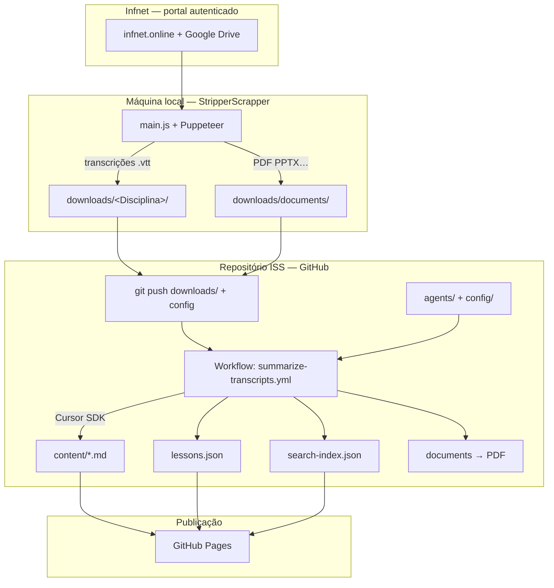
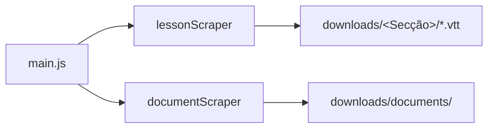
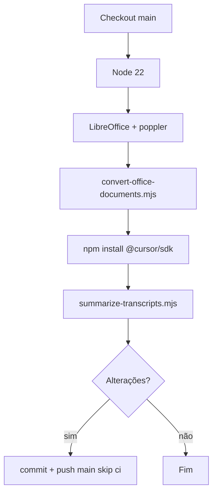
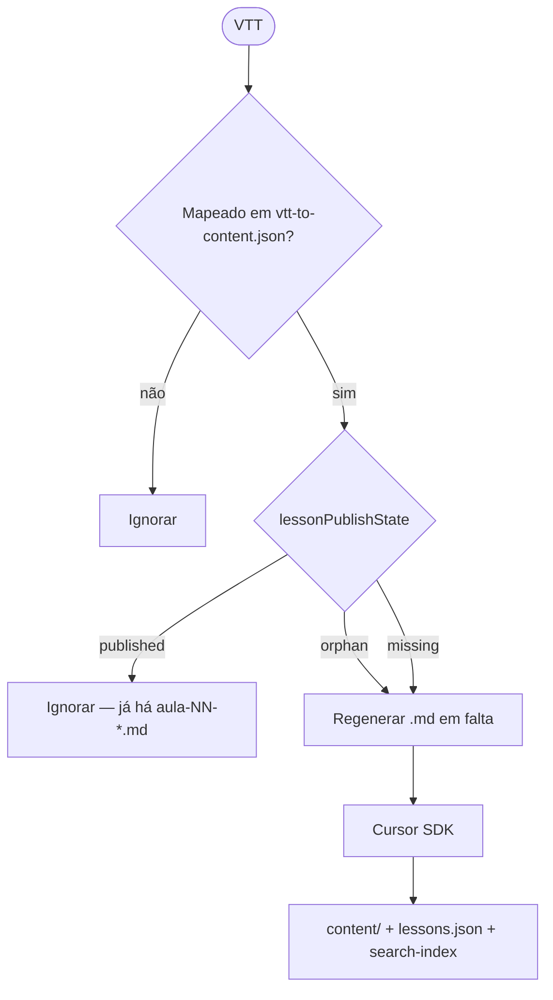
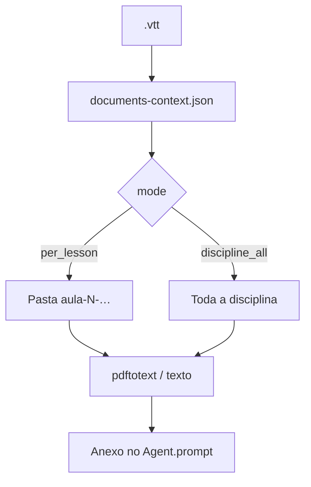
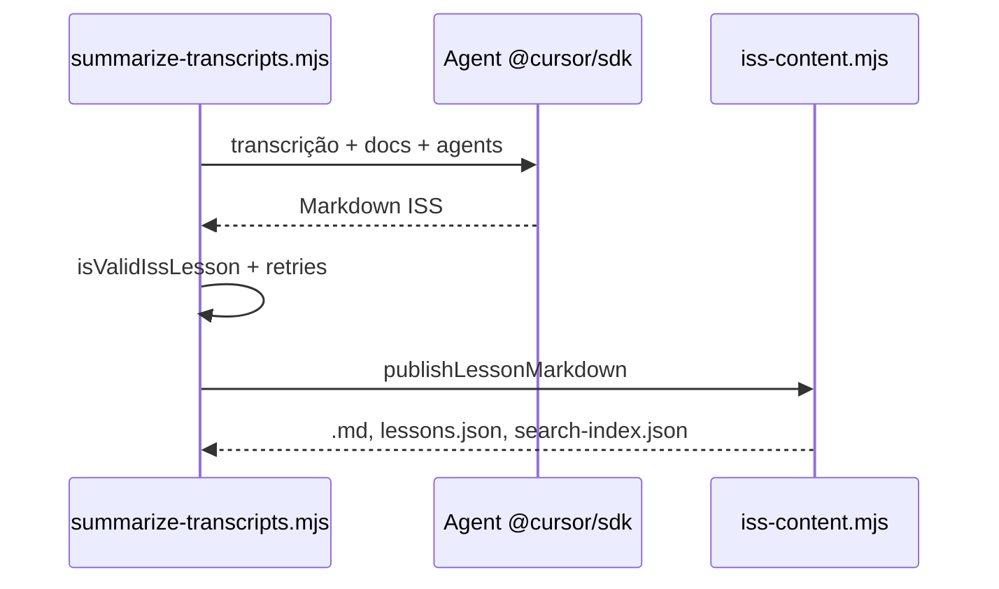
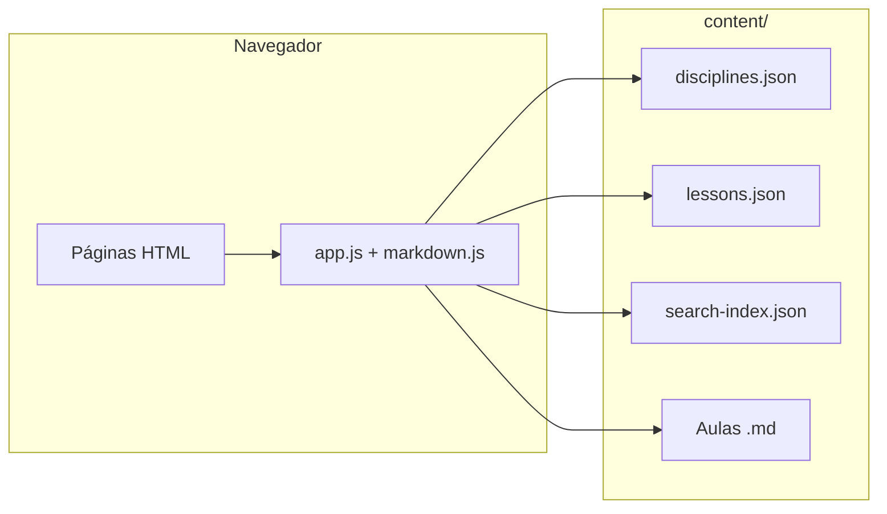
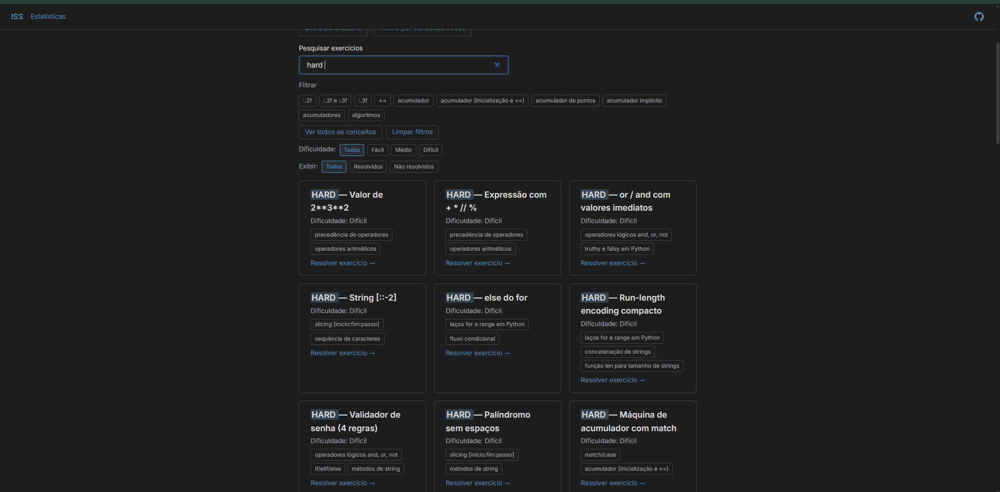
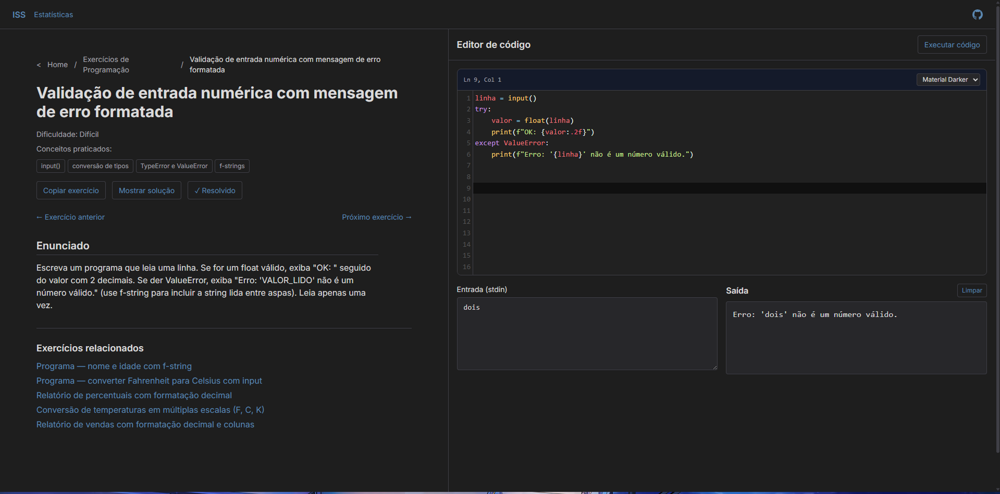

<p align="center">
  
</p>

#  ISS — Infet Students Summary

**Versão online:** [gaabdevweb.github.io/ISS](https://gaabdevweb.github.io/ISS/)

> Teoria que vira código. Revisão que vira domínio.

O ISS é uma plataforma **estática** (HTML, CSS e JavaScript) para estudar no navegador: aulas em Markdown, exercícios, diagramas (Mermaid), realce de código e progresso em **localStorage**. O conteúdo vive em `content/`; a app faz `fetch()` e renderiza com Marked.js, Highlight.js e Mermaid.js.

Este repositório é o **hub oficial**: site + pasta `downloads/` (fontes) + pipeline **GitHub Actions** que transforma transcrições em lições publicadas — **sem editar lições à mão** depois de as fontes estarem versionadas.

**Documentação do site** (JSON, URLs, exercícios, contribuição manual): [`documentation.md`](documentation.md).

---

## Table of contents

- [Ecossistema: fluxo completo automático](#ecossistema-fluxo-completo-automático)
- [O que encontras aqui](#o-que-encontras-aqui)
- [Etapa 1 — StripperScrapper (`downloads/`)](#etapa-1--stripperscrapper-downloads)
- [Etapa 2 — Pipeline VTT → `content/` (GitHub Actions)](#etapa-2--pipeline-vtt--content-github-actions)
- [Etapa 3 — Site estático (GitHub Pages)](#etapa-3--site-estático-github-pages)
- [Operação: secrets, workflow e logs](#operação-secrets-workflow-e-logs)
- [Screenshots](#screenshots)
- [Começar localmente](#começar-localmente)
- [Arquitetura do site](#arquitetura-do-site)
- [Conteúdo: contribuição manual vs automática](#conteúdo-contribuição-manual-vs-automática)
- [Repositórios relacionados](#repositórios-relacionados)
- [Contribuir](#contribuir)

---

## Ecossistema: fluxo completo automático

Três peças encadeadas. Depois da **configuração inicial** (credenciais do portal no scraper, secret `CURSOR_API_KEY` no GitHub), a **geração de lições** e a **publicação no site** não exigem intervenção humana — só commits automáticos do bot ou push de `downloads/` quando o scraper corre.



| Fase | Onde corre | Entrada | Saída | Intervenção humana |
|------|------------|---------|-------|-------------------|
| **1. Extração** | [StripperScrapper](https://github.com/GaabDevWeb/STRIPPERscrapper) (repo separado, local) | Login Infnet | `downloads/**/*.vtt`, `downloads/documents/` | Uma vez: `.env` + sessão; depois idempotente |
| **2. Lições ISS** | GitHub Actions **neste** repo | VTT + docs + configs | `content/`, JSON, PDFs | **Nenhuma** por aula (bot comita) |
| **3. Leitura** | Browser (GitHub Pages) | `content/` | UI de estudo | Nenhuma |

Convenção de ficheiros de aula em `downloads/`: `Aula_NN_-_DDMMYYYY.vtt` — o `NN` vira `order` em `lessons.json`.

---

## O que encontras aqui

| Área | Descrição |
|------|-----------|
| **Home** | Disciplinas, filtro por trimestre, pesquisa ([`search-index.json`](content/search-index.json)) |
| **Aulas** | `aula.html?d=<disciplina>&a=<slug>` — catálogo em [`lessons.json`](content/lessons.json) |
| **Exercícios** | Frontmatter da aula e/ou [`content/exercises/`](content/exercises/) |
| **Progresso** | localStorage ([`public/js/state.js`](public/js/state.js)) |
| **`downloads/`** | Fontes brutas (VTT, documentos) para o pipeline |
| **`.github/`** | Workflow e scripts Node do pipeline |
| **`config/`** | Mapeamento disciplinas e contexto de documentos |
| **`agents/`** | Prompts do Cursor (contrato de lição ISS) |

---

## Etapa 1 — StripperScrapper (`downloads/`)

Ferramenta **local** (Node.js + Puppeteer) que replica o fluxo humano no portal **Infnet**: lista gravações, descarrega transcrições do Google Drive e documentos BuddyPress, organiza em disco.

**Repositório:** [STRIPPERscrapper](https://github.com/GaabDevWeb/STRIPPERscrapper) — documentação completa em `README.md` e `documentation.md` lá.



### O que faz

- **Aulas:** `.infnetci-recording-item` → link de transcrição → download → `downloads/<Secção>/` + `.md` com metadados.
- **Documentos:** percurso em `/documents/`, `fetch` autenticado → `downloads/documents/` (PDF, PPTX, XLSX, …).
- **Idempotência:** `downloads/manifest.json` evita reprocessar itens concluídos.

### Comandos essenciais

```bash
cp .env.example .env   # FACULDADE_USER, FACULDADE_PASS, …
npm install
npm start -- --all     # aulas + documentos
# ou: --lessons | --docs | --workers 4
```

| npm / CLI | Efeito |
|-----------|--------|
| `npm start -- --all` | Aulas e documentos (mesmo browser) |
| `npm start -- --lessons` | Só transcrições |
| `npm start -- --docs` | Só documentos |
| `--workers N` | Vários browsers em paralelo (2–4 recomendado) |
| `--headed` / `HEADLESS=0` | Browser visível (debug, MFA) |

### Saídas relevantes para o ISS

| Caminho | Conteúdo |
|---------|----------|
| `downloads/<NomeDaDisciplina>/` | `.vtt` (e `.md` auxiliar do scraper) |
| `downloads/documents/` | Árvore de PDFs e Office por disciplina/aula |
| `downloads/manifest.json` | Estado do scraper (não confundir com `lessons.json`) |

**Não commitar:** `.env`, `session.json`.

Depois de extrair, **versiona e faz push** de `downloads/` (e alterações em `downloads/documents/`) para **este** repositório ISS — isso dispara a etapa 2 (manualmente via push ou agendando scraper + push noutro job).

---

## Etapa 2 — Pipeline VTT → `content/` (GitHub Actions)

Corre **só no GitHub** (Node 22 + LibreOffice + `@cursor/sdk`). Não há script Python/local obrigatório no ISS.

### Passos do workflow

Ficheiro: [`.github/workflows/summarize-transcripts.yml`](.github/workflows/summarize-transcripts.yml)



| Step | Ação |
|------|------|
| Office→PDF | `.ppt`/`.pptx` em `downloads/documents/` → PDF; original removido se `replace_source: true` |
| Gerar | Para cada `.vtt`: contexto de docs → Cursor Agent → validação → publicação |
| Commit | `content/`, `config/`, `agents/…`, PDFs em `documents/` |

**Disparadores:** `workflow_dispatch` (manual) ou cron **domingo 06:00 UTC** (`max_files` default 5 no agendamento — use `0` para todos).

### Decisão por VTT (sem API se já publicado)



- **Publicado:** existe `content/<content_dir>/aula-NN-*.md` (ou path em `lessons.json` no disco).
- **`discipline`** vem sempre de [`config/vtt-to-content.json`](config/vtt-to-content.json), não do modelo.
- **`force=1`** ou `TRANSCRIPT_SUMMARY_FORCE=1` — regenera mesmo já publicado.

### Scripts e config

| Caminho | Função |
|---------|--------|
| `.github/scripts/summarize-transcripts.mjs` | Orquestrador |
| `.github/scripts/iss-content.mjs` | Publicação e catálogo |
| `.github/scripts/document-context.mjs` | Contexto + conversão Office |
| `.github/scripts/convert-office-documents.mjs` | Passo em lote de conversão |
| `config/vtt-to-content.json` | Pasta `downloads/` → `discipline` + `content_dir` |
| `config/documents-context.json` | `per_lesson` vs `discipline_all`, `office_to_pdf` |
| `agents/content-summary-*.md` | Contrato pedagógico do Agent |

### Contexto de documentos no prompt



Limites no workflow: `DOCUMENT_CONTEXT_MAX_CHARS=80000`, `DOCUMENT_CONTEXT_MAX_FILE_CHARS=25000`.

### Geração e publicação



---

## Etapa 3 — Site estático (GitHub Pages)

O site **só lê** `content/`. Não executa o pipeline. Após o bot comitar em `main`, o GitHub Pages serve as lições novas.



Detalhes de roteamento, frontmatter e exercícios: [`documentation.md`](documentation.md).

---

## Operação: secrets, workflow e logs

### Configuração única (GitHub)

| Nome | Tipo | Obrigatório |
|------|------|-------------|
| `CURSOR_API_KEY` | Secret | Sim |
| `CURSOR_MODEL_ID` | Variable | Não |
| `DISCORD_WEBHOOK_URL` | Secret | Não (notificação no servidor Discord) |

Permitir **push do `github-actions[bot]`** em `main` (ou o passo de commit falha).

#### Notificação Discord

1. No Discord: canal → **Editar canal** → **Integrações** → **Webhooks** → copiar **URL do webhook**.
2. No GitHub: repositório ISS → **Settings** → **Secrets and variables** → **Actions** → **New repository secret**.
3. Nome: `DISCORD_WEBHOOK_URL` — valor: a URL completa (`https://discord.com/api/webhooks/...`).
4. Cada fim de workflow (sucesso, falha ou cancelamento) envia um embed com resumo VTT, estado do commit e link para o run.

Se o secret não existir, o passo é ignorado (o pipeline continua normalmente).

### Disparar o pipeline

1. **Actions** → **Resumir transcrições (Cursor SDK)** → **Run workflow**
2. Recomendado: `max_files` = **`0`**, `force` = **`0`**

### Variáveis de ambiente (step Gerar)

| Variável | Função |
|----------|--------|
| `TRANSCRIPT_SUMMARY_MAX_FILES` | `0` = todos os VTT |
| `TRANSCRIPT_SUMMARY_FORCE` | `1` = ignorar skip |
| `TRANSCRIPT_SUMMARY_MAX_ATTEMPTS` | Retries de validação (default 3) |
| `DOCUMENT_CONTEXT_MAX_*` | Limites de anexos |

### Ler o log

| Linha | Significado |
|-------|-------------|
| `[vtt] Ignorar (já publicado)` | Sem chamada à API |
| `[vtt] A regenerar (ficheiro em falta)` | Órfão — vai gerar |
| `[vtt] A gerar` | Nova lição ou forçada |
| `Publicados: 0 \| ignorados (catálogo): N` | Catálogo em dia |

### Cadeia operacional típica (100% automática após setup)

1. **Agendar ou correr** StripperScrapper → atualiza `downloads/`.
2. **Push** para `main` do ISS (só `downloads/` se nada mais mudou).
3. **Workflow** gera só o que falta em `content/` e comita.
4. **GitHub Pages** passa a servir as aulas novas.

Nenhum passo exige editar Markdown de lição à mão.

---

## Screenshots

<details>
<summary><b>Tela inicial e busca</b></summary>
<br>
<p align="center">
  
</p>
<p align="center">
  
</p>
</details>

<details>
<summary><b>Renderização de conceitos (código e diagramas)</b></summary>
<br>
<p align="center">
  
</p>
</details>

<details>
<summary><b>Aula e exercícios embutidos</b></summary>
<br>
<p align="center">
  
</p>
<p align="center">
  
</p>
<p align="center">
  
</p>
</details>

<details>
<summary><b>Progresso e estatísticas</b></summary>
<br>
<p align="center">
  
</p>
</details>

---

## Começar localmente

Servidor HTTP estático na **raiz** do repositório:

```bash
python -m http.server 8000
```

ou

```bash
npx serve .
```

Abre `http://localhost:8000` e usa `index.html`. O caminho de `content/` ajusta-se em [`public/js/content.js`](public/js/content.js).

---

## Arquitetura do site

Ficheiros-chave: [`public/js/app.js`](public/js/app.js), [`public/js/router.js`](public/js/router.js), [`public/js/markdown.js`](public/js/markdown.js).

---

## Conteúdo: contribuição manual vs automática

### Automático (preferido para aulas com VTT)

1. StripperScrapper preenche `downloads/`.
2. Workflow publica em `content/` + `lessons.json` + `search-index.json`.

### Manual (exceção)

1. Disciplina em [`content/disciplines.json`](content/disciplines.json).
2. `.md` em `content/<disciplina>/` + entrada em [`content/lessons.json`](content/lessons.json).
3. Opcional: [`content/search-index.json`](content/search-index.json).

Chave canónica: **`(discipline, slug)`** única. Ver [`documentation.md`](documentation.md).

---

## Repositórios relacionados

| Repositório | Papel |
|-------------|--------|
| **ISS** (este) | Site + `downloads/` versionado + pipeline GHA + `content/` |
| **[STRIPPERscrapper](https://github.com/GaabDevWeb/STRIPPERscrapper)** | Extração local Infnet → `downloads/` |
| **ActionTests** (legado / espelho) | Desenvolvimento do pipeline; integração canónica é **neste** ISS |

---

## Contribuir

1. Fork do repositório.
2. Branch (`git checkout -b feature/descricao-curta`).
3. PR com descrição clara (UI, conteúdo manual, ou melhorias ao pipeline).

Projeto de apoio à revisão — **INFNET**. Melhorias de texto, diagramas, aulas e exercícios são bem-vindas.

Stack do site e checklist: [`documentation.md`](documentation.md).
