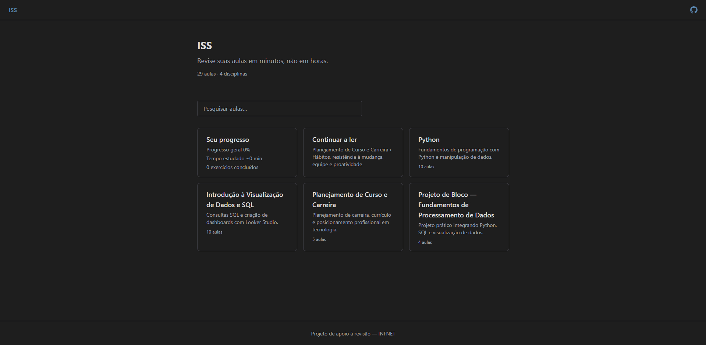
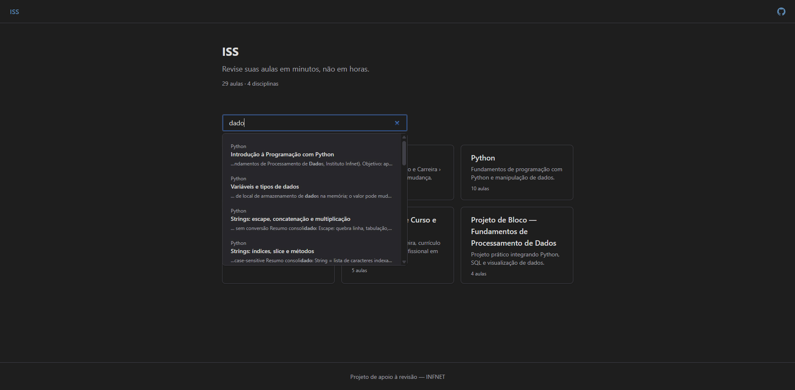
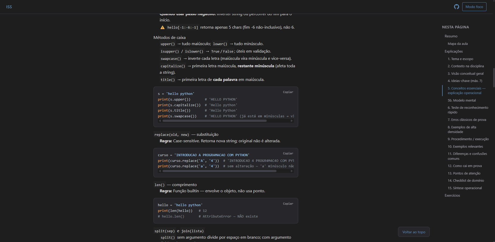
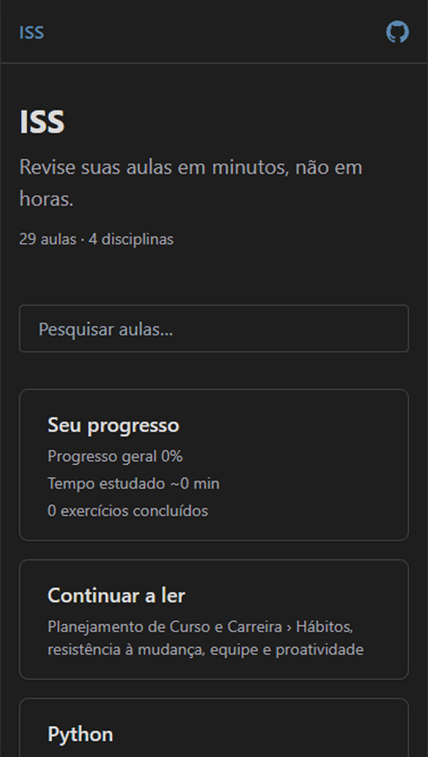

# ISS — Infet Students Summary

> **Revise suas aulas em minutos, não em horas.**

Plataforma de apoio à revisão de conteúdo para estudantes do **INFNET**, reunindo resumos consolidados de aulas em formato web: navegação por disciplinas, pesquisa em tempo real e acompanhamento de progresso.

---

## 🌐 Acesso

| Recurso | Link |
|--------|------|
| **Aplicação na web** | [https://gaabdevweb.github.io/ISS/](https://gaabdevweb.github.io/ISS/) |
| **Repositório** | [GitHub — GaabDevWeb/ISS](https://github.com/GaabDevWeb/ISS) |

---

## 📸 Interface

### Página inicial

Tela principal com slogan, estatísticas da biblioteca (aulas e disciplinas) e cards das disciplinas disponíveis.



---

### Pesquisa

Busca em tempo real nas aulas. Os resultados são agrupados por disciplina e exibidos em dropdown abaixo do campo de pesquisa.



---

### Disciplina e conteúdo

Listagem de aulas de uma disciplina, com breadcrumb, progresso e tempo estimado. Ao abrir uma aula, o conteúdo em Markdown é renderizado com índice lateral (“Nesta página”) e destaque de código.



---

### Responsividade

Layout adaptado para diferentes larguras de tela (desktop e mobile).

| Desktop | Mobile |
|---------|--------|
|  |  |

---

## ⚙️ Detalhes técnicos

### Arquitetura

- **Multi-página**: três HTMLs (`index.html`, `disciplina.html`, `aula.html`) com navegação via `location.href`. Sem framework SPA; roteamento por query string.
- **Conteúdo estático**: aulas em Markdown (`.md`) e metadados em JSON; carregados em runtime com `fetch`. Nenhum build ou bundler — o site pode ser servido como ficheiros estáticos (ex.: GitHub Pages).
- **Páginas**:
  - **Home**: carrega `disciplines.json` + `lessons.json` + `search-index.json`; monta cards e liga a pesquisa.
  - **Disciplina**: recebe `?d=<slug>`; filtra aulas por disciplina e lista com progresso/tempo.
  - **Aula**: recebe `?d=<slug>&a=<slug>`; faz fetch do `.md` correspondente, converte para HTML (Markdown) e monta o índice lateral a partir dos cabeçalhos.

### Modelo de dados

| Ficheiro | Função |
|----------|--------|
| `content/disciplines.json` | Lista de disciplinas: `slug`, `title`, `description`, `professor`, `order`. |
| `content/lessons.json` | Lista de aulas: `discipline`, `slug`, `title`, `order`, `file` (nome do `.md`). |
| `content/search-index.json` | Índice de pesquisa: `discipline`, `slug`, `excerpt` (texto para busca). |

Cada aula vive em `content/<disciplina>/<file>`, por exemplo `content/python/aula-01-introducao.md`.

### Roteamento

- **Parâmetros de URL**:
  - `d` — slug da disciplina (ex.: `python`, `planejamento-curso-carreira`).
  - `a` — slug da aula (ex.: `variaveis-tipos`); usado apenas em `aula.html`.
- **Navegação**: `Router.navigateToDisciplina(slug)`, `Router.navigateToAula(disciplineSlug, lessonSlug)`, `Router.navigateHome()`; leitura com `Router.getParam(name)`.

### Pesquisa

- A pesquisa usa `search-index.json`: cada entrada tem `discipline`, `slug` e `excerpt`.
- Filtro no cliente: compara o termo (mín. 2 caracteres) com `title` da aula, `title`/`professor` da disciplina e `excerpt`; resultados agrupados por disciplina e exibidos em dropdown.
- Sem servidor de busca: tudo em memória após o carregamento inicial.

### Estado (localStorage)

| Chave | Uso |
|-------|-----|
| `iss-last-visited` | Última aula visitada `{ discipline, lesson }` para “Continuar a ler”. |
| `iss-read-lessons` | Array de IDs `discipline_slug` para marcar aulas como lidas e calcular progresso. |
| `iss-reviewed-exercises` | Set de IDs de exercícios marcados como revistos. |

O progresso (percentagem, tempo estimado) é derivado das aulas marcadas como lidas e dos metadados em `lessons.json` (e duração padrão quando não definida).

---

## 🛠 Stack e estrutura

| Área | Tecnologias / convenções |
|------|---------------------------|
| **Front-end** | HTML5, CSS3, [Tailwind CSS](https://tailwindcss.com/) (CDN), JavaScript (vanilla) |
| **Conteúdo** | Markdown (aulas em `.md`), JSON (`lessons.json`, `disciplines.json`) |
| **Syntax highlight** | [highlight.js](https://highlightjs.org/) (páginas de aula) |
| **Fontes** | [Inter](https://fonts.google.com/specimen/Inter) (Google Fonts) |

Estrutura resumida:

```
ISS/
├── index.html          # Home, pesquisa e listagem de disciplinas
├── disciplina.html     # Página de uma disciplina (lista de aulas)
├── aula.html           # Página de uma aula (conteúdo em Markdown)
├── css/
│   ├── styles.css      # Estilos customizados (tema, layout)
│   └── images/         # Screenshots e assets
├── js/
│   ├── app.js          # Inicialização e orquestração
│   ├── router.js       # Roteamento (SPA-like)
│   ├── content.js      # Carregamento de conteúdo
│   ├── read-lessons.js # Leitura de aulas e disciplinas
│   └── reviewed.js     # Estado de “revisado” (progresso)
├── content/
│   ├── lessons.json    # Metadados das aulas
│   ├── disciplines.json# Metadados das disciplinas
│   ├── search-index.json
│   ├── python/         # Aulas de Python
│   ├── visualizacao-sql/
│   ├── planejamento-curso-carreira/
│   └── projeto-bloco/
└── agents/             # Scripts/agentes para geração de conteúdo
```

---

## 📚 Disciplinas

| Disciplina | Descrição | Aulas |
|------------|-----------|-------|
| **Python** | Fundamentos de programação com Python e manipulação de dados | 10 |
| **Introdução à Visualização de Dados e SQL** | Consultas SQL e dashboards com Looker Studio | 10 |
| **Planejamento de Curso e Carreira** | Carreira, currículo e posicionamento em tecnologia | 5 |
| **Projeto de Bloco — Fundamentos de Processamento de Dados** | Projeto integrando Python, SQL e visualização | 4 |

*(Valores sujeitos a alteração conforme `content/lessons.json` e `content/disciplines.json`.)*

---

## 🚀 Executar localmente

1. **Clonar o repositório**
   ```bash
   git clone https://github.com/GaabDevWeb/ISS.git
   cd ISS
   ```

2. **Servir os arquivos (HTTP)**  
   O projeto usa caminhos relativos e carrega JSON/Markdown via `fetch`; é necessário um servidor HTTP (não abrir `index.html` direto como ficheiro).

   **Exemplo com Python:**
   ```bash
   # Python 3
   python -m http.server 8000
   ```
   Depois abrir: [http://localhost:8000](http://localhost:8000).

   **Exemplo com Node (npx):**
   ```bash
   npx serve .
   ```

3. **Ou publicar no GitHub Pages**  
   Branch `main` (ou `gh-pages`) com a raiz do projeto como origem do site, resultando em um endereço como `https://<user>.github.io/ISS/`.

---

## 📄 Licença e créditos

- **Projeto de apoio à revisão — INFNET**
- Conteúdo e estrutura sujeitos aos termos do curso e da instituição.


