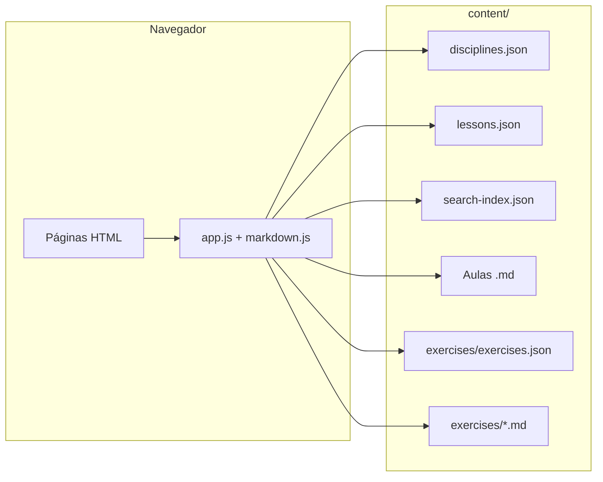

<p align="center">
  
</p>

#  ISS — Infet Students Summary

**Versão online:** [gaabdevweb.github.io/ISS](https://gaabdevweb.github.io/ISS/)

> Teoria que vira código. Revisão que vira domínio.

O ISS é uma plataforma **estática** (HTML, CSS e JavaScript) para estudar no navegador: aulas em Markdown, exercícios, diagramas (Mermaid), realce de código e progresso guardado em **localStorage** — sem backend nem build obrigatório. O conteúdo vive em `content/` (JSON + ficheiros `.md`); a aplicação faz `fetch()` e renderiza com Marked.js, Highlight.js e Mermaid.js.

**Documentação técnica completa** (arquitetura, JSON, URLs, como adicionar aulas, evitar duplicados, pesquisa, exercícios): veja **[`documentation.md`](documentation.md)**.

---

## Table of contents

- [O que encontras aqui](#o-que-encontras-aqui)
- [Screenshots](#screenshots)
- [Começar localmente](#começar-localmente)
- [Arquitetura em uma página](#arquitetura-em-uma-página)
- [Conteúdo: o essencial para contribuir](#conteúdo-o-essencial-para-contribuir)
- [Contribuir](#contribuir)

---

## O que encontras aqui

| Área | Descrição |
|------|-----------|
| **Home** | Disciplinas, filtro por trimestre (1.º / 2.º / ambos), pesquisa por título, disciplina, professor e excertos em [`search-index.json`](content/search-index.json) |
| **Aulas** | Roteamento `aula.html?d=<disciplina>&a=<slug>`; registo canónico em [`lessons.json`](content/lessons.json) |
| **Exercícios** | Embutidos no frontmatter da aula e/ou banco em [`content/exercises/`](content/exercises/) |
| **Progresso** | Aulas lidas, exercícios concluídos, checklists, revisões — tudo no browser ([`public/js/state.js`](public/js/state.js)) |

---

## Screenshots

<details>
<summary><b>Tela inicial e busca</b></summary>
<br>
<p align="center">
  
</p>
<p align="center">
  
</p>
</details>

<details>
<summary><b>Renderização de conceitos (código e diagramas)</b></summary>
<br>
<p align="center">
  
</p>
</details>

<details>
<summary><b>Aula e exercícios embutidos</b></summary>
<br>
<p align="center">
  
</p>
<p align="center">
  
</p>
<p align="center">
  
</p>
</details>

<details>
<summary><b>Progresso e estatísticas</b></summary>
<br>
<p align="center">
  
</p>
</details>

---

## Começar localmente

Servidor HTTP estático na **raiz** do repositório:

```bash
python -m http.server 8000
```

ou

```bash
npx serve .
```

Abre `http://localhost:8000` (ou a porta indicada) e usa `index.html` como entrada. O caminho base do conteúdo (`content/` vs `../content`) ajusta-se automaticamente consoante a página esteja na raiz ou sob `public/` — ver [`public/js/content.js`](public/js/content.js).

---

## Arquitetura em uma página



Ficheiros-chave: [`public/js/app.js`](public/js/app.js) (home, disciplina, aula), [`public/js/router.js`](public/js/router.js) (query `d`, `a`, `slug`), [`public/js/markdown.js`](public/js/markdown.js) (frontmatter + render). Detalhes e diagrama de sequência ao abrir uma aula: **[`documentation.md`](documentation.md)**.

---

## Conteúdo: o essencial para contribuir

1. **Nova disciplina** — entrada em [`content/disciplines.json`](content/disciplines.json) (`slug`, `title`, `order`, `trimester`, …).
2. **Nova aula** — ficheiro em `content/<disciplina>/…md` **e** registo em [`content/lessons.json`](content/lessons.json) (`discipline`, `slug`, `title`, `order`, `file`). A navegação usa o JSON; o frontmatter do `.md` não substitui este registo.
3. **Evitar duplicados** — chave lógica **`(discipline, slug)`** deve ser única em `lessons.json`; confirma que `file` aponta para um path real.
4. **Pesquisa na home** — opcional mas recomendado: entrada em [`content/search-index.json`](content/search-index.json) com o par `discipline` / `slug` e um `excerpt` pesquisável.
5. **Exercício isolado** — `.md` em [`content/exercises/`](content/exercises/) + linha em [`content/exercises/exercises.json`](content/exercises/exercises.json) (`slug` único no array).

Checklist completo e exemplos: **[`documentation.md`](documentation.md)** (secções *Como adicionar uma nova aula*, *Como verificar se uma aula já existe*, *Exercícios independentes*).

---

## Contribuir

1. Faça fork do repositório.
2. Crie uma branch (`git checkout -b feature/descricao-curta`).
3. Commit com mensagem clara; push e abra um Pull Request com o que mudou (conteúdo, correções, UI).

Projeto de apoio à revisão — **INFNET**. Melhorias de texto, diagramas, aulas e exercícios são bem-vindas.

---

Stack e convenções de conteúdo: [`documentation.md`](documentation.md).
