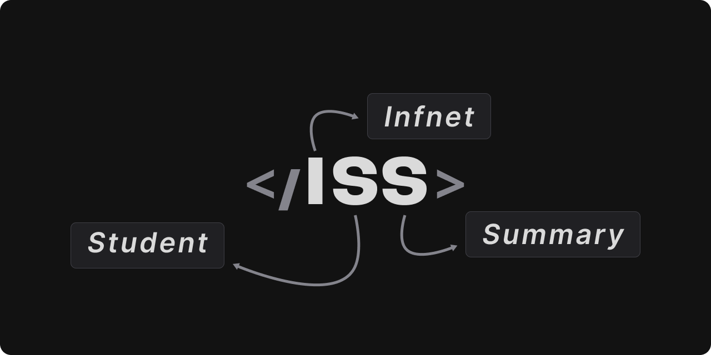
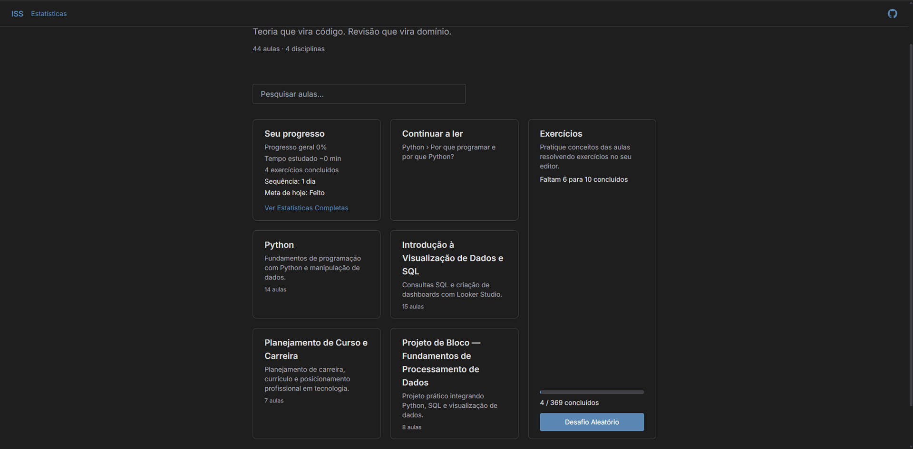
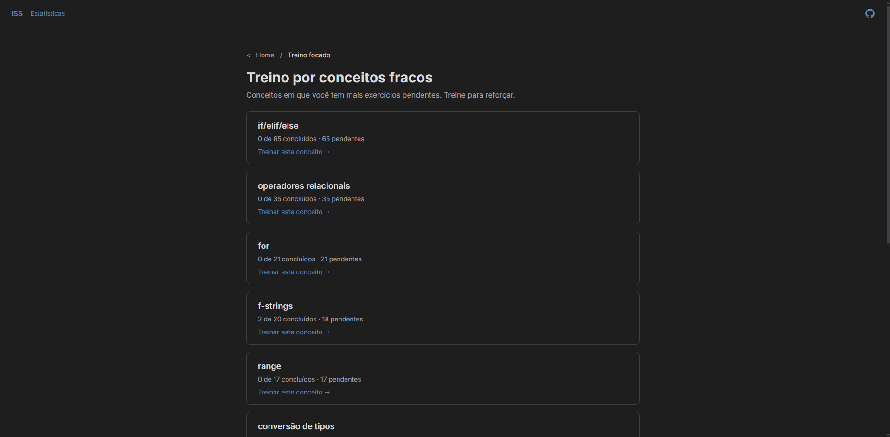
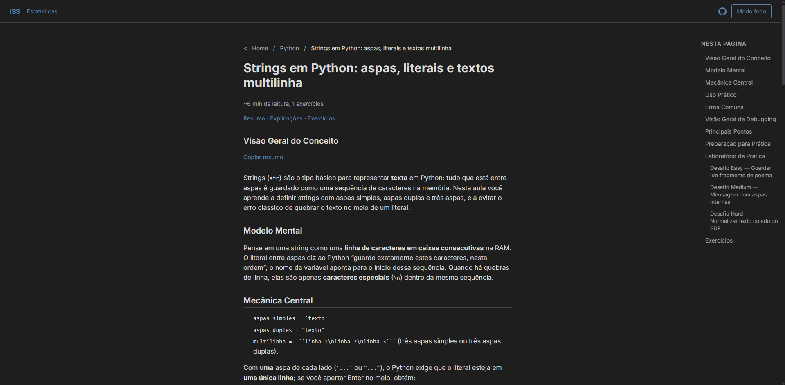
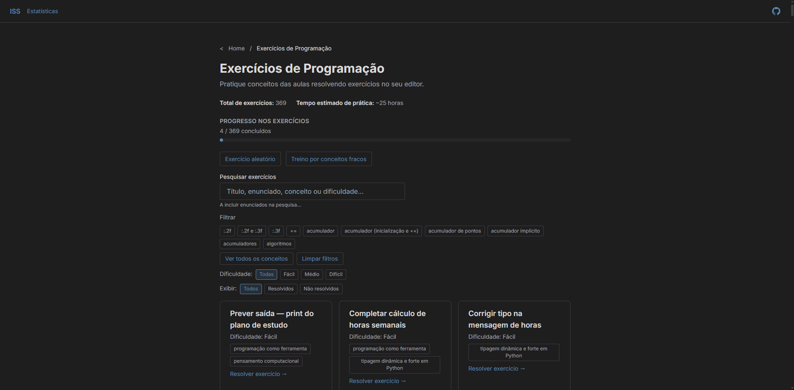
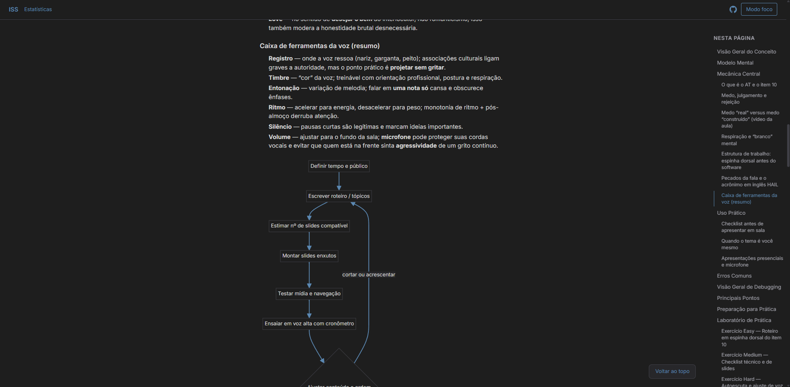
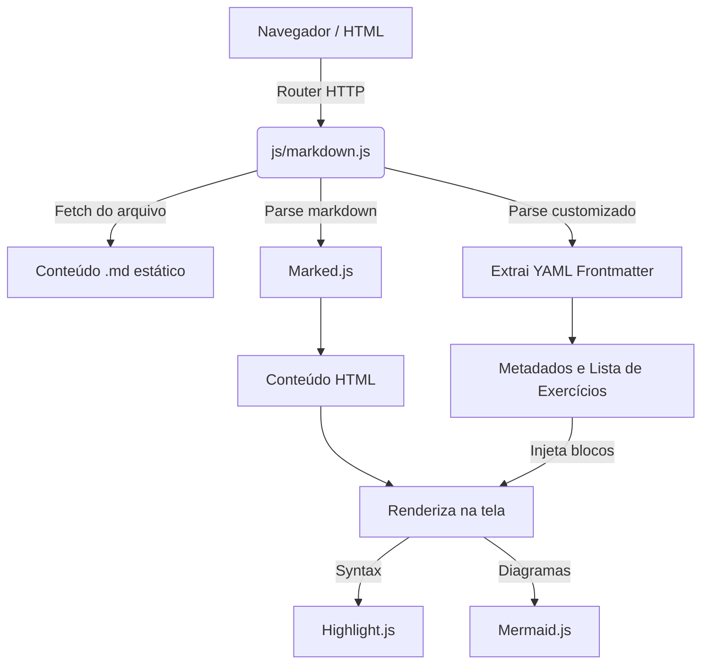
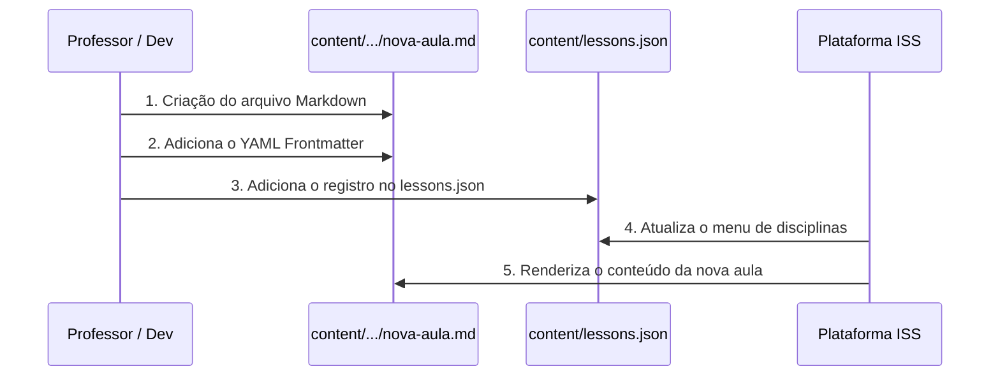

<p align="center">
  
</p>

#  ISS - Plataforma Interativa de Estudos

**Acesse a versão web do projeto online: [https://gaabdevweb.github.io/ISS/](https://gaabdevweb.github.io/ISS/)**

Bem-vindo ao repositório do projeto ISS. Este é um sistema web desenvolvido com foco puramente acadêmico e de engajamento, permitindo a leitura de aulas em formato Markdown, a exploração de conceitos técnicos e a resolução interativa de exercícios diretamente no navegador.

Nosso principal diferencial é a integração profunda de **materiais de estudo de qualidade** e uma **ampla gama de exercícios práticos**. Todo o conteúdo é facilmente gerenciado e expandido.

---

## Funcionalidades e Materiais de Estudo

Todo o ambiente foi projetado para facilitar a busca e assimilação do conhecimento. Logo na página principal, você tem acesso às disciplinas e trilhas de aprendizado, com uma busca eficiente que encontra termos diretamente nos conteúdos.

<details>
  <summary><b>Visualizar: Tela Inicial e Busca</b></summary>
  <br>
  <p align="center">
    
  </p>
  <p align="center">
    
  </p>
</details>

Explorando os diversos tópicos na plataforma, há ênfase completa no detalhamento dos assuntos, suportando formatação rica em código e até diagramas visuais, reforçando o aprendizado de forma prática e interativa.

<details>
  <summary><b>Visualizar: Renderização de Conceitos</b></summary>
  <br>
  <p align="center">
    
  </p>
</details>

---

## Ênfase em Aulas e Exercícios

A verdadeira potência do sistema reside no ambiente focado para o aluno. O design da aula isola distrações, focando no que realmente importa: **O conteúdo e a prática imediata.**

<details>
  <summary><b>Visualizar: Ambiente de Aula</b></summary>
  <br>
  <p align="center">
    
  </p>
</details>

Ao final de cada tópico e material teórico, a plataforma exibe blocos de exercícios para solidificar o entendimento. O aluno pode testar seus conhecimentos e, quando necessário, visualizar a resposta sugerida ou dicas para resolver a questão.

<details>
  <summary><b>Visualizar: Interação com Exercícios</b></summary>
  <br>
  <p align="center">
    
  </p>
  <p align="center">
    
  </p>
</details>

---

## Acompanhamento e Estatísticas

O progresso não é esquecido. A plataforma armazena o controle de exercícios revisados e aulas concluídas, permitindo visualizar um acompanhamento através de gráficos na página de estatísticas, engajando e mantendo a motivação em alta.

<details>
  <summary><b>Visualizar: Gráficos de Progresso</b></summary>
  <br>
  <p align="center">
    
  </p>
</details>

---

## Guia Técnico

A seguir, informações detalhadas para desenvolvedores e mantenedores do projeto sobre sua arquitetura e modo de funcionamento.



### Como Rodar o Projeto Localmente

Por se tratar de um projeto composto majoritariamente de arquivos estáticos (HTML, CSS e JavaScript client-side), não é necessária a instalação de um backend complexo ou banco de dados. Qualquer servidor HTTP estático servirá de ambiente.

1. Clone este repositório para sua máquina.
2. Navegue até o diretório raiz do projeto.
3. Inicie um servidor local. Algumas opções comuns incluem:
   - **Python:** Rode `python -m http.server 8000` (ou `python3 -m http.server 8000`).
   - **Node.js (serve):** Rode `npx serve .`
   - **VS Code:** Utilize a extensão *Live Server* e clique em *Go Live*.
4. Acesse pelo navegador a porta disponibilizada pelo servidor (geralmente `http://localhost:8000` ou `http://localhost:3000`).

### Como Adicionar Novas Aulas

As aulas são gerenciadas através de arquivos Markdown e registradas em um arquivo JSON.



1. Crie seu arquivo Markdown com a aula em `content/<nome-da-disciplina>/nova-aula.md`.
2. Adicione o cabeçalho (Frontmatter) em YAML no topo do arquivo `.md`. Por exemplo:
   ```yaml
   ---
   title: "Título da sua Aula"
   readingMinutes: 10
   ---
   Conteúdo em markdown...
   ```
3. Registre a aula editando o arquivo `content/lessons.json`:
   ```json
   {
     "discipline": "nome-da-disciplina",
     "slug": "nova-aula",
     "title": "Título da sua Aula",
     "order": 99,
     "file": "nome-da-disciplina/nova-aula.md"
   }
   ```

### Como Adicionar Novos Exercícios

Existem duas formas principais para adicionar exercícios, garantindo forte acoplamento com a teoria.

**1. Embutidos na Própria Aula:**
Você pode adicionar uma lista de exercícios no Frontmatter YAML do próprio arquivo `.md` da aula:
```yaml
---
title: "Minha Aula"
exercises:
  - question: "Qual é o objetivo principal?"
    answer: "O objetivo é..."
    hint: "Lembre da introdução..."
---
Conteúdo do markdown.
```
O script `markdown.js` fará a injeção em bloco no final da página automaticamente.

**2. Arquivos de Treinamento e Testes Isolados:**
Se desejar que o exercício seja listado de maneira independente em um banco de questões, você pode criar um arquivo `.md` diretamente dentro de `content/exercises/` e configurar metadados específicos que a plataforma compila no banco local.

### Estrutura de Pastas

A organização prioriza a separação das responsabilidades entre estáticos, lógicas e definições de conteúdo.

- `/css/`: Todos os estilos globais e imagens da plataforma (incluindo as capturas de tela desta documentação).
- `/js/`: Toda a lógica em vanilla JavaScript. Abriga regras de renderização (`markdown.js`), controle de estado, avaliador de código (`code-runner.js`) e lógicas de visualização.
- `/content/`: Contém os diretórios das disciplinas com as aulas em `.md` e os arquivos JSON base, como o `lessons.json`, `disciplines.json` e o sumário `search-index.json`.
- `/Aulas/`: Estrudo histórico ou diretório extra contendo recursos legados ou secundários de estudos adicionais.
- Arquivos `.html` na raiz: Constituem os pontos de entrada do sistema (`index.html`, `aula.html`, `exercise.html`, `stats.html`, etc).

### Como é Renderizado o Markdown no Browser

O projeto opta por não ter rotas estáticas pré-compiladas (SSG). Em vez disso, a renderização ocorre em tempo de execução no lado do cliente:

1. Quando a página `aula.html?d=disciplina&a=aula-slug` é aberta, a aplicação identifica os parâmetros da URL.
2. Uma requisição `fetch()` assíncrona é disparada para capturar o conteúdo do arquivo `.md` correto contido na pasta `/content/`.
3. O script interno `js/markdown.js` processa o conteúdo cru:
   - Extrai o cabeçalho `YAML` (Frontmatter) manualmente para processar os metadados (título, tempo de leitura) e lista de exercícios.
   - Todo o corpo de texto subsequente é passado pela biblioteca **Marked.js**, que converte as diretrizes Markdown reais em `HTML`.
4. Após injetado no DOM, outras bibliotecas entram em ação:
   - **Highlight.js** é executado para os blocos syntax highlighting do código-fonte.
   - **Mermaid.js** é avaliado caso existam blocos definidos como linguagem `mermaid`, renderizando diagramas estruturais SVG no momento.
   - Os exercícios extraídos são compilados como marcação `<details>/<summary>` do HTML puro e anexados ao rodapé.

---

Este projeto é constantemente evoluído. Sinta-se à vontade para navegar pelos códigos e pelos subdiretórios para maiores esclarecimentos sobre a arquitetura.
