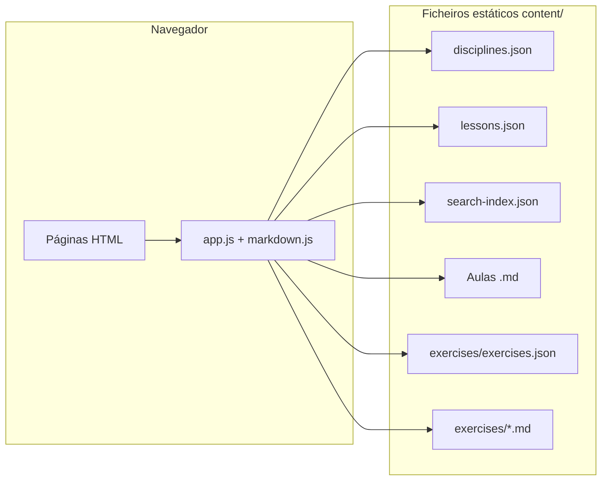
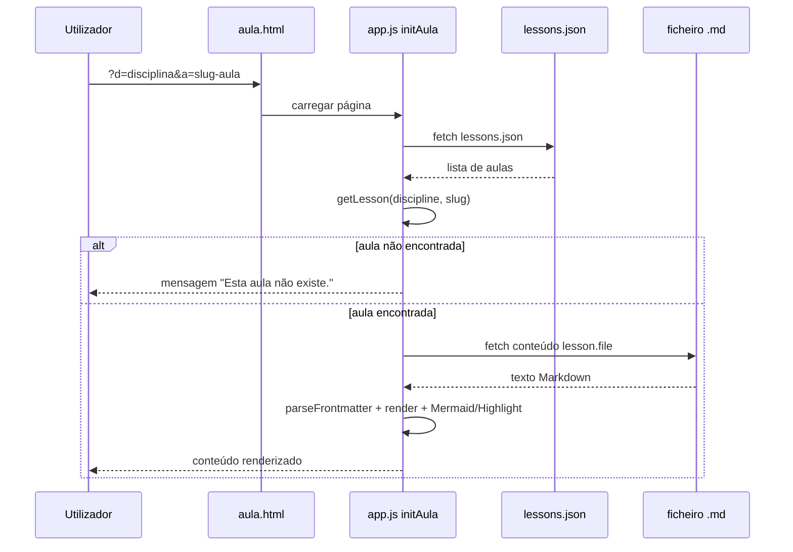

# ISS — Documentação técnica do projeto

> **Infet Students Summary**: plataforma estática (HTML, CSS, JavaScript) para leitura de aulas em Markdown, exercícios e acompanhamento de progresso no navegador (localStorage).

## Índice

- [Visão geral](#visão-geral)
- [Arquitetura e fluxo](#arquitetura-e-fluxo)
- [Estrutura de pastas](#estrutura-de-pastas)
- [Dados de conteúdo (JSON)](#dados-de-conteúdo-json)
- [Como adicionar uma nova aula](#como-adicionar-uma-nova-aula)
- [Como verificar se uma aula já existe](#como-verificar-se-uma-aula-já-existe)
- [Markdown das aulas (frontmatter e corpo)](#markdown-das-aulas-frontmatter-e-corpo)
- [Índice de pesquisa (`search-index.json`)](#índice-de-pesquisa-search-indexjson)
- [Trilha opcional (`study-path.json`)](#trilha-opcional-study-pathjson)
- [Exercícios independentes](#exercícios-independentes)
- [URLs e roteamento](#urls-e-roteamento)
- [Estado local (progresso do utilizador)](#estado-local-progresso-do-utilizador)
- [Executar o projeto localmente](#executar-o-projeto-localmente)
- [Checklist de contribuição](#checklist-de-contribuição)

---

## Visão geral

O ISS não usa backend nem build step obrigatório: o browser faz `fetch()` a ficheiros em `content/` (JSON + Markdown) e renderiza com **Marked.js**, **Highlight.js** e **Mermaid.js**. A navegação entre páginas usa ficheiros em `public/` (ex.: `aula.html`, `disciplina.html`) e parâmetros de query string.

**Repositório público referenciado na UI:** [https://github.com/GaabDevWeb/ISS](https://github.com/GaabDevWeb/ISS)

---

## Arquitetura e fluxo

### Componentes

| Peça | Função |
|------|--------|
| `index.html` | Entrada principal (home, pesquisa, cartões por disciplina) |
| `public/js/content.js` | Carrega `disciplines.json`, `lessons.json`, `search-index.json`, Markdown, `exercises.json` |
| `public/js/router.js` | Monta URLs (`d=`, `a=`, `slug=`) e resolve paths (`public/` vs raiz) |
| `public/js/app.js` | `initHome`, `initDisciplina`, `initAula`; pesquisa; integração com estado |
| `public/js/markdown.js` | Parse de YAML frontmatter, render Markdown, exercícios embutidos, Mermaid |
| `public/js/state.js` | localStorage: aulas lidas, exercícios concluídos, checklists, revisões, streak |
| `public/js/exercises.js` | Listagem e página de exercício (editor, testes quando aplicável) |

### Diagrama de alto nível



### Fluxo ao abrir uma aula



---

## Estrutura de pastas

| Caminho | Conteúdo |
|---------|----------|
| `content/` | Disciplinas como subpastas (`python/`, `visualizacao-sql/`, …) com ficheiros `.md` |
| `content/disciplines.json` | Catálogo de disciplinas (título, slug, trimestre, ordem) |
| `content/lessons.json` | **Registo canónico** de todas as aulas (disciplina, slug, título, ordem, ficheiro) |
| `content/search-index.json` | Trechos por aula para enriquecer a pesquisa na home |
| `content/exercises/` | `exercises.json` + um `.md` por exercício listado |
| `public/` | HTML auxiliar, `css/`, `js/` |
| `public/js/` | Toda a lógica cliente |

A base de fetch é calculada em `content.js`: se o path da página contém `/public/`, usa `../content`; caso contrário, `content`.

---

## Dados de conteúdo (JSON)

### `content/disciplines.json`

Array de objetos. Campos usados na UI:

| Campo | Tipo | Descrição |
|-------|------|-----------|
| `slug` | string | Identificador estável (ex.: `python`) — deve coincidir com `lesson.discipline` |
| `title` | string | Nome apresentado |
| `description` | string | Texto do cartão na home |
| `professor` | string | Aparece nos resultados de pesquisa |
| `order` | number | Ordenação na home |
| `trimester` | `1`, `2` ou `[1, 2]` | Filtro “1º / 2º / Ambos” na home |

### `content/lessons.json`

Array ordenado pela app por `order` **por disciplina**. Cada entrada:

| Campo | Tipo | Descrição |
|-------|------|-----------|
| `discipline` | string | **Obrigatório.** Slug da disciplina (chave em `disciplines.json`) |
| `slug` | string | **Obrigatório.** Identificador da aula na URL (`a=`) — único **por disciplina** |
| `title` | string | Título na lista e na página |
| `order` | number | Ordem dentro da disciplina |
| `file` | string | Caminho do Markdown relativamente a `content/`, normalmente `disciplina/nome-ficheiro.md` |

A função `getLesson(lessons, disciplineSlug, lessonSlug)` procura **par** `(discipline, slug)`. Não há validação automática de duplicados no runtime: duas entradas com o mesmo par podem causar comportamento imprevisível; a primeira encontrada por `Array.prototype.find` “ganha”.

---

## Como adicionar uma nova aula

1. **Garantir disciplina**  
   O `slug` em `disciplines.json` deve existir. Se for disciplina nova, acrescente um objeto completo em `disciplines.json` **antes** de referenciar em `lessons.json`.

2. **Criar o ficheiro Markdown**  
   Caminho sugerido: `content/<slug-disciplina>/aula-XX-titulo-curto.md` (convenção do repositório; não é imposta pelo código).

3. **Registar em `content/lessons.json`**  
   Adicione um objeto ao array, com `discipline`, `slug`, `title`, `order` e `file` coerentes com o passo anterior.

4. **(Recomendado) Atualizar `content/search-index.json`**  
   Para a pesquisa na home incluir termos do corpo da aula, adicione uma entrada com chave lógica `discipline/slug` (ver secção [Índice de pesquisa](#índice-de-pesquisa-search-indexjson)).

5. **(Opcional) Trilha na página da disciplina**  
   Se existir `content/<disciplina>/study-path.json`, pode listar passos `lesson` ou `exercises` (ver secção [Trilha opcional](#trilha-opcional-study-pathjson)).

6. **Testar localmente**  
   Servidor HTTP estático na raiz do repo; abrir `disciplina.html?d=<slug>` e a nova aula, ou `aula.html?d=<slug>&a=<slug-aula>`.

**Exemplo mínimo de entrada em `lessons.json`:**

```json
{
  "discipline": "python",
  "slug": "minha-nova-aula",
  "title": "Título visível na plataforma",
  "order": 42,
  "file": "python/minha-nova-aula.md"
}
```

---

## Como verificar se uma aula já existe

### 1. Chave canónica: disciplina + slug

Uma aula “existe” na plataforma se existir em `lessons.json` um objeto cujo par `(discipline, slug)` corresponde ao que pretende usar. A URL será:

`public/aula.html?d=<discipline>&a=<slug>` (ou `aula.html?...` a partir da raiz, conforme o servidor).

### 2. Verificação no repositório (grep / editor)

- Abra `content/lessons.json` e procure `"slug": "o-seu-slug"` **junto** com `"discipline": "a-mesma-disciplina"`.
- O mesmo `slug` **pode** repetir-se noutra disciplina (URLs diferentes); só é problema se a intenção for URL globalmente única.

### 3. Verificação do ficheiro físico

- Confirme que o caminho em `file` existe sob `content/` (respeitando maiúsculas/minúsculas).

### 4. Duplicados acidentais

- Procure dois objetos com o **mesmo** `discipline` e **mesmo** `slug`: deve haver no máximo um.
- Slugs duplicados na **mesma** disciplina com `order` diferentes: erro de dados; remova ou renomeie.

### 5. Frontmatter vs `lessons.json`

Alguns `.md` incluem `slug:` no YAML. **Quem manda na navegação é `lessons.json`.** Se o frontmatter disser um slug e o JSON outro, a URL válida é a do JSON. Mantenha ambos alinhados para evitar confusão.

---

## Markdown das aulas (frontmatter e corpo)

O parser está em `public/js/markdown.js` (`parseFrontmatter`). Campos comuns observados no repositório:

| Chave | Uso |
|-------|-----|
| `title` | Metadados / consistência (o título principal na UI vem de `lessons.json`) |
| `slug`, `discipline`, `order` | Documentação; não substituem o registo em `lessons.json` |
| `reading_time` / `readingMinutes` | Informação pedagógica no frontmatter (nomes variam entre aulas) |
| `concepts` | Lista usada na página da aula para cruzar com exercícios |
| `exercises` | Lista de objetos com `question`, `answer`, `hint` — injetados como blocos `<details>` no final |
| `tests` | Estrutura YAML mais rica para cenários com casos de teste (quando usados) |

Blocos de código com linguagem `mermaid` são convertidos para diagramas. Listas sob um H3 que contém **“Checklist de domínio”** tornam-se checklist interativa com estado em localStorage.

---

## Índice de pesquisa (`search-index.json`)

A home (`initHome` em `app.js`) combina:

- título da aula (`lessons.json`);
- título da disciplina e nome do professor (`disciplines.json`);
- texto em `search-index.json` para cada par `discipline/slug`.

Cada elemento do índice tem a forma:

```json
{
  "discipline": "slug-da-disciplina",
  "slug": "slug-da-aula",
  "excerpt": "Texto longo ou resumo pesquisável…"
}
```

A chave interna é `` `${discipline}/${slug}` ``. Se faltar entrada para uma aula nova, a aula **continua acessível** por menu e URL, mas **só** será encontrada na pesquisa pelos campos título/disciplina/professor, não pelo corpo.

---

## Trilha opcional (`study-path.json`)

`fetchStudyPath(disciplineSlug)` em `content.js` tenta carregar `content/<disciplina>/study-path.json`. Se o array existir, `initDisciplina` mostra uma secção extra com passos:

- `{ "type": "lesson", "slug": "<slug da aula>" }` — liga à aula se o slug existir em `lessons.json` para essa disciplina;
- `{ "type": "exercises", "slugs": ["ex-1", "ex-2"] }` — liga a `exercise.html?slug=…`.

Se o ficheiro não existir, a funcionalidade fica omitida (comportamento normal).

---

## Exercícios independentes

Além dos exercícios no YAML da aula, o banco principal está em:

- `content/exercises/exercises.json` — metadados (`slug`, `title`, `difficulty`, `concepts`, `discipline`, `file`, `order`, …);
- `content/exercises/<ficheiro>.md` — enunciado em Markdown; secção **Solução** separa o texto de apoio.

Cada `slug` em `exercises.json` deve ser **único** no array. A página `exercise.html?slug=...` carrega o registo e o ficheiro referenciado.

Para **adicionar** um exercício novo: crie o `.md`, acrescente a entrada em `exercises.json`, e garanta que `discipline` corresponde a um slug em `disciplines.json` (para filtros e consistência).

---

## URLs e roteamento

| Página | Parâmetros |
|--------|------------|
| Home | `index.html` |
| Disciplina | `public/disciplina.html?d=<slug-disciplina>` |
| Aula | `public/aula.html?d=<slug-disciplina>&a=<slug-aula>` |
| Lista de exercícios | `public/exercises.html` |
| Exercício | `public/exercise.html?slug=<slug-exercício>` |

`Router.pagePath` prefixa `public/` quando a página atual não está sob `/public/`, para links corretos a partir da raiz.

---

## Estado local (progresso do utilizador)

Definido em `public/js/state.js` (chaves `localStorage` prefixadas `iss-`):

- Aulas lidas: `disciplineSlug + '_' + lessonSlug`;
- Exercícios concluídos, revisões, checklists por aula, streak de dias, conquistas.

Não há sincronização com servidor: limpar dados do site remove o progresso.

---

## Executar o projeto localmente

Na raiz do repositório, sirva ficheiros estáticos. Exemplos:

```bash
python -m http.server 8000
```

```bash
npx serve .
```

Abra o URL indicado (ex.: `http://localhost:8000`) e use `index.html` como entrada.

**Deploy GitHub Pages:** o site publicado costuma usar a raiz do repo; mantenha caminhos relativos como no código atual.

---

## Checklist de contribuição

- [ ] `disciplines.json` — disciplina referenciada existe e `slug` está correto  
- [ ] `lessons.json` — par `(discipline, slug)` único; `file` aponta para ficheiro existente  
- [ ] Markdown válido; frontmatter fechado com `---`  
- [ ] `search-index.json` atualizado se a pesquisa full-text for importante  
- [ ] Exercícios: `exercises.json` + `.md` coerentes, `slug` único  
- [ ] Testar `aula.html` e links “anterior / próxima” dentro da disciplina  
- [ ] Pull request com descrição clara (convenção do `README.md` do projeto)

---

*Documento gerado com base no código em `public/js/` e nos ficheiros em `content/` do repositório ISS.*
