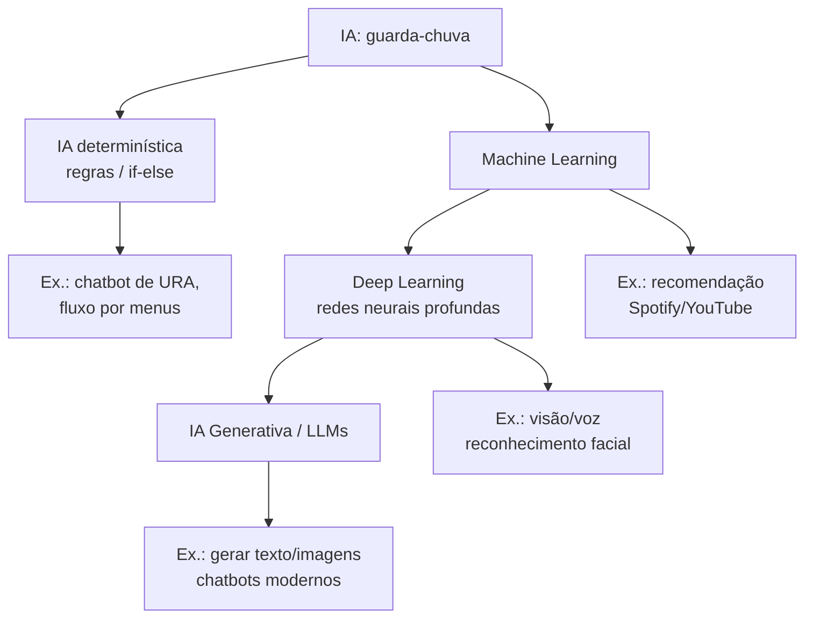

## Visão Geral do Conceito

Fluência em IA não é “saber apertar botões” em um chatbot: é entender **o que você está pedindo**, **o que a ferramenta consegue (e não consegue) fazer** e **como você valida o resultado** antes de usar em estudo, faculdade, trabalho ou vida pessoal.

Nesta Aula 1, vamos construir um mapa mental para não ficar perdido na enxurrada de termos: <mark style="background-color: #242424; padding: 2px 4px; border-radius: 3px; color: inherit;">`inteligência artificial`</mark>, <mark style="background-color: #242424; padding: 2px 4px; border-radius: 3px; color: inherit;">`machine learning`</mark>, <mark style="background-color: #242424; padding: 2px 4px; border-radius: 3px; color: inherit;">`deep learning`</mark>, <mark style="background-color: #242424; padding: 2px 4px; border-radius: 3px; color: inherit;">`IA generativa`</mark>, <mark style="background-color: #242424; padding: 2px 4px; border-radius: 3px; color: inherit;">`LLM`</mark> e <mark style="background-color: #242424; padding: 2px 4px; border-radius: 3px; color: inherit;">`transformers`</mark>.

> **Regra:** se você usa IA para produzir algo (texto, código, decisão, relatório), **a responsabilidade pelo que foi entregue continua sendo sua**. A ferramenta ajuda; ela não “assina” por você.

## Modelo Mental

### IA como guarda-chuva (e não um produto)

Um modelo mental útil é imaginar IA como um conjunto de “famílias” de soluções:

- **IA determinística (regras)**: alguém escreveu os caminhos possíveis (como um roteiro de <mark style="background-color: #242424; padding: 2px 4px; border-radius: 3px; color: inherit;">`if/else`</mark>). É previsível e estável, mas cresce em complexidade rápido.
- **Machine Learning (ML)**: em vez de escrever as regras, você dá exemplos/dados e o sistema aprende padrões para classificar/recomendar.
- **Deep Learning (DL)**: ML com redes neurais “mais profundas” (mais camadas), capaz de lidar melhor com problemas complexos (imagem, voz, texto) — com custo maior de dados e computação.
- **IA generativa / LLMs**: modelos que geram texto/imagem/áudio a partir de padrões aprendidos, com comportamento **probabilístico** (não determinístico).

### “Input manda no output” (mais do que parece)

Uma frase simples que vai aparecer o trimestre inteiro:

- **Output depende do input.**  
  Se o pedido é vago, o resultado tende a ser vago; se o pedido é preciso, o resultado tende a ser melhor — mas ainda precisa validação.

Em IA generativa, isso vira uma competência prática: escrever prompts com objetivo, restrições, exemplos e critérios de qualidade.

### Diagrama: mapa mental dos termos



## Mecânica Central

### 1) IA determinística: quando regras são a escolha certa

Nem todo problema pede IA. Às vezes, uma solução determinística (regras) é melhor porque:

- **É previsível** (mesmas entradas → mesma saída).
- **É mais fácil de auditar** (você consegue explicar o porquê de cada decisão).
- **Evita custo/risco** de uma saída probabilística quando você precisa de garantia.

Exemplo conceitual: um chatbot de banco que responde “Digite 1 para cartão; 2 para conta; 3 para contestar”. Isso pode ser IA no sentido amplo (emular uma habilidade humana), mas não “aprende” sozinho.

### 2) Machine Learning: aprender padrões com feedback (Spotify como metáfora)

No ML, você para de “programar todas as regras” e passa a usar dados:

- Pessoas ouvem música A e depois música B.
- O sistema aprende que **A → B** tem alta probabilidade.
- Quando alguém **ouve até o fim** (ou dá like/salva), isso vira um **sinal de feedback positivo**; pular cedo pode virar sinal negativo.

O ponto de fluência aqui é perceber: recomendação é “padrões em dados”, não adivinhação mágica.

### 3) Deep Learning: mais camadas para lidar com complexidade

Quando o problema tem **muitas variáveis** (imagem, voz, contexto de localização, clima, comportamento), você precisa de modelos mais capazes — e isso tende a exigir:

- mais dados,
- mais poder computacional,
- arquiteturas com mais camadas (redes profundas).

### 4) IA generativa e LLMs: linguagem vira matemática (embeddings)

Um salto importante para modelos de linguagem foi representar palavras/trechos como vetores num espaço de muitas dimensões (<mark style="background-color: #242424; padding: 2px 4px; border-radius: 3px; color: inherit;">`embeddings`</mark>). Em alto nível:

- Texto é transformado em números (vetores).
- Operações numéricas capturam relações (aproximações semânticas).
- Modelos modernos (<mark style="background-color: #242424; padding: 2px 4px; border-radius: 3px; color: inherit;">`transformers`</mark>) melhoram como o sistema “presta atenção” em partes diferentes do texto.

**Fluência aqui**: entender que a saída é probabilística e pode errar com confiança — por isso validação é obrigatória.

### 5) Por que GPU importa (CPU vs GPU, em linguagem de engenharia)

Uma intuição prática:

- <mark style="background-color: #242424; padding: 2px 4px; border-radius: 3px; color: inherit;">`CPU`</mark>: menos núcleos, operações mais gerais/complexas, ótimo para tarefas serializadas e variadas.
- <mark style="background-color: #242424; padding: 2px 4px; border-radius: 3px; color: inherit;">`GPU`</mark>: muitos núcleos, ótima para muitas operações simples em paralelo (muito comum em treinamento/inferência de redes neurais).

Isso ajuda a explicar por que o avanço de hardware acelerou a IA moderna.

## Uso Prático

### Um checklist mínimo de “prompt bom” (pronto para usar)

Quando você for pedir algo a uma IA generativa, teste se seu prompt tem:

- **Objetivo**: “Quero X para Y”.
- **Contexto**: o que importa (público, cenário, dados disponíveis).
- **Restrições**: formato de saída, tamanho, o que evitar, linguagem.
- **Critérios de qualidade**: “traga exemplos”, “cite suposições”, “liste riscos”.
- **Validação**: “apresente o que é fato vs o que é suposição”, “peça fontes quando relevante”.

Exemplo (estudo):

```text
Objetivo: me ensinar a diferença entre ML e DL.
Contexto: sou iniciante em ADS e quero exemplos do dia a dia.
Restrições: não use fórmulas; use 2 exemplos reais.
Critérios: explique em 6 a 10 frases, depois faça 3 perguntas de checagem.
Validação: destaque onde você está simplificando.
```

### Um checklist mínimo de validação (antes de “usar o output”)

Antes de usar uma resposta:

- **Consistência interna**: a resposta não se contradiz?
- **Aderência ao pedido**: respondeu o que foi solicitado, no formato certo?
- **Verificabilidade**: há fatos? consigo checar em fonte confiável?
- **Risco**: tem implicação de segurança/privacidade? envolve dados pessoais/confidenciais?

## Erros Comuns

- **Confundir “IA” com um único produto**: tratar <mark style="background-color: #242424; padding: 2px 4px; border-radius: 3px; color: inherit;">`ChatGPT`</mark>/<mark style="background-color: #242424; padding: 2px 4px; border-radius: 3px; color: inherit;">`Gemini`</mark>/<mark style="background-color: #242424; padding: 2px 4px; border-radius: 3px; color: inherit;">`Claude`</mark> como “a IA”, ignorando recomendações, roteamento e sistemas por regras.
- **Usar IA como muleta para pular a base**: tentar “ter o resultado” sem entender o assunto reduz sua capacidade de detectar erro.
- **Não validar**: aceitar output probabilístico como verdade só porque veio bem escrito.
- **Dados enviesados / exemplos ruins**: modelos aprendem padrões do que recebem; se o conjunto de exemplos é limitado, o modelo aprende “o atalho errado” (ex.: associar “objeto” a algo que sempre aparece junto nas imagens).
- **Vazar informação sensível**: colar dados de cliente, chaves, documentos, informações internas no prompt.

## Visão Geral de Debugging

Quando a IA “respondeu errado”, trate como um bug de comunicação + validação:

1. **Releia o prompt**: faltou objetivo? contexto? restrição de formato?
2. **Peça estrutura**: “responda em tópicos”, “separe fatos de suposições”.
3. **Introduza exemplos e contraexemplos**: “mostre um caso em que regra é melhor do que ML”.
4. **Reduza ambiguidade**: peça uma versão curta e outra detalhada.
5. **Valide com fonte externa** quando houver afirmação factual importante.

## Principais Pontos

- IA é **guarda-chuva**: inclui regras, ML, DL e IA generativa.
- IA generativa é **probabilística**; ela pode errar com confiança.
- **Você** é responsável pelo uso do output.
- Bons resultados começam com bons prompts (objetivo + contexto + restrições + critérios).
- Hardware (GPU) e dados em escala explicam parte do salto recente.

## Preparação para Prática

Ao final desta lição, você deve conseguir:

- Explicar a diferença entre IA determinística, ML, DL e IA generativa com exemplos.
- Montar um prompt com objetivo, contexto, restrições e critérios de qualidade.
- Aplicar um checklist de validação antes de usar a resposta em uma entrega.

## Laboratório de Prática

> **Importante:** estes desafios são sobre fluência (comunicação + validação). O código abaixo é um “suporte” para você praticar estrutura e checagem, não para “fazer IA”.

### Easy — Escrever um prompt com especificação completa

**Desafio:** complete a função para montar um prompt estruturado a partir de objetivo, contexto, restrições e critérios.

```python
from dataclasses import dataclass


@dataclass(frozen=True)
class PromptSpec:
    objective: str
    context: str
    constraints: list[str]
    quality_criteria: list[str]


def build_prompt(spec: PromptSpec) -> str:
    """
    Retorna um prompt em texto com seções claras.
    O retorno precisa incluir Objective, Context, Constraints e Quality Criteria.
    """
    # TODO: montar um texto com cabeçalhos e bullets
    return ""


if __name__ == "__main__":
    spec = PromptSpec(
        objective="Explicar a diferença entre ML e DL",
        context="Sou iniciante em ADS e quero exemplos do dia a dia.",
        constraints=["Sem fórmulas", "6 a 10 frases", "Português"],
        quality_criteria=["Use 2 exemplos reais", "Aponte simplificações", "Finalize com 3 perguntas de checagem"],
    )
    print(build_prompt(spec))
```

### Medium — Checklist de validação de resposta

**Desafio:** implemente um validador simples que marque itens do checklist.

```python
from dataclasses import dataclass


@dataclass(frozen=True)
class ValidationResult:
    adheres_to_request: bool
    has_internal_consistency: bool
    separates_facts_from_assumptions: bool
    flags_sensitive_data_risk: bool


def validate_answer(answer: str, request: str) -> ValidationResult:
    """
    Heurística simples:
    - Não é um detector perfeito; é treino de disciplina de validação.
    """
    # TODO: implemente heurísticas simples (ex.: checar se 'suposição' aparece,
    # se menciona riscos, se tem tamanho mínimo, etc.)
    return ValidationResult(
        adheres_to_request=False,
        has_internal_consistency=False,
        separates_facts_from_assumptions=False,
        flags_sensitive_data_risk=False,
    )


if __name__ == "__main__":
    request = "Explique ML vs DL em 6 a 10 frases, com 2 exemplos reais, e destaque simplificações."
    answer = "Machine Learning aprende padrões com dados... (resposta aqui)"
    print(validate_answer(answer, request))
```

### Hard — Evitar “atalho de dados” (viés de exemplo)

**Desafio:** você recebeu um conjunto de exemplos “ruins” (muito repetitivos) e precisa sugerir melhorias na coleta de dados para reduzir o risco de o modelo aprender o padrão errado.

```python
from dataclasses import dataclass


@dataclass(frozen=True)
class DatasetIssue:
    issue: str
    why_it_hurts: str
    mitigation: str


def review_dataset(examples: list[str]) -> list[DatasetIssue]:
    """
    Recebe descrições textuais dos exemplos (simulando imagens ou registros).
    Retorna problemas e mitigação.
    """
    # TODO: identifique padrões repetitivos (ex.: "sempre com mão", "sempre de noite"),
    # e proponha variedade (ângulos, iluminação, contexto, negativos).
    return []


if __name__ == "__main__":
    examples = [
        "foto de um objeto X na mão de uma pessoa, fundo branco",
        "foto de um objeto X na mão de uma pessoa, fundo branco",
        "foto de um objeto X na mão de uma pessoa, fundo branco",
        "foto de um objeto X na mão de uma pessoa, fundo branco",
        "foto de um objeto X na mão de uma pessoa, fundo branco",
    ]
    for issue in review_dataset(examples):
        print("-", issue.issue)
        print("  por que atrapalha:", issue.why_it_hurts)
        print("  mitigação:", issue.mitigation)
```

<!-- CONCEPT_EXTRACTION
concepts:
  - fluência em IA
  - IA como guarda-chuva (regras, ML, DL, generativa)
  - machine learning (padrões + feedback)
  - deep learning (camadas / complexidade)
  - embeddings (vetorização de linguagem)
  - transformers (alto nível)
  - GPU vs CPU (paralelismo)
  - dados de treinamento e viés de exemplos
  - responsabilidade humana e validação do output
skills:
  - Formular prompts com objetivo, contexto, restrições e critérios de qualidade
  - Validar respostas de IA separando fatos de suposições e checando riscos
  - Escolher abordagem determinística vs probabilística com base no problema
  - Identificar riscos de viés em dados e sugerir mitigação por diversidade de exemplos
examples:
  - checklist-prompt-bom
  - checklist-validacao-output
  - mapa-mental-ia-ml-dl-llm
-->

<!-- EXERCISES_JSON
[
  {
    "id": "introducao-fluencia-ia-prompt-estruturado",
    "slug": "introducao-fluencia-ia-prompt-estruturado",
    "difficulty": "easy",
    "title": "Escrever um prompt com especificação completa",
    "discipline": "fluencia-ia",
    "editorLanguage": "python",
    "tags": ["fluencia-ia", "prompts", "comunicacao", "validacao"],
    "summary": "Montar um prompt estruturado com objetivo, contexto, restrições e critérios de qualidade."
  },
  {
    "id": "introducao-fluencia-ia-checklist-validacao",
    "slug": "introducao-fluencia-ia-checklist-validacao",
    "difficulty": "medium",
    "title": "Aplicar um checklist de validação de resposta",
    "discipline": "fluencia-ia",
    "editorLanguage": "python",
    "tags": ["fluencia-ia", "validacao", "riscos", "heuristicas"],
    "summary": "Criar um validador simples para checar aderência ao pedido, consistência e riscos."
  },
  {
    "id": "introducao-fluencia-ia-revisao-dados-vies",
    "slug": "introducao-fluencia-ia-revisao-dados-vies",
    "difficulty": "hard",
    "title": "Revisar exemplos e reduzir risco de viés",
    "discipline": "fluencia-ia",
    "editorLanguage": "python",
    "tags": ["fluencia-ia", "dados", "vies", "machine-learning"],
    "summary": "Detectar repetição/atalhos em exemplos e propor como coletar dados mais variados."
  }
]
-->

<!-- lessons.json (sugestão para entrada)
discipline: fluencia-ia
slug: introducao-fluencia-ia
title: Introdução à Fluência em IA: termos, limites e como pensar
order: 1
file: fluencia-ia/aula-01-introducao-fluencia-ia.md
-->

