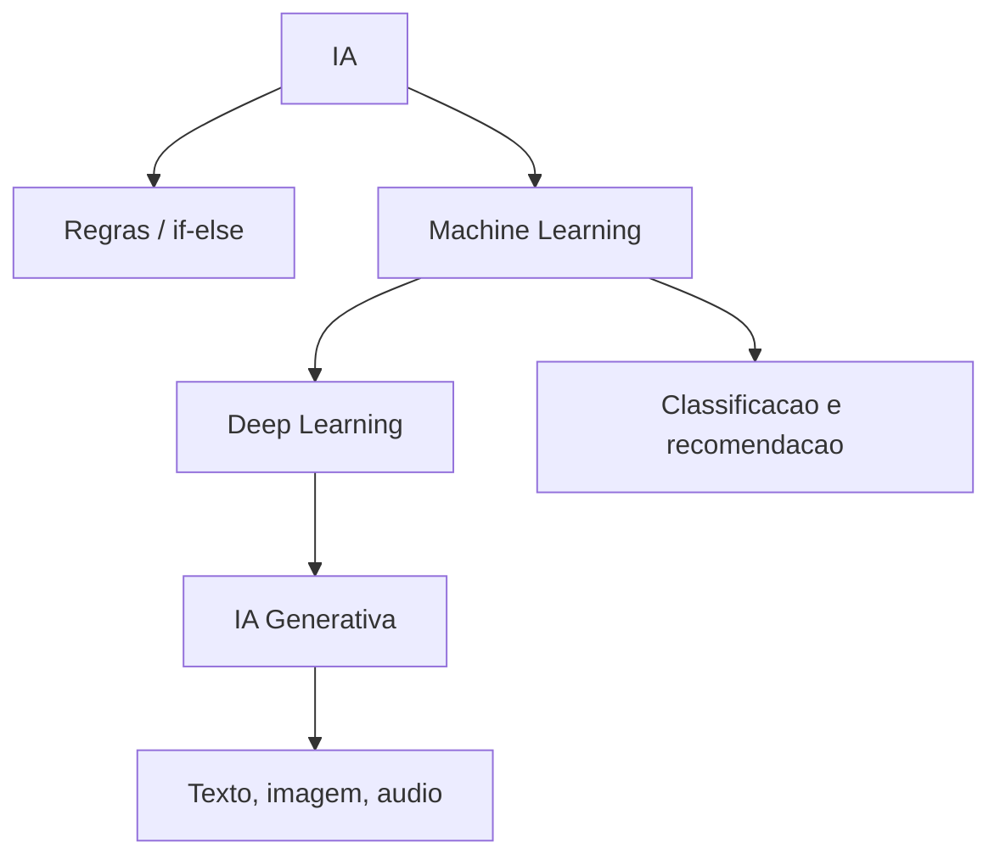

## Visão Geral do Conceito

A aula 02 revisita os termos centrais de IA com foco prático. O objetivo é sair da lista de definições e observar como <mark style="background-color: #242424; padding: 2px 4px; border-radius: 3px; color: inherit;">`machine learning`</mark>, <mark style="background-color: #242424; padding: 2px 4px; border-radius: 3px; color: inherit;">`deep learning`</mark> e <mark style="background-color: #242424; padding: 2px 4px; border-radius: 3px; color: inherit;">`IA generativa`</mark> aparecem em ferramentas reais.

> **Regra:** esta lição foi reconstruída a partir da transcrição da aula e dos materiais disponíveis no repositório; quando a fonte não cobre um detalhe, isso é declarado como lacuna em vez de ser tratado como fato.

## Modelo Mental

IA é guarda-chuva; ML aprende padrões; deep learning usa camadas mais profundas; IA generativa produz novos conteúdos a partir desses padrões.



## Mecânica Central

- <mark style="background-color: #242424; padding: 2px 4px; border-radius: 3px; color: inherit;">`ML`</mark> depende de dados e feedback.
- <mark style="background-color: #242424; padding: 2px 4px; border-radius: 3px; color: inherit;">`Deep learning`</mark> amplia capacidade com mais camadas e custo computacional.
- GPUs ajudam a treinar modelos maiores.
- <mark style="background-color: #242424; padding: 2px 4px; border-radius: 3px; color: inherit;">`Transformers`</mark> melhoraram processamento de linguagem.
- Prompt injection/jailbreak foi citado como tema futuro, não foco desta aula.

## Uso Prático

Classifique exemplos: Siri/Alexa, recomendador de música, chatbot de banco, gerador de texto e classificador web. O exercício é explicar o mecanismo provável, não adivinhar a marca.

## Erros Comuns

- Chamar qualquer automação de IA generativa.
- Achar que demonstração web prova entendimento profundo.
- Confundir ferramenta com conceito.
- Entrar em segurança de prompts antes de entender famílias de IA.

## Visão Geral de Debugging

Quando não souber classificar uma ferramenta, pergunte: há regra fixa? há treinamento com exemplos? ela gera conteúdo novo?

## Principais Pontos

- IA é guarda-chuva.
- ML aprende padrões.
- Deep learning usa mais camadas.
- Generativa cria saída nova, mas exige validação.


## Preparação para Prática

Liste cinco ferramentas que você usa e classifique cada uma pela família de IA provável.

## Laboratório de Prática
### Easy — Classificar famílias de IA
Preencha a tabela com a família de IA e a justificativa.
```markdown
| Exemplo | Família | Justificativa |
|---|---|---|
| Chatbot de menu bancário | TODO | TODO |
| Recomendação de música | TODO | TODO |
| Gerador de imagem por prompt | TODO | TODO |
```
Critérios:
- Justificar por mecanismo, não por marca.
- Distinguir regra de aprendizado.
- Evitar respostas vagas.

### Medium — Analisar prompt e saída
Reescreva o prompt fraco com mais contexto e critérios.
```markdown
# Prompt fraco
Explique IA.

# Prompt melhorado
TODO: defina público, objetivo, restrições e formato.

# Como validar
TODO: liste checagens.
```
Critérios:
- Incluir objetivo e público.
- Definir formato.
- Incluir validação humana.

### Hard — Simular escolhas de tokens
Complete a função para escolher o token mais provável quando temperatura for baixa.
```python
candidatos = {'dados': 0.55, 'texto': 0.30, 'imagem': 0.15}

def escolher_token(candidatos, temperatura_baixa=True):
    # TODO: se temperatura_baixa, retornar token com maior probabilidade
    # TODO: caso contrario, retornar um placeholder explicativo
    return None

print(escolher_token(candidatos))
```
Critérios:
- Usar probabilidades.
- Explicar temperatura baixa.
- Código deve executar antes da solução final.


<!-- CONCEPT_EXTRACTION
concepts:
  - inteligência artificial
  - machine learning
  - deep learning
  - IA generativa
  - aprendizado por exemplos
  - GPU
  - transformers
skills:
  - Classificar famílias de IA
  - Comparar regras e aprendizado
  - Validar demonstrações
  - Explicar limites práticos
examples:
  - chatbots-banco
  - siri-alexa
  - kasparov-ibm
  - ferramentas-web-ml
-->

<!-- EXERCISES_JSON
[
  {
    "id": "ia-ml-deep-learning-generativa-pratica-classificar-familias-ia",
    "slug": "ia-ml-deep-learning-generativa-pratica-classificar-familias-ia",
    "difficulty": "easy",
    "title": "Classificar famílias de IA",
    "discipline": "fluencia-ia",
    "editorLanguage": "markdown",
    "tags": [
      "ia",
      "machine-learning",
      "conceitos"
    ],
    "summary": "Classificar exemplos em IA determinística, ML, deep learning ou generativa."
  },
  {
    "id": "ia-ml-deep-learning-generativa-pratica-analisar-prompt",
    "slug": "ia-ml-deep-learning-generativa-pratica-analisar-prompt",
    "difficulty": "medium",
    "title": "Analisar prompt e saída",
    "discipline": "fluencia-ia",
    "editorLanguage": "markdown",
    "tags": [
      "ia",
      "prompt",
      "validacao"
    ],
    "summary": "Melhorar um prompt com objetivo, contexto e critério de validação."
  },
  {
    "id": "ia-ml-deep-learning-generativa-pratica-tokens-temperatura",
    "slug": "ia-ml-deep-learning-generativa-pratica-tokens-temperatura",
    "difficulty": "hard",
    "title": "Simular escolhas de tokens",
    "discipline": "fluencia-ia",
    "editorLanguage": "python",
    "tags": [
      "ia",
      "tokens",
      "probabilidade"
    ],
    "summary": "Simular escolha de próximo token com probabilidades simplificadas."
  }
]
-->

<!-- SOURCE_CONTEXT
canonical_memory: MEMORIES.md
source: downloads/Fluencia_em_IA/Aula_02_-_28042026.md
source_sha256: 83b01521ab1148222a0fae62c17a859dd698bd581f3f13477ae006fdce447bbd
source: downloads/Fluencia_em_IA/Aula_02_-_28042026.vtt
source_sha256: 66db96a35bc7bcadc1e19df254457e415a4ffcf54a6ace72865d5f93592bf3aa
notes:
  - Sem documento complementar específico no manifest.
-->
