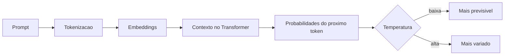

## Visão Geral do Conceito

A aula 03 entra no mecanismo das <mark style="background-color: #242424; padding: 2px 4px; border-radius: 3px; color: inherit;">`LLMs`</mark>: texto vira <mark style="background-color: #242424; padding: 2px 4px; border-radius: 3px; color: inherit;">`tokens`</mark>, tokens viram vetores, o prompt direciona o espaço de possibilidades e a <mark style="background-color: #242424; padding: 2px 4px; border-radius: 3px; color: inherit;">`temperatura`</mark> altera quão previsível é a escolha do próximo token.

> **Regra:** esta lição foi reconstruída a partir da transcrição da aula e dos materiais disponíveis no repositório; quando a fonte não cobre um detalhe, isso é declarado como lacuna em vez de ser tratado como fato.

## Modelo Mental

Imagine palavras como pontos em um mapa semântico. O prompt empurra o modelo para uma região do mapa; a cada passo, ele escolhe o próximo token provável, com mais ou menos liberdade.



## Mecânica Central

- <mark style="background-color: #242424; padding: 2px 4px; border-radius: 3px; color: inherit;">`Token`</mark> pode ser palavra, parte de palavra, pontuação ou espaço.
- <mark style="background-color: #242424; padding: 2px 4px; border-radius: 3px; color: inherit;">`Embedding`</mark> representa trecho como vetor numérico.
- Proximidade vetorial aproxima significado, mas não garante verdade.
- Temperatura baixa favorece tokens mais prováveis; temperatura alta aumenta variação.
- Slides externos foram mencionados, mas não aparecem no manifest local.

## Uso Prático

Ao escrever prompt, especifique contexto e formato. Se precisa consistência, peça temperatura baixa quando a ferramenta permitir; se precisa brainstorm, aceite variação maior e valide depois.

## Erros Comuns

- Achar que token é sempre palavra.
- Confundir proximidade semântica com factualidade.
- Usar temperatura alta em tarefa que exige precisão.
- Medir qualidade só pela fluidez do texto.

## Visão Geral de Debugging

Se a resposta varia demais, reduza abertura do prompt, fixe formato e peça critérios. Se a resposta parece correta demais para ser checada, valide fontes externas.

## Principais Pontos

- LLMs operam token a token.
- Embeddings aproximam significado em vetores.
- Prompt direciona o espaço de resposta.
- Temperatura ajusta previsibilidade.


## Preparação para Prática

Pegue um prompt seu e reescreva com objetivo, contexto, formato e critério de validação.

## Laboratório de Prática
### Easy — Classificar famílias de IA
Preencha a tabela com a família de IA e a justificativa.
```markdown
| Exemplo | Família | Justificativa |
|---|---|---|
| Chatbot de menu bancário | TODO | TODO |
| Recomendação de música | TODO | TODO |
| Gerador de imagem por prompt | TODO | TODO |
```
Critérios:
- Justificar por mecanismo, não por marca.
- Distinguir regra de aprendizado.
- Evitar respostas vagas.

### Medium — Analisar prompt e saída
Reescreva o prompt fraco com mais contexto e critérios.
```markdown
# Prompt fraco
Explique IA.

# Prompt melhorado
TODO: defina público, objetivo, restrições e formato.

# Como validar
TODO: liste checagens.
```
Critérios:
- Incluir objetivo e público.
- Definir formato.
- Incluir validação humana.

### Hard — Simular escolhas de tokens
Complete a função para escolher o token mais provável quando temperatura for baixa.
```python
candidatos = {'dados': 0.55, 'texto': 0.30, 'imagem': 0.15}

def escolher_token(candidatos, temperatura_baixa=True):
    # TODO: se temperatura_baixa, retornar token com maior probabilidade
    # TODO: caso contrario, retornar um placeholder explicativo
    return None

print(escolher_token(candidatos))
```
Critérios:
- Usar probabilidades.
- Explicar temperatura baixa.
- Código deve executar antes da solução final.


<!-- CONCEPT_EXTRACTION
concepts:
  - tokens
  - embeddings
  - espaço vetorial
  - LLM
  - prompt
  - temperatura
  - probabilidade
  - transformers
skills:
  - Explicar tokenização
  - Interpretar embeddings
  - Controlar prompts
  - Avaliar temperatura e variação
examples:
  - straw-hat-semantica
  - tokens-portugues-ingles
  - prompt-como-direcao
-->

<!-- EXERCISES_JSON
[
  {
    "id": "tokens-embeddings-prompt-temperatura-classificar-familias-ia",
    "slug": "tokens-embeddings-prompt-temperatura-classificar-familias-ia",
    "difficulty": "easy",
    "title": "Classificar famílias de IA",
    "discipline": "fluencia-ia",
    "editorLanguage": "markdown",
    "tags": [
      "ia",
      "machine-learning",
      "conceitos"
    ],
    "summary": "Classificar exemplos em IA determinística, ML, deep learning ou generativa."
  },
  {
    "id": "tokens-embeddings-prompt-temperatura-analisar-prompt",
    "slug": "tokens-embeddings-prompt-temperatura-analisar-prompt",
    "difficulty": "medium",
    "title": "Analisar prompt e saída",
    "discipline": "fluencia-ia",
    "editorLanguage": "markdown",
    "tags": [
      "ia",
      "prompt",
      "validacao"
    ],
    "summary": "Melhorar um prompt com objetivo, contexto e critério de validação."
  },
  {
    "id": "tokens-embeddings-prompt-temperatura-tokens-temperatura",
    "slug": "tokens-embeddings-prompt-temperatura-tokens-temperatura",
    "difficulty": "hard",
    "title": "Simular escolhas de tokens",
    "discipline": "fluencia-ia",
    "editorLanguage": "python",
    "tags": [
      "ia",
      "tokens",
      "probabilidade"
    ],
    "summary": "Simular escolha de próximo token com probabilidades simplificadas."
  }
]
-->

<!-- SOURCE_CONTEXT
canonical_memory: MEMORIES.md
source: downloads/Fluencia_em_IA/Aula_03_-_05052026.md
source_sha256: 8ab61312220fd943bf6d616c38c3db05e211a1628ed3ce3bb24508e7de304b58
source: downloads/Fluencia_em_IA/Aula_03_-_05052026.vtt
source_sha256: 5b601de9a5c83ea4e6753ff493d787782c0f30e31b86c1eb198d50a05c003288
notes:
  - Slides em Drive foram citados oralmente, mas não estão no manifest local.
-->
