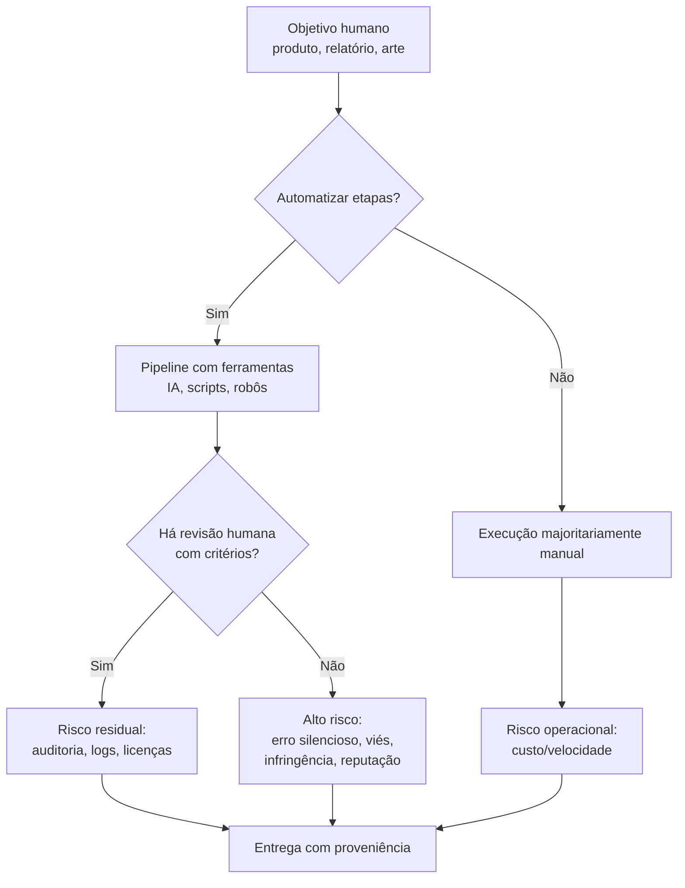

## Visão Geral do Conceito

Esta lição reconstrói um tema transversal da disciplina <mark style="background-color: #242424; padding: 2px 4px; border-radius: 3px; color: inherit;">`Fluência em IA`</mark>: como manter prática técnica responsável quando sistemas generativos imitam pessoas, aceleram produção e, ao mesmo tempo, amplificam riscos éticos, jurídicos e organizacionais. O fio condutor do material bruto não é “teoria da ética completa”, e sim uma tensão bem operacional — <mark style="background-color: #242424; padding: 2px 4px; border-radius: 3px; color: inherit;">`humanização`</mark> versus <mark style="background-color: #242424; padding: 2px 4px; border-radius: 3px; color: inherit;">`automação`</mark>, protagonismo indevido da tecnologia versus uso como <mark style="background-color: #242424; padding: 2px 4px; border-radius: 3px; color: inherit;">`ferramenta`</mark>, e como pensar direitos autorais quando a geração se parece com colagem estilística de repertório massivo.

> **Regra:** Sempre que uma resposta de modelo generativo influenciar decisão, dinheiro, saúde, inclusão/exclusão ou segurança, trate a saída como **material não confiável até passar por validação humana** com critérios explícitos.

**Não coberto no material (explicitamente):** definições acadêmicas completas de campos como <mark style="background-color: #242424; padding: 2px 4px; border-radius: 3px; color: inherit;">`autoética`</mark>, <mark style="background-color: #242424; padding: 2px 4px; border-radius: 3px; color: inherit;">`socioética`</mark> e <mark style="background-color: #242424; padding: 2px 4px; border-radius: 3px; color: inherit;">`antropoética`</mark> no modelo de Edgar Morin; leitura linha a linha da <mark style="background-color: #242424; padding: 2px 4px; border-radius: 3px; color: inherit;">`Lei nº 9.610/1998`</mark> (o professor referencia categorias de não registrabilidade via síntese assistida por IA).

## Modelo Mental

Pense na IA generativa como um **compressor cultural com autocompletar**: ela não “entende” no sentido jurídico-moral do termo; ela **produz prováveis continuações** condicionadas a grandes corpora e a configurações que você muitas vezes nem controla por completo. Por isso, o modelo mental útil no trabalho de dados e sistemas é o de **pipeline**:

1. **Intenção humana** (o que você quer decidir ou publicar).
2. **Geração** (texto/imagem/áudio com incerteza e viés de “som convincente”).
3. **Verificação** (fontes, testes, evidências, revisão de especialista).
4. **Governança** (políticas internas, contratos, licenças, registro de proveniência).

A conversa da aula também empurra uma distinção que evita discussão infantil de “Skynet”: o problema frequentemente não é um vilão metálico, mas **a retirada do humano de processos** — fábricas “no escuro”, métricas de eficiência, e a estética da produção acelerada que torna aceitável publicar sem curadoria.

### Mapa rápido: de criador a risco



## Mecânica Central

### 1) Humanização como prática (não como “vibe”)

No material, a humanização aparece ligada a presença, escuta e troca: aulas “de pessoas para pessoas”, empatia, participação. Para o estudante de ADS, isso traduz em **desenho de processos** onde o humano não só “aparece”, mas **mantém responsabilidade**: quem assina, quem valida dados sensíveis, quem decide o que entra em produção.

### 2) “IA” como rótulo: completador de texto e autoria humana

A aula propõe uma correção de linguagem: não tratar o sistema como entidade com dignidade moral — comparando, propositalmente, com não “agradecer ao liquidificador”. Do ponto de vista de engenharia, isso evita **antropomorfização** que transforma estatística em “opinião de alguém”.

### 3) Alucinação, tom e parâmetros

O exemplo do áudio inexistente ilustra <mark style="background-color: #242424; padding: 2px 4px; border-radius: 3px; color: inherit;">`alucinação`</mark>: o modelo pode produzir detalhes plausíveis sobre algo que não foi fornecido. A menção à <mark style="background-color: #242424; padding: 2px 4px; border-radius: 3px; color: inherit;">`temperatura`</mark> aponta para controle de aleatoriedade — útil para calibrar criatividade versus consistência — com ressalva de que, em produtos populares, esse controle pode ser limitado ou indisponível conforme interface e modelo.

### 4) Automação, emprego e “dark factories”

A narrativa central repositiona o medo: deslocamentos ligados a **automação industrial e decisões empresariais**, não a um slogan único de “IA”. A imagem de fábricas com pouca ou nenhuma presença humana é usada como ancoragem para perguntas éticas sobre **supervisão**, **curadoria** e distribuição de benefícios.

### 5) Casos-limite: síntese de identidades, voz e memória

São discutidos cenários de alto impacto psicológico (por exemplo, simulações de pessoas falecidas, vozes de artistas, produções musicais “com timbre de”). O ponto pedagógico não é julgar emocionalmente o público, e sim perceber **vetores de dano**: manipulação afetiva, consentimento ausente, exploração de obra de terceiros e confusão deliberada entre real e simulado.

### 6) Direitos autorais no Brasil (panorama operacional)

Sem substituir a consulta a profissional legal, a aula organiza ideias úteis:

- **Inspirado em John Locke (como analogia didática):** transformação criativa de materiais em algo comercializável aparece como narrativa clássica de “misturar esforço humano com matéria”.
- **Direito moral vs patrimonial:** separação entre “autoria/identidade” e “exploração econômica negociável” (exemplos narrados: autoria mantida; exploração cedida por contrato).
- **Lei nº 9.610/1998:** é citado que certas categorias (ideias, métodos, conceitos abstratos, sistemas, etc.) **não se prestam ao mesmo tipo de proteção** que uma expressão concretizada (texto definitivo, imagem final, composição específica). A transcrição não substitui a leitura da lei; serve como alerta para **não confundir “ideia” com “obra expressa”**.

### 7) Prova de autoria “de guerrilha” versus rotas formais

Surgem estratégias pragmaticamente brasileiras: registro temporal via publicação com data, envio de correspondência com carimbo, registros institucionais alternativos mais acessíveis que certas rotas “caras”. Do ponto de vista de dados: isso converge com **cadeia de evidências** — metadados, commits, histórico, contratos.

## Uso Prático

### Checklist mínimo para projeto em ADS (produto com assistência de IA)

1. **Classifique o caso:** decisão automatizada? conteúdo público? treino com dado de terceiros?
2. **Defina o dono da decisão:** quem assina e quem pode parar o deploy.
3. **Exija proveniência:** modelo, data, prompt-base (quando permitido), versão, fontes externas validadas.
4. **Separe fato de interpretação:** números vêm de onde? há URL, query, job id?
5. **Política de licenças:** bases de treino/LoRA, imagens, áudio, código — o que é permitido pelo contrato e pelo ordenamento aplicável?
6. **Teste negativo:** force entradas vazias, ambíguas e adversariais; compare saídas em dias diferentes (deriva de modelo/policy).

### Exemplo (Python): registrar um pacote mínimo de auditoria em JSON

```python
from __future__ import annotations

import json
from dataclasses import dataclass, asdict
from datetime import datetime, timezone


@dataclass(frozen=True)
class AiAssistedArtifact:
    title: str
    human_owner: str
    model_name: str
    purpose: str
    human_reviewed: bool


def build_audit_record(artifact: AiAssistedArtifact) -> dict[str, object]:
    return {
        "artifact": asdict(artifact),
        "recorded_at_utc": datetime.now(timezone.utc).isoformat(),
        "risk_notes": (
            "Saídas generativas podem conter erros factuais; não usar como fonte primária "
            "sem validação independente."
        ),
    }


if __name__ == "__main__":
    sample = AiAssistedArtifact(
        title="Relatorio trimestral - rascunho",
        human_owner="time_dados_exemplo",
        model_name="modelo_generativo_interno",
        purpose="Gerar primeira versao de narrativa a partir de tabela consolidada",
        human_reviewed=False,
    )
    print(json.dumps(build_audit_record(sample), ensure_ascii=False, indent=2))
```

## Erros Comuns

1. **Tratar “parecer verdade” como evidência:** modelos otimizam plausibilidade textual; isso não é garantia de correspondência com mundo real.
2. **Confundir velocidade com qualidade:** reduzir tempo de rascunho sem aumentar tempo de verificação costuma migrar o custo para produção, compliance e suporte.
3. **Supor que licença de uso de produto resolve licença de conteúdo:** termos de uma ferramenta não substituem direitos de terceiros sobre marca, voz reconhecível, obra identificável ou bases restritas.
4. **Ignorar parâmetros e interface:** reclamar de “criatividade excessiva” sem medir o que está sob controle (quando existe) é um erro de engenharia de uso.
5. **Moralizar usuário vulnerável em vez de desenhar salvaguardas:** ataques afetivos e desinformação são risco de sistema; a resposta típica é UX, políticas, educação e limitações técnicas — não sarcasmo com a vítima.
6. **Generalizar a lei a partir de uma tabela resumida:** categorias de não proteção/autoria exigem interpretação contextual; use especialista quando houver exposição relevante.

## Visão Geral de Debugging

Quando um fluxo com IA “funciona demais” ou “quebra silenciosamente”, comece por isolamento de responsabilidades:

1. **Entrada:** faltou contexto? há ambiguidade? existe informação sensível sendo vazada pelo prompt?
2. **Política do produto:** mudou o modo “lúdico”, filtros de segurança ou conectores?
3. **Reprodutibilidade:** consegue repetir com o mesmo prompt e obter divergência forte? isso sugere aleatoriedade, mudança de modelo ou pós-processamento.
4. **Custo de credibilidade:** há afirmações numéricas, citações, nomes próprios? exija fonte externa verificável.
5. **Rastro organizacional:** quem aprovou, com qual checklist, e onde está o log?

<details>
<summary>Diagnóstico rápido para times pequenos</summary>

Se o problema é “o modelo inventou referências”, a correção não é “pedir desculpas ao modelo”; é **proibir citações sem fonte** no pipeline ou exigir busca externa com validação. Se o problema é “arte sem alma”, muitas vezes é **falta de direção criativa humana** (briefing, curadoria, edição) — não apenas “prompt ruim”.
</details>

## Principais Pontos

- Humanização em times digitais é compatível com automação quando **responsabilidade humana** permanece explícita no final do fluxo.
- IA generativa é melhor tratada como **ferramenta estatística** com risco de **alucinação**, não como oráculo.
- Automação explica parte dos deslocamentos econômicos observados em cenários industriais; reduzir tudo a “foi a IA” **oculta decisões políticas e gerenciais**.
- Limites de **temperatura** e controles de interface impactam trade-off entre **variação** e **consistência**.
- Casos de simulação de pessoas e síntese de voz elevam riscos de **consentimento**, **honestidade** e **infringência** — exigem governança forte.
- Direitos autorais separam, na prática profissional, **autoria/moralidade** de **exploração patrimonial**, e distinguem **ideia** de **obra expressa** (atenção à legislação aplicável).
- “Parecer original” não é o mesmo que “livre de conflito legal”; geração estilo **mosaico** ainda pode gerar disputas concretas em contextos específicos.

## Preparação para Prática

Você deve sair desta lição capaz de:

1. Redigir uma **política interna curta** (meia página) para uso de IA em entregas de dados/software: revisão humana, prova de fonte, registro de modelo/prompt quando aplicável.
2. Identificar **categorias de risco** (afetivo, reputacional, jurídico, técnico) a partir de um caso real ou hipotético semelhante aos discutidos na aula.
3. Explicar, em linguagem de produto, por que **provas de autoria** são principalmente **cadeia de evidências** — e quais fragilidades existem em “só postar no Instagram”.

## Laboratório de Prática

### Easy — Checklist de publicação assistida por IA (`python`)

Você trabalha em um time de dados que gera relatórios internos. Complete a função para exigir, no mínimo, dois itens de revisão humana antes de `approved=True`.

```python
from __future__ import annotations


def publication_gate(model_output: str, checklist: dict[str, bool]) -> dict[str, object]:
    """
    checklist espera chaves como:
      - numeros_conferidos_com_fonte
      - nomes_proprios_verificados
      - texto_alinhado_a_politica_interna
    """
    # TODO: implementar regras:
    # - approved só pode ser True se pelo menos 2 itens forem True
    # - se model_output estiver vazio, approved deve ser False
    # - retornar dict com keys: approved, missing_review_items (lista), reason (str)
    return {
        "approved": False,
        "missing_review_items": [],
        "reason": "TODO: implementar validação do gate de publicação",
    }


if __name__ == "__main__":
    sample = publication_gate(
        "Nossa receita cresceu 300% em um dia.",
        {
            "numeros_conferidos_com_fonte": False,
            "nomes_proprios_verificados": True,
            "texto_alinhado_a_politica_interna": False,
        },
    )
    print(sample)
```

### Medium — Detector simples de “disclaimer” ausente (`python`)

Você recebe strings representando posts de rede social sobre um app. Se o texto mencionar `IA`, `chatgpt`, `gpt`, `gemini` ou `copilot` (case insensitive) e **não** mencionar `parceiro humano` ou `revisado por humano`, classifique como `RISCO_ALTO`.

```python
from __future__ import annotations
import re


def disclaimer_risk_level(post: str) -> str:
    # TODO: implementar:
    # - detectar menção a ferramentas/modelos generativos (lista acima)
    # - se detectado, exigir menção explícita a revisão humana (strings acima)
    # - retornar "BAIXO", "MEDIO" ou "RISCO_ALTO" de forma consistente com as regras
    # Regra extra do enunciado: se mencionar IA e faltar disclaimer humano => RISCO_ALTO
    return "MEDIO"


if __name__ == "__main__":
    tests = [
        "Lancamos feature nova; revisado por humano; usei IA para rascunho.",
        "Tudo gerado 100% por chatgpt sem revisao.",
        "Post sem qualquer mencao a ia.",
    ]
    for t in tests:
        print(t, "->", disclaimer_risk_level(t))
```

### Hard — Matriz de risco para cenários de síntese de identidade (`python`)

Implemente uma função que receba uma lista de dicts com campos `consentimento_explícito` (bool), `finalidade` (`"educacao"`, `"entretenimento"`, `"assinatura_de_documento"`), `menor_de_idade_envolvido` (bool) e retorne prioridade de escalação (`P0` maior urgência).

```python
from __future__ import annotations


def triage_identity_synthesis(cenarios: list[dict[str, object]]) -> list[dict[str, object]]:
    """
    Retorna a mesma lista enriquecida com:
      - prioridade (P0/P1/P2)
      - motivo (str curto)

    Orientação (não é consultoria legal):
      - menor envolvido tende a escalar severidade
      - ausência de consentimento explícito + finalidade sensível tende a escalar severidade
    """
    # TODO: implementar regras determinísticas e estáveis (sem aleatoriedade)
    return [
        {
            **c,
            "prioridade": "P2",
            "motivo": "TODO: definir triagem responsável baseada nos campos",
        }
        for c in cenarios
    ]


if __name__ == "__main__":
    exemplos = [
        {
            "consentimento_explícito": False,
            "finalidade": "assinatura_de_documento",
            "menor_de_idade_envolvido": False,
        },
        {
            "consentimento_explícito": True,
            "finalidade": "entretenimento",
            "menor_de_idade_envolvido": True,
        },
    ]
    print(triage_identity_synthesis(exemplos))
```

<!-- CONCEPT_EXTRACTION
concepts:
  - humanização versus automação
  - alucinações e credibilidade em modelos generativos
  - temperatura (aleatoriedade controlada)
  - protagonismo indevido da IA versus ferramenta assistiva
  - simulação de identidade, voz e memória (riscos afetivos)
  - direito moral versus direito patrimonial (panorama)
  - ideia versus obra expressa (limites de proteção)
  - evidências de autoria e governança de conteúdo
skills:
  - Explicar trade-offs entre automação, custo humano e responsabilidade
  - Construir checklists de revisão humana para saídas generativas
  - Separar risco técnico, reputacional, afetivo e jurídico em casos reais
  - Documentar proveniência mínima (modelo, data, propósito, revisão)
examples:
  - pipeline-human-in-the-loop-mermaid
  - auditoria-python-ai-assisted-artifact
  - laboratorio-gate-publicacao-disclaimer-triagem
-->

<!-- EXERCISES_JSON
[
  {
    "id": "fluencia-ia-04-gate-publicacao",
    "slug": "fluencia-ia-04-gate-publicacao",
    "difficulty": "easy",
    "title": "Gate mínimo de publicação com revisão humana",
    "discipline": "fluencia-em-ia",
    "editorLanguage": "python",
    "tags": ["governanca", "ia-generativa", "revisao-humana", "qualidade"],
    "summary": "Implementar um gate simples que só aprova texto assistido por IA após itens objetivos de revisão humana."
  },
  {
    "id": "fluencia-ia-04-disclaimer-risco",
    "slug": "fluencia-ia-04-disclaimer-risco",
    "difficulty": "medium",
    "title": "Classificar risco de postagem sem disclaimer de revisão",
    "discipline": "fluencia-em-ia",
    "editorLanguage": "python",
    "tags": ["compliance-leve", "regex", "comunicacao", "ia-generativa"],
    "summary": "Detectar menções a ferramentas generativas e exigir menção explícita de revisão humana para reduzir comunicação enganosa."
  },
  {
    "id": "fluencia-ia-04-triagem-identidade",
    "slug": "fluencia-ia-04-triagem-identidade",
    "difficulty": "hard",
    "title": "Triagem determinística de cenários de síntese de identidade",
    "discipline": "fluencia-em-ia",
    "editorLanguage": "python",
    "tags": ["etica-aplicada", "risco", "menores", "consentimento"],
    "summary": "Priorizar cenários de síntese envolvendo consentimento, finalidade sensível e menores usando regras explícitas."
  }
]
-->

```json
LESSONS_JSON_HINT
{
  "discipline": "fluencia-em-ia",
  "slug": "etica-automacao-humanizacao-direitos-autorais",
  "title": "Ética, automação e direitos autorais na era da IA generativa",
  "order": 4,
  "file": "content/fluencia-em-ia/etica-automacao-humanizacao-direitos-autorais.md"
}
```
