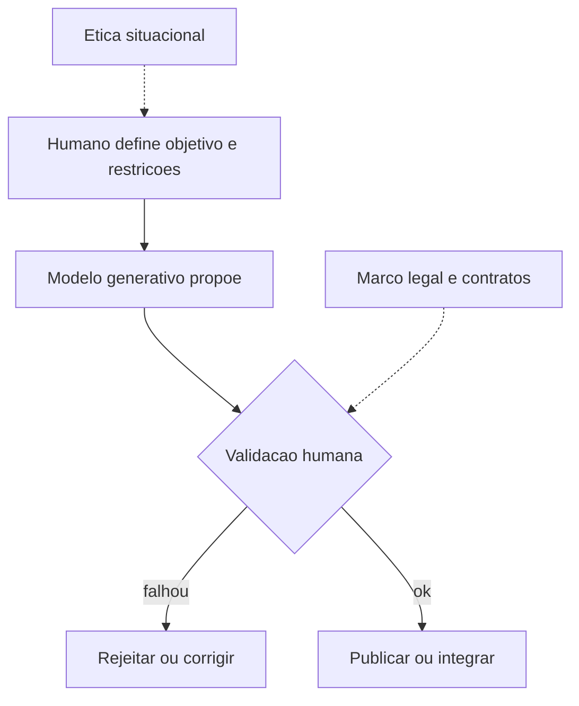

## Visão Geral do Conceito

Esta lição reconstrói o eixo da **aula 04** de Fluência em IA: não é um tutorial de ferramenta, mas um **mapa ético** para situar generativos num mundo já saturado de automação. O fio condutor é duplo: (1) preservar **agência e responsabilidade humanas** onde a máquina imita cordialidade; (2) entender **direitos autorais** como contrapeso institucional quando mídia sintética dilui fronteiras entre autoria, imitação e mercado.

> **Regra:** o texto foi derivado da transcrição (`.vtt`) e do manifesto local; citações de lei são **didáticas** — para decisões reais use texto oficial e assessoria jurídica.

## Modelo Mental

Trate o generativo como **motor de proposta** que sempre precisa de **trilho humano**: trilho de propósito (o quê resolver), trilho de evidência (como validar) e trilho legal (quem pode usar o quê).



## Mecânica Central

### 1. Humanização versus “robotização” social

A aula contrapõe **interação empática** (câmera ligada, troca real) ao cenário em que pessoas se tornam interfaces passivas enquanto modelos simulam cordialidade. O ponto não é moralismo estético: é **qualidade de decisão** — equipes que não exercitam julgamento coletivo tendem a **subcontratar julgamento** ao autocomplete sociável.

### 2. Automação, emprego e narrativa sobre IA

Fica explícito o cuidado com a fraseologia “**IA tira emprego**”: na linha debatida, o deslocamento frequentemente vem de **automação de processos** e de escolhas organizacionais. Posicionar-se contra **ludismo** (destruir máquinas) não implica aceitar automação ingênua; implica **desenhar** uso com transparência e requalificação.

### 3. Falhas que parecem “éticas” mas são mecânicas

- **Simulação sem entrada**: elogiar um “refrão” quando **não houve áudio** mostra que o modelo não audita o mundo — ele **continua a conversa**.
- **Bajulação**: modos que reforçam autoestima do utilizador degradam **crítica**; ajustes de sistema (ex.: pedir avaliação menos bajuladora) ajudam, mas **não substituem** revisão externa.
- **Avisos de produto**: exemplos citados na aula lembram que fornecedores podem rotular uso como **lúdico** — sinal de que **casos de produção** exigem camada extra de governança.

### 4. Curadoria e “IA da insistência do autor”

Narrativas de criação (jogos, músicas, imagens) aparecem como casos onde **quem brilha criativamente** continua a ser o humano que itera, seleciona e corrige. A lição útil para ADS: em pipeline de dados, o paralelo é o **cientista de dados / engenheiro** que define métricas, valida amostra e assume risco — não o notebook que “acha um número”.

### 5. Direitos autorais em alto nível (Brasil, visão da aula)

- **Direito moral**: vínculo do autor com a obra (paternidade, integridade em certos limites).
- **Direito patrimonial**: exploração econômica negociável (contratos podem ceder usos).
- **Lei nº 9.610/1998**: na discussão oral, destacam-se **exclusões** do que seria “registrável” como obra no sentido estrito — por exemplo **ideias, procedimentos, métodos, conceitos abstratos** (a aula lê isso via assistente como apoio pedagógico; confirme sempre o texto legal consolidado).

### 6. Síntese de mídia e confiança

Foram discutidos sinais fracos para detectar **imagem sintética** versus foto real (ex.: inconsistências em instrumentos, “olhar morto”), e o aviso de que **efeitos fotográficos legítimos** (profundidade de campo) não provam nem desmentem sozinhos. Para **música** e voz, entram exemplos de **ferramentas de estúdio assistido** — o foco ético é **consentimento, atribuição e direito de uso da voz e da obra musical base**.

## Uso Prático

1. **Checklist antes de publicar saída generativa em produção**: propósito, público-alvo, fonte dos dados, licença, revisão humana, teste de regressão factual.
2. **Contratos internos**: separar “quem assina o resultado” de “quem operou o modelo”.
3. **Política de dados sensíveis**: proibir fluxos que **reconstituem identidade** de terceiros sem base legal clara (ex.: síntese de falecidos — tema sensível citado na aula como alerta social).

## Erros Comuns

- Tratar **fluidez** como **veracidade**.
- Ignorar que **ferramenta comercial** pode mudar **termos de uso** e limitações de serviço.
- Confundir **crítica de IA generativa** com **oposição técnica cega** a automação.
- Assumir que “**prompt engenharia**” resolve risco **organizacional** ou **legal**.

## Visão Geral de Debugging

Quando um fluxo generativo “parece confiante e errado”, isole: (a) entrada realmente recebida pelo modelo; (b) temperatura e políticas de segurança; (c) pós-processamento humano obrigatório; (d) trilha de auditoria (logs, versões do prompt, hashes de dataset).

## Principais Pontos

- Automação e **governança** explicam muitos impactos laborais mais do que um slogan sobre IA.
- Falhas “sociais” (bajulação, continuidade sem evidência) são **previsíveis** — desenhe validação.
- Direito moral/patrimonial e exclusões legais moldam **o que pode ser monetizado** versus **o que é livre circulação de ideia**.
- Curadoria humana é o **antivirus** da sobrefiação algorítmica.

## Preparação para Prática

Escolha um caso real (mesmo pequeno) de uso de LLM na sua equipe e escreva **uma página** com: objetivo, dados permitidos, passo de validação e responsável final pela assinatura.

## Laboratório de Prática

### Easy — Classificar o tipo de risco

Para cada cenário, classifique em **A** automação de processo, **B** falha mecânica do modelo, **C** risco legal/privacidade, **D** risco reputacional.

```markdown
| Cenário | A | B | C | D | Justificativa (1 linha) |
|---|---|---|---|---|---|
| Chatbot interno que encerra tickets por similaridade de texto | | | | | |
| Modelo elogia anexo que não foi enviado | | | | | |
| Uso de voz sintética de pessoa real sem contrato | | | | | |
```

Critérios:
- Uma letra primária por linha (pode citar secundária na justificativa).
- Não misturar “ética” vaga com categoria objetiva.

### Medium — Política mínima de revisão

Redija 8–12 linhas de **política interna** para time de dados: quando um relatório com texto gerado pode ir para stakeholders.

```markdown
# Política (rascunho)
TODO: incluir gatilhos obrigatórios de revisão humana
TODO: definir registro de versão (prompt, modelo, data)
TODO: definir proibições (dados pessoais, terceiros sem base legal)
```

Critérios:
- Gatilhos mensuráveis (ex.: números financeiros, PII, SLA externo).
- Nomear papel responsável.

### Hard — Função de “gate” factual simplificado

Complete a função: se faltar evidência obrigatória, retornar bloqueio em vez de texto final.

```python
def publicar_relatorio(gerado: str, evidencias: list[str], requer_audio: bool, audio_enviado: bool) -> str:
    # TODO: se requer_audio e not audio_enviado -> retornar mensagem de bloqueio clara
    # TODO: se len(evidencias)==0 -> bloquear
    # TODO: caso ok -> retornar gerado prefixado com "REVISADO:"
    return ""

print(publicar_relatorio("ótimo refrão", [], True, False))
```

Critérios:
- Mensagens de bloqueio explícitas.
- Não engolir silenciosamente ausência de evidência.

<!-- CONCEPT_EXTRACTION
concepts:
  - ética em IA
  - automação
  - alucinação
  - bajulação
  - curadoria humana
  - direito moral
  - direito patrimonial
  - Lei 9.610/98
  - síntese de mídia
skills:
  - Mapear riscos por categoria
  - Projetar validação humana mínima
  - Explicar limites legais didáticos sem aconselhamento jurídico
examples:
  - audio-inexistente-elogiado
  - logo-contrato-patrimonial-moral
  - imagem-sintetica-vs-foto
-->

<!-- EXERCISES_JSON
[
  {
    "id": "etica-automacao-humano-direitos-autorais-ia-classificar-risco",
    "slug": "etica-automacao-humano-direitos-autorais-ia-classificar-risco",
    "difficulty": "easy",
    "title": "Classificar tipo de risco",
    "discipline": "fluencia-ia",
    "editorLanguage": "markdown",
    "tags": ["etica", "automacao", "risco"],
    "summary": "Classificar cenários em automação, falha mecânica, legal ou reputacional."
  },
  {
    "id": "etica-automacao-humano-direitos-autorais-ia-politica-revisao",
    "slug": "etica-automacao-humano-direitos-autorais-ia-politica-revisao",
    "difficulty": "medium",
    "title": "Política mínima de revisão",
    "discipline": "fluencia-ia",
    "editorLanguage": "markdown",
    "tags": ["governanca", "llm", "revisao"],
    "summary": "Escrever política curta com gatilhos de revisão humana para relatórios com texto gerado."
  },
  {
    "id": "etica-automacao-humano-direitos-autorais-ia-gate-factual",
    "slug": "etica-automacao-humano-direitos-autorais-ia-gate-factual",
    "difficulty": "hard",
    "title": "Gate factual simplificado",
    "discipline": "fluencia-ia",
    "editorLanguage": "python",
    "tags": ["validacao", "python", "seguranca"],
    "summary": "Implementar bloqueio quando faltam evidências obrigatórias antes de publicar texto."
  }
]
-->

<!-- SOURCE_CONTEXT
source: downloads/Fluencia_em_IA/Aula_04_-_15052026.vtt
source_sha256: 84d070a7153def6f102efcc5f32dc05c3a41fb806da95788f6f9f6eff1656157
source: downloads/Fluencia_em_IA/Aula_04_-_15052026.md
notes:
  - Contexto de pasta: mesma sessão (ficheiros com prefixo Aula_04 na pasta Fluencia_em_IA).
  - Slides/áudios partilhados na aula podem não existir no manifest local; não foram inventados.
-->
