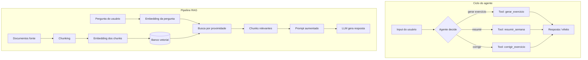
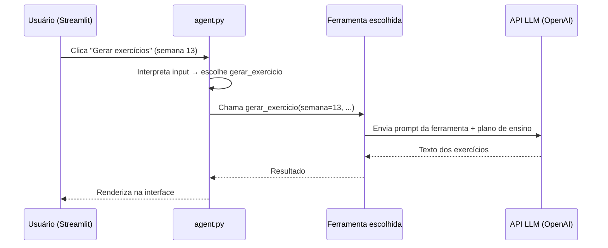
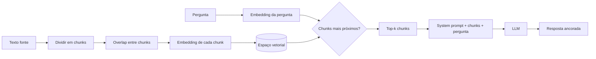

## Visão Geral do Conceito

Uma <mark style="background-color: #242424; padding: 2px 4px; border-radius: 3px; color: inherit;">`LLM`</mark> tradicional opera no modo **pergunta → resposta**: você envia texto, o modelo processa e devolve outro texto. Um **agente de IA** vai além: recebe uma entrada, **decide qual tarefa executar** entre um conjunto de ferramentas (<mark style="background-color: #242424; padding: 2px 4px; border-radius: 3px; color: inherit;">`tools`</mark>) que você programou e **age** — acessar e-mail, consultar banco de dados, chamar API, gerar exercício, corrigir código.

Esta é a última aula introdutória da disciplina Fluência em IA. O foco é **despertar o modelo mental** para o que virá em blocos futuros (agentes inteligentes, segurança em IA), não ensinar implementação completa. Mesmo assim, os conceitos aqui são centrais para qualquer desenvolvedor ADS que for integrar IA em sistemas reais.

O segundo eixo da aula aprofunda **RAG** (*Retrieval-Augmented Generation*): como quebrar documentos em pedaços, indexá-los em espaço vetorial e recuperar apenas os trechos relevantes antes de pedir resposta ao modelo — tornando a saída **ancorada em fontes** em vez de depender só do conhecimento paramétrico do treinamento.

> **Regra:** Um agente só pode fazer o que você **explicitamente** definiu como ferramenta. Não há "consciência" nem ações mágicas — há código, prompts e APIs que você autorizou.

---

## Modelo Mental

### LLM vs agente vs bot

| Tipo | Entrada | Processamento | Saída típica |
|------|---------|---------------|--------------|
| **LLM (chat)** | Texto | Geração probabilística de tokens | Texto |
| **Bot determinístico** | Evento (ex.: preço caiu 5%) | Regra fixa em código | Ação pré-definida |
| **Agente de IA** | Texto ou evento | LLM **escolhe** ferramenta → executa → pode encadear | Texto + efeitos no mundo (API, DB, e-mail) |

Pense no agente como um **estagiário com uma caixa de ferramentas etiquetada**. Você não diz "faça tudo"; você diz: "você pode gerar exercício, resumir semana, corrigir código ou conversar livremente". Quando chega um pedido, o estagiário lê a etiqueta certa, pega a ferramenta e executa.

Um bot de compra/venda de ações com regras `if preço < X: comprar()` **não** é agente — é automação. Você **pode** inserir um LLM no meio (ex.: ao detectar queda, pedir ao modelo uma análise antes de comprar), e aí entra a camada de agente — com os riscos que isso traz.

### RAG como bibliotecário vetorial

No [[prompts-resumos-aula-notebooklm]], o NotebookLM foi apresentado como emulação de RAG. Aqui o mecanismo é desmontado:

1. Documentos longos viram **chunks** (pedaços de texto).
2. Cada chunk vira **embedding** (vetor em espaço de alta dimensão).
3. Sua pergunta também vira vetor.
4. O sistema busca chunks **semanticamente próximos** da pergunta.
5. Esses chunks entram no prompt do LLM como contexto.

É como perguntar a um bibliotecário que **só pode citar páginas que ele acabou de buscar** na estante — não inventar do nada.



---

## Mecânica Central

### 1. Anatomia de um agente educacional (demo da aula)

O professor demonstrou um agente de mestrado com três camadas:

| Arquivo / camada | Papel |
|------------------|-------|
| <mark style="background-color: #242424; padding: 2px 4px; border-radius: 3px; color: inherit;">`app.py`</mark> | Front-end em <mark style="background-color: #242424; padding: 2px 4px; border-radius: 3px; color: inherit;">`Streamlit`</mark> — sliders, botões, chat |
| Módulo de ferramentas | Define funções Python: cada uma com **docstring descritiva** + **prompt específico** |
| <mark style="background-color: #242424; padding: 2px 4px; border-radius: 3px; color: inherit;">`agent.py`</mark> | "Cérebro": recebe input, escolhe ferramenta via <mark style="background-color: #242424; padding: 2px 4px; border-radius: 3px; color: inherit;">`build_tools`</mark>, executa |

Ferramentas demonstradas:

- Gerar exercícios (2 teóricos + 2 práticos + 1 desafio)
- Resumir conteúdo da semana
- Corrigir exercício do aluno
- Gerar plano de estudos
- Gerar quiz
- Chat livre

Cada ferramenta segue o mesmo padrão:

```python
def gerar_exercicio(plano_ensino: str, temperatura: float, semana: int) -> str:
  """Gera 2 exercícios teóricos, 2 práticos e 1 desafio com base no plano de ensino."""
  prompt = f"""Com base na semana {semana} do plano:
  {plano_ensino}
  Crie exercícios..."""
  # chamada à API do modelo com esse prompt
  return resposta
```

A **docstring** não é decoração: é o que o agente lê para decidir *quando* usar aquela função. No registro de tools, cada entrada traz `name`, `description` e referência à função — análogo a declarar: "você pode ler post, criar post, dar like".



**Agente "simulado" vs agente "de verdade":** na demo, todas as ferramentas só transformam texto em texto (chamadas à API). Um agente completo acessaria APIs externas — enviar e-mail, consultar agenda Google, executar compra — com implicações de segurança e custo.

### 2. Orquestração com n8n e sub-agentes

Em produção, o professor usa **n8n** (fluxograma de automação) com um agente principal que roteia para sub-agentes:

- Agente resumidor
- Agente pesquisador
- Agente criador de aula

Fluxo: mensagem do chat → prompt do sistema + texto do usuário → agente principal **escolhe** qual sub-agente acionar → sub-agente executa com seu próprio prompt.

Para perguntas sobre "últimas duas aulas", o sistema consulta **PostgreSQL** com metadados (disciplina, data). Para perguntas abrangentes ("em qual aula aprenderam f-string?"), usa **banco vetorial** — mais econômico do que enviar todas as transcrições ao modelo.

### 3. Memória: não é automática

> **Regra:** LLM puro **não tem memória** entre chamadas. Cada requisição é independente.

No agente Streamlit da demo, corrigir exercício **não** sabe o que foi gerado antes — são chamadas separadas. Para memória:

- Persistir histórico de chat em banco (PostgreSQL na demo n8n)
- Injetar trechos do histórico no prompt da próxima interação

ChatGPT e Gemini no navegador têm memória porque são **serviços** com camada de persistência — não porque o modelo "lembra" sozinho.

### 4. RAG em detalhe

**Chunking:** texto longo é dividido em pedaços (~500 caracteres/palavras na prática). Chunks pequenos demais perdem contexto (como ler "conseguiu deter a Deusa por algum tempo até que..." sem o início da história).

**Chunk size:** número de caracteres por pedaço. Aumentar melhora coerência local; aumenta custo de embedding e pode misturar temas no mesmo chunk.

**Overlap:** o chunk seguinte **recomeça** com o final do anterior. Evita cortes que quebram frases na fronteira entre segmentos.

**Embedding:** cada chunk vira vetor (ex.: 384 dimensões). Chunks sobre temas parecidos ficam **próximos** no espaço — assim como tokens com significado relacionado na aula de embeddings.

**Busca semântica:** a pergunta vira vetor; o sistema retorna os *k* chunks mais próximos (similaridade coseno ou distância euclidiana).

**Geração aumentada:** os chunks recuperados são concatenados à instrução de sistema; o LLM responde **com base nesse contexto**.



**Por que RAG é mais confiável que LLM sozinho:** a resposta usa trechos reais das suas fontes. Não é 100% — ainda há probabilidade e o modelo pode distorcer — mas é **muito mais seguro** que confiar só no treinamento paramétrico para fatos específicos da sua base (aulas, manuais internos, logs).

**Ferramenta de estudo:** [RAG Playground](https://ragplayground.streamlit.app/) — permite ajustar chunk size, overlap, visualizar embeddings em 3D e testar busca semântica (interface em inglês).

### 5. Parâmetros e custos

- <mark style="background-color: #242424; padding: 2px 4px; border-radius: 3px; color: inherit;">`temperatura`</mark>: no agente educacional, temperatura alta (ex.: 3) gera texto mais criativo/confuso; baixa mantém aderência ao plano de ensino.
- **Open Router:** intermediário entre sua aplicação e vários modelos — facilita trocar modelo e controlar custo por token.
- Cada chamada à API consome tokens (centavos por uso); expor agente publicamente sem proteção permite que terceiros gastem sua chave.

---

## Uso Prático

### Cenário ADS: assistente de documentação interna

Uma equipe de dados mantém transcrições de reuniões e documentação de pipelines. Em vez de perguntar ao chat genérico "como funciona o ETL de vendas?", você:

1. Indexa PDFs e transcrições em banco vetorial (chunks + embeddings).
2. Cria agente com tools: `buscar_documentacao`, `resumir_reuniao`, `gerar_diagrama_mermaid`.
3. O usuário pergunta; o agente escolhe `buscar_documentacao`; RAG recupera trechos do pipeline real; o LLM responde citando fontes.

### Cenário ADS: agente de correção de código (simplificado)

Padrão da demo educacional aplicado a logs de erro:

```python
TOOLS = [
    {
        "name": "corrigir_codigo",
        "description": "Analisa código Python do aluno contra enunciado e aponta erros.",
        "function": corrigir_codigo,
    },
    {
        "name": "explicar_conceito",
        "description": "Explica conceito de programação com exemplos curtos.",
        "function": explicar_conceito,
    },
]

def rotear(pergunta: str, historico: list[str]) -> str:
    # O agente (ou regras + LLM) escolhe a tool com base na descrição
    # e no conteúdo da pergunta
    ...
```

A correção funciona **sem memória do exercício gerado antes** — na demo, enunciado e resposta são enviados juntos na mesma chamada. Em produção, você persistiria o par enunciado/gabarito se quiser consistência.

### Quando usar RAG vs SQL vs LLM direto

| Pergunta | Estratégia | Motivo |
|----------|------------|--------|
| "Quais foram as duas últimas aulas de Python?" | SQL em metadados | Filtro estruturado por data/disciplina — barato e preciso |
| "Em qual aula ensinaram f-string?" | RAG / busca vetorial | Pergunta semântica sobre conteúdo em dezenas de transcrições |
| "Explique o que é uma variável" | LLM direto | Conhecimento geral do treinamento |
| "Qual o procedimento de deploy da empresa X?" | RAG em manuais internos | Fato específico que não está no treinamento |

---

## Erros Comuns

**Tratar qualquer automação com IA como "agente consciente"**  
Agentes que postam em redes sociais foram **programados** com tools de leitura e publicação. A imprensa sensacionaliza; o desenvolvedor definiu as rotas e permissões.

**Chunks minúsculos no RAG**  
Chunk size de ~50 caracteres produz trechos sem contexto. A busca retorna frases incompletas e o LLM alucina para preencher lacunas.

**Zero overlap em documentos técnicos**  
Cortar exatamente na fronteira entre parágrafos faz perder a conexão lógica. Overlap de 10–20% do chunk size é prática comum.

**Expor API key em agente Streamlit público**  
Qualquer usuário pode enviar prompts que consomem seus tokens ou abusar do modelo para tarefas não relacionadas (ex.: resolver trabalho de outra disciplina usando sua chave).

**Assumir memória entre abas do agente demo**  
Gerar exercício e depois corrigir são chamadas independentes. Se não enviar o enunciado na correção, o modelo não "sabe" o que pediu antes.

**Conectar agente direto à API de carteira sem salvaguardas**  
Se o LLM alucinar "compre 3 milhões de ações", um agente com permissão de trading executa. É necessário validação humana, limites de valor e confirmação em camadas.

**Confiar 100% no RAG**  
Fonte errada → resposta errada com aparência de autoridade. RAG reduz alucinação; não elimina. Valide fontes na ingestão.

---

## Visão Geral de Debugging

Quando um agente responde fora do escopo (ex.: falar de futebol em vez de Python):

1. **Revise o system prompt** — há restrição de domínio? ("Responda apenas sobre programação Python.")
2. **Teste injeção de prompt** — usuários podem pedir "ignore instruções anteriores"? Adicione camada de moderação ou filtro na entrada.
3. **Logue qual tool foi escolhida** — o roteamento errou ou a tool certa recebeu prompt ruim?
4. **Verifique temperatura** — valor alto em tarefa factual aumenta desvio.

Quando RAG retorna respostas irrelevantes:

1. **Inspecione os chunks recuperados** — são os top-k corretos? Ajuste *k* ou limiar de similaridade.
2. **Aumente chunk size** se trechos estiverem truncados sem sentido.
3. **Adicione overlap** se cortes estiverem na fronteira de conceitos.
4. **Confirme qualidade da fonte** — transcrição com erros de ASR gera embeddings ruins.

<details>
<summary>Checklist rápido antes de colocar agente em produção</summary>

- [ ] Tools têm descrição clara e escopo limitado
- [ ] API key em variável de ambiente, não no código
- [ ] Rate limiting e autenticação de usuário
- [ ] Filtro de prompt injection na entrada
- [ ] Logs de tool escolhida + tokens consumidos
- [ ] Ações irreversíveis (pagamento, delete) exigem confirmação humana
- [ ] RAG: fontes revisadas na ingestão

</details>

---

## Principais Pontos

- Agente = LLM + **decisão** + **ferramentas** programadas; não é sinônimo de chat.
- Cada tool precisa de descrição explícita (docstring) e prompt próprio.
- Bot com regras fixas ≠ agente; LLM pode ser camada opcional no meio.
- Memória em agentes customizados **precisa ser implementada** (banco, histórico no prompt).
- RAG: chunk → embed → armazenar → buscar por proximidade → augmentar prompt → gerar.
- Chunk size e overlap afetam diretamente qualidade da recuperação.
- Segurança: injeção de prompt, custo de API e permissões de tools são riscos reais.
- Perguntas estruturadas (data, disciplina) → SQL; perguntas semânticas em muito texto → RAG.

---

## Preparação para Prática

Após esta lição, você deve conseguir:

- Explicar o fluxo completo de um agente educacional (UI → agente → tool → LLM).
- Desenhar o pipeline RAG e justificar chunk size e overlap.
- Diferenciar quando usar metadados SQL versus busca vetorial.
- Listar três riscos ao publicar um agente com chave de API exposta.
- Identificar se um sistema descrito é LLM, bot ou agente.

---

## Laboratório de Prática

### Exercício 1 — Easy: Classificar sistema (LLM, bot ou agente)

Em um catálogo de automações de uma fintech, classifique cada item como `llm`, `bot` ou `agente`. Retorne dicionário com a classificação.

```python
from typing import Dict, Literal

SistemaTipo = Literal["llm", "bot", "agente"]

SISTEMAS = {
    "chat_suporte": "Usuário digita pergunta; GPT-4 responde texto de ajuda sem acessar sistemas.",
    "alerta_preco": "Se PETR4 cair 3% em 1h, envia e-mail fixo para analistas.",
    "assistente_ops": "LLM lê ticket, decide se consulta API de pedidos ou abre incidente no Jira.",
}


def classificar_sistemas() -> Dict[str, SistemaTipo]:
    resultado: Dict[str, SistemaTipo] = {}
    # TODO: para cada entrada em SISTEMAS, classificar como "llm", "bot" ou "agente"
    return resultado


if __name__ == "__main__":
    print(classificar_sistemas())
```

---

### Exercício 2 — Medium: Registro de tools para agente de logs

Implemente um registro mínimo de ferramentas no padrão da aula: cada tool tem `name`, `description` e `handler`. A função `escolher_tool_por_palavra_chave` recebe a pergunta do usuário e retorna o `name` da primeira tool cuja descrição contenha alguma palavra-chave listada (busca case-insensitive).

```python
from typing import Callable, Dict, List, Any

TOOLS: List[Dict[str, Any]] = [
    {
        "name": "filtrar_logs",
        "description": "Filtra linhas de log por nível ERROR ou WARNING",
        "keywords": ["erro", "error", "warning", "log"],
        "handler": lambda q: f"[filtrar_logs] processando: {q[:40]}",
    },
    {
        "name": "resumir_incidente",
        "description": "Resume incidente a partir de trechos de log anexados",
        "keywords": ["resumo", "incidente", "resumir"],
        "handler": lambda q: f"[resumir_incidente] processando: {q[:40]}",
    },
]


def escolher_tool_por_palavra_chave(pergunta: str) -> str:
    # TODO: iterar TOOLS; se alguma keyword aparecer em pergunta (lower), retornar name
    # TODO: se nenhuma corresponder, retornar "chat_livre"
    return "chat_livre"


def executar_tool(pergunta: str) -> str:
    nome = escolher_tool_por_palavra_chave(pergunta)
    for tool in TOOLS:
        if tool["name"] == nome:
            return tool["handler"](pergunta)
    return f"[chat_livre] {pergunta}"


if __name__ == "__main__":
    print(executar_tool("Preciso filtrar log com ERROR da API"))
    print(executar_tool("Faça um resumo do incidente de ontem"))
    print(executar_tool("Qual a capital da França?"))
```

---

### Exercício 3 — Hard: Chunking com overlap para pipeline RAG

Simule a primeira etapa de um pipeline RAG: divida um texto em chunks de tamanho fixo com overlap, como no RAG Playground da aula. Retorne lista de strings.

```python
from typing import List


def chunk_texto(texto: str, chunk_size: int, overlap: int) -> List[str]:
    """
    Divide texto em chunks de chunk_size caracteres.
    Cada chunk seguinte começa (chunk_size - overlap) posições após o início do anterior.
    overlap deve ser menor que chunk_size.
    """
    if overlap >= chunk_size:
        return []
    chunks: List[str] = []
    # TODO: percorrer texto com passo (chunk_size - overlap)
    # TODO: extrair texto[i : i + chunk_size] e adicionar à lista
    # TODO: parar quando o slice não tiver conteúdo novo
    return chunks


TEXTO_AULA = (
    "RAG é o processo de otimizar a saída de um LLM. "
    "Referencia conhecimento externo com maior autoridade. "
    "LLMs são treinadas em vastos volumes de dados. "
    "Chunks pequenos perdem contexto semântico necessário."
)


if __name__ == "__main__":
    partes = chunk_texto(TEXTO_AULA, chunk_size=80, overlap=20)
    for i, c in enumerate(partes):
        print(f"--- chunk {i} ({len(c)} chars) ---")
        print(c)
        print()
```

---

<!-- CONCEPT_EXTRACTION
concepts:
  - agente de IA
  - LLM tradicional
  - tools / ferramentas
  - orquestração n8n
  - RAG
  - chunks
  - chunk size
  - overlap
  - embeddings
  - banco de dados vetorial
  - busca semântica
  - memória de agente
  - prompt injection
skills:
  - Diferenciar LLM, bot determinístico e agente com tools
  - Descrever o ciclo decisão → tool → execução em agentes
  - Explicar o pipeline RAG de ponta a ponta
  - Configurar chunk size e overlap para documentos técnicos
  - Escolher entre consulta SQL estruturada e busca vetorial semântica
  - Identificar riscos de segurança ao expor agentes com API key
examples:
  - agente-educacional-streamlit-tools
  - n8n-subagentes-resumidor-pesquisador
  - rag-chunk-embedding-busca-semantica
  - registro-tools-docstring
-->

<!-- EXERCISES_JSON
[
  {
    "id": "classificar-llm-bot-agente",
    "slug": "classificar-llm-bot-agente",
    "difficulty": "easy",
    "title": "Classificar LLM, bot ou agente",
    "discipline": "fluencia-ia",
    "editorLanguage": "python",
    "tags": ["agentes", "llm", "classificacao"],
    "summary": "Classificar sistemas de automação como LLM puro, bot determinístico ou agente com ferramentas."
  },
  {
    "id": "registro-tools-agente-logs",
    "slug": "registro-tools-agente-logs",
    "difficulty": "medium",
    "title": "Registro de tools para agente de logs",
    "discipline": "fluencia-ia",
    "editorLanguage": "python",
    "tags": ["agentes", "tools", "roteamento"],
    "summary": "Implementar roteamento por palavra-chave para ferramentas de análise de logs."
  },
  {
    "id": "chunking-overlap-rag",
    "slug": "chunking-overlap-rag",
    "difficulty": "hard",
    "title": "Chunking com overlap para RAG",
    "discipline": "fluencia-ia",
    "editorLanguage": "python",
    "tags": ["rag", "chunking", "overlap"],
    "summary": "Dividir texto em chunks com tamanho fixo e overlap para simular etapa inicial de RAG."
  }
]
-->
