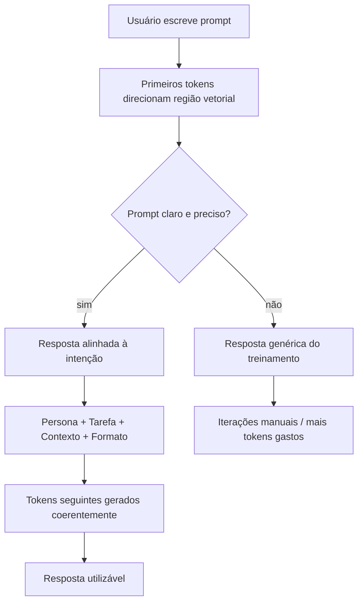
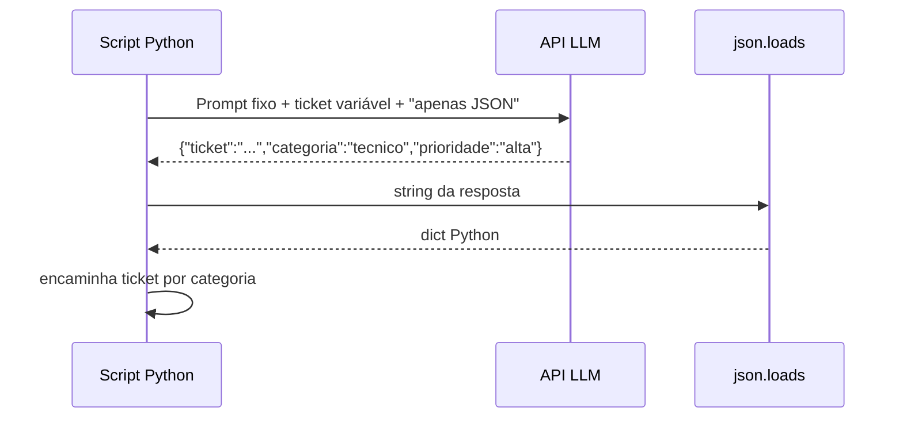

## Visão Geral do Conceito

**Engenharia de prompt** é a prática de formular instruções para modelos de linguagem (LLMs) de forma que a resposta gerada seja útil, precisa e adequada ao contexto real — faculdade, trabalho ou automação.

O problema que resolve: LLMs não "sabem" o que você quer até você **direcionar** a geração. Cada token que você escreve altera a probabilidade dos próximos tokens. Os **primeiros tokens** do seu prompt funcionam como a "primeira impressão" da conversa: eles empurram o modelo para uma região do seu espaço vetorial de significados (milhares de dimensões, não apenas três). Um prompt vago deixa a resposta depender quase exclusivamente do treinamento genérico; um prompt claro, conciso e preciso age como um **laser** em vez de um aviãozinho de papel — você controla para onde a resposta vai.

> **Regra:** Você não controla o treinamento da IA; controla o **prompt**. Essa é a alavanca que resta nas suas mãos.

Isso importa porque IA generativa já é ferramenta de produção: gerar exercícios, classificar tickets, extrair sentimento de redes sociais, montar roteiros. Sem prompt bem estruturado, você gasta tokens, tempo e iterações corrigindo respostas que poderiam vir certas na primeira tentativa.

## Modelo Mental

Pense na LLM como um sistema treinado para **reconhecer e reproduzir padrões** em texto. Ela leu milhões de documentos: textos de juízes, professores, poetas, piratas fictícios, engenheiros, crianças. Cada estilo de comunicação é um **padrão estatístico** que ela consegue imitar.

Quando você abre um chat, **quem inicia a conversa é você** — a IA não manda a primeira mensagem. Você injeta os primeiros tokens. A partir daí, o modelo continua a sequência coerente com o que veio antes.

Analogia do mapa vetorial: imagine todas as palavras como pontos num mapa gigante. Seu prompt inicial é o **ponto de partida**. "Explique como a água ferve" coloca o modelo numa região genérica de ciência. "Você é um poeta vitoriano. Explique como a água ferve" desloca o ponto de partida para a região de linguagem poética — tom, metáforas, profundidade diferente. "Você é professor de termodinâmica" desloca para região técnica com fórmulas e fenômenos físicos.



Não existe resposta "certa" universal da IA. A resposta do pirata não é pior que a do professor de termodinâmica — cada uma serve a um **contexto de uso** diferente (aula lúdica vs. aula universitária). A IA não julga qual persona é "mais correta"; ela imita o padrão solicitado. **Você** ainda precisa avaliar factualidade e utilidade.

## Mecânica Central

### Os ingredientes de um bom prompt

Um prompt eficaz combina componentes opcionais — não é obrigatório usar todos sempre, mas conhecer cada um permite montar instruções completas quando necessário.

| Componente | Função | Exemplo |
|------------|--------|---------|
| **Persona** | Papel que a IA assume; afeta tom, profundidade, linguagem | "Você é analista de suporte ao cliente sênior" |
| **Tarefa** | O que fazer (ação) | "Classifique o ticket abaixo" |
| **Contexto** | Fatos de fundo sobre situação, público, histórico | "Turma já viu listas, ainda não viu funções" |
| **Entrada** | Dado variável a processar | Texto do ticket, frase, cidade de viagem |
| **Saída** | Formato desejado da resposta | Tabela Markdown, JSON, bullet points |
| **Restrições** | Limites e proibições | "Não use bibliotecas externas"; "Máximo 200 palavras" |

O prompt mais simples útil costuma ser: **persona + tarefa** — "Você é X. Faça Y."

### Persona: maior retorno com menor esforço

A **persona** é a frase do tipo "Você é um…". Ela funciona porque a LLM já aprendeu padrões associados a papéis profissionais e estilos de escrita durante o treinamento.

Efeitos observáveis ao mudar só a persona (mesma pergunta "explique como a água ferve"):

- **Poeta vitoriano** → tom metafórico, narrativa emocional.
- **Pirata do século XVIII** → linguagem coloquial, analogias marítimas.
- **Professor de ciências do ensino fundamental** → linguagem acessível, analogias simples, profundidade moderada.
- **Professor de termodinâmica** → fórmulas, calor latente, nucleação, pressão de vapor.
- **Designer gráfico** → pode incluir elementos visuais (gráficos) mesmo sem pedir explicitamente.

Persona também **nivela complexidade** para programação: "Você é monitor de programação para iniciantes" tende a gerar código sem tratamento de erro excessivo e bibliotecas avançadas que alunos ainda não viram.

### Concisão vs. prompts longos

A engenharia de prompt evolui rapidamente (disciplina com poucos anos de história comparada a engenharia mecânica ou química). Tendência atual:

- **Antes:** prompts de várias páginas com dezenas de restrições.
- **Agora:** prompts **concisos e precisos** — modelos melhoraram na compreensão; tokens custam mais; sobrecarga de informação irrelevante pode desviar foco do que importa.

> **Atenção:** Conciso não significa vago. "Decida por mim se A ou B" não é economia — é abdicação de contexto. Economia é eliminar ruído, não eliminar informação essencial.

Consulte periodicamente a documentação dos provedores (OpenAI, Google, Anthropic) sobre práticas recomendadas; o que funciona hoje pode ser refinado amanhã.

### Prompts reutilizáveis: separar tarefa e entrada

Quando você usa o **mesmo prompt dezenas de vezes** (classificar tickets, gerar roteiros, criar exercícios), convém estruturar assim:

```
[PERSONA + TAREFA + CONTEXTO + FORMATO SAÍDA + RESTRIÇÕES — fixos]

Entrada: <dado variável>
```

Exemplo de suporte: persona e instrução de classificação ficam fixas; só o texto do ticket muda a cada chamada. Isso economiza tokens, tempo e torna o fluxo **reprodutível** — você não refaz correções manuais ("não use funções", "formato errado") a cada nova entrada.

Para uso único (ex.: roteiro de viagem a Belém), juntar tudo num parágrafo é aceitável.

### Formatos de saída e automação

Quando a resposta alimentará **código downstream** (pipeline, API, script Python), o formato de saída deixa de ser preferência estética e vira **requisito técnico**.

- **Tabela Markdown** — legível para humanos; parsing frágil em automação.
- **JSON puro** — estrutura padronizada; campos acessíveis por chave (`ticket`, `categoria`, `prioridade`).
- **Restrição crítica:** "Responda **apenas** JSON, sem texto antes ou depois."

Texto extra quebra <mark style="background-color: #242424; padding: 2px 4px; border-radius: 3px; color: inherit;">`json.loads()`</mark> e impede mapeamento confiável de campos.



### Zero-shot, one-shot e few-shot

| Técnica | O que você fornece | Quando usar |
|---------|-------------------|-------------|
| **Zero-shot** | Só instrução, sem exemplos | Tarefas simples e bem definidas |
| **One-shot** | 1 par entrada → saída | Calibrar formato ou classificação |
| **Few-shot** | Vários pares entrada → saída | Tarefas ambíguas, formato rígido, nuances |

Exemplos ensinam não só o rótulo, mas **tamanho**, **estilo** e **profundidade** da resposta. Se você pede classificação de sentimento e dá:

- Entrada: "O filme foi divertido" → Saída: "positivo"

A resposta tende a ser só o rótulo, sem justificativa longa. Com few-shot incluindo justificativas curtas, o modelo replica esse padrão. Combine exemplos com **restrições explícitas** ("justificativa com no máximo 10 palavras") quando necessário.

### Memória de conversa vs. contexto zerado

Comportamento depende do canal:

- **Chat web (conta logada):** pode reter memória de conversas anteriores, projetos, preferências — útil para continuidade (ex.: planejamento de corrida), mas introduz **viés** se você quer resposta neutra.
- **Modo anônimo / nova conversa:** contexto limpo; resposta sem histórico pessoal.
- **API:** cada chamada começa **zerada** salvo contexto que você injeta explicitamente no prompt ou via sistema de memória que **você** implementa.

Vantagens e desvantagens coexistem; escolha conforme necessidade de neutralidade vs. personalização.

## Uso Prático

### Exemplo 1: Classificação de tickets (zero-shot estruturado)

Prompt completo para suporte ao cliente:

```
Você é analista de suporte ao cliente.

Classifique o ticket abaixo como técnico, financeiro ou geral.
Considere o tema principal e a urgência implícita.

Responda em tabela Markdown com colunas: ticket | categoria | prioridade

Ticket: Não consigo acessar minha conta desde ontem. Recebi mensagem
de erro "login falhou". Preciso urgente.
```

Resposta esperada: categoria **técnico**, prioridade **alta** (urgência explícita).

Segunda entrada — só o ticket muda:

```
Ticket: Não consigo processar o pagamento e o boleto vence em cinco dias.
O que faço?
```

Resposta esperada: categoria **financeiro**, prioridade **média** (prazo de cinco dias, não imediato).

### Exemplo 2: Mesmo fluxo para automação (JSON)

```
Você é analista de suporte ao cliente.

Classifique o ticket como técnico, financeiro ou geral.
Considere tema principal e urgência.

Responda APENAS JSON com campos: ticket, categoria, prioridade.
Não inclua texto fora do JSON.

Ticket: <texto>
```

Script Python consumindo a resposta:

```python
import json

resposta_llm = '{"ticket": "login falhou", "categoria": "tecnico", "prioridade": "alta"}'
dados = json.loads(resposta_llm)
fila = f"fila_{dados['categoria']}"
# encaminhar ticket para fila correta
```

### Exemplo 3: Persona + contexto pedagógico

Gerar exercícios de Python alinhados ao nível da turma:

```
Você é professor de Python para iniciantes.

Tarefa: crie três exercícios sobre listas.

Contexto: a turma já viu variáveis, condicionais e loops, mas ainda
não viu funções nem bibliotecas externas.

Formato de saída: para cada exercício, enunciado + entrada esperada +
saída esperada.

Restrições: não use funções, não use bibliotecas externas (pandas, matplotlib).
Exercícios devem ser corrigíveis manualmente em até 5 minutos cada.
```

Compare com o prompt vago "crie três exercícios de listas" — que pode gerar código com <mark style="background-color: #242424; padding: 2px 4px; border-radius: 3px; color: inherit;">`pandas`</mark>, funções e complexidade inadequada.

### Exemplo 4: Few-shot para sentimento

```
Classifique o sentimento da frase como positivo, negativo ou neutro.

Exemplo:
Entrada: O filme foi divertido.
Saída: positivo

Exemplo:
Entrada: O jogo é entediante.
Saída: negativo

Entrada: O Brasil vai jogar a Copa do Mundo.
Saída: neutro

Restrição: justificativa com no máximo 10 palavras.

Entrada: O atendimento demorou, mas resolveram meu problema.
Saída:
```

### Exemplo 5: Agente de viagens (persona mínima)

Prompt fraco:

> "O que fazer em Belém por 14 dias?"

Prompt com persona:

> "Você é agente de viagens especializado em turismo ecológico. Vou ficar 14 dias em Belém. Recomende atividades na região metropolitana, incluindo como chegar e por que cada uma vale a pena."

A segunda versão tende a trazer recomendações mais alinhadas ao perfil (ecoturismo), transporte e justificativas — não apenas lista genérica de pontos turísticos.

### Template reutilizável para múltiplos clientes

```
Você é agente de viagens da Ferreira Viagens, especializado em turismo ecológico.

Tarefa: crie roteiro de viagem personalizado.

Contexto: cliente prefere contato com natureza; já visitou Manaus há 2 anos
e gostou de hotel de selva.

Formato: cronograma diário (Dia 1: ..., Dia 2: ...).

Restrições: orçamento máximo R$ 200/dia, exceto 3 dias com passeio de barco
até R$ 400.

Entrada: Belém, 14 dias
```

Próximo cliente — só muda a linha de entrada:

```
Entrada: Porto Alegre, 8 dias
```

## Erros Comuns

**Prompt vago esperando resposta mágica**
- Sintoma: "Me dá recomendações de investimento" → conselhos genéricos, possivelmente inadequados ao seu perfil.
- Correção: adicionar persona, capacidade financeira, horizonte, formato (ex.: 5 bullet points com justificativa).

**Confundir persona com contexto**
- Sintoma: "Explique banco de dados para uma criança de 10 anos" misturado sem clareza.
- Correção: persona = "Você é professor de informática do ensino fundamental"; contexto = "aluno de 10 anos, primeira aula sobre dados".

**Prompt quilométrico com informação irrelevante**
- Sintoma: modelo foca em detalhes secundários; resposta dispersa; custo alto de tokens.
- Correção: manter só o necessário; mover histórico repetitivo para memória externa ou documentação de sistema.

**Não especificar formato em automação**
- Sintoma: resposta vem com "Claro! Aqui está o JSON:" antes do objeto; pipeline quebra.
- Correção: restrição explícita "apenas JSON, sem markdown, sem texto adicional"; validar com exemplos few-shot.

**Assumir que persona garante correção factual**
- Sintoma: "Você é Einstein" → resposta soa autoritativa mas contém erro técnico.
- Correção: persona controla **estilo**, não **veracidade**. Sempre revisar fatos críticos.

**Reescrever prompt inteiro a cada iteração em fluxo repetitivo**
- Sintoma: gasto de tempo e tokens; inconsistência entre classificações.
- Correção: separar bloco fixo (persona, tarefa, formato) de entrada variável.

**Few-shot com exemplos contraditórios**
- Sintoma: classificações inconsistentes para entradas similares.
- Correção: revisar pares entrada/saída; garantir critérios uniformes de prioridade e categorias.

## Visão Geral de Debugging

Quando a resposta da LLM não serve, investigue nesta ordem:

1. **Primeiros tokens:** A persona e a tarefa estão explícitas? O prompt direciona ou está genérico?
2. **Formato:** A saída veio no formato pedido? Há texto extra, markdown fence (<mark style="background-color: #242424; padding: 2px 4px; border-radius: 3px; color: inherit;">\`\`\`json</mark>) ou campos faltando?
3. **Profundidade:** Persona adequada ao público? (Iniciante vs. especialista.)
4. **Exemplos:** Tarefa ambígua sem few-shot? Adicione 1–3 pares entrada/saída representativos.
5. **Restrições:** Limite de palavras, bibliotecas proibidas, urgência — estão declarados?
6. **Contexto externo:** Em API, você esqueceu de injetar histórico necessário? Em chat, memória antiga está enviesando?
7. **Iteração mínima:** Altere **um** componente por vez (persona, formato, exemplo) para isolar efeito.

<details>
<summary>Ver checklist rápido para automação com JSON</summary>

- Prompt pede "apenas JSON"?
- Exemplo few-shot mostra JSON válido na raiz?
- Script trata exceção de <mark style="background-color: #242424; padding: 2px 4px; border-radius: 3px; color: inherit;">`JSONDecodeError`</mark>?
- Campos esperados existem no schema (`categoria`, `prioridade`)?
- Testou com 3+ entradas variadas antes de produção?

</details>

## Principais Pontos

- Os **primeiros tokens** do prompt direcionam toda a geração; você controla o prompt, não o treinamento.
- **Persona** ("Você é…") é o ingrediente de maior custo-benefício: altera tom, profundidade, linguagem e até formato.
- Componentes úteis: persona, tarefa, contexto, entrada, saída, restrições — use conforme complexidade.
- Prompts modernos tendem a ser **concisos e precisos**, não necessariamente longos.
- Para **automação**, formato de saída (JSON puro) e restrições são obrigatórios, não opcionais.
- **Zero-shot** basta para tarefas simples; **few-shot** calibra formato e nuances.
- Separe **tarefa fixa** de **entrada variável** em prompts reutilizáveis.
- Não existe resposta "melhor" universal — existe resposta adequada ao **contexto de uso**.
- Persona não garante factualidade; **revise** respostas críticas.
- Memória de chat vs. API zerada: escolha consciente entre personalização e neutralidade.

## Preparação para Prática

Após esta lição, você deve conseguir:

- Montar prompt mínimo eficaz com persona + tarefa.
- Estruturar prompt reutilizável separando entrada variável.
- Definir formato JSON para pipeline de classificação automatizada.
- Aplicar one-shot ou few-shot para calibrar classificação de sentimento.
- Identificar prompt vago e reformulá-lo com contexto, restrições e saída explícita.
- Explicar por que texto extra na resposta quebra automação.

## Laboratório de Prática

### Easy — Persona e tarefa básicas

Você mantém um script que monta prompts para um assistente interno de RH. Complete a função para gerar um prompt que peça à LLM resumir currículos recebidos em formato profissional e conciso.

```python
def montar_prompt_resumo_cv(texto_cv: str) -> str:
    persona = ""  # TODO: definir persona adequada (analista de RH)
    tarefa = ""   # TODO: definir tarefa (resumir CV em no máximo 5 bullet points)
    entrada = f"Currículo:\n{texto_cv}"
    # TODO: montar e retornar string final concatenando persona, tarefa e entrada
    return "PLACEHOLDER"


if __name__ == "__main__":
    cv_exemplo = "Maria Silva, 5 anos como dev Python, Flask, SQL."
    prompt = montar_prompt_resumo_cv(cv_exemplo)
    print(prompt)
    assert "Maria Silva" in prompt
    assert len(prompt) > 50
```

### Medium — Classificador de tickets reutilizável

Implemente a parte fixa de um prompt de classificação de tickets e uma função que injeta apenas o ticket variável. O prompt deve exigir resposta **apenas JSON** com campos <mark style="background-color: #242424; padding: 2px 4px; border-radius: 3px; color: inherit;">`ticket`</mark>, <mark style="background-color: #242424; padding: 2px 4px; border-radius: 3px; color: inherit;">`categoria`</mark> e <mark style="background-color: #242424; padding: 2px 4px; border-radius: 3px; color: inherit;">`prioridade`</mark>.

```python
PROMPT_BASE = ""  # TODO: persona + tarefa + instrução JSON puro (sem texto extra)


def montar_prompt_ticket(texto_ticket: str) -> str:
    # TODO: concatenar PROMPT_BASE com seção Entrada contendo texto_ticket
    return "PLACEHOLDER"


def parse_resposta(resposta: str) -> dict:
    import json
    # TODO: fazer json.loads e retornar dict; tratar JSONDecodeError retornando {"erro": "formato_invalido"}
    return {}


if __name__ == "__main__":
    prompt = montar_prompt_ticket("Login falhou, preciso urgente.")
    assert "Login falhou" in prompt
    assert "JSON" in prompt.upper() or "json" in prompt

    ok = '{"ticket": "t1", "categoria": "tecnico", "prioridade": "alta"}'
    assert parse_resposta(ok)["categoria"] == "tecnico"

    ruim = "Aqui está: {\"ticket\": \"t1\"}"
    assert parse_resposta(ruim).get("erro") == "formato_invalido"
```

### Hard — Few-shot para sentimento com restrições

Monte um prompt few-shot para classificar feedback de app mobile e valide se a resposta simulada respeita o schema. Inclua três exemplos fixos, restrição de justificativa curta e parser robusto.

```python
EXEMPLOS_FEW_SHOT = [
    {"entrada": "O app abriu rápido hoje.", "saida": {"sentimento": "positivo", "justificativa": "elogio performance"}},
    {"entrada": "Travou três vezes seguidas.", "saida": {"sentimento": "negativo", "justificativa": "relato de instabilidade"}},
    {"entrada": "Atualizei ontem.", "saida": {"sentimento": "neutro", "justificativa": "fato sem avaliação"}},
]

RESTricao = "justificativa com no maximo 8 palavras"


def montar_prompt_sentimento(frase: str) -> str:
    # TODO: montar prompt com instrução, exemplos formatados, restrição e entrada frase
    # TODO: exigir resposta APENAS JSON com sentimento e justificativa
    return "PLACEHOLDER"


def validar_resposta(resposta: str) -> dict:
    import json
    # TODO: parse JSON; validar campos sentimento (positivo|negativo|neutro) e justificativa <= 8 palavras
    # TODO: retornar {"valido": True/False, "dados": ...} ou {"valido": False, "motivo": "..."}
    return {"valido": False, "motivo": "nao_implementado"}


if __name__ == "__main__":
    p = montar_prompt_sentimento("A nova interface ficou confusa.")
    assert "positivo" in p or "EXEMPLO" in p.upper() or "Exemplo" in p
    assert "8 palavras" in p or "8 palavras" in p.lower() or "maximo 8" in p.lower()

    boa = '{"sentimento": "negativo", "justificativa": "interface confusa para usuario"}'
    r = validar_resposta(boa)
    assert r.get("valido") is True
```

<!-- CONCEPT_EXTRACTION
concepts:
  - engenharia de prompt
  - tokens iniciais
  - persona
  - componentes do prompt (tarefa contexto entrada saída restrições)
  - zero-shot learning
  - one-shot learning
  - few-shot learning
  - formato de saída JSON
  - prompts reutilizáveis
  - memória de conversa vs API
skills:
  - Construir prompts com persona e tarefa explícitas
  - Separar bloco fixo de entrada variável em prompts reutilizáveis
  - Definir formato JSON para respostas em automações
  - Aplicar few-shot para calibrar classificação e formato
  - Diagnosticar prompts vagos e reformulá-los com restrições
  - Validar respostas JSON antes de encadear em pipeline
examples:
  - classificacao-tickets-suporte
  - persona-agua-fervendo
  - few-shot-sentimento-app
  - agente-viagens-belem
  - prompt-exercicios-python-iniciantes
-->

<!-- EXERCISES_JSON
[
  {
    "id": "prompt-persona-rh-cv",
    "slug": "prompt-persona-rh-cv",
    "difficulty": "easy",
    "title": "Montar prompt com persona de RH",
    "discipline": "fluencia-em-ia",
    "editorLanguage": "python",
    "tags": ["prompt", "persona", "python", "strings"],
    "summary": "Completar função que monta prompt com persona de analista de RH e tarefa de resumir CV."
  },
  {
    "id": "prompt-ticket-json-reutilizavel",
    "slug": "prompt-ticket-json-reutilizavel",
    "difficulty": "medium",
    "title": "Classificador de tickets com JSON reutilizável",
    "discipline": "fluencia-em-ia",
    "editorLanguage": "python",
    "tags": ["prompt", "json", "automacao", "suporte"],
    "summary": "Implementar prompt base fixo e parser JSON para classificação automatizada de tickets."
  },
  {
    "id": "prompt-few-shot-sentimento",
    "slug": "prompt-few-shot-sentimento",
    "difficulty": "hard",
    "title": "Few-shot de sentimento com validação",
    "discipline": "fluencia-em-ia",
    "editorLanguage": "python",
    "tags": ["prompt", "few-shot", "json", "validacao"],
    "summary": "Montar prompt few-shot para sentimento de feedback mobile e validar schema da resposta."
  }
]
-->
