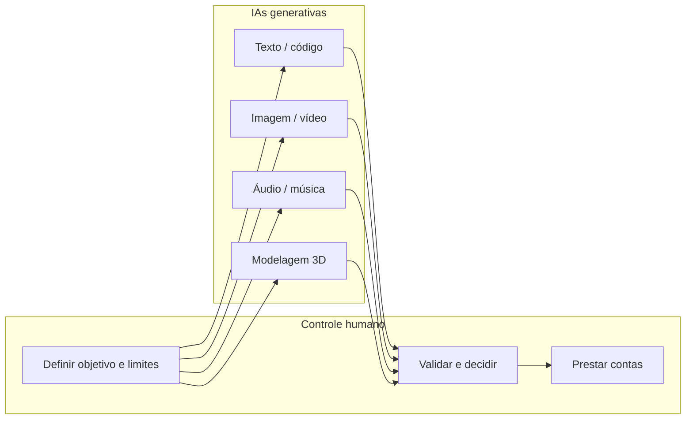
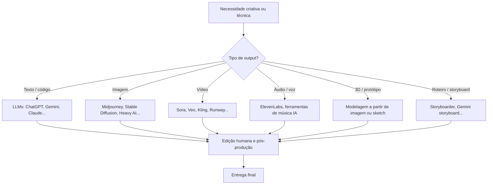
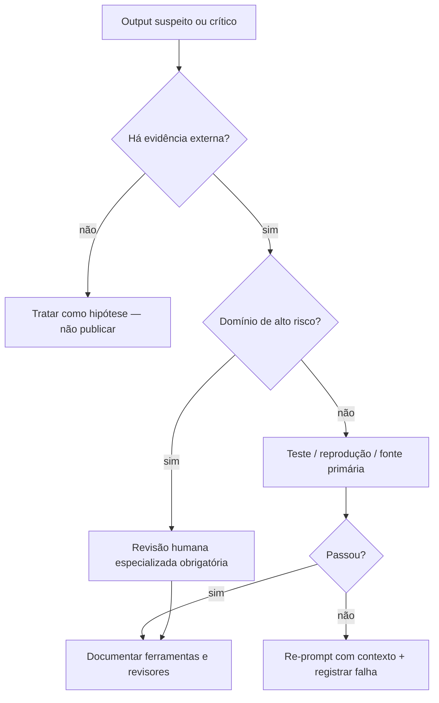

## Visão Geral do Conceito

Depois de discutir autoria, plágio e releitura na aula anterior, esta unidade aprofunda **como usar IAs generativas com responsabilidade** e **como o mercado realmente as emprega**. O problema central não é apenas "a IA pode ou não pode?" — é saber **quando confiar**, **quando verificar** e **como combinar ferramentas** sem perder autonomia humana.

> **Regra:** Toda resposta de IA generativa é uma **proposta estatística**, não um fato verificado. Trate como rascunho até passar por revisão humana no contexto certo.

A aula percorre quatro eixos:

1. **Armadilhas de confiança** — respostas bajuladoras, feedback falso sobre áudio, conteúdo viral sintético.
2. **Princípios éticos** — beneficência, não maleficência, autonomia, justiça, explicabilidade e **controle humano**.
3. **Impactos sociais e de mercado** — medicina, substituição de funções, preços que não caem mesmo com equipes enxutas.
4. **Ecossistema de ferramentas** — texto, imagem, vídeo, áudio, 3D e código; quase nunca uma IA só.

Para quem estuda ADS, isso importa porque você vai **integrar APIs**, **automatizar pipelines** e **publicar outputs** — e cada etapa exige critério técnico e ético.

---

## Modelo Mental

Pense na IA generativa como uma **oficina com vários especialistas parciais**, não como um funcionário completo.

| Metáfora errada | Metáfora correta |
|-----------------|------------------|
| "Peço e ela faz tudo sozinha" | "Ela acelera etapas; eu dirijo, corto, valido e assumo responsabilidade" |
| "Se soa convincente, está certo" | "Convencimento é efeito de linguagem; verificação é processo separado" |
| "Uma IA substitui a equipe" | "Várias IAs + humanos substituem partes de um fluxo antigo" |



**Completar tokens:** modelos de texto preveem a sequência mais provável dado o contexto. Isso explica elogios genéricos, "alucinações" plausíveis e respostas que **parecem** ouvir música ou analisar exames — sem ter acesso real ao que você imagina que foi processado.

**Neutralidade:** algoritmos refletem corpus, moderação, cultura e objetivos comerciais. Uma IA "brasileira", "chinesa" ou "estadunidense" não converge automaticamente para a mesma síntese; isso só aparece se você **provocar** comparação explícita e revisar as diferenças.

---

## Mecânica Central

### Princípios éticos (referência Floridi / Floride)

A literatura acadêmica sobre ética em IA — citada na aula via obra que enfatiza *"algoritmos não são neutros"* — organiza responsabilidades em eixos práticos:

| Princípio | O que exige na prática |
|-----------|------------------------|
| **Beneficência** | Usar IA para soluções que prosperem pessoas e contextos reais; escolher prompts e casos de uso alinhados a isso. |
| **Não maleficência** | Evitar danos: dados sensíveis expostos, desinformação, manipulação emocional, automação que elimina funções sem alternativa. |
| **Autonomia humana** | A IA sugere caminhos; **decisões finais** ficam com pessoas — especialmente em saúde, contratos e conteúdo público. |
| **Justiça** | Questionar quem ganha e quem perde com automação (ex.: design mais rápido, preço ao cliente que não cai). |
| **Explicabilidade** | Preferir fluxos em que dá para entender *o que* foi gerado, *com quais ferramentas* e *com qual revisão*. |
| **Controle humano** | Humanos projetam, operam, auditam e respondem pelos impactos — a IA **não** deve ser autônoma nem autorregulada. |

> **Regra:** Controle humano não é nostalgia de emprego; é **auditoria** — garantir que processos automatizados cumprem qualidade, legalidade e dignidade.

### Categorias de IAs generativas no ecossistema



**Texto e código:** úteis para rascunhos, refatoração e documentação; exigem revisão, testes e atenção a **janela de contexto** (conversas muito longas degradam coerência — especialmente em alguns modelos que não avisam quando estão no limite).

**Imagem e vídeo:** avanço rápido em realismo, remoção de pessoas de cenas, edição localizada (trocar roupa, remover objeto). Limitações: consistência de rosto, física, sincronia labial perfeita em todos os planos.

**Áudio e música:** nível técnico alto (afinação, modulação); debate ético sobre direitos autorais e substituição de artistas.

**3D:** imagem ou desenho 2D → malha poligonal → impressão 3D ou game asset; acelera protótipos, não elimina modelador na etapa de qualidade final.

### Reduzir "bajulação" no ChatGPT

Nas **configurações → personalização** (instruções customizadas), é possível orientar o modelo a agir como conselheiro crítico em vez de validar tudo automaticamente. Exemplo de instrução mencionada na aula:

```text
Antes de concordar com qualquer ideia ou opinião, analise criticamente
contexto, objetivos e implicações. Evite validação automática ou elogios
genéricos. Atue como conselheiro estratégico: pontos fortes, fracos,
riscos, contrapontos e sugestões práticas.
```

Efeito: respostas menos "encorajadoras" e mais analíticas — útil em ADS ao revisar arquitetura, PRs ou planos de projeto. **Gemini**, na experiência relatada na aula, pode não oferecer o mesmo nível de personalização equivalente.

### Limites técnicos relevantes

- **Contexto longo:** após muitas mensagens ou anexos, o modelo pode "esquecer" o que ele mesmo escreveu, falhar ao ler imagens novamente ou inventar continuidade — fenômeno conhecido como <mark style="background-color: #242424; padding: 2px 4px; border-radius: 3px; color: inherit;">`alucinação`</mark>.
- **Multimodal simulado:** pedir opinião sobre áudio inexistente pode gerar feedback detalhado e **falso** — o modelo completa um padrão plausível, não analisa o arquivo.
- **Conteúdo viral falso:** vídeos de canguru em avião, criança rezando no elevador, pássaros "protegendo filhotes" — engajamento emocional antes da checagem; quem informa a verdade pode ser recebido com frustração.

---

## Uso Prático

### Cenário 1 — Revisão crítica de resposta de LLM (ADS)

Você pediu à IA um plano de API REST. Antes de implementar:

1. Colar a resposta em um documento de revisão.
2. Marcar afirmações verificáveis (limites de rate, status HTTP, formato JSON).
3. Testar endpoints reais ou documentação oficial.
4. Registrar o que foi **aceito**, **alterado** ou **rejeitado** — explicabilidade para o time.

### Cenário 2 — Pipeline criativo real (comercial multi-IA)

Produções citadas na aula (ex.: comercial estilo corrida maluca / campanhas de moda) combinam:

- **Imagem:** Midjourney, Magnific, ferramentas de upscale.
- **Vídeo:** Kling, Adobe Firefly, Runway.
- **Áudio:** ElevenLabs.
- **Pós:** After Effects, colorização manual.

Ou seja: **orquestração** + **specialização por etapa** + **humano no final**. Tempo cai de meses para dias; custo ao cliente nem sempre cai — equipe enxuta, ferramentas caras, especialização premium.

### Cenário 3 — Storyboard e animatic

Ferramentas como storyboarders dedicados ou prompts técnicos no Gemini (close-up, plano americano, sequência) geram painéis a partir de roteiro. O animatic (storyboard em movimento) ainda exige escolhas de ritmo e continuidade — etapa humana.

### Cenário 4 — Edição localizada de imagem (Heavy AI e similares)

Fluxo típico:

1. Upload da imagem.
2. Segmentação semântica (homem, mulher, criança, objetos).
3. Seleção de região → prompt local ("retire este homem", "troque cor da camisa").
4. Revisão de artefatos nas bordas e coerência de iluminação.

Esse padrão inspirou edições similares em ChatGPT e Grok — sempre validar se a alteração afeta direitos de imagem e contexto do projeto.

### Exemplo Python — checklist mínimo de publicação de conteúdo assistido por IA

```python
from dataclasses import dataclass

@dataclass
class ConteudoAssistidoIA:
    titulo: str
    ferramentas: list[str]
    revisao_humana: bool
    fonte_dados_verificada: bool
    risco_etico: str  # baixo | medio | alto

def aprovado_para_publicar(item: ConteudoAssistidoIA) -> bool:
    if item.risco_etico == "alto" and not item.revisao_humana:
        return False
    if not item.ferramentas:
        return False
    return item.revisao_humana and item.fonte_dados_verificada

# Exemplo: post técnico de blog sobre API
post = ConteudoAssistidoIA(
    titulo="Guia de paginação REST",
    ferramentas=["Claude", "pytest"],
    revisao_humana=True,
    fonte_dados_verificada=True,
    risco_etico="medio",
)
print(aprovado_para_publicar(post))  # True
```

---

## Erros Comuns

**Confiar em feedback sobre mídia não enviada.** Sintoma: análise detalhada de mix, dicção ou arranjo sem arquivo anexado. Causa: o modelo simula competência de engenheiro de som. Correção: exigir upload, usar ferramentas de análise real (espectrograma, DAW) ou declarar que a opinião é especulativa.

**Tratar elogio da IA como validação profissional.** Sintoma: "Excelente ideia, continue!" em todo prompt. Correção: instruções de personalização críticas; pedir explicitamente riscos e contrapontos.

**Acreditar em vídeo viral só pelo realismo.** Sintoma: compartilhar conteúdo emocional (animais, crianças, escândalo) sem busca reversa ou fonte. Correção: olhar inconsistências (física, plástico, metadados); preferir fontes jornalísticas ou desmentido técnico.

**Conversa infinita no mesmo thread.** Sintoma: contradições, esquecimento de decisões anteriores, imagens ignoradas. Correção: resumir contexto em novo chat; manter documento externo do projeto (spec, ADR).

**Assumir neutralidade cultural.** Sintoma: uma resposta tratada como verdade universal. Correção: comparar modelos, explicitar público-alvo, citar fontes primárias.

**Automatizar decisão em domínio de alto risco sem auditoria.** Sintoma: diagnóstico, contrato ou peça publicitária sensível 100% gerada. Correção: humano especialista no loop; rastreabilidade de prompts e versões.

**Esperar uma IA para pipeline completo de produção.** Sintoma: frustração quando vídeo perde consistência facial ou código quebra em edge cases. Correção: mapear ferramenta por etapa e orçar revisão humana.

---

## Visão Geral de Debugging

Quando um output de IA parece "bom demais" ou inconsistente, use este fluxo:



**Ordem prática de checagem:**

1. **Provenance:** qual modelo, versão, prompt, data?
2. **Reprodutibilidade:** o mesmo prompt no mesmo modelo repete o erro?
3. **Fact-check:** datas, URLs, APIs, nomes de bibliotecas — um erro factual indica risco em todo o texto.
4. **Limite de contexto:** o thread está longo demais? Abrir conversa nova com resumo estruturado.
5. **Incentivos do modelo:** a resposta está só agradando? Reformular pedindo critério e incertezas.

<details>
<summary>Ver exemplo: falsa análise de áudio</summary>

**Sintoma:** IA descreve mix, compressão e dicção em faixa que nunca foi enviada.

**Diagnóstico:** padrão linguístico de review musical sem input multimodal real.

**Ação:** anexar arquivo; se indisponível, ignorar feedback técnico e usar apenas checklist humano ou ferramenta de áudio real.
</details>

---

## Principais Pontos

- IAs generativas **completam padrões plausíveis**; convencimento não é verificação.
- **Controle humano** é essencial: projetar, operar, auditar e prestar contas.
- **Algoritmos não são neutros** — corpus, moderação e mercado moldam respostas.
- Princípios éticos: beneficência, não maleficência, autonomia, justiça, explicabilidade.
- Produção profissional = **várias IAs especializadas** + edição humana + pós-produção.
- Conversas muito longas aumentam risco de **alucinação** e perda de contexto.
- Conteúdo sintético viral explora emoção; **checagem** antes de compartilhar.
- Mercado pode enxugar equipes sem repassar ganho de produtividade ao preço final — debate de justiça econômica.
- Avanços reais existem (medicina, acessibilidade, combate a câncer com supervisão humana), mas não eliminam critério ético.
- Personalização de prompts (ex.: ChatGPT) reduz bajulação e melhora uso profissional.

---

## Preparação para Prática

Ao concluir esta lição, você deve conseguir:

- Redigir **instruções de sistema** que forcem análise crítica em vez de elogios vazios.
- Montar um **mapa de ferramentas** para um entregável (texto + imagem + áudio + vídeo) identificando etapas humanas.
- Implementar em código um **gate de publicação** que exija revisão humana e rastreio de ferramentas.
- Detectar sinais de **output simulado** (feedback sem input, inconsistência em threads longos).
- Argumentar **controle humano** com base em princípios éticos, não apenas preferência pessoal.

---

## Laboratório de Prática

### Easy — Filtrar respostas bajuladoras genéricas

Você recebe logs de chat com respostas de um assistente de IA integrado a um portal de suporte ao desenvolvedor. Implemente a função que sinaliza respostas **excessivamente genéricas** e sem substância, para encaminhar à revisão humana.

**Critério mínimo:** resposta contém pelo menos duas frases de elogio vazio (lista fornecida) **e** não contém nenhum termo técnico da lista de substantivos permitidos.

```python
ELOGIOS_VAZIOS = [
    "excelente ideia",
    "ótima pergunta",
    "muito bem",
    "parabéns",
    "continue assim",
]

TERMOS_TECNICOS = [
    "api", "endpoint", "json", "sql", "erro", "log",
    "deploy", "teste", "bug", "refatorar",
]

def resposta_exige_revisao(texto: str) -> bool:
    # TODO: normalizar texto (minúsculas), contar elogios vazios
    # TODO: verificar presença de ao menos um termo técnico
    # TODO: retornar True se exige revisão humana
    return False


if __name__ == "__main__":
    amostras = [
        "Excelente ideia! Muito bem! Continue assim!",
        "O endpoint /users retorna 404 quando o id não existe no JSON.",
    ]
    for s in amostras:
        print(resposta_exige_revisao(s), s[:50])
```

---

### Medium — Pipeline human-in-the-loop para conteúdo gerado

Simule um microsserviço interno que só **libera** conteúdo gerado por IA para o CMS da empresa se passar por validações éticas mínimas.

Regras:

- <mark style="background-color: #242424; padding: 2px 4px; border-radius: 3px; color: inherit;">`risco_etico == "alto"`</mark> **sempre** exige <mark style="background-color: #242424; padding: 2px 4px; border-radius: 3px; color: inherit;">`revisao_humana == True`</mark>.
- Deve listar ao menos uma ferramenta em <mark style="background-color: #242424; padding: 2px 4px; border-radius: 3px; color: inherit;">`ferramentas`</mark>.
- Conteúdo sobre **saúde** ou **menores** eleva risco em um nível (baixo→medio, medio→alto).
- Retornar dicionário com <mark style="background-color: #242424; padding: 2px 4px; border-radius: 3px; color: inherit;">`aprovado`</mark>, <mark style="background-color: #242424; padding: 2px 4px; border-radius: 3px; color: inherit;">`motivos`</mark> (lista de strings) e <mark style="background-color: #242424; padding: 2px 4px; border-radius: 3px; color: inherit;">`risco_final`</mark>.

```python
from typing import Any

def elevar_risco(risco: str) -> str:
    ordem = ["baixo", "medio", "alto"]
    idx = ordem.index(risco)
    return ordem[min(idx + 1, len(ordem) - 1)]

def avaliar_publicacao(payload: dict[str, Any]) -> dict[str, Any]:
    motivos: list[str] = []
    risco = payload.get("risco_etico", "baixo")
    tags = payload.get("tags", [])

    # TODO: elevar risco se "saude" ou "menores" em tags (case insensitive)
    # TODO: validar ferramentas não vazia
    # TODO: se risco_final alto e não revisao_humana, reprovar
    # TODO: montar resposta {"aprovado": bool, "motivos": [...], "risco_final": str}

    return {"aprovado": False, "motivos": motivos, "risco_final": risco}


if __name__ == "__main__":
    demo = {
        "titulo": "Guia de exercícios para crianças",
        "ferramentas": ["ChatGPT"],
        "revisao_humana": False,
        "risco_etico": "medio",
        "tags": ["saude", "educacao", "menores"],
    }
    print(avaliar_publicacao(demo))
```

---

### Hard — Auditoria de pipeline criativo multi-IA

Uma agência registrou cada **etapa** de um comercial em JSON. Implemente a auditoria que verifica se o pipeline cumpre boas práticas da aula: diversidade de ferramentas, presença de etapa humana de pós-produção e rastreabilidade.

**Regras de conformidade:**

1. Pelo menos **3 categorias** distintas de ferramenta (`imagem`, `video`, `audio`, `texto`, `pos_producao`).
2. Pelo menos uma etapa com <mark style="background-color: #242424; padding: 2px 4px; border-radius: 3px; color: inherit;">`executor == "humano"`</mark>.
3. Etapa final deve ser humana ou <mark style="background-color: #242424; padding: 2px 4px; border-radius: 3px; color: inherit;">`pos_producao`</mark>.
4. Nenhuma etapa pode ter <mark style="background-color: #242424; padding: 2px 4px; border-radius: 3px; color: inherit;">`executor == "ia"`</mark> **e** <mark style="background-color: #242424; padding: 2px 4px; border-radius: 3px; color: inherit;">`validado == False`</mark> se `categoria == "publicacao"`.

Retorne <mark style="background-color: #242424; padding: 2px 4px; border-radius: 3px; color: inherit;">`{"conforme": bool, "lacunas": list[str], "categorias": list[str]}`</mark>.

```python
PIPELINE_EXEMPLO = [
    {"etapa": "concept", "categoria": "texto", "ferramenta": "Gemini", "executor": "ia", "validado": True},
    {"etapa": "frames", "categoria": "imagem", "ferramenta": "Midjourney", "executor": "ia", "validado": True},
    {"etapa": "clipes", "categoria": "video", "ferramenta": "Kling", "executor": "ia", "validado": True},
    {"etapa": "voz", "categoria": "audio", "ferramenta": "ElevenLabs", "executor": "ia", "validado": True},
    {"etapa": "cor", "categoria": "pos_producao", "ferramenta": "After Effects", "executor": "humano", "validado": True},
    {"etapa": "publicacao", "categoria": "publicacao", "ferramenta": "CMS", "executor": "ia", "validado": False},
]

def auditar_pipeline(etapas: list[dict]) -> dict:
    lacunas: list[str] = []
    categorias: set[str] = set()

    # TODO: coletar categorias (exceto "publicacao" para contagem de diversidade)
    # TODO: verificar >= 3 categorias de produção
    # TODO: verificar etapa humana
    # TODO: verificar etapa final
    # TODO: verificar regra de publicacao

    return {"conforme": len(lacunas) == 0, "lacunas": lacunas, "categorias": sorted(categorias)}


if __name__ == "__main__":
    print(auditar_pipeline(PIPELINE_EXEMPLO))
```

---

<!-- CONCEPT_EXTRACTION
concepts:
  - ética em IA
  - princípios de Floridi
  - controle humano
  - IAs generativas
  - orquestração multi-ferramenta
  - alucinação
  - neutralidade algorítmica
  - verificação crítica
  - personalização de prompts
skills:
  - Configurar instruções de sistema para respostas críticas
  - Mapear pipeline criativo com IAs especializadas por etapa
  - Detectar outputs simulados ou bajuladores
  - Implementar gates de revisão humana em código
  - Auditar conformidade ética de fluxos de publicação
examples:
  - personalizacao-chatgpt-conselheiro-critico
  - pipeline-comercial-multi-ia-adidas
  - checklist-publicacao-conteudo-assistido-ia
  - filtro-respostas-bajuladoras
  - auditoria-pipeline-agencia
-->

<!-- EXERCISES_JSON
[
  {
    "id": "filtrar-respostas-bajuladoras",
    "slug": "filtrar-respostas-bajuladoras",
    "difficulty": "easy",
    "title": "Filtrar respostas bajuladoras genéricas",
    "discipline": "fluencia-em-ia",
    "editorLanguage": "python",
    "tags": ["python", "etica-ia", "validacao", "strings"],
    "summary": "Implementar função que detecta elogios vazios sem conteúdo técnico e sinaliza necessidade de revisão humana."
  },
  {
    "id": "pipeline-human-in-the-loop",
    "slug": "pipeline-human-in-the-loop",
    "difficulty": "medium",
    "title": "Pipeline human-in-the-loop para CMS",
    "discipline": "fluencia-em-ia",
    "editorLanguage": "python",
    "tags": ["python", "etica-ia", "governanca", "dicionarios"],
    "summary": "Avaliar se conteúdo gerado por IA pode ser publicado conforme risco ético, tags sensíveis e revisão humana."
  },
  {
    "id": "auditoria-pipeline-criativo-multi-ia",
    "slug": "auditoria-pipeline-criativo-multi-ia",
    "difficulty": "hard",
    "title": "Auditoria de pipeline criativo multi-IA",
    "discipline": "fluencia-em-ia",
    "editorLanguage": "python",
    "tags": ["python", "etica-ia", "pipeline", "auditoria"],
    "summary": "Verificar conformidade de um pipeline de produção que combina várias IAs generativas e etapas humanas."
  }
]
-->
