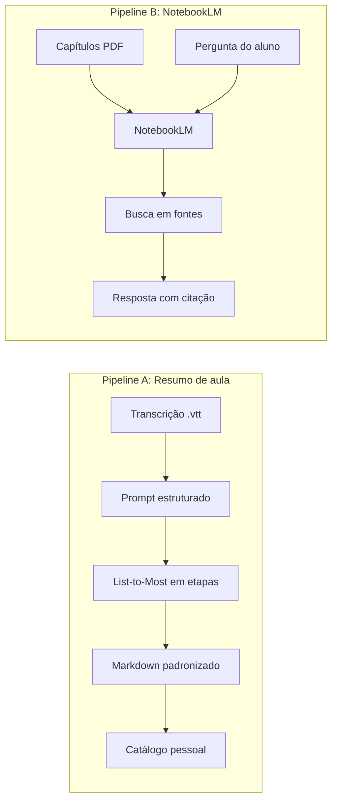
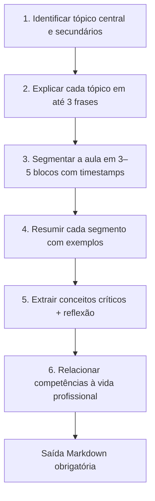
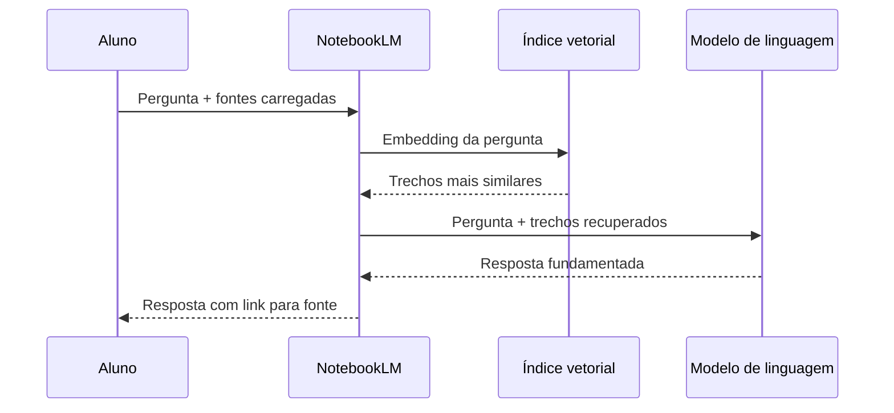

## Visão Geral do Conceito

Transcrições automáticas de aulas — arquivos <mark style="background-color: #242424; padding: 2px 4px; border-radius: 3px; color: inherit;">`.vtt`</mark> (WebVTT) — são matéria-prima valiosa, mas **ilegíveis para estudo direto**: cada segmento traz quem falou, há vícios de fala, ruído social e erros de reconhecimento de voz. A IA consegue interpretar esse material, porém um prompt vago como “resuma essa aula” produz textos bonitos porém **incompatíveis com um catálogo pessoal de estudos**.

O problema central desta lição é **industrializar a transformação**: transcrição bruta → resumo padronizado, repetível toda semana, com profundidade e formato previsíveis. Para isso você combina três ferramentas mentais:

1. Os **seis ingredientes** do prompt (persona, tarefa, contexto, entrada, saída, restrições).
2. A decomposição **List-to-Most** (quebrar a tarefa grande em etapas ordenadas).
3. Ferramentas ancoradas em fontes — especialmente o **NotebookLM** — que emulam **RAG** (*Retrieval-Augmented Generation*).

> **Regra:** Padronização de saída é tão importante quanto a qualidade do resumo. Um catálogo semanal só funciona quando cada aula ocupa a **mesma estrutura**.

---

## Modelo Mental

Imagine dois pipelines paralelos:

**Pipeline A — Resumo de aulas (prompt + transcrição)**  
Você baixa a transcrição da plataforma, anexa ao chat e executa um prompt que funciona como uma **linha de montagem**: primeiro identifica o tema real, depois segmenta a aula, extrai conceitos e só então monta o documento final em Markdown fixo.

**Pipeline B — Estudo bibliográfico (NotebookLM + PDFs)**  
Você carrega capítulos traduzidos/impressos como PDF, faz perguntas e a ferramenta **busca trechos similares** nas fontes antes de responder — como um colega que só pode citar o que está nos livros que você emprestou.



A transcrição bruta é como ouvir a aula pelo corredor: você captura palavras, mas perde estrutura. O prompt estruturado é o **roteirista** que reorganiza. O NotebookLM é o **bibliotecário** que só responde com base no acervo que você carregou.

---

## Mecânica Central

### 1. Por que transcrições WebVTT são difíceis de usar direto

Arquivos <mark style="background-color: #242424; padding: 2px 4px; border-radius: 3px; color: inherit;">`.vtt`</mark> segmentam a fala por tempo e locutor. Na prática você encontra:

- Repetições e fillers (“tipo”, “beleza”, “enfim”).
- Erros de ASR (*Automatic Speech Recognition*): termos técnicos distorcidos (“região oral” no lugar de outro conceito; números de núcleos de CPU/GPU incorretos).
- **Ruído conversacional** no início da aula (15 minutos sobre outro assunto) que pode ser confundido com o tema central.

A IA tolera ruído melhor que leitura humana linear, mas **não tolera instruções vagas** sobre o que fazer com esse ruído.

### 2. Os seis ingredientes aplicados ao resumo de aula

| Ingrediente | Papel no resumo de aula | Exemplo concreto |
|-------------|-------------------------|------------------|
| **Persona** | Define tom e profundidade | “Você é um tutor pedagógico de uma faculdade de TI…” |
| **Tarefa** | O que executar | “Resumir aulas a partir da transcrição em anexo” |
| **Contexto** | Público e ambiente | Aulas síncronas no Zoom; nível iniciante a intermediário |
| **Entrada** | Formato dos dados | Arquivo <mark style="background-color: #242424; padding: 2px 4px; border-radius: 3px; color: inherit;">`.vtt`</mark> anexado |
| **Saída** | Formato e seções obrigatórias | Template Markdown com segmentos, conceitos, aplicação profissional |
| **Restrições** | Limites de inventividade | “Não invente termos; não trate assuntos ausentes na transcrição” |

Um prompt inicial mínimo já melhora em relação a “resuma”, mas ainda falta **estrutura de processo** — daí o List-to-Most.

### 3. List-to-Most: decomposição antes da síntese

<mark style="background-color: #242424; padding: 2px 4px; border-radius: 3px; color: inherit;">`List-to-Most`</mark> é o nome em inglês para **decompor um problema complexo em etapas menores** no prompt, executando cada uma antes da próxima, com possibilidade de auto-refinamento no final.

Para resumos de aula, a sequência evolutiva construída em aula foi:



**Por que a etapa 1 vem primeiro?**  
Sem ela, a IA pode assumir que o bate-papo inicial (guerra, Bitcoin, memes, presença) é o “assunto principal”. A instrução “analise o conteúdo **completo** da aula antes de resumir” força leitura global.

**Refinamentos importantes descobertos na prática:**

- Unir identificação e explicação de tópicos no mesmo item (evita repetição).
- Limitar segmentos a **3–5 blocos** (introdução, exemplos, prática, conclusão) — senão a IA cria segmentos de 2 minutos, inúteis para navegação.
- Remover glossário e quiz quando o objetivo é **catálogo enxuto** semanal.
- Exigir template Markdown explícito; sem isso, a formatação “quebra” mesmo com boas instruções textuais.

### 4. Formato de saída como contrato

> **Regra:** Quando a saída alimenta outro sistema (Notion, site, planilha, pipeline ISS), trate o formato como **contrato**, não sugestão.

Esqueleto de saída (adaptável):

```markdown
## Tópico central
[conteúdo]

## Tópicos secundários
[conteúdo]

## Segmentos da aula
### Segmento 1 — [título] (00:00–15:00)
[resumo com exemplos]

### Segmento 2 — ...
...

## Conceitos críticos e reflexão
- Conceito: ...
  Reflexão: ...

## Aplicação na vida profissional
[conteúdo]
```

Alternativa avançada: exigir JSON com campos fixos quando um front-end (como projetos de agentes multi-etapa) precisa parsear automaticamente.

### 5. NotebookLM e RAG em linguagem de ADS

O **NotebookLM** (Google) cria um *notebook* onde você adiciona **fontes**: PDFs, sites, vídeos do YouTube, texto colado, arquivos do Drive. Limite prático: **até 50 fontes** no plano gratuito de aluno — relevante quando você tem dezenas de aulas por semestre e precisa **consolidar** PDFs (vários capítulos em um arquivo).

Fluxo simplificado de RAG:



Pontos-chave:

- **Não é RAG puro:** ainda há um LLM por trás; se você pedir “exemplos novos que não estão na bibliografia”, ele pode criar — um RAG estrito não faria isso.
- **Citações clicáveis** reduzem alucinação conceitual pesada.
- **System prompt** do notebook controla apresentações, mapas mentais, flashcards, podcasts, relatórios e infográficos gerados a partir das mesmas fontes.

Workflow bibliográfico demonstrado em aula:

1. Acessar trilha da disciplina (ex.: Python) na plataforma.
2. Traduzir capítulo no navegador, imprimir/salvar como PDF.
3. Carregar PDFs no NotebookLM.
4. Perguntar, gerar mapa mental, flashcards ou guia de estudo.

Para **slides de aula**, o professor usa system prompt detalhado (número de slides, títulos, imagens, tom) em vez de clicar no botão genérico — controle explícito vence automação opaca.

---

## Uso Prático

### Obter a transcrição na plataforma

1. Entrar na disciplina → **Aulas**.
2. Abrir a gravação desejada.
3. Baixar a **transcrição** (formato <mark style="background-color: #242424; padding: 2px 4px; border-radius: 3px; color: inherit;">`.vtt`</mark>).
4. Inspecionar no editor de texto para calibrar expectativa sobre ruído.

### Prompt base evolutivo (trecho representativo)

```text
Persona: Você é um tutor pedagógico de uma faculdade de TI.

Tarefa: A partir da transcrição WebVTT em anexo, produza um resumo
estruturado de aula lecionada de forma síncrona.

Contexto: Público majoritariamente iniciante a intermediário; aulas via Zoom.

Entrada: Arquivo .vtt em anexo.

Execute as etapas NA ORDEM, concluindo cada uma antes da próxima:

1. Analisando o conteúdo COMPLETO, identifique o tópico central e os
   secundários. Para cada um, escreva até 3 frases curtas.

2. Identifique de 3 a 5 segmentos da aula (introdução, desenvolvimento,
   exemplos, prática, conclusão). Para cada segmento, informe intervalo
   aproximado de tempo e um resumo com exemplos mencionados.

3. Liste conceitos críticos da aula. Para cada conceito, proponha uma
   reflexão que o aluno deve fazer para compreender de fato.

4. Demonstre como as competências da aula se aplicam na vida profissional
   de um desenvolvedor ADS.

Restrições:
- Não invente termos ou assuntos ausentes na transcrição.
- A saída deve ser APENAS Markdown no formato abaixo, sem comentários meta.

[COLE O TEMPLATE DE SAÍDA AQUI]
```

### Rotina semanal sugerida (catálogo pessoal)

| Dia | Ação |
|-----|------|
| Seg–Sex | Assistir aulas; baixar transcrições |
| Sábado | Executar prompt padronizado em cada `.vtt` |
| Armazenamento | Salvar Markdown/PDF no Notion, Drive ou repositório git pessoal |
| Revisão | Usar NotebookLM com capítulos PDF para aprofundar conceitos técnicos |

### NotebookLM: perguntas que funcionam bem

```text
Quais as principais diferenças entre for e while segundo as fontes?
```

```text
Crie flashcards sobre list comprehension com base apenas nos capítulos carregados.
```

```text
Gere um mapa mental em português exclusivamente a partir das fontes.
```

Para apresentações controladas, edite o **system prompt** da geração de slides em vez de usar o botão padrão.

---

## Erros Comuns

**Confundir introdução social com tema central**  
*Sintoma:* resumo fala de Bitcoin, política ou futebol em vez de clusterização/SQL.  
*Correção:* etapa 1 do List-to-Most + “conteúdo completo da aula”.

**Prompt sem template de saída**  
*Sintoma:* uma aula em bullets, outra em parágrafos, outra com seções extras.  
*Correção:* seção “Sua saída deve obrigatoriamente seguir este formato Markdown”.

**Segmentação excessiva**  
*Sintoma:* dezenas de segmentos de 1–2 minutos.  
*Correção:* instruir “3 a 5 segmentos” com nomes pedagógicos (introdução, exemplos…).

**Glossário desconectado do resumo**  
*Sintoma:* termos que nem aparecem no material resumido.  
*Correção:* quando usar glossário, limitar a “termos presentes no resumo”.

**NotebookLM com fontes demais sem consolidar**  
*Sintoma:* estourar limite de 50 fontes no semestre.  
*Correção:* juntar capítulos/aulas em PDFs consolidados por disciplina ou módulo.

**Esperar que NotebookLM invente exercícios originais sem instrução**  
*Sintoma:* exercícios são variações literais dos livros.  
*Correção:* pedir explicitamente novos cenários **e** definir formato/dificuldade — ou usar agente dedicado a exercícios.

**Ignorar idioma nas gerações automáticas**  
*Sintoma:* mapa mental em inglês com fontes em português.  
*Correção:* system prompt + configuração de idioma + revisão pós-geração.

---

## Visão Geral de Debugging

Quando o resumo ou a resposta do notebook “não bate” com a aula:

1. **Valide a fonte** — Abra o `.vtt` no trecho citado; confirme se o erro veio da transcrição ou da inferência.
2. **Isole a etapa** — Rode só a etapa 1 (tópicos) e verifique se o central está correto antes de pedir segmentos.
3. **Compare com prompt mínimo** — Execute “resuma em 5 linhas” e diff mental: o que mudou quando você adicionou estrutura?
4. **Inspecione o template** — Se a IA “quebrou tudo”, geralmente o Markdown de exemplo tinha numeração ambígua; simplifique cabeçalhos.
5. **No NotebookLM, clique na citação** — Se o trecho recuperado for irrelevante, reformule a pergunta ou adicione/remova fontes.
6. **Verifique limites** — 50 fontes, PDFs corrompidos ou capítulos errados geram respostas vagas.

<details>
<summary>Ver checklist rápido de prompt de resumo</summary>

- [ ] Persona alinhada ao curso (TI amplo vs. ciência de dados específica)
- [ ] Restrição anti-alucinação presente
- [ ] List-to-Most com ordem explícita
- [ ] Template Markdown colado integralmente
- [ ] Segmentos limitados a 3–5
- [ ] Saída testada em aula com digressão longa no início

</details>

---

## Principais Pontos

- Transcrições <mark style="background-color: #242424; padding: 2px 4px; border-radius: 3px; color: inherit;">`.vtt`</mark> são úteis como entrada, não como material de estudo final.
- Resumos semanais exigem **formato fixo**, não só boa redação.
- List-to-Most evita que ruído inicial domine o resumo.
- Template Markdown (ou JSON) funciona como contrato de saída.
- NotebookLM emula RAG: recupera trechos das fontes antes de responder.
- System prompts controlam slides, mapas mentais, flashcards e idioma.
- Projetos com múltiplos agentes (ex.: sumarizador + estilo) escalam o mesmo princípio visto na construção manual do prompt.

---

## Preparação para Prática

Após esta lição, você deve conseguir:

- Baixar e avaliar qualidade de uma transcrição WebVTT.
- Montar um prompt com os seis ingredientes para resumo de aula.
- Decompor a tarefa em etapas List-to-Most com restrições anti-alucinação.
- Definir um template Markdown reutilizável para catálogo semanal.
- Configurar um notebook no NotebookLM com PDFs bibliográficos.
- Explicar, em uma frase, como RAG reduz erro conceitual em perguntas fechadas sobre material de curso.
- Identificar quando usar chat genérico vs. ferramenta ancorada em fontes.

---

## Laboratório de Prática

### Exercício 1 — Easy: Completar ingredientes faltantes do prompt

Você mantém um script que monta prompts para resumir aulas da graduação. Complete os campos marcados com `TODO` para que o prompt tenha persona, contexto e restrição mínima.

```python
def build_summary_prompt(course_name: str) -> str:
    persona = ""  # TODO: definir persona de tutor pedagógico de faculdade de TI

    task = (
        "Sua tarefa é resumir a aula a partir da transcrição WebVTT em anexo."
    )

    context = ""  # TODO: mencionar aulas síncronas Zoom e nível iniciante-intermediário

    input_spec = "Entrada: arquivo .vtt anexado pelo usuário."

    output_spec = "Saída: apenas Markdown com seções Tópico central e Segmentos."

    restrictions = ""  # TODO: proibir inventar termos ausentes na transcrição

    return "\n\n".join([persona, task, context, input_spec, output_spec, restrictions])


if __name__ == "__main__":
    prompt = build_summary_prompt("Fluência em IA")
    print(prompt)
```

---

### Exercício 2 — Medium: Implementar etapas List-to-Most

Complete a função que gera a seção de instruções ordenadas do prompt. Cada etapa deve ser uma string numerada; a ordem importa para o modelo.

```python
from typing import List


def list_to_most_steps() -> List[str]:
    steps: List[str] = []

    # TODO: etapa 1 — identificar tópico central e secundários com até 3 frases cada
    steps.append("")

    # TODO: etapa 2 — segmentar a aula em 3 a 5 blocos com timestamps aproximados
    steps.append("")

    # TODO: etapa 3 — listar conceitos críticos com pergunta de reflexão por conceito
    steps.append("")

    # TODO: etapa 4 — relacionar competências da aula à vida profissional ADS
    steps.append("")

    return steps


def build_process_prompt(steps: List[str]) -> str:
    header = "Execute cada etapa abaixo NA ORDEM antes de passar à próxima:\n"
    body = "\n".join(f"{i + 1}. {step}" for i, step in enumerate(steps) if step)
    return header + body


if __name__ == "__main__":
    print(build_process_prompt(list_to_most_steps()))
```

---

### Exercício 3 — Hard: Validador de template Markdown de saída

Você integra o resumo ao catálogo ISS-like. Implemente a validação: dado o texto devolvido pela IA, verifique se contém **todas** as seções obrigatórias (como cabeçalhos `##`). Retorne lista de seções faltantes; lista vazia significa conformidade.

```python
from typing import List


REQUIRED_SECTIONS = [
    "## Tópico central",
    "## Tópicos secundários",
    "## Segmentos da aula",
    "## Conceitos críticos e reflexão",
    "## Aplicação na vida profissional",
]


def missing_sections(markdown_output: str) -> List[str]:
    missing: List[str] = []
    # TODO: para cada seção em REQUIRED_SECTIONS, verificar presença no texto
    # TODO: retornar apenas as que faltarem (comparação exata do cabeçalho)
    return missing


SAMPLE_OK = """\
## Tópico central
Prompts estruturados

## Tópicos secundários
NotebookLM

## Segmentos da aula
### Segmento 1 — Introdução (00:00–10:00)
Contexto da disciplina

## Conceitos críticos e reflexão
- List-to-Most: decomposição de tarefas

## Aplicação na vida profissional
Documentar aulas para revisão em projetos
"""

SAMPLE_BAD = """\
## Tópico central
Só isso
"""


if __name__ == "__main__":
    print(missing_sections(SAMPLE_OK))   # esperado: []
    print(missing_sections(SAMPLE_BAD))  # esperado: lista com seções faltantes
```

---

<!-- CONCEPT_EXTRACTION
concepts:
  - transcrição WebVTT
  - engenharia de prompts
  - seis ingredientes do prompt
  - List-to-Most
  - decomposição de tarefas
  - template de saída Markdown
  - NotebookLM
  - RAG
  - system prompt
  - limite de fontes
skills:
  - Baixar e inspecionar transcrições .vtt de aulas gravadas
  - Construir prompts com persona, contexto, saída e restrições
  - Decompor tarefas de resumo em etapas List-to-Most ordenadas
  - Definir contratos de saída Markdown para catálogos de estudo
  - Configurar NotebookLM com fontes PDF e interpretar citações
  - Explicar o fluxo básico de recuperação de trechos (RAG)
  - Diagnosticar falhas de prompt (tema errado, formato inconsistente)
examples:
  - prompt-resumo-vtt-seis-ingredientes
  - list-to-most-segmentos-aula
  - notebooklm-pergunta-for-vs-while
  - validador-secoes-markdown
-->

<!-- EXERCISES_JSON
[
  {
    "id": "completar-ingredientes-prompt-resumo",
    "slug": "completar-ingredientes-prompt-resumo",
    "difficulty": "easy",
    "title": "Completar ingredientes do prompt de resumo",
    "discipline": "fluencia-em-ia",
    "editorLanguage": "python",
    "tags": ["prompt-engineering", "python", "template-string"],
    "summary": "Preencher persona, contexto e restrições em um gerador de prompt para resumos de aula WebVTT."
  },
  {
    "id": "list-to-most-etapas-resumo",
    "slug": "list-to-most-etapas-resumo",
    "difficulty": "medium",
    "title": "Implementar etapas List-to-Most",
    "discipline": "fluencia-em-ia",
    "editorLanguage": "python",
    "tags": ["list-to-most", "decomposicao", "prompt-engineering"],
    "summary": "Codificar as quatro etapas ordenadas de decomposição para resumo estruturado de transcrições."
  },
  {
    "id": "validador-template-markdown-resumo",
    "slug": "validador-template-markdown-resumo",
    "difficulty": "hard",
    "title": "Validador de template Markdown de resumo",
    "discipline": "fluencia-em-ia",
    "editorLanguage": "python",
    "tags": ["validacao", "markdown", "automacao"],
    "summary": "Implementar verificação de seções obrigatórias na saída da IA antes de publicar no catálogo."
  }
]
-->
