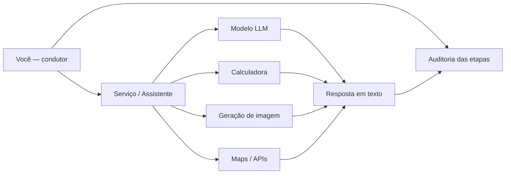
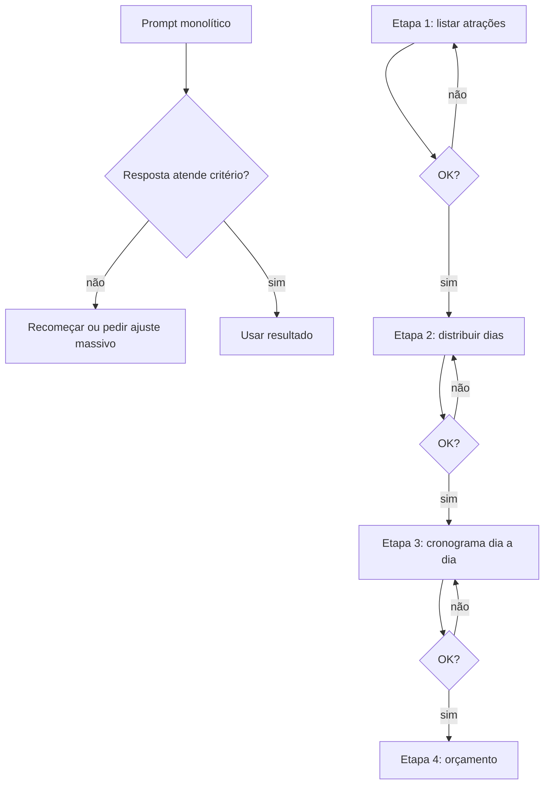
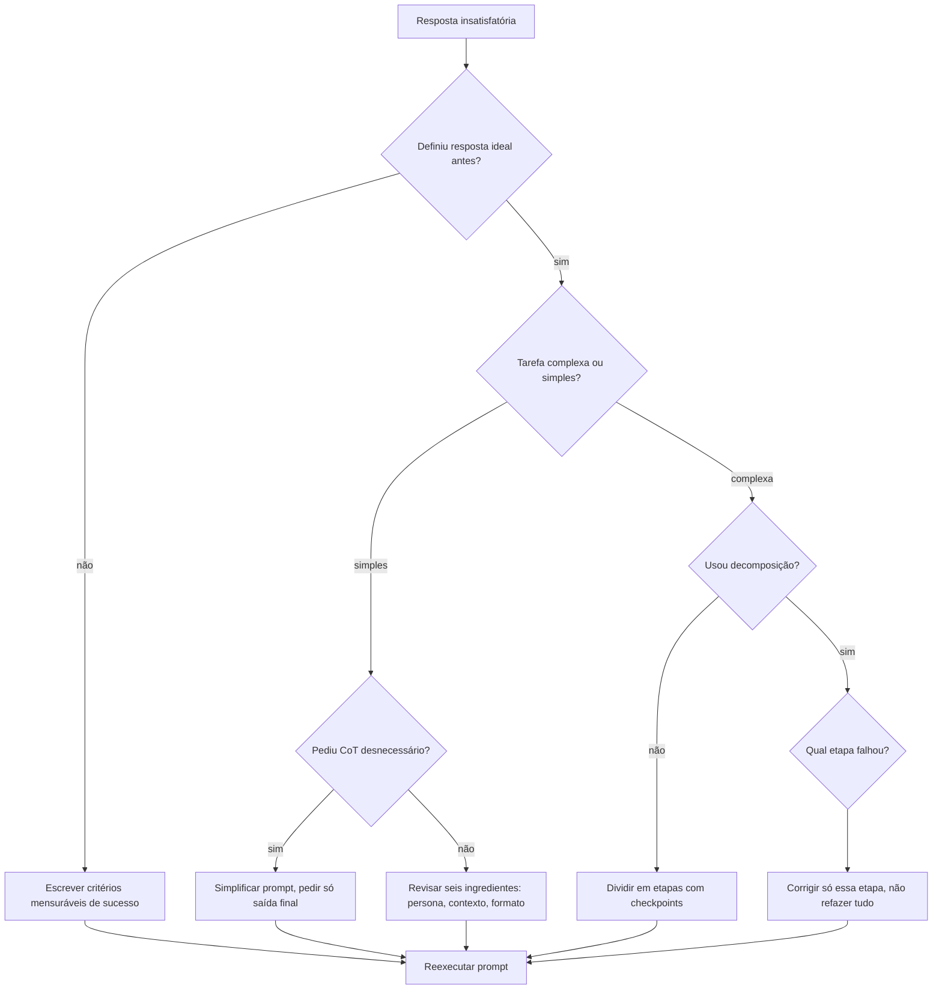

## Visão Geral do Conceito

Gerenciar prompts avançados não é acumular truques: é assumir o papel de **condutor** da IA, não de passageiro. Um passageiro envia uma instrução vaga e aceita o destino que o modelo escolher; um condutor define objetivo, etapas, critérios de qualidade e audita cada trecho antes de seguir.

Esta lição cobre três técnicas que ampliam o que você já aprendeu com os seis ingredientes do prompt e com <mark style="background-color: #242424; padding: 2px 4px; border-radius: 3px; color: inherit;">`few-shot`</mark>/<mark style="background-color: #242424; padding: 2px 4px; border-radius: 3px; color: inherit;">`one-shot`</mark>:

1. **Chain of Thought (CoT)** — pedir raciocínio passo a passo dentro de uma única tarefa.
2. **Decomposição em etapas** — dividir uma tarefa complexa em subtarefas com prompts separados.
3. **Refinamento com rubricas** — melhorar textos com critérios explícitos, não com "melhore isso".

Antes de aplicar qualquer técnica, você precisa entender a diferença entre **serviço** e **modelo** — porque o comportamento que você vê no ChatGPT ou no Gemini nem sempre é só o que o LLM base faria sozinho.

> **Regra:** Toda melhoria recente nos assistentes de IA aumenta a fluência das respostas, mas **não** substitui auditoria humana. Modelos podem alucinar com confiança e omitir erros intermediários.

---

## Modelo Mental

Imagine três camadas empilhadas:

| Camada | O que é | Exemplo |
|--------|---------|---------|
| **Modelo (LLM)** | Motor de previsão de tokens | GPT-5.5, Gemini Flash 3.5 |
| **Serviço/Assistente** | Interface que orquestra o modelo + ferramentas | ChatGPT, Gemini web |
| **Você (condutor)** | Define tarefa, etapas, critérios e valida saída | Engenheiro de prompt |

O **modelo** prevê a sequência de tokens mais provável. Ele não "calcula" matematicamente por padrão — quando o ChatGPT acerta <mark style="background-color: #242424; padding: 2px 4px; border-radius: 3px; color: inherit;">`10 × 12`</mark>, muitas vezes o **serviço** delegou a uma ferramenta de cálculo, não ao LLM puro.

O **serviço** adiciona instruções internas (system prompts), histórico, plugins e roteamento para outras APIs (imagem, mapas, calculadora). Por isso o Gemini na web pode gerar imagens, mas o mesmo modelo via API Python pode não fazer isso automaticamente.



Para as técnicas desta lição, pense assim:

- **CoT** = pedir ao modelo que **mostre a estrutura do raciocínio** de uma tarefa única (como "mostre o cálculo" na escola).
- **Decomposição** = você **define a ordem das subtarefas** e valida cada uma antes da próxima (como um pipeline de ETL com checkpoints).
- **Rubricas** = você **define o que é "melhor"** com critérios mensuráveis (como a correção de um AT na faculdade).

---

## Mecânica Central

### Serviço versus modelo

Quando você pergunta "qual é o seu modelo?", o assistente pode responder algo como "sou o ChatGPT baseado no GPT-5.5". Isso separa:

- **Serviço:** produto, interface, assinatura, histórico, ferramentas integradas.
- **Modelo:** pesos do LLM que fazem previsão de texto.

Registrar o **modelo utilizado** em experimentos de prompt é obrigatório para comparar resultados. Dois prompts idênticos podem divergir entre GPT-5.5 Instant e GPT-5.5 Thinking, ou entre Gemini Flash e um modelo rodado localmente.

### Chain of Thought (cadeia de raciocínio)

**CoT** pede explicitamente que a IA exponha os passos intermediários antes da conclusão.

**Prompt sem CoT:**
```
Analise este argumento e diga se é válido:
Todos os países com alta renda têm boa educação.
O Brasil está investindo em educação.
Logo, o Brasil terá alta renda.
```

**Prompt com CoT:**
```
Analise este argumento e diga se é válido.
Mostre seu raciocínio passo a passo antes da conclusão:
1. Identifique cada premissa.
2. Avalie a relação lógica entre elas.
3. Aponte falácias, se houver.
4. Só então conclua.

Argumento: [mesmo texto acima]
```

**Por que ainda pedir CoT hoje?** Serviços modernos já tendem a exibir raciocínio mesmo sem pedido explícito — isso é uma melhoria do **serviço**, não garantia do **modelo** em qualquer contexto (API direta, modelos menores, prompts curtos). Pedir CoT explicitamente:

- Força checkpoints antes da resposta final.
- Reduz a chance de o modelo "pular" direto para a conclusão mais provável.
- Torna cada premissa intermediária **auditável** por você.

> **Regra:** CoT melhora a **tendência** de respostas lógicas, mas **não garante** acerto. Um raciocínio passo a passo errado continua errado — só fica mais fácil de detectar.

**Quatro perguntas de auditoria** (após receber o passo a passo):

1. As premissas iniciais estão corretas no contexto do problema?
2. Algum passo lógico desviou sem justificativa?
3. A conclusão final segue rigorosamente o que foi desenvolvido antes?
4. Existe contraexemplo ou evidência que invalida algum passo?

Você pode incorporar essas perguntas no próprio prompt: *"Ao final, cheque sua resposta com base nas premissas iniciais, nos passos lógicos e na coerência da conclusão."*

**Quando NÃO usar CoT:** tarefas simples e operacionais em que você só precisa do resultado final (ex.: "traduza esta frase", "formate esta data"). CoT aumenta tokens, tempo de leitura e a superfície de possíveis erros.

### Decomposição em etapas

Na decomposição, **você** define as subtarefas — não pede à IA que invente o plano inteiro de uma vez.

**Cenário:** planejar viagem de 14 dias a Belém com cronograma dia a dia e estimativa de gastos.

**Abordagem monolítica (um prompt só):**
```
Você é agente de viagens. Sou cliente. Vou a Belém por 14 dias em julho.
Monte cronograma dia a dia com atrações, logística e estimativa de gastos.
```

Problemas típicos:
- A IA pode entregar visão geral (dia 1–2, dia 3–6) em vez de dia a dia.
- Correções tardias (ex.: remover Santarém) forçam replanejamento quase total.
- Em tarefas longas, a qualidade **degrada** ao longo da resposta — o início sai melhor que o final.

**Abordagem por etapas:**

| Etapa | Prompt | Checkpoint |
|-------|--------|------------|
| 1 | "Liste principais atrações de Belém e cidades próximas." | Valida destinos |
| 2 | "Distribua 14 dias entre essas atrações." | Ajusta dias por local |
| 3 | "Monte cronograma dia a dia; retire Algodoal, adicione 1 dia em Belém." | Corrige antes do orçamento |
| 4 | "Estime gastos por etapa: hospedagem, transporte, passeios, alimentação." | Valida valores |



**Diferença crucial em relação ao CoT:**

| Aspecto | Chain of Thought | Decomposição em etapas |
|---------|------------------|------------------------|
| Número de prompts | Um | Vários |
| Quem define os passos | A IA (sob seu pedido) | Você |
| Correção intermediária | Difícil | Natural entre etapas |
| Melhor para | Validar lógica de um raciocínio | Tarefas complexas e longas |

A decomposição também combate a "economia de tokens" interna do modelo: pedir tudo de uma vez incentiva respostas mais curtas e genéricas no final. Etapas menores mantêm qualidade mais estável.

### Refinamento com rubricas

"Melhore este texto" é ambíguo. A IA não sabe se você quer:
- menos jargão,
- mais concisão,
- estrutura com tópicos,
- ou tom mais formal.

**Prompt fraco:**
```
Melhore este texto.
```

**Prompt com rubricas:**
```
Revise o texto abaixo aplicando estes critérios:
1. Simplicidade: cada informação em poucas palavras suficientes.
2. Estrutura: parágrafos curtos com título descritivo.
3. Clareza: zero jargão técnico sem explicação.
4. Conclusão: parágrafo final de 2 frases resumindo a ação recomendada.

Texto original:
[...]
```

Isso espelha a lógica das **rubricas de correção** de trabalhos acadêmicos: critérios explícitos, verificáveis e alinhados ao objetivo. O mesmo princípio vale para auto-correção de prompts, documentação de código e revisão de relatórios.

---

## Uso Prático

### Exemplo 1: CoT para validação de argumento

```
Persona: Você é analista de dados que revisa relatórios executivos.
Tarefa: Avaliar se a conclusão de um relatório segue dos dados apresentados.
Contexto: Relatório de vendas Q1 mostra queda de 3% em uma região, mas conclusão afirma "crescimento geral consolidado".
Formato: Lista numerada com passos de raciocínio, depois veredito (válido/inválido/parcial).
Restrição: Cite cada trecho do relatório usado em cada passo.

Mostre raciocínio passo a passo antes do veredito.
```

A saída permite auditar: *"o passo 2 usou dado nacional, mas a conclusão era regional — falácia de generalização."*

### Exemplo 2: Decomposição para resumo de transcrição

Tarefa real de ADS: transformar transcrição WebVTT em material didático.

| Etapa | Ação |
|-------|------|
| 1 | "Extraia apenas tópicos técnicos, ignore saudações e ruído." |
| 2 | "Agrupe tópicos por conceito, não por ordem cronológica da fala." |
| 3 | "Para cada conceito, gere definição + exemplo + erro comum." |
| 4 | "Compare o resultado com a resposta ideal: material escaneável, ≥1 diagrama, exercícios práticos." |

Se a etapa 2 misturar "entrega do AT" com "Chain of Thought", você corrige **antes** de gerar o material final — sem reprocessar toda a transcrição.

### Exemplo 3: Rubricas para revisar documentação de API

```
Revise a documentação do endpoint POST /pedidos com base em:
- Cada campo do body tem tipo, obrigatoriedade e exemplo.
- Respostas de erro 400 e 500 documentadas com corpo JSON.
- Máximo 150 palavras por seção.
- Linguagem para desenvolvedor júnior, sem assumir conhecimento do domínio de negócio.

Documentação atual:
[...]
```

### Conexão com o AT da disciplina

O trabalho de avaliação pede três prompts progressivos (fraco → seis ingredientes → técnica adicional) e análise comparativa contra a **resposta ideal** que você definiu. As técnicas desta lição são candidatas naturais para o **prompt 3**:

- CoT — quando a tarefa exige validação lógica.
- Decomposição — quando a tarefa é complexa (roteiros, relatórios, pipelines).
- Refinamento com rubricas — quando a saída é texto a ser melhorado.

A análise final (prompt 1 vs. prompt 3) deve usar a resposta ideal como rubrica: *"chegou perto o suficiente?"* — não há penalidade por resposta incompleta; há valor em registrar honestamente o gap.

---

## Erros Comuns

**Confundir serviço com modelo:** Registrar "usei ChatGPT" sem especificar GPT-5.5 Instant vs. Thinking invalida comparações. O serviço pode adicionar ferramentas que o modelo isolado não tem.

**CoT em tudo:** Aplicar passo a passo em tarefas triviais gera ruído, custo de tokens e respostas prolixas sem ganho de qualidade.

**Decomposição em tarefas simples:** Dividir "traduza esta frase" em três prompts só adiciona latência e fragmenta contexto desnecessariamente.

**Correção tardia em prompt monolítico:** Pedir "remova Santarém do roteiro" depois de um cronograma completo frequentemente obriga a IA a refazer tudo — com risco de novos erros em partes que já estavam corretas.

**"Melhore" sem critérios:** A IA otimiza para fluência e coesão genérica, não para o seu objetivo (ex.: máximo 3 linhas, tabela obrigatória, zero opinião).

**Confiar na fluência como proxy de verdade:** Respostas mais polidas e com raciocínio aparente podem esconder alucinações. Melhorias do serviço visam retenção de usuário, não necessariamente veracidade.

**Ignorar degradação em outputs longos:** Em listas longas (50 exercícios, 30 dias de cronograma), os últimos itens tendem a ser piores. Sintoma: primeiros exemplos detalhados, finais genéricos ou repetitivos.

---

## Visão Geral de Debugging

Quando uma resposta de LLM não atende o objetivo, siga esta ordem:



**Checklist de auditoria rápida:**

1. Leia a **conclusão** primeiro — atende o objetivo?
2. Leia os **passos intermediários** — alguma premissa inventada?
3. Compare com **fontes** externas quando o tema for factual.
4. Verifique **formato** — tabela pedida veio como lista?
5. Teste **consistência interna** — números e datas batem entre seções?

<details>
<summary>Ver exemplo de falha detectável só com CoT</summary>

**Prompt:** "O investimento em educação garante alta renda? Analise."

**Resposta sem auditoria:** "Sim, educação leva à prosperidade."

**Resposta com CoT auditável:**
1. Premissa: países ricos têm boa educação. *(verdadeira como correlação)*
2. Premissa: Brasil investe em educação. *(verdadeira)*
3. Inferência: investimento → alta renda inevitável. **(falácia: afirmação do consequente)**
4. Conclusão: Brasil terá alta renda.

No passo 3 você detecta o erro lógico que a conclusão final esconderia.
</details>

---

## Principais Pontos

- **Condutor, não passageiro:** você define objetivo, etapas, critérios e audita — a IA executa.
- **Serviço ≠ modelo:** ChatGPT/Gemini são serviços que orquestram modelos e ferramentas; registre o modelo exato nos experimentos.
- **CoT** expõe raciocínio de uma tarefa única; essencial para auditoria, desnecessário em tarefas triviais.
- **Decomposição** divide tarefas complexas em prompts sequenciais com correção entre etapas.
- **Rubricas** substituem "melhore" por critérios verificáveis — mesmo princípio das correções acadêmicas.
- **Melhorias recentes dos serviços** não eliminam a necessidade de auditoria; podem até mascarar erros com respostas mais fluentes.
- **Resposta ideal** definida antes do experimento é a rubrica para julgar se o prompt funcionou.

---

## Preparação para Prática

Após esta lição, você deve conseguir:

1. Explicar por que o ChatGPT acerta contas aritméticas mesmo quando o LLM base não calcula diretamente.
2. Escrever um prompt com CoT e as quatro perguntas de auditoria incorporadas.
3. Planejar uma decomposição em 3–4 etapas para uma tarefa real sua (relatório, roteiro, revisão de código, resumo de logs).
4. Transformar "melhore este texto" em um prompt com pelo menos três critérios mensuráveis.
5. Comparar honestamente um prompt fraco e um prompt avançado contra uma resposta ideal definida por você.

---

## Laboratório de Prática

### Easy — Template de prompt com Chain of Thought

Você mantém um script que gera prompts para revisão de logs de API. Complete a função para incluir instrução de raciocínio passo a passo e formato de saída estruturado.

```python
def gerar_prompt_auditoria_log(linha_log: str, codigo_http: int) -> str:
    """
    Gera prompt para analisar se um log de erro de API indica
    problema de cliente (4xx) ou servidor (5xx).
    """
    persona = "Você é engenheiro de observabilidade."
    tarefa = "Classifique a severidade e sugira ação imediata."
    contexto = f"Log: {linha_log}\nCódigo HTTP: {codigo_http}"
    # TODO: adicionar instrução Chain of Thought pedindo
    #       passos: (1) identificar código, (2) classificar 4xx/5xx,
    #       (3) inferir causa provável, (4) recomendar ação
    cot = ""
    formato = "Responda em JSON: {\"passos\": [], \"severidade\": \"\", \"acao\": \"\"}"
    return f"{persona}\n{tarefa}\n{contexto}\n{cot}\n{formato}"


# Placeholder — executa sem erro
prompt = gerar_prompt_auditoria_log(
    "POST /pedidos timeout após 30s",
    504,
)
print(prompt[:80] + "...")
```

---

### Medium — Decomposição em etapas para relatório

Implemente um pipeline que simula decomposição de prompt em etapas para gerar relatório de vendas a partir de dados brutos.

```python
from typing import Any

DADOS_VENDAS = [
    {"regiao": "Norte", "valor": 12000, "mes": "2026-01"},
    {"regiao": "Sul", "valor": 18500, "mes": "2026-01"},
    {"regiao": "Norte", "valor": 9800, "mes": "2026-02"},
    {"regiao": "Sul", "valor": 19200, "mes": "2026-02"},
]


def etapa_1_extrair_metricas(dados: list[dict[str, Any]]) -> dict[str, float]:
    """Retorna total por região."""
    # TODO: somar valores agrupando por regiao
    return {}


def etapa_2_identificar_tendencia(
    dados: list[dict[str, Any]],
) -> dict[str, str]:
    """Retorna 'alta', 'baixa' ou 'estavel' por região comparando meses."""
    # TODO: comparar 2026-01 vs 2026-02 por região
    return {}


def etapa_3_montar_prompt_relatorio(
    metricas: dict[str, float],
    tendencias: dict[str, str],
) -> str:
    """Monta prompt final apenas com dados já validados nas etapas anteriores."""
    # TODO: formatar string com persona, tarefa e instrução de tabela markdown
    return ""


def pipeline_relatorio(dados: list[dict[str, Any]]) -> str:
    m = etapa_1_extrair_metricas(dados)
    t = etapa_2_identificar_tendencia(dados)
    return etapa_3_montar_prompt_relatorio(m, t)


# Placeholder — executa sem erro
resultado = pipeline_relatorio(DADOS_VENDAS)
print(resultado or "pipeline incompleto")
```

---

### Hard — Refinamento com rubricas e score de conformidade

Construa um validador que verifica se um texto revisado atende rubricas explícitas e calcula score de conformidade (0–100).

```python
import re
from typing import Callable

TEXTO_ORIGINAL = """
O sistema apresentou latência. Verifique infra e corrija.
"""

TEXTO_REVISADO = """
## Diagnóstico de latência
O endpoint /relatorios apresentou p95 de 4,2s às 14h.
## Ação recomendada
Escalar pods do serviço de relatórios e revisar query SQL.
"""


def rubrica_sem_jargao_sem_explicacao(texto: str) -> bool:
    """Falha se houver siglas sem expansão (ex.: SQL sem explicar)."""
    # TODO: detectar siglas de 2+ letras maiúsculas sem parêntese explicativo
    return True


def rubrica_tem_titulos_markdown(texto: str) -> bool:
    """Exige pelo menos dois cabeçalhos ##."""
    # TODO: contar linhas que começam com ##
    return False


def rubrica_conclusao_curta(texto: str, max_frases: int = 2) -> bool:
    """Última seção deve ter no máximo max_frases frases."""
    # TODO: extrair última seção e contar frases terminadas em . ! ?
    return False


RUBRICAS: list[tuple[str, Callable[[str], bool]]] = [
    ("sem_jargao", rubrica_sem_jargao_sem_explicacao),
    ("titulos", rubrica_tem_titulos_markdown),
    ("conclusao", rubrica_conclusao_curta),
]


def avaliar_conformidade(texto: str, rubricas: list[tuple[str, Callable]]) -> dict:
    """
    Retorna score 0-100 e detalhe por rubrica.
    Score = (rubricas_ok / total) * 100
    """
    # TODO: executar cada rubrica e montar dict com score e detalhes
    return {"score": 0, "detalhes": {}}


# Placeholder — executa sem erro
relatorio = avaliar_conformidade(TEXTO_REVISADO, RUBRICAS)
print(relatorio)
```

---

<!-- CONCEPT_EXTRACTION
concepts:
  - chain of thought
  - decomposição em etapas
  - serviço versus modelo
  - auditoria de respostas
  - refinamento com rubricas
  - condutor versus passageiro
skills:
  - Aplicar Chain of Thought para expor raciocínio auditável
  - Decompor tarefas complexas em prompts sequenciais com checkpoints
  - Diferenciar serviço de IA e modelo LLM subjacente
  - Formular perguntas estruturadas de auditoria de respostas
  - Refinar textos com rubricas e critérios mensuráveis
  - Comparar prompts fraco e avançado contra resposta ideal definida
examples:
  - cot-validacao-argumento-falacia
  - decomposicao-roteiro-belem-14-dias
  - refinamento-documentacao-api-com-rubricas
  - servico-chatgpt-delega-calculadora
-->

<!-- EXERCISES_JSON
[
  {
    "id": "cot-prompt-auditoria-log",
    "slug": "cot-prompt-auditoria-log",
    "difficulty": "easy",
    "title": "Template de prompt com Chain of Thought",
    "discipline": "fluencia-em-ia",
    "editorLanguage": "python",
    "tags": ["prompt", "chain-of-thought", "auditoria", "python"],
    "summary": "Completar função que gera prompt com instrução CoT para classificar logs de API."
  },
  {
    "id": "decomposicao-relatorio-vendas",
    "slug": "decomposicao-relatorio-vendas",
    "difficulty": "medium",
    "title": "Decomposição em etapas para relatório",
    "discipline": "fluencia-em-ia",
    "editorLanguage": "python",
    "tags": ["prompt", "decomposicao", "pipeline", "python"],
    "summary": "Implementar pipeline de três etapas que prepara dados antes do prompt final de relatório."
  },
  {
    "id": "rubricas-score-conformidade",
    "slug": "rubricas-score-conformidade",
    "difficulty": "hard",
    "title": "Refinamento com rubricas e score de conformidade",
    "discipline": "fluencia-em-ia",
    "editorLanguage": "python",
    "tags": ["prompt", "rubricas", "validacao", "python"],
    "summary": "Construir validador que aplica rubricas explícitas e calcula score de conformidade do texto."
  }
]
-->
