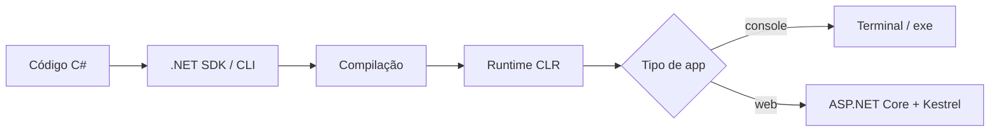
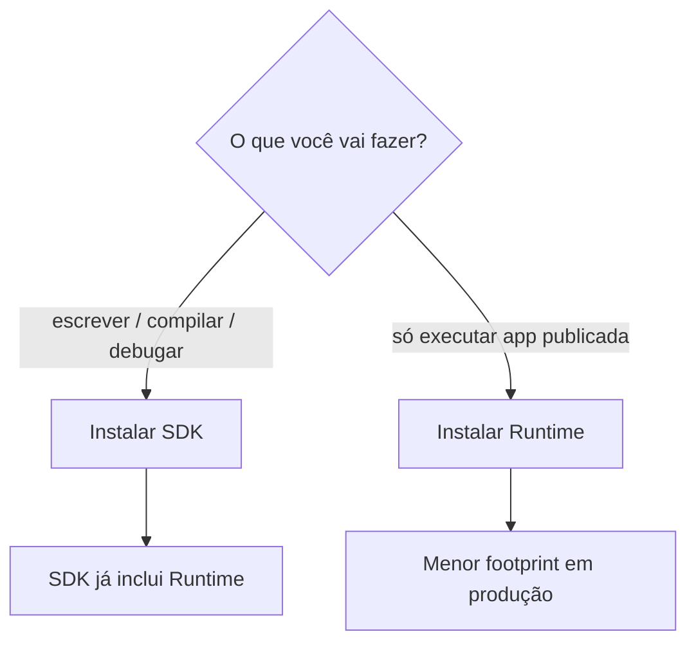
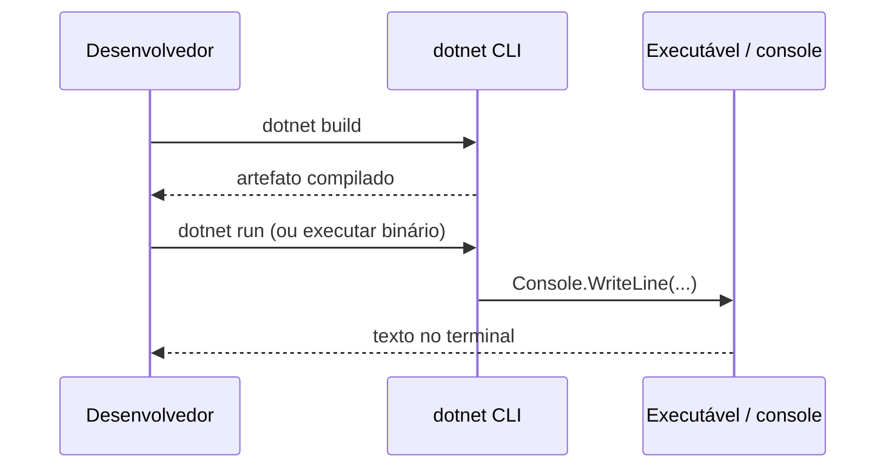

## Visão Geral do Conceito

Esta lição posiciona **C#** e **.NET** no bloco de fundamentos de backend e prepara o ambiente para as aulas seguintes.

Backend é a camada que conecta sites, apps mobile e outros clientes a regras de negócio, dados e integrações. No mercado corporativo brasileiro (bancos e grandes sistemas), stacks frequentes incluem <mark style="background-color: #242424; padding: 2px 4px; border-radius: 3px; color: inherit;">`C#`</mark> / <mark style="background-color: #242424; padding: 2px 4px; border-radius: 3px; color: inherit;">`.NET`</mark>, <mark style="background-color: #242424; padding: 2px 4px; border-radius: 3px; color: inherit;">Java</mark>, <mark style="background-color: #242424; padding: 2px 4px; border-radius: 3px; color: inherit;">Node.js</mark> e <mark style="background-color: #242424; padding: 2px 4px; border-radius: 3px; color: inherit;">Python</mark>.

O problema imediato da aula 1 não é “escrever muita lógica”: é **igualar o ambiente** (SDK, IDE, workloads) para que todos consigam criar e executar projetos .NET. Sem isso, o restante do bloco trava em erros de instalação e PATH.

> **Regra:** C# é a linguagem; .NET é a plataforma que compila, hospeda bibliotecas e executa o código. Confundir os dois atrasa diagnóstico (“instalei C#” quando faltava o SDK).

## Modelo Mental

Pense na analogia usada na aula e no material:

- **C#** = o idioma que você escreve.
- **.NET** = o país com infraestrutura (compilador, runtime, bibliotecas, CLI, padrões) onde esse idioma funciona.

Fluxo mental de trabalho:

1. Você escreve código C#.
2. O ecossistema .NET (via SDK/CLI ou IDE) **compila** e **executa**.
3. Em produção, o servidor precisa sobretudo do **Runtime**; em desenvolvimento, você precisa do **SDK**.

Para web, o material destaca três peças que caminham juntas: <mark style="background-color: #242424; padding: 2px 4px; border-radius: 3px; color: inherit;">ASP.NET Core</mark> (framework de APIs/MVC/Razor), <mark style="background-color: #242424; padding: 2px 4px; border-radius: 3px; color: inherit;">Kestrel</mark> (servidor web embutido) e o <mark style="background-color: #242424; padding: 2px 4px; border-radius: 3px; color: inherit;">.NET SDK</mark> (orquestra compilação, templates e CLI).



## Mecânica Central

### C# × .NET

| Peça | Papel |
|------|--------|
| <mark style="background-color: #242424; padding: 2px 4px; border-radius: 3px; color: inherit;">C#</mark> | Linguagem moderna, orientada a objetos, criada pela Microsoft. |
| <mark style="background-color: #242424; padding: 2px 4px; border-radius: 3px; color: inherit;">.NET</mark> | Plataforma completa: runtime, bibliotecas, ferramentas e padrões. |

A plataforma .NET atual é **open source** (código aberto; Microsoft continua principal mantenedora), **multiplataforma** (Windows, Linux, macOS) e **versátil** (console, APIs, sistemas corporativos, nuvem, e também jogos via Unity — citado na aula como exemplo de uso de C#).

### Evolução da plataforma

1. **.NET Framework** (início dos anos 2000): foco Windows; desktop e web legados; apps web tipicamente em servidores Windows.
2. **.NET Core**: reescrita multiplataforma e open source, resposta à pressão de Java/Linux em servidores.
3. **.NET moderno** (a partir do <mark style="background-color: #242424; padding: 2px 4px; border-radius: 3px; color: inherit;">.NET 5</mark>): unificação sob o nome “.NET”, lançamentos anuais. Na aula, o ambiente de referência aponta para a linha <mark style="background-color: #242424; padding: 2px 4px; border-radius: 3px; color: inherit;">.NET 10</mark> (o prefixo `10.` na versão é o que importa).

> **Não coberto em profundidade na aula ao vivo:** a frase do material sobre o compilador <mark style="background-color: #242424; padding: 2px 4px; border-radius: 3px; color: inherit;">Roslyn</mark> gerar bytecode <mark style="background-color: #242424; padding: 2px 4px; border-radius: 3px; color: inherit;">IL</mark> executado pelo <mark style="background-color: #242424; padding: 2px 4px; border-radius: 3px; color: inherit;">CLR</mark>. O professor indicou que detalhar isso cedo só confundiria; trate como mapa futuro, não como obrigação desta lição.

### SDK vs Runtime



- <mark style="background-color: #242424; padding: 2px 4px; border-radius: 3px; color: inherit;">SDK</mark> (*Software Development Kit*): compilador, CLI, templates, build — escolha **sempre** no desenvolvimento.
- <mark style="background-color: #242424; padding: 2px 4px; border-radius: 3px; color: inherit;">Runtime</mark>: motor de execução do código já compilado — típico de servidores/produção.

### CLI (`dotnet`)

A <mark style="background-color: #242424; padding: 2px 4px; border-radius: 3px; color: inherit;">CLI</mark> (*Command Line Interface*) vem com o SDK e permite trabalhar sem IDE (é possível até no Bloco de Notas, mas não é produtivo). Comandos do material:

| Comando | Função |
|---------|--------|
| <mark style="background-color: #242424; padding: 2px 4px; border-radius: 3px; color: inherit;">`dotnet new`</mark> | Cria projeto a partir de template |
| <mark style="background-color: #242424; padding: 2px 4px; border-radius: 3px; color: inherit;">`dotnet build`</mark> | Compila |
| <mark style="background-color: #242424; padding: 2px 4px; border-radius: 3px; color: inherit;">`dotnet run`</mark> | Executa |
| <mark style="background-color: #242424; padding: 2px 4px; border-radius: 3px; color: inherit;">`dotnet publish`</mark> | Prepara artefato para produção |

Validação de ambiente (aula + material):

```bash
dotnet --version
dotnet --list-sdks
dotnet --list-runtimes
```

Na demonstração ao vivo também apareceu <mark style="background-color: #242424; padding: 2px 4px; border-radius: 3px; color: inherit;">`dotnet --info`</mark> para inspecionar SDKs/runtimes instalados.

### Componentes web no ecossistema

- <mark style="background-color: #242424; padding: 2px 4px; border-radius: 3px; color: inherit;">ASP.NET Core</mark>: APIs REST, MVC, Razor Pages.
- <mark style="background-color: #242424; padding: 2px 4px; border-radius: 3px; color: inherit;">Kestrel</mark>: servidor web embutido (HTTP/1.1, HTTP/2, HTTP/3 no material).
- O bloco avançará nesses três (ASP.NET Core, Kestrel, SDK) nas aulas seguintes.

### IDEs e workloads

| Ferramenta | SO | Notas da aula/material |
|------------|----|-------------------------|
| <mark style="background-color: #242424; padding: 2px 4px; border-radius: 3px; color: inherit;">Visual Studio Community</mark> | Windows | Ementa do curso; gratuito; debugger e workloads. |
| <mark style="background-color: #242424; padding: 2px 4px; border-radius: 3px; color: inherit;">VS Code</mark> + <mark style="background-color: #242424; padding: 2px 4px; border-radius: 3px; color: inherit;">C# Dev Kit</mark> | Win / Linux / macOS | Mais leve; menos capacidades que o VS completo; instalar Dev Kit e .NET SDK. |
| <mark style="background-color: #242424; padding: 2px 4px; border-radius: 3px; color: inherit;">Rider</mark> | Win / Linux / macOS | Mais próximo do Visual Studio; recomendado fora do Windows. |

**Workload** = pacote de ferramentas/SDK/templates para um tipo de desenvolvimento. Para este bloco, o mínimo citado é **Desenvolvimento ASP.NET e Web** (traz SDK e templates web). O material também sugere workload **Desktop com .NET** se quiser templates de Console App com mais conforto — a aula ao vivo não exige desktop para o foco web.

Instalação típica (Windows + Visual Studio):

1. Baixar Community em [visualstudio.microsoft.com](https://visualstudio.microsoft.com/).
2. Abrir o instalador (bootstrap).
3. Marcar workload **ASP.NET e desenvolvimento Web**.
4. Concluir (download pode ser grande; material menciona > 5 GB; aula cita ordem de ~8–10 GB).
5. Validar com <mark style="background-color: #242424; padding: 2px 4px; border-radius: 3px; color: inherit;">`dotnet --version`</mark>.

## Uso Prático

### Cenário 1 — Checklist de equalização do time

Antes de um par programar uma API de pedidos, ambos precisam do mesmo “chão”:

```bash
# 1) Versão principal do SDK (aula: preferir linha 10.x)
dotnet --version

# 2) Listar SDKs instalados
dotnet --list-sdks

# 3) Listar runtimes (útil para diagnosticar ambiente de execução)
dotnet --list-runtimes
```

Interpretação: se <mark style="background-color: #242424; padding: 2px 4px; border-radius: 3px; color: inherit;">`dotnet`</mark> não for reconhecido, o problema costuma ser instalação incompleta ou PATH (reiniciar terminal/máquina; modificar workloads no Visual Studio Installer; ou instalar SDK em [dot.net](https://dotnet.microsoft.com/)).

### Cenário 2 — Decisão SDK vs Runtime em deploy

Imagine uma API de extrato publicada num servidor Linux interno:

- Pipeline de CI/máquina do desenvolvedor → **SDK**.
- Container/servidor que só sobe o publish → **Runtime** (menor superfície e espaço).

Isso foi explicitado na aula com a pergunta de aluno: quem só executa usa Runtime; quem desenvolve junto usa SDK.

### Cenário 3 — Hello World moderno (material PDF; prática guiada fica para a aula seguinte)

O material “Preparando o Ambiente” mostra o ponto de entrada com *top-level statements* (.NET 6+):

```csharp
// Program.cs — ponto de entrada simplificado
Console.WriteLine("Hello, World!");
```

Na aula ao vivo, o professor demonstrou o equivalente “na unha” com CLI (`dotnet build` / execução do artefato) para provar que a IDE é produtividade, não requisito absoluto. A criação guiada de Solution/Console App no Visual Studio fica para a continuidade do bloco.



### Cenário 4 — Escolha de ferramenta por SO

- Windows + ementa → Visual Studio Community.
- Linux/macOS → Rider (preferência da aula por proximidade com VS) ou VS Code + C# Dev Kit.
- Exemplos de código do curso devem funcionar em qualquer SO; o que muda é a ferramenta.

## Erros Comuns

1. **`dotnet` não é reconhecido**  
   - **Causa:** SDK não instalado, workload Web não marcado, ou PATH antigo no terminal aberto antes da instalação.  
   - **Sintoma:** mensagem de comando inexistente no Prompt/PowerShell/bash.  
   - **Correção:** reiniciar terminal ou máquina; Visual Studio Installer → Modificar → garantir workload ASP.NET/Web com SDK; instalar SDK manualmente se preciso.

2. **Instalar só Runtime e tentar desenvolver**  
   - **Causa:** confusão na página de download.  
   - **Sintoma:** falta de templates/`dotnet new`, falha ao compilar.  
   - **Correção:** instalar SDK (inclui Runtime).

3. **Template .NET Framework legado**  
   - **Causa:** escolher Console App “.NET Framework” no Visual Studio.  
   - **Sintoma:** app presa ao Windows legado.  
   - **Correção:** template moderno sem “.NET Framework” no nome (material).

4. **Esperar Visual Studio no Linux/macOS**  
   - **Causa:** ementa cita VS, mas VS Community é Windows.  
   - **Correção:** Rider ou VS Code + C# Dev Kit; validar com a mesma CLI.

5. **Desmarcar SDK no instalador / instalação parcial**  
   - **Causa:** customizar workloads demais para “economizar”.  
   - **Correção:** manter ASP.NET e Web; validar com <mark style="background-color: #242424; padding: 2px 4px; border-radius: 3px; color: inherit;">`dotnet --list-sdks`</mark>.

## Visão Geral de Debugging

Quando o ambiente “não funciona”, isole camadas nesta ordem:

1. **CLI responde?** `dotnet --version`  
   - Não → instalação/PATH (não é erro de código C#).
2. **SDK listado?** `dotnet --list-sdks`  
   - Lista vazia → workload/SDK ausente.
3. **Versão major correta?** Prefixo `10.` (referência da aula).  
   - Major antigo pode gerar atrito com templates da turma.
4. **IDE vs CLI:** se a CLI funciona e a IDE não, o problema é extensão/workload da IDE (ex.: C# Dev Kit no VS Code), não a plataforma.
5. **Só depois** vá para erros de projeto (`Program.cs`, template, NuGet).

<details>
<summary>Mapa rápido de sintomas</summary>

| Sintoma | Camada provável |
|---------|-----------------|
| `dotnet: command not found` | PATH / instalação |
| Build falha sem SDK | Pacote de desenvolvimento |
| Projeto abre mas não debuga | IDE / extensão |
| App publica mas servidor não roda | Runtime no host |

</details>

## Principais Pontos

- Backend corporativo frequentemente usa C#/.NET e Java; este bloco forma a base C#.
- C# = linguagem; .NET = plataforma (runtime + libs + ferramentas).
- Linha histórica: Framework (Windows) → Core (multiplataforma) → .NET unificado com releases anuais.
- Desenvolvimento = SDK; produção/execução = Runtime.
- CLI (`dotnet`) valida e automatiza create/build/run/publish.
- ASP.NET Core + Kestrel cobrem o caminho web dentro do ecossistema.
- Visual Studio (Windows), VS Code + C# Dev Kit ou Rider (multiplataforma).
- Workload mínimo: ASP.NET e desenvolvimento Web; validar com `dotnet --version` / `--list-sdks`.

## Preparação para Prática

Ao concluir, você deve conseguir:

- Explicar com precisão a diferença C# × .NET e SDK × Runtime.
- Montar um checklist de validação de ambiente via CLI.
- Escolher IDE conforme o SO sem bloquear o progresso do bloco.
- Classificar falhas típicas (`comando não reconhecido`, Runtime-only, template legado).

O laboratório abaixo treina essas decisões com funções pequenas (o editor ISS usa JavaScript; a lógica espelha diagnósticos de ambiente .NET). Os exemplos de sintaxe C# no corpo da lição continuam sendo a referência da disciplina.

## Laboratório de Prática

### Easy — Classificar papel da instalação

Dado um perfil de máquina (`"dev"` ou `"prod-runner"`), devolva o pacote correto: `"SDK"` ou `"Runtime"`.

```javascript
/**
 * @param {"dev"|"prod-runner"} perfil
 * @returns {"SDK"|"Runtime"|"desconhecido"}
 */
function pacoteDotnet(perfil) {
  // TODO: dev → "SDK"; prod-runner → "Runtime"; outro → "desconhecido"
  return "TODO";
}

console.log(pacoteDotnet("dev"));
console.log(pacoteDotnet("prod-runner"));
```

### Medium — Validar saída de `dotnet --list-sdks`

Simule linhas no formato `10.0.100 [caminho]` e diga se o ambiente atende à major mínima exigida pela turma (ex.: 10).

```javascript
/**
 * @param {string[]} linhasSdk - ex.: ["8.0.403 [/usr/share/dotnet/sdk]", "10.0.100 [/usr/share/dotnet/sdk]"]
 * @param {number} majorMinima - ex.: 10
 * @returns {{ ok: boolean, majors: number[], mensagem: string }}
 */
function validarSdks(linhasSdk, majorMinima) {
  // TODO: extrair o major de cada linha (número antes do primeiro ".")
  // TODO: ok = existe ao menos um major >= majorMinima
  // TODO: mensagem curta para log de onboarding (ex.: "SDK major 10+ encontrado" / "SDK insuficiente")
  return { ok: false, majors: [], mensagem: "TODO" };
}

const amostra = [
  "8.0.403 [/usr/share/dotnet/sdk]",
  "10.0.100 [/usr/share/dotnet/sdk]",
];
console.log(validarSdks(amostra, 10));
```

### Hard — Roteiro de IDE por sistema operacional

Receba o SO e devolva a recomendação alinhada à aula (ementa Windows → Visual Studio; fora do Windows → Rider como primeira sugestão; VS Code como alternativa multiplataforma).

```javascript
/**
 * @param {"windows"|"linux"|"macos"} so
 * @returns {{ primaria: string, alternativa: string, motivo: string }}
 */
function recomendarIde(so) {
  // TODO: windows → primaria "Visual Studio Community", alternativa "VS Code + C# Dev Kit"
  // TODO: linux|macos → primaria "Rider", alternativa "VS Code + C# Dev Kit"
  // TODO: motivo em 1 frase objetiva (ementa vs multiplataforma)
  return { primaria: "TODO", alternativa: "TODO", motivo: "TODO" };
}

console.log(recomendarIde("windows"));
console.log(recomendarIde("linux"));
```

<!-- CONCEPT_EXTRACTION
concepts:
  - C# vs .NET (linguagem vs plataforma)
  - Backend corporativo e stacks (C#, Java, Node, Python)
  - Evolução .NET Framework / .NET Core / .NET unificado
  - SDK vs Runtime
  - CLI dotnet (new, build, run, publish, --version, --list-sdks)
  - ASP.NET Core
  - Kestrel
  - Workloads Visual Studio (ASP.NET e Web)
  - IDEs: Visual Studio, VS Code + C# Dev Kit, Rider
  - Validação e troubleshooting de ambiente
skills:
  - Distinguir linguagem C# da plataforma .NET
  - Escolher SDK ou Runtime conforme o papel da máquina
  - Validar instalação com comandos da CLI
  - Selecionar IDE e workload adequados ao SO e ao foco web
  - Diagnosticar falha de PATH e comando dotnet não reconhecido
examples:
  - checklist-dotnet-version-list-sdks
  - hello-world-toplevel-program-cs
  - fluxo-sdk-cli-runtime
-->

<!-- EXERCISES_JSON
[
  {
    "id": "introducao-csharp-dotnet-backend-pacote-easy",
    "slug": "introducao-csharp-dotnet-backend-pacote-easy",
    "difficulty": "easy",
    "title": "Classificar papel da instalação (SDK vs Runtime)",
    "discipline": "fundamentos-csharp",
    "editorLanguage": "javascript",
    "tags": ["dotnet", "sdk", "runtime", "ambiente"],
    "summary": "Mapear perfil dev/prod-runner para SDK ou Runtime."
  },
  {
    "id": "introducao-csharp-dotnet-backend-validar-sdks-medium",
    "slug": "introducao-csharp-dotnet-backend-validar-sdks-medium",
    "difficulty": "medium",
    "title": "Validar saída de dotnet --list-sdks",
    "discipline": "fundamentos-csharp",
    "editorLanguage": "javascript",
    "tags": ["dotnet", "cli", "onboarding"],
    "summary": "Parsear majors de SDKs listados e verificar major mínima da turma."
  },
  {
    "id": "introducao-csharp-dotnet-backend-ide-hard",
    "slug": "introducao-csharp-dotnet-backend-ide-hard",
    "difficulty": "hard",
    "title": "Roteiro de IDE por sistema operacional",
    "discipline": "fundamentos-csharp",
    "editorLanguage": "javascript",
    "tags": ["ide", "visual-studio", "rider", "vscode"],
    "summary": "Recomendar IDE primária e alternativa conforme Windows/Linux/macOS."
  }
]
-->

<!-- LESSONS_JSON_HINT
{
  "discipline": "fundamentos-csharp",
  "slug": "introducao-csharp-dotnet-backend",
  "title": "Introdução a C#, .NET e o bloco de backend",
  "order": 1,
  "file": "fundamentos-csharp/aula-01-introducao-csharp-dotnet-backend.md"
}
-->
