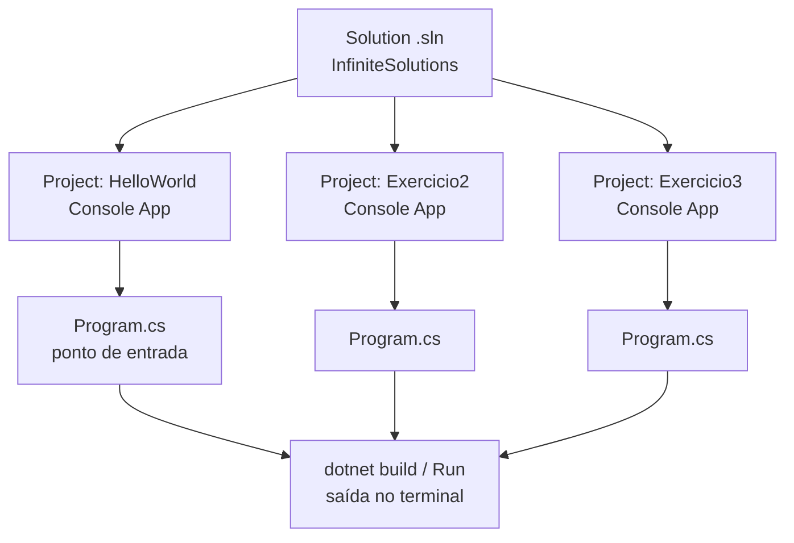
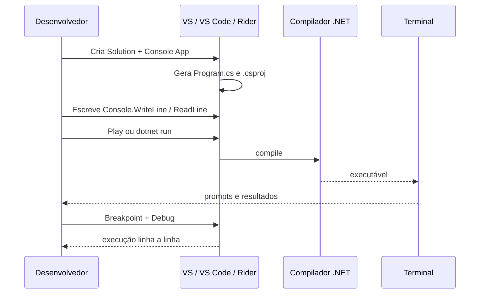

## Visão Geral do Conceito

Depois de instalar e validar o SDK, o próximo passo não é “só abrir um arquivo `.cs`”: é criar uma **Solution** e, dentro dela, um ou mais **projetos**. No .NET, a Solution é o contêiner de organização; o projeto (por exemplo, **Console App**) é a unidade que compila e gera um executável.

Esta lição ensina o fluxo completo da primeira aplicação:

1. Entender Solution × Project × template.
2. Criar um Console App (Visual Studio, VS Code ou Rider — o modelo é o mesmo).
3. Executar e depurar a partir de <mark style="background-color: #242424; padding: 2px 4px; border-radius: 3px; color: inherit;">`Program.cs`</mark>.
4. Praticar entrada/saída com <mark style="background-color: #242424; padding: 2px 4px; border-radius: 3px; color: inherit;">`Console.WriteLine`</mark>, <mark style="background-color: #242424; padding: 2px 4px; border-radius: 3px; color: inherit;">`Console.ReadLine`</mark>, interpolação <mark style="background-color: #242424; padding: 2px 4px; border-radius: 3px; color: inherit;">`$"..."`</mark> e conversões com <mark style="background-color: #242424; padding: 2px 4px; border-radius: 3px; color: inherit;">`Convert`</mark>.

> **Problema que resolve:** sem Solution/projeto, o código C# fica solto, difícil de compilar, depurar e evoluir para múltiplos módulos (API, mobile, bibliotecas).

## Modelo Mental

Pense no .NET como uma **pasta de trabalho hierárquica**:

| Nível | Papel | Analogia |
|-------|--------|----------|
| **Solution** (`.sln`) | Agrupa projetos do mesmo problema | Pasta do produto “e-commerce” |
| **Project** (`.csproj`) | Unidade compilável com template (Console, Web…) | Um módulo: API web, app mobile, regras |
| **Arquivos `.cs`** | Código-fonte; <mark style="background-color: #242424; padding: 2px 4px; border-radius: 3px; color: inherit;">`Program.cs`</mark> é o primeiro a rodar no Console | Scripts; o “main” do Python |

**Solution** não é um programa. É o **contêiner**. Você clica com o botão direito na Solution para **adicionar outro projeto** (Exercício2, Exercício3…) e escolhe na barra qual projeto **dar play**.

**Template** é a estrutura reutilizável: pastas, `.csproj` e um <mark style="background-color: #242424; padding: 2px 4px; border-radius: 3px; color: inherit;">`Program.cs`</mark> prontos. Console App = saída no terminal. Web = página/API. Mobile = app no simulador.

**Paralelos úteis (vindos da aula):**

- <mark style="background-color: #242424; padding: 2px 4px; border-radius: 3px; color: inherit;">`Program.cs`</mark> ≈ ponto de entrada (como o “main” que você já viu em lógica/Python).
- <mark style="background-color: #242424; padding: 2px 4px; border-radius: 3px; color: inherit;">`Console.ReadLine()`</mark> ≈ <mark style="background-color: #242424; padding: 2px 4px; border-radius: 3px; color: inherit;">`input()`</mark>.
- <mark style="background-color: #242424; padding: 2px 4px; border-radius: 3px; color: inherit;">`Convert.ToInt32(...)`</mark> ≈ <mark style="background-color: #242424; padding: 2px 4px; border-radius: 3px; color: inherit;">`int(...)`</mark>.
- Interpolação <mark style="background-color: #242424; padding: 2px 4px; border-radius: 3px; color: inherit;">`$"Olá {nome}"`</mark> ≈ f-string do Python.



> **Regra:** no início do curso o foco é **Console Application**. Templates web/mobile existem, mas a saída deles é outra (página, app). Domine o console primeiro.

## Mecânica Central

### Solution e projetos

- Uma Solution pode ter **um ou vários** projetos relacionados ao mesmo problema (ex.: e-commerce com web + mobile + regras de negócio).
- Facilita organização de pastas, build e debug sem criar repositórios separados para cada saída.
- Boas práticas de nomeação (material de ambiente): **PascalCase**, sem espaços — ex.: `HelloWorld`, `InfiniteSolutions`.

### Templates e Console App

No Visual Studio (e de forma equivalente no Rider / fluxo CLI no VS Code):

1. **Criar novo projeto** (Start Page).
2. Filtrar por **C#** (a IDE também lista VB, Python, JS/TS, etc.).
3. Escolher **Console App** / “Aplicativo do Console” (não o template **.NET Framework** legado, limitado ao Windows).
4. Definir **nome do projeto**, **pasta** e **nome da Solution** (podem ser diferentes — na aula: projeto `HelloWorld`, Solution `InfiniteSolutions`).
5. Escolher o **framework mais recente** instalado (na aula: .NET 10 quando disponível).
6. **Create** — o template gera a estrutura, incluindo <mark style="background-color: #242424; padding: 2px 4px; border-radius: 3px; color: inherit;">`Program.cs`</mark>.

Com a CLI (útil no VS Code e em qualquer terminal), o equivalente conceitual é:

```bash
dotnet new sln -n InfiniteSolutions
dotnet new console -n HelloWorld
dotnet sln InfiniteSolutions.sln add HelloWorld/HelloWorld.csproj
dotnet run --project HelloWorld
```

Validação prévia do ambiente (material “Preparando o Ambiente”):

```bash
dotnet --version
dotnet --list-sdks
dotnet --list-runtimes
```

### Program.cs e top-level statements

No .NET moderno (6+), o ponto de entrada pode ser **top-level statements**: o compilador trata o código do topo do arquivo como entrada, sem exigir `Main` explícito no boilerplate inicial.

```csharp
// Hello, World! em C# moderno
Console.WriteLine("Hello, World!");
```

- <mark style="background-color: #242424; padding: 2px 4px; border-radius: 3px; color: inherit;">`Program.cs`</mark> é o **primeiro** arquivo de execução do Console App, não necessariamente o único `.cs` do projeto.
- Vários arquivos `.cs` no mesmo projeto são compilados juntos.
- Separar exercícios em **classes** / múltiplos arquivos dentro do mesmo projeto é válido no mundo real, mas a aula recomenda, no início, **um projeto Console por exercício** na mesma Solution — evita avançar OO cedo demais.

### Solution Explorer, Run e Debug

- **Explorador de Solução** (*Solution Explorer*): árvore Solution → Project → arquivos.
- Botão **Play**: compila e executa o projeto selecionado; a saída aparece no painel **Output**/terminal.
- **Breakpoint**: clique na margem da linha (bolinha vermelha). Ao depurar, a execução **para** naquela linha (destaque amarelo); dá para inspecionar variáveis e avançar passo a passo.
- **Projeto de startup**: com vários projetos na Solution, selecione na combo qual Console App rodar (HelloWorld, Exercicio2, Exercicio3…).
- **args**: parâmetros de linha de comando recebidos na execução do Console App (array de zero a *n* argumentos). Detalhamento avançado de parsing de args: aprofundar depois; o conceito foi introduzido na aula.

### Entrada, saída e conversão

| Operação | API C# | Observação |
|----------|--------|------------|
| Escrever no terminal | <mark style="background-color: #242424; padding: 2px 4px; border-radius: 3px; color: inherit;">`Console.WriteLine(...)`</mark> | Não é obrigatório prefixar `System.` no template moderno típico |
| Ler do terminal | <mark style="background-color: #242424; padding: 2px 4px; border-radius: 3px; color: inherit;">`Console.ReadLine()`</mark> | Retorna <mark style="background-color: #242424; padding: 2px 4px; border-radius: 3px; color: inherit;">`string`</mark> (ou null em alguns contextos) |
| Interpolação | <mark style="background-color: #242424; padding: 2px 4px; border-radius: 3px; color: inherit;">`$"Olá {nome}"`</mark> | Prefixo `$` |
| Inteiro | <mark style="background-color: #242424; padding: 2px 4px; border-radius: 3px; color: inherit;">`Convert.ToInt32(...)`</mark> | Aula recomenda `Convert` por flexibilidade entre tipos |
| Número real | <mark style="background-color: #242424; padding: 2px 4px; border-radius: 3px; color: inherit;">`Convert.ToDouble(...)`</mark> | Preferir Double a Single/float nos exercícios |

**Tipos de ponto flutuante (família C):**

- <mark style="background-color: #242424; padding: 2px 4px; border-radius: 3px; color: inherit;">`float`</mark> / <mark style="background-color: #242424; padding: 2px 4px; border-radius: 3px; color: inherit;">`Single`</mark>: menos precisão.
- <mark style="background-color: #242424; padding: 2px 4px; border-radius: 3px; color: inherit;">`double`</mark>: mais precisão (uso padrão na aula para contas).
- <mark style="background-color: #242424; padding: 2px 4px; border-radius: 3px; color: inherit;">`decimal`</mark>: precisão ainda maior (mencionado; não aprofundado na aula).

**Divisão de inteiros:** se ambos os operandos são inteiros, o resultado é **inteiro** (parte fracionária descartada). Por isso exercícios com “números reais” usam Double.

**Cultura do terminal:** em Windows em português, o separador decimal digitado no console pode ser **vírgula**; em cultura inglesa, **ponto**. Forçar cultura (ex.: `CultureInfo`) foi mencionado como possível, mas **não detalhado** na aula para não sobrecarregar o início.



## Uso Prático

### 1) Hello World na Solution

```csharp
Console.WriteLine("Hello, World!");
```

Execute com Play ou `dotnet run --project HelloWorld`. Confirme a mensagem no terminal.

### 2) Apresentação pessoal (I/O + interpolação)

Equivalente ao Exercício 1 da lista básica — demonstrado na aula:

```csharp
Console.WriteLine("Digite seu nome:");
var nome = Console.ReadLine();

Console.WriteLine("Digite sua idade:");
var idade = Console.ReadLine();

Console.WriteLine("Digite sua cidade:");
var cidade = Console.ReadLine();

Console.WriteLine($"Olá, {nome}! Você tem {idade} anos e mora em {cidade}.");
```

### 3) Antecessor e sucessor (conversão para inteiro)

Padrão da aula para o Exercício 2 — **projeto novo** na mesma Solution:

```csharp
Console.WriteLine("Digite um número inteiro:");
var texto = Console.ReadLine();
var num = Convert.ToInt32(texto);

Console.WriteLine($"Antecessor: {num - 1}");
Console.WriteLine($"Número digitado: {num}");
Console.WriteLine($"Sucessor: {num + 1}");
```

Fluxo na IDE: botão direito na **Solution** → Adicionar → Novo projeto → Console App → nome `Exercicio2` → na combo de startup, selecionar `Exercicio2` → Run.

### 4) Operações com Double

Esboço do Exercício 3 (dois números reais):

```csharp
Console.WriteLine("Digite um número:");
var x = Convert.ToDouble(Console.ReadLine());

Console.WriteLine("Digite outro número:");
var y = Convert.ToDouble(Console.ReadLine());

Console.WriteLine($"Soma: {x + y}");
Console.WriteLine($"Subtração: {x - y}");
Console.WriteLine($"Multiplicação: {x * y}");
Console.WriteLine($"Divisão: {x / y}");
```

Operadores: `+`, `-`, `*`, `/` — mesma ideia do Python para aritmética básica.

### 5) Debug com condição

A aula ilustrou parar em breakpoint e observar um `if`:

```csharp
var x = 10;
if (x == 20)
{
    Console.WriteLine("X é vinte");
}
else
{
    Console.WriteLine("X não é vinte");
}
```

Altere `x` para `20`, rode em debug e observe qual ramo executa.

### Lista de exercícios (prática em casa)

O material da disciplina traz **10 exercícios** de C# básico (variáveis, tipos, I/O, conversão, operadores, formatação). Use-os para explorar a IDE; a entrega de AT no Moodle, conforme a aula, é **código-fonte zipado**, não PDF.

Complemento recomendado na aula: trilha gratuita **Microsoft Learn — programação com C#** (Get Started + Learning C#), alinhada ao que foi demonstrado em sala.

## Erros Comuns

1. **Escolher template .NET Framework**  
   Sintoma: projeto legado, limitado ao Windows.  
   Correção: Console App **.NET** (moderno), não “.NET Framework” no nome.

2. **Tratar `ReadLine` como número sem converter**  
   Sintoma: concatenação estranha ou erro em aritmética.  
   Correção: <mark style="background-color: #242424; padding: 2px 4px; border-radius: 3px; color: inherit;">`Convert.ToInt32`</mark> / <mark style="background-color: #242424; padding: 2px 4px; border-radius: 3px; color: inherit;">`Convert.ToDouble`</mark> antes de calcular.

3. **Dividir dois inteiros esperando casas decimais**  
   Sintoma: `7 / 2` → `3`.  
   Correção: usar Double (ou garantir pelo menos um operando em ponto flutuante).

4. **Rodar o projeto errado na Solution**  
   Sintoma: parece que o Exercicio3 “não atualizou”.  
   Correção: selecionar o projeto correto na combo de startup / `dotnet run --project ...`.

5. **Separador decimal (vírgula vs ponto)**  
   Sintoma: `Convert.ToDouble` “engole” o ponto ou falha conforme a cultura do Windows.  
   Correção: digitar conforme a cultura do terminal (PT-BR costuma usar vírgula). Configuração avançada com cultura forçada: **não coberta em detalhe na fonte**.

6. **Achar que só `Program.cs` é compilado**  
   Correção: todos os `.cs` do projeto entram na compilação; `Program.cs` é o ponto de entrada típico do Console.

7. **Esconder o Solution Explorer**  
   Sintoma: “sumiu a árvore de projetos”.  
   Correção: menu Exibir / View → Explorador de Solução / Solution Explorer.

## Visão Geral de Debugging

Quando o Console “não faz o que você espera”:

1. **Confirme o projeto ativo** na Solution.
2. Coloque um **breakpoint** na primeira linha útil (logo após um `ReadLine` ou antes do `if`).
3. Execute em **Debug** (não só Run sem debugger).
4. Observe o valor das variáveis na parada (ex.: `x == 20` → verdadeiro/falso).
5. Avance linha a linha e veja qual ramo de `if/else` executa.
6. Se a falha for de conversão, isole: imprima a string crua de <mark style="background-color: #242424; padding: 2px 4px; border-radius: 3px; color: inherit;">`ReadLine`</mark> antes do <mark style="background-color: #242424; padding: 2px 4px; border-radius: 3px; color: inherit;">`Convert`</mark>.

<details>
<summary>Checklist rápido de ambiente</summary>

- `dotnet --version` lista um SDK.
- Workload / SDK não foi desmarcado no instalador.
- Terminal novo após instalação (PATH atualizado).
- Mesmo fluxo de Solution/projeto funciona no **Rider** e no **VS Code** (atalhos diferem; modelo mental é o mesmo). Na aula: Rider tem as mesmas capacidades; VS Code também permite debug equivalente.

</details>

## Principais Pontos

- **Solution** agrupa projetos; **Project** compila e executa.
- **Console App** é o template dos primeiros meses: saída no terminal.
- <mark style="background-color: #242424; padding: 2px 4px; border-radius: 3px; color: inherit;">`Program.cs`</mark> é o ponto de entrada; top-level statements simplificam o Hello World.
- <mark style="background-color: #242424; padding: 2px 4px; border-radius: 3px; color: inherit;">`WriteLine`</mark> escreve; <mark style="background-color: #242424; padding: 2px 4px; border-radius: 3px; color: inherit;">`ReadLine`</mark> lê string; <mark style="background-color: #242424; padding: 2px 4px; border-radius: 3px; color: inherit;">`Convert`</mark> tipa o valor.
- Prefixo <mark style="background-color: #242424; padding: 2px 4px; border-radius: 3px; color: inherit;">`$`</mark> = interpolação (como f-string).
- Prefira <mark style="background-color: #242424; padding: 2px 4px; border-radius: 3px; color: inherit;">`double`</mark> para contas com reais nos exercícios iniciais.
- **Breakpoint** ensina o fluxo real do programa — use cedo.
- Visual Studio, **VS Code** e **Rider** compartilham o modelo Solution/projeto; mudam atalhos/UI.
- Lista de 10 exercícios + Microsoft Learn aceleram a curva fora da aula.
- AT: enviar **código-fonte** (zip), não PDF — conforme orientação em sala.

## Preparação para Prática

Antes do laboratório, você deve conseguir:

- Descrever Solution vs Project e quando adicionar um segundo Console App.
- Escrever um programa com prompt → leitura → conversão → saída interpolada.
- Explicar por que Double aparece no exercício de operações matemáticas.
- Simular, em código, a estrutura de uma Solution com vários projetos e um “startup” selecionado.

O Editor Integrado do ISS usa <mark style="background-color: #242424; padding: 2px 4px; border-radius: 3px; color: inherit;">`javascript`</mark> neste laboratório (mapa da disciplina). Os exemplos do corpo da lição permanecem em **C#** — faça o mesmo fluxo na sua IDE .NET.

## Laboratório de Prática

### Exercício Easy — Mapa da Solution e startup

Uma equipe de backend organiza exercícios de cadastro de cliente em uma Solution. Complete as funções para listar projetos e validar o projeto de startup (espelho do Solution Explorer + combo de execução).

```javascript
function listProjects(solution) {
  // solution = { name: string, projects: [{ name, type }] }
  // TODO: retornar array com os nomes dos projetos (strings)
  return [];
}

function isValidStartup(solution, startupName) {
  // TODO: retornar true se existir um projeto com name === startupName
  return false;
}

// Boilerplate executável (incompleto até preencher os TODO)
const demo = {
  name: "InfiniteSolutions",
  projects: [
    { name: "HelloWorld", type: "console" },
    { name: "Exercicio2", type: "console" },
    { name: "Exercicio3", type: "console" },
  ],
};

console.log("Projetos:", listProjects(demo));
console.log("Startup Exercicio3?", isValidStartup(demo, "Exercicio3"));
```

### Exercício Medium — Antecessor e sucessor tipados

Espelhe o Exercício 2 da lista: dado um texto de entrada (como <mark style="background-color: #242424; padding: 2px 4px; border-radius: 3px; color: inherit;">`ReadLine`</mark>), converta para inteiro e devolva antecessor, valor e sucessor. Em C# você usaria <mark style="background-color: #242424; padding: 2px 4px; border-radius: 3px; color: inherit;">`Convert.ToInt32`</mark>.

```javascript
function parseInteiroSeguro(texto) {
  // TODO: converter texto para inteiro; se inválido, retornar null
  return null;
}

function antecessorSucessor(textoNumero) {
  // TODO: usar parseInteiroSeguro; se null, retornar { erro: "entrada invalida" }
  // senão retornar { antecessor, numero, sucessor }
  return { erro: "nao implementado" };
}

console.log(antecessorSucessor("15"));
console.log(antecessorSucessor("abc"));
```

### Exercício Hard — Operações com “Double” e divisão inteira

Simule o Exercício 3 e o alerta da aula sobre divisão de inteiros: calcule as quatro operações em ponto flutuante e compare com a divisão truncada de inteiros.

```javascript
function operacoesReais(aTexto, bTexto) {
  // TODO: parsear com parseFloat (análogo a Convert.ToDouble)
  // Retornar { soma, subtracao, multiplicacao, divisao }
  // Se b === 0 na divisão, divisao deve ser null
  return {
    soma: 0,
    subtracao: 0,
    multiplicacao: 0,
    divisao: 0,
  };
}

function divisaoInteiraTruncada(a, b) {
  // TODO: simular divisão de dois int em C#: truncar em direção a zero
  // Ex.: 7 e 2 -> 3; -7 e 2 -> -3
  return 0;
}

function relatorioPrecisao(aTexto, bTexto) {
  // TODO: combinar operacoesReais + divisaoInteiraTruncada(parseInt)
  // Retornar { reais, divisaoInteira, alerta: string explicando a diferença }
  return { reais: null, divisaoInteira: null, alerta: "" };
}

console.log(operacoesReais("10.5", "2"));
console.log(divisaoInteiraTruncada(7, 2));
console.log(relatorioPrecisao("7", "2"));
```

<!-- CONCEPT_EXTRACTION
concepts:
  - solution .NET
  - projeto Console App
  - template de projeto
  - Program.cs
  - top-level statements
  - Solution Explorer
  - Console.WriteLine
  - Console.ReadLine
  - interpolação de strings $
  - Convert.ToInt32
  - Convert.ToDouble
  - float vs double
  - breakpoint
  - projeto de startup
  - args de linha de comando
skills:
  - Criar Solution e Console App no Visual Studio, VS Code ou Rider
  - Executar e selecionar o projeto de startup correto
  - Depurar com breakpoint linha a linha
  - Ler e escrever no terminal com Console
  - Converter strings de entrada para int e double
  - Organizar vários exercícios como projetos na mesma Solution
examples:
  - hello-world-program-cs
  - apresentacao-pessoal-readline
  - antecessor-sucessor-convert
  - operacoes-double-console
  - debug-if-breakpoint
-->

<!-- EXERCISES_JSON
[
  {
    "id": "mapa-solution-startup",
    "slug": "mapa-solution-startup",
    "difficulty": "easy",
    "title": "Mapa da Solution e startup",
    "discipline": "fundamentos-csharp",
    "editorLanguage": "javascript",
    "tags": ["csharp", "solution", "projeto", "console"],
    "summary": "Listar projetos de uma Solution e validar o nome do projeto de startup."
  },
  {
    "id": "antecessor-sucessor-tipado",
    "slug": "antecessor-sucessor-tipado",
    "difficulty": "medium",
    "title": "Antecessor e sucessor tipados",
    "discipline": "fundamentos-csharp",
    "editorLanguage": "javascript",
    "tags": ["csharp", "convert", "readline", "inteiros"],
    "summary": "Converter texto de entrada em inteiro e calcular antecessor e sucessor com tratamento de inválido."
  },
  {
    "id": "operacoes-double-divisao-inteira",
    "slug": "operacoes-double-divisao-inteira",
    "difficulty": "hard",
    "title": "Operações Double vs divisão inteira",
    "discipline": "fundamentos-csharp",
    "editorLanguage": "javascript",
    "tags": ["csharp", "double", "divisao", "precisao"],
    "summary": "Calcular as quatro operações em ponto flutuante e contrastar com divisão inteira truncada."
  }
]
-->

<!--
lessons.json (NÃO aplicar neste worker — orquestrador serial):
{
  "discipline": "fundamentos-csharp",
  "slug": "primeiro-projeto-solucao-dotnet",
  "title": "Primeiro projeto e solução .NET no VS Code / Rider",
  "order": 2,
  "file": "fundamentos-csharp/aula-02-primeiro-projeto-solucao-dotnet.md"
}
-->
