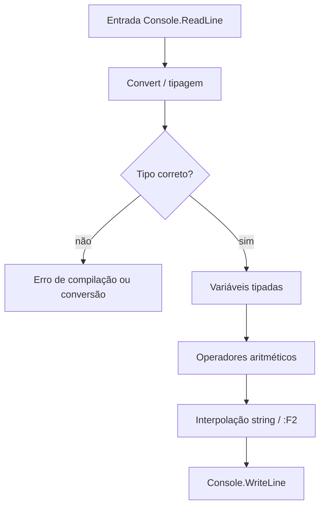
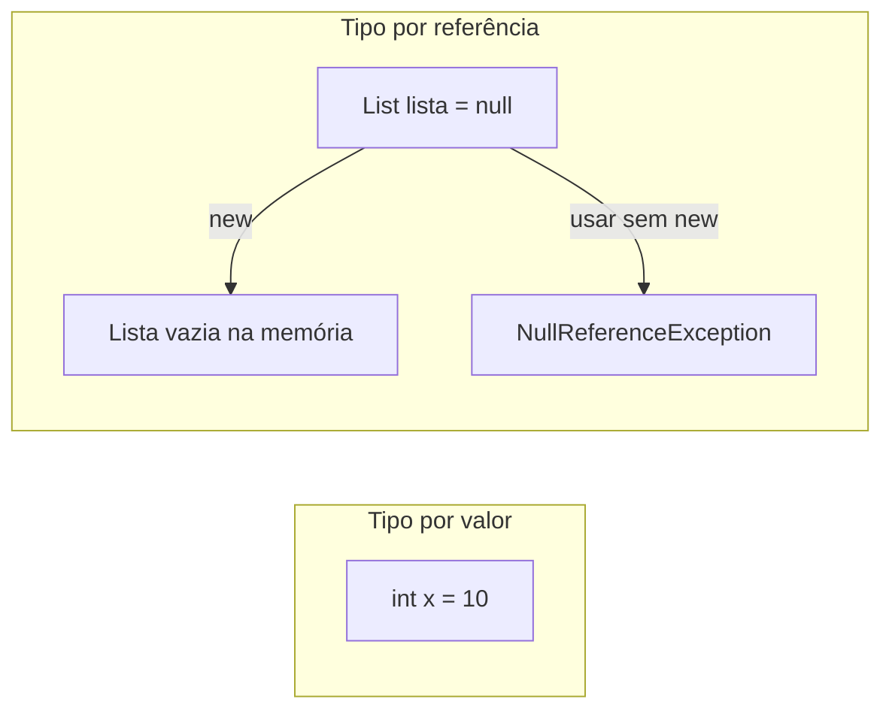

## Visão Geral do Conceito

Programas de backend em C# precisam **nomear dados**, **garantir o tipo certo** e **calcular** a partir de entradas do usuário. Nesta lição você consolida o núcleo da etapa 2 do curso: declaração de variáveis tipadas, o papel de <mark style="background-color: #242424; padding: 2px 4px; border-radius: 3px; color: inherit;">`string`</mark> como tipo de texto, operadores aritméticos para transformar números e a saída formatada no console.

> **Problema que resolve:** sem tipagem explícita e sem operadores/conversão corretos, o programa mistura texto com número, perde precisão ou quebra em tempo de compilação — ou pior, em produção com `null`.

**Por que importa:** APIs, relatórios e regras de negócio (desconto VIP, salário, média de notas) são só variáveis + operações + mensagens. A lista de exercícios de C# básico da disciplina treina exatamente esse pipeline: ler → converter → calcular → exibir.

**Escopo desta aula (fonte):** a transcrição da Aula 03 prioriza **variáveis, tipos, valor/referência, `var`, `const` e `readonly`**. Manipulação avançada de strings e operadores lógicos foram **prometidos na agenda**, mas o professor encerrou adiando strings para a aula seguinte. Operadores aritméticos e formatação de string entram aqui cruzados com a **lista/gabarito** oficiais.

---

## Modelo Mental

Pense em três camadas que sempre colaboram:

1. **Caixa tipada (variável)** — você escolhe o tipo (`int`, `string`, `double`…) e o nome; a caixa só aceita valores compatíveis.
2. **Operação** — operadores (`+`, `-`, `*`, `/`) transformam valores; o resultado também tem tipo (e pode perder precisão se misturar `int` e `double` sem cuidado).
3. **Texto de saída** — <mark style="background-color: #242424; padding: 2px 4px; border-radius: 3px; color: inherit;">`string`</mark> e interpolação (`$"..."`) montam a mensagem que o usuário vê.

Analogia rápida: a variável é uma **gaveta etiquetada**; o tipo é a **etiqueta** (só cabe o que a etiqueta permite); o operador é a **calculadora**; a string formatada é o **recibo** impresso.



**Tipagem forte vs dinâmica (modelo da aula):** em Python, reatribuir `nome = "Maria"` e depois `nome = 25` “muda o ponteiro” em tempo de execução. Em C#, `string nome = "Maria"; nome = 25;` é rejeitado: o tipo foi fixado na declaração.

---

## Mecânica Central

### Estrutura mínima do programa (revisão)

No modo clássico, o programa organiza:

- <mark style="background-color: #242424; padding: 2px 4px; border-radius: 3px; color: inherit;">`using System;`</mark> — importa tipos como <mark style="background-color: #242424; padding: 2px 4px; border-radius: 3px; color: inherit;">`Console`</mark> (sem isso, seria `System.Console.WriteLine`).
- <mark style="background-color: #242424; padding: 2px 4px; border-radius: 3px; color: inherit;">`namespace`</mark> — organiza o código em módulos.
- <mark style="background-color: #242424; padding: 2px 4px; border-radius: 3px; color: inherit;">`static void Main`</mark> — ponto de entrada.

Há também o estilo moderno (top-level statements / “script-like”) visto no Hello World, mas no dia a dia profissional o professor reforçou a forma com classe e `Main` (orientação a objetos).

### Declaração: tipo primeiro, depois o nome

```csharp
int idade = 25;
string nome = "Maria";
DateTime nascimento = DateTime.Now; // datas
double salario = 3500.50;
bool ativo = true;
```

> **Regra de ouro (aula):** variáveis locais em <mark style="background-color: #242424; padding: 2px 4px; border-radius: 3px; color: inherit;">`camelCase`</mark> (`nomeCompleto`); classes e métodos em <mark style="background-color: #242424; padding: 2px 4px; border-radius: 3px; color: inherit;">`PascalCase`</mark>. Quebrar a convenção **não** gera erro de compilação, mas foge do padrão da linguagem.

### Tipagem forte

Uma vez definido o tipo, só entram valores compatíveis:

```csharp
string nome = "João";
// nome = 25; // erro: não converte int → string implicitamente

int idade = 25;
// idade = "Maria"; // erro: string não cabe em int
```

Você tipa **na primeira declaração**; depois reutiliza a variável com valores do **mesmo tipo**.

### Tipos por valor × tipos por referência

| | Tipo por valor | Tipo por referência |
|---|---|---|
| Exemplos | `int`, `double`, `bool` (valores literais) | `List<T>`, arrays, muitos objetos |
| Alocação | valor já definido na variável | precisa de endereço — tipicamente com <mark style="background-color: #242424; padding: 2px 4px; border-radius: 3px; color: inherit;">`new`</mark> |
| Risco de `null` | na prática da aula: não cai em referência nula do mesmo jeito | pode ser <mark style="background-color: #242424; padding: 2px 4px; border-radius: 3px; color: inherit;">`null`</mark> → <mark style="background-color: #242424; padding: 2px 4px; border-radius: 3px; color: inherit;">`NullReferenceException`</mark> |

```csharp
List<int> lista = new List<int>(); // referência válida, 0 elementos
List<int> lista2 = null;           // sem endereço de memória
// lista2.Add(1); // NullReferenceException
```

- **`null`:** não há apontamento de memória.
- **Lista vazia (`new`):** há memória alocada; só não há elementos — métodos podem ser usados.



### Inferência com `var`

<mark style="background-color: #242424; padding: 2px 4px; border-radius: 3px; color: inherit;">`var`</mark> é atalho: o **compilador** infere o tipo a partir do valor inicial. **Não** torna a linguagem dinamicamente tipada.

```csharp
var nome = "João";      // string
var x = 10;             // int (Int32)
var y = 3.14;           // double
// nome = y;            // erro: Cannot implicitly convert type 'double' to 'string'
```

Se precisar de `long` (`Int64`) em vez do `int` padrão inferido de `10`, declare o tipo explicitamente: `long t = 10;`.

### Capacidade de inteiros (precisão / armazenamento)

A aula relacionou tamanhos binários à capacidade:

| Tipo comum | Bits (visão da aula) | Ideia |
|---|---|---|
| `short` / Int16 | 16 | intervalo menor (~±65 535 no discurso da capacidade) |
| `int` / Int32 | 32 | padrão do dia a dia (~bilhões) |
| `long` / Int64 | 64 | contas grandes |
| Int128 (mencionado) | 128 | capacidade enorme, mais memória |

Inteiros **não** têm ponto flutuante. Negativos entram no intervalo do tipo com sinal. Em sistemas financeiros/previdenciários, a escolha do tipo (e casas decimais) evita contas que “não fecham”.

### `const` e `readonly`

```csharp
const int IDADE_MINIMA = 18;       // nomes de const: MAIÚSCULAS (convenção da aula)
const double DESCONTO_PRODUTO = 0.30;

// IDADE_MINIMA = 21; // erro: constante não pode ser alterada
```

- <mark style="background-color: #242424; padding: 2px 4px; border-radius: 3px; color: inherit;">`const`</mark>: valor fixo; **deve** ser inicializada na declaração; útil para Pi, descontos, limites.
- <mark style="background-color: #242424; padding: 2px 4px; border-radius: 3px; color: inherit;">`readonly`</mark>: também “só leitura” após inicializar, mas pode receber valor **depois** (no construtor da classe). Nuance de OO — o professor pediu para não aprofundar construtores ainda.

Exemplo de uso de constante em cálculo (ideia da aula):

```csharp
const double DESCONTO_VIP = 0.30;
double produto = 1500.99;
// se cliente VIP:
produto = produto - (produto * DESCONTO_VIP);
```

Mudar o percentual só na constante; a fórmula permanece.

### `string`, entrada e operadores (lista / gabarito)

Na prática da lista básica:

1. Ler texto com <mark style="background-color: #242424; padding: 2px 4px; border-radius: 3px; color: inherit;">`Console.ReadLine()`</mark> (sempre devolve `string`).
2. Converter com <mark style="background-color: #242424; padding: 2px 4px; border-radius: 3px; color: inherit;">`Convert.ToInt32`</mark> / <mark style="background-color: #242424; padding: 2px 4px; border-radius: 3px; color: inherit;">`Convert.ToDouble`</mark>.
3. Calcular com `+`, `-`, `*`, `/`.
4. Exibir com interpolação <mark style="background-color: #242424; padding: 2px 4px; border-radius: 3px; color: inherit;">`$"..."`</mark> e formato <mark style="background-color: #242424; padding: 2px 4px; border-radius: 3px; color: inherit;">`:F2`</mark> (duas casas decimais).

```csharp
Console.Write("Valor do produto: ");
double valorProduto = Convert.ToDouble(Console.ReadLine());

Console.Write("Percentual de desconto: ");
double percentual = Convert.ToDouble(Console.ReadLine());

double valorDesconto = valorProduto * percentual / 100;
double valorFinal = valorProduto - valorDesconto;

Console.WriteLine($"Valor do desconto: R$ {valorDesconto:F2}");
Console.WriteLine($"Valor final: R$ {valorFinal:F2}");
```

**Não coberto na fonte (transcrição Aula 03):** métodos de manipulação de string (`Substring`, `Replace`, `Split`, etc.), concatenação avançada e **operadores lógicos** (`&&`, `||`, `!`) — agenda citada, conteúdo adiado. A aula 04 do mapa retoma prática da lista e console.

---

## Uso Prático

### 1. Cadastro simples (tipos + string)

Cenário ADS: registrar dados de um usuário para log de atendimento.

```csharp
Console.Write("Digite seu nome: ");
string nome = Console.ReadLine();

Console.Write("Digite sua idade: ");
int idade = Convert.ToInt32(Console.ReadLine());

Console.Write("Digite sua cidade: ");
string cidade = Console.ReadLine();

Console.WriteLine("\nDados informados:");
Console.WriteLine($"Nome: {nome}");
Console.WriteLine($"Idade: {idade} anos");
Console.WriteLine($"Cidade: {cidade}");
```

### 2. Média de notas com formatação

```csharp
double nota1 = Convert.ToDouble(Console.ReadLine());
double nota2 = Convert.ToDouble(Console.ReadLine());
double nota3 = Convert.ToDouble(Console.ReadLine());

double media = (nota1 + nota2 + nota3) / 3;
Console.WriteLine($"Média: {media:F2}");
```

Parênteses garantem a soma antes da divisão — precedência aritmética padrão.

### 3. Salário bruto (operador `*`)

```csharp
double valorHora = Convert.ToDouble(Console.ReadLine());
double horas = Convert.ToDouble(Console.ReadLine());
double salario = valorHora * horas;
Console.WriteLine($"Salário Bruto: R$ {salario:F2}");
```

### 4. Preferir `double` (ou tipos decimais) em dinheiro de exercício

A lista usa `double` para valores monetários e médias. Em produção financeira o ecossistema .NET frequentemente recomenda <mark style="background-color: #242424; padding: 2px 4px; border-radius: 3px; color: inherit;">`decimal`</mark> — **não detalhado nesta aula**; registre como evolução posterior alinhada ao aviso do professor sobre precisão em sistemas previdenciários.

---

## Erros Comuns

1. **Atribuir tipo incompatível**  
   Sintoma: erro de compilação de conversão implícita (`Cannot implicitly convert type ...`).  
   Correção: declare outro tipo, converta explicitamente ou não misture `string` e número.

2. **Usar `var` achando que é tipagem dinâmica**  
   Sintoma: após `var nome = "João"`, tentar `nome = 3.14` falha.  
   Correção: `var` só infere; a regra de tipagem forte permanece.

3. **Chamar método em referência `null`**  
   Sintoma: <mark style="background-color: #242424; padding: 2px 4px; border-radius: 3px; color: inherit;">`NullReferenceException`</mark> (equivalente conceitual ao NPE do Java).  
   Correção: inicialize com `new` antes de usar; diferencie `null` de coleção vazia.

4. **Esquecer conversão após `ReadLine`**  
   Sintoma: operações aritméticas “estranhas” ou erro de tipos — `ReadLine` devolve `string`.  
   Correção: `Convert.ToInt32` / `Convert.ToDouble` (como no gabarito).

5. **Divisão inteira indesejada**  
   Sintoma: média ou divisão “corta” casas quando ambos os operandos são `int`.  
   Correção: use `double` nos operandos (padrão da lista) ou force divisão em ponto flutuante.

6. **Reatribuir `const`**  
   Sintoma: erro ao alterar constante.  
   Correção: altere o literal na declaração ou use variável comum se o valor precisar mudar em runtime.

7. **Ignorar convenções `camelCase` / `PascalCase`**  
   Sintoma: código compila, mas fica ilegível no padrão C#.  
   Correção: locais em camelCase; tipos/métodos em PascalCase; `const` em MAIÚSCULAS (convenção da aula).

---

## Visão Geral de Debugging

Quando o código “não fecha”, percorra esta ordem:

1. **Compila?** Leia a mensagem de tipo (`implicit convert`) — quase sempre incompatibilidade de tipos ou `const`.
2. **Converte?** Confirme que toda entrada numérica passou por `Convert` antes do cálculo.
3. **Calcula?** Imprima intermediários (`Console.WriteLine` da fórmula e dos operandos); confira parênteses e divisão por zero.
4. **Referência?** Se a falha for em coleção/objeto, verifique se houve `new` — `null` vs vazio.
5. **Precisão?** Se o número “estoura” ou perde casas, revise se o tipo (`int` vs `long` vs `double`) comporta o domínio (financeiro, IDs grandes).

<details>
<summary>Exemplo de raciocínio — desconto VIP com const</summary>

Se o valor final sai errado, isole: (1) `DESCONTO` está em fração (`0.30`) ou percentual (`30`)? A fórmula da aula usou `produto * desconto` com constante fracionária; o gabarito da lista usa `percentual / 100`. Não misture as duas convenções sem ajustar a fórmula. (2) Imprima `valorDesconto` e `valorFinal` com `:F2` para validar.

</details>

---

## Principais Pontos

- Em C#, declare **tipo + nome**; tipagem forte impede misturar tipos sem conversão.
- <mark style="background-color: #242424; padding: 2px 4px; border-radius: 3px; color: inherit;">`string`</mark>, <mark style="background-color: #242424; padding: 2px 4px; border-radius: 3px; color: inherit;">`int`</mark>, <mark style="background-color: #242424; padding: 2px 4px; border-radius: 3px; color: inherit;">`double`</mark>, <mark style="background-color: #242424; padding: 2px 4px; border-radius: 3px; color: inherit;">`bool`</mark> e <mark style="background-color: #242424; padding: 2px 4px; border-radius: 3px; color: inherit;">`DateTime`</mark> são os tipos fundamentais citados na aula.
- Tipos por **valor** vs **referência**: referência usa `new`; `null` ≠ coleção vazia.
- <mark style="background-color: #242424; padding: 2px 4px; border-radius: 3px; color: inherit;">`var`</mark> infere tipo; não relaxa tipagem forte.
- <mark style="background-color: #242424; padding: 2px 4px; border-radius: 3px; color: inherit;">`const`</mark> = valor imutável inicializado na hora; `readonly` é nuance de construtor.
- Pipeline da lista: `ReadLine` → `Convert` → operadores `+ - * /` → `$"..."` com `:F2`.
- Convenções: locais `camelCase`, tipos/métodos `PascalCase`, constantes MAIÚSCULAS.
- **Lacuna declarada:** manipulação profunda de strings e operadores lógicos — não desenvolvidos na Aula 03 (adiados).

---

## Preparação para Prática

Antes do laboratório, você deve conseguir:

- Declarar variáveis tipadas e explicar por que uma reatribuição ilegal falha.
- Escolher entre valor e referência e evitar uso de referência `null`.
- Usar `const` para percentual/fator fixo em cálculo de desconto ou limite.
- Reproduzir o fluxo da lista: ler strings, converter, calcular, formatar saída.

O editor integrado do ISS executa **JavaScript**; os desafios abaixo treinam a **mesma lógica** da lista C#, com comentários apontando o equivalente em C#. No seu ambiente .NET (VS Code / Rider), reimplemente em C# puro.

---

## Laboratório de Prática

### Easy — Apresentação de colaborador (tipos + string)

**Contexto:** montar uma linha de log com nome, idade e cidade a partir de dados já obtidos (simulando pós-`ReadLine`).

Complete `formatarApresentacao` para devolver uma string no formato  
`Nome: Ana | Idade: 28 anos | Cidade: Recife`.

```javascript
// Equivalente C#:
// string formatar = $"Nome: {nome} | Idade: {idade} anos | Cidade: {cidade}";

function formatarApresentacao(nome, idade, cidade) {
  // TODO: retornar a string formatada com nome (string), idade (number) e cidade (string)
  return "";
}

// Boilerplate executável (incompleto até o TODO)
console.log(formatarApresentacao("Ana", 28, "Recife"));
```

### Medium — Consumo médio de combustível (operadores)

**Contexto:** telemetria de frota — calcular km/l a partir de distância e litros.

```javascript
// Equivalente C#:
// double consumo = distancia / litros;
// Console.WriteLine($"Consumo médio: {consumo:F2} km/l");

function consumoMedio(distanciaKm, litros) {
  // TODO: se litros <= 0, retornar null (evitar divisão por zero)
  // TODO: senão retornar distanciaKm / litros
  return 0;
}

function formatarConsumo(consumo) {
  // TODO: se consumo === null, retornar "consumo indisponivel"
  // TODO: senão retornar string com 2 casas: `${consumo.toFixed(2)} km/l`
  return "";
}

console.log(formatarConsumo(consumoMedio(400, 32)));
console.log(formatarConsumo(consumoMedio(100, 0)));
```

### Hard — Desconto com fator constante (const + aritmética)

**Contexto:** regra de preço de e-commerce — percentual de desconto fixo da campanha (como `const` na aula) e cálculo do valor final.

```javascript
// Equivalente C#:
// const double PERCENTUAL_CAMPANHA = 15;
// double valorDesconto = valorProduto * PERCENTUAL_CAMPANHA / 100;
// double valorFinal = valorProduto - valorDesconto;

const PERCENTUAL_CAMPANHA = 15; // trate como const de C# (não reatribuir)

function calcularDesconto(valorProduto, percentual) {
  // TODO: retornar objeto { valorDesconto, valorFinal }
  // valorDesconto = valorProduto * percentual / 100
  // valorFinal = valorProduto - valorDesconto
  return { valorDesconto: 0, valorFinal: 0 };
}

function formatarPrecoCampanha(valorProduto) {
  const { valorDesconto, valorFinal } = calcularDesconto(
    valorProduto,
    PERCENTUAL_CAMPANHA
  );
  // TODO: retornar string:
  // `Desconto: R$ ${valorDesconto.toFixed(2)} | Final: R$ ${valorFinal.toFixed(2)}`
  return "";
}

console.log(formatarPrecoCampanha(200));
```

---

<!-- META_LESSONS_JSON
discipline: fundamentos-csharp
slug: strings-variaveis-operadores-csharp
title: Strings, variáveis e operadores em C#
order: 3
file: content/fundamentos-csharp/aula-03-strings-variaveis-operadores-csharp.md
NOTE: lessons.json / search-index.json NÃO editados nesta missão (integração serial pelo orquestrador).
-->

<!-- CONCEPT_EXTRACTION
concepts:
  - variáveis tipadas em C#
  - tipagem forte vs dinâmica
  - string / int / double / bool / DateTime
  - camelCase e PascalCase
  - tipos por valor
  - tipos por referência
  - new
  - null
  - NullReferenceException
  - var (inferência de tipo)
  - const
  - readonly
  - capacidade de inteiros (Int16/Int32/Int64)
  - operadores aritméticos + - * /
  - Console.ReadLine
  - Convert.ToInt32 / Convert.ToDouble
  - interpolação de string $"..."
  - formatação :F2
skills:
  - Declarar variáveis com tipo explícito e nomes em camelCase
  - Explicar por que atribuições entre tipos incompatíveis falham em compilação
  - Distinguir null de coleção vazia e usar new em referências
  - Usar var sem abandonar tipagem forte
  - Definir const para fatores fixos de negócio
  - Converter entrada de console e calcular com operadores aritméticos
  - Formatatar saída com interpolação e duas casas decimais
examples:
  - declaracao-tipos-fundamentais
  - valor-vs-referencia-list-null
  - var-inferencia-forte
  - const-desconto-vip
  - gabarito-apresentacao-pessoal
  - gabarito-media-notas
  - gabarito-calculo-desconto
-->

<!-- EXERCISES_JSON
[
  {
    "id": "cs03-formatar-apresentacao",
    "slug": "cs03-formatar-apresentacao",
    "difficulty": "easy",
    "title": "Apresentação de colaborador (tipos + string)",
    "discipline": "fundamentos-csharp",
    "editorLanguage": "javascript",
    "tags": ["csharp", "string", "variaveis", "formatacao"],
    "summary": "Montar string de apresentação com nome, idade e cidade (equivalente à interpolação C#)."
  },
  {
    "id": "cs03-consumo-combustivel",
    "slug": "cs03-consumo-combustivel",
    "difficulty": "medium",
    "title": "Consumo médio de combustível (operadores)",
    "discipline": "fundamentos-csharp",
    "editorLanguage": "javascript",
    "tags": ["csharp", "operadores", "divisao", "validacao"],
    "summary": "Calcular km/l com divisão, tratar litros inválidos e formatar com duas casas."
  },
  {
    "id": "cs03-desconto-campanha-const",
    "slug": "cs03-desconto-campanha-const",
    "difficulty": "hard",
    "title": "Desconto com fator constante",
    "discipline": "fundamentos-csharp",
    "editorLanguage": "javascript",
    "tags": ["csharp", "const", "operadores", "desconto"],
    "summary": "Aplicar percentual fixo estilo const, calcular desconto/valor final e formatar em R$."
  }
]
-->
