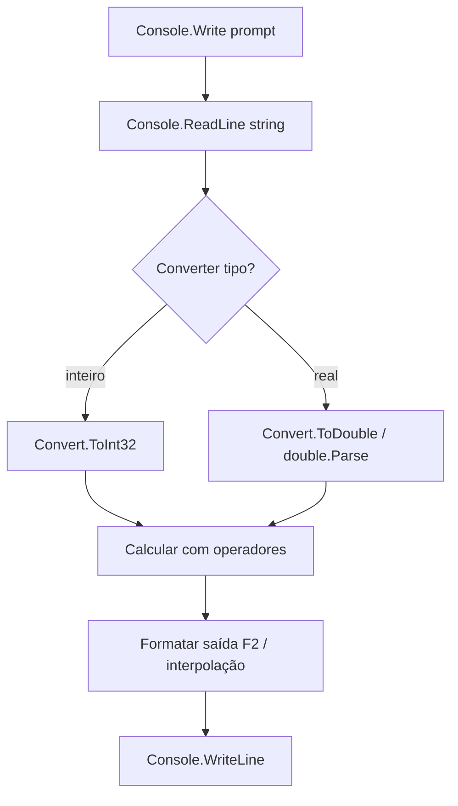
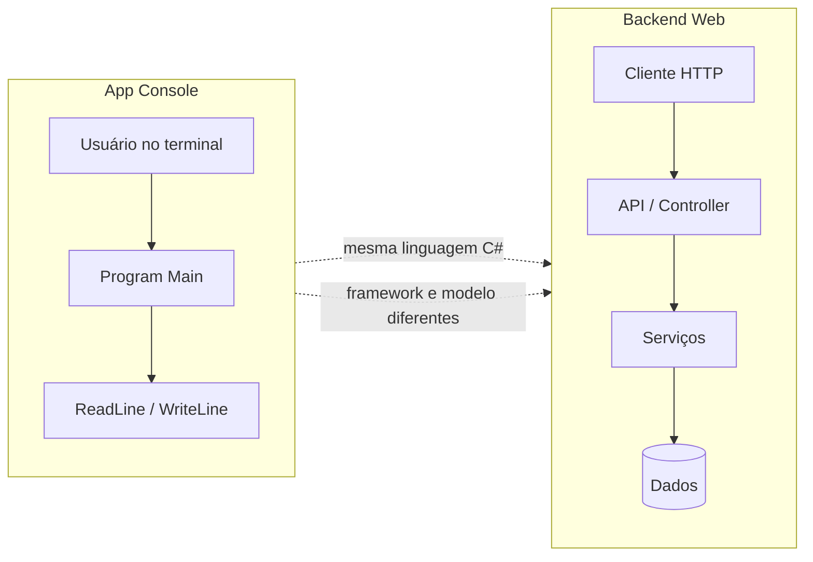

## Visão Geral do Conceito

Esta aula é **prática de consolidação**: o professor corrige a lista de exercícios de C# básico (a partir do exercício 4) e, no final, abre a porta para **manipulação de strings**. No caminho aparecem três ideias que o estagiário de backend precisa internalizar cedo:

1. **Programa console** = ler texto → converter → calcular → formatar saída.
2. **Tipo certo** (`int` vs `double`) e **conversão explícita** evitam erros silenciosos e exceções na entrada.
3. **Console ≠ backend web**: a linguagem pode ser a mesma; o framework e o modelo de aplicação mudam.

> **Problema que resolve:** transformar enunciados simples (média, salário, desconto, temperatura) em programas .NET executáveis, com entrada/saída corretas — base para qualquer serviço que depois receberá JSON, query string ou formulário em vez de terminal.

Documentos de apoio cruzados nesta lição: lista de exercícios e gabarito em `downloads/documents/Fundamentos_C#` (texto extraído em `memory/t3-backend-lessons/extracted/csharp-lista.txt` e `csharp-gabarito.txt`).

## Modelo Mental

### O pipeline do exercício console

Pense em cada item da lista como um mini pipeline:



A falha mais comum não está na fórmula: está em **tratar string como número** ou usar **tipo estreito demais** (`int` onde a nota é `7.5`).

### Console versus backend



Na aula: *“A linguagem não vai mudar. Mas a tecnologia muda. O framework muda.”* Console treina raciocínio e sintaxe; backend web adiciona HTTP, rotas, contratos e hospedagem.

### Analogia rápida

- **Console:** balcão de atendimento — a pessoa fala, você responde na hora.
- **Backend:** call center com protocolo — a mensagem chega por canal (HTTP), passa por regras e volta formatada; o atendente ainda fala a mesma língua (C#), mas o processo é outro.

## Mecânica Central

### 1. Ambiente da aula: Rider e Visual Studio

- O professor usou **JetBrains Rider** quando o Visual Studio estava atualizando.
- Rider funciona em **Windows, macOS e Linux**; Visual Studio clássico focado em Windows.
- Para uso não comercial (e no contexto Infinity), Rider pode ser gratuito — verificar a licença atual da JetBrains.
- Dica da aula: anotações de tipo como <mark style="background-color: #242424; padding: 2px 4px; border-radius: 3px; color: inherit;">`: double`</mark> ao lado de <mark style="background-color: #242424; padding: 2px 4px; border-radius: 3px; color: inherit;">`var`</mark> são **hints da IDE (Rider)**, não sintaxe obrigatória do C# no código-fonte.

### 2. Template console: top-level statements vs `Main`

Ao criar o projeto, dá para marcar **Do not use top-level statements**. Nesse modo o Rider gera a estrutura clássica:

- classe <mark style="background-color: #242424; padding: 2px 4px; border-radius: 3px; color: inherit;">`Program`</mark>
- método <mark style="background-color: #242424; padding: 2px 4px; border-radius: 3px; color: inherit;">`static void Main`</mark>
- `Hello World` inicial

Em templates modernos, muitos namespaces (como <mark style="background-color: #242424; padding: 2px 4px; border-radius: 3px; color: inherit;">`System`</mark>) já vêm importados implicitamente — por isso <mark style="background-color: #242424; padding: 2px 4px; border-radius: 3px; color: inherit;">`using System;`</mark> costuma ser desnecessário no console simples.

> **Não é obrigatório** criar um projeto console por exercício. O professor fez assim para demonstrar; um único projeto com vários programas ou pastas também funciona.

### 3. Conversão: `Convert` vs `Parse`

| Abordagem | Exemplo | Quando a aula destaca |
|-----------|---------|------------------------|
| Utilitário | <mark style="background-color: #242424; padding: 2px 4px; border-radius: 3px; color: inherit;">`Convert.ToDouble(Console.ReadLine())`</mark> | Já concentra vários métodos de conversão (`ToInt32`, `ToDouble`, …) |
| Por tipo | <mark style="background-color: #242424; padding: 2px 4px; border-radius: 3px; color: inherit;">`double.Parse(Console.ReadLine())`</mark> | Equivalente na prática da aula; você lembra do tipo e chama `Parse` |

Ambos falham se o texto não for numérico válido para a cultura atual.

### 4. Cultura do terminal: vírgula vs ponto

No código-fonte C#, literais `double` usam **ponto** (`7.5`). No terminal com SO em português, a **entrada** do usuário frequentemente usa **vírgula** (`7,5`), porque o runtime interpreta o separador decimal pela cultura do sistema.

Sintoma na aula: digitar ponto quando o terminal espera vírgula (ou o inverso) faz a conversão estourar erro. Saída formatada com <mark style="background-color: #242424; padding: 2px 4px; border-radius: 3px; color: inherit;">`F2`</mark> mostra duas casas decimais na cultura atual.

```csharp
double media = (n1 + n2 + n3) / 3;
Console.WriteLine($"Média: {media:F2}");
```

### 5. Padrões dos exercícios 4–10 (lista + gabarito)

Conteúdos cobertos pela lista: variáveis, tipos, entrada/saída, conversão, operadores e formatação.

| # | Problema | Tipos / fórmula-chave |
|---|----------|------------------------|
| 4 | Média de três notas | `double`; média = soma / 3; saída `F2` |
| 5 | Celsius → Fahrenheit | `F = (C * 9 / 5) + 32` |
| 6 | Área e perímetro | área = base × altura; perímetro = `2 * (base + altura)` |
| 7 | Idade → meses e dias | meses = anos × 12; dias = anos × 365 (sem ano bissexto) |
| 8 | Salário bruto | valorHora × horas; saída monetária com `F2` |
| 9 | Consumo km/l | distância / litros |
| 10 | Desconto | desconto = valor × percentual / 100; final = valor − desconto |

Exercícios 1–3 (apresentação, antecessor/sucessor, operações) foram cobertos em aulas anteriores; o gabarito completo permanece referência.

### 6. Strings: formas de montar texto

| Forma | Sintaxe | Uso típico na aula |
|-------|---------|---------------------|
| Concatenação | `"Olá " + nome` | Simples, poucos pedaços |
| Interpolação | <mark style="background-color: #242424; padding: 2px 4px; border-radius: 3px; color: inherit;">`$"Olá, {nome}"`</mark> | Mais legível |
| Verbatim | <mark style="background-color: #242424; padding: 2px 4px; border-radius: 3px; color: inherit;">`@"C:\pasta\arquivo"`</mark> | Caminhos (barra invertida literal) |
| <mark style="background-color: #242424; padding: 2px 4px; border-radius: 3px; color: inherit;">`StringBuilder`</mark> | `Append` / `AppendLine` + `ToString()` | Textos grandes / muitas concatenações |

### 7. Métodos de string citados na aula

Verificações e transformações (nomes canônicos; a transcrição ASR distorce alguns):

- <mark style="background-color: #242424; padding: 2px 4px; border-radius: 3px; color: inherit;">`string.IsNullOrEmpty`</mark>
- <mark style="background-color: #242424; padding: 2px 4px; border-radius: 3px; color: inherit;">`Contains`</mark>, <mark style="background-color: #242424; padding: 2px 4px; border-radius: 3px; color: inherit;">`StartsWith`</mark>, <mark style="background-color: #242424; padding: 2px 4px; border-radius: 3px; color: inherit;">`EndsWith`</mark>
- <mark style="background-color: #242424; padding: 2px 4px; border-radius: 3px; color: inherit;">`ToUpper`</mark>, <mark style="background-color: #242424; padding: 2px 4px; border-radius: 3px; color: inherit;">`ToLower`</mark>
- <mark style="background-color: #242424; padding: 2px 4px; border-radius: 3px; color: inherit;">`Trim`</mark> (só início e fim — não “espaços do meio” de forma mágica)
- <mark style="background-color: #242424; padding: 2px 4px; border-radius: 3px; color: inherit;">`Replace`</mark>
- <mark style="background-color: #242424; padding: 2px 4px; border-radius: 3px; color: inherit;">`string.Format`</mark>
- <mark style="background-color: #242424; padding: 2px 4px; border-radius: 3px; color: inherit;">`PadLeft`</mark> / <mark style="background-color: #242424; padding: 2px 4px; border-radius: 3px; color: inherit;">`PadRight`</mark>
- <mark style="background-color: #242424; padding: 2px 4px; border-radius: 3px; color: inherit;">`Substring`</mark>, <mark style="background-color: #242424; padding: 2px 4px; border-radius: 3px; color: inherit;">`Split`</mark>
- <mark style="background-color: #242424; padding: 2px 4px; border-radius: 3px; color: inherit;">`IndexOf`</mark>, <mark style="background-color: #242424; padding: 2px 4px; border-radius: 3px; color: inherit;">`Length`</mark>

**Range** (parecido com slice do Python): em C# usa-se <mark style="background-color: #242424; padding: 2px 4px; border-radius: 3px; color: inherit;">`nome[0..2]`</mark> (dois pontos `..`); o limite superior do range é exclusivo, como no Python. Para percorrer de 2 em 2 caracteres, a aula indica **loop** — não há range “passo 2” embutido como atalho único no material.

Inverter string no demo: converter para array de chars (<mark style="background-color: #242424; padding: 2px 4px; border-radius: 3px; color: inherit;">`ToCharArray`</mark>), <mark style="background-color: #242424; padding: 2px 4px; border-radius: 3px; color: inherit;">`Array.Reverse`</mark>, montar nova string — porque string é sequência de caracteres (análogo ao array de chars do Python).

## Uso Prático

### Exercício 4 — média (tipo errado → tipo certo)

```csharp
Console.Write("Nota 1: ");
double nota1 = Convert.ToDouble(Console.ReadLine());

Console.Write("Nota 2: ");
double nota2 = Convert.ToDouble(Console.ReadLine());

Console.Write("Nota 3: ");
double nota3 = Convert.ToDouble(Console.ReadLine());

double media = (nota1 + nota2 + nota3) / 3;
Console.WriteLine($"Média: {media:F2}");
```

Se somar strings sem converter, o compilador impede operação aritmética. Se usar `int`, perde precisão e a entrada `7,5` quebra.

### Exercício 5 — temperatura

```csharp
Console.Write("Temperatura em Celsius: ");
double celsius = Convert.ToDouble(Console.ReadLine());
double fahrenheit = (celsius * 9 / 5) + 32;
Console.WriteLine($"Temperatura em Fahrenheit: {fahrenheit:F2}");
```

### Exercício 6 — área e perímetro (cuidado com fórmula)

```csharp
Console.Write("Base: ");
double baseRetangulo = Convert.ToDouble(Console.ReadLine());
Console.Write("Altura: ");
double altura = Convert.ToDouble(Console.ReadLine());

double area = baseRetangulo * altura;
double perimetro = 2 * (baseRetangulo + altura);

Console.WriteLine($"Área: {area:F2}");
Console.WriteLine($"Perímetro: {perimetro:F2}");
```

Na aula, sugestão automática da IA errou o perímetro; a correção humana restaurou `2 * (base + altura)`.

### Exercício 8 — salário com `Parse` e `F2`

```csharp
Console.Write("Valor da hora: ");
double valorHora = double.Parse(Console.ReadLine());
Console.Write("Horas trabalhadas: ");
double horas = double.Parse(Console.ReadLine());

double salario = valorHora * horas;
Console.WriteLine($"Salário Bruto: R$ {salario:F2}");
```

Sem `F2`, a saída pode omitir casas decimais visuais esperadas em valor monetário.

### Exercício 10 — desconto de produto

```csharp
Console.Write("Valor do produto: ");
double valorProduto = Convert.ToDouble(Console.ReadLine());
Console.Write("Percentual de desconto: ");
double percentual = Convert.ToDouble(Console.ReadLine());

double valorDesconto = valorProduto * percentual / 100;
double valorFinal = valorProduto - valorDesconto;

Console.WriteLine($"Valor do desconto: R$ {valorDesconto:F2}");
Console.WriteLine($"Valor final: R$ {valorFinal:F2}");
```

Exemplo da aula: produto `1500`, desconto `10%` → desconto `150`, final `1350`.

### Demo de strings com `StringBuilder`

```csharp
using System.Text;

Console.Write("Digite seu nome: ");
string nome = Console.ReadLine() ?? "";

var builder = new StringBuilder();
builder.AppendLine($"Nome: {nome}");
builder.AppendLine($"Caixa alta: {nome.ToUpper()}");
builder.AppendLine($"Caixa baixa: {nome.ToLower()}");
builder.AppendLine($"Quantidade de caracteres: {nome.Length}");

char[] chars = nome.ToCharArray();
Array.Reverse(chars);
string invertido = new string(chars);
builder.AppendLine($"Invertido: {invertido}");

// Range exclusivo no fim (0..2 → índices 0 e 1)
if (nome.Length >= 2)
    builder.AppendLine($"Faixa [0..2]: {nome[0..2]}");

Console.WriteLine(builder.ToString());
```

## Erros Comuns

1. **Operar aritmética em `string`**  
   Sintoma: erro de compilação — operador não se aplica a `string`.  
   Correção: converter com <mark style="background-color: #242424; padding: 2px 4px; border-radius: 3px; color: inherit;">`Convert.ToDouble`</mark> / <mark style="background-color: #242424; padding: 2px 4px; border-radius: 3px; color: inherit;">`Parse`</mark> antes da conta.

2. **Usar `int` onde o domínio é decimal**  
   Sintoma: média “estranha”, entrada `7,5` falha, truncamento.  
   Correção: <mark style="background-color: #242424; padding: 2px 4px; border-radius: 3px; color: inherit;">`double`</mark> + saída <mark style="background-color: #242424; padding: 2px 4px; border-radius: 3px; color: inherit;">`F2`</mark>.

3. **Separador decimal errado no terminal**  
   Sintoma: exceção na conversão ao misturar `.` e `,` com a cultura do SO.  
   Correção: digitar no formato que a cultura do terminal espera (pt-BR costuma ser vírgula) ou normalizar a string antes de converter (estratégia avançada — API de cultura detalhada **não coberta na fonte** além do sintoma).

4. **Fórmula de perímetro invertida / gerada por IA**  
   Sintoma: área ok, perímetro absurdo.  
   Correção: validar a definição (`2 * (base + altura)`), não confiar cegamente no autocomplete.

5. **Esquecer `F2` em dinheiro ou média**  
   Sintoma: `1980` em vez de `1980,00` (conforme cultura).  
   Correção: interpolação com formato `{valor:F2}`.

6. **Achar que console “já é” o backend**  
   Sintoma: expectativa errada de vaga/estágio.  
   Correção: console treina fundamentos; backend web muda framework e modelo de I/O (HTTP), não a linguagem.

7. **`Trim` para “tirar espaços do meio” ou passo 2 sem loop**  
   Sintoma: espaços internos permanecem; amostragem de 2 em 2 não sai com range único.  
   Correção: <mark style="background-color: #242424; padding: 2px 4px; border-radius: 3px; color: inherit;">`Trim`</mark> só nas bordas; passo personalizado exige laço.

## Visão Geral de Debugging

Quando o console “não fecha a conta”, siga esta ordem:

1. **Imprima o tipo e o valor bruto** após o `ReadLine` (ainda como string) e depois da conversão.
2. **Confirme a cultura do separador** — tente a mesma entrada com vírgula e com ponto e veja qual a máquina aceita.
3. **Isole a fórmula** com literais fixos (`7.5`, `8.5`, `6.5`) sem `ReadLine`; se fechar, o bug está na entrada/conversão.
4. **Cheque divisão por zero** (exercício 9: litros = 0).
5. **Em strings**, valide `null`/vazio com <mark style="background-color: #242424; padding: 2px 4px; border-radius: 3px; color: inherit;">`IsNullOrEmpty`</mark> antes de `Substring`/range.
6. **No Rider**, use o hint de tipo e o debugger; no VS Code/.NET, `dotnet run` no projeto certo (a aula mostrou projetos trocados gerando confusão).

<details>
<summary>Checklist rápido pós-erro de conversão</summary>

- Entrada é número na cultura atual?
- Tipo é `double` quando há casas decimais?
- Usei `F2` só na **saída**, não como “conversão de tipo”?
- A fórmula bate com o gabarito / definição matemática?

</details>

## Principais Pontos

- Lista de C# básico treina o ciclo **ler → converter → calcular → formatar**.
- Preferir <mark style="background-color: #242424; padding: 2px 4px; border-radius: 3px; color: inherit;">`double`</mark> para notas, dinheiro, medidas e temperaturas.
- <mark style="background-color: #242424; padding: 2px 4px; border-radius: 3px; color: inherit;">`Convert.ToDouble`</mark> e <mark style="background-color: #242424; padding: 2px 4px; border-radius: 3px; color: inherit;">`double.Parse`</mark> são equivalentes na prática da aula; `Convert` agrupa utilitários.
- <mark style="background-color: #242424; padding: 2px 4px; border-radius: 3px; color: inherit;">`F2`</mark> controla casas decimais na exibição.
- Cultura do SO afeta o separador decimal **na entrada do terminal**.
- Console e backend web compartilham C#; mudam framework e modelo de aplicação.
- Rider é alternativa multiplataforma ao Visual Studio.
- Interpolação (`$""`), verbatim (`@""`) e <mark style="background-color: #242424; padding: 2px 4px; border-radius: 3px; color: inherit;">`StringBuilder`</mark> cobrem montagens de texto diferentes.
- Range C# usa `..`; limite superior exclusivo, análogo ao slice Python.
- Próxima lista focada em strings foi prometida para aula seguinte (enunciados **não cobertos nesta fonte**).
- Orientação a objetos: o professor indicou que o tema entra **neste trimestre** (detalhe do currículo além disso: não coberto aqui).

## Preparação para Prática

Antes do laboratório, você deve conseguir:

1. Reescrever de memória o fluxo de um exercício da lista (média ou desconto).
2. Explicar por que `int` falha em nota decimal.
3. Escolher interpolação vs `StringBuilder` para um relatório curto vs texto longo em loop.
4. Descrever em uma frase a diferença console vs backend web.

O Editor Integrado do ISS usa <mark style="background-color: #242424; padding: 2px 4px; border-radius: 3px; color: inherit;">`javascript`</mark> neste laboratório (mapa da disciplina). A lógica espelha os programas C# da aula; nos comentários há o equivalente conceitual em C#.

## Laboratório de Prática

### Easy — Média de três métricas de API

Contexto ADS: três tempos de resposta (ms) vieram como string (simulando payload). Calcule a média com 2 casas.

```javascript
// Equivalente C#: Convert.ToDouble + média + F2
function mediaTemposMs(t1, t2, t3) {
  // TODO: converter t1, t2, t3 para Number e retornar média
  // com exatamente 2 casas (string ou number arredondado — escolha uma e documente)
  return "0.00";
}

// Smoke test (deve executar sem erro)
console.log(mediaTemposMs("120.5", "98.0", "141.25"));
```

### Medium — Desconto de pedido e salário bruto

Implemente duas funções usadas num checkout interno:

```javascript
// Equivalente C#: exercícios 8 e 10 da lista
function salarioBruto(valorHora, horas) {
  // TODO: retornar valorHora * horas com 2 casas (number)
  return 0;
}

function aplicarDesconto(valorProduto, percentual) {
  // TODO: retornar { desconto, valorFinal } com 2 casas cada
  // desconto = valor * percentual / 100
  return { desconto: 0, valorFinal: 0 };
}

console.log(salarioBruto(66, 30));
console.log(aplicarDesconto(1500, 10));
```

### Hard — Relatório de texto com builder mental

Simule o demo de `StringBuilder`: dada uma string `nome`, produza um relatório multilinha com nome, maiúsculas, minúsculas, length e invertido. Depois extraia a faixa equivalente a `nome[0..2]` (dois primeiros caracteres) se houver comprimento suficiente.

```javascript
// Equivalente C#: StringBuilder + ToUpper/ToLower + Reverse + range 0..2
function relatorioNome(nome) {
  // TODO: validar string vazia/nula → retornar "INVALIDO"
  // TODO: montar texto com quebras de linha contendo:
  // Nome, Caixa alta, Caixa baixa, Quantidade, Invertido, Faixa02 (se length >= 2)
  return "";
}

console.log(relatorioNome("Rafael"));
console.log(relatorioNome(""));
```

<!-- META_LESSONS_JSON
discipline: fundamentos-csharp
slug: pratica-lista-exercicios-console-csharp
title: Prática: lista de exercícios e console vs backend
order: 4
file: content/fundamentos-csharp/aula-04-pratica-lista-exercicios-console-csharp.md
NOTE: NÃO editar lessons.json / search-index.json nesta missão (integração serial do orquestrador).
-->

<!-- CONCEPT_EXTRACTION
concepts:
  - pipeline console ReadLine → Convert/Parse → cálculo → WriteLine
  - Convert.ToDouble vs double.Parse
  - Convert.ToInt32 inadequado para decimais
  - formatação F2
  - cultura decimal do terminal (vírgula vs ponto)
  - console app vs backend web (linguagem vs framework)
  - Rider vs Visual Studio
  - top-level statements vs static void Main
  - interpolação de string ($"")
  - verbatim string (@)
  - StringBuilder Append/ToString
  - ToUpper ToLower Trim Replace Split Substring IndexOf Length
  - IsNullOrEmpty Contains StartsWith EndsWith
  - PadLeft PadRight
  - Array.Reverse em ToCharArray
  - range operator [0..2]
  - lista exercícios 4–10 (média, temperatura, retângulo, idade, salário, consumo, desconto)
skills:
  - Implementar programas console .NET a partir de enunciados da lista
  - Converter entrada textual para double com Convert ou Parse
  - Formatizar saídas numéricas com F2
  - Diagnosticar erro de separador decimal por cultura do SO
  - Calcular média, desconto, salário, consumo e perímetro corretamente
  - Diferenciar app console de backend web sem confundir C# com framework
  - Montar texto com interpolação e StringBuilder
  - Aplicar métodos de string e range exclusivo
examples:
  - media-tres-notas-f2
  - celsius-fahrenheit
  - area-perimetro-retangulo
  - salario-bruto-parse
  - desconto-produto-percentual
  - stringbuilder-relatorio-nome
  - range-slice-csharp
-->

<!-- EXERCISES_JSON
[
  {
    "id": "csharp-aula04-media-tempos-api",
    "slug": "csharp-aula04-media-tempos-api",
    "difficulty": "easy",
    "title": "Média de três métricas de API",
    "discipline": "fundamentos-csharp",
    "editorLanguage": "javascript",
    "tags": ["csharp", "conversao", "media", "console-pipeline"],
    "summary": "Converter três strings numéricas e calcular média com duas casas, espelhando o exercício 4 da lista."
  },
  {
    "id": "csharp-aula04-salario-desconto",
    "slug": "csharp-aula04-salario-desconto",
    "difficulty": "medium",
    "title": "Salário bruto e desconto de pedido",
    "discipline": "fundamentos-csharp",
    "editorLanguage": "javascript",
    "tags": ["csharp", "desconto", "salario", "F2"],
    "summary": "Implementar as fórmulas dos exercícios 8 e 10 (salário e desconto percentual) com precisão de duas casas."
  },
  {
    "id": "csharp-aula04-relatorio-stringbuilder",
    "slug": "csharp-aula04-relatorio-stringbuilder",
    "difficulty": "hard",
    "title": "Relatório de nome estilo StringBuilder",
    "discipline": "fundamentos-csharp",
    "editorLanguage": "javascript",
    "tags": ["csharp", "string", "StringBuilder", "range"],
    "summary": "Montar relatório com maiúsculas, minúsculas, length, invertido e faixa [0..2], validando entrada vazia."
  }
]
-->
