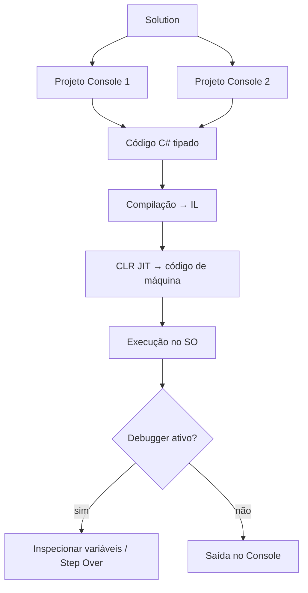

## Visão Geral do Conceito

Esta aula é uma **ponte**: o professor Luiz Paulo Maia (LP) assume a disciplina no lugar do professor Rafael Cruz e faz uma **revisão condensada** do que o plano de ensino (e o TP1) exigem até este ponto — tipagem, console, operadores, debugger e strings — antes de avançar para matéria nova (na aula seguinte: data/hora).

O problema que a revisão resolve é o de **lacunas de sincronização**: a turma pode ter visto partes do conteúdo com ritmos e ferramentas diferentes (por exemplo, VS Code versus Visual Studio). Sem um modelo mental único de *plataforma → solução → programa tipado → operadores → strings*, o TP1 vira tentativa e erro.

> **Escopo desta lição:** consolidar fundamentos de console C# / .NET. Estruturas de decisão (`if` / `else`) foram citadas como próximo horizonte, mas **não foram o conteúdo central desta aula**. ASP.NET Core, Razor Pages e Entity Framework foram apenas situados como temas do **próximo trimestre**.

## Modelo Mental

Pense no ecossistema em quatro camadas empilhadas:

1. **Plataforma (.NET)** — runtime (<mark style="background-color: #242424; padding: 2px 4px; border-radius: 3px; color: inherit;">`CLR`</mark>), bibliotecas (<mark style="background-color: #242424; padding: 2px 4px; border-radius: 3px; color: inherit;">`FCL`</mark> / BCL) e ferramentas (<mark style="background-color: #242424; padding: 2px 4px; border-radius: 3px; color: inherit;">`dotnet`</mark> CLI, SDK).
2. **Organização do código** — uma <mark style="background-color: #242424; padding: 2px 4px; border-radius: 3px; color: inherit;">`Solution`</mark> contém um ou mais <mark style="background-color: #242424; padding: 2px 4px; border-radius: 3px; color: inherit;">`Project`</mark>s (cada exercício do TP1 pode ser um projeto).
3. **Programa console tipado** — você declara o tipo, lê `string` do teclado, converte, calcula com operadores e escreve o resultado.
4. **Observabilidade** — o <mark style="background-color: #242424; padding: 2px 4px; border-radius: 3px; color: inherit;">`debugger`</mark> com <mark style="background-color: #242424; padding: 2px 4px; border-radius: 3px; color: inherit;">`breakpoint`</mark> mostra o valor real das variáveis passo a passo (essencial para pré/pós-incremento e bugs de lógica).

Analogia útil usada na aula: **C# é o idioma; .NET é o país com a infraestrutura**. O mesmo “país” (.NET) pode hospedar outras linguagens; neste curso o idioma é C#.



## Mecânica Central

### 1. C# e .NET: compilação + runtime

C# e Java, no modelo apresentado em aula, são **compiladas e interpretadas/jitted**: o fonte vira linguagem intermediária (IL no .NET; bytecode no Java). O <mark style="background-color: #242424; padding: 2px 4px; border-radius: 3px; color: inherit;">`CLR`</mark> (Common Language Runtime) corresponde, conceitualmente, à JVM: carrega o IL e gera código de máquina.

Componentes citados para o ecossistema (visão de mapa, não implementação neste trimestre):

| Peça | Papel |
|------|--------|
| <mark style="background-color: #242424; padding: 2px 4px; border-radius: 3px; color: inherit;">`ASP.NET Core`</mark> | APIs, web, microserviços |
| Razor Pages | UI server-side (próximo trimestre) |
| <mark style="background-color: #242424; padding: 2px 4px; border-radius: 3px; color: inherit;">`Entity Framework Core`</mark> | ORM (próximo trimestre) |
| Console App | foco **deste** trimestre |

Do material de ambiente: para desenvolver, instale o **SDK** (inclui o runtime). Valide com <mark style="background-color: #242424; padding: 2px 4px; border-radius: 3px; color: inherit;">`dotnet --version`</mark> e <mark style="background-color: #242424; padding: 2px 4px; border-radius: 3px; color: inherit;">`dotnet --list-sdks`</mark>.

### 2. IDEs e o TP1

Comparação prática da aula:

- **Visual Studio** (Community) — preferência do professor; debugger integrado e forte no ecossistema corporativo .NET.
- **VS Code** — leve; viável em Linux com C# Dev Kit / extensões (o professor anterior usava VS Code).
- **Rider** — alternativa JetBrains multiplataforma.

> **Regra operacional para Linux/macOS no TP1:** se o enunciado pedir Visual Studio e você estiver em Linux, documente a escolha (VS Code ou Rider) ou use VM Windows. O professor indicou que o monitor pode aceitar Rider/VS Code com observação explícita.

### 3. Solution versus Projeto

- **Projeto** — unidade compilável (ex.: um Console App com `Program.cs`).
- **Solution** (`.sln`) — contêiner de um ou mais projetos.

Uso didático forte: no TP1, crie **uma Solution** e um **projeto por questão**. Mais adiante, o mesmo padrão escala para camadas (Web, domínio, dados).

### 4. Tipagem estática e tipos primitivos

C# é **fortemente tipada**: o tipo da variável é declarado e **não muda** em tempo de execução. Atribuir um `double` a um `int` sem conversão explícita **falha em compilação** — ao contrário de Python, onde a mesma variável pode receber `int`, depois `str`.

Tipos citados (lista parcial da aula): <mark style="background-color: #242424; padding: 2px 4px; border-radius: 3px; color: inherit;">`byte`</mark>, <mark style="background-color: #242424; padding: 2px 4px; border-radius: 3px; color: inherit;">`sbyte`</mark>, <mark style="background-color: #242424; padding: 2px 4px; border-radius: 3px; color: inherit;">`short`</mark>, <mark style="background-color: #242424; padding: 2px 4px; border-radius: 3px; color: inherit;">`int`</mark>, <mark style="background-color: #242424; padding: 2px 4px; border-radius: 3px; color: inherit;">`long`</mark>, <mark style="background-color: #242424; padding: 2px 4px; border-radius: 3px; color: inherit;">`float`</mark>, <mark style="background-color: #242424; padding: 2px 4px; border-radius: 3px; color: inherit;">`double`</mark>, <mark style="background-color: #242424; padding: 2px 4px; border-radius: 3px; color: inherit;">`decimal`</mark>, <mark style="background-color: #242424; padding: 2px 4px; border-radius: 3px; color: inherit;">`char`</mark>, <mark style="background-color: #242424; padding: 2px 4px; border-radius: 3px; color: inherit;">`string`</mark>, <mark style="background-color: #242424; padding: 2px 4px; border-radius: 3px; color: inherit;">`bool`</mark>, <mark style="background-color: #242424; padding: 2px 4px; border-radius: 3px; color: inherit;">`DateTime`</mark>.

### 5. Entrada e saída no console

Três operações centrais:

| API | Função |
|-----|--------|
| <mark style="background-color: #242424; padding: 2px 4px; border-radius: 3px; color: inherit;">`Console.WriteLine`</mark> | escreve e quebra linha |
| <mark style="background-color: #242424; padding: 2px 4px; border-radius: 3px; color: inherit;">`Console.Write`</mark> | escreve sem quebra (útil em prompts) |
| <mark style="background-color: #242424; padding: 2px 4px; border-radius: 3px; color: inherit;">`Console.ReadLine`</mark> | lê **sempre** `string` |

Conversão numérica na aula: <mark style="background-color: #242424; padding: 2px 4px; border-radius: 3px; color: inherit;">`int.Parse`</mark> / <mark style="background-color: #242424; padding: 2px 4px; border-radius: 3px; color: inherit;">`double.Parse`</mark> (e, no gabarito da lista, <mark style="background-color: #242424; padding: 2px 4px; border-radius: 3px; color: inherit;">`Convert.ToInt32`</mark> / <mark style="background-color: #242424; padding: 2px 4px; border-radius: 3px; color: inherit;">`Convert.ToDouble`</mark>).

### 6. Operadores

**Aritméticos:** `+`, `-`, `*`, `/`, `%` (resto — significado claro para inteiros).

**Unários `++` / `--` (herança de C):**

- <mark style="background-color: #242424; padding: 2px 4px; border-radius: 3px; color: inherit;">`++op`</mark> — pré: incrementa, depois usa o valor.
- <mark style="background-color: #242424; padding: 2px 4px; border-radius: 3px; color: inherit;">`op++`</mark> — pós: usa o valor, depois incrementa.

**Atribuição composta:** <mark style="background-color: #242424; padding: 2px 4px; border-radius: 3px; color: inherit;">`+=`</mark>, <mark style="background-color: #242424; padding: 2px 4px; border-radius: 3px; color: inherit;">`-=`</mark>, <mark style="background-color: #242424; padding: 2px 4px; border-radius: 3px; color: inherit;">`*=`</mark>, <mark style="background-color: #242424; padding: 2px 4px; border-radius: 3px; color: inherit;">`/=`</mark> — abreviações de `a = a + b`, etc.

**Relacionais:** <mark style="background-color: #242424; padding: 2px 4px; border-radius: 3px; color: inherit;">`==`</mark>, <mark style="background-color: #242424; padding: 2px 4px; border-radius: 3px; color: inherit;">`!=`</mark>, `<`, `>`, `<=`, `>=`.  
Importante: igualdade é `==` (não `=`, que é atribuição). Em C#, “diferente” é <mark style="background-color: #242424; padding: 2px 4px; border-radius: 3px; color: inherit;">`!=`</mark> (`!` = NOT); a aula demonstrou que a sintaxe `<>` **não** é aceita.

**Lógicos e tabela-verdade:**

- <mark style="background-color: #242424; padding: 2px 4px; border-radius: 3px; color: inherit;">`&&`</mark> (AND) — falso se qualquer operando for falso.
- <mark style="background-color: #242424; padding: 2px 4px; border-radius: 3px; color: inherit;">`||`</mark> (OR) — falso só se ambos forem falsos.
- <mark style="background-color: #242424; padding: 2px 4px; border-radius: 3px; color: inherit;">`!`</mark> (NOT) — inverte o booleano.

**Precedência:** `*` e `/` têm precedência sobre `+` e `-`. A recomendação de engenharia da aula (alinhada a Clean Code): **use parênteses** e quebre expressões longas em variáveis intermediárias com nomes claros.

```mermaid
flowchart TD
    A["Expressão: op1 + op2 / 2"] --> B{Parênteses?}
    B -->|não| C["Primeiro: op2 / 2"]
    C --> D["Depois: op1 + resultado"]
    B -->|sim: (op1 + op2) / 2| E["Primeiro: op1 + op2"]
    E --> F["Depois: soma / 2"]
```

### 7. Debugger

O debugger do Visual Studio permite execução passo a passo:

- Executar **sem** debugger vs **com** debugger (mais CPU/memória).
- <mark style="background-color: #242424; padding: 2px 4px; border-radius: 3px; color: inherit;">`breakpoint`</mark> — pausa na linha.
- **Step Over** — próxima instrução; inspecione Locals (`op1`, `op2`, …).
- **Step Into / Step Out** — entrar/sair de métodos (paralelo a “entrar numa função” em Python).

Há menção de questão de debugger no TP1: treine inspecionar valores, não só “rodar até o fim”.

### 8. Strings: métodos e imutabilidade

Antes de reinventar funções, use a biblioteca. A aula demonstrou:

| Operação | Ideia |
|----------|--------|
| tamanho | <mark style="background-color: #242424; padding: 2px 4px; border-radius: 3px; color: inherit;">`Length`</mark> |
| posição / caractere | indexação |
| minúsculas / maiúsculas | <mark style="background-color: #242424; padding: 2px 4px; border-radius: 3px; color: inherit;">`ToLower`</mark> / <mark style="background-color: #242424; padding: 2px 4px; border-radius: 3px; color: inherit;">`ToUpper`</mark> |
| aparar espaços | <mark style="background-color: #242424; padding: 2px 4px; border-radius: 3px; color: inherit;">`Trim`</mark> |
| igualdade | comparação de conteúdo |
| substring / busca | localizar trecho |
| substituição | <mark style="background-color: #242424; padding: 2px 4px; border-radius: 3px; color: inherit;">`Replace`</mark> |

> **Regra:** <mark style="background-color: #242424; padding: 2px 4px; border-radius: 3px; color: inherit;">`string`</mark> em C# é **imutável** (como em Java e Python): “alterar” produz uma **nova** string.

### 9. Clean Code (orientação profissional)

O professor recomenda *Clean Code* (Robert C. Martin / Uncle Bob):

- Código é escrito **para outros** (e para o futuro você).
- Expressões pequenas e nomes claros batem comentários densos.
- Comentário só quando o “porquê” não cabe no nome; código autoexplicativo é o alvo.
- Premissa cautelosa: “está funcionando? não mexa às cegas” — alterar código sem modelo mental é risco alto.

## Uso Prático

### Exemplo 1 — Console tipado (padrão da lista / gabarito)

Cenário ADS: cadastrar dados de um colaborador para um relatório interno.

```csharp
Console.Write("Digite seu nome: ");
string nome = Console.ReadLine() ?? "";

Console.Write("Digite sua idade: ");
int idade = Convert.ToInt32(Console.ReadLine());

Console.Write("Digite sua cidade: ");
string cidade = Console.ReadLine() ?? "";

Console.WriteLine("\nDados informados:");
Console.WriteLine($"Nome: {nome}");
Console.WriteLine($"Idade: {idade} anos");
Console.WriteLine($"Cidade: {cidade}");
```

### Exemplo 2 — Pré vs pós-incremento (o que o debugger revela)

```csharp
int op2 = 10;
int op1;

// Pré-incremento: soma primeiro, depois atribui
op1 = ++op2; // op1 == 11, op2 == 11
Console.WriteLine($"{op1} {op2}");

op2 = 10;
// Pós-incremento: atribui primeiro, depois soma
op1 = op2++; // op1 == 10, op2 == 11
Console.WriteLine($"{op1} {op2}");
```

Coloque breakpoint nas atribuições e use Step Over: os valores em Locals devem bater com a tabela mental acima.

### Exemplo 3 — Atribuição composta e aritmética de métrica

Cenário: acumular litros e km de um log de frota (eco da lista: consumo).

```csharp
double km = 0;
double litros = 0;

km += 120.5;      // km = km + 120.5
litros += 9.2;

double consumo = km / litros; // km/l
Console.WriteLine($"Consumo: {consumo:F2} km/l");
```

### Exemplo 4 — Relacionais, lógicos e precedência explícita

Cenário: regra simples de elegibilidade de desconto em pedido (ainda sem `if` — só avaliando booleanos).

```csharp
decimal valorPedido = 180m;
int itens = 4;
bool clienteVip = true;

bool pedidoAlto = valorPedido >= 150m;
bool volumeOk = itens >= 3;

// AND / OR / NOT — parênteses deixam a intenção óbvia
bool elegivel = (pedidoAlto && volumeOk) || clienteVip;
bool bloqueado = !elegivel;

Console.WriteLine($"Elegível: {elegivel}; Bloqueado: {bloqueado}");

// Precedência: deixe explícito o que quer calcular
double n1 = 8, n2 = 6;
double mediaErrada = n1 + n2 / 2;       // 8 + 3 = 11
double mediaCorreta = (n1 + n2) / 2;    // 7
```

### Exemplo 5 — Manipulação de string de ticket/log

```csharp
string bruto = "  PED-2026-0042  ";
string codigo = bruto.Trim().ToUpper();

Console.WriteLine(codigo.Length);
Console.WriteLine(codigo.Contains("2026"));
Console.WriteLine(codigo.Replace("PED", "ORD"));

// Imutabilidade: Trim/ToUpper não alteram 'bruto'
Console.WriteLine($"Original ainda: '{bruto}'");
```

### Organização sugerida do TP1

```text
Tp1.sln
├── Questao01_Apresentacao/   (Console App)
├── Questao02_Antecessor/
├── ...
└── QuestaoN_Debugger/
```

No Visual Studio, selecione o projeto de inicialização antes de executar.

## Erros Comuns

1. **Usar o resultado de `ReadLine` como número**  
   **Sintoma:** erro de compilação ao somar/multiplicar, ou concatenação estranha se misturar conceitos de outras linguagens.  
   **Correção:** `int.Parse(...)`, `double.Parse(...)` ou `Convert.ToInt32` / `ToDouble`, tratando entrada inválida quando o enunciado exigir.

2. **Confundir `=` com `==`**  
   **Sintoma:** atribuição onde se esperava comparação; em contextos booleanos, o compilador C# costuma barrar usos inválidos — ainda assim a intenção fica errada.  
   **Correção:** comparação com `==`; “diferente” com `!=` (não `<>`).

3. **Assumir que `++x` e `x++` são iguais em qualquer expressão**  
   **Sintoma:** valores “um a menos/mais” do que o esperado em atribuições encadeadas.  
   **Correção:** depurar com breakpoint; se a nuance atrapalhar a leitura, prefira `x = x + 1` em linha separada (Clean Code).

4. **Abrir Solution a partir do ZIP sem extrair**  
   **Sintoma:** Visual Studio não encontra projetos (ocorrência demonstrada na aula).  
   **Correção:** extrair o ZIP e abrir o `.sln` da pasta descompactada.

5. **Mutar string “in-place” mentalmente**  
   **Sintoma:** achar que `s.ToUpper()` alterou `s` sem reatribuir.  
   **Correção:** `s = s.ToUpper();` — métodos retornam nova instância.

6. **Precedência sem parênteses em média/fórmulas**  
   **Sintoma:** `(a + b) / 2` virando `a + b / 2`.  
   **Correção:** parênteses + variáveis intermediárias nomeadas (`soma`, `media`).

## Visão Geral de Debugging

Quando o resultado do console “não fecha”:

1. **Compile primeiro** — erros de tipo (`string` vs `int`) aparecem cedo em C#.
2. **Coloque breakpoint** na linha da conversão e na da fórmula.
3. **Step Over** e leia Locals: o valor lido é o que você imagina? A conversão produziu o número certo?
4. Para pré/pós-incremento, observe o valor **antes** e **depois** da linha da atribuição.
5. Se o bug for de lógica em expressão composta, **extraia** pedaços (`bool pedidoAlto = ...`) e inspecione cada booleano.
6. Lembre: debugger consome mais recursos; use-o para hipóteses, não como único modo de execução.

<details>
<summary>Checklist rápido alinhado ao TP1</summary>

- [ ] SDK responde a `dotnet --version`
- [ ] Solution abre com todos os projetos visíveis
- [ ] Projeto correto marcado como startup
- [ ] Toda entrada numérica passa por Parse/Convert
- [ ] Pelo menos um fluxo foi validado com breakpoint
- [ ] Strings relevantes usam `Trim` / comparação consciente de maiúsculas

</details>

## Principais Pontos

- C# é a linguagem; .NET (CLR + bibliotecas + SDK) é a plataforma de execução e build.
- Solution agrupa projetos — padrão ideal para lista/TP1 e, depois, camadas.
- Tipagem estática pega erros na compilação; `ReadLine` sempre devolve `string`.
- `++`/`--` pré e pós diferem na ordem soma × uso; debugger torna isso visível.
- `+=` e família são açúcar sintático de atribuição aritmética.
- Relacionais usam `==` / `!=`; lógicos usam `&&`, `||`, `!` com tabela-verdade.
- Precedência favorece `*` `/`; parênteses e expressões curtas evitam bug e melhoram manutenção.
- `string` é imutável; prefira APIs da BCL (`Length`, `Trim`, `ToUpper`, `Replace`, …).
- Clean Code: código para humanos; comentário não substitui nome claro.
- Decisão (`if`) e web/ORM ficam para aulas / trimestre seguintes — não invente escopo.

## Preparação para Prática

Ao terminar esta lição, você deve conseguir:

1. Explicar com suas palavras o caminho fonte → IL → CLR.
2. Montar uma Solution com dois Console Apps e alternar qual executa.
3. Escrever um programa que lê strings, converte números e calcula métricas (média, desconto, km/l).
4. Prever o resultado de pré e pós-incremento e confirmar no debugger.
5. Avaliar expressões com `&&` / `||` / `!` e forçar ordem com parênteses.
6. Normalizar e transformar strings de identificadores/logs sem reinventar utilitários.

O laboratório abaixo treina a **lógica** desses fundamentos. O editor integrado do ISS usa JavaScript; os comentários mapeiam cada passo ao equivalente em C# que você deve praticar no Visual Studio / `dotnet`.

## Laboratório de Prática

### Easy — Normalizar código de pedido (strings)

**Contexto:** um webhook entrega códigos com espaços e maiúsculas inconsistentes (`"  ped-1001  "`). No C# real você usaria `Trim` + `ToUpper`. Aqui, complete a função equivalente.

```javascript
function normalizarCodigoPedido(bruto) {
  // TODO: remover espaços das pontas e converter para MAIÚSCULAS
  // Equivalente C#: bruto.Trim().ToUpper()
  return bruto;
}

// Smoke test (deve rodar sem erro mesmo incompleto)
console.log(normalizarCodigoPedido("  ped-1001  "));
```

### Medium — Consumo de combustível com conversão tipada

**Contexto:** log de telemetria chega como texto (como `ReadLine`). Calcule km/l e aplique acumuladores estilo `+=`.

```javascript
function calcularConsumoKmPorLitro(distanciaTexto, litrosTexto) {
  // TODO: converter strings para número (parseFloat)
  // TODO: validar litros > 0; se inválido, retornar null
  // TODO: retornar distancia / litros com 2 casas (Number.toFixed → Number)
  // Equivalente C#: double.Parse + divisão; formatação {valor:F2}
  return 0;
}

function acumularTrecho(totalKm, totalLitros, trechoKm, trechoLitros) {
  // TODO: devolver objeto { km, litros } usando acumulação (+= mental)
  return { km: totalKm, litros: totalLitros };
}

console.log(calcularConsumoKmPorLitro("240", "16"));
console.log(acumularTrecho(0, 0, 120.5, 9.2));
```

### Hard — Elegibilidade + simulação de pré/pós-incremento

**Contexto:** motor de regra de cupom + contador de tentativas. Pratique booleanos compostos e a semântica de incremento que o debugger mostrou na aula.

```javascript
function avaliarElegibilidade(valorPedido, itens, clienteVip) {
  // TODO: pedidoAlto = valorPedido >= 150
  // TODO: volumeOk = itens >= 3
  // TODO: return (pedidoAlto && volumeOk) || clienteVip
  return false;
}

function simularIncrementos(valorInicial) {
  // TODO: simular pré e pós como na aula C#
  // Seja explícito: não use só ++ se ficar ambíguo — mostre a ordem
  // Retorne:
  // {
  //   pre:  { op1, op2 }, // op1 = ++op2 a partir de valorInicial
  //   post: { op1, op2 }  // op1 = op2++ a partir de valorInicial de novo
  // }
  return {
    pre: { op1: valorInicial, op2: valorInicial },
    post: { op1: valorInicial, op2: valorInicial }
  };
}

console.log(avaliarElegibilidade(180, 4, false));
console.log(simularIncrementos(10));
```

<!-- lessons.json (NÃO editado por este worker — integração serial do orquestrador)
discipline: fundamentos-csharp
slug: revisao-fundamentos-csharp-transicao
title: Revisão de fundamentos C# (transição de professor)
order: 5
file: fundamentos-csharp/aula-05-revisao-fundamentos-csharp-transicao.md
-->

<!-- CONCEPT_EXTRACTION
concepts:
  - plataforma .NET
  - CLR e IL
  - Solution vs Projeto
  - tipagem estática em C#
  - Console.WriteLine / Write / ReadLine
  - Parse e Convert
  - operadores aritméticos
  - pré-incremento e pós-incremento
  - operadores de atribuição composta
  - operadores relacionais
  - operadores lógicos e tabela-verdade
  - precedência de operadores
  - debugger e breakpoint
  - string imutável e métodos BCL
  - Clean Code (expressões claras)
skills:
  - Distinguir linguagem C# da plataforma .NET
  - Organizar exercícios em Solution com múltiplos projetos
  - Converter entrada de console string para tipos numéricos
  - Aplicar ++/-- pré e pós e validar no debugger
  - Compor condições com && || ! e == !=
  - Forçar ordem de cálculo com parênteses
  - Normalizar e transformar strings com Trim/ToUpper/Replace
  - Preferir expressões pequenas estilo Clean Code
examples:
  - console-cadastro-convert
  - pre-pos-incremento-debugger
  - consumo-frota-atribuicao-composta
  - elegibilidade-logicos-parenteses
  - ticket-string-imutavel
-->

<!-- EXERCISES_JSON
[
  {
    "id": "revisao-csharp-normalizar-codigo-pedido",
    "slug": "revisao-csharp-normalizar-codigo-pedido",
    "difficulty": "easy",
    "title": "Normalizar código de pedido (strings)",
    "discipline": "fundamentos-csharp",
    "editorLanguage": "javascript",
    "tags": ["csharp", "strings", "trim", "toupper", "revisao"],
    "summary": "Implementar Trim+ToUpper equivalente para normalizar códigos de pedido vindos de webhook."
  },
  {
    "id": "revisao-csharp-consumo-combustivel-parse",
    "slug": "revisao-csharp-consumo-combustivel-parse",
    "difficulty": "medium",
    "title": "Consumo de combustível com conversão tipada",
    "discipline": "fundamentos-csharp",
    "editorLanguage": "javascript",
    "tags": ["csharp", "parse", "operadores", "atribuicao", "console"],
    "summary": "Converter strings numéricas, calcular km/l e acumular trechos no estilo += do C#."
  },
  {
    "id": "revisao-csharp-elegibilidade-incrementos",
    "slug": "revisao-csharp-elegibilidade-incrementos",
    "difficulty": "hard",
    "title": "Elegibilidade e simulação de pré/pós-incremento",
    "discipline": "fundamentos-csharp",
    "editorLanguage": "javascript",
    "tags": ["csharp", "operadores-logicos", "incremento", "debugger", "tp1"],
    "summary": "Compor regra booleana com &&/|| e simular semanticamente pré e pós-incremento da aula."
  }
]
-->
