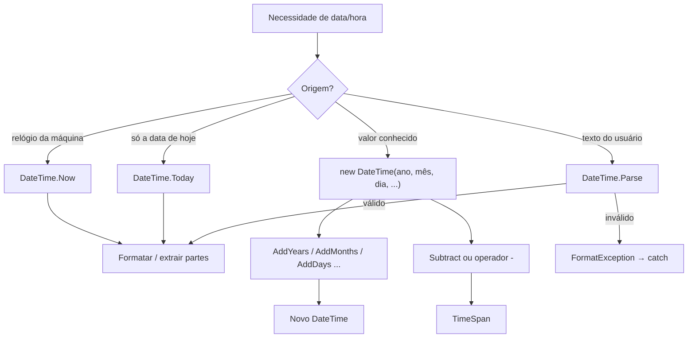
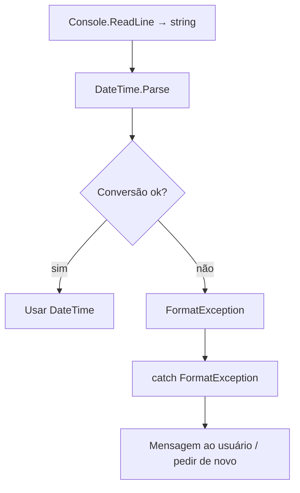

## Visão Geral do Conceito

Sistemas de backend lidam o tempo todo com prazos, logs, aniversários, SLAs e validade de tokens. Em C#, o tipo central para isso é <mark style="background-color: #242424; padding: 2px 4px; border-radius: 3px; color: inherit;">`DateTime`</mark>: um valor que combina **data e hora** e oferece métodos prontos para formatar, somar, subtrair e comparar.

Nesta lição você reconstrói o que foi praticado na aula: ler o “agora”, formatar para o padrão brasileiro, criar datas específicas, avançar no calendário, calcular intervalos com <mark style="background-color: #242424; padding: 2px 4px; border-radius: 3px; color: inherit;">`TimeSpan`</mark> e converter texto do console com <mark style="background-color: #242424; padding: 2px 4px; border-radius: 3px; color: inherit;">`DateTime.Parse`</mark>, tratando <mark style="background-color: #242424; padding: 2px 4px; border-radius: 3px; color: inherit;">`FormatException`</mark>.

> **Problema que resolve:** sem um tipo de data/hora confiável, o programador precisa reinventar calendário, bissextos e aritmética de dias — trabalho frágil e caro. <mark style="background-color: #242424; padding: 2px 4px; border-radius: 3px; color: inherit;">`DateTime`</mark> entrega essa biblioteca já pronta no .NET.

## Modelo Mental

Pense em <mark style="background-color: #242424; padding: 2px 4px; border-radius: 3px; color: inherit;">`DateTime`</mark> como um **carimbo completo** no calendário: ano, mês, dia, hora, minuto e segundo. Esse carimbo:

- pode ser o **agora** da máquina (<mark style="background-color: #242424; padding: 2px 4px; border-radius: 3px; color: inherit;">`DateTime.Now`</mark>);
- pode ser **só a data**, com hora zerada (<mark style="background-color: #242424; padding: 2px 4px; border-radius: 3px; color: inherit;">`DateTime.Today`</mark>);
- pode ser **construído** com valores explícitos (aniversário, prazo de entrega, abertura de ticket).

Operações como “somar 1 ano + 1 mês + 1 dia” **não alteram** o carimbo original: produzem um **novo** <mark style="background-color: #242424; padding: 2px 4px; border-radius: 3px; color: inherit;">`DateTime`</mark>. A diferença entre dois carimbos vira um <mark style="background-color: #242424; padding: 2px 4px; border-radius: 3px; color: inherit;">`TimeSpan`</mark> — um intervalo (dias, horas, minutos), não uma data.



## Mecânica Central

### `DateTime.Now` e `DateTime.Today`

```csharp
DateTime agora = DateTime.Now;
Console.WriteLine("Data agora: " + agora);

DateTime hoje = DateTime.Today;
Console.WriteLine("Data de hoje: " + hoje);
```

| Membro | O que retorna | Hora |
|--------|---------------|------|
| <mark style="background-color: #242424; padding: 2px 4px; border-radius: 3px; color: inherit;">`DateTime.Now`</mark> | instante atual da máquina | preenchida |
| <mark style="background-color: #242424; padding: 2px 4px; border-radius: 3px; color: inherit;">`DateTime.Today`</mark> | data corrente | `00:00:00` |

> **Fuso horário:** <mark style="background-color: #242424; padding: 2px 4px; border-radius: 3px; color: inherit;">`Now`</mark> usa o fuso configurado no sistema. Se a máquina estiver em outro timezone (ex.: Nova York), o horário impresso diverge do Brasil. Ajuste o SO ou trate timezone no código (customização avançada — não aprofundada na aula).

### Concatenação com `+` e sobrecarga de operador

Em `"Data agora: " + agora`, o `+` **não soma números**: converte o <mark style="background-color: #242424; padding: 2px 4px; border-radius: 3px; color: inherit;">`DateTime`</mark> em string e concatena. Isso é **sobrecarga de operador** (polimorfismo estático) — o mesmo símbolo `+` tem comportamentos diferentes conforme os tipos. O tema de polimorfismo volta em aulas futuras.

### Formatação: `ToString` e interpolação

```csharp
DateTime hoje = DateTime.Today;
Console.WriteLine(hoje.ToString("dd/MM/yyyy"));

DateTime agora = DateTime.Now;
Console.WriteLine(agora.ToString("HH:mm:ss"));
```

Regras críticas dos especificadores:

| Spec | Significado | Erro comum |
|------|-------------|------------|
| <mark style="background-color: #242424; padding: 2px 4px; border-radius: 3px; color: inherit;">`dd`</mark> | dia | — |
| <mark style="background-color: #242424; padding: 2px 4px; border-radius: 3px; color: inherit;">`MM`</mark> | **mês** | usar `mm` (minutos) |
| <mark style="background-color: #242424; padding: 2px 4px; border-radius: 3px; color: inherit;">`yyyy`</mark> | ano | — |
| <mark style="background-color: #242424; padding: 2px 4px; border-radius: 3px; color: inherit;">`HH`</mark> | hora 0–23 | — |
| <mark style="background-color: #242424; padding: 2px 4px; border-radius: 3px; color: inherit;">`h`</mark> | hora 1–12 (estilo 12h) | esperar AM/PM se a cultura for pt-BR |
| <mark style="background-color: #242424; padding: 2px 4px; border-radius: 3px; color: inherit;">`mm`</mark> | **minutos** | confundir com mês |
| <mark style="background-color: #242424; padding: 2px 4px; border-radius: 3px; color: inherit;">`ss`</mark> | segundos | — |

Interpolação (forma mais legível):

```csharp
DateTime fim = new DateTime(2027, 9, 5);
Console.WriteLine($"Fim: {fim:dd/MM/yyyy}");
```

### Propriedades de componentes

```csharp
DateTime agora = DateTime.Now;

Console.WriteLine(agora.Day);        // dia do mês
Console.WriteLine(agora.Month);      // mês
Console.WriteLine(agora.Year);       // ano
Console.WriteLine(agora.Hour);       // hora
Console.WriteLine(agora.Minute);     // minutos
Console.WriteLine(agora.Second);     // segundos
Console.WriteLine(agora.DayOfWeek);  // ex.: Tuesday
Console.WriteLine(agora.DayOfYear);  // dia do ano (1–365/366)
```

> **`Console.WriteLine`:** já inclui quebra de linha. Colocar <mark style="background-color: #242424; padding: 2px 4px; border-radius: 3px; color: inherit;">`\n`</mark> manualmente no mesmo texto pode pular **duas** linhas.

### Construtor e camelCase

```csharp
// ano, mês, dia, hora, minuto, segundo
DateTime dataHora = new DateTime(2026, 8, 4, 20, 54, 40);
```

Variáveis com duas palavras seguem **camelCase** (padrão C#/Java): `dataHora`, não `datahora` nem `DataHora` (PascalCase fica para tipos e métodos públicos).

### Adicionar intervalos e method chaining

Os métodos <mark style="background-color: #242424; padding: 2px 4px; border-radius: 3px; color: inherit;">`AddYears`</mark>, <mark style="background-color: #242424; padding: 2px 4px; border-radius: 3px; color: inherit;">`AddMonths`</mark>, <mark style="background-color: #242424; padding: 2px 4px; border-radius: 3px; color: inherit;">`AddDays`</mark>, <mark style="background-color: #242424; padding: 2px 4px; border-radius: 3px; color: inherit;">`AddHours`</mark>, <mark style="background-color: #242424; padding: 2px 4px; border-radius: 3px; color: inherit;">`AddMinutes`</mark> e <mark style="background-color: #242424; padding: 2px 4px; border-radius: 3px; color: inherit;">`AddSeconds`</mark> devolvem um **novo** valor. O original permanece intacto.

```csharp
DateTime dataHora = new DateTime(2026, 8, 4, 20, 54, 40);

DateTime novaData = dataHora
    .AddYears(1)
    .AddMonths(1)
    .AddDays(1);
// Resultado da aula: 05/09/2027, mesma hora

DateTime novaHora = dataHora
    .AddHours(1)
    .AddMinutes(1)
    .AddSeconds(1);
// 21:55:41 a partir de 20:54:40
```

Encadear vários `Add*` na mesma expressão é **method chaining** (corrente de chamadas).

### `TimeSpan`: diferença entre datas

```csharp
DateTime inicio = new DateTime(2026, 8, 4);
DateTime fim = new DateTime(2027, 9, 5);

TimeSpan intervalo = fim.Subtract(inicio);
// equivalente:
// TimeSpan intervalo = fim - inicio;

Console.WriteLine(intervalo);       // inclui componente de tempo
Console.WriteLine(intervalo.Days);  // só os dias inteiros (ex.: 397)
```

Caso típico do TP: “quantos dias faltam para o próximo aniversário?” — criar a data do próximo aniversário, subtrair <mark style="background-color: #242424; padding: 2px 4px; border-radius: 3px; color: inherit;">`DateTime.Today`</mark> e ler <mark style="background-color: #242424; padding: 2px 4px; border-radius: 3px; color: inherit;">`Days`</mark>.

### Comparações relacionais

```csharp
DateTime inicio = new DateTime(2026, 8, 4);
DateTime fim = new DateTime(2027, 9, 5);

Console.WriteLine(inicio > fim);   // False
Console.WriteLine(inicio == fim);  // False (usar ==, não =)
Console.WriteLine(inicio < fim);   // True
```

### `Parse`, datas inválidas e `try`/`catch`

Tudo que vem de <mark style="background-color: #242424; padding: 2px 4px; border-radius: 3px; color: inherit;">`Console.ReadLine`</mark> é <mark style="background-color: #242424; padding: 2px 4px; border-radius: 3px; color: inherit;">`string`</mark>. Para virar data:

```csharp
Console.Write("Entre com uma data: ");
string texto = Console.ReadLine();

try
{
    DateTime data = DateTime.Parse(texto);
    Console.WriteLine(data);
}
catch (FormatException ex)
{
    Console.WriteLine("Erro: data inválida.");
    Console.WriteLine(ex.Message);
}
```

Falhas comuns cobertas na aula:

1. **Formato inválido** (texto que não representa data) → <mark style="background-color: #242424; padding: 2px 4px; border-radius: 3px; color: inherit;">`FormatException`</mark>.
2. **Data impossível** (ex.: `32/01/2026`, ou `29/02/2026` em ano não bissexto) → também quebra o parse.



> **Regra de código limpo (aula):** prefira capturar a exceção **mais específica** (<mark style="background-color: #242424; padding: 2px 4px; border-radius: 3px; color: inherit;">`FormatException`</mark>) em vez de um `catch (Exception)` genérico cobrindo centenas de linhas. <mark style="background-color: #242424; padding: 2px 4px; border-radius: 3px; color: inherit;">`FormatException`</mark> herda de <mark style="background-color: #242424; padding: 2px 4px; border-radius: 3px; color: inherit;">`Exception`</mark>; um `catch` genérico também pega o erro, mas obscurece a intenção.

Quando o erro ocorre no `try`, **nada depois da linha que falhou** nesse bloco é executado — o fluxo vai direto ao `catch`.

## Uso Prático

### Projeto 1 — carimbo atual e partes da data (log de auditoria)

Cenário ADS: registrar em log a data/hora de um evento e extrair componentes para um relatório diário.

```csharp
DateTime agora = DateTime.Now;
DateTime hoje = DateTime.Today;

Console.WriteLine("Evento em: " + agora);
Console.WriteLine($"Data BR: {hoje:dd/MM/yyyy}");
Console.WriteLine($"Hora 24h: {agora:HH:mm:ss}");

Console.WriteLine($"Dia={agora.Day} Mês={agora.Month} Ano={agora.Year}");
Console.WriteLine($"Semana={agora.DayOfWeek} DiaDoAno={agora.DayOfYear}");
```

### Projeto 2 — prazo futuro com chaining (SLA de ticket)

```csharp
DateTime abertura = new DateTime(2026, 8, 4, 20, 54, 40);

DateTime prazo = abertura
    .AddDays(2)
    .AddHours(4);

Console.WriteLine($"Abertura: {abertura:dd/MM/yyyy HH:mm}");
Console.WriteLine($"Prazo SLA: {prazo:dd/MM/yyyy HH:mm}");
// abertura permanece 04/08/2026 20:54:40
```

### Projeto 3 — dias até um marco (aniversário / entrega)

```csharp
DateTime hoje = DateTime.Today;
DateTime marco = new DateTime(2027, 9, 5);

TimeSpan faltam = marco - hoje;
Console.WriteLine($"Faltam {faltam.Days} dias até o marco.");
Console.WriteLine(hoje < marco); // True se o marco ainda não chegou
```

### Projeto 4 — entrada segura de data no console

```csharp
Console.Write("Data do pedido (ex.: 04/08/2026): ");
string entrada = Console.ReadLine();

try
{
    DateTime pedido = DateTime.Parse(entrada);
    DateTime envio = pedido.AddDays(3);
    Console.WriteLine($"Pedido: {pedido:dd/MM/yyyy}");
    Console.WriteLine($"Envio estimado: {envio:dd/MM/yyyy}");
}
catch (FormatException)
{
    Console.WriteLine("Data inválida. Use um formato reconhecido pela cultura do sistema.");
}
```

Organização sugerida na aula: uma **solution** `DataHora` com vários projetos console (`DataHora1` … `DataHora4`), cada um focando um pedaço (agora/hoje, Add*, TimeSpan, Parse). Defina o **Startup Project** correto antes de executar.

## Erros Comuns

1. **Usar `mm` no lugar de `MM` na data**  
   Sintoma: mês aparece como minutos ou valor estranho.  
   Correção: data com `dd/MM/yyyy`; minutos com `mm`.

2. **Esperar hora em `DateTime.Today`**  
   Sintoma: `HH:mm:ss` sai `00:00:00`.  
   Correção: use <mark style="background-color: #242424; padding: 2px 4px; border-radius: 3px; color: inherit;">`DateTime.Now`</mark> quando precisar do relógio.

3. **Achar que `AddDays` altera a variável original**  
   Sintoma: imprime a data antiga depois do “acréscimo”.  
   Correção: atribua o retorno (`novaData = data.AddDays(1)`).

4. **Comparar datas com `=` em vez de `==`**  
   Sintoma: erro de compilação ou atribuição indesejada.  
   Correção: igualdade com <mark style="background-color: #242424; padding: 2px 4px; border-radius: 3px; color: inherit;">`==`</mark>.

5. **`DateTime.Parse` sem `try`/`catch`**  
   Sintoma: programa encerra com <mark style="background-color: #242424; padding: 2px 4px; border-radius: 3px; color: inherit;">`FormatException`</mark> (texto inválido, 32/01, 29/02 em ano não bissexto).  
   Correção: `try` + `catch (FormatException)`.

6. **`catch (Exception)` genérico demais**  
   Sintoma: qualquer falha cai no mesmo tratamento; difícil depurar.  
   Correção: capture o tipo específico quando souber qual é.

7. **Assumir que o código após o erro no `try` ainda roda**  
   Sintoma: contador não incrementa, log não grava.  
   Correção: coloque no `try` só o que precisa ser atômico; o que deve rodar “sempre após tentativa” vai depois do bloco ou em `finally` (não coberto em profundidade na aula).

8. **Timezone da máquina diferente do Brasil**  
   Sintoma: <mark style="background-color: #242424; padding: 2px 4px; border-radius: 3px; color: inherit;">`Now`</mark> “errado”.  
   Correção: alinhar fuso do SO ou tratar timezone explicitamente no app.

## Visão Geral de Debugging

Quando a data “não fecha”, siga esta ordem:

1. **Imprima o valor bruto** (`Console.WriteLine(data)`) antes de formatar — confirme se o problema é o valor ou só o formato.
2. **Confira o especificador** (`MM` vs `mm`, `HH` vs `h`).
3. **Confirme a origem** (`Now` vs `Today` vs construtor vs `Parse`).
4. **Para intervalos**, imprima <mark style="background-color: #242424; padding: 2px 4px; border-radius: 3px; color: inherit;">`TimeSpan`</mark> completo e depois <mark style="background-color: #242424; padding: 2px 4px; border-radius: 3px; color: inherit;">`.Days`</mark>.
5. **Para parse**, reproduza a string exata que falhou; teste casos-limite (29/02, 32/01, texto vazio).
6. **No `try`/`catch`**, coloque um `Console.WriteLine` no início do `catch` e outro logo após a linha perigosa no `try` — se só o do `catch` aparecer, a exceção interrompeu o fluxo como esperado.

<details>
<summary>Checklist rápido de mesa de teste</summary>

- `04/08/2026` → deve parsear (cultura compatível).
- `29/02/2026` → deve falhar (2026 não é bissexto).
- `32/01/2026` → deve falhar.
- `inicio = 2026-08-04`, `fim = 2027-09-05` → `Days == 397` (como na aula).

</details>

## Principais Pontos

- <mark style="background-color: #242424; padding: 2px 4px; border-radius: 3px; color: inherit;">`DateTime`</mark> representa data e hora; <mark style="background-color: #242424; padding: 2px 4px; border-radius: 3px; color: inherit;">`Now`</mark> inclui relógio, <mark style="background-color: #242424; padding: 2px 4px; border-radius: 3px; color: inherit;">`Today`</mark> zera a hora.
- Formate com `ToString` ou interpolação; **`MM` = mês**, **`mm` = minuto**, **`HH` = 24h**.
- Propriedades (`Day`, `Month`, `Hour`, `DayOfWeek`, `DayOfYear`) extratem componentes sem string manual.
- `Add*` devolve novo valor; use chaining para combinar anos/meses/dias/horas.
- Diferença entre datas → <mark style="background-color: #242424; padding: 2px 4px; border-radius: 3px; color: inherit;">`TimeSpan`</mark> via `Subtract` ou `-`; use `.Days` para dias inteiros.
- Datas comparam com `>`, `<`, `==`.
- Texto do console → <mark style="background-color: #242424; padding: 2px 4px; border-radius: 3px; color: inherit;">`DateTime.Parse`</mark>; proteja com `try`/`catch` de <mark style="background-color: #242424; padding: 2px 4px; border-radius: 3px; color: inherit;">`FormatException`</mark>.
- Exceção no `try` **pula** o restante do bloco e vai ao `catch`.

## Preparação para Prática

Antes do laboratório, você deve conseguir:

- obter e formatar data/hora atual no padrão brasileiro;
- calcular um prazo futuro com `AddDays`/`AddHours`;
- medir dias entre duas datas com <mark style="background-color: #242424; padding: 2px 4px; border-radius: 3px; color: inherit;">`TimeSpan`</mark>;
- validar entrada textual de data sem derrubar o programa.

O Editor Integrado do ISS executa **JavaScript**. Os desafios abaixo espelham a lógica de <mark style="background-color: #242424; padding: 2px 4px; border-radius: 3px; color: inherit;">`DateTime`</mark>/<mark style="background-color: #242424; padding: 2px 4px; border-radius: 3px; color: inherit;">`TimeSpan`</mark> da aula; nos comentários `TODO` está o equivalente C# para você treinar a transferência mental. Pratique os mesmos algoritmos em um Console App .NET 8 na sua máquina.

## Laboratório de Prática

### Easy — Extrair componentes de um carimbo ISO

Contexto ADS: um serviço de logs entrega timestamps ISO (`2026-08-04T20:54:40`). Você precisa extrair dia, mês, ano, hora e minuto para um painel operacional — o mesmo papel das propriedades <mark style="background-color: #242424; padding: 2px 4px; border-radius: 3px; color: inherit;">`Day`</mark>, <mark style="background-color: #242424; padding: 2px 4px; border-radius: 3px; color: inherit;">`Month`</mark>, etc. em C#.

```javascript
/**
 * Equivalente mental C#:
 *   DateTime dt = DateTime.Parse(iso);
 *   return (dt.Day, dt.Month, dt.Year, dt.Hour, dt.Minute);
 *
 * @param {string} iso - ex.: "2026-08-04T20:54:40"
 * @returns {{ day: number, month: number, year: number, hour: number, minute: number }}
 */
function extrairComponentesTimestamp(iso) {
  // TODO:
  // 1. Criar Date a partir de iso (new Date(iso)).
  // 2. Preencher day/month/year/hour/minute com getDate, getMonth()+1, getFullYear, getHours, getMinutes.
  // 3. Não usar Now/Today aqui — o carimbo vem do parâmetro.
  return {
    day: 0,
    month: 0,
    year: 0,
    hour: 0,
    minute: 0
  };
}

// Smoke (não falha se TODO ainda não foi feito)
extrairComponentesTimestamp("2026-08-04T20:54:40");
```

### Medium — Dias até o prazo de SLA

Contexto ADS: um ticket aberto em `aberturaIso` tem SLA de `diasUteisCalendario` dias corridos (simplificação da aula: dias de calendário, não dias úteis bancários). Calcule quantos dias faltam entre “hoje” informado e o prazo — análogo a `prazo - hoje` → <mark style="background-color: #242424; padding: 2px 4px; border-radius: 3px; color: inherit;">`TimeSpan.Days`</mark>.

```javascript
/**
 * Equivalente mental C#:
 *   DateTime abertura = DateTime.Parse(aberturaIso);
 *   DateTime prazo = abertura.AddDays(diasSla);
 *   TimeSpan faltam = prazo.Date - hoje.Date;
 *   return faltam.Days;
 *
 * @param {string} aberturaIso - abertura do ticket, ex.: "2026-08-04"
 * @param {number} diasSla - dias corridos do SLA, ex.: 3
 * @param {string} hojeIso - "hoje" fixo para teste, ex.: "2026-08-05"
 * @returns {number} dias inteiros até o prazo (pode ser negativo se já venceu)
 */
function diasAtePrazoSla(aberturaIso, diasSla, hojeIso) {
  // TODO:
  // 1. Parsear abertura e hoje (somente data; ignore hora ou zere).
  // 2. Calcular prazo = abertura + diasSla (em ms: diasSla * 24 * 60 * 60 * 1000).
  // 3. Retornar diferença em dias inteiros: Math.round((prazo - hoje) / umDiaMs).
  return 0;
}

diasAtePrazoSla("2026-08-04", 3, "2026-08-05");
```

### Hard — Parse seguro e próximo aniversário

Contexto ADS: cadastro de cliente informa aniversário `dd/MM` (sem ano) e a data de referência do sistema. Você deve (1) validar uma data completa `dd/MM/yyyy` sem lançar exceção não tratada e (2), se válida a data de nascimento com ano, calcular dias até o **próximo** aniversário a partir de `hojeIso` — cenário citado na aula para o TP.

```javascript
/**
 * @param {string} dataBr - "dd/MM/yyyy", ex.: "29/02/2026" ou "04/08/2000"
 * @returns {{ ok: boolean, iso: string|null, erro: string|null }}
 *
 * Equivalente C#: try { DateTime.Parse(...); } catch (FormatException) { ... }
 */
function parseDataBrSegura(dataBr) {
  // TODO:
  // 1. Validar formato com regex simples /^\d{2}\/\d{2}\/\d{4}$/.
  // 2. Extrair dia, mês, ano; montar Date em horário local (new Date(ano, mes-1, dia)).
  // 3. Se getDate()/getMonth()/getFullYear não baterem com o pedido (ex.: 32/01 ou 29/02 inválido), retornar ok:false.
  // 4. Se ok, retornar iso no formato YYYY-MM-DD.
  return { ok: false, iso: null, erro: "não implementado" };
}

/**
 * @param {string} nascimentoIso - "YYYY-MM-DD" válido
 * @param {string} hojeIso - "YYYY-MM-DD"
 * @returns {number} dias até o próximo aniversário (>= 0; 0 se for hoje)
 */
function diasAteProximoAniversario(nascimentoIso, hojeIso) {
  // TODO:
  // 1. Pegar mês/dia de nascimento e ano de hoje.
  // 2. Montar aniversário neste ano; se já passou (ou se quiser regra "já foi"), usar ano+1.
  // 3. Retornar diferença em dias inteiros (análogo a TimeSpan.Days).
  return 0;
}

// Smoke
parseDataBrSegura("04/08/2026");
diasAteProximoAniversario("2000-08-04", "2026-08-01");
```

<!-- CONCEPT_EXTRACTION
concepts:
  - DateTime
  - DateTime.Now
  - DateTime.Today
  - formatação ToString / interpolação dd/MM/yyyy HH:mm:ss
  - especificadores MM vs mm e HH vs h
  - propriedades Day Month Year Hour Minute Second DayOfWeek DayOfYear
  - construtor new DateTime(...)
  - AddYears AddMonths AddDays AddHours AddMinutes AddSeconds
  - method chaining
  - imutabilidade do valor original em Add*
  - TimeSpan
  - Subtract e operador -
  - TimeSpan.Days
  - comparações > < ==
  - DateTime.Parse
  - FormatException
  - try/catch específico vs Exception genérico
  - fluxo interrompido no try após exceção
  - timezone da máquina
  - sobrecarga do operador + (concatenação)
skills:
  - Obter instante atual e data sem hora com Now e Today
  - Formatar datas no padrão brasileiro sem confundir mês e minuto
  - Extrair componentes com propriedades de DateTime
  - Criar datas com construtor e camelCase
  - Calcular datas futuras com Add* e method chaining
  - Medir intervalos com TimeSpan e operador -
  - Comparar datas com operadores relacionais
  - Converter string do console com Parse
  - Tratar FormatException com try/catch específico
  - Diagnosticar datas inválidas e anos não bissextos
examples:
  - datetime-now-today-formatacao
  - datetime-construtor-add-chaining
  - timespan-subtract-dias
  - datetime-parse-try-catch-formatexception
  - lab-js-componentes-sla-aniversario
-->

<!-- EXERCISES_JSON
[
  {
    "id": "csharp-extrair-componentes-timestamp",
    "slug": "csharp-extrair-componentes-timestamp",
    "difficulty": "easy",
    "title": "Extrair componentes de um carimbo ISO",
    "discipline": "fundamentos-csharp",
    "editorLanguage": "javascript",
    "tags": ["csharp", "datetime", "formatacao", "propriedades"],
    "summary": "Extrair dia, mês, ano, hora e minuto de um timestamp ISO, espelhando propriedades de DateTime."
  },
  {
    "id": "csharp-dias-ate-prazo-sla",
    "slug": "csharp-dias-ate-prazo-sla",
    "difficulty": "medium",
    "title": "Dias até o prazo de SLA",
    "discipline": "fundamentos-csharp",
    "editorLanguage": "javascript",
    "tags": ["csharp", "datetime", "timespan", "adddays"],
    "summary": "Somar dias de SLA à abertura do ticket e calcular dias restantes até o prazo (análogo a TimeSpan.Days)."
  },
  {
    "id": "csharp-parse-seguro-proximo-aniversario",
    "slug": "csharp-parse-seguro-proximo-aniversario",
    "difficulty": "hard",
    "title": "Parse seguro e dias até o próximo aniversário",
    "discipline": "fundamentos-csharp",
    "editorLanguage": "javascript",
    "tags": ["csharp", "datetime", "parse", "formatexception", "timespan"],
    "summary": "Validar data dd/MM/yyyy sem quebrar o fluxo e calcular dias até o próximo aniversário a partir de hoje."
  }
]
-->

<!--
lessons.json (NÃO aplicado por este worker — integração serial do orquestrador):
{
  "discipline": "fundamentos-csharp",
  "slug": "datetime-manipulacao-csharp",
  "title": "DateTime e manipulação de data/hora em C#",
  "order": 6,
  "file": "content/fundamentos-csharp/aula-06-datetime-manipulacao-csharp.md"
}
-->
