## Visão Geral do Conceito

Esta lição abre a disciplina **Fundamentos de Desenvolvimento com Java** no bloco de backend. O primeiro encontro não foi uma aula de sintaxe: foi a definição do **protocolo do trimestre** — por que estudar Java, onde isso se encaixa na carreira e como a trilha de aulas e avaliações está organizada.

O problema que esta aula resolve é prático: muita gente chega querendo “escrever código já”, sem resposta clara para a pergunta que vem **antes** de um <mark style="background-color: #242424; padding: 2px 4px; border-radius: 3px; color: inherit;">`if`</mark>, um <mark style="background-color: #242424; padding: 2px 4px; border-radius: 3px; color: inherit;">`for`</mark> ou uma classe — *para onde você quer ir com isso?* Sem essa âncora, o estudo vira acumulo de sintaxe sem direção.

> **Ideia central:** Java é o veículo; o destino é aprender a transformar problema em solução — decompor, testar, investigar erros e evoluir o código ao longo do tempo.

No mesmo trimestre você também estuda fundamentos de <mark style="background-color: #242424; padding: 2px 4px; border-radius: 3px; color: inherit;">`C#`</mark> com outro professor. As duas linguagens convivem há décadas no mercado corporativo; aqui o foco desta disciplina é a trilha Java (professor Elberth Moraes).

**Lacuna de fontes:** não há pasta `downloads/documents/...` dedicada a Java nem PDF/slides extraídos para esta aula. Todo o conteúdo abaixo foi reconstruído a partir da transcrição WebVTT `Aula_01_-_23072026.bin`. Detalhes visuais dos slides (textos exatos de cada quadro) não estão disponíveis na fonte textual.

## Modelo Mental

Pense nesta disciplina em três camadas que se reforçam:

1. **Camada de carreira** — estágio, soft skills, portfólio, LinkedIn, escolha de área (backend, frontend, dados, cloud, etc.).
2. **Camada de método de estudo** — sala de aula invertida (ler/assistir a trilha do Moodle antes), autonomia (“aprender a aprender”) e uso consciente de IA.
3. **Camada técnica progressiva** — ambiente Java → programas simples → lógica → orientação a objetos → estruturas e consolidação no Assessment.

O modelo mental de evolução profissional apresentado na aula pode ser resumido assim: as perguntas que você se faz mudam com o tempo.

| Fase | Pergunta dominante |
|------|--------------------|
| Início | Como faço isso **funcionar**? |
| Depois | Como faço isso **certo**? |
| Em seguida | Como faço isso de forma que **outras pessoas mantenham**? |
| Depois | Como essa solução **conversa com o resto do sistema**? |
| Mais à frente | Como ajudo uma **equipe** a entregar uma boa solução? |

Tech Lead, nesse modelo, **não** é “o melhor digitador de código da equipe”. É quem combina base técnica com comunicação, decisão, orientação e qualidade do produto — às vezes a melhor contribuição do dia é uma conversa ou uma decisão, não uma linha de código.

Para o estudante, o ciclo operacional é outro mapa mental, no canto inferior da jornada:

```text
aprender → praticar → mostrar → conectar → (evoluir)
```

- **Aprender** na faculdade e na trilha.
- **Praticar** com projetos pequenos (não precisa ser “o próximo Facebook”).
- **Mostrar** no <mark style="background-color: #242424; padding: 2px 4px; border-radius: 3px; color: inherit;">`GitHub`</mark> e no LinkedIn.
- **Conectar** com pessoas, comunidades, eventos e vagas.

## Mecânica Central

### 1. Trilha Moodle e sala de aula invertida

A disciplina no Moodle aparece organizada em **nove etapas** (aprox. uma por semana do trimestre). Cada etapa traz leituras e vídeos. O combinado pedagógico é a <mark style="background-color: #242424; padding: 2px 4px; border-radius: 3px; color: inherit;">`sala de aula invertida`</mark>:

- o aluno consome o material básico **antes** do encontro ao vivo;
- o tempo de aula sobe de nível: menos “explicar o óbvio do parágrafo” e mais prática, dúvidas difíceis e raciocínio.

> **Regra:** a trilha é mapa, não cronômetro rígido. Em uma semana dá para cobrir dois tópicos; em outra, só um. Evite pânico do tipo “hoje deveria ser loop e ainda estamos em controle de fluxo”.

### 2. Jornada técnica da disciplina

A aula antecipou a curva de complexidade (sem implementar código ainda):

1. **Ambiente e fundamentos** — instalar e fazer o Java funcionar; <mark style="background-color: #242424; padding: 2px 4px; border-radius: 3px; color: inherit;">`JDK`</mark>, <mark style="background-color: #242424; padding: 2px 4px; border-radius: 3px; color: inherit;">`JVM`</mark>, IDE (IntelliJ, Eclipse, VS Code ou outra), criar projeto, compilar, executar, Hello World, classe, método <mark style="background-color: #242424; padding: 2px 4px; border-radius: 3px; color: inherit;">`main`</mark>, saída no console.
2. **Dados e interação** — variáveis e tipos (`String`, inteiros, reais, booleanos), operadores, entrada do usuário, programa deixa de ser estático.
3. **Controle de fluxo e lógica** — decisões (aprovado/reprovado), repetições, resolução de problemas.
4. **Organização do código** — métodos quando o programa cresce (10 → 20 → 50 → 100 linhas).
5. **Orientação a objetos** — modelar pequenos domínios com classes e objetos.
6. **Consolidação** — arrays, tratamento de exceções, arquivos; Assessment misturando ferramentas.

Calendário citado na aula: encontros de **90 minutos**, quinta e sexta, **20h30–22h**, ao longo de cerca de **18 aulas**.

### 3. Avaliações como marcos de evolução

Não trate TP1, TP2, TP3 e Assessment só como “quatro notas”. Cada um marca um estágio:

| Marco | Data citada na aula | Foco |
|-------|---------------------|------|
| **TP1** | 10 de agosto | Ambiente, projeto, programa executando, dados básicos, debug — provar que você consegue trabalhar em Java |
| **TP2** | 24 de agosto | Entrada, condições, cálculos, validações, repetições — receber um problema simples e construir algoritmo |
| **TP3** | entorno do feriado de 7 de setembro | Orientação a objetos — representar o problema com objetos |
| **Assessment** | (data exata não detalhada na transcrição) | Integração: entrada + condições + loops + classes — escolher as ferramentas certas para um problema |

O Assessment é intencional: no mundo real ninguém pede “dois `if`, três `for` e uma classe”. Pedem um problema; **você** decide quais ferramentas usar.

### 4. IA, debug e o valor do profissional

A IA já muda a profissão: gera código, explica, testa, refatora, documenta. A pergunta da aula é: *se a IA escreve código, qual é o nosso valor?*

Resposta operacional:

- código importa;
- **raciocínio** é essencial (auditar, corrigir, adaptar);
- **propósito** diferencia (por que essa solução existe).

Analogia usada: calculadora não elimina matemática; acelera quem já entende. Do mesmo modo, IA acelera quem tem fundamentos e pode enganar quem só copia saída.

Nas avaliações há classificação de uso de IA (incluindo restrições fortes). Nesta fase de fundamentos, o combinado é **não terceirizar o raciocínio**: use IA para entender erro ou explorar ideia, não para entregar o TP “pronto” sem você saber explicar.

Debug não é “marcar breakpoint porque o TP1 pede”. É ferramenta de investigação: pausar, olhar variável, avançar linha, perguntar *por que esse valor está aqui?*

### Fluxo principal da jornada

```mermaid
flowchart TD
    A[Trilha Moodle<br/>leitura e vídeo antes] --> B[Aula prática<br/>dúvidas e código]
    B --> C[Ciclo pessoal<br/>aprender → praticar]
    C --> D[Portfólio<br/>GitHub + LinkedIn]
    D --> E[Conexão<br/>vagas estágio/emprego]
    B --> F[Marcos<br/>TP1 → TP2 → TP3 → Assessment]
    F --> G[Objetivo final<br/>problema → solução em Java]
    E --> G

    style A fill:#111,stroke:#555
    style G fill:#151515,stroke:#888
```



## Uso Prático

### Posicionar-se na carreira agora

Use a aula como checklist de autoconhecimento (sem julgamento):

- Já trabalha com tecnologia? Em qual fatia (suporte, dados, web, etc.)?
- Busca estágio, primeiro emprego ou transição de carreira?
- Ainda está em fase de exploração de área? Isso é válido — o bloco atual oferece programação com duas linguagens consolidadas no mercado.

Para quem ainda não trabalha em TI, a recomendação explícita foi: **não espere terminar a graduação** para procurar estágio. Divulgue vagas com a turma; esconder oportunidade por medo de “concorrência amiga” prejudica o ecossistema.

### Soft skills que empresas olham no início

Conhecimento técnico importa, mas em início de carreira a expectativa não é “dez anos de experiência”. A aula listou sinais observáveis:

- vontade de aprender e curiosidade;
- responsabilidade e cumprir o que prometeu;
- lógica / base técnica em construção;
- comunicação e capacidade de **explicar o que fez**;
- proatividade (pesquisar, perguntar, tentar);
- aceitar feedback;
- trabalhar com outras pessoas.

Autonomia técnica descrita pelo orientador de TCC do professor: encontrar problema desconhecido → não entrar em pânico → pesquisar → experimentar → ler documentação → formular hipótese → testar.

### LinkedIn e GitHub com intenção

- LinkedIn de quem está em início de carreira deve apontar para o que você quer fazer nos **próximos meses** (estudante explorando perfil ainda é ok; depois estreite: programação, dados, segurança, infra…).
- Publique o que você construir na disciplina: explique o que aprendeu; colegas e professores passam a ver participação.
- GitHub: a turma criará repositório e primeiros commits juntos nas aulas seguintes — anote termos desconhecidos e pesquise depois.

### Preview técnico (para amanhã / próximos encontros)

Ainda sem ambiente configurado, o “programa mínimo” serve para nomear as peças que a disciplina vai destrinchar:

```java
public class HelloWorld {
    public static void main(String[] args) {
        System.out.println("Olá, fundamentos Java");
    }
}
```

Mesmo com poucas linhas, a conversa técnica já cobre: onde o programa começa, o que é classe, o que é <mark style="background-color: #242424; padding: 2px 4px; border-radius: 3px; color: inherit;">`main`</mark>, o que significa escrever na saída padrão, e o caminho entre editar o código e ver a mensagem no console (compilar/executar via <mark style="background-color: #242424; padding: 2px 4px; border-radius: 3px; color: inherit;">`JDK`</mark> / <mark style="background-color: #242424; padding: 2px 4px; border-radius: 3px; color: inherit;">`JVM`</mark>).

Evolução natural citada na aula: guardar nome, idade, salário, nota → perceber tipos diferentes → calcular média → ler dados do usuário → decidir aprovação com controle de fluxo.

### Relação com C# e o bloco de backend

Você estuda **fundamentos OOP** em duas linguagens em paralelo. Elas foram rivais históricas no mercado; ambas seguem fortes em sistemas corporativos. Na empresa do professor (Dataprev), a base de desenvolvimento citada é Java — reforço de que a linguagem continua relevante em sistemas grandes, apesar do meme recorrente “Java vai morrer”.

## Erros Comuns

- **Achar que “ainda sei pouco” impede estágio**  
  Sintoma: adiar candidatura até “saber tudo da vaga”.  
  Correção: vaga de estágio pressupõe formação em andamento; se precisassem de pronto, contratariam nível maior. Leia o anúncio como mapa de estudo, não como muro absoluto.

- **Tratar a trilha Moodle como opcional**  
  Sintoma: chegar na aula sem ler/assistir o básico e gastar o encontro só em dúvidas de parágrafo.  
  Correção: aplicar sala de aula invertida — material antes, aula para subir o nível.

- **Confundir gerar código com aprender**  
  Sintoma: TP “passa” gerado por IA, Assessment com problema novo trava.  
  Correção: usar IA como acelerador de quem já raciocina; nesta fase, construir a base com as próprias mãos.

- **Ignorar soft skills porque “é disciplina técnica”**  
  Sintoma: foco só em sintaxe; dificuldade de explicar solução ou receber feedback.  
  Correção: treinar narrativa do que você fez (README, LinkedIn, conversa em dupla).

- **Pular o ciclo praticar/mostrar**  
  Sintoma: só assiste aula, não faz mini-projeto nem publica nada.  
  Correção: sistema simples bem feito + repositório visível já diferencia em processo seletivo.

- **Esperar que o bom programador acerte na primeira execução**  
  Sintoma: frustração ao errar em público ou no TP.  
  Correção: o fluxo normal é escrever → executar → errar → ler → investigar → alterar → executar de novo. Errar código faz parte do trimestre (professor inclusive erra ao vivo e corrige).

## Visão Geral de Debugging

Nesta aula o debugging é sobretudo **de carreira e de método**, com ponte para o debugging técnico que vem a seguir.

### Quando o bloqueio for de carreira / estudo

1. Escreva em uma frase: *qual problema estou tentando resolver este mês?* (estágio, base Java, portfólio).
2. Separe o que é **gap técnico** (ainda não vi variáveis) do que é **mito** (“preciso saber Spring + Docker + AWS para estagiar”).
3. Volte ao ciclo: o que falta é aprender, praticar, mostrar ou conectar?
4. Use a trilha Moodle + aula ao vivo; não fique só no isolamento.

### Quando o bloqueio for técnico (a partir do ambiente)

1. O Java roda na máquina? (`JDK` instalado, `java`/`javac` ou IDE reconhecendo o SDK).
2. O projeto compila?
3. O programa executa mas o resultado está logicamente errado? (outro tipo de erro — raciocínio).
4. Abra o debugger: breakpoint → inspecionar variável → step → formar hipótese.

<details>
<summary>Pergunta-guia da aula sobre IA e TP</summary>

Se você pede à IA para fazer o TP e ela devolve um programa que “funciona”, **quem aprendeu Java?** A resposta da aula: a IA. No Assessment, com enunciado diferente, quem não construiu a base não sabe por onde começar.

</details>

## Principais Pontos

- A aula 1 define o **protocolo**: carreira + método de estudo + mapa da disciplina; código intenso começa nos próximos encontros.
- Java é meio para aprender a **transformar problema em solução**, não meta de decorar a linguagem inteira (APIs e frameworks não cabem em um trimestre).
- Empresas olham técnica **e** atitude: curiosidade, responsabilidade, comunicação, feedback, trabalho em equipe.
- Estágio faz parte da formação; não espere “estar pronto” para procurar.
- Ciclo operacional: **aprender → praticar → mostrar → conectar**.
- Avaliações: TP1 ambiente, TP2 lógica, TP3 OOP, Assessment integração.
- IA acelera quem tem fundamento; nesta fase, não terceirize o raciocínio.
- Guarde seus primeiros programas: no Assessment você vai olhar para trás e querer reescrever — isso é evidência de aprendizado.

## Preparação para Prática

Após esta lição, você deve conseguir:

- Declarar seu momento profissional atual e um objetivo de curto prazo (mesmo que ainda seja “explorar backend”).
- Listar soft skills que você já demonstra e uma que precisa treinar.
- Explicar com suas palavras o papel de TP1–TP3 e Assessment.
- Iniciar o desafio doméstico pedido na aula: **fazer o Java funcionar na sua máquina** (IDE à escolha); se travar, tentar de novo, pedir ajuda a colega e só então escalar ao professor — proatividade faz parte da competência.

No Laboratório, você estrutura esse plano em artefatos pequenos (objetos/listas) para não ficar só na intenção.

## Laboratório de Prática

> O editor integrado do ISS para esta disciplina está mapeado com <mark style="background-color: #242424; padding: 2px 4px; border-radius: 3px; color: inherit;">`editorLanguage: "javascript"`</mark>. Os exercícios abaixo usam JavaScript como *host* de dados e checklists; os comentários e o vocabulário seguem o domínio Java/carreira da aula. Exemplos de sintaxe Java ficam no corpo da lição (seção Uso Prático).

### Exercício Easy — Mapa do seu momento profissional

Complete a função para registrar momento atual, objetivo de curto prazo e três soft skills que uma empresa poderia observar em você agora.

```javascript
function buildCareerSnapshot() {
  const snapshot = {
    moment: "", // TODO: ex. "buscando estágio", "já trabalho com suporte", "transição de carreira"
    shortTermGoal: "", // TODO: objetivo dos próximos 2–3 meses
    softSkillsICanShow: [], // TODO: exatamente 3 itens (curiosidade, responsabilidade, etc.)
  };

  // TODO: preencher moment, shortTermGoal e softSkillsICanShow

  return snapshot;
}

const result = buildCareerSnapshot();
console.log(JSON.stringify(result, null, 2));
```

### Exercício Medium — Checklist de prontidão para o TP1

O TP1 (fundamentos/ambiente) pede evidência de que você consegue trabalhar com Java. Complete o checklist e uma função que diga se ainda há pendências críticas.

```javascript
function tp1Readiness() {
  const checklist = [
    { item: "JDK instalado e reconhecido", done: false },
    { item: "IDE escolhida e abrindo projeto Java", done: false },
    { item: "Consegui compilar e executar um programa", done: false },
    { item: "Sei o que é classe e método main (mesmo que em nível introdutório)", done: false },
    { item: "Já abri o debugger / entendi o que é breakpoint", done: false },
  ];

  // TODO: marcar done: true nos itens que você já cumpriu
  // TODO: calcular pending = itens com done === false
  const pending = checklist.filter((entry) => entry.done === false);

  return {
    checklist,
    pendingCount: pending.length,
    nextAction:
      pending.length === 0
        ? "TP1: revisar enunciado e praticar debug como investigação"
        : // TODO: troque a string abaixo pela sua próxima ação concreta (1 frase)
          "Definir próxima ação para o primeiro item pendente",
  };
}

const report = tp1Readiness();
console.log(report.pendingCount);
console.log(report.nextAction);
console.log(report.checklist);
```

### Exercício Hard — Decompor um problema como o Assessment vai exigir

No Assessment, o enunciado não diz “use dois if”. Você escolhe as ferramentas. Decomponha o problema abaixo em etapas de raciocínio (dados, regras, decisões, repetição, possível classe futura).

**Problema:** um sistema simples de bolsa acadêmica recebe nome do aluno, três notas e frequência (%). Aprova se média ≥ 7 **e** frequência ≥ 75. Caso contrário, reprova. Depois, processa uma **lista** de alunos e devolve quantos foram aprovados.

```javascript
function decomposeScholarshipProblem() {
  const plan = {
    dataNeeded: [], // TODO: listar dados de entrada (aluno único e lista)
    rules: [], // TODO: regras de negócio (média, frequência, contagem)
    controlFlow: [], // TODO: onde entram decisão e repetição
    futureObjects: [], // TODO: que conceitos OOP (classe Aluno etc.) ajudariam depois
    whyNotOnlyAi: "", // TODO: 1–2 frases — por que só gerar código não basta aqui
  };

  // TODO: preencher todos os campos do plan

  return plan;
}

function average(n1, n2, n3) {
  // TODO: retornar a média aritmética das três notas
  return 0;
}

function isApproved(n1, n2, n3, attendancePercent) {
  // TODO: usar average() + regra da aula (média >= 7 e frequência >= 75)
  return false;
}

console.log(JSON.stringify(decomposeScholarshipProblem(), null, 2));
console.log(average(8, 7, 6));
console.log(isApproved(8, 7, 6, 80));
```

<!-- CONCEPT_EXTRACTION
concepts:
  - fundamentos de Java como veículo de raciocínio
  - protocolo da disciplina e sala de aula invertida
  - evolução de perguntas na carreira (funcionar → certo → manter → sistema → equipe)
  - soft skills em início de carreira
  - estágio como parte da formação
  - ciclo aprender-praticar-mostrar-conectar
  - GitHub e LinkedIn com intenção
  - IA versus compreensão de código
  - trilha Moodle em nove etapas
  - marcos TP1 TP2 TP3 Assessment
  - JDK JVM IDE Hello World (preview)
  - debug como investigação
skills:
  - Posicionar momento profissional e objetivo de curto prazo
  - Aplicar sala de aula invertida com a trilha Moodle
  - Distinguir gerar código com IA de compreender e validar código
  - Mapear marcos de avaliação do trimestre Java
  - Montar checklist de prontidão de ambiente para TP1
  - Decompor problema em dados regras decisões e repetição
examples:
  - hello-world-java-preview
  - career-snapshot-checklist
  - tp1-readiness-report
  - scholarship-problem-decomposition
-->

<!-- EXERCISES_JSON
[
  {
    "id": "java-aula01-career-snapshot",
    "slug": "java-aula01-career-snapshot",
    "difficulty": "easy",
    "title": "Mapa do seu momento profissional",
    "discipline": "fundamentos-java",
    "editorLanguage": "javascript",
    "tags": ["java", "carreira", "soft-skills", "fundamentos"],
    "summary": "Preencher snapshot com momento atual, objetivo de curto prazo e três soft skills observáveis."
  },
  {
    "id": "java-aula01-tp1-readiness",
    "slug": "java-aula01-tp1-readiness",
    "difficulty": "medium",
    "title": "Checklist de prontidão para o TP1",
    "discipline": "fundamentos-java",
    "editorLanguage": "javascript",
    "tags": ["java", "ambiente", "tp1", "jdk", "debug"],
    "summary": "Marcar checklist de ambiente/fundamentos do TP1, contar pendências e definir próxima ação."
  },
  {
    "id": "java-aula01-decompose-scholarship",
    "slug": "java-aula01-decompose-scholarship",
    "difficulty": "hard",
    "title": "Decompor problema de bolsa acadêmica",
    "discipline": "fundamentos-java",
    "editorLanguage": "javascript",
    "tags": ["java", "algoritmo", "decomposicao", "assessment", "regras"],
    "summary": "Decompor problema com notas e frequência em dados/regras/fluxo e implementar média e aprovação."
  }
]
-->

<!-- lessons.json (sugestão para o orquestrador — NÃO aplicado neste worker)
{
  "discipline": "fundamentos-java",
  "slug": "introducao-java-carreira-bloco-backend",
  "title": "Introdução a Java, carreira e o bloco de backend",
  "order": 1,
  "file": "fundamentos-java/aula-01-introducao-java-carreira-bloco-backend.md"
}
-->
