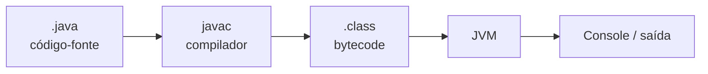
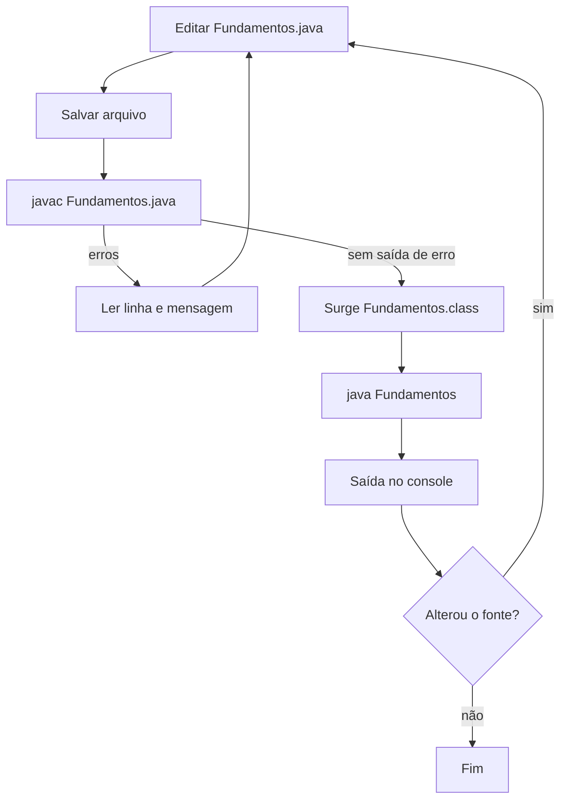

## Visão Geral do Conceito

Esta lição marca a **primeira virada técnica** da disciplina: depois do papo de carreira, o foco passa a ser **raciocínio + fluxo real de um programa Java**.

O problema que ela resolve é simples e recorrente em quem começa:

- apertar o botão verde da IDE e ver “Hello World”;
- sem saber o que foi compilado, o que é o arquivo <mark style="background-color: #242424; padding: 2px 4px; border-radius: 3px; color: inherit;">`.class`</mark>, nem o que a <mark style="background-color: #242424; padding: 2px 4px; border-radius: 3px; color: inherit;">`JVM`</mark> faz.

Aqui você aprende a **abrir a caixa-preta**:

1. instalar e verificar o <mark style="background-color: #242424; padding: 2px 4px; border-radius: 3px; color: inherit;">`JDK`</mark>;
2. escrever um arquivo <mark style="background-color: #242424; padding: 2px 4px; border-radius: 3px; color: inherit;">`.java`</mark> (texto);
3. compilar com <mark style="background-color: #242424; padding: 2px 4px; border-radius: 3px; color: inherit;">`javac`</mark>;
4. executar o bytecode com <mark style="background-color: #242424; padding: 2px 4px; border-radius: 3px; color: inherit;">`java`</mark>;
5. passar parâmetros pela linha de comando via <mark style="background-color: #242424; padding: 2px 4px; border-radius: 3px; color: inherit;">`String[] args`</mark>.

> **Regra da aula:** aprender programação **não** é decorar sintaxe. É entender o que o código faz, ler erros e consultar documentação quando esquecer um detalhe.

**Lacuna de fonte:** não há pasta dedicada de slides/PDF em `downloads/documents` para esta disciplina. O conteúdo abaixo foi reconstruído a partir da transcrição `Aula_02_-_24072026.bin` (prof. Elberth Moraes).

## Modelo Mental

### Java não é a IDE

Eclipse, IntelliJ, NetBeans e VS Code **ajudam** a desenvolver em Java. Nenhuma delas **é** o Java.

Dependência conceitual perigosa:

- “Para rodar, eu aperto este botão.”
- Tira o botão → a pessoa não sabe o que fazer.

Modelo correto:

| Peça | Papel |
|------|--------|
| Linguagem Java | Sintaxe, palavras reservadas, regras |
| Arquivo `.java` | Código-fonte (texto editável) |
| `javac` (compilador do JDK) | Transforma fonte → bytecode (`.class`) |
| JVM | Executa o bytecode |
| IDE | Automatiza edição, compilação e execução |

### Raciocínio antes do “comandinho”

O professor deixa explícito: o código importa, mas o **trabalho com raciocínio** é essencial. Nesta aula o código tem poucas linhas; o valor está em entender o **fluxo** e os **erros do compilador**.

### Analogia: receita vs prato pronto

- O <mark style="background-color: #242424; padding: 2px 4px; border-radius: 3px; color: inherit;">`.java`</mark> é a receita (você edita).
- O <mark style="background-color: #242424; padding: 2px 4px; border-radius: 3px; color: inherit;">`.class`</mark> é o prato já preparado (o que se “serve” / executa).
- Mudou a receita e não refez o prato? Quem come ainda recebe a versão antiga.

> **Write Once, Run Anywhere:** o bytecode (`.class`) pode rodar em qualquer ambiente que tenha uma JVM adequada (Windows, Linux, macOS). Essa camada entre programa e sistema operacional é o que tornou o Java forte em sistemas corporativos e ambientes heterogêneos.



## Mecânica Central

### 1. Estrutura mínima de um programa

Um arquivo texto com extensão <mark style="background-color: #242424; padding: 2px 4px; border-radius: 3px; color: inherit;">`.java`</mark> contém, no mínimo:

- uma <mark style="background-color: #242424; padding: 2px 4px; border-radius: 3px; color: inherit;">`class`</mark> (o “contêiner” do programa);
- o método <mark style="background-color: #242424; padding: 2px 4px; border-radius: 3px; color: inherit;">`main`</mark> — ponto de entrada (herança cultural da linguagem C: “starta” a aplicação);
- instruções dentro de `{ }` e, nas linhas de comando, término com <mark style="background-color: #242424; padding: 2px 4px; border-radius: 3px; color: inherit;">`;`</mark>.

Versão incompleta (proposital, como na aula — para forçar o compilador a falar):

```java
class Fundamentos {
    main {
        "Elberth"
    }
}
```

Versão mínima válida vista na aula (impressão fixa):

```java
class Fundamentos {
    public static void main(String[] args) {
        System.out.println("Elberth");
        System.out.println("Professor");
        System.out.println("Infinity");
    }
}
```

Pontos que a aula destaca sem aprofundar ainda (marcados para aulas seguintes):

- <mark style="background-color: #242424; padding: 2px 4px; border-radius: 3px; color: inherit;">`public`</mark> — visibilidade (quem pode usar o método);
- <mark style="background-color: #242424; padding: 2px 4px; border-radius: 3px; color: inherit;">`static`</mark> — permite chamar o método sem criar objeto da classe;
- <mark style="background-color: #242424; padding: 2px 4px; border-radius: 3px; color: inherit;">`void`</mark> — tipo de retorno “sem valor de retorno”;
- <mark style="background-color: #242424; padding: 2px 4px; border-radius: 3px; color: inherit;">`String`</mark> — texto; <mark style="background-color: #242424; padding: 2px 4px; border-radius: 3px; color: inherit;">`int`</mark>, <mark style="background-color: #242424; padding: 2px 4px; border-radius: 3px; color: inherit;">`double`</mark>, <mark style="background-color: #242424; padding: 2px 4px; border-radius: 3px; color: inherit;">`float`</mark> — números (detalhe na próxima aula de tipos).

### 2. Compilar ≠ executar

| Comando | Função |
|---------|--------|
| <mark style="background-color: #242424; padding: 2px 4px; border-radius: 3px; color: inherit;">`javac Fundamentos.java`</mark> | Compila o fonte; em sucesso, gera `Fundamentos.class` (silêncio = ok) |
| <mark style="background-color: #242424; padding: 2px 4px; border-radius: 3px; color: inherit;">`java Fundamentos`</mark> | Executa o bytecode (sem `.class` e sem `.java` no nome) |

Fluxo de correção com o compilador (como feito ao vivo):



Erros típicos mostrados na aula ao compilar o rascunho:

- declaração inválida de método / <mark style="background-color: #242424; padding: 2px 4px; border-radius: 3px; color: inherit;">`return type required`</mark> — assinatura de `main` incompleta;
- texto solto não é um <mark style="background-color: #242424; padding: 2px 4px; border-radius: 3px; color: inherit;">`statement`</mark> válido — precisa de instrução (ex.: `System.out.println(...)`);
- falta <mark style="background-color: #242424; padding: 2px 4px; border-radius: 3px; color: inherit;">`;`</mark> no fim da linha.

### 3. JDK, JVM e verificação no terminal

- **JVM (Java Virtual Machine):** executa o bytecode.
- **JDK (Java Development Kit):** kit de *desenvolvimento* — inclui o compilador e ferramentas; não é IDE.
- Distribuição citada na aula: **Eclipse Temurin** (versões 17, 21 ou 25 — evitar releases muito antigas).

Verificação após instalar:

```bash
java -version
javac -version
```

O sistema encontra esses executáveis via variáveis de ambiente (mencionadas sem aprofundar): <mark style="background-color: #242424; padding: 2px 4px; border-radius: 3px; color: inherit;">`PATH`</mark> e <mark style="background-color: #242424; padding: 2px 4px; border-radius: 3px; color: inherit;">`JAVA_HOME`</mark>. Instaladores modernos costumam configurar isso; o conceito importa mais do que decorar o caminho.

### 4. `System.out.println` e dois métodos no mesmo trecho

Na impressão:

```java
System.out.println("Elberth");
```

- <mark style="background-color: #242424; padding: 2px 4px; border-radius: 3px; color: inherit;">`System`</mark> — classe da biblioteca padrão;
- <mark style="background-color: #242424; padding: 2px 4px; border-radius: 3px; color: inherit;">`out`</mark> — objeto/atributo de saída;
- <mark style="background-color: #242424; padding: 2px 4px; border-radius: 3px; color: inherit;">`println`</mark> — método que imprime no console (e quebra linha).

No programa mínimo há **dois métodos**:

1. <mark style="background-color: #242424; padding: 2px 4px; border-radius: 3px; color: inherit;">`main`</mark> — você **declara** (define o que recebe);
2. <mark style="background-color: #242424; padding: 2px 4px; border-radius: 3px; color: inherit;">`println`</mark> — você **usa** (passa um valor entre parênteses = parâmetro/argumento).

Parênteses no código quase sempre sinalizam chamada ou declaração de método.

### 5. `String[] args` — comunicação mundo externo → programa

O `main` espera um **vetor de textos**. Na linha de comando:

```bash
java Fundamentos Elberth Professor Infinity
```

| Argumento | Índice |
|-----------|--------|
| `Elberth` | `args[0]` |
| `Professor` | `args[1]` |
| `Infinity` | `args[2]` |

Índices começam em **zero**. Três valores → posições 0, 1 e 2 — nunca 1, 2 e 3.

Uso avançado (ainda na aula, como antecipação): um argumento como `log` pode alterar o comportamento (ex.: gravar log em arquivo). Isso mostra por que sistemas recebem parâmetros em vez de ter tudo “hardcoded”.

### 6. Variável: declaração + atribuição

O sinal <mark style="background-color: #242424; padding: 2px 4px; border-radius: 3px; color: inherit;">`=`</mark> em Java, neste contexto, é **atribuição** (não comparação): o valor da direita vai para a esquerda.

Forma didática em dois passos:

```java
String nome;
nome = args[0];
```

Forma condensada (declara e atribui juntos):

```java
String nome = args[0];
```

Motivo pedagógico: imprimir `nome` é mais legível para humanos do que imprimir `args[0]` espalhado pelo código.

### 7. IDE depois — não no lugar do fundamento

A ordem da aula é deliberada: **terminal primeiro**. A IDE (Eclipse no computador do professor; VS Code e IntelliJ entre os alunos) salva, compila e executa de forma transparente. Útil para produtividade; prejudicial se esconder o fluxo.

Dica prática da aula: no início, seguir a mesma ferramenta do professor ou de um colega reduz atrito ao replicar exemplos. Depois, trocar de IDE é saudável — o código Java simples desta fase roda em qualquer uma. Escrever no Bloco de Notas força a ver maiúsculas/minúsculas (`String`, `System`) e erros reais.

**Não coberto com detalhe na fonte (só mencionado):** <mark style="background-color: #242424; padding: 2px 4px; border-radius: 3px; color: inherit;">`Scanner`</mark> para entrada interativa (comparado ao `input` do Python) — fica para a próxima aula / TPs.

## Uso Prático

### Cenário ADS: perfil de colaborador via argumentos

Em vez de um sistema que só imprime o nome do professor, construímos um “cartão de perfil” que recebe **nome**, **cargo** e **instituição/empresa** pela linha de comando — o mesmo programa serve para vários usuários.

```java
class Fundamentos {
    public static void main(String[] args) {
        String nome = args[0];
        String profissao = args[1];
        String instituicao = args[2];

        System.out.println(nome);
        System.out.println(profissao);
        System.out.println(instituicao);
    }
}
```

Compilar e executar (no diretório do arquivo):

```bash
javac Fundamentos.java
java Fundamentos Ze Empresario MegaPower
```

Saída esperada:

```text
Ze
Empresario
MegaPower
```

### Checklist de ambiente (TP / primeira semana)

Conforme a aula e o TP referido:

1. Instalar JDK Temurin (17+).
2. Confirmar `java -version` e `javac -version`.
3. Criar pasta da disciplina e arquivo `.java`.
4. Compilar, corrigir erros, executar.
5. Só depois padronizar IDE (Eclipse, VS Code, IntelliJ — escolha consciente).

Navegação no Windows (exemplo da aula):

```bash
cd "C:\caminho\completo\da\pasta"
javac Fundamentos.java
java Fundamentos
```

## Erros Comuns

1. **Achar que a IDE é o Java**  
   **Sintoma:** só sabe rodar pelo botão verde.  
   **Correção:** repetir o ciclo `javac` / `java` no terminal até ficar automático.

2. **Alterar o `.java` e executar sem recompilar**  
   **Sintoma:** console mostra texto antigo; horários de `.java` e `.class` diferem.  
   **Correção:** salvar → `javac` → `java`.

3. **Rodar `java Fundamentos.java` ou `java Fundamentos.class`**  
   **Sintoma:** erro de classe ou comportamento inesperado.  
   **Correção:** `java` recebe o **nome da classe** (`Fundamentos`), não a extensão.

4. **Texto solto dentro de `main` sem `println`**  
   **Sintoma:** erro de statement inválido.  
   **Correção:** `System.out.println("texto");`

5. **Faltar `;` ou `}`**  
   **Sintoma:** mensagem do `javac` apontando a linha.  
   **Correção:** ler a linha citada; salvar sempre antes de recompilar.

6. **Índice errado em `args`**  
   **Sintoma:** valor “trocado” ou <mark style="background-color: #242424; padding: 2px 4px; border-radius: 3px; color: inherit;">`ArrayIndexOutOfBoundsException`</mark> se faltar argumento.  
   **Correção:** primeiro argumento = `args[0]`; garantir a quantidade de parâmetros na linha de comando.  
   *(A exceção de índice é consequência natural do modelo; o tratamento robusto não foi o foco desta aula.)*

7. **`string` com s minúsculo**  
   **Sintoma:** erro de tipo não encontrado.  
   **Correção:** em Java o tipo texto padrão é <mark style="background-color: #242424; padding: 2px 4px; border-radius: 3px; color: inherit;">`String`</mark> (S maiúsculo).

## Visão Geral de Debugging

Quando algo falha nesta fase, siga esta ordem:

1. **O JDK está no PATH?** → `java -version` / `javac -version`.
2. **Estou no diretório certo?** → o `.java` aparece no `dir` / `ls`.
3. **Salvei o arquivo?** → sem salvar, o compilador lê a versão antiga do disco.
4. **O `javac` reportou linha e mensagem?** → corrija o fonte; não pule para a IDE ainda.
5. **Compilei depois da última edição?** → confira se o `.class` foi regenerado.
6. **Passei argumentos suficientes?** → para `args[0]`, `args[1]`, `args[2]` são necessários três tokens após o nome da classe.

<details>
<summary>Exemplo de ciclo de correção (como na aula)</summary>

1. `javac Fundamentos.java` → reclama de `main` inválido e de statement.
2. Ajusta assinatura e usa `System.out.println`.
3. Recompila → ainda falta detalhe na assinatura (`String[] args`, `public static void`).
4. Recompila → silêncio; surge `Fundamentos.class`.
5. `java Fundamentos` → imprime no console.
6. Muda o texto no fonte, esquece `javac` → saída velha.
7. Recompila e executa de novo → saída nova.

</details>

## Principais Pontos

- Raciocínio e entendimento do fluxo valem mais que decorar sintaxe.
- Java (linguagem) ≠ IDE; JDK inclui o compilador; JVM executa bytecode.
- Fonte (`.java`) → `javac` → bytecode (`.class`) → `java` + JVM → console.
- `javac` compila; `java` executa; após editar o fonte, recompile.
- `main` é o ponto de entrada; `System.out.println` imprime no console.
- `String[] args` traz argumentos da linha de comando; índices começam em 0.
- `=` atribui; declarar `String nome = args[0]` melhora a legibilidade.
- Terminal é skill de mercado — não é “só para hacker de filme”.
- IDE vem depois para produtividade; no início, errar no texto ensina mais.

## Preparação para Prática

Antes do laboratório, você deve conseguir:

- explicar com suas palavras o caminho fonte → bytecode → JVM;
- montar mentalmente (ou no papel) a assinatura de `main`;
- mapear três argumentos de linha de comando para três variáveis;
- saber por que “salvei e rodei `java`” pode mostrar resultado antigo.

No Editor Integrado do ISS a execução nativa é JavaScript; os desafios abaixo **simulam o mesmo raciocínio** (impressão, vetor de argumentos, índice zero, atribuição). Os exemplos Java do corpo da lição continuam sendo a referência da disciplina — rode-os localmente com JDK + terminal.

## Laboratório de Prática

### Easy — Cartão de perfil no console

**Contexto:** um script interno de onboarding imprime nome, cargo e time a partir de um vetor de argumentos (equivalente a `String[] args`).

Complete a função para devolver as três linhas de saída, na ordem, usando índices 0, 1 e 2.

```javascript
function cartaoPerfil(args) {
  // args simula String[] args do main em Java
  // Ex.: ["Ana", "Dev Junior", "Backend"]
  // TODO: ler args[0], args[1], args[2] e montar a saída
  const linhas = [];
  return linhas.join("\n");
}

// Boilerplate executável (resultado incompleto até você implementar)
console.log(cartaoPerfil(["Ana", "Dev Junior", "Backend"]));
```

### Medium — Nomes legíveis com atribuição

**Contexto:** o mesmo cartão, mas o time pediu variáveis com nomes de negócio (`nome`, `cargo`, `time`) em vez de `args[i]` espalhado — espelhando a refatoração da aula (`String nome = args[0]`).

```javascript
function cartaoPerfilComVariaveis(args) {
  // TODO: declarar nome, cargo, time a partir de args
  // TODO: imprimir/retornar cada um em uma linha
  const nome = "";
  const cargo = "";
  const time = "";
  return [nome, cargo, time].join("\n");
}

console.log(cartaoPerfilComVariaveis(["Ze", "Empresario", "MegaPower"]));
```

### Hard — Flag `log` muda o comportamento

**Contexto:** job de lote (como o exemplo de log da aula). Se o primeiro argumento for `"log"` (case-sensitive), o retorno deve prefixar cada linha com `[LOG] `; caso contrário, devolve o perfil normal com os três campos a partir de `args[0..2]`.

```javascript
function perfilComFlagLog(args) {
  // Ex. sem flag: ["Maria", "QA", "Produto"]
  // Ex. com flag: ["log", "Maria", "QA", "Produto"]
  // TODO: se args[0] === "log", deslocar os índices e prefixar [LOG]
  // TODO: caso contrário, comportamento do cartão normal
  return "";
}

console.log(perfilComFlagLog(["Maria", "QA", "Produto"]));
console.log(perfilComFlagLog(["log", "Maria", "QA", "Produto"]));
```

<!-- CONCEPT_EXTRACTION
concepts:
  - raciocínio vs decorar sintaxe
  - Java vs IDE
  - JDK / Temurin
  - javac e java
  - código-fonte .java
  - bytecode .class
  - JVM e portabilidade
  - método main
  - System.out.println
  - ponto e vírgula e chaves
  - String[] args
  - índice zero em vetores
  - declaração e atribuição de variáveis
  - PATH e JAVA_HOME
  - terminal como skill
skills:
  - Verificar instalação do JDK com java -version e javac -version
  - Escrever classe mínima com main e println
  - Compilar e executar programa Java na linha de comando
  - Interpretar erros do javac e corrigir o fonte
  - Recompilar após alterar o código-fonte
  - Mapear argumentos de linha de comando para variáveis nomeadas
  - Distinguir linguagem, JDK, JVM e IDE
examples:
  - class-fundamentos-println-fixo
  - javac-java-ciclo-recompilacao
  - main-string-args-tres-parametros
  - variavel-nome-igual-args-zero
  - flag-log-comportamento
-->

<!-- EXERCISES_JSON
[
  {
    "id": "jv02-cartao-perfil-console",
    "slug": "jv02-cartao-perfil-console",
    "difficulty": "easy",
    "title": "Cartão de perfil no console",
    "discipline": "fundamentos-java",
    "editorLanguage": "javascript",
    "tags": ["java", "args", "println", "indices"],
    "summary": "Montar três linhas de saída a partir de um vetor de argumentos (simulação de String[] args)."
  },
  {
    "id": "jv02-cartao-perfil-variaveis",
    "slug": "jv02-cartao-perfil-variaveis",
    "difficulty": "medium",
    "title": "Nomes legíveis com atribuição",
    "discipline": "fundamentos-java",
    "editorLanguage": "javascript",
    "tags": ["java", "variaveis", "atribuicao", "args"],
    "summary": "Atribuir args a variáveis nome, cargo e time antes de montar a saída."
  },
  {
    "id": "jv02-flag-log-comportamento",
    "slug": "jv02-flag-log-comportamento",
    "difficulty": "hard",
    "title": "Flag log muda o comportamento",
    "discipline": "fundamentos-java",
    "editorLanguage": "javascript",
    "tags": ["java", "args", "flags", "comportamento"],
    "summary": "Se o primeiro argumento for log, prefixar saída com [LOG] e deslocar índices dos campos."
  }
]
-->

<!--
lessons.json (orquestrador — NÃO editar neste worker):
  discipline: fundamentos-java
  slug: raciocinio-codigo-primeiro-contato-java
  title: Raciocínio, código e primeiro contato prático com Java
  order: 2
  file: content/fundamentos-java/aula-02-raciocinio-codigo-primeiro-contato-java.md
-->
