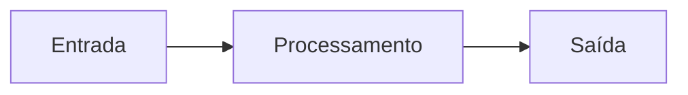
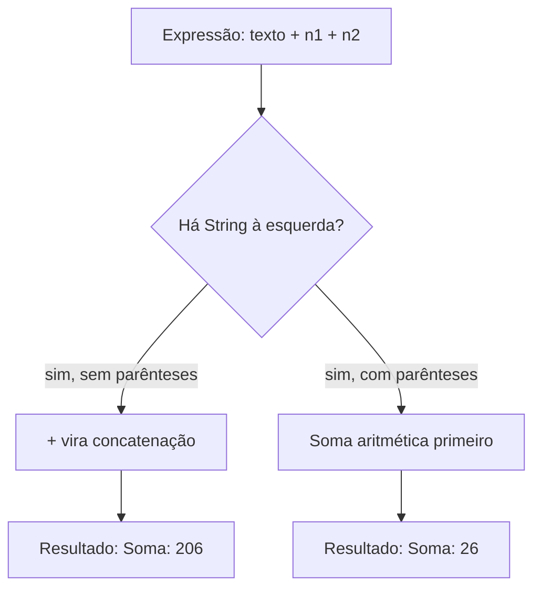

## Visão Geral do Conceito

Um programa útil precisa **guardar informações**, **processá-las** e **mostrar um resultado**. Em Java, o lugar onde a informação fica durante a execução é a <mark style="background-color: #242424; padding: 2px 4px; border-radius: 3px; color: inherit;">`variável`</mark>: um espaço tipado em memória com um nome.

Nesta aula o foco é:

- escolher o **tipo** certo (`String`, `int`, `double`, `boolean`);
- declarar, atribuir e reutilizar variáveis;
- imprimir relatórios no console com <mark style="background-color: #242424; padding: 2px 4px; border-radius: 3px; color: inherit;">`System.out.println`</mark>;
- usar <mark style="background-color: #242424; padding: 2px 4px; border-radius: 3px; color: inherit;">`+`</mark> tanto para **concatenação** quanto para **soma** — e não confundir os dois.

> **Lacuna da fonte (Scanner):** na transcrição da Aula 03 (30/07/2026), o professor **adiou** a entrada interativa com <mark style="background-color: #242424; padding: 2px 4px; border-radius: 3px; color: inherit;">`Scanner`</mark> para a aula seguinte (“amanhã”). Nesta lição a “entrada” aparece como **valores fixos no código** e, quando relevante, como lembrete dos argumentos de <mark style="background-color: #242424; padding: 2px 4px; border-radius: 3px; color: inherit;">`main(String[] args)`</mark> da aula anterior. A API `Scanner` **não é coberta** aqui.

## Modelo Mental

Pense em variáveis como **caixas de mudança**:

- Cada caixa tem um **rótulo** (nome da variável).
- Cada caixa tem um **formato** (tipo): não se guarda copo de vidro na mesma caixa da roupa.
- Enquanto o programa roda, você pode **trocar o conteúdo** da caixa (reatribuição) — daí o nome “variável”.
- No fim da execução, essas caixas deixam de existir (não são persistência em disco).

O Java obriga você a dizer o formato da caixa **antes**. Isso é tipagem forte: o compilador detecta inconsistências cedo, em vez de deixar o programa seguir com dados inválidos.

Um algoritmo bem formado, na visão da aula, tem até três partes:



- **Entrada:** dados que alimentam o programa (hoje: literais no código; depois: teclado/`Scanner`).
- **Processamento:** contas, montagem de frases, reuso de variáveis.
- **Saída:** o que aparece no console via `System.out.println`.

## Mecânica Central

### 1. Declaração, nome e atribuição

Padrão visto em aula:

```java
tipo nomeDaVariavel = valor;
```

Exemplo de perfil (classe `PerfilFormatado`):

```java
public class PerfilFormatado {
    public static void main(String[] args) {
        String nome = "Elberth Moraes";
        int idade = 47;
        double altura = 1.80;
        boolean professor = true;
        String cidade = "Marica";
        double salario = 1500.0;
        String profissao = "programador";
        String estado = "Rio de Janeiro";
        String empresa = "Infnet";

        System.out.println("Cadastramento");
    }
}
```

Peças da instrução:

| Peça | Papel |
|------|--------|
| `String` / `int` / … | tipo — o que a caixa pode guardar |
| `nome` | identificador — como você se refere à caixa |
| `=` | atribuição — coloca um valor na caixa |
| `"Elberth Moraes"` / `47` | valor (literal) |
| `;` | fim da instrução |

> **Regra:** escolha o tipo **específico** do dado. Idade inteira → `int`. Altura com casas → `double` (ou `float`). Não “engole” tudo em `double` só porque um inteiro também é real na matemática: o tipo comunica a intenção e influencia as operações.

### 2. Tipos usados na aula

| Tipo | Uso na aula | Exemplo |
|------|-------------|---------|
| <mark style="background-color: #242424; padding: 2px 4px; border-radius: 3px; color: inherit;">`String`</mark> | texto (nome, cidade, profissão) | `String nome = "Elberth";` |
| <mark style="background-color: #242424; padding: 2px 4px; border-radius: 3px; color: inherit;">`int`</mark> | número inteiro (idade, operandos da calculadora) | `int idade = 47;` |
| <mark style="background-color: #242424; padding: 2px 4px; border-radius: 3px; color: inherit;">`double`</mark> | número real / decimal (altura, salário, notas) | `double altura = 1.80;` |
| <mark style="background-color: #242424; padding: 2px 4px; border-radius: 3px; color: inherit;">`float`</mark> | decimal com menos precisão/alcance que `double` | mencionado; aula preferiu `double` |
| <mark style="background-color: #242424; padding: 2px 4px; border-radius: 3px; color: inherit;">`boolean`</mark> | lógico verdadeiro/falso | `boolean professor = true;` |

Pontos importantes da transcrição:

- <mark style="background-color: #242424; padding: 2px 4px; border-radius: 3px; color: inherit;">`String`</mark> começa com maiúscula porque é **classe** (não um tipo primitivo). Por isso não “fica roxo” como um primitivo em alguns editores.
- <mark style="background-color: #242424; padding: 2px 4px; border-radius: 3px; color: inherit;">`double`</mark> tem maior precisão/alcance que <mark style="background-color: #242424; padding: 2px 4px; border-radius: 3px; color: inherit;">`float`</mark>.
- Comparações e operações devem envolver informações **compatíveis** (não misturar texto com número sem intenção clara).

### 3. Saída no console: `System.out.println`

- <mark style="background-color: #242424; padding: 2px 4px; border-radius: 3px; color: inherit;">`System`</mark> — classe.
- <mark style="background-color: #242424; padding: 2px 4px; border-radius: 3px; color: inherit;">`out`</mark> — fluxo de saída padrão.
- <mark style="background-color: #242424; padding: 2px 4px; border-radius: 3px; color: inherit;">`println`</mark> — imprime e **pula linha**.

Comentários de uma linha usam <mark style="background-color: #242424; padding: 2px 4px; border-radius: 3px; color: inherit;">`//`</mark> e são ignorados pelo compilador.

### 4. Concatenação com `+`

Para montar um relatório sem hardcodar o nome no meio da frase:

```java
System.out.println("Meu nome e " + nome + " e sou " + profissao + ".");
System.out.println("Tenho " + idade + " anos e sou natural do " + estado + ".");
System.out.println("Tenho " + altura + " metros de altura.");
System.out.println("Moro na cidade de " + cidade + ".");
System.out.println("Atualmente tenho o rendimento de " + salario + " na " + empresa + ".");
```

Por que usar a variável em vez do literal na frase?

- Se `nome` mudar no cadastro, o relatório continua correto.
- Separa **dados** (entrada/estado) de **apresentação** (saída).

### 5. Operadores aritméticos e a ambiguidade do `+`

Na calculadora da aula (`primeiroNumero = 20`, `segundoNumero = 6`):

| Operador | Significado | Exemplo com 20 e 6 |
|----------|-------------|---------------------|
| `+` | soma (ou concatenação) | `26` |
| `-` | subtração | `14` |
| `*` | multiplicação | `120` |
| `/` | divisão (inteira se ambos forem `int`) | `3` |
| `%` | resto da divisão inteira | `2` |

Fluxo mental do problema clássico da aula:



```java
int primeiroNumero = 20;
int segundoNumero = 6;

// ERRADO para "somar": concatena → "Soma: 206"
System.out.println("Soma: " + primeiroNumero + segundoNumero);

// CORRETO: parênteses forçam a conta → "Soma: 26"
System.out.println("Soma: " + (primeiroNumero + segundoNumero));
```

O professor nomeou o fenômeno como **sobrecarga de operador** (*operator overload*): o mesmo símbolo `+` tem comportamentos diferentes conforme o contexto (texto vs números).

Divisão entre `int` descarta a parte fracionária. O resto (`%`) complementa o entendimento (`20 / 6 == 3` e `20 % 6 == 2`).

### 6. Escopo e reuso de variável

- Uma variável só pode ser usada **depois** de declarada.
- O **escopo** é o trecho do código em que ela “vive” (na aula: do ponto de declaração até o fim do uso no `main`).
- Usar `primeiroNumero` *antes* da declaração → erro de compilação.

Padrão limpo com uma variável `resultado` reutilizada:

```java
int primeiroNumero = 20;
int segundoNumero = 6;
int resultado = 0;

resultado = primeiroNumero + segundoNumero;
System.out.println("Soma: " + resultado);

resultado = primeiroNumero - segundoNumero;
System.out.println("Subtracao: " + resultado);

resultado = primeiroNumero * segundoNumero;
System.out.println("Multiplicacao: " + resultado);

resultado = primeiroNumero / segundoNumero;
System.out.println("Divisao: " + resultado);

resultado = primeiroNumero % segundoNumero;
System.out.println("Resto: " + resultado);
```

A variável `resultado` nasce uma vez e **muda de valor** ao longo do fluxo — exemplo direto do conceito de variável.

### 7. Média com `double` e tipagem forte

Com notas reais (TPs), a aula usou `double` para preservar casas decimais:

```java
public class MediaAluno {
    public static void main(String[] args) {
        double notaTp1 = 8.5;
        double notaTp2 = 7.0;
        double notaTp3 = 9.2;
        double media = 0.0;

        media = (notaTp1 + notaTp2 + notaTp3) / 3;
        System.out.println("Media: " + media);
    }
}
```

Contraste com Python (mencionado no chat da aula): em Python o operador `//` e a ausência de declaração de tipo mudam o estilo. Em Java, **você declara a intenção no tipo**; o resultado das operações segue essa intenção. Isso é o sentido prático de “fortemente tipado” na fala do professor.

### 8. O que ainda não é desta aula

| Tópico | Status na fonte |
|--------|-----------------|
| <mark style="background-color: #242424; padding: 2px 4px; border-radius: 3px; color: inherit;">`Scanner`</mark> / leitura do teclado | **Não coberto** — prometido para a aula seguinte |
| <mark style="background-color: #242424; padding: 2px 4px; border-radius: 3px; color: inherit;">`printf`</mark> / `String.format` | Mencionado; detalhe adiado |
| Pacotes e visibilidade `public` em profundidade | Introdução leve; aprofundamento futuro |
| Orientação a objetos / instanciar objetos | Explicitamente adiado |
| IDE (IntelliJ etc.) | Ainda fora do foco; prática em bloco de notas + `javac`/`java` |

## Uso Prático

### Cenário A — Relatório de perfil de colaborador

Contexto ADS: montar um “espelho” de cadastro a partir de campos tipados (como um extrato de ficha de RH), sem repetir literais no texto.

```java
public class RelatorioPerfil {
    public static void main(String[] args) {
        String nome = "Ana Souza";
        String cargo = "analista de dados";
        int idade = 29;
        String cidade = "Niteroi";
        double rendimento = 4200.50;
        boolean ativo = true;

        System.out.println("=== Relatorio de perfil ===");
        System.out.println("Colaborador: " + nome);
        System.out.println("Cargo: " + cargo + " | Ativo: " + ativo);
        System.out.println("Idade: " + idade + " | Cidade: " + cidade);
        System.out.println("Rendimento: " + rendimento);
    }
}
```

Compilar e executar (fluxo da aula, sem IDE):

```bash
javac RelatorioPerfil.java
java RelatorioPerfil
```

### Cenário B — Calculadora de totais de pedido (dois valores fixos)

Simula dois itens numéricos reutilizados em várias operações (soma do pedido, diferença de preço, etc.):

```java
public class CalculadoraPedido {
    public static void main(String[] args) {
        int itemA = 20;
        int itemB = 6;
        int resultado = 0;

        resultado = itemA + itemB;
        System.out.println("Total itens: " + resultado);

        resultado = itemA - itemB;
        System.out.println("Diferenca: " + resultado);

        resultado = itemA * itemB;
        System.out.println("Produto indices: " + resultado);

        resultado = itemA / itemB;
        System.out.println("Divisao inteira: " + resultado);

        resultado = itemA % itemB;
        System.out.println("Resto: " + resultado);
    }
}
```

### Cenário C — Média de TPs

```java
public class MediaTps {
    public static void main(String[] args) {
        double tp1 = 8.5;
        double tp2 = 7.0;
        double tp3 = 9.2;
        double media = (tp1 + tp2 + tp3) / 3.0;
        System.out.println("Media dos TPs: " + media);
    }
}
```

Hábitos reforçados em aula:

1. Escrever um pouco → compilar → executar.
2. Isolar o trecho novo: se o bloco de cima já passou, o erro está no que acabou de entrar.
- Evitar acentos em nomes de arquivo/classe no ambiente sem IDE mostrado (`MediaAluno`, não `MédiaAluno`).

## Erros Comuns

1. **Literal no lugar da variável no relatório**  
   - **Sintoma:** muda o valor em cima e a frase impressa continua antiga.  
   - **Correção:** concatenar o identificador (`+ nome`), não o texto fixo `"Elberth"`.

2. **`+` concatena em vez de somar**  
   - **Sintoma:** `"Soma: 206"` em vez de `"Soma: 26"`.  
   - **Causa:** `String` à esquerda faz o `+` virar junção de texto.  
   - **Correção:** `("Soma: " + (a + b))` ou calcule antes em `int resultado = a + b`.

3. **Usar variável antes de declarar (escopo)**  
   - **Sintoma:** erro de compilação (variável não encontrada).  
   - **Correção:** declare e inicialize antes do primeiro uso.

4. **Tipo inadequado**  
   - **Sintoma:** perde casas decimais na média (`int`) ou aceita idade como `double` sem necessidade.  
   - **Correção:** `int` para contagens/inteiros; `double` para notas, altura, dinheiro com fração (na aula).

5. **Divisão inteira inesperada**  
   - **Sintoma:** `20 / 6` imprime `3`.  
   - **Causa:** ambos os operandos são `int`.  
   - **Correção:** se quiser decimal, use `double` nos operandos ou na expressão (ex.: `20.0 / 6`).

6. **Nome do arquivo ≠ nome da classe `public`**  
   - **Sintoma:** falha ao compilar/rodar.  
   - **Correção:** `Calculadora.java` ↔ `public class Calculadora`.

7. **Esperar `Scanner` nesta aula**  
   - **Sintoma:** procurar na lição API de teclado que a fonte não ensinou.  
   - **Correção:** use literais tipados; `Scanner` fica para a aula seguinte.

## Visão Geral de Debugging

Ordem sugerida (alinhada à prática `javac` → `java` da aula):

1. **O programa compila?** Leia a linha apontada pelo compilador (aspas, `;`, símbolo não encontrado).
2. **A variável existe neste ponto?** Confira declaração acima do uso (escopo).
3. **O tipo é o esperado?** Inteiro vs `double` muda divisão e média.
4. **A saída é texto ou número?** Se há `String` na expressão com `+`, desconfie de concatenação.
5. **Isole a operação:** calcule em uma variável `resultado` e imprima só ela.
6. **Reproduza o caso mínimo:** dois números e uma única linha `println` antes de montar o relatório inteiro.

<details>
<summary>Caso clássico da aula — por que aparece 206?</summary>

Com `System.out.println("Soma: " + 20 + 6)` a avaliação segue da esquerda para a direita:

1. `"Soma: " + 20` → `"Soma: 20"` (concatenação)
2. `"Soma: 20" + 6` → `"Soma: 206"` (concatenação de novo)

Com `System.out.println("Soma: " + (20 + 6))`:

1. `(20 + 6)` → `26` (soma)
2. `"Soma: " + 26` → `"Soma: 26"` (concatenação do resultado)

</details>

## Principais Pontos

- Variável = espaço tipado em memória cujo valor pode mudar durante a execução.
- Em Java o tipo é declarado cedo: tipagem forte ajuda a achar erro na compilação.
- Tipos da aula: `String`, `int`, `double`/`float`, `boolean`.
- `String` é classe (maiúscula); primitivos começam em minúscula.
- Saída padrão: `System.out.println` (imprime e quebra linha).
- `+` concatena texto e também soma números — use parênteses quando misturar os dois.
- `/` entre `int` é divisão inteira; `%` devolve o resto.
- Escopo: declare antes de usar; uma variável `resultado` pode ser reatribuída várias vezes.
- Algoritmo útil: entrada → processamento → saída.
- `Scanner` **não foi ensinado nesta aula** (fica para a próxima).

## Preparação para Prática

Antes do laboratório, você deve conseguir:

1. Declarar variáveis com tipos adequados a um cadastro simples.
2. Montar frases de relatório com concatenação.
3. Explicar e corrigir o bug `"Soma: 206"`.
4. Implementar as quatro operações e o resto com reuso de `resultado`.
5. Calcular média de notas com `double`.

O editor integrado do ISS executa JavaScript; os desafios abaixo **modelam a mesma lógica** da aula em Java. Nos comentários está o equivalente em Java para você treinar a sintaxe-alvo da disciplina.

## Laboratório de Prática

### Easy — Relatório de ticket de suporte

**Contexto:** um sistema de helpdesk guarda dados fixos de um ticket e precisa imprimir um resumo legível no console (log operacional).

**Objetivo:** preencher as variáveis tipadas (via comentários Java) e montar as três linhas do relatório com concatenação — sem repetir literais nas frases.

```javascript
// Equivalente Java (referência):
// String protocolo = "TK-1042";
// String cliente = "Carla Mendes";
// int prioridade = 2;
// boolean aberto = true;
// System.out.println("Ticket " + protocolo + " | Cliente: " + cliente);
// System.out.println("Prioridade: " + prioridade + " | Aberto: " + aberto);

function relatorioTicket() {
  const protocolo = "TK-1042";
  const cliente = "Carla Mendes";
  const prioridade = 2;
  const aberto = true;

  // TODO: montar linha1 = "Ticket " + protocolo + " | Cliente: " + cliente
  const linha1 = "";
  // TODO: montar linha2 = "Prioridade: " + prioridade + " | Aberto: " + aberto
  const linha2 = "";
  // TODO: montar linha3 avisando se está aberto (use a variável aberto)
  const linha3 = "";

  return [linha1, linha2, linha3];
}

console.log(relatorioTicket().join("\n"));
```

### Medium — Total de itens sem cair na pegadinha do `+`

**Contexto:** um microserviço de estoque soma quantidades de dois SKUs e registra o total. O bug clássico é concatenar em vez de somar.

**Objetivo:** implementar `somarQuantidades` de forma que a mensagem final contenha a **soma numérica**, não a junção dos dígitos. Compare o caminho errado e o correto.

```javascript
// Equivalente Java:
// int skuA = 20;
// int skuB = 6;
// System.out.println("Total: " + (skuA + skuB)); // "Total: 26"
// // ERRADO: "Total: " + skuA + skuB → "Total: 206"

function mensagemErrada(skuA, skuB) {
  // Simula avaliação esquerda→direita como em Java com String à esquerda
  return "Total: " + skuA + skuB;
}

function mensagemCorreta(skuA, skuB) {
  // TODO: retornar "Total: " + (skuA + skuB) — force a soma antes da concatenação
  return "";
}

function somarQuantidades(skuA, skuB) {
  // TODO: calcular total numérico e devolver { errada, correta, total }
  const errada = mensagemErrada(skuA, skuB);
  const correta = mensagemCorreta(skuA, skuB);
  const total = 0; // TODO: skuA + skuB
  return { errada, correta, total };
}

console.log(somarQuantidades(20, 6));
// Esperado: errada "Total: 206", correta "Total: 26", total 26
```

### Hard — Painel de média de TPs com variável reutilizada

**Contexto:** ao fechar a sprint acadêmica, um script calcula média de três TPs (`double`) e também exibe operações auxiliares (diferença TP3−TP1, resto de uma métrica inteira de entregas).

**Objetivo:**

1. Calcular a média com casas decimais.
2. Reutilizar **uma** variável `resultado` (número) para operações inteiras auxiliares, reatribuindo-a (modelo da calculadora da aula).
3. Devolver um objeto/resumo pronto para log.

```javascript
// Equivalente Java (média):
// double tp1 = 8.5, tp2 = 7.0, tp3 = 9.2;
// double media = (tp1 + tp2 + tp3) / 3.0;
//
// Equivalente Java (reuso):
// int entregas = 20; int lotes = 6; int resultado = 0;
// resultado = entregas / lotes; // divisão inteira
// resultado = entregas % lotes; // resto

function painelDesempenho(tp1, tp2, tp3, entregas, lotes) {
  // TODO: media = (tp1 + tp2 + tp3) / 3
  const media = 0;

  // TODO: reutilize UMA variável resultado para:
  // 1) divisão inteira entregas / lotes
  // 2) depois resto entregas % lotes
  let resultado = 0;
  let divisaoInteira = 0;
  let resto = 0;
  // TODO: atribuir resultado = entregas / lotes (inteiro); salvar em divisaoInteira
  // TODO: atribuir resultado = entregas % lotes; salvar em resto

  // TODO: montar resumo textual com concatenação incluindo media, divisaoInteira e resto
  const resumo = "";

  return {
    media,
    divisaoInteira,
    resto,
    resumo
  };
}

console.log(painelDesempenho(8.5, 7.0, 9.2, 20, 6));
// media ≈ 8.233..., divisaoInteira 3, resto 2
```

<!-- lessons.json (orquestrador): discipline=fundamentos-java slug=variaveis-tipos-entrada-saida-java title="Variáveis, tipos, Scanner e saída no console" order=3 file=content/fundamentos-java/aula-03-variaveis-tipos-entrada-saida-java.md -->

<!-- CONCEPT_EXTRACTION
concepts:
  - variáveis
  - tipagem forte em Java
  - tipos String int double boolean
  - declaração e atribuição
  - System.out.println
  - concatenação com +
  - sobrecarga do operador +
  - operadores aritméticos + - * / %
  - divisão inteira
  - escopo de variável
  - reuso de variável resultado
  - algoritmo entrada-processamento-saída
skills:
  - Declarar variáveis com tipo explícito adequado ao dado
  - Imprimir relatórios no console com System.out.println
  - Concatenar literais e variáveis com +
  - Forçar soma aritmética com parênteses antes de concatenar
  - Implementar calculadora básica reutilizando uma variável resultado
  - Calcular média com double preservando casas decimais
  - Diagnosticar erros de escopo e de concatenação indevida
examples:
  - perfil-formatado-variaveis
  - concatenacao-relatorio
  - calculadora-parenteses-soma
  - reuso-variavel-resultado
  - media-aluno-double
-->

<!-- EXERCISES_JSON
[
  {
    "id": "jv03-relatorio-ticket-suporte",
    "slug": "jv03-relatorio-ticket-suporte",
    "difficulty": "easy",
    "title": "Relatório de ticket de suporte",
    "discipline": "fundamentos-java",
    "editorLanguage": "javascript",
    "tags": ["java", "variaveis", "concatenacao", "println"],
    "summary": "Montar linhas de log de um ticket concatenando protocolo, cliente, prioridade e status."
  },
  {
    "id": "jv03-total-itens-parenteses",
    "slug": "jv03-total-itens-parenteses",
    "difficulty": "medium",
    "title": "Total de itens sem cair na pegadinha do +",
    "discipline": "fundamentos-java",
    "editorLanguage": "javascript",
    "tags": ["java", "concatenacao", "operadores", "parenteses"],
    "summary": "Contrastar concatenação esquerda-direita com soma forçada por parênteses no total de SKUs."
  },
  {
    "id": "jv03-painel-media-tps-reuso",
    "slug": "jv03-painel-media-tps-reuso",
    "difficulty": "hard",
    "title": "Painel de média de TPs com variável reutilizada",
    "discipline": "fundamentos-java",
    "editorLanguage": "javascript",
    "tags": ["java", "double", "media", "escopo", "modulo"],
    "summary": "Calcular média em double e reutilizar uma variável resultado para divisão inteira e resto."
  }
]
-->
