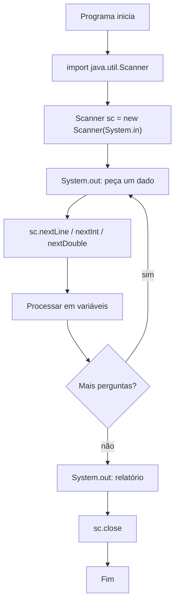
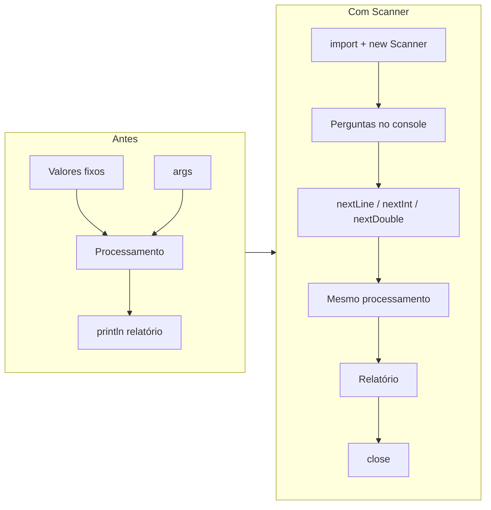

## Visão Geral do Conceito

Até aqui, os programas Java da trilha usavam **valores fixos** ou **argumentos** da linha de comando (`args`). Isso serve para testar lógica, mas não modela bem um sistema que conversa com quem está do lado de fora.

Nesta lição o foco é a **entrada interativa no console** com a classe <mark style="background-color: #242424; padding: 2px 4px; border-radius: 3px; color: inherit;">`Scanner`</mark>: o programa imprime um pedido (`Digite seu nome`), o cursor espera, o usuário digita e pressiona Enter, e o valor entra em uma variável para processamento e relatório.

Ao mesmo tempo, a aula consolida o hábito de **um projeto / uma classe por problema** (perfil, calculadora, média, cadastro), em vez de empilhar tudo na mesma classe.

> **Problema que resolve:** transformar um algoritmo de “números já escritos no código” em um fluxo real **entrada → processamento → saída**, lendo tipos diferentes (`String`, `int`, `double`) sem depender de `args`.

> **Lacuna de fonte:** não há pasta de slides/PDF dedicada para Fundamentos Java; o conteúdo abaixo é reconstruído a partir da transcrição da Aula 04 (31/07/2026). Códigos completos de “Calculadora” e “Média do aluno” das aulas anteriores não estão na fonte desta aula — apenas a refatoração com Scanner.

## Modelo Mental

Pense no console (“telinha preta”) como um **canal de conversa**:

1. O programa fala (`System.out.print` / `println`).
2. O usuário responde (teclado).
3. Um objeto <mark style="background-color: #242424; padding: 2px 4px; border-radius: 3px; color: inherit;">`Scanner`</mark> captura a resposta e a entrega tipada ao código.

Três formas de “entrar dado” já vistas na trilha:

| Forma | Quando usar | Limitação |
|-------|-------------|-----------|
| Valor fixo na variável | Testar cálculo e impressão | Não muda sem recompilar |
| `args[0]`, `args[1]`, … | Passar valores na execução | Exige argumentos; erro se faltar índice |
| `Scanner` + console | Dialogar passo a passo | Entrada inválida (letra onde espera número) quebra — tratamento de exceção fica para aula futura |

O <mark style="background-color: #242424; padding: 2px 4px; border-radius: 3px; color: inherit;">`Scanner`</mark> não é um tipo primitivo como <mark style="background-color: #242424; padding: 2px 4px; border-radius: 3px; color: inherit;">`int`</mark> ou <mark style="background-color: #242424; padding: 2px 4px; border-radius: 3px; color: inherit;">`double`</mark>. É uma **classe** da biblioteca Java. Para usá-la você:

1. **Importa** o caminho (`java.util.Scanner`).
2. **Instancia** um objeto com <mark style="background-color: #242424; padding: 2px 4px; border-radius: 3px; color: inherit;">`new`</mark>.
3. Guarda a referência numa variável (`sc`, `in`, etc.).
4. Chama **métodos** dessa instância (`nextLine()`, `nextInt()`, …).
5. **Fecha** com <mark style="background-color: #242424; padding: 2px 4px; border-radius: 3px; color: inherit;">`close()`</mark>.

Analogia útil da aula: memória como gaveteiro. `new Scanner(...)` cria a “gaveta-objeto”; a variável `sc` guarda o endereço dessa gaveta. Sem atribuir o resultado do `new` a uma variável, o objeto existe e some sem ninguém conseguir usá-lo.



## Mecânica Central

### Organização: classes e projetos separados

Na prática da disciplina, cada exercício vira um arquivo/classe próprio no diretório de trabalho (ex.: fundamentos, perfil formatado, calculadora, média do aluno, primeiro scanner, cadastro de pessoa). Isso evita misturar lógicas e facilita compartilhar/revisar cada fonte.

> **Regra:** o nome da classe pública deve coincidir com o nome do arquivo `.java` (ex.: `CadastroPessoa` ↔ `CadastroPessoa.java`).

### Instanciação: `new` e objeto

```java
Scanner sc = new Scanner(System.in);
```

Leitura técnica dessa linha:

- <mark style="background-color: #242424; padding: 2px 4px; border-radius: 3px; color: inherit;">`Scanner`</mark> — tipo (classe).
- <mark style="background-color: #242424; padding: 2px 4px; border-radius: 3px; color: inherit;">`sc`</mark> — variável de referência (você escolhe o nome).
- <mark style="background-color: #242424; padding: 2px 4px; border-radius: 3px; color: inherit;">`new`</mark> — cria a instância na memória.
- <mark style="background-color: #242424; padding: 2px 4px; border-radius: 3px; color: inherit;">`Scanner(System.in)`</mark> — chamada ao **construtor** (detalhes de construtores: aprofundamento futuro na trilha de OO).
- <mark style="background-color: #242424; padding: 2px 4px; border-radius: 3px; color: inherit;">`System.in`</mark> — diz ao Scanner que a fonte é o teclado/console.

Sem `new`, você não tem objeto utilizável. Atribuir um literal incompatível (`sc = 0`, `sc = false`, `sc = "texto"`) não faz sentido: o tipo da variável é `Scanner`.

### `import` e o pacote `java.util`

`Scanner` vive em <mark style="background-color: #242424; padding: 2px 4px; border-radius: 3px; color: inherit;">`java.util`</mark>. Sem import (ou sem nome totalmente qualificado), a compilação falha com erro do tipo *cannot find symbol* / classe não encontrada.

```java
import java.util.Scanner;

public class PrimeiroScanner {
    public static void main(String[] args) {
        // ...
    }
}
```

Alternativa sem `import` (válida, porém verbosa em cada ocorrência):

```java
java.util.Scanner sc = new java.util.Scanner(System.in);
```

> **Regra:** importe só o que usa. Evite `import java.util.*;` “por preguiça” — traga a classe necessária (`Scanner`).

### `System.out` versus `System.in`

- <mark style="background-color: #242424; padding: 2px 4px; border-radius: 3px; color: inherit;">`System.out.println(...)`</mark> / <mark style="background-color: #242424; padding: 2px 4px; border-radius: 3px; color: inherit;">`print(...)`</mark> — saída para o console.
- <mark style="background-color: #242424; padding: 2px 4px; border-radius: 3px; color: inherit;">`System.in`</mark> — entrada padrão; o Scanner lê a partir daqui.

`println` pula linha após a mensagem; `print` deixa o cursor na mesma linha (útil para `Nome: _` ao lado do prompt).

### Métodos de leitura tipada

Tudo o que o usuário digita chega como texto no console. O Scanner oferece métodos que **leem e convertem**:

| Método | Retorno típico | Uso na aula |
|--------|----------------|-------------|
| <mark style="background-color: #242424; padding: 2px 4px; border-radius: 3px; color: inherit;">`nextLine()`</mark> | `String` | Nome / texto completo da linha |
| <mark style="background-color: #242424; padding: 2px 4px; border-radius: 3px; color: inherit;">`nextInt()`</mark> | `int` | Idade, operandos da calculadora |
| <mark style="background-color: #242424; padding: 2px 4px; border-radius: 3px; color: inherit;">`nextDouble()`</mark> | `double` | Altura, notas do TP |

Padrão de nomenclatura observado: `next` + tipo (`nextInt`, `nextDouble`), com `nextLine` para texto de linha.

### Fechamento: `close()`

```java
sc.close();
```

Ao terminar o uso, chame <mark style="background-color: #242424; padding: 2px 4px; border-radius: 3px; color: inherit;">`close()`</mark>. Em leitura de arquivo (capacidade também mencionada do Scanner), não fechar pode prender o recurso. Mesmo no console, a aula estabelece o padrão: abrir → usar → fechar.

### Evolução dos projetos da aula



Projetos trabalhados na Aula 04:

1. **PrimeiroScanner** — pedir nome e cumprimentar.
2. **CadastroPessoa** — nome (`String`), idade (`int`), altura (`double`) + relatório concatenado.
3. **Calculadora** — trocar operandos fixos por dois `nextInt()` com prompts.
4. **MediaAluno** — três notas via `nextDouble()` (TP1, TP2, TP3) e média.

## Uso Prático

### 1) Primeiro contato: ler um nome

Fluxo da aula: primeiro validar impressão com valor fixo; depois trocar por `args[0]` (cuidado com `ArrayIndexOutOfBounds` se não passar argumento); por fim, `Scanner`.

```java
import java.util.Scanner;

public class PrimeiroScanner {
    public static void main(String[] args) {
        Scanner sc = new Scanner(System.in);

        System.out.print("Digite o seu nome: ");
        String nome = sc.nextLine();

        System.out.println("Maravilha! Bom te receber, " + nome);

        sc.close();
    }
}
```

Compilar e executar (como na aula, via terminal):

```bash
javac PrimeiroScanner.java
java PrimeiroScanner
```

### 2) Cadastro de pessoa com três tipos

```java
import java.util.Scanner;

public class CadastroPessoa {
    public static void main(String[] args) {
        Scanner in = new Scanner(System.in);

        System.out.print("Nome: ");
        String nome = in.nextLine();

        System.out.print("Idade: ");
        int idade = in.nextInt();

        System.out.print("Altura: ");
        double altura = in.nextDouble();

        System.out.println(
            "Eu sou " + nome
            + ", tenho " + idade + " anos e "
            + altura + "m de altura."
        );

        in.close();
    }
}
```

**Detalhe de locale (observado na aula):** ao digitar `double`, o separador decimal esperado depende da configuração do ambiente (ponto vs vírgula). Entrada incompatível com o locale pode “quebrar” a leitura. Validação robusta e tratamento de <mark style="background-color: #242424; padding: 2px 4px; border-radius: 3px; color: inherit;">`InputMismatchException`</mark> / exceções em geral: **não coberto nesta aula** (previsto para aula de exceções).

### 3) Refatorar a calculadora: prompts + `nextInt`

Ideia da aula: manter o processamento (soma, subtração, etc. reutilizando uma variável `resultado`) e só mudar a **entrada**.

```java
import java.util.Scanner;

public class Calculadora {
    public static void main(String[] args) {
        Scanner sc = new Scanner(System.in);

        System.out.print("Informe o primeiro numero: ");
        int a = sc.nextInt();

        System.out.print("Informe o segundo numero: ");
        int b = sc.nextInt();

        int resultado = a + b;
        System.out.println("Soma: " + resultado);

        resultado = a - b;
        System.out.println("Subtracao: " + resultado);

        resultado = a * b;
        System.out.println("Multiplicacao: " + resultado);

        resultado = a / b;
        System.out.println("Divisao inteira: " + resultado);

        sc.close();
    }
}
```

> **Observação da aula:** sem os `print` de “informe…”, o cursor fica piscando sem orientação — o usuário não sabe o que digitar. Entrada sem prompt ≠ UX aceitável, mesmo em CLI de teste.

### 4) Média do aluno com `nextDouble`

```java
import java.util.Scanner;

public class MediaAluno {
    public static void main(String[] args) {
        Scanner sc = new Scanner(System.in);

        System.out.print("Informe a nota do TP1: ");
        double tp1 = sc.nextDouble();

        System.out.print("Informe a nota do TP2: ");
        double tp2 = sc.nextDouble();

        System.out.print("Informe a nota do TP3: ");
        double tp3 = sc.nextDouble();

        double media = (tp1 + tp2 + tp3) / 3.0;
        System.out.println("Media: " + media);

        sc.close();
    }
}
```

Os métodos retornam valor: em teoria você poderia imprimir `sc.nextDouble()` direto no relatório, mas a aula reforça **guardar em variável** para manter o diálogo claro (pedir → ler → só depois processar/relatar).

### Documentação e estudo autônomo

A aula demonstra consultar a documentação da classe `Scanner` (construtores e sumário de métodos: `close`, família `next…`) e fontes como W3Schools. O console com Scanner **não é o front-end final**: na trilha futura, a ideia citada é React no front + API Java no back. Por enquanto, Scanner é ferramenta de **teste e lógica**.

## Erros Comuns

1. **Esquecer o `import java.util.Scanner`**  
   - **Sintoma:** compilador não encontra `Scanner`.  
   - **Correção:** importar no topo do arquivo ou usar nome totalmente qualificado.

2. **Declarar `Scanner sc;` sem `new` (ou fazer só `new Scanner(...)` sem atribuir)**  
   - **Sintoma:** não compila / objeto inacessível.  
   - **Correção:** `Scanner sc = new Scanner(System.in);`.

3. **Usar `args[0]` sem passar argumento**  
   - **Sintoma:** erro de índice / vetor vazio.  
   - **Correção:** passar o argumento na execução ou migrar para Scanner.

4. **Trocar `nextInt`/`nextDouble` pelo tipo errado**  
   - **Sintoma:** falha na conversão se o usuário digitar letra ou formato decimal inválido para o locale.  
   - **Correção:** alinhar método ao tipo da variável; validar entrada (aula de exceções — ainda não coberta).

5. **Só `print`/`println` de pedido, sem chamar método do Scanner**  
   - **Sintoma:** mensagem aparece, mas o programa não espera digitação (ou usa valor fixo antigo).  
   - **Correção:** após o prompt, atribuir `variavel = sc.next…()`.

6. **Não orientar o usuário (faltam prompts)**  
   - **Sintoma:** cursor parado, sem saber o que digitar.  
   - **Correção:** sempre imprimir o que está sendo pedido antes de ler.

7. **Esquecer `close()`**  
   - **Sintoma:** pode “funcionar” no console simples; vira hábito ruim e risco com arquivos.  
   - **Correção:** fechar o Scanner ao final do `main` (padrão da aula).

## Visão Geral de Debugging

Quando o programa “não conversa” com o console, percorra este checklist:

1. **Compila?** Se `Scanner` não resolve, confira `import` e classpath/JDK.
2. **Instanciou com `System.in`?** Construtor errado muda o comportamento (arquivo vs teclado — detalhes avançados fora do escopo desta aula).
3. **Há prompt antes de cada leitura?** Sem mensagem, parece travado.
4. **O método `next*` bate com o tipo?** `nextInt` para `int`, `nextDouble` para `double`, `nextLine` para texto.
5. **O valor digitado é interpretável?** Letra em idade, decimal com separador errado → quebra; anote o caso e aguarde tratamento com exceções.
6. **Compare com a versão de valores fixos:** se o relatório só funciona com literais, o bug está na leitura, não na fórmula.

<details>
<summary>Estratégia usada na aula: compilar cedo, em fatias</summary>

O professor compila após criar só o Scanner + import (antes de pedir dados), depois após montar o relatório com variáveis temporárias, e só então liga os `next*`. Isso isola erros de sintaxe/import dos erros de interação.
</details>

## Principais Pontos

- Separe projetos/classes por problema; não reutilize a mesma classe para tudo.
- Entrada evolui: literais → `args` → **Scanner interativo**.
- `Scanner` é classe: exige `import`, `new` e referência em variável.
- `System.out` escreve; `System.in` alimenta o Scanner.
- `nextLine` / `nextInt` / `nextDouble` leem e convertem.
- Sempre peça o dado (`print`) antes de ler; feche com `close()`.
- Console com Scanner é laboratório de lógica, não o front-end definitivo da trilha.
- Validação/exceções e OO profunda (construtores próprios): próximos passos — não cobertos aqui.

## Preparação para Prática

Antes do laboratório, você deve conseguir:

1. Escrever o esqueleto `import` + `new Scanner(System.in)` + `close()`.
2. Pedir e ler `String`, `int` e `double` em sequência.
3. Montar um relatório com concatenação.
4. Refatorar um cálculo que usava literais para usar leituras tipadas.
5. Explicar, em uma frase, o que `new` faz com uma classe da API.

No Editor Integrado do ISS a linguagem de execução dos desafios é JavaScript (espelho didático): use `parseInt` / `parseFloat` como análogos de `nextInt` / `nextDouble`, e trate as strings de entrada como se tivessem vindo do console. Os exemplos do corpo da lição permanecem em **Java**.

## Laboratório de Prática

### Desafio Easy — Relatório de onboarding a partir de “digitação”

Simule o fluxo do **PrimeiroScanner** / início do cadastro: você recebe nome e cargo como strings (como se o usuário tivesse digitado no console) e devolve a mensagem de boas-vindas usada num log de onboarding de API interna.

```javascript
/**
 * Equivalente conceitual Java:
 *   String nome = sc.nextLine();
 *   String cargo = sc.nextLine();
 *   System.out.println("Bem-vindo, " + nome + " (" + cargo + ")");
 */
function montarMensagemOnboarding(nomeDigitado, cargoDigitado) {
  // TODO: concatenar nome e cargo numa mensagem:
  // "Bem-vindo, {nome} ({cargo})"
  // Se nome ou cargo forem string vazia após trim, retornar "dados incompletos"
  return "";
}

function main() {
  const casos = [
    ["Ana", "Backend"],
    ["  ", "QA"],
    ["Bruno", ""],
  ];
  for (const [nome, cargo] of casos) {
    console.log(montarMensagemOnboarding(nome, cargo));
  }
}

main();
```

### Desafio Medium — Cadastro tipado (nome, idade, altura)

Espelhe o **CadastroPessoa**: entradas chegam como texto (console/formulário). Converta idade para inteiro e altura para número real; monte o relatório. Se conversão falhar ou idade/altura forem inválidas (`idade < 0`, `altura <= 0`), retorne `null`.

```javascript
/**
 * Equivalente conceitual Java:
 *   String nome = in.nextLine();
 *   int idade = in.nextInt();
 *   double altura = in.nextDouble();
 */
function montarRelatorioCadastro(nomeStr, idadeStr, alturaStr) {
  // TODO:
  // 1. Validar nome (não vazio após trim)
  // 2. Converter idade com parseInt(..., 10) e altura com parseFloat(...)
  // 3. Rejeitar NaN, idade < 0, altura <= 0
  // 4. Retornar string:
  //    "Eu sou {nome}, tenho {idade} anos e {altura}m de altura."
  return null;
}

function main() {
  const casos = [
    ["Elberth", "47", "1.80"],
    ["Gabriel", "abc", "1.75"],
    ["", "20", "1.70"],
    ["Lia", "22", "-1"],
  ];
  for (const c of casos) {
    console.log(c, "=>", montarRelatorioCadastro(c[0], c[1], c[2]));
  }
}

main();
```

### Desafio Hard — Pipeline CLI: calculadora + média de TPs

Num serviço interno de suporte acadêmico, o mesmo “operador de console” precisa:

1. Ler dois operandos inteiros e devolver um objeto com soma, subtração, multiplicação e divisão inteira (como a calculadora refatorada).
2. Ler três notas (TP1–TP3) e devolver a média aritmética.

Implemente as duas funções. Divisão por zero deve retornar `null` no campo `divisao`. Notas fora de `[0, 10]` ou conversões inválidas → a função de média retorna `null`.

```javascript
/**
 * Equivalente Java: nextInt + reutilização de variavel resultado
 */
function calcularOperacoes(aStr, bStr) {
  // TODO: parseInt dos dois valores; retornar
  // { soma, subtracao, multiplicacao, divisao }
  // divisao = null se b === 0; objeto null se parse inválido
  return null;
}

/**
 * Equivalente Java: três nextDouble + media = (tp1+tp2+tp3)/3.0
 */
function calcularMediaTps(tp1Str, tp2Str, tp3Str) {
  // TODO: parseFloat; validar faixa 0..10; retornar média ou null
  return null;
}

function main() {
  console.log("calc", calcularOperacoes("20", "6"));
  console.log("calc zero", calcularOperacoes("20", "0"));
  console.log("media", calcularMediaTps("7", "5", "6"));
  console.log("media invalida", calcularMediaTps("7", "11", "6"));
}

main();
```

<!-- lessons.json (NÃO editado neste worker — integração serial pelo orquestrador)
discipline: fundamentos-java
slug: classes-projetos-calculadora-media-java
title: Classes e projetos práticos (calculadora, média, perfil)
order: 4
file: fundamentos-java/aula-04-classes-projetos-calculadora-media-java.md
-->

<!-- CONCEPT_EXTRACTION
concepts:
  - Scanner
  - instanciação de objetos
  - new
  - import
  - java.util.Scanner
  - System.in
  - System.out
  - nextLine
  - nextInt
  - nextDouble
  - close
  - classes e projetos separados
  - entrada-processamento-saída
  - prompt no console
skills:
  - Instanciar Scanner com new Scanner(System.in)
  - Importar java.util.Scanner sem wildcard desnecessário
  - Ler String, int e double do console com métodos next*
  - Separar prompt (System.out) da leitura (Scanner)
  - Fechar Scanner com close ao final do fluxo
  - Refatorar programas de literais/args para entrada interativa
  - Montar relatórios com concatenação de variáveis tipadas
examples:
  - primeiro-scanner-nextline
  - cadastro-pessoa-tres-tipos
  - calculadora-refatorada-nextint
  - media-aluno-nextdouble
-->

<!-- EXERCISES_JSON
[
  {
    "id": "java-onboarding-mensagem-scanner",
    "slug": "java-onboarding-mensagem-scanner",
    "difficulty": "easy",
    "title": "Relatório de onboarding a partir de digitação",
    "discipline": "fundamentos-java",
    "editorLanguage": "javascript",
    "tags": ["java", "scanner", "string", "console"],
    "summary": "Montar mensagem de boas-vindas a partir de nome e cargo digitados, validando strings vazias."
  },
  {
    "id": "java-cadastro-pessoa-tipado",
    "slug": "java-cadastro-pessoa-tipado",
    "difficulty": "medium",
    "title": "Cadastro tipado nome, idade e altura",
    "discipline": "fundamentos-java",
    "editorLanguage": "javascript",
    "tags": ["java", "scanner", "nextInt", "nextDouble", "conversao"],
    "summary": "Converter entradas texto em int/double, validar e montar relatório no estilo CadastroPessoa."
  },
  {
    "id": "java-pipeline-calculadora-media-tps",
    "slug": "java-pipeline-calculadora-media-tps",
    "difficulty": "hard",
    "title": "Pipeline CLI: calculadora e média de TPs",
    "discipline": "fundamentos-java",
    "editorLanguage": "javascript",
    "tags": ["java", "scanner", "calculadora", "media", "validacao"],
    "summary": "Implementar operações inteiras e média de três TPs com validação, espelhando a refatoração da Aula 04."
  }
]
-->
