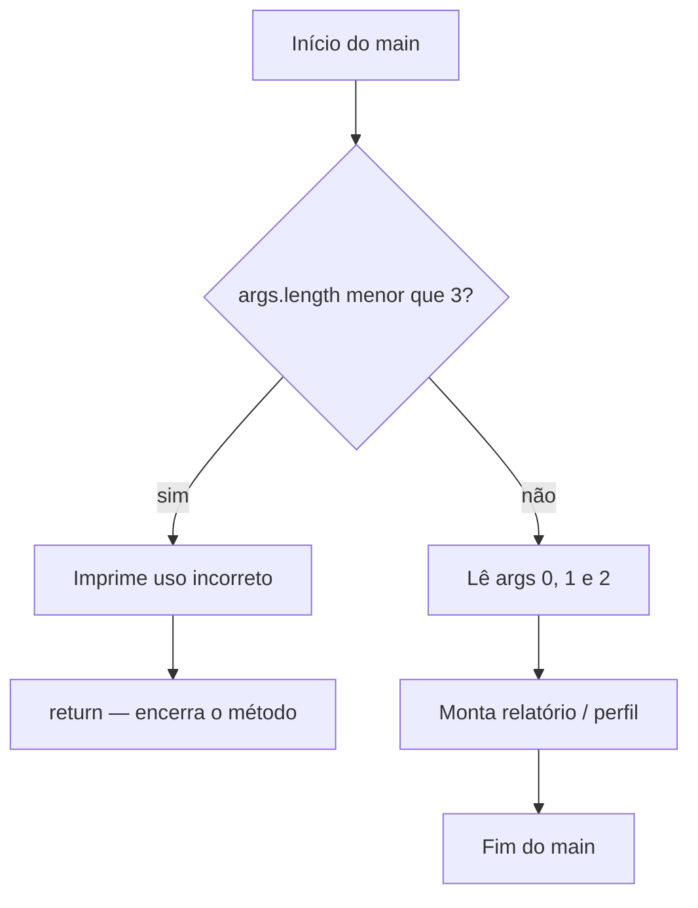

## Visão Geral do Conceito

Até aqui, os programas Java da disciplina **sempre percorriam o mesmo caminho**: o <mark style="background-color: #242424; padding: 2px 4px; border-radius: 3px; color: inherit;">`main`</mark> começa, executa instrução após instrução e termina. O valor digitado pelo usuário quase não muda o fluxo — só muda o resultado impresso.

Sistemas reais precisam **decidir**:

- banco: só permite saque se houver saldo;
- academia: interpreta média como aprovado, recuperação ou reprovado;
- CLI / cadastro: só processa dados se os argumentos obrigatórios existirem.

Esta lição introduz o **controle de fluxo condicional** em Java: a estrutura <mark style="background-color: #242424; padding: 2px 4px; border-radius: 3px; color: inherit;">`if`</mark> / <mark style="background-color: #242424; padding: 2px 4px; border-radius: 3px; color: inherit;">`else`</mark>, operadores de comparação, o tipo <mark style="background-color: #242424; padding: 2px 4px; border-radius: 3px; color: inherit;">`boolean`</mark>, a negação lógica <mark style="background-color: #242424; padding: 2px 4px; border-radius: 3px; color: inherit;">`!`</mark>, o early <mark style="background-color: #242424; padding: 2px 4px; border-radius: 3px; color: inherit;">`return`</mark> e o **operador ternário**.

> **Problema central:** sem decisão, o programa não consegue **bloquear** caminhos inválidos nem **escolher** mensagens/comportamentos diferentes.

**Lacuna de fonte:** não há pasta dedicada de slides/PDF em `downloads/documents` para Fundamentos Java (`documents_dir: null` no mapa). Conteúdo reconstruído da transcrição `Aula_05_-_06082026.bin` (prof. Elberth Moraes). Operadores lógicos <mark style="background-color: #242424; padding: 2px 4px; border-radius: 3px; color: inherit;">`&&`</mark> e <mark style="background-color: #242424; padding: 2px 4px; border-radius: 3px; color: inherit;">`||`</mark> **não foram ensinados nesta aula** — apenas comparação, boolean e <mark style="background-color: #242424; padding: 2px 4px; border-radius: 3px; color: inherit;">`!`</mark> / <mark style="background-color: #242424; padding: 2px 4px; border-radius: 3px; color: inherit;">`!=`</mark>.

## Modelo Mental

### Do trilho único ao bifurcador

Pense no programa sequencial como um **trilho de trem** sem desvio: a composição passa por todas as estações na mesma ordem.

O <mark style="background-color: #242424; padding: 2px 4px; border-radius: 3px; color: inherit;">`if`</mark> é um **bifurcador**:

1. você formula uma **pergunta** (expressão que resulta em verdadeiro ou falso);
2. se a resposta for verdadeira → executa o bloco do <mark style="background-color: #242424; padding: 2px 4px; border-radius: 3px; color: inherit;">`if`</mark>;
3. se for falsa → ou segue o código abaixo, ou entra no <mark style="background-color: #242424; padding: 2px 4px; border-radius: 3px; color: inherit;">`else`</mark> (caminho alternativo).

### Três peças de uma condição simples

Na aula, a condição “clássica” tem três partes:

| Peça | Exemplo | Papel |
|------|---------|--------|
| Variável / expressão | <mark style="background-color: #242424; padding: 2px 4px; border-radius: 3px; color: inherit;">`args.length`</mark>, <mark style="background-color: #242424; padding: 2px 4px; border-radius: 3px; color: inherit;">`altura`</mark>, <mark style="background-color: #242424; padding: 2px 4px; border-radius: 3px; color: inherit;">`professor`</mark> | o que se observa |
| Operador | <mark style="background-color: #242424; padding: 2px 4px; border-radius: 3px; color: inherit;">`<`</mark>, <mark style="background-color: #242424; padding: 2px 4px; border-radius: 3px; color: inherit;">`==`</mark>, <mark style="background-color: #242424; padding: 2px 4px; border-radius: 3px; color: inherit;">`!=`</mark> | como se compara |
| Valor | <mark style="background-color: #242424; padding: 2px 4px; border-radius: 3px; color: inherit;">`3`</mark>, <mark style="background-color: #242424; padding: 2px 4px; border-radius: 3px; color: inherit;">`true`</mark> | referência da regra |

Com <mark style="background-color: #242424; padding: 2px 4px; border-radius: 3px; color: inherit;">`boolean`</mark>, a “comparação com true” pode desaparecer: a própria variável **já é** a pergunta.

### Validar antes de usar

A ideia de engenharia mais importante da aula:

> **Antes de usar um dado, verifique se ele existe (e se está no formato esperado).**

No caso de <mark style="background-color: #242424; padding: 2px 4px; border-radius: 3px; color: inherit;">`String[] args`</mark>: se você acessa <mark style="background-color: #242424; padding: 2px 4px; border-radius: 3px; color: inherit;">`args[0]`</mark> sem checar o tamanho, a JVM lança <mark style="background-color: #242424; padding: 2px 4px; border-radius: 3px; color: inherit;">`ArrayIndexOutOfBoundsException`</mark> (na aula: *Index out of bounds*). O <mark style="background-color: #242424; padding: 2px 4px; border-radius: 3px; color: inherit;">`if`</mark> cria uma **barreira** antes do erro.



## Mecânica Central

### Sintaxe do if em Java

Em Java, o bloco fica entre chaves <mark style="background-color: #242424; padding: 2px 4px; border-radius: 3px; color: inherit;">`{ }`</mark> e a condição fica entre parênteses:

```java
if (condicao) {
    // executa se condicao for true
} else {
    // executa se condicao for false
}
```

A condição deve ser (ou resultar em) <mark style="background-color: #242424; padding: 2px 4px; border-radius: 3px; color: inherit;">`boolean`</mark>. Em Java, **não** se usa `1`/`0` como substituto de verdadeiro/falso — isso são <mark style="background-color: #242424; padding: 2px 4px; border-radius: 3px; color: inherit;">`int`</mark>.

### Operadores de comparação usados na aula

| Operador | Significado | Exemplo da aula |
|----------|-------------|-----------------|
| <mark style="background-color: #242424; padding: 2px 4px; border-radius: 3px; color: inherit;">`<`</mark> | menor que | <mark style="background-color: #242424; padding: 2px 4px; border-radius: 3px; color: inherit;">`args.length < 3`</mark> |
| <mark style="background-color: #242424; padding: 2px 4px; border-radius: 3px; color: inherit;">`==`</mark> | igual (comparação) | <mark style="background-color: #242424; padding: 2px 4px; border-radius: 3px; color: inherit;">`args.length == 3`</mark> |
| <mark style="background-color: #242424; padding: 2px 4px; border-radius: 3px; color: inherit;">`!=`</mark> | diferente | <mark style="background-color: #242424; padding: 2px 4px; border-radius: 3px; color: inherit;">`salario != 1000`</mark> (ilustrativo) |
| <mark style="background-color: #242424; padding: 2px 4px; border-radius: 3px; color: inherit;">`>`</mark> | maior que | salário / altura (exemplos orais) |

> **Regra:** <mark style="background-color: #242424; padding: 2px 4px; border-radius: 3px; color: inherit;">`=`</mark> atribui; <mark style="background-color: #242424; padding: 2px 4px; border-radius: 3px; color: inherit;">`==`</mark> compara. Confundir os dois é erro clássico de quem vem de outras linguagens ou de matemática informal.

### Validação de argumentos com if

Programa que espera três argumentos (nome, profissão, instituição):

```java
public class Fundamentos {
    public static void main(String[] args) {
        if (args.length < 3) {
            System.out.println("Uso incorreto");
            return; // interrompe o main — não acessa args[i]
        }

        String nome = args[0];
        String profissao = args[1];
        String instituicao = args[2];

        System.out.println(nome);
        System.out.println(profissao);
        System.out.println(instituicao);
    }
}
```

Pontos mecânicos:

- <mark style="background-color: #242424; padding: 2px 4px; border-radius: 3px; color: inherit;">`args.length`</mark> é a **propriedade** (campo) com o tamanho do vetor — não é método com `()`.
- Índices válidos com length 3: `0`, `1`, `2`.
- Sem o <mark style="background-color: #242424; padding: 2px 4px; border-radius: 3px; color: inherit;">`return`</mark> (ou um <mark style="background-color: #242424; padding: 2px 4px; border-radius: 3px; color: inherit;">`else`</mark> envolvendo o resto), o programa pode imprimir “Uso incorreto” e **ainda assim** cair nas linhas que acessam `args[0]` — e a exceção volta.

Forma equivalente com <mark style="background-color: #242424; padding: 2px 4px; border-radius: 3px; color: inherit;">`else`</mark> (caminho positivo no else):

```java
if (args.length < 3) {
    System.out.println("Uso incorreto");
} else {
    String nome = args[0];
    // ...
}
```

Ou invertendo a condição:

```java
if (args.length == 3) {
    // caminho feliz
} else {
    System.out.println("Uso incorreto");
}
```

A aula mostrou que vários `if` separados funcionam, mas o segundo teste pode ser **redundante** (se já sabemos que `length < 3`, não precisamos testar de novo `length == 3` no mesmo fluxo). Preferir **um** teste + <mark style="background-color: #242424; padding: 2px 4px; border-radius: 3px; color: inherit;">`else`</mark> ou early <mark style="background-color: #242424; padding: 2px 4px; border-radius: 3px; color: inherit;">`return`</mark>.

### else if (menção)

O professor mostrou <mark style="background-color: #242424; padding: 2px 4px; border-radius: 3px; color: inherit;">`else if`</mark> para faixas (“até 5 / de 6 a 10 / …”) e deixou para aprofundar depois. Sintaxe:

```java
if (valor < 3) {
    // faixa A
} else if (valor > 50) {
    // faixa B
} else {
    // restante
}
```

> **Não coberto em profundidade nesta fonte:** cadeias longas de faixas etárias e decisões compostas com <mark style="background-color: #242424; padding: 2px 4px; border-radius: 3px; color: inherit;">`&&`</mark> / <mark style="background-color: #242424; padding: 2px 4px; border-radius: 3px; color: inherit;">`||`</mark> — ver lição seguinte ([[condicionais-faixas-etarias-operador-ternario-java]]).

### boolean, ! e boa prática

No perfil formatado, a variável <mark style="background-color: #242424; padding: 2px 4px; border-radius: 3px; color: inherit;">`professor`</mark> (tipo lógico) controla uma linha extra do relatório:

```java
boolean professor = true;

if (professor) {
    System.out.println("também atuo como professor");
} else {
    System.out.println("não atuo como professor");
}
```

Boas práticas da aula:

- evitar <mark style="background-color: #242424; padding: 2px 4px; border-radius: 3px; color: inherit;">`if (professor == true)`</mark>;
- para o caso falso, preferir <mark style="background-color: #242424; padding: 2px 4px; border-radius: 3px; color: inherit;">`if (!professor)`</mark> em vez de <mark style="background-color: #242424; padding: 2px 4px; border-radius: 3px; color: inherit;">`professor == false`</mark>.

O <mark style="background-color: #242424; padding: 2px 4px; border-radius: 3px; color: inherit;">`!`</mark> é o **NOT** lógico: inverte verdadeiro ↔ falso.

O <mark style="background-color: #242424; padding: 2px 4px; border-radius: 3px; color: inherit;">`!=`</mark> (“diferente”) combina a ideia de negação com igualdade: “não é igual”. Em algumas linguagens a sintaxe muda; em Java o padrão é <mark style="background-color: #242424; padding: 2px 4px; border-radius: 3px; color: inherit;">`!=`</mark>.

### Operador ternário

Quando as duas ramificações só diferem por um **valor** (ex.: `"também"` vs `"não"`), a aula apresentou o ternário — análogo ao `SE` do Excel:

```java
boolean professor = true;
String situacao = professor ? "também" : "não";
System.out.println(situacao + " atuo como professor");
```

Leitura: **condição `?` valorSeTrue `:` valorSeFalse**.

> **Cuidado:** ternários aninhados (como `SE` dentro de `SE` no Excel) ficam ilegíveis. Para lógica grande, use <mark style="background-color: #242424; padding: 2px 4px; border-radius: 3px; color: inherit;">`if`</mark> / <mark style="background-color: #242424; padding: 2px 4px; border-radius: 3px; color: inherit;">`else`</mark>.

### Early return vs barreira com else

Duas estratégias vistas:

1. **Barreira + return:** se inválido, mensagem e sai do <mark style="background-color: #242424; padding: 2px 4px; border-radius: 3px; color: inherit;">`main`</mark>; o código “feliz” fica linear abaixo.
2. **if/else:** o caminho feliz fica no <mark style="background-color: #242424; padding: 2px 4px; border-radius: 3px; color: inherit;">`else`</mark> (ou no `if` positivo).

O professor comentou que, em outros métodos, <mark style="background-color: #242424; padding: 2px 4px; border-radius: 3px; color: inherit;">`return`</mark> normalmente **devolve um valor**; no `void main`, o `return;` vazio só **encerra**. Também houve menção rápida a lançar exceção (`IllegalArgumentException` / argumentos inválidos) — tratamento elegante de exceções fica para aulas futuras.

## Uso Prático

### 1) Guard clause em CLI de cadastro

Cenário ADS: job de lote recebe `nome profissão instituição` via argumentos. Sem validação, a pipeline quebra com stack trace; com validação, falha de forma controlada.

```java
public class CadastroCli {
    public static void main(String[] args) {
        if (args.length < 3) {
            System.out.println("Uso: java CadastroCli <nome> <profissao> <instituicao>");
            return;
        }

        System.out.println("Nome: " + args[0]);
        System.out.println("Profissão: " + args[1]);
        System.out.println("Instituição: " + args[2]);
    }
}
```

Na IDE (Eclipse/IntelliJ), os argumentos se configuram em **Run Configurations → Arguments** (espaço separa cada `args[i]`). Isso substitui a linha de comando `java CadastroCli Ana Dev Infnet`.

### 2) Relatório de perfil com flag booleana

```java
public class PerfilFormatado {
    public static void main(String[] args) {
        String nome = "Elberth Moraes";
        String papel = "programador";
        boolean professor = true;

        System.out.println("Meu nome é " + nome);
        System.out.println("Sou " + papel);

        if (professor) {
            System.out.println("também atuo como professor");
        } else {
            System.out.println("não atuo como professor");
        }
    }
}
```

Teste **os dois lados** da condição (`true` e `false`) — hábito que a aula liga a testes unitários futuros.

### 3) Mesma mensagem com ternário

```java
boolean professor = false;
String prefixo = professor ? "também" : "não";
System.out.println(prefixo + " atuo como professor");
```

Use quando houver **uma** decisão simples que produz um valor. Mantenha o `if` quando houver vários comandos por ramo.

### Organização de projeto (contexto da aula)

A aula também migrou o trabalho para IDE com **Workspace**, **Java Project**, pasta <mark style="background-color: #242424; padding: 2px 4px; border-radius: 3px; color: inherit;">`src`</mark> e **pacotes** no estilo domínio invertido (`br.edu.infnet.fundamentos`). Isso não altera a sintaxe do `if`, mas muda onde as classes vivem e como se executa (Run as → Java Application). O controle de fluxo entra exatamente quando se abre código legado (calculadora, média, perfil) e se pergunta: “e se o dado for inválido?”.

## Erros Comuns

1. **Acessar `args[i]` sem checar `args.length`**  
   **Sintoma:** <mark style="background-color: #242424; padding: 2px 4px; border-radius: 3px; color: inherit;">`ArrayIndexOutOfBoundsException`</mark> na linha do acesso.  
   **Correção:** `if (args.length < n) { ...; return; }` antes de ler índices.

2. **Imprimir “uso incorreto” e continuar o fluxo**  
   **Sintoma:** mensagem de erro seguida da mesma exceção de índice.  
   **Correção:** <mark style="background-color: #242424; padding: 2px 4px; border-radius: 3px; color: inherit;">`return;`</mark> no ramo inválido **ou** colocar o caminho feliz no <mark style="background-color: #242424; padding: 2px 4px; border-radius: 3px; color: inherit;">`else`</mark>.

3. **Usar `<= 3` em vez de `< 3` para três argumentos obrigatórios**  
   **Sintoma:** programa rejeita o caso válido (length == 3).  
   **Correção:** inválido é `length < 3`.

4. **Confundir `=` com `==`**  
   **Sintoma:** código não expressa o teste; em boolean às vezes “parece funcionar” com atribuição acidental — em outros tipos, nem compila.  
   **Correção:** comparação com <mark style="background-color: #242424; padding: 2px 4px; border-radius: 3px; color: inherit;">`==`</mark>, <mark style="background-color: #242424; padding: 2px 4px; border-radius: 3px; color: inherit;">`!=`</mark>, `<`, `>`, etc.

5. **Escrever `if (professor == true)` / `== false` por hábito**  
   **Sintoma:** código verboso e pouco idiomático.  
   **Correção:** `if (professor)` e `if (!professor)`.

6. **Tratar `boolean` como 1/0**  
   **Sintoma:** expectativa de C/outras linguagens; em Java, `1` é `int`, não condição.  
   **Correção:** usar <mark style="background-color: #242424; padding: 2px 4px; border-radius: 3px; color: inherit;">`true`</mark> / <mark style="background-color: #242424; padding: 2px 4px; border-radius: 3px; color: inherit;">`false`</mark>.

7. **Ternário aninhado ilegível**  
   **Sintoma:** ninguém no time (nem você em uma semana) entende a expressão.  
   **Correção:** voltar para <mark style="background-color: #242424; padding: 2px 4px; border-radius: 3px; color: inherit;">`if`</mark> / <mark style="background-color: #242424; padding: 2px 4px; border-radius: 3px; color: inherit;">`else`</mark> / <mark style="background-color: #242424; padding: 2px 4px; border-radius: 3px; color: inherit;">`else if`</mark>.

## Visão Geral de Debugging

Quando a condição “não entra” ou “entra sempre”:

1. **Imprima a expressão** antes do if: `System.out.println(args.length);` ou o valor do boolean.
2. **Teste os dois ramos** (dados válidos e inválidos; `true` e `false`).
3. **Leia a stack trace:** classe, método e **número da linha** apontam o acesso ilegal a array.
4. Na IDE, use **Run Configurations** para garantir que os argumentos realmente existem no teste (argumentos vazios ≠ “esqueci de digitar no chat”).
5. Confirme se há <mark style="background-color: #242424; padding: 2px 4px; border-radius: 3px; color: inherit;">`return`</mark> / <mark style="background-color: #242424; padding: 2px 4px; border-radius: 3px; color: inherit;">`else`</mark> — senão o fluxo “continua depois do erro tratado”.
6. Debug passo a passo (mencionado na aula) ajuda a ver cada linha; para esta etapa, print + dois cenários de teste já resolvem a maioria dos casos.

<details>
<summary>Checklist rápido de condição booleana</summary>

- A expressão dentro do `if (...)` é `boolean`?
- Comparação usa `==` e não `=`?
- Para arrays, `length` foi checado antes do índice?
- Ambos os ramos (true/false) foram executados pelo menos uma vez?

</details>

## Principais Pontos

- Programas reais **bifurcam**; sequência pura não basta.
- <mark style="background-color: #242424; padding: 2px 4px; border-radius: 3px; color: inherit;">`if`</mark> avalia uma condição <mark style="background-color: #242424; padding: 2px 4px; border-radius: 3px; color: inherit;">`boolean`</mark> e executa um bloco.
- <mark style="background-color: #242424; padding: 2px 4px; border-radius: 3px; color: inherit;">`else`</mark> cobre o caminho complementar; <mark style="background-color: #242424; padding: 2px 4px; border-radius: 3px; color: inherit;">`else if`</mark> encadeia faixas (visão inicial nesta aula).
- <mark style="background-color: #242424; padding: 2px 4px; border-radius: 3px; color: inherit;">`=`</mark> atribui; <mark style="background-color: #242424; padding: 2px 4px; border-radius: 3px; color: inherit;">`==`</mark> / <mark style="background-color: #242424; padding: 2px 4px; border-radius: 3px; color: inherit;">`!=`</mark> / relacionais comparam.
- Valide <mark style="background-color: #242424; padding: 2px 4px; border-radius: 3px; color: inherit;">`args.length`</mark> **antes** de usar <mark style="background-color: #242424; padding: 2px 4px; border-radius: 3px; color: inherit;">`args[i]`</mark>.
- Early <mark style="background-color: #242424; padding: 2px 4px; border-radius: 3px; color: inherit;">`return`</mark> evita executar código após falha de pré-condição.
- Em boolean: `if (flag)` e `if (!flag)` — não force `== true/false`.
- Ternário (`? :`) resume decisão → valor; abuse vira ilegibilidade.
- <mark style="background-color: #242424; padding: 2px 4px; border-radius: 3px; color: inherit;">`&&`</mark> / <mark style="background-color: #242424; padding: 2px 4px; border-radius: 3px; color: inherit;">`||`</mark>: **não cobertos** nesta fonte.

## Preparação para Prática

Antes do laboratório, você deve conseguir:

1. Escrever um `if` / `else` com chaves e condição clara.
2. Validar tamanho de um vetor de argumentos e interromper o fluxo inválido.
3. Usar um `boolean` como condição e aplicar negação com `!`.
4. Escolher entre `if/else` e ternário para uma mensagem binária.
5. Explicar por que testar os dois lados da condição reduz bugs.

O editor integrado do ISS usa JavaScript; os exercícios **espelham a lógica Java** da aula (args, boolean, early return, ternário). Nos exemplos do corpo, continue pensando e escrevendo em Java na sua IDE.

## Laboratório de Prática

### Easy — Validar quantidade de argumentos

**Contexto:** endpoint interno de CLI recebe `args` como array de strings (simulação de `String[] args`). Se houver menos de 3 itens, retorne `"Uso incorreto"`; caso contrário, retorne os três campos unidos por `|`.

```javascript
function validarArgsCadastro(args) {
  // Espelho Java: if (args.length < 3) { ...; return; }
  // TODO: se length < 3, retornar "Uso incorreto"
  // TODO: senão retornar args[0] + "|" + args[1] + "|" + args[2]
  return "";
}

console.log(validarArgsCadastro([]));
console.log(validarArgsCadastro(["Ana", "Dev", "Infnet"]));
```

### Medium — Relatório com flag booleana

**Contexto:** gerador de linha de perfil profissional. Recebe `nome`, `papel` e `ehProfessor`. Sempre devolve duas linhas fixas; a terceira depende do boolean (como no perfil da aula).

```javascript
function linhaPerfilProfessor(nome, papel, ehProfessor) {
  // Espelho Java: if (professor) { ... } else { ... }
  const linhas = [];
  linhas.push("Meu nome é " + nome);
  linhas.push("Sou " + papel);
  // TODO: se ehProfessor, push "também atuo como professor"
  // TODO: senão, push "não atuo como professor"
  return linhas.join("\n");
}

console.log(linhaPerfilProfessor("Elberth", "programador", true));
console.log(linhaPerfilProfessor("Elberth", "programador", false));
```

### Hard — Guard clause + ternário na mensagem

**Contexto:** job de onboarding. Exige pelo menos 2 argumentos: `nome` e flag textual `"true"`/`"false"` indicando se atua como professor. Se faltar argumento, retorne `"Uso incorreto"` (early return). Se válido, monte **uma** linha usando lógica de ternário: `"{nome}: {também|não} atuo como professor"`.

```javascript
function onboardingMensagem(args) {
  // Espelho Java:
  // if (args.length < 2) { return "Uso incorreto"; }
  // boolean professor = Boolean.parseBoolean(args[1]); // aqui: args[1] === "true"
  // String prefixo = professor ? "também" : "não";
  // TODO: validar length < 2
  // TODO: ler nome = args[0], professor = (args[1] === "true")
  // TODO: montar com ternário (condição ? "também" : "não")
  return "";
}

console.log(onboardingMensagem(["Ana"]));
console.log(onboardingMensagem(["Ana", "true"]));
console.log(onboardingMensagem(["Ana", "false"]));
```

<!-- CONCEPT_EXTRACTION
concepts:
  - controle de fluxo / decisão
  - if
  - else
  - else if (introdução)
  - operadores de comparação (<, ==, !=, >)
  - = vs ==
  - boolean true/false
  - operador lógico NOT (!)
  - args.length e validação prévia
  - ArrayIndexOutOfBoundsException
  - early return no main
  - operador ternário (? :)
  - Run Configurations / argumentos na IDE
  - pacotes e workspace (contexto de ambiente)
skills:
  - Validar pré-condições com if antes de usar dados
  - Escrever if/else com chaves em Java
  - Distinguir atribuição (=) de comparação (==)
  - Usar boolean como condição idiomática e aplicar !
  - Interromper fluxo inválido com return
  - Escolher ternário apenas para decisões simples valor-a-valor
  - Testar ambos os ramos de uma condição
examples:
  - if-args-length-uso-incorreto
  - early-return-main-validacao
  - if-else-boolean-professor
  - not-logico-exclamacao
  - ternario-prefixo-tambem-nao
-->

<!-- EXERCISES_JSON
[
  {
    "id": "jv05-validar-args-cadastro",
    "slug": "jv05-validar-args-cadastro",
    "difficulty": "easy",
    "title": "Validar quantidade de argumentos",
    "discipline": "fundamentos-java",
    "editorLanguage": "javascript",
    "tags": ["java", "if", "args", "validacao"],
    "summary": "Retornar Uso incorreto se args.length < 3; senão juntar os três campos com |."
  },
  {
    "id": "jv05-relatorio-flag-boolean",
    "slug": "jv05-relatorio-flag-boolean",
    "difficulty": "medium",
    "title": "Relatório com flag booleana",
    "discipline": "fundamentos-java",
    "editorLanguage": "javascript",
    "tags": ["java", "if-else", "boolean"],
    "summary": "Montar relatório de perfil cuja terceira linha depende de ehProfessor true/false."
  },
  {
    "id": "jv05-guard-ternario-onboarding",
    "slug": "jv05-guard-ternario-onboarding",
    "difficulty": "hard",
    "title": "Guard clause + ternário na mensagem",
    "discipline": "fundamentos-java",
    "editorLanguage": "javascript",
    "tags": ["java", "return", "ternario", "boolean"],
    "summary": "Validar dois args, interpretar flag true/false e montar mensagem com ternário."
  }
]
-->

<!--
lessons.json (orquestrador — NÃO editar neste worker):
  discipline: fundamentos-java
  slug: controle-fluxo-if-java
  title: Controle de fluxo com if e operadores lógicos
  order: 5
  file: content/fundamentos-java/aula-05-controle-fluxo-if-java.md
-->
