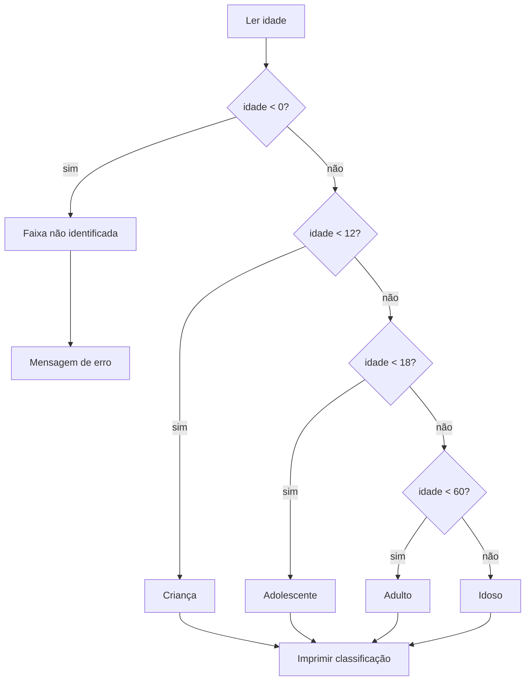

## Visão Geral do Conceito

Programas reais não só calculam: eles **decidem**. Classificar a faixa etária de um cadastro, informar se o aluno foi aprovado ou está em recuperação, impedir divisão por zero na calculadora e **repetir** a leitura enquanto o usuário digita lixo — tudo isso é controle de fluxo.

Nesta lição você aprofunda o <mark style="background-color: #242424; padding: 2px 4px; border-radius: 3px; color: inherit;">`if`</mark> visto na aula anterior e organiza decisões em **faixas exclusivas** com <mark style="background-color: #242424; padding: 2px 4px; border-radius: 3px; color: inherit;">`else if`</mark> / <mark style="background-color: #242424; padding: 2px 4px; border-radius: 3px; color: inherit;">`else`</mark>. Também conecta o <mark style="background-color: #242424; padding: 2px 4px; border-radius: 3px; color: inherit;">operador ternário</mark> (atalho de if/else binário), o **escopo** das variáveis, a proteção de operações perigosas e o primeiro uso prático de <mark style="background-color: #242424; padding: 2px 4px; border-radius: 3px; color: inherit;">`do-while`</mark> com <mark style="background-color: #242424; padding: 2px 4px; border-radius: 3px; color: inherit;">`Scanner`</mark>.

> **Problema que resolve:** transformar regras de negócio (“criança até 11”, “média ≥ 7 aprova”, “não dividir por zero”, “nome não pode ser vazio”) em caminhos de código previsíveis, testáveis e sem mensagens duplicadas.

**Lacuna de fontes:** não há pasta de slides/PDF desta disciplina em `downloads/documents`. O material foi reconstruído a partir da transcrição WebVTT `Aula_06_-_07082026.bin` (prof. Elberth Moraes). O código-fonte exato das classes da aula não está no repositório; os exemplos abaixo refletem o algoritmo ditado oralmente.

---

## Modelo Mental

Pense em um **guichê de triagem** com regras em ordem:

1. A pergunta mais restritiva vem primeiro (idade inválida? nome em branco? divisor zero?).
2. Se a resposta “fecha o caso”, você **não** faz as perguntas seguintes.
3. O que sobra no final vai para o <mark style="background-color: #242424; padding: 2px 4px; border-radius: 3px; color: inherit;">`else`</mark> — o “resto do mundo”.



**Analogia útil:** cada <mark style="background-color: #242424; padding: 2px 4px; border-radius: 3px; color: inherit;">`else if`</mark> é uma fila que só abre se a fila anterior rejeitou a pessoa. Por isso, depois de “não é menor que 12”, você **já sabe** que a idade é ≥ 12 — não precisa repetir esse teste.

O <mark style="background-color: #242424; padding: 2px 4px; border-radius: 3px; color: inherit;">ternário</mark> é o mesmo guichê com **só duas portas** (sim/não) compactadas numa expressão:

```text
resultado = condição ? valorSeVerdadeiro : valorSeFalso;
```

---

## Mecânica Central

### 1. Cadeia `if` / `else if` / `else` (faixas exclusivas)

Regras usadas na classe `CadastroDePessoa` (faixas da aula):

| Faixa | Condição efetiva na cadeia |
|-------|----------------------------|
| Criança | `idade < 12` |
| Adolescente | `idade < 18` (implícito: já não era `< 12`) |
| Adulto | `idade < 60` (implícito: já não era `< 18`) |
| Idoso | `else` (resto: ≥ 60) |

```java
String faixaEtaria;

if (idade < 0) {
    System.out.println(
        "Impossível definir a faixa etária através da idade informada [" + idade + "]"
    );
} else {
    if (idade < 12) {
        faixaEtaria = "criança";
    } else if (idade < 18) {
        faixaEtaria = "adolescente";
    } else if (idade < 60) {
        faixaEtaria = "adulto";
    } else {
        faixaEtaria = "idoso";
    }
    System.out.println("Classificação: " + faixaEtaria);
}
```

> **Regra:** em faixas ordenadas, teste só o **próximo limite**. A exclusividade vem do encadeamento, não de escrever `idade >= 12 && idade < 18` em todo ramo (embora essa forma também seja válida).

### 2. Uma variável, uma impressão

Em vez de quatro <mark style="background-color: #242424; padding: 2px 4px; border-radius: 3px; color: inherit;">`System.out.println`</mark> quase iguais, a aula guarda o rótulo em <mark style="background-color: #242424; padding: 2px 4px; border-radius: 3px; color: inherit;">`faixaEtaria`</mark> e imprime uma vez. Isso reduz duplicação e prepara o trecho para virar método depois (“emitir faixa etária”).

### 3. Operador ternário (atalho binário)

Quando a decisão tem **exatamente dois** resultados, o ternário substitui um if/else de atribuição. Na trilha da disciplina, ele apareceu na aula anterior (campo booleano / perfil formatado) e é retomado aqui como opção ao if/else simples:

```java
// Equivalente a:
// if (idade >= 18) { status = "maior"; } else { status = "menor"; }
String status = idade >= 18 ? "maior" : "menor";
```

Para **várias** faixas etárias, prefira a cadeia `if / else if / else` — ternários aninhados ficam ilegíveis.

### 4. Escopo de bloco

Em Java, uma variável declarada dentro de `{ ... }` só existe **dentro** desse bloco. Isso aparece com força ao usar <mark style="background-color: #242424; padding: 2px 4px; border-radius: 3px; color: inherit;">`do-while`</mark>:

- A **declaração** (`String nome;`) sobe para um escopo maior.
- A **atribuição** (`nome = scanner.nextLine();`) fica dentro do loop.
- A condição do `while` precisa “enxergar” a variável — logo ela não pode nascer só dentro do `do`.

```java
String nome;
boolean nomeVazio = false;

do {
    System.out.print("Digite o seu nome: ");
    nome = scanner.nextLine();
    nomeVazio = nome.isBlank();
    if (nomeVazio) {
        System.out.println("O nome não pode ficar vazio.");
    }
} while (nomeVazio);

System.out.println("Bom te receber, " + nome);
```

### 5. Inicialização consciente

Tipos numéricos e booleanos de campo têm defaults; **variáveis locais** dentro de métodos precisam ser inicializadas antes do uso. Habito da aula: inicializar <mark style="background-color: #242424; padding: 2px 4px; border-radius: 3px; color: inherit;">`String`</mark> com <mark style="background-color: #242424; padding: 2px 4px; border-radius: 3px; color: inherit;">`null`</mark> (ou `""`) e boolean com <mark style="background-color: #242424; padding: 2px 4px; border-radius: 3px; color: inherit;">`false`</mark> para deixar a intenção explícita.

### 6. Situação acadêmica por média

Mesma mecânica de faixas, outro domínio:

| Situação | Regra |
|----------|--------|
| Aprovado | `media >= 7` |
| Recuperação | `media >= 5` (já não era ≥ 7) |
| Reprovado | `else` (media < 5) |

```java
String situacao;

if (media >= 7.0) {
    situacao = "aprovado";
} else if (media >= 5.0) {
    situacao = "recuperação";
} else {
    situacao = "reprovado";
}
```

Validação de nota fora de `[0, 10]` foi citada como próxima barreira, não implementada em profundidade nesta aula.

### 7. Barreira de divisão por zero

Na classe calculadora, divisão e resto quebram se o segundo operando for `0`. A proteção usa <mark style="background-color: #242424; padding: 2px 4px; border-radius: 3px; color: inherit;">`!=`</mark>:

```java
if (segundo != 0) {
    System.out.println("Divisão: " + (primeiro / segundo));
    System.out.println("Resto: " + (primeiro % segundo));
} else {
    System.out.println("Não é possível dividir por zero");
}
// soma, subtração e multiplicação seguem normalmente
```

### 8. `do-while` e leitura até validar

Uma repetição responde a duas perguntas: **o que** repetir e **até quando**. O <mark style="background-color: #242424; padding: 2px 4px; border-radius: 3px; color: inherit;">`do-while`</mark> executa o corpo **pelo menos uma vez** e só depois testa a condição — ideal para “pedir → ler → validar → pedir de novo”.

Método usado na aula para string vazia / só espaços: <mark style="background-color: #242424; padding: 2px 4px; border-radius: 3px; color: inherit;">`String.isBlank()`</mark> (retorna `boolean`).

Evitar chamar o mesmo método “caro” duas vezes: guarde o boolean numa variável e reutilize no `if` e no `while`.

### 9. `&&` e `||` (primeiro contato com tabela verdade)

Validação de idade no cadastro (limites discutidos na aula: 0 a 120) e altura (maior que 0 e menor que 3):

```java
if (idade < 0 || idade > 120) {
    System.out.println("Informe a idade entre 0 e 120.");
}

if (altura <= 0 || altura >= 3) {
    System.out.println("Informe a altura entre 0 e 3 (exclusive nos extremos inválidos).");
}
```

| Operador | Nome na aula | Entra no `if` quando… |
|----------|--------------|------------------------|
| <mark style="background-color: #242424; padding: 2px 4px; border-radius: 3px; color: inherit;">`&&`</mark> | “e” / “e comercial” | **todas** as partes são verdadeiras |
| <mark style="background-color: #242424; padding: 2px 4px; border-radius: 3px; color: inherit;">`\|\|`</mark> | “ou” / “pipeline” | **pelo menos uma** parte é verdadeira |

Exemplo mental da aula com idade `-5` e rejeição `(idade < 0) || (idade > 120)`: a primeira parte é verdadeira → o `if` dispara. Com `&&`, a segunda parte seria falsa e o erro **não** entraria — comportamento incorreto para essa regra.

---

## Uso Prático

### Cadastro: relatório + classificação

```java
import java.util.Scanner;

public class CadastroDePessoa {
    public static void main(String[] args) {
        Scanner scanner = new Scanner(System.in);

        String nome;
        int idade = 0;
        double altura = 0.0;

        System.out.print("Nome: ");
        nome = scanner.nextLine();

        do {
            System.out.print("Idade (0 a 120): ");
            idade = scanner.nextInt();
            if (idade < 0 || idade > 120) {
                System.out.println("Informe a idade entre 0 e 120.");
            }
        } while (idade < 0 || idade > 120);

        do {
            System.out.print("Altura em metros (ex.: 1.80): ");
            altura = scanner.nextDouble();
            if (altura <= 0 || altura >= 3) {
                System.out.println("Informe a altura maior que 0 e menor que 3.");
            }
        } while (altura <= 0 || altura >= 3);

        System.out.println(
            "Eu sou " + nome + ". Tenho " + idade +
            " anos e " + altura + " metros de altura."
        );

        String faixaEtaria;
        if (idade < 12) {
            faixaEtaria = "criança";
        } else if (idade < 18) {
            faixaEtaria = "adolescente";
        } else if (idade < 60) {
            faixaEtaria = "adulto";
        } else {
            faixaEtaria = "idoso";
        }
        System.out.println("Classificação: " + faixaEtaria);

        // Ternário binário complementar (maioridade civil)
        String maioridade = idade >= 18 ? "maior de idade" : "menor de idade";
        System.out.println("Situação civil (simplificada): " + maioridade);

        scanner.close();
    }
}
```

### Média do aluno → situação

```java
double tp1 = 10, tp2 = 8, tp3 = 6;
double media = (tp1 + tp2 + tp3) / 3.0;

String situacao = media >= 7.0 ? "aprovado"
        : media >= 5.0 ? "recuperação"
        : "reprovado";
// Preferível em produção: cadeia if/else if/else (mais legível que ternário aninhado).

System.out.println("Média: " + media + " | Situação: " + situacao);
```

> Na aula, a situação foi implementada com if/else if/else. O ternário aninhado acima é só demonstração do limite do operador; para três ou mais ramos, mantenha a cadeia explícita.

### Calculadora com guarda

```java
int a = 10;
int b = 0;

System.out.println("Soma: " + (a + b));
System.out.println("Subtração: " + (a - b));
System.out.println("Multiplicação: " + (a * b));

if (b != 0) {
    System.out.println("Divisão: " + (a / b));
    System.out.println("Resto: " + (a % b));
} else {
    System.out.println("Não é possível dividir por zero");
}
```

---

## Erros Comuns

1. **Vários `if` independentes em vez de `else if`**  
   Sintoma: o mesmo valor dispara mais de um rótulo, ou testes redundantes rodam sem necessidade.  
   Correção: encadear com `else if` / `else` quando as faixas forem mutuamente exclusivas.

2. **Condição redundante após um `else if`**  
   Ex.: `else if (idade >= 12 && idade < 18)` logo após `if (idade < 12)`. Funciona, mas o `>= 12` é consequência lógica. Prefira `else if (idade < 18)` quando a ordem estiver garantida.

3. **Idade negativa classificada como criança**  
   Causa: o primeiro teste era só `idade < 12`.  
   Correção: tratar `idade < 0` (ou intervalo completo) **antes** das faixas válidas.

4. **Usar `&&` onde a regra pede `||`**  
   Sintoma: idade `-5` ou `150` “passa” na validação.  
   Correção: rejeitar com `(idade < 0) || (idade > 120)`.

5. **Variável declarada dentro do `do` e usada no `while`**  
   Sintoma: erro de compilação “cannot find symbol”.  
   Correção: declarar no escopo externo; atribuir dentro do loop.

6. **Mensagem de erro impressa sempre**  
   Causa: `println` de validação fora de um `if`.  
   Correção: só emitir feedback quando a condição de inválido for verdadeira.

7. **Chamar `isBlank()` duas vezes sem necessidade**  
   Não é bug, mas a aula destaca o hábito: guardar o boolean e reutilizar — prepara o raciocínio para métodos caros.

8. **Dividir antes de testar o divisor**  
   Sintoma: `ArithmeticException` / erro em tempo de execução na linha da divisão ou do resto.  
   Correção: `if (segundo != 0) { ... } else { mensagem }`.

9. **Ternário aninhado para quatro faixas**  
   Sintoma: código ilegível.  
   Correção: cadeia if/else if/else (ou, no futuro, outras estruturas — `switch` fica para a próxima aula).

---

## Visão Geral de Debugging

Quando a classificação “parece errada”, siga esta ordem:

1. **Imprima o valor bruto** (`idade`, `media`, `b`) antes do `if`. Confirme o que entrou.
2. **Simule a cadeia no papel** com um valor de fronteira: `11`, `12`, `17`, `18`, `59`, `60`, `-1`.
3. **Verifique exclusividade:** se mudou de vários `if` para `else if`, um único ramo deve vencer.
4. **Erros de escopo:** se o compilador não acha a variável, marque as `{ }` e veja onde ela nasceu.
5. **Loops que “não param”:** a condição do `while` precisa eventualmente ficar falsa; se você forçou `while (true)` sem saída, é loop infinito.
6. **Divisão por zero:** o stack trace aponta a linha — confirme se a guarda `!= 0` envolve **todas** as operações de divisão/resto.

<details>
<summary>Caso rápido: idade -5 vira criança</summary>

O fluxo entrou em `if (idade < 12)` sem barreira prévia. Inclua `if (idade < 0) { ... } else { /* faixas */ }` ou valide no `do-while` de leitura para nem chegar na classificação com valor inválido.
</details>

---

## Principais Pontos

- Faixas exclusivas usam <mark style="background-color: #242424; padding: 2px 4px; border-radius: 3px; color: inherit;">`if` / `else if` / `else`</mark>; o `else` captura o resto.
- Depois que um teste falha, o próximo limite já carrega a informação do anterior — evite condições redundantes.
- Guarde o rótulo numa variável e imprima uma vez.
- Ternário (`? :`) é atalho de if/else **binário**; não force em cadeias longas.
- Escopo = vida da variável entre as `{ }` onde ela foi declarada.
- <mark style="background-color: #242424; padding: 2px 4px; border-radius: 3px; color: inherit;">`do-while`</mark> = execute primeiro, teste depois — bom para validar entrada.
- <mark style="background-color: #242424; padding: 2px 4px; border-radius: 3px; color: inherit;">`isBlank()`</mark> detecta nome vazio ou só espaços.
- <mark style="background-color: #242424; padding: 2px 4px; border-radius: 3px; color: inherit;">`||`</mark> rejeita intervalo inválido; <mark style="background-color: #242424; padding: 2px 4px; border-radius: 3px; color: inherit;">`&&`</mark> exige todas as partes verdadeiras.
- Proteja divisão/resto com <mark style="background-color: #242424; padding: 2px 4px; border-radius: 3px; color: inherit;">`!= 0`</mark> antes de calcular.
- Regras de negócio (limites de idade, cortes de média) vêm do domínio; o código só as implementa.

**Não coberto em profundidade nesta fonte (prévia da próxima aula):** <mark style="background-color: #242424; padding: 2px 4px; border-radius: 3px; color: inherit;">`switch`</mark>, <mark style="background-color: #242424; padding: 2px 4px; border-radius: 3px; color: inherit;">`for`</mark> com contador, menu interativo da calculadora, tratamento formal de exceções.

---

## Preparação para Prática

Antes do laboratório, você deve conseguir:

1. Escrever uma função/método que devolve a faixa etária a partir da idade, incluindo inválidos.
2. Classificar situação acadêmica com os cortes 7 e 5.
3. Escolher `&&` vs `||` numa validação de intervalo.
4. Explicar por que a declaração de variável sobe de escopo num `do-while`.
5. Usar ternário só onde a decisão for binária.

O editor integrado do ISS usa JavaScript; os desafios abaixo implementam a **mesma lógica** da aula em Java. Nos comentários, a sintaxe Java equivalente aparece como referência.

---

## Laboratório de Prática

### Easy — Classificar faixa etária

**Contexto:** serviço de cadastro de paciente precisa rotular a faixa etária para o relatório clínico simplificado.

**Regras:** `< 0` → `"invalida"`; `< 12` → `"crianca"`; `< 18` → `"adolescente"`; `< 60` → `"adulto"`; caso contrário → `"idoso"`.

```javascript
// Java equivalente: String classificarFaixa(int idade) { ... }

function classificarFaixa(idade) {
  // TODO: implementar cadeia if / else if / else conforme as regras
  return "TODO";
}

// Smoke tests (não altere)
console.log(classificarFaixa(10));   // esperado: crianca
console.log(classificarFaixa(15));   // esperado: adolescente
console.log(classificarFaixa(40));   // esperado: adulto
console.log(classificarFaixa(70));   // esperado: idoso
console.log(classificarFaixa(-3));   // esperado: invalida
```

### Medium — Situação acadêmica + ternário de destaque

**Contexto:** boletim automático de um LMS. Além da situação, o sistema marca se a média está “na meta” (≥ 7) com ternário.

```javascript
// Java: if/else if/else para situacao; ternário para naMeta

function avaliarBoletim(media) {
  let situacao = "reprovado";
  // TODO: situacao = aprovado | recuperacao | reprovado
  // cortes: >= 7 aprovado; >= 5 recuperacao; senão reprovado

  const naMeta = false; // TODO: usar ternário media >= 7 ? true : false (ou expressão equivalente)

  return { media, situacao, naMeta };
}

console.log(avaliarBoletim(8));   // aprovado, naMeta true
console.log(avaliarBoletim(6));   // recuperacao, naMeta false
console.log(avaliarBoletim(4));   // reprovado, naMeta false
```

### Hard — Validar entrada e proteger divisão

**Contexto:** microserviço interno recebe `idade`, `altura` e dois operandos de uma operação financeira simplificada (razão `a/b`). Você deve:

1. Validar idade com `||` no intervalo `[0, 120]`.
2. Validar altura com `||` no intervalo `(0, 3)`.
3. Se válidos, calcular `a / b` somente se `b !== 0`; senão retornar mensagem de erro.
4. Incluir a faixa etária reutilizando a mesma regra do Easy.

```javascript
function processarCadastroOperacao({ idade, altura, a, b }) {
  const erros = [];

  // TODO: se idade < 0 || idade > 120 → erros.push("idade fora do intervalo")
  // TODO: se altura <= 0 || altura >= 3 → erros.push("altura fora do intervalo")

  let razao = null;
  let mensagemDivisao = null;
  // TODO: se b !== 0 → razao = a / b; senão mensagemDivisao = "Não é possível dividir por zero"

  let faixa = null;
  // TODO: se não houver erros de idade, classificar faixa (mesmas regras do Easy)

  return {
    valido: erros.length === 0,
    erros,
    faixa,
    razao,
    mensagemDivisao
  };
}

console.log(processarCadastroOperacao({ idade: 47, altura: 1.8, a: 10, b: 2 }));
console.log(processarCadastroOperacao({ idade: -5, altura: 1.8, a: 10, b: 0 }));
console.log(processarCadastroOperacao({ idade: 25, altura: 0, a: 10, b: 5 }));
```

---

<!-- LESSONS_JSON_META
discipline: fundamentos-java
slug: condicionais-faixas-etarias-operador-ternario-java
title: Condicionais, faixas etárias e operador ternário
order: 6
file: content/fundamentos-java/aula-06-condicionais-faixas-etarias-operador-ternario-java.md
NOTE: lessons.json / search-index.json NÃO editados nesta missão (integração serial pelo orquestrador).
-->

<!-- CONCEPT_EXTRACTION
concepts:
  - if / else if / else
  - faixas etárias exclusivas
  - operador ternário (? :)
  - variável de resultado da decisão
  - escopo de bloco
  - inicialização de variáveis locais
  - situação acadêmica por média
  - proteção divisão por zero (!=)
  - do-while
  - String.isBlank()
  - operadores lógicos && e ||
  - tabela verdade (introdução)
  - regras de negócio em validação de entrada
skills:
  - Encadear faixas exclusivas sem condições redundantes
  - Validar idade/altura com || em intervalos
  - Guardar classificação em variável e imprimir uma vez
  - Aplicar ternário em decisões binárias
  - Declarar variáveis no escopo correto para do-while
  - Repetir leitura até isBlank() ser falso
  - Proteger divisão e resto com teste != 0
  - Classificar situação acadêmica pelos cortes 7 e 5
  - Distinguir && (todas) de || (pelo menos uma) na tabela verdade
examples:
  - cadastro-faixa-etaria-if-else-if
  - media-aluno-situacao-academica
  - calculadora-guarda-divisao-por-zero
  - scanner-do-while-isBlank
  - validacao-idade-altura-or
  - ternario-maioridade
-->

<!-- EXERCISES_JSON
[
  {
    "id": "java-aula06-classificar-faixa-etaria",
    "slug": "java-aula06-classificar-faixa-etaria",
    "difficulty": "easy",
    "title": "Classificar faixa etária",
    "discipline": "fundamentos-java",
    "editorLanguage": "javascript",
    "tags": ["java", "condicionais", "if-else", "faixas-etarias"],
    "summary": "Implementar cadeia if/else if/else para criança, adolescente, adulto, idoso e idade inválida."
  },
  {
    "id": "java-aula06-boletim-situacao-ternario",
    "slug": "java-aula06-boletim-situacao-ternario",
    "difficulty": "medium",
    "title": "Situação acadêmica e ternário naMeta",
    "discipline": "fundamentos-java",
    "editorLanguage": "javascript",
    "tags": ["java", "condicionais", "ternario", "media"],
    "summary": "Classificar aprovado/recuperação/reprovado e marcar naMeta com operador ternário."
  },
  {
    "id": "java-aula06-validar-cadastro-divisao",
    "slug": "java-aula06-validar-cadastro-divisao",
    "difficulty": "hard",
    "title": "Validar cadastro e proteger divisão",
    "discipline": "fundamentos-java",
    "editorLanguage": "javascript",
    "tags": ["java", "validacao", "operadores-logicos", "divisao-por-zero"],
    "summary": "Validar idade/altura com ||, classificar faixa e calcular a/b somente se b !== 0."
  }
]
-->
