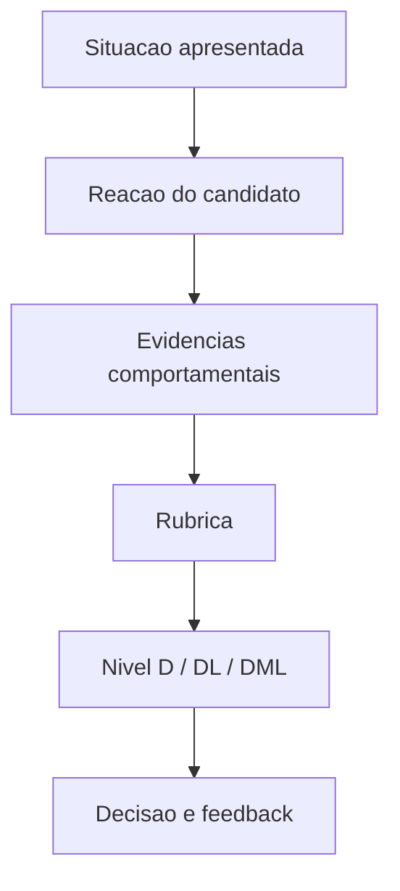

## Visão Geral do Conceito

A aula 08 complementa a preparação do AT com uma camada de avaliação: competências, rubricas e comportamento em processos seletivos. O caso Heineken ilustra como empresas observam reação, desconforto e proatividade.

> **Regra:** esta lição foi reconstruída a partir da transcrição da aula e dos materiais disponíveis no repositório; quando a fonte não cobre um detalhe, isso é declarado como lacuna em vez de ser tratado como fato.

## Modelo Mental

Competência é evidência em ação. Rubrica transforma expectativa vaga em critério observável; entrevista situacional tenta ver como a pessoa reage quando o contexto muda.



## Mecânica Central

- Competências técnicas mostram capacidade de executar tarefas.
- Competências comportamentais mostram como a pessoa age com outras pessoas e pressão.
- Rubricas reduzem subjetividade na avaliação.
- Fit cultural não deve virar desculpa para exclusão arbitrária; precisa de critério claro.

## Uso Prático

Ao preparar seu AT, descreva competências com evidências: projeto feito, problema resolvido, decisão tomada, feedback recebido. Para entrevista, prepare histórias reais usando contexto, ação e resultado.

## Erros Comuns

- Dizer que tem competência sem evidência.
- Confundir rubrica com opinião livre.
- Tratar fit cultural como 'ser igual'.
- Juntar slides e documento do AT sem organizar entregáveis.

## Visão Geral de Debugging

Se sua resposta comportamental parece genérica, procure uma situação específica e detalhe sua ação. Se a rubrica parece injusta, compare o critério com a evidência exigida.

## Principais Pontos

- Competência precisa de evidência.
- Rubrica organiza avaliação.
- Entrevista comportamental testa reação.
- AT também comunica competências.


## Preparação para Prática

Escolha três competências suas e escreva uma evidência real para cada uma.

## Laboratório de Prática
### Easy — Checklist de aplicação
Complete o checklist com ações verificáveis, sem frases vagas.
```markdown
# Checklist

- [ ] TODO: definir objetivo principal
- [ ] TODO: listar evidências ou dados usados
- [ ] TODO: identificar risco principal
- [ ] TODO: definir próxima ação concreta
```
Critérios:
- Usar verbos de ação.
- Evitar recomendações genéricas.
- Conectar cada item a uma evidência da aula.

### Medium — Roteiro de decisão
Preencha o roteiro para orientar uma decisão acadêmica ou profissional.
```markdown
# Roteiro

## Contexto
TODO: descreva a situação.

## Critérios
1. TODO
2. TODO
3. TODO

## Decisão
TODO: escolha e justifique.
```
Critérios:
- Separar contexto de decisão.
- Explicitar critérios.
- Justificar trade-offs.

### Hard — Plano de melhoria
Monte um plano com métrica, ação e revisão posterior.
```markdown
# Plano de melhoria

| Área | Evidência atual | Ação | Como revisar |
|---|---|---|---|
| TODO | TODO | TODO | TODO |
```
Critérios:
- Incluir evidência observável.
- Definir ação pequena e executável.
- Definir forma de revisão.


<!-- CONCEPT_EXTRACTION
concepts:
  - competências
  - rubricas
  - entrevista comportamental
  - fit cultural
  - D DL DML
  - AT
skills:
  - Mapear competências
  - Interpretar rubricas
  - Preparar evidências comportamentais
  - Organizar entrega do AT
examples:
  - caso-heineken-entrevista
  - rubrica-d-dl-dml
  - at-competencias
-->

<!-- EXERCISES_JSON
[
  {
    "id": "competencias-rubricas-entrevista-comportamental-checklist-aplicacao",
    "slug": "competencias-rubricas-entrevista-comportamental-checklist-aplicacao",
    "difficulty": "easy",
    "title": "Checklist de aplicação",
    "discipline": "planejamento-curso-carreira",
    "editorLanguage": "markdown",
    "tags": [
      "planejamento",
      "checklist"
    ],
    "summary": "Transformar os conceitos da aula em uma lista de verificação prática."
  },
  {
    "id": "competencias-rubricas-entrevista-comportamental-roteiro-decisao",
    "slug": "competencias-rubricas-entrevista-comportamental-roteiro-decisao",
    "difficulty": "medium",
    "title": "Roteiro de decisão",
    "discipline": "planejamento-curso-carreira",
    "editorLanguage": "markdown",
    "tags": [
      "planejamento",
      "decisao"
    ],
    "summary": "Criar roteiro para aplicar o conceito em uma situação real."
  },
  {
    "id": "competencias-rubricas-entrevista-comportamental-plano-melhoria",
    "slug": "competencias-rubricas-entrevista-comportamental-plano-melhoria",
    "difficulty": "hard",
    "title": "Plano de melhoria",
    "discipline": "planejamento-curso-carreira",
    "editorLanguage": "markdown",
    "tags": [
      "planejamento",
      "acao"
    ],
    "summary": "Montar um plano curto de melhoria com evidências e revisão."
  }
]
-->

<!-- SOURCE_CONTEXT
canonical_memory: MEMORIES.md
source: downloads/Planejamento_de_Curso_e_Carreira/Aula_08_-_24032026.md
source_sha256: 7987b5af516226139c2e0fe0b4a375767fffbd6df498ecc99aff7d78f2a12860
source: downloads/Planejamento_de_Curso_e_Carreira/Aula_08_-_24032026.vtt
source_sha256: 7448fa18b43f8cc5490838359b2366eb92576149b9c5d2ff240a790726277bca
notes:
  - Sem documento complementar específico no manifest.
-->
