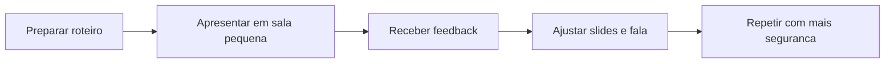

## Visão Geral do Conceito

A aula 09 é majoritariamente prática: organização de salas e rodadas de apresentação. Como há pouca teoria nova, a lição registra o valor pedagógico da dinâmica: ensaio, feedback e segurança progressiva.

> **Regra:** esta lição foi reconstruída a partir da transcrição da aula e dos materiais disponíveis no repositório; quando a fonte não cobre um detalhe, isso é declarado como lacuna em vez de ser tratado como fato.

## Modelo Mental

Apresentar em pares funciona como protótipo: você testa sua fala em ambiente menor antes da entrega final.



## Mecânica Central

- Salas pequenas diminuem pressão social.
- Rodadas curtas forçam foco no essencial.
- Feedback entre pares precisa ser específico: clareza, tempo, slides e conexão com objetivo.
- A dinâmica complementa as aulas de oratória e competências.

## Uso Prático

Depois de cada rodada, registre uma coisa a manter, uma coisa a ajustar e uma dúvida que surgiu. Isso transforma a apresentação em iteração, não em evento único.

## Erros Comuns

- Entrar na sala sem aceitar convite ou sem áudio.
- Dar feedback genérico como 'ficou bom'.
- Usar a prática apenas como presença, sem ajustar nada.
- Mudar tudo sem critério após um comentário isolado.

## Visão Geral de Debugging

Se sua apresentação ficou confusa, peça ao colega para resumir em uma frase o que entendeu. Se ele não conseguir, o roteiro precisa de foco.

## Principais Pontos

- Rodada prática é ensaio seguro.
- Feedback precisa ser específico.
- Ajuste vem após evidência.
- Apresentação melhora por repetição.


## Preparação para Prática

Antes de entrar na sala, tenha roteiro, tempo-alvo e uma pergunta de feedback para seus colegas.

## Laboratório de Prática
### Easy — Checklist de aplicação
Complete o checklist com ações verificáveis, sem frases vagas.
```markdown
# Checklist

- [ ] TODO: definir objetivo principal
- [ ] TODO: listar evidências ou dados usados
- [ ] TODO: identificar risco principal
- [ ] TODO: definir próxima ação concreta
```
Critérios:
- Usar verbos de ação.
- Evitar recomendações genéricas.
- Conectar cada item a uma evidência da aula.

### Medium — Roteiro de decisão
Preencha o roteiro para orientar uma decisão acadêmica ou profissional.
```markdown
# Roteiro

## Contexto
TODO: descreva a situação.

## Critérios
1. TODO
2. TODO
3. TODO

## Decisão
TODO: escolha e justifique.
```
Critérios:
- Separar contexto de decisão.
- Explicitar critérios.
- Justificar trade-offs.

### Hard — Plano de melhoria
Monte um plano com métrica, ação e revisão posterior.
```markdown
# Plano de melhoria

| Área | Evidência atual | Ação | Como revisar |
|---|---|---|---|
| TODO | TODO | TODO | TODO |
```
Critérios:
- Incluir evidência observável.
- Definir ação pequena e executável.
- Definir forma de revisão.


<!-- CONCEPT_EXTRACTION
concepts:
  - apresentação entre pares
  - ensaio
  - feedback
  - salas simultâneas
  - AT
skills:
  - Ensaiar apresentação
  - Dar feedback objetivo
  - Ajustar roteiro
  - Gerenciar tempo de fala
examples:
  - salas-apresentacao-pares
  - feedback-clareza-tempo
-->

<!-- EXERCISES_JSON
[
  {
    "id": "apresentacoes-entre-pares-rodadas-checklist-aplicacao",
    "slug": "apresentacoes-entre-pares-rodadas-checklist-aplicacao",
    "difficulty": "easy",
    "title": "Checklist de aplicação",
    "discipline": "planejamento-curso-carreira",
    "editorLanguage": "markdown",
    "tags": [
      "planejamento",
      "checklist"
    ],
    "summary": "Transformar os conceitos da aula em uma lista de verificação prática."
  },
  {
    "id": "apresentacoes-entre-pares-rodadas-roteiro-decisao",
    "slug": "apresentacoes-entre-pares-rodadas-roteiro-decisao",
    "difficulty": "medium",
    "title": "Roteiro de decisão",
    "discipline": "planejamento-curso-carreira",
    "editorLanguage": "markdown",
    "tags": [
      "planejamento",
      "decisao"
    ],
    "summary": "Criar roteiro para aplicar o conceito em uma situação real."
  },
  {
    "id": "apresentacoes-entre-pares-rodadas-plano-melhoria",
    "slug": "apresentacoes-entre-pares-rodadas-plano-melhoria",
    "difficulty": "hard",
    "title": "Plano de melhoria",
    "discipline": "planejamento-curso-carreira",
    "editorLanguage": "markdown",
    "tags": [
      "planejamento",
      "acao"
    ],
    "summary": "Montar um plano curto de melhoria com evidências e revisão."
  }
]
-->

<!-- SOURCE_CONTEXT
canonical_memory: MEMORIES.md
source: downloads/Planejamento_de_Curso_e_Carreira/Aula_09_-_31032026.md
source_sha256: 8a3e2cc540292c0e04736c55129d78d2c6a98e09d64524c563b40eb9d8e39104
source: downloads/Planejamento_de_Curso_e_Carreira/Aula_09_-_31032026.vtt
source_sha256: 61b08501da6e62b5286076d8a1f48c95e7a46130c7f4716ac682b9c817e761c6
notes:
  - Fonte é operacional; lição trata a aula como prática, não conteúdo teórico novo.
-->
