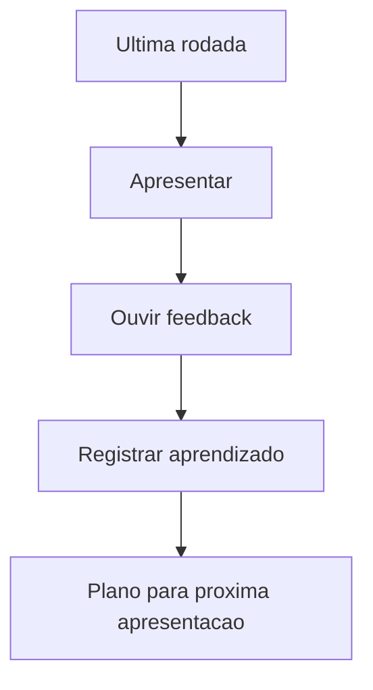

## Visão Geral do Conceito

A aula 10 encerra a sequência prática de apresentações. Como a fonte é logística, a lição consolida o método: participar, apresentar, receber feedback e registrar melhorias.

> **Regra:** esta lição foi reconstruída a partir da transcrição da aula e dos materiais disponíveis no repositório; quando a fonte não cobre um detalhe, isso é declarado como lacuna em vez de ser tratado como fato.

## Modelo Mental

Última rodada não é fim isolado; é fechamento de ciclo. O objetivo é sair com um padrão melhor de preparação para próximas apresentações acadêmicas e profissionais.



## Mecânica Central

- Grupos menores permitem que todos falem.
- Aceitar convites e organizar áudio/vídeo faz parte da competência de apresentação remota.
- Feedback final deve virar anotação acionável.
- A prática fecha o bloco de AT, oratória e competências.

## Uso Prático

Após apresentar, escreva três pontos: o que melhorou, o que ainda trava sua fala e qual ajuste aplicará na próxima apresentação.

## Erros Comuns

- Tratar logística como detalhe irrelevante.
- Não registrar feedback.
- Confundir nervosismo com fracasso.
- Encerrar sem plano de continuidade.

## Visão Geral de Debugging

Se você travou, identifique o ponto exato: abertura, transição, tempo, slide ou pergunta. Cada causa pede treino diferente.

## Principais Pontos

- Encerramento consolida prática.
- Feedback precisa virar ação.
- Logística remota também comunica profissionalismo.
- Apresentar melhora por ciclos.


## Preparação para Prática

Revise suas anotações das rodadas anteriores e escolha uma melhoria prioritária para manter.

## Laboratório de Prática
### Easy — Checklist de aplicação
Complete o checklist com ações verificáveis, sem frases vagas.
```markdown
# Checklist

- [ ] TODO: definir objetivo principal
- [ ] TODO: listar evidências ou dados usados
- [ ] TODO: identificar risco principal
- [ ] TODO: definir próxima ação concreta
```
Critérios:
- Usar verbos de ação.
- Evitar recomendações genéricas.
- Conectar cada item a uma evidência da aula.

### Medium — Roteiro de decisão
Preencha o roteiro para orientar uma decisão acadêmica ou profissional.
```markdown
# Roteiro

## Contexto
TODO: descreva a situação.

## Critérios
1. TODO
2. TODO
3. TODO

## Decisão
TODO: escolha e justifique.
```
Critérios:
- Separar contexto de decisão.
- Explicitar critérios.
- Justificar trade-offs.

### Hard — Plano de melhoria
Monte um plano com métrica, ação e revisão posterior.
```markdown
# Plano de melhoria

| Área | Evidência atual | Ação | Como revisar |
|---|---|---|---|
| TODO | TODO | TODO | TODO |
```
Critérios:
- Incluir evidência observável.
- Definir ação pequena e executável.
- Definir forma de revisão.


<!-- CONCEPT_EXTRACTION
concepts:
  - apresentações finais
  - salas
  - participação
  - feedback
  - encerramento
skills:
  - Consolidar feedback
  - Planejar melhoria de apresentação
  - Participar de dinâmica remota
  - Refletir sobre desempenho
examples:
  - ultima-rodada-apresentacoes
  - plano-pos-feedback
-->

<!-- EXERCISES_JSON
[
  {
    "id": "ultima-rodada-apresentacoes-salas-checklist-aplicacao",
    "slug": "ultima-rodada-apresentacoes-salas-checklist-aplicacao",
    "difficulty": "easy",
    "title": "Checklist de aplicação",
    "discipline": "planejamento-curso-carreira",
    "editorLanguage": "markdown",
    "tags": [
      "planejamento",
      "checklist"
    ],
    "summary": "Transformar os conceitos da aula em uma lista de verificação prática."
  },
  {
    "id": "ultima-rodada-apresentacoes-salas-roteiro-decisao",
    "slug": "ultima-rodada-apresentacoes-salas-roteiro-decisao",
    "difficulty": "medium",
    "title": "Roteiro de decisão",
    "discipline": "planejamento-curso-carreira",
    "editorLanguage": "markdown",
    "tags": [
      "planejamento",
      "decisao"
    ],
    "summary": "Criar roteiro para aplicar o conceito em uma situação real."
  },
  {
    "id": "ultima-rodada-apresentacoes-salas-plano-melhoria",
    "slug": "ultima-rodada-apresentacoes-salas-plano-melhoria",
    "difficulty": "hard",
    "title": "Plano de melhoria",
    "discipline": "planejamento-curso-carreira",
    "editorLanguage": "markdown",
    "tags": [
      "planejamento",
      "acao"
    ],
    "summary": "Montar um plano curto de melhoria com evidências e revisão."
  }
]
-->

<!-- SOURCE_CONTEXT
canonical_memory: MEMORIES.md
source: downloads/Planejamento_de_Curso_e_Carreira/Aula_10_-_07042026.md
source_sha256: 807cdb6c58afa3727ab19f8f5e4b1fa2470f02f007e2b29bb60c3348f453b361
source: downloads/Planejamento_de_Curso_e_Carreira/Aula_10_-_07042026.vtt
source_sha256: b8fef8bec2b614f11c07a4fe5b3f295bb0cfdc1091d6cb2865cc83d6b236bd80
notes:
  - Fonte é operacional; lição evita inventar teoria nova.
-->
