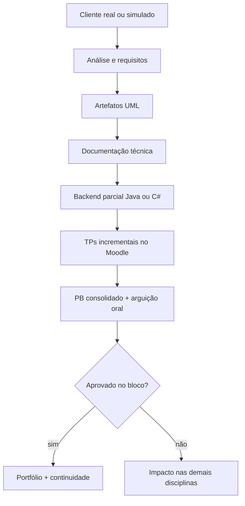
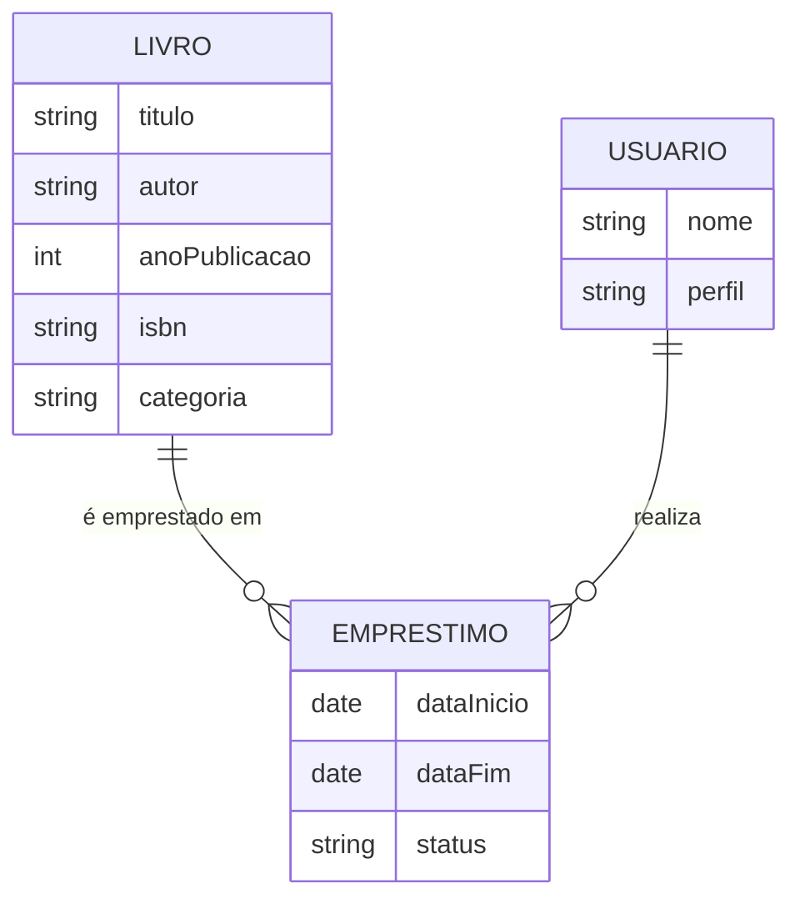
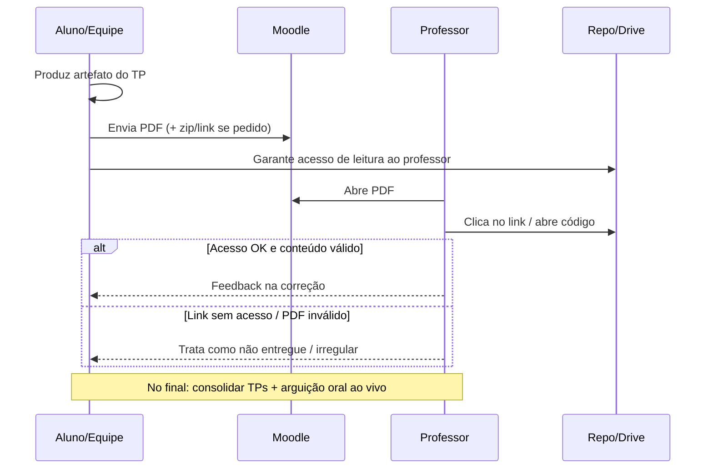

## Visão Geral do Conceito

O **Projeto de Bloco — Desenvolvimento Back-End** é a disciplina integradora em que você concebe e desenvolve um **produto de software** para um cliente real ou simulado, com foco em **engenharia de software orientada a backend**: requisitos, modelagem UML, documentação técnica e implementação parcial em <mark style="background-color: #242424; padding: 2px 4px; border-radius: 3px; color: inherit;">`Java`</mark> ou <mark style="background-color: #242424; padding: 2px 4px; border-radius: 3px; color: inherit;">`C#`</mark>.

Esta primeira aula não é “só combinado administrativo”. Ela define o **contrato de trabalho** da disciplina:

- como você e o professor vão operar (presença, canais, materiais);
- como as entregas (<mark style="background-color: #242424; padding: 2px 4px; border-radius: 3px; color: inherit;">`TP`</mark>s e PB final) entram no Moodle;
- qual é o **escopo mínimo de domínio** do sistema;
- quais **competências** serão treinadas ao longo do bloco.

> **Regra de ouro da aula:** o PB é requisito essencial para aprovação nas demais disciplinas do bloco. Tratar entrega e prazo como detalhe secundário é o caminho mais curto para reprovação sistêmica — não só nesta disciplina.

Professor: **Orlando Fonseca Guilarte** (`orlando.guilarte@prof.infnet.edu.br`).

## Modelo Mental

Pense no Projeto de Bloco como um **projeto profissional enxuto**, não como uma prova isolada:

1. **Combinado** = regras de colaboração e entrega (o “contrato”).
2. **Execução** = ciclo de engenharia (planejar → artefatos UML → documentar → implementar backend parcial).
3. **Produto mínimo** = um domínio com entidade central, relacionamentos e perfis de acesso.
4. **Avaliação** = TPs incrementais + consolidação final + arguição oral.

Uma analogia útil: construir uma casa. Ninguém começa pela pintura das paredes. Há análise do terreno, planta, etapas e só depois a obra. No software, o equivalente é o **ciclo de vida**: requisitos consistentes e completos → design → implementação → testes/validação com o “cliente”.

O foco pedagógico do PB é:

- **documentar bem** (casos de uso, classes, sequência);
- **implementar o que importa** (funcionalidades mais relevantes do backend);
- **saber explicar** o que foi feito (apresentação oral de ~20 minutos).



## Mecânica Central

### 1. Combinado da disciplina (regras de engajamento)

**Presença e participação**

- Presença na live **não é obrigatória** no sentido clássico de chamada: quem não puder acompanhar ao vivo usa a gravação.
- **Nuance da execução atual (transcrição):** a partir de 2026 há alunos que precisam de **pelo menos 75% de frequência** por regra institucional. O professor não faz “polícia de câmera”, mas quem estiver nessa condição deve monitorar a própria frequência e falar com ele se houver dúvida.
- Câmera **não é obrigatória** nas aulas regulares; recomenda-se **foto de perfil** para identificação (útil inclusive na arguição oral).
- Dúvidas: chat do Zoom ou fala oral, a qualquer momento — sem formalismo excessivo.

**Onde está o material**

| Recurso | Onde |
|--------|------|
| Aulas / gravações | [infnet.online](https://infnet.online) → aba **Aulas** |
| Slides e documentos | [infnet.online](https://infnet.online) → aba **Documentos** |
| Arquivos extras / exemplos | Google Drive ou GitHub do professor: [github.com/ofonsek0702](https://github.com/ofonsek0702) |
| Entrega de TPs e PB | **Moodle** |

**Entregas e formato**

- Existem **cinco TPs**, todos **obrigatórios**.
- Entrega dos TPs e do PB é **obrigatória**. A não entrega implica <mark style="background-color: #242424; padding: 2px 4px; border-radius: 3px; color: inherit;">`ND`</mark> em todas as competências.
- Formato padrão: **PDF no Moodle**. Quando solicitado, acompanhar código-fonte em <mark style="background-color: #242424; padding: 2px 4px; border-radius: 3px; color: inherit;">`.zip`</mark> ou link (Drive/GitHub) **com acesso ao professor**.
- PDF vazio, arquivo corrompido, tentativa de burlar regras ou link sem acesso → enquadramento disciplinar / entrega considerada **não entregue** (ou, no mínimo, problemática na correção).
- Repositório pode ser público ou privado com convite; o critério é: **o professor consegue abrir e corrigir**.

**Prazos e notas**

- Atraso restringe a nota final: conforme a quantidade de TPs em atraso, pode resultar em <mark style="background-color: #242424; padding: 2px 4px; border-radius: 3px; color: inherit;">`DL`</mark> ou <mark style="background-color: #242424; padding: 2px 4px; border-radius: 3px; color: inherit;">`D`</mark>.
- Distinção importante (aula oral):
  - **Data de entrega** do TP: atrasar aqui gera **penalização**.
  - **Data limite** do curso: passar disso normalmente **fecha** a entrega (reprovação automática pelo fluxo institucional).
- Casos pontuais de problema real podem ser conversados com o professor (flexibilidade pontual, não regra geral).

> **Regra:** cada TP é uma **etapa do projeto final**. O PB final, na prática, é a consolidação dos TPs — não um “segundo projeto” paralelo.

### 2. Execução do Projeto de Bloco

O PB consiste em:

1. **Planejamento** da solução para um cliente.
2. **Criação de artefatos** (especialmente diagramas UML).
3. **Documentação técnica**.
4. **Implementação parcial** do sistema, com **foco no backend**.

**O que não é obrigatório**

- Implementar **todas** as funcionalidades dos diagramas. Ex.: se há 10 casos de uso, implemente as mais relevantes (na oral, o professor citou ordem de grandeza de ~5 no trabalho em equipe; sozinho, escopo menor).
- Frontend completo. Pode ser API + linha de comando, ou assumir um front que consome a API. Quem souber front é **encorajado** a incluir.

**Linguagem**

- Backend em <mark style="background-color: #242424; padding: 2px 4px; border-radius: 3px; color: inherit;">`Java`</mark> **ou** <mark style="background-color: #242424; padding: 2px 4px; border-radius: 3px; color: inherit;">`C#`</mark> — **uma** escolha.
- A escolha deve ficar clara **desde o primeiro TP**; trocar no meio do caminho quebra a continuidade do projeto.
- Não usar outra linguagem só porque “gosta mais”: o PB precisa alinhar com as disciplinas regulares do bloco.

**Equipe e tema**

- Equipes de **até 3** integrantes (solo permitido; complexidade e volume de implementação menores).
- Tema: cenário macro fornecido pelo professor **ou** cenário próprio **aprovado** por ele.
- Complexidade esperada sobe com o tamanho do grupo (mais entidades, relacionamentos e casos de uso).

**Arguição oral**

- Obrigatória; ~**20 minutos**.
- Todos os membros participam; perguntas podem ser direcionadas a qualquer um.
- Ao vivo, câmera ligada, em sala privada — não é vídeo gravado enviado.
- Não apresentar / não entregar o consolidado no prazo → caminho clássico de reprovação, mesmo com TPs intermediários feitos.

### 3. Escopo mínimo de domínio

O sistema deve conter, no mínimo:

| Elemento | Exigência | Exemplo (aluguel de livros) |
|----------|-----------|-----------------------------|
| Entidade principal | 1 núcleo de negócio | `Livro` |
| Atributos da principal | ≥ 5 características essenciais | título, autor, ano, ISBN, categoria |
| Entidades correlatas | ≥ 2 com relacionamento à principal | `Usuario`, `Emprestimo` |
| Perfis / atores | diferentes tipos de acesso | Administrador, Cliente, Funcionário |



Esse mínimo existe para forçar **relacionamentos**, **atores** e depois **dinâmica** (sequência), não só uma entidade isolada com CRUD trivial.

### 4. Competências do bloco

1. **Formalizar requisitos via Casos de Uso**  
   Ciclo de vida, requisitos funcionais/técnicos, atores/papéis, diagrama de casos de uso UML.  
   *(Na oral: associado em grande parte ao TP1.)*

2. **Modelar classes e relacionamentos**  
   Extrair entidades dos casos de uso, relações, atributos, diagrama de classes.  
   *(Associado em grande parte ao TP2.)*

3. **Modelar componentes dinâmicos**  
   Cenários a partir dos casos de uso; diagrama de sequência.

4. **Consolidar e implementar**  
   Aplicar padrões de projeto / boas práticas e entregar software baseado no projeto (MVP testável das funcionalidades principais).

### 5. Sinalização precoce do ciclo de vida (ponte para a Aula 2)

Ainda nesta aula, o professor iniciou a ideia de **ciclo de vida do sistema**: não se “pula” para código. Antes há análise, marcos, levantamento de dados, organização de atividades e monitoramento de entregas. Requisitos precisam ser **claros, completos e consistentes** (sem contradições entre si), porque orientam design e implementação.

**Não coberto em profundidade nesta lição (fica para aulas seguintes):** modelos cascata/RUP/ágil em detalhe; sintaxe completa de cada diagrama UML; bibliografia com títulos confirmados página a página (slides de bibliografia vieram sem texto útil na extração).

## Uso Prático

### Checklist de entrega de um TP

Use este roteiro mental antes de enviar no Moodle:

```text
1. PDF contém a etapa pedida (não arquivo vazio / placeholder).
2. Diagramas legíveis (exportados ou embutidos com qualidade).
3. Se houver código: .zip ou link Drive/GitHub com acesso testado.
4. Linguagem do backend já declarada (Java XOR C#).
5. Nomes dos integrantes e papéis claros (se em equipe).
6. Envio dentro da data de entrega (e longe da data limite).
```

### Esqueleto conceitual de domínio (antes do código)

Antes de abrir IDE, fixe o domínio em estrutura explícita — isso alimenta casos de uso, classes e API:

```javascript
// Representação conceitual do escopo mínimo do PB (não é o backend final)
const dominioBiblioteca = {
  linguagemBackend: "C#", // ou "Java" — fixar no TP1
  entidadePrincipal: {
    nome: "Livro",
    atributos: ["titulo", "autor", "anoPublicacao", "isbn", "categoria"],
  },
  entidadesCorrelatas: [
    { nome: "Usuario", relacaoComPrincipal: "realiza emprestimos de Livro" },
    { nome: "Emprestimo", relacaoComPrincipal: "referencia Livro emprestado" },
  ],
  perfis: ["Administrador", "Cliente", "Funcionario"],
  // Implementação parcial: escolher as mais relevantes, não todas
  casosDeUsoPrioritarios: [
    "ConsultarLivro",
    "RegistrarEmprestimo",
    "DevolverLivro",
    "CadastrarUsuario",
    "GerarRelatorioEmprestimos",
  ],
};
```

### Trade-off engenharia: especificar amplo × implementar estreito

| Abordagem | Ganho | Risco |
|-----------|-------|-------|
| Documentar muitos casos de uso com qualidade | Parece projeto real; treina análise | Trabalho alto nos TPs teóricos |
| Implementar só o núcleo relevante | MVP demonstrável; cabe no prazo | Se a documentação for rasa, a arguição fica fraca |
| Reduzir especificação a 2–3 funções “fáceis” | Menos esforço inicial | Distante da prática profissional; o professor desencoraja |

> **Regra de projeto:** capriche na **especificação**; selecione com critério o que vai para **código**.

### Uso de IA generativa (orientação da aula)

Permitido como **ferramenta de apoio**, não como piloto automático:

1. Você tenta implementar / escrever a especificação.
2. Depois usa a IA para revisar, melhorar ou validar.
3. Na documentação e diagramas, o professor quer ver **seu** raciocínio.

## Erros Comuns

- **Tratar o PB como disciplina isolada**  
  Reprovar o PB impacta o bloco inteiro. Sintoma: “deixo o TP para a última semana”. Correção: tratar cada TP como incremento do mesmo produto.

- **PDF vazio / link sem acesso / arquivo corrompido “só para bater o prazo”**  
  Conta como não entrega ou prática irregular. Sintoma: Moodle “enviado”, correção impossível. Correção: validar o download/acesso **com outra conta** antes do prazo.

- **Trocar Java ↔ C# no meio do semestre**  
  Quebra continuidade de código e correção. Sintoma: TP1 em uma linguagem, TP4 em outra. Correção: decidir no TP1 e manter.

- **Especificar 20 funções e achar que terá de codificar as 20**  
  Gera pânico falso. O professor cobra qualidade da documentação e implementação das **mais relevantes**.

- **Equipe de 3 com escopo de solo**  
  Subaprove o domínio. Sintoma: uma entidade, poucos relacionamentos. Correção: aumentar entidades, casos de uso e complexidade do diagrama de classes.

- **Só um integrante fala na arguição**  
  Violação do combinado. Todos devem apresentar; perguntas podem cair em qualquer membro.

- **Frontend como desculpa para não entregar backend**  
  Front não é obrigatório; backend e modelagem são. Sintoma: tela bonita sem regras de negócio. Correção: priorizar API/regras e persistência do domínio.

## Visão Geral de Debugging

Quando o “projeto trava”, debugue o **processo**, não só o código:

1. **Escopo** — A entidade principal tem ≥5 atributos? Há ≥2 correlatas e perfis?
2. **Rastreabilidade** — Cada caso de uso prioritário aponta para classes e, depois, para endpoints/métodos?
3. **Entrega** — O PDF abre? O link abre **sem login do aluno**? O `.zip` extrai?
4. **Prazo** — Estou na janela de entrega ou já na zona de data limite?
5. **Arguição** — Consigo explicar, em 20 minutos, domínio → diagramas → o que foi implementado e o que ficou só especificado?



<details>
<summary>Sintoma: “enviei no Moodle mas o professor diz que não consegue corrigir”</summary>

Quase sempre é acesso (Drive compartilhado com “todos do Infnet” em vez do e-mail do professor, repo privado sem convite) ou PDF ilegível. Corrija o compartilhamento para o e-mail profissional do professor ou torne o recurso publicamente legível **só o necessário**, e avise no chat/e-mail pedindo confirmação de acesso.
</details>

## Principais Pontos

- O PB é um **produto de software** com foco em **backend + engenharia** (UML, requisitos, implementação parcial).
- Há **5 TPs obrigatórios**; não entregar → <mark style="background-color: #242424; padding: 2px 4px; border-radius: 3px; color: inherit;">`ND`</mark>; atrasar → risco de <mark style="background-color: #242424; padding: 2px 4px; border-radius: 3px; color: inherit;">`DL`</mark>/<mark style="background-color: #242424; padding: 2px 4px; border-radius: 3px; color: inherit;">`D`</mark>.
- Entrega canónica: **PDF no Moodle** + código acessível quando pedido.
- Linguagem: <mark style="background-color: #242424; padding: 2px 4px; border-radius: 3px; color: inherit;">`Java`</mark> **ou** <mark style="background-color: #242424; padding: 2px 4px; border-radius: 3px; color: inherit;">`C#`</mark>, fixada cedo.
- Frontend opcional; documentação e backend relevantes são o núcleo.
- Domínio mínimo: 1 principal (≥5 attrs) + 2 correlatas + perfis.
- Arguição oral (~20 min) é obrigatória e presencial (ao vivo).
- Competências cobrem requisitos → classes → dinâmica → implementação com padrões.

## Preparação para Prática

Após esta lição, você deve conseguir:

- Redigir o combinado da sua equipe (linguagem, tema, integrantes, canais).
- Validar se um domínio proposto atende ao escopo mínimo.
- Montar um checklist de entrega de TP sem buracos de acesso.
- Listar as quatro competências e dizer em que tipo de artefato cada uma aparece.

No laboratório, você vai **modelar em código** (estruturas JavaScript no editor ISS) as regras do PB — não para substituir Java/C#, mas para fixar o raciocínio de engenharia antes da implementação.

## Laboratório de Prática

> `editorLanguage`: <mark style="background-color: #242424; padding: 2px 4px; border-radius: 3px; color: inherit;">`javascript`</mark> (mapa da disciplina). Nos exemplos do corpo da lição, a implementação-alvo do PB continua sendo Java ou C#.

### Easy — Validar o escopo mínimo de domínio

Complete a função para retornar `true` somente se o domínio proposto atender ao combinado da aula: entidade principal com ≥5 atributos, ≥2 correlatas e ≥1 perfil.

```javascript
function validarEscopoMinimo(dominio) {
  // dominio = {
  //   entidadePrincipal: { nome: string, atributos: string[] },
  //   correlatas: { nome: string }[],
  //   perfis: string[]
  // }
  // TODO: retornar true apenas se:
  // - existir nome da entidade principal
  // - atributos.length >= 5
  // - correlatas.length >= 2
  // - perfis.length >= 1
  return false;
}

const exemplo = {
  entidadePrincipal: {
    nome: "Livro",
    atributos: ["titulo", "autor", "ano", "isbn", "categoria"],
  },
  correlatas: [{ nome: "Usuario" }, { nome: "Emprestimo" }],
  perfis: ["Administrador", "Cliente"],
};

if (typeof console !== "undefined") {
  console.log("escopo ok?", validarEscopoMinimo(exemplo));
}
```

### Medium — Checklist de entrega de TP

Implemente um validador que recebe o “pacote” de entrega e devolve a lista de **problemas**. Pacote sem problemas → array vazio.

```javascript
function problemasNaEntrega(pacote) {
  // pacote = {
  //   pdfVazio: boolean,
  //   pdfCorrompido: boolean,
  //   linkCodigo: string | null,
  //   professorTemAcesso: boolean,
  //   linguagem: "Java" | "C#" | "Python" | string,
  //   atrasado: boolean,
  //   passouDataLimite: boolean
  // }
  const problemas = [];

  // TODO: se pdfVazio ou pdfCorrompido → "PDF inválido"
  // TODO: se linkCodigo e !professorTemAcesso → "Código inacessível"
  // TODO: se linguagem não for Java nem C# → "Linguagem fora do combinado"
  // TODO: se passouDataLimite → "Fora da data limite"
  // TODO: senão se atrasado → "Entrega com atraso (penalização)"

  return problemas;
}

const simulacao = {
  pdfVazio: false,
  pdfCorrompido: false,
  linkCodigo: "https://github.com/equipe/pb-backend",
  professorTemAcesso: false,
  linguagem: "Java",
  atrasado: true,
  passouDataLimite: false,
};

if (typeof console !== "undefined") {
  console.log(problemasNaEntrega(simulacao));
}
```

### Hard — Priorizar funcionalidades para implementação parcial

Dado um backlog de casos de uso com `relevancia` (1–5) e `esforco` (1–5), selecione até `limite` itens para o MVP de backend, ordenando por maior relevância e, em empate, menor esforço.

```javascript
function selecionarMvp(casosDeUso, limite) {
  // casosDeUso = [{ id, nome, relevancia, esforco }]
  // TODO:
  // 1) ordenar por relevancia DESC, depois esforco ASC
  // 2) retornar no máximo `limite` itens
  // 3) não mutar o array original
  return [];
}

const backlog = [
  { id: "uc1", nome: "ConsultarLivro", relevancia: 5, esforco: 2 },
  { id: "uc2", nome: "TemaEscuroUI", relevancia: 1, esforco: 3 },
  { id: "uc3", nome: "RegistrarEmprestimo", relevancia: 5, esforco: 4 },
  { id: "uc4", nome: "RelatorioGerencial", relevancia: 4, esforco: 5 },
  { id: "uc5", nome: "DevolverLivro", relevancia: 5, esforco: 3 },
  { id: "uc6", nome: "AvatarAnimado", relevancia: 1, esforco: 5 },
];

if (typeof console !== "undefined") {
  console.log(selecionarMvp(backlog, 5));
}
```

<!-- CONCEPT_EXTRACTION
concepts:
  - projeto de bloco backend
  - combinado da disciplina
  - entrega de TPs no Moodle
  - penalidades ND DL D
  - escopo mínimo de domínio
  - entidade principal e correlatas
  - perfis de usuário / atores
  - casos de uso UML
  - diagrama de classes
  - diagrama de sequência
  - implementação parcial de backend
  - Java ou C#
  - arguição oral
  - ciclo de vida de software
skills:
  - Aplicar o combinado de entregas e prazos do PB
  - Validar escopo mínimo de domínio de um sistema
  - Escolher Java ou C# e manter a decisão no projeto
  - Priorizar funcionalidades para MVP de backend
  - Montar checklist de PDF + código acessível no Moodle
  - Relacionar competências do PB a artefatos UML e implementação
examples:
  - dominio-biblioteca-livro-usuario-emprestimo
  - checklist-entrega-tp-moodle
  - selecao-mvp-casos-de-uso
-->

<!-- EXERCISES_JSON
[
  {
    "id": "pb-backend-validar-escopo-minimo",
    "slug": "pb-backend-validar-escopo-minimo",
    "difficulty": "easy",
    "title": "Validar o escopo mínimo de domínio",
    "discipline": "projeto-bloco-backend",
    "editorLanguage": "javascript",
    "tags": ["projeto-bloco", "dominio", "requisitos", "engenharia-software"],
    "summary": "Implementar validação do escopo mínimo: entidade principal com ≥5 atributos, ≥2 correlatas e perfis."
  },
  {
    "id": "pb-backend-checklist-entrega-tp",
    "slug": "pb-backend-checklist-entrega-tp",
    "difficulty": "medium",
    "title": "Checklist de entrega de TP no Moodle",
    "discipline": "projeto-bloco-backend",
    "editorLanguage": "javascript",
    "tags": ["projeto-bloco", "entregas", "moodle", "qualidade"],
    "summary": "Detectar problemas de PDF, acesso ao código, linguagem inválida, atraso e data limite."
  },
  {
    "id": "pb-backend-selecionar-mvp-casos-uso",
    "slug": "pb-backend-selecionar-mvp-casos-uso",
    "difficulty": "hard",
    "title": "Priorizar casos de uso para MVP de backend",
    "discipline": "projeto-bloco-backend",
    "editorLanguage": "javascript",
    "tags": ["projeto-bloco", "mvp", "casos-de-uso", "priorizacao"],
    "summary": "Selecionar até N casos de uso por relevância e esforço, refletindo implementação parcial do PB."
  }
]
-->

<!--
lessons.json (NÃO atualizado nesta missão — integração serial pelo orquestrador):
{
  "discipline": "projeto-bloco-backend",
  "slug": "combinado-projeto-bloco-backend",
  "title": "Combinado, execução e entregas do Projeto de Bloco Backend",
  "order": 1,
  "file": "projeto-bloco-backend/aula-01-combinado-projeto-bloco-backend.md"
}
-->
