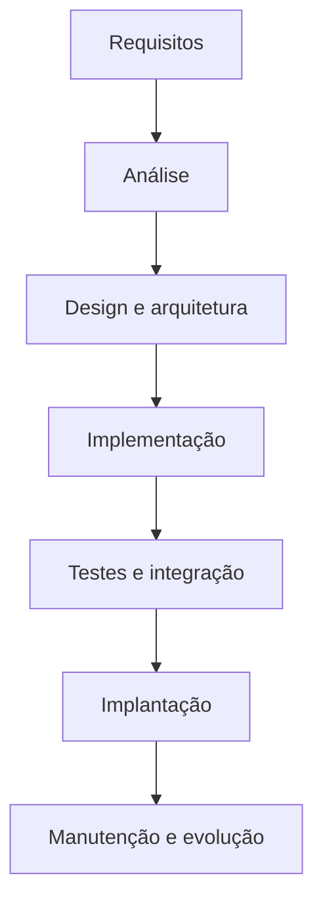
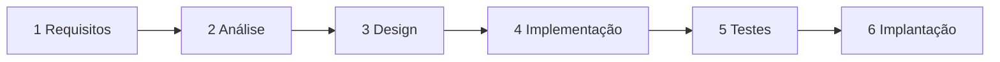
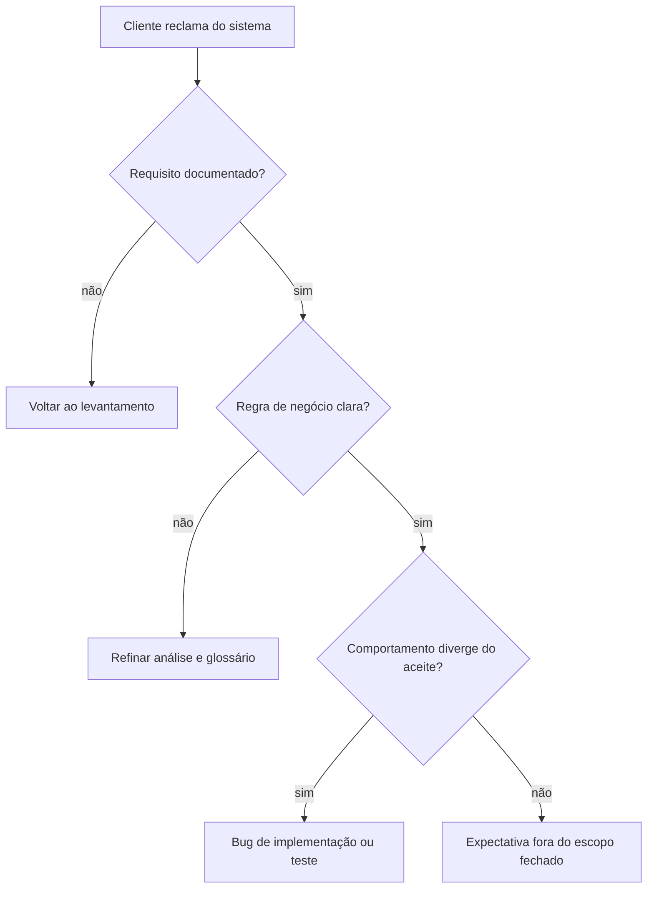

## Visão Geral do Conceito

Desenvolver software não é “abrir o editor e começar a programar”. Assim como construir uma casa exige projeto, fundação e inspeções, um sistema precisa de um <mark style="background-color: #242424; padding: 2px 4px; border-radius: 3px; color: inherit;">`ciclo de vida`</mark>: um conjunto organizado de etapas que vai da ideia inicial à entrega e à manutenção.

Essa estrutura serve para:

- definir <mark style="background-color: #242424; padding: 2px 4px; border-radius: 3px; color: inherit;">`marcos`</mark> (ex.: análise concluída);
- organizar atividades (ex.: levantamento de dados e regras);
- monitorar entregas e qualidade.

> **Regra:** quanto maior e mais complexo o projeto, mais crítica é a estrutura de ciclo de vida — ela dá visão de alto nível para planejamento, monitoramento e controle. Não se trata só de código: inclui **processos** (métodos e práticas) e **ferramentas** (tecnologias de desenvolvimento e gestão).

Nesta lição, o foco é o ciclo de vida do sistema, com ênfase na **etapa de requisitos** (a mais crítica no início do Projeto de Bloco Backend), e a introdução ao <mark style="background-color: #242424; padding: 2px 4px; border-radius: 3px; color: inherit;">`modelo em cascata`</mark> (Waterfall). Detalhes profundos de RUP e ágil ficam para lições seguintes; aqui eles aparecem apenas como mapa de opções.

## Modelo Mental

Pense no ciclo de vida como uma **linha de montagem do valor** para o usuário: a solução computacional só entrega valor quando as funcionalidades desejadas existem **e** estão corretas em relação ao que o cliente pediu.

Analogia útil da aula: construir uma casa. Você não começa pela pintura. No software:

1. **Requisitos** — o que o cliente precisa (entrevistas, questionários, reuniões).
2. **Análise** — deixar claro *como* o sistema deve funcionar (dados, regras, interações).
3. **Design** — desenhar estrutura, interfaces e banco antes de codificar em massa.
4. **Implementação** — escrever código alinhado ao design e aos requisitos.
5. **Testes / integração** — verificar conformidade e juntar partes.
6. **Implantação** — colocar no ambiente real (máquina do cliente, nuvem, etc.).
7. **Manutenção** — corrigir defeitos e evoluir.

O “ciclo” existe porque, em muitos contextos, é preciso **revisitar** etapas (erro encontrado, refinamento). Já no cascata *tradicional*, a ideia dominante é avançar fase a fase **sem voltar** ao cliente no meio do caminho.



### Requisitos: falar a mesma língua

Na etapa de requisitos, a equipe (analistas, quem faz a ponte com o cliente, desenvolvedores, testers) precisa entender o que o cliente **realmente** precisa — não o que o time *acha* que seria legal.

Se o cliente diz <mark style="background-color: #242424; padding: 2px 4px; border-radius: 3px; color: inherit;">`itens`</mark>, a equipe não deve renomear para <mark style="background-color: #242424; padding: 2px 4px; border-radius: 3px; color: inherit;">`produtos`</mark> sem alinhamento: o glossário do negócio vira a linguagem da modelagem e do código. Sem isso, a análise e o design divergem do mundo real.

## Mecânica Central

### 1. Atividades fundamentais do ciclo de vida

Com base nos materiais da disciplina, as atividades incluem:

| Atividade | Papel |
|-----------|--------|
| Análise e especificação de requisitos | Garantir requisitos consistentes e completos; especificar em detalhe para orientar design e implementação |
| Design e arquitetura | Definir estrutura, componentes e interfaces |
| Implementação (codificação) | Escrever código seguindo design e padrões |
| Testes | Encontrar e corrigir defeitos; verificar conformidade com requisitos |
| Integração | Unir componentes desenvolvidos em separado |
| Implantação | Entregar e instalar no ambiente operacional |
| Manutenção e evolução | Corrigir defeitos e atender novos requisitos após o lançamento |

### 2. Etapa de requisitos (detalhe)

**Objetivo:** entender o que o cliente precisa.

**Técnicas / ferramentas citadas na fonte:**

- entrevistas;
- questionários;
- reuniões;
- análise de processos / sistemas existentes (quando o cliente já usa algo que “não atende mais”).

**Exemplo (biblioteca):** identificar que o sistema deve permitir empréstimos, reservas e emissão de relatórios mensais — isso vem do representante do usuário final, não da inventividade do time.

**Análise (aprofundamento dos requisitos):**

- tornar as necessidades claras para todos;
- identificar dados necessários, regras de negócio e interações;
- exemplo de regra: usuários com livros atrasados não podem fazer novos empréstimos.

**Entregável da fase de Requisitos (cascata):** documento de requisitos detalhado — não o software instalado.

### 3. Design, implementação e além (visão do ciclo)

- **Design:** diagramas, arquitetura técnica, interfaces; telas de login/cadastro; modelo de banco. Pode dividir-se em design de alto nível (módulos/componentes) e design detalhado (UI, BD, algoritmos, fluxos).
- **Implementação:** codificar módulos conforme padrões; testar componentes (ex.: login com diferentes tipos de usuário).
- **Implantação / instalação:** disponibilizar no ambiente real.
- **Manutenção:** sustentação, correção de bugs, melhorias; no cascata, mudanças grandes tendem a ser tratadas como novo ciclo.

No Projeto de Bloco Backend, o foco cobrado é **backend** (Java ou C# conforme combinado da disciplina). Front-end completo **não** é o objetivo da cobrança — se houver familiaridade e entrega, melhor; se não, não é o núcleo avaliativo.

### 4. Do requisito ao modelo (exemplo do jogo de dados)

Problema simples usado na aula para ilustrar o caminho requisitos → modelagem:

- Jogador lança **dois dados**.
- Se a soma das faces for **7**, vitória; caso contrário, derrota.
- O jogador pede o lançamento; o sistema apresenta o resultado.

A partir da regra (requisito), surge um **modelo conceitual de objetos** (jogador, jogo, dados e relações: jogador lança dados; jogo inclui jogador e dados). Em seguida aparece uma visão mais próxima da implementação (classe com atributos `dado1`/`dado2` do tipo `Dado`, método `jogar`, valor da face como inteiro).

> **Lacuna visual:** os slides 9–11 do PDF trazem diagramas gráficas cujo texto não foi extraído; a reconstrução acima baseia-se na narração da aula. Notação UML completa e nomes oficiais de todos os elementos **não estão cobertos** como especificação formal nesta fonte.

### 5. Modelos de ciclo de vida (mapa)

Principais modelos apresentados:

- Cascata (Waterfall)
- Iterativo
- Incremental
- Processo Unificado (RUP)
- Ágeis

Não existe “um modelo sempre melhor”. A escolha depende de estabilidade dos requisitos, tamanho, prazos, orçamento, complexidade e flexibilidade necessária. No PB, a equipe **justifica** a escolha na documentação (TP); quem decide o modelo é a equipe de desenvolvimento (o cliente pode impor restrições técnicas, mas normalmente não escolhe o nome do processo).

### 6. Modelo em cascata

**Origem / ideia:** primeiro modelo formalmente definido e documentado; fases lineares e sequenciais — cada etapa só avança após concluir a anterior (“como uma cascata que não sobe”).

**Princípio de adequação:** é possível entender e planejar o sistema **desde o início**, com requisitos profundos e estáveis, antes de codificar em larga escala.

**Seis fases principais (material da aula):**

1. **Requisitos** — levantamento; entregável: documento de requisitos.
2. **Análise** — modelo lógico; casos de uso, modelagem de processos.
3. **Design** — arquitetura (alto nível + detalhado); classes, telas, modelo relacional.
4. **Implementação** — codificação por módulo.
5. **Testes** — sistema completo versus requisitos.
6. **Implantação** — entrega no ambiente do cliente; manutenção pode surgir depois.



**Vantagens:** fácil de entender e gerenciar; objetivos claros por fase; documentação robusta; adequado a projetos bem definidos com rastreabilidade e formalidade.

**Limitações:** mudanças difíceis após iniciar a fase seguinte; voltar etapas é problemático; cliente só vê o produto no final (sem entregas parciais). No cascata tradicional, **não há versão 1 / versão 2** no sentido ágil: a entrega é a versão final planejada. Novas demandas grandes após implantação tendem a virar **novo cascata**.

**Refatoração vs. mudança de requisito:** dentro da fase de implementação, o time pode refatorar e otimizar. O que o modelo tradicional impede é reabrir escopo com o cliente a cada ideia após fechar requisitos.

## Uso Prático

### Cenário A — Sistema de biblioteca (requisitos → regra)

Necessidades levantadas com o cliente: empréstimos, reservas, relatórios mensais. Na análise, formaliza-se a regra de negócio:

```text
SE usuario.temLivroAtrasado = verdadeiro
ENTÃO negar novo empréstimo
SENÃO permitir fluxo de empréstimo
```

Em termos de backend, isso vira validação de serviço antes de persistir o empréstimo — mas a regra nasce no requisito, não no framework.

### Cenário B — Esqueleto de requisito rastreável (conceitual)

Ao documentar um requisito para o PB, registre identificador, origem, regra e critério de aceite. Exemplo em estrutura JSON (útil para validar completude no laboratório):

```javascript
const requisitoEmprestimo = {
  id: "REQ-LIB-001",
  origem: "entrevista com responsável da biblioteca",
  descricao: "Permitir empréstimo de livros a usuários ativos",
  regraNegocio: "Usuário com livro atrasado não pode emprestar",
  criterioAceite: "Tentativa de empréstimo com atraso retorna recusa e não grava registro",
  glossario: { usuario: "pessoa cadastrada na biblioteca", atraso: "devolução além da data prevista" }
};
```

### Cenário C — Quando cascata faz sentido (exercício da aula)

| Cenário | Cascata adequado? | Por quê (conforme discussão em aula) |
|---------|-------------------|--------------------------------------|
| Hospital: inventário de medicamentos, requisitos pré-documentados, auditoria, baixo risco de mudança, prazos/orçamento fechados | Sim | Requisitos estáveis + alta documentação + ambiente controlado |
| Secretaria de Educação: gestão escolar, requisitos aprovados com diretores/coordenadores, documentação e treino formal, pouca mudança esperada | Sim | Escala + formalidade + estabilidade |
| Startup de ensino online: ideia geral, validar com usuários, feedback rápido e adaptação constante | Não | Requisitos incompletos e mudança contínua → abordagem flexível/ágil |

### Ligação com o Projeto de Bloco

- Nos TPs, a metodologia (cascata, RUP, ágil, etc.) deve ser **escolhida e justificada**.
- Cascata só “vale” se o tema do projeto realmente tiver requisitos estáveis e necessidade de documentação forte — não use só porque “é clássico”.
- A aula seguinte aprofunda outros modelos; aqui o ponto é dominar o ciclo e a etapa de requisitos para alimentar essa decisão.

## Erros Comuns

1. **Começar pelo código**  
   **Sintoma:** endpoints e tabelas sem regra de negócio clara.  
   **Correção:** fechar glossário, requisitos e regras antes de modelar persistência em definitivo.

2. **Time inventar funcionalidade no lugar do cliente**  
   **Sintoma:** “biblioteca precisa de X porque eu acho útil”.  
   **Correção:** capturar necessidade com entrevista/reunião; sugestões do time são secundárias e devem ser validadas.

3. **Trocar o vocabulário do cliente**  
   **Sintoma:** documento fala em `produto`, cliente fala em `item`, código mistura os dois.  
   **Correção:** glossário compartilhado; mesma palavra na modelagem e no código.

4. **Tratar cascata como se tivesse sprints e feedback contínuo**  
   **Sintoma:** “vamos entregar MVP e o cliente muda tudo na semana 2” rotulado como cascata.  
   **Correção:** se há mudança frequente, justifique outro modelo; cascata tradicional não prevê essa dinâmica.

5. **Confundir manutenção pequena com novo projeto**  
   **Sintoma:** bugfix tratado como novo cascata inteiro — ou, no extremo oposto, feature grande “escondida” em manutenção.  
   **Correção:** correções/pequenas atualizações podem ficar em manutenção; pedidos grandes de nova função reiniciam requisitos.

6. **Achar que cascata está “proibido” porque a internet diz que está em desuso**  
   **Correção (posição da aula):** a escolha depende do contexto; cascata ainda pode ser adequado (e já foi usado com sucesso em projetos recentes com requisitos estáveis).

## Visão Geral de Debugging

Quando o projeto “não fecha” (código pronto que não resolve o problema do cliente), debugue o **processo**, não só o stack trace:

1. O requisito está escrito e aceito? Há ID, descrição e critério de aceite?
2. A regra de negócio está explícita (como a do atraso na biblioteca)?
3. O glossário está alinhado entre cliente, documento e código?
4. Você está no modelo certo? Requisitos voláteis + cascata = atrito estrutural.
5. A falha é de fase (análise incompleta) ou de implementação (bug local)?



## Principais Pontos

- Ciclo de vida organiza marcos, atividades e qualidade — não só código.
- Requisitos capturam a necessidade real do cliente com entrevistas, questionários e reuniões.
- Análise aprofunda dados, regras e interações; design antecipa arquitetura e banco.
- Glossário compartilhado evita divergência entre negócio e implementação.
- Cascata é linear, documentado e exige requisitos estáveis desde o início.
- Cascata tradicional não prevê feedback contínuo do cliente no meio do caminho.
- Escolha de modelo depende do contexto; no PB, a justificativa faz parte da entrega.
- Foco do PB Backend é backend e artefatos; front-end completo não é o núcleo cobrado.

## Preparação para Prática

Antes do laboratório, você deve conseguir:

- listar as etapas do ciclo e o papel da etapa de requisitos;
- escrever um requisito com regra de negócio e critério de aceite;
- classificar cenários quanto à adequação do cascata;
- ordenar fases do cascata e reconhecer entregáveis típicos.

## Laboratório de Prática

> Editor ISS: `editorLanguage` = `javascript` (mapa da disciplina). Os exercícios modelam **artefatos de engenharia de software** (requisitos, classificação de modelo, rastreabilidade), não UI.

### Easy — Completar o glossário e a regra de negócio

Cenário: sistema de biblioteca. Complete a função para montar um requisito mínimo válido (campos obrigatórios preenchidos).

```javascript
function montarRequisitoBiblioteca(parcial) {
  const base = {
    id: parcial.id || "",
    descricao: parcial.descricao || "",
    regraNegocio: parcial.regraNegocio || "",
    glossario: parcial.glossario || {}
  };

  // TODO: se id, descricao ou regraNegocio estiverem vazios, retornar { ok: false, erro: "campos obrigatórios ausentes" }
  // TODO: garantir glossario.usuario e glossario.atraso (strings não vazias); senão { ok: false, erro: "glossário incompleto" }
  // TODO: se tudo ok, retornar { ok: true, requisito: base }

  return { ok: true, requisito: base };
}

// smoke (executa sem lançar exceção)
console.log(montarRequisitoBiblioteca({
  id: "REQ-LIB-001",
  descricao: "Controlar empréstimos",
  regraNegocio: "Atraso bloqueia novo empréstimo",
  glossario: { usuario: "pessoa cadastrada", atraso: "devolução fora do prazo" }
}));
```

**Critérios:**

- Recusar requisito sem `id`, `descricao` ou `regraNegocio`.
- Exigir entradas do glossário usadas na regra.
- Não inventar funcionalidades fora do enunciado.

### Medium — Classificar cenários para cascata

Dado um cenário descritivo, retorne se cascata é adequado e uma justificativa curta baseada em estabilidade de requisitos e formalidade.

```javascript
function avaliarCascata(cenario) {
  // cenario = { id, texto, tags: string[] }
  // tags possíveis: "requisitos_estaveis", "alta_documentacao", "auditoria",
  // "mudanca_frequente", "feedback_rapido", "ideia_inicial"

  // TODO: se tags incluir "mudanca_frequente" OU "feedback_rapido" OU "ideia_inicial"
  //       retornar { adequado: false, motivo: "requisitos voláteis / validação contínua" }
  // TODO: se tags incluir ao menos dois entre "requisitos_estaveis", "alta_documentacao", "auditoria"
  //       retornar { adequado: true, motivo: "requisitos estáveis e formalidade alta" }
  // TODO: caso contrário retornar { adequado: null, motivo: "informação insuficiente" }

  return { adequado: null, motivo: "TODO" };
}

const hospital = {
  id: "C1",
  texto: "Inventário hospitalar com requisitos pré-definidos e auditoria",
  tags: ["requisitos_estaveis", "alta_documentacao", "auditoria"]
};

const startup = {
  id: "C3",
  texto: "Plataforma de ensino online validada com usuários",
  tags: ["ideia_inicial", "feedback_rapido", "mudanca_frequente"]
};

console.log(avaliarCascata(hospital));
console.log(avaliarCascata(startup));
```

**Critérios:**

- Hospital/secretaria-like → cascata adequado.
- Startup com validação contínua → cascata inadequado.
- Não marcar cascata só porque o domínio é “sério”; use as tags.

### Hard — Pipeline de fases e rastreabilidade requisito → teste

Simule um mini-cascata: valide a ordem das fases, exija documento de requisitos antes do design e gere um caso de teste a partir do critério de aceite.

```javascript
const FASES_CASCATA = [
  "requisitos",
  "analise",
  "design",
  "implementacao",
  "testes",
  "implantacao"
];

function ordemValida(fasesInformadas) {
  // TODO: retornar true somente se fasesInformadas for exatamente FASES_CASCATA na mesma ordem
  return false;
}

function podeAvancar(faseAtual, entregaveis) {
  // entregaveis exemplo: { documentoRequisitos: true, modeloLogico: false, ... }
  // TODO: se faseAtual === "design" e !entregaveis.documentoRequisitos → { ok: false, erro: "faltou fechar requisitos" }
  // TODO: se faseAtual === "testes" e !entregaveis.codigoModulos → { ok: false, erro: "faltou implementação" }
  // TODO: caso contrário { ok: true }
  return { ok: true };
}

function gerarCasoDeTeste(requisito) {
  // TODO: a partir de requisito.criterioAceite, retornar
  // { requisitoId, tipo: "aceitacao", roteiro: requisito.criterioAceite }
  // se faltar id ou criterioAceite → { erro: "requisito incompleto para teste" }
  return { erro: "TODO" };
}

const req = {
  id: "REQ-LIB-001",
  criterioAceite: "Empréstimo com atraso deve ser recusado e não persistido"
};

console.log(ordemValida(FASES_CASCATA));
console.log(podeAvancar("design", { documentoRequisitos: true }));
console.log(gerarCasoDeTeste(req));
```

**Critérios:**

- Ordem das seis fases correta e rígida.
- Design bloqueado sem documento de requisitos.
- Caso de teste de aceitação rastreia o `id` do requisito.

---

<!-- lessons.json (orquestrador): discipline=projeto-bloco-backend slug=ciclo-vida-requisitos-software title="Ciclo de vida do software e etapa de requisitos" order=2 file=content/projeto-bloco-backend/aula-02-ciclo-vida-requisitos-software.md -->

<!-- CONCEPT_EXTRACTION
concepts:
  - ciclo de vida do software
  - etapa de requisitos
  - análise de requisitos
  - regras de negócio
  - glossário compartilhado
  - design e arquitetura
  - implementação
  - testes e integração
  - implantação
  - manutenção e evolução
  - modelo em cascata
  - entregáveis por fase
  - estabilidade de requisitos
skills:
  - Levantar requisitos com entrevista, questionário e reunião
  - Escrever regra de negócio e critério de aceite rastreáveis
  - Manter glossário alinhado entre cliente, documento e código
  - Distinguir fases do ciclo de vida e seus entregáveis
  - Avaliar adequação do modelo em cascata a um cenário
  - Justificar escolha de modelo de processo no Projeto de Bloco
examples:
  - biblioteca-emprestimo-atraso
  - jogo-dados-soma-sete
  - cascata-hospital-vs-startup
  - requisito-json-rastreavel
-->

<!-- EXERCISES_JSON
[
  {
    "id": "pb02-glossario-regra-negocio",
    "slug": "pb02-glossario-regra-negocio",
    "difficulty": "easy",
    "title": "Completar glossário e regra de negócio",
    "discipline": "projeto-bloco-backend",
    "editorLanguage": "javascript",
    "tags": ["requisitos", "glossario", "regra-de-negocio", "engenharia-de-software"],
    "summary": "Validar um requisito mínimo de biblioteca com campos obrigatórios e glossário compartilhado."
  },
  {
    "id": "pb02-classificar-cascata",
    "slug": "pb02-classificar-cascata",
    "difficulty": "medium",
    "title": "Classificar cenários para cascata",
    "discipline": "projeto-bloco-backend",
    "editorLanguage": "javascript",
    "tags": ["cascata", "waterfall", "escolha-de-modelo", "requisitos-estaveis"],
    "summary": "Decidir se cascata é adequado com base em tags de estabilidade, formalidade e mudança."
  },
  {
    "id": "pb02-pipeline-rastreabilidade",
    "slug": "pb02-pipeline-rastreabilidade",
    "difficulty": "hard",
    "title": "Pipeline de fases e rastreabilidade requisito → teste",
    "discipline": "projeto-bloco-backend",
    "editorLanguage": "javascript",
    "tags": ["ciclo-de-vida", "cascata", "rastreabilidade", "teste-de-aceitacao"],
    "summary": "Validar ordem das fases do cascata, bloquear avanço sem entregáveis e gerar caso de teste a partir do critério de aceite."
  }
]
-->
