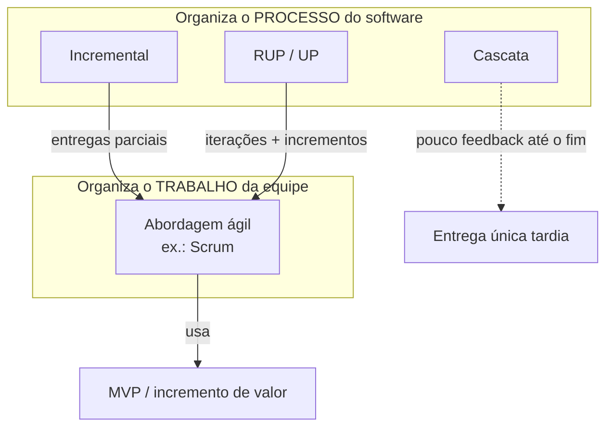
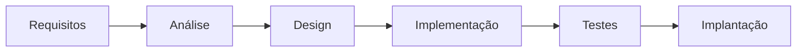

## Visão Geral do Conceito

Desenvolver backend não é só escrever endpoints: é escolher **como** o time organiza o ciclo de vida — quando levanta requisitos, quando arquiteta, quando entrega algo utilizável e quando incorpora feedback.

Nesta lição você compara quatro peças que a disciplina trata em sequência:

1. **Modelo em cascata** — fases sequenciais com pouco retorno.
2. **Modelo incremental** — várias “mini-cascata” com entregas parciais de valor.
3. **RUP** (<mark style="background-color: #242424; padding: 2px 4px; border-radius: 3px; color: inherit;">`Rational Unified Process`</mark> / Processo Unificado) — processo iterativo e incremental com fases e disciplinas.
4. **Abordagem ágil** — cultura e organização do **trabalho da equipe**, frequentemente combinada com incrementos (ex.: <mark style="background-color: #242424; padding: 2px 4px; border-radius: 3px; color: inherit;">`Scrum`</mark>).

> **Regra da aula:** cascata, incremental e RUP **não são excludentes** da abordagem ágil. Dá para combinar organização de processo com organização de equipe. O Projeto de Bloco Backend exige documentação e diagramas; a escolha de ritmo de entrega ainda pode (e deve) ser consciente.

## Modelo Mental

Pense em três perguntas diferentes:

| Pergunta | O que responde |
|----------|----------------|
| Em que **ordem** as atividades acontecem? | Cascata (linear) vs iterativo/incremental |
| Como o **produto cresce**? | Big-bang no fim vs incrementos utilizáveis |
| Como o **time e o cliente** colaboram? | Formal/documental vs ágil com feedback contínuo |

**Cascata** é uma escada: você sobe cada degrau (requisitos → análise → design → implementação → testes → implantação) e descer é caro.

**Incremental** é construir um supermercado módulo a módulo: primeiro cadastro utilizável, depois estoque, depois caixa — cada pedaço passa por requisitos/análise/design/implementação/teste/implantação **daquele incremento**.

**RUP** é um mapa 2D: no eixo horizontal há **fases** (Concepção, Elaboração, Construção, Transição); no eixo vertical há **disciplines** (requisitos, design, implementação, teste…). Em cada fase o esforço nas disciplinas muda — a famosa “minhoca” de esforço.

**Ágil** não substitui esse mapa de construção do software: responde **como o time trabalha** (cadência, colaboração, priorização com o cliente/<mark style="background-color: #242424; padding: 2px 4px; border-radius: 3px; color: inherit;">`Product Owner`</mark>, adaptação). “Ágil” aqui significa **flexível** (adaptar-se rápido), não apenas “entregar correndo”.



## Mecânica Central

### 1. Cascata (revisão da aula anterior + recorte desta aula)

O modelo em cascata foi o primeiro ciclo de vida formalmente documentado. O princípio é: **é possível entender e planejar o sistema desde o início**, antes de codificar.

**Fases principais** (material da Aula 2 / slides):

1. **Requisitos** — entrevistas, reuniões, questionários; entregável: documento de requisitos.
2. **Análise** — modelo lógico, casos de uso, regras.
3. **Design** — alto nível (módulos/arquitetura) e detalhado (UI, BD, algoritmos).
4. **Implementação** — codificação por módulo.
5. **Testes** — validação do sistema completo contra requisitos.
6. **Implantação** — entrega no ambiente do cliente; manutenção tende a ser tratada à parte.

**Quando tende a funcionar bem**

- Requisitos estáveis e bem definidos (ex.: inventário hospitalar com documento técnico prévio e auditoria).
- Exigência forte de documentação, rastreabilidade e formalidade.
- Baixa expectativa de mudança frequente.

**Limitações enfatizadas**

- Mudanças são difíceis após iniciar a fase seguinte.
- Erros descobertos tarde forçam revisões caras.
- O cliente só vê o produto no **final** — perde-se a troca contínua.



### 2. Modelo incremental

No incremental, o produto é construído em **iterações curtas**. A cada ciclo a equipe entrega um **incremento operacional** — uma parte pronta para o usuário interagir e dar feedback.

Pontos mecânicos da aula:

- Entrega de **valor**, não de “linhas de código invisíveis”. Terminar criptografia interna é importante, mas o incremento típico é o que o usuário enxerga (ex.: módulo de login testável).
- Evitar confundir com “versão 1 / versão 2” de um sistema **já completo**. O foco é **módulo utilizável** dentro do sistema em evolução.
- Internamente, cada incremento percorre atividades semelhantes à cascata (requisitos → … → implantação), só que no **escopo daquele pedaço** — “várias cascatas menores”.
- É possível usar incremental **sem** ser ágil; e frameworks ágeis (ex.: Scrum) **já embutem** incremento ao fim de cada <mark style="background-color: #242424; padding: 2px 4px; border-radius: 3px; color: inherit;">`sprint`</mark>.

**Exemplo da aula — sistema de supermercado**

Possíveis módulos: cadastro, login, estoque, caixa, relatório.  
Ordem ilustrativa de entregas: cadastro → estoque → … até o produto completo.

### 3. RUP / Processo Unificado

O RUP (citado na aula a partir do *Unified Process* / linha Rational–IBM) unifica boas práticas de modelos anteriores. Organiza o ciclo em:

| Eixo | Conteúdo |
|------|----------|
| Horizontal (dinâmico) | **Fases** |
| Vertical (estático) | **Disciplinas** (containers lógicos de atividades) |

**Quatro fases**

| Fase | Objetivo central (aula) |
|------|-------------------------|
| **Concepção** (*Inception*) | Decidir o que fazer; escopo; custos; riscos; business case; base sólida do projeto |
| **Elaboração** | Mitigar riscos técnicos; arquitetura base; planejar atividades/recursos; sair com projeto **viável** (pode incluir POC, ex.: API de terceiro / integração governamental) |
| **Construção** | Pico da disciplina de implementação; construir versão operacional testável/avaliável |
| **Transição** | Pente fino: testes, correções, implantação, treinamento/manual para usuários finais |

Cada fase contém **uma ou mais iterações** (número não fixo). O gráfico de esforço por disciplina muda entre fases: requisitos/modelagem de negócio têm pico cedo; implementação tem pico na Construção; na Elaboração a implementação aparece pontualmente para reduzir risco.

> **Verdadeiro ou falso da aula:** “Termino 100% a Concepção, depois 100% a Elaboração, e assim por diante, como cascata.” → **Falso.** RUP é **iterativo e incremental**: há retorno para refinar requisitos, regras e implementação ao longo das iterações.

Disciplinas mencionadas (nove no total, lista da aula): modelagem de negócio, gestão de requisitos, análise, design, implementação, implantação, teste, gerenciamento de projeto, gerenciamento de mudanças e ambiente.

**Trade-off citado:** RUP é muito organizado e documentado — vantagem acadêmica/estrutural — mas o excesso de organização/documentação pode atrapalhar se virar burocracia sem entrega.

### 4. Abordagem ágil

Ágil é **metodologia / cultura de trabalho**: define comportamento do time, cadência e colaboração. Não substitui o mapa de fases do RUP; usa ideias de incremento e frequentemente o conceito de <mark style="background-color: #242424; padding: 2px 4px; border-radius: 3px; color: inherit;">`MVP`</mark> (produto minimamente viável) — pedaço funcional que o usuário consegue testar cedo.

**Scrum** (exemplo mais citado):

- <mark style="background-color: #242424; padding: 2px 4px; border-radius: 3px; color: inherit;">`Daily`</mark> — alinhamento curto (literatura: máx. ~15 min; se vira “clima de futebol”, saiu do propósito).
- <mark style="background-color: #242424; padding: 2px 4px; border-radius: 3px; color: inherit;">`Sprint`</mark> — iteração com incremento.
- Retrospectiva, <mark style="background-color: #242424; padding: 2px 4px; border-radius: 3px; color: inherit;">`backlog`</mark>, histórias de usuário.
- Papéis (ex.: <mark style="background-color: #242424; padding: 2px 4px; border-radius: 3px; color: inherit;">`Product Owner`</mark> como representante do cliente).
- Na prática, times adaptam cerimônias; a aula admite adaptação consciente, sem abandonar o propósito.

**Manifesto Ágil (2001)** — contexto: reação ao domínio do cascata. Valores enfatizados na aula:

- **Indivíduos e interações** mais que processos e ferramentas.
- **Retroalimentação com o cliente / software em uso** mais que documentação extensa desde o início.
- Cliente como **parceiro** (via PO) para validar valor e priorizar o que importa.

> Flexibilidade ≠ mudança caótica. A aula deixa explícito: mudar o sistema **toda hora** também atrapalha o projeto.

**Diferença incremental × ágil (síntese da aula)**

- **Incremental / RUP / cascata:** organizam **como o software é construído** (processo).
- **Ágil:** organiza **como a equipe trabalha** e interage com o cliente (daily, sprint, retrospectiva, backlog, histórias, feedback).
- Scrum **usa** incremento a cada sprint → são **complementares**, não concorrentes.

### 5. Ponte para requisitos e UML

Em cascata, incremental e RUP há faixa explícita de requisitos. No ágil também há levantamento, porém com menos detalhe inicial e mais refinamento contínuo (ex.: backlog priorizado).

Qualidade de requisitos citada: interpretação consistente (dev e teste), sem contradição, **testáveis**, **priorizados**.  
**Valor de negócio ≠ complexidade técnica** — priorizar o que o cliente enxerga e valida.

Artefatos citados: modelo de casos de uso (funcionais), especificações suplementares (não funcionais, ex.: latência &lt; 3s, usabilidade, segurança), glossário (mesma linguagem negócio–dev), regras de negócio.

<mark style="background-color: #242424; padding: 2px 4px; border-radius: 3px; color: inherit;">`UML`</mark> (*Unified Modeling Language*): linguagem visual para especificar, construir e documentar artefatos (classes, interações, sequências, casos de uso…). Objetivo: anotação comum e entendimento simplificado para negócio e time técnico.

Cobrança do projeto de bloco (aula): o **diagrama**, não a ferramenta. draw.io (ou papel + foto) é aceitável; ferramentas pagas e geração assistida por IA foram citadas como facilitadores. Próximo foco anunciado: diagrama de casos de uso; entregáveis futuros incluem requisitos, casos de uso, dicionário de dados e vários diagramas antes/junto da implementação.

## Uso Prático

### Cenário A — API de inventário hospitalar (cascata faz sentido)

Requisitos já documentados pela logística, auditoria interna, baixo risco de mudança, contrato com prazo/orçamento fechados.  
Fluxo: fechar SRS → modelar → implementar módulos → testar suite completa → implantar.  
Risco residual: qualquer mudança regulatória tardia fica cara — mas o contexto favorece formalidade.

### Cenário B — Backend de supermercado (incremental)

```text
Incremento 1: POST/GET /produtos (cadastro utilizável)
Incremento 2: estoque (entrada/saída) integrado ao cadastro
Incremento 3: caixa / venda
Incremento 4: relatórios
```

Cada incremento inclui contrato de API, testes daquele módulo e demo para o “usuário” (PO do projeto).

### Cenário C — Elaboração RUP com risco de integração

```text
Concepção: escopo "consulta a API de CEP/governo"
Elaboração (iteração 1): spike — autenticar e obter 1 resposta real
Elaboração (iteração 2): esboço de arquitetura (cliente HTTP, cache, tratamento de falha)
Construção: restante dos endpoints de negócio
Transição: carga, treinamento, checklist de deploy
```

### Cenário D — Ágil com feedback (exemplo do livro)

- **Só incremental:** capítulos 1…N entregues em sequência sem adaptar o plano.
- **Ágil:** após capítulo 2/3, leitores pedem mais da personagem X → o capítulo 4 (quase pronto) é **replanejado** para aumentar interações com X.

Pseudo-estrutura de decisão para o projeto de bloco:

```javascript
// Decisão de processo para um módulo de backend
const decisao = {
  produto: "API de biblioteca",
  incremento: "emprestimos", // utilizável pelo usuário/PO
  modeloProcesso: "incremental", // ou "rup" se fases/disciplinas forem explícitas
  organizacaoEquipe: "agil", // daily curta, demo, retrospectiva
  mvp: {
    endpoints: ["POST /emprestimos", "GET /emprestimos/:id"],
    criterioValor: "bibliotecario registra e consulta um emprestimo real",
  },
};
```

## Erros Comuns

1. **Tratar ágil como “fazer rápido sem planejar”**  
   Sintoma: zero critério de incremento, zero feedback, só pressa.  
   Correção: ágil = flexibilidade + cadência + colaboração; ainda há backlog, priorização e definição de pronto.

2. **Chamar de incremento qualquer commit técnico**  
   Sintoma: “entregamos a camada de criptografia” sem superfície testável pelo usuário.  
   Correção: amarrar incremento a capacidade observável (módulo/login/estoque).

3. **Usar cascata em startup com validação contínua**  
   Sintoma: meses de documento e demo só no fim.  
   Correção: cenário 3 dos slides (plataforma de ensino online) pede feedback rápido — cascata é inadequada.

4. **Achar que RUP é cascata com nomes bonitos**  
   Sintoma: fases 100% sequenciais sem iterações.  
   Correção: RUP permite (e espera) refinamentos; Disciplinas atravessam fases com esforços variáveis.

5. **MVP = peça isolada sem valor (roda do carro)**  
   Sintoma: entrega componente que ninguém consegue “usar” no sentido do requisito.  
   Correção: MVP deve permitir testar o objetivo (locomoção / fluxo de negócio mínimo).

6. **Mudança constante de requisito sob bandeira ágil**  
   Sintoma: replanejamento diário sem estabilidade mínima.  
   Correção: flexibilidade com senso; mudanças sem critério atrapalham mesmo em ágil.

7. **Confundir valor de negócio com complexidade**  
   Sintoma: priorizar a tarefa mais difícil tecnicamente.  
   Correção: PO prioriza valor percebido/testável; complexidade entra no esforço, não na definição de valor.

## Visão Geral de Debugging

Quando o “processo” do projeto parece quebrado, depure como um pipeline:

1. **O que foi prometido como entrega?** Era módulo utilizável ou só tarefa interna?
2. **Em que modelo estamos de fato?** Se não há demo/feedback, não estamos operando ágil — mesmo com board “Scrum”.
3. **Onde o risco técnico mora?** Se integração crítica ainda não foi provada, estamos pulando Elaboração (mentalidade RUP).
4. **O feedback chega cedo o bastante?** Se só no final, comportamento é de cascata — espere retrabalho concentrado.
5. **Requisitos estão contraditórios ou não testáveis?** Pare e pacifique (exemplo da aula: estoque mínimo vs. “reduzir estoque” sem faixa numérica).
6. **Cerimônia inchada?** Daily de 40 minutos é sintoma de processo, não de “falta de ágil”.

<details>
<summary>Checklist rápido de alinhamento processo × equipe</summary>

- Processo define **fatias do software** (incremental/RUP)  
- Equipe define **ritmo e feedback** (ágil)  
- Incremento define **valor testável** (MVP)  
- Documentos/UML definem **linguagem compartilhada** (glossário + diagramas)

</details>

## Principais Pontos

- Cascata: sequencial, documentação forte, frágil a mudanças e feedback tardio.
- Incremental: iterações curtas com incrementos operacionais de valor (módulos utilizáveis).
- RUP: 4 fases × disciplinas; iterativo e incremental; Elaboração reduz risco/arquitetura; Construção implementa o grosso.
- Ágil: organiza o trabalho da equipe e a colaboração com o cliente; “ágil” ≈ flexível.
- Incremental e ágil são **complementares** (Scrum produz incremento por sprint).
- MVP precisa ser testável no sentido do requisito — não uma peça órfã.
- Requisitos existem em todos os modelos; no ágil, detalhe inicial menor e refinamento contínuo.
- UML padroniza modelagem visual; no PB Backend cobram-se diagramas (ferramenta é meio).

## Preparação para Prática

Antes do laboratório, você deve conseguir:

- Classificar um cenário real como adequado a cascata, incremental, RUP e/ou ágil.
- Desenhar 3–4 incrementos de valor para um backend.
- Explicar o papel de cada fase RUP em uma frase.
- Distinguir organização de **processo** vs organização de **equipe**.
- Criticar um “MVP” que não entrega valor testável.

## Laboratório de Prática

> `editorLanguage`: <mark style="background-color: #242424; padding: 2px 4px; border-radius: 3px; color: inherit;">`javascript`</mark> (mapa da disciplina). Os exercícios modelam decisões de engenharia de software do Projeto de Bloco Backend — o boilerplate deve executar sem erros com os `TODO` ainda vazios/parciais.

### Exercício Easy — Classificar cenários de processo

Dado um conjunto de cenários (inspirados nos slides da Aula 2 e na discussão da Aula 3), complete a função para indicar o modelo **mais adequado** e uma justificativa curta.

```javascript
/**
 * Cenários de escolha de modelo de ciclo de vida / abordagem.
 * Retorne um array de decisões { id, modelo, justificativa }.
 * modelo ∈ "cascata" | "incremental" | "rup" | "agil"
 */
function classificarCenarios() {
  const decisoes = [];

  // TODO: para cada cenário abaixo, push { id, modelo, justificativa }
  // 1) hospital — inventário com requisitos fechados, auditoria e pouca mudança
  // 2) startup de ensino online — validar features com usuários continuamente
  // 3) backend com risco alto de integração (API governo) + necessidade de fases claras
  // 4) time quer daily, sprints e PO priorizando backlog (foco na organização da equipe)

  const cenarios = [
    { id: 1, texto: "Inventario hospitalar com SRS fechado e auditoria" },
    { id: 2, texto: "Plataforma EAD validando quizzes/foruns com usuarios" },
    { id: 3, texto: "API critica com integracao externa de alto risco" },
    { id: 4, texto: "Equipe quer cadencia Scrum e feedback de PO" },
  ];

  // placeholder: mantém o arquivo executável
  void cenarios;
  return decisoes;
}

if (require.main === module) {
  for (const d of classificarCenarios()) {
    console.log(`#${d.id} -> ${d.modelo}: ${d.justificativa}`);
  }
}

module.exports = { classificarCenarios };
```

### Exercício Medium — Plano de incrementos de um backend

Modele entregas incrementais de valor para uma **API de biblioteca** (emprestimos, reservas, relatórios), no espírito do exemplo do supermercado.

```javascript
/**
 * Cada incremento deve ser utilizável/testável por um usuario ou PO.
 * Evite incrementos "só infraestrutura invisível".
 */
function planejarIncrementosBiblioteca() {
  const incrementos = [];

  // TODO: adicionar pelo menos 4 incrementos:
  // { ordem, nome, endpoints, criterioValor, feedbackEsperado }
  // Exemplo de forma (não copie cego — complete o plano):
  // incrementos.push({
  //   ordem: 1,
  //   nome: "Cadastro de livros",
  //   endpoints: ["POST /livros", "GET /livros"],
  //   criterioValor: "bibliotecario cadastra e lista livros",
  //   feedbackEsperado: "campos obrigatorios e busca por titulo",
  // });

  return incrementos;
}

if (require.main === module) {
  for (const inc of planejarIncrementosBiblioteca()) {
    console.log(
      `${inc.ordem}. ${inc.nome} | valor: ${inc.criterioValor} | endpoints: ${inc.endpoints.join(", ")}`
    );
  }
}

module.exports = { planejarIncrementosBiblioteca };
```

### Exercício Hard — Matriz processo × equipe × risco

Para o **mesmo** sistema (API de pedidos de um e-commerce), descreva três abordagens e compare trade-offs: cascata “pura”, incremental+RUP (fases), e ágil sobre incrementos.

```javascript
/**
 * Retorne um array de abordagens:
 * {
 *   nome: "cascata" | "rup-incremental" | "agil-incremental",
 *   passos: string[],          // 4+ passos
 *   quandoUsar: string,
 *   riscoPrincipal: string,
 *   comoMitigar: string,
 *   mvpInicial: string         // o que seria a 1a entrega de valor (ou "n/a no fim")
 * }
 */
function compararAbordagensEcommerce() {
  const abordagens = [];

  // TODO: preencher 3 abordagens para o MESMO sistema de pedidos.
  // Exija contraste explícito:
  // - cascata: feedback no fim
  // - rup-incremental: fases + prova de risco na Elaboracao
  // - agil-incremental: sprints + PO + adaptação por feedback
  // Inclua um mvpInicial coerente (ou explique ausência na cascata).

  return abordagens;
}

if (require.main === module) {
  for (const a of compararAbordagensEcommerce()) {
    console.log(`\n=== ${a.nome} ===`);
    console.log(`Usar quando: ${a.quandoUsar}`);
    console.log(`Risco: ${a.riscoPrincipal}`);
    console.log(`Mitigação: ${a.comoMitigar}`);
    console.log(`MVP: ${a.mvpInicial}`);
    console.log(`Passos: ${a.passos.join(" -> ")}`);
  }
}

module.exports = { compararAbordagensEcommerce };
```

<!-- lessons.json (NÃO editar neste worker — integração serial pelo orquestrador)
discipline: projeto-bloco-backend
slug: modelos-cascata-rup-agil
title: Modelos: cascata, RUP e abordagem ágil
order: 3
file: projeto-bloco-backend/aula-03-modelos-cascata-rup-agil.md
-->

<!-- CONCEPT_EXTRACTION
concepts:
  - modelo em cascata
  - modelo incremental
  - incremento operacional de valor
  - RUP / Processo Unificado
  - fases RUP (Concepção, Elaboração, Construção, Transição)
  - disciplinas RUP
  - metodologia ágil
  - Scrum (sprint, daily, backlog, PO)
  - MVP
  - Manifesto Ágil
  - requisitos funcionais e não funcionais
  - UML
skills:
  - Escolher modelo de ciclo de vida conforme estabilidade de requisitos e necessidade de formalidade
  - Planejar incrementos utilizáveis de um backend modular
  - Distinguir organização do processo de software da organização do trabalho da equipe
  - Explicar fases e caráter iterativo do RUP
  - Avaliar se uma entrega qualifica como MVP de valor
  - Relacionar feedback de cliente/PO à adaptação de escopo
examples:
  - cascata-fases-sequenciais
  - incremental-supermercado-modulos
  - rup-fases-disciplinas-esforco
  - mvp-carro-vs-roda
  - livro-incremental-vs-agil-com-feedback
  - plano-incrementos-api-biblioteca
-->

<!-- EXERCISES_JSON
[
  {
    "id": "pb03-classificar-cenarios-processo",
    "slug": "pb03-classificar-cenarios-processo",
    "difficulty": "easy",
    "title": "Classificar cenários de processo",
    "discipline": "projeto-bloco-backend",
    "editorLanguage": "javascript",
    "tags": ["cascata", "incremental", "rup", "agil", "engenharia-software"],
    "summary": "Associar cenários (hospital, startup, risco de integração, Scrum) ao modelo mais adequado com justificativa."
  },
  {
    "id": "pb03-plano-incrementos-biblioteca",
    "slug": "pb03-plano-incrementos-biblioteca",
    "difficulty": "medium",
    "title": "Planejar incrementos de uma API de biblioteca",
    "discipline": "projeto-bloco-backend",
    "editorLanguage": "javascript",
    "tags": ["modelo-incremental", "mvp", "backend", "api"],
    "summary": "Definir pelo menos quatro incrementos utilizáveis com endpoints, critério de valor e feedback esperado."
  },
  {
    "id": "pb03-matriz-processo-equipe-risco",
    "slug": "pb03-matriz-processo-equipe-risco",
    "difficulty": "hard",
    "title": "Comparar cascata, RUP-incremental e ágil-incremental",
    "discipline": "projeto-bloco-backend",
    "editorLanguage": "javascript",
    "tags": ["trade-offs", "rup", "agil", "cascata", "mvp"],
    "summary": "Para o mesmo e-commerce de pedidos, contrastar passos, riscos, mitigações e MVP inicial em três abordagens."
  }
]
-->
