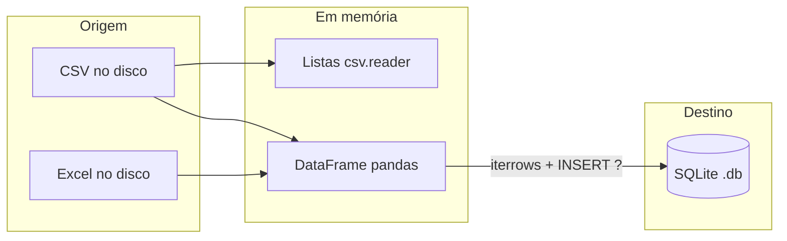
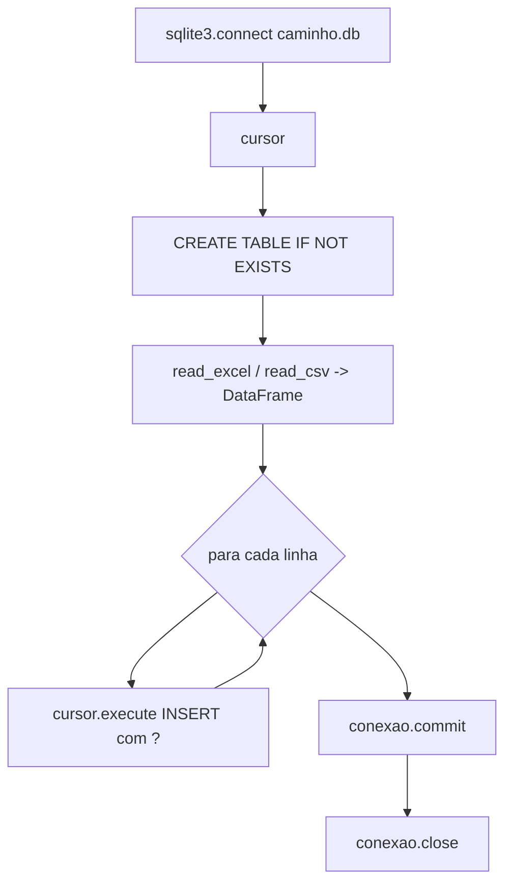
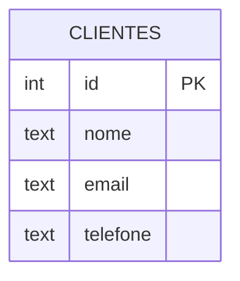

## Visão Geral do Conceito

Em projetos de dados, ficheiros <mark style="background-color: #242424; padding: 2px 4px; border-radius: 3px; color: inherit;">`CSV`</mark> e <mark style="background-color: #242424; padding: 2px 4px; border-radius: 3px; color: inherit;">`Excel`</mark> são origens muito comuns: exportações de sistemas, planilhas de negócio ou amostras de laboratório. O Python oferece duas camadas úteis: a biblioteca padrão <mark style="background-color: #242424; padding: 2px 4px; border-radius: 3px; color: inherit;">`csv`</mark> para leitura linha a linha sem dependências extra, e <mark style="background-color: #242424; padding: 2px 4px; border-radius: 3px; color: inherit;">`pandas`</mark> para carregar tabelas em <mark style="background-color: #242424; padding: 2px 4px; border-radius: 3px; color: inherit;">`DataFrame`</mark>, inspecionar e preparar dados antes de persistir.

Esta lição organiza o fluxo **ficheiro → tabela em memória → base SQLite**, alinhado aos notebooks do projeto (CSV, Excel, SQLite) e ao script simples com <mark style="background-color: #242424; padding: 2px 4px; border-radius: 3px; color: inherit;">`csv.reader`</mark>.

> **Regra:** Sempre que gravar dados vindos de ficheiros numa base, preferir comandos SQL **parametrizados** e fechar ou confirmar a transação com <mark style="background-color: #242424; padding: 2px 4px; border-radius: 3px; color: inherit;">`commit()`</mark>.

**Nota sobre fontes:** A transcrição da aula 10 é sobretudo contextual (fecho de trimestre, processos de entrega). O detalhe técnico de código reproduzido aqui baseia-se nos materiais de apoio (<mark style="background-color: #242424; padding: 2px 4px; border-radius: 3px; color: inherit;">`.txt`</mark>, notebooks <mark style="background-color: #242424; padding: 2px 4px; border-radius: 3px; color: inherit;">`.ipynb`</mark>); não há, nas fontes citadas, uma explicação palavra a palavra na transcrição para cada API do pandas. O **caso profissional** CSV grande → Python → servidor SQL (monitorização / relatórios) e o arranque do projeto e-commerce com requisitos, persistência e POC em <mark style="background-color: #242424; padding: 2px 4px; border-radius: 3px; color: inherit;">`SQLite`</mark> estão na lição [[requisitos-persistencia-poc-sqlite-ecommerce]] (baseada na Aula 11).

## Modelo Mental

Pense em **três estações** ligadas por túneis:

1. **Ficheiro no disco** — bytes organizados em linhas (CSV) ou folhas (Excel).
2. **Representação em memória** — listas de listas (<mark style="background-color: #242424; padding: 2px 4px; border-radius: 3px; color: inherit;">`csv.reader`</mark>) ou <mark style="background-color: #242424; padding: 2px 4px; border-radius: 3px; color: inherit;">`DataFrame`</mark> (pandas).
3. **Base relacional local** — ficheiro <mark style="background-color: #242424; padding: 2px 4px; border-radius: 3px; color: inherit;">`.db`</mark> SQLite com tabelas e linhas duráveis.

O pandas não substitui o SQL no destino: ele **alimenta** o motor SQLite com <mark style="background-color: #242424; padding: 2px 4px; border-radius: 3px; color: inherit;">`INSERT`</mark> linha a linha (como nos notebooks) ou, em pipelines mais avançados, com APIs em lote — aqui mantemos o modelo pedagógico explícito com <mark style="background-color: #242424; padding: 2px 4px; border-radius: 3px; color: inherit;">`iterrows()`</mark>.



## Mecânica Central

### 1. CSV com a biblioteca padrão

O módulo <mark style="background-color: #242424; padding: 2px 4px; border-radius: 3px; color: inherit;">`csv`</mark> expõe <mark style="background-color: #242424; padding: 2px 4px; border-radius: 3px; color: inherit;">`csv.reader`</mark>, que devolve um iterador de linhas; cada linha é uma lista de campos <mark style="background-color: #242424; padding: 2px 4px; border-radius: 3px; color: inherit;">`str`</mark>.

```python
import csv

nome_arquivo = r"C:\dados\csv_Cliente.csv"

with open(nome_arquivo, mode="r", encoding="utf-8") as arquivo:
    leitor = csv.reader(arquivo)
    for linha in leitor:
        print(linha)
```

Pontos importantes:

- <mark style="background-color: #242424; padding: 2px 4px; border-radius: 3px; color: inherit;">`encoding='utf-8'`</mark> reduz surpresas com acentos em Windows.
- <mark style="background-color: #242424; padding: 2px 4px; border-radius: 3px; color: inherit;">`with open(...)`</mark> garante fecho do ficheiro mesmo em erro.

### 2. Caminhos no Windows e strings cruas

Barras invertidas em strings Python iniciam sequências de escape (<mark style="background-color: #242424; padding: 2px 4px; border-radius: 3px; color: inherit;">`\n`</mark>, <mark style="background-color: #242424; padding: 2px 4px; border-radius: 3px; color: inherit;">`\t`</mark>). Três padrões seguros:

- Prefixo <mark style="background-color: #242424; padding: 2px 4px; border-radius: 3px; color: inherit;">`r'...\...'`</mark> (*raw string*): barras são literais.
- Barras normais <mark style="background-color: #242424; padding: 2px 4px; border-radius: 3px; color: inherit;">`'C:/pasta/arquivo.csv'`</mark> — também aceites no Windows.
- Duplicar barras <mark style="background-color: #242424; padding: 2px 4px; border-radius: 3px; color: inherit;">`'C:\\pasta\\arquivo.csv'`</mark>.

### 3. pandas: `read_csv`, `head`, `info`

```python
import pandas as pd

df = pd.read_csv(r"C:\dados\csv_Cliente.csv")
df.head(5)
df.info()
```

- <mark style="background-color: #242424; padding: 2px 4px; border-radius: 3px; color: inherit;">`read_csv`</mark> infere separador e constrói colunas a partir do cabeçalho.
- <mark style="background-color: #242424; padding: 2px 4px; border-radius: 3px; color: inherit;">`head`</mark> mostra as primeiras linhas.
- <mark style="background-color: #242424; padding: 2px 4px; border-radius: 3px; color: inherit;">`info`</mark> resume nomes de colunas, tipos e contagem de não nulos.

### 4. pandas: `read_excel` e folhas

```python
df = pd.read_excel(r"C:\dados\excel_Cliente.xlsx")
df_planilha = pd.read_excel(
    r"C:\dados\excel_Cliente.xlsx",
    sheet_name="sheet1",
)
```

O argumento <mark style="background-color: #242424; padding: 2px 4px; border-radius: 3px; color: inherit;">`sheet_name`</mark> seleciona a folha quando o livro tem várias.

### 5. Percorrer linhas: `iterrows`

Cada linha de <mark style="background-color: #242424; padding: 2px 4px; border-radius: 3px; color: inherit;">`iterrows()`</mark> expõe colunas pelo nome (ex.: <mark style="background-color: #242424; padding: 2px 4px; border-radius: 3px; color: inherit;">`linha['Nome']`</mark>). Nos notebooks do projeto, o padrão liga diretamente a um <mark style="background-color: #242424; padding: 2px 4px; border-radius: 3px; color: inherit;">`INSERT`</mark> futuro.

> **Regra:** O objeto iterado tem de ser o mesmo <mark style="background-color: #242424; padding: 2px 4px; border-radius: 3px; color: inherit;">`DataFrame`</mark> que carregou os dados — evite carregar em <mark style="background-color: #242424; padding: 2px 4px; border-radius: 3px; color: inherit;">`df4`</mark> e iterar <mark style="background-color: #242424; padding: 2px 4px; border-radius: 3px; color: inherit;">`df`</mark> sem o ter definido na mesma execução.

### 6. SQLite: conexão, DDL, DML e transação



Modelo de dados mínimo (exemplo dos notebooks):



```python
import sqlite3
import pandas as pd

caminho_excel = r"C:\dados\excel_Cliente.xlsx"
nome_banco = r"C:\dados\Databases.db"

conexao = sqlite3.connect(nome_banco)
cursor = conexao.cursor()

cursor.execute(
    """
    CREATE TABLE IF NOT EXISTS clientes (
        id INTEGER PRIMARY KEY AUTOINCREMENT,
        nome TEXT,
        email TEXT,
        telefone TEXT
    )
    """
)

df = pd.read_excel(caminho_excel)

for indice, linha in df.iterrows():
    nome = linha["Nome"]
    email = linha["Email"]
    tel = linha["Telefone"]
    cursor.execute(
        "INSERT INTO clientes (nome, email, telefone) VALUES (?, ?, ?)",
        (nome, email, tel),
    )

conexao.commit()
conexao.close()
```

- <mark style="background-color: #242424; padding: 2px 4px; border-radius: 3px; color: inherit;">`sqlite3.connect`</mark> cria o ficheiro da base se não existir.
- Sem <mark style="background-color: #242424; padding: 2px 4px; border-radius: 3px; color: inherit;">`commit()`</mark>, os <mark style="background-color: #242424; padding: 2px 4px; border-radius: 3px; color: inherit;">`INSERT`</mark> podem não ficar persistentes ao fechar.

## Uso Prático

### Inspecionar antes de inserir

Combine <mark style="background-color: #242424; padding: 2px 4px; border-radius: 3px; color: inherit;">`info()`</mark> com uma impressão das colunas reais do Excel para alinhar nomes (<mark style="background-color: #242424; padding: 2px 4px; border-radius: 3px; color: inherit;">`linha['Nome']`</mark> só funciona se a coluna se chamar exatamente `Nome`).

### CSV grande vs pandas

Para ficheiros enormes, ler tudo para um <mark style="background-color: #242424; padding: 2px 4px; border-radius: 3px; color: inherit;">`DataFrame`</mark> de uma vez pode consumir muita RAM; em produção costuma-se usar leitura em chunks (<mark style="background-color: #242424; padding: 2px 4px; border-radius: 3px; color: inherit;">`read_csv(..., chunksize=...)`</mark>) ou streaming com <mark style="background-color: #242424; padding: 2px 4px; border-radius: 3px; color: inherit;">`csv`</mark>. Para o âmbito do projeto de bloco, o foco é **correção e clareza** do pipeline.

## Erros Comuns

- **`UnicodeDecodeError` ao abrir CSV:** encoding errado; experimentar <mark style="background-color: #242424; padding: 2px 4px; border-radius: 3px; color: inherit;">`utf-8-sig`</mark> se o ficheiro tiver BOM, ou o encoding exportado pela origem.
- **`FileNotFoundError`:** caminho incorreto ou diretório de trabalho do notebook diferente do esperado; validar com caminho absoluto ou <mark style="background-color: #242424; padding: 2px 4px; border-radius: 3px; color: inherit;">`pathlib.Path`</mark>.
- **`KeyError` em `linha['Nome']`:** nome de coluna não coincide (espaços, maiúsculas); usar <mark style="background-color: #242424; padding: 2px 4px; border-radius: 3px; color: inherit;">`df.columns`</mark> e normalizar.
- **`NameError: df is not defined`:** células fora de ordem no Jupyter ou variável errada após renomear (<mark style="background-color: #242424; padding: 2px 4px; border-radius: 3px; color: inherit;">`df`</mark> vs <mark style="background-color: #242424; padding: 2px 4px; border-radius: 3px; color: inherit;">`df4`</mark>).
- **Dados não aparecem na base após o script:** falta <mark style="background-color: #242424; padding: 2px 4px; border-radius: 3px; color: inherit;">`commit()`</mark> ou está a abrir outro ficheiro <mark style="background-color: #242424; padding: 2px 4px; border-radius: 3px; color: inherit;">`.db`</mark> diferente do que inspeciona.

## Visão Geral de Debugging

1. Confirme **qual ficheiro** está a ser lido (imprima o caminho resolvido).
2. Confirme **schema** (<mark style="background-color: #242424; padding: 2px 4px; border-radius: 3px; color: inherit;">`df.info()`</mark> e <mark style="background-color: #242424; padding: 2px 4px; border-radius: 3px; color: inherit;">`list(df.columns)`</mark>).
3. Num notebook, **Run All** ou execute de cima a baixo após mudar nomes de variáveis.
4. Na base, use um cliente SQLite para <mark style="background-color: #242424; padding: 2px 4px; border-radius: 3px; color: inherit;">`SELECT COUNT(*)`</mark> após <mark style="background-color: #242424; padding: 2px 4px; border-radius: 3px; color: inherit;">`commit()`</mark>.

## Principais Pontos

- <mark style="background-color: #242424; padding: 2px 4px; border-radius: 3px; color: inherit;">`csv.reader`</mark> para leitura simples; <mark style="background-color: #242424; padding: 2px 4px; border-radius: 3px; color: inherit;">`pandas`</mark> para tabelas analíticas.
- Caminhos Windows: <mark style="background-color: #242424; padding: 2px 4px; border-radius: 3px; color: inherit;">`r''`</mark>, <mark style="background-color: #242424; padding: 2px 4px; border-radius: 3px; color: inherit;">`'/'`</mark> ou <mark style="background-color: #242424; padding: 2px 4px; border-radius: 3px; color: inherit;">`'\\'`</mark>.
- <mark style="background-color: #242424; padding: 2px 4px; border-radius: 3px; color: inherit;">`read_excel(..., sheet_name=...)`</mark> escolhe a folha.
- <mark style="background-color: #242424; padding: 2px 4px; border-radius: 3px; color: inherit;">`iterrows()`</mark> + <mark style="background-color: #242424; padding: 2px 4px; border-radius: 3px; color: inherit;">`INSERT`</mark> com <mark style="background-color: #242424; padding: 2px 4px; border-radius: 3px; color: inherit;">`?`</mark> liga Excel/CSV a SQLite de forma segura.
- <mark style="background-color: #242424; padding: 2px 4px; border-radius: 3px; color: inherit;">`commit()`</mark> persiste; <mark style="background-color: #242424; padding: 2px 4px; border-radius: 3px; color: inherit;">`close()`</mark> liberta recursos.

## Preparação para Prática

Deve ser capaz de: abrir um CSV com <mark style="background-color: #242424; padding: 2px 4px; border-radius: 3px; color: inherit;">`csv`</mark>; carregar o mesmo ficheiro com <mark style="background-color: #242424; padding: 2px 4px; border-radius: 3px; color: inherit;">`read_csv`</mark>; carregar um <mark style="background-color: #242424; padding: 2px 4px; border-radius: 3px; color: inherit;">`xlsx`</mark>; criar tabela e inserir linhas em SQLite com transação completa.

## Laboratório de Prática

### Exercício Easy — Contar linhas de um CSV com a biblioteca padrão

Implemente a contagem de linhas de dados (excluindo cabeçalho, se existir) usando só <mark style="background-color: #242424; padding: 2px 4px; border-radius: 3px; color: inherit;">`csv`</mark>.

```python
import csv
from pathlib import Path


def contar_linhas_dados(caminho_csv: Path) -> int:
    """Retorna o número de linhas de registo após o cabeçalho."""
    # TODO: abrir caminho_csv em modo leitura com utf-8, usar csv.reader e contar
    return 0


if __name__ == "__main__":
    amostra = Path("clientes_export.csv")
    print(contar_linhas_dados(amostra))
```

### Exercício Medium — Resumo de colunas com pandas

Dado um CSV de clientes, carregue com pandas e devolva o número de linhas e a lista de nomes de colunas.

```python
from pathlib import Path

import pandas as pd


def resumo_csv(caminho: Path) -> tuple[int, list[str]]:
    """Retorna (n_linhas, colunas)."""
    # TODO: read_csv, obter len(df) e list(df.columns)
    return 0, []


if __name__ == "__main__":
    print(resumo_csv(Path("clientes_export.csv")))
```

### Exercício Hard — Inserir amostra em SQLite a partir de um DataFrame em memória

Complete a função que recebe um <mark style="background-color: #242424; padding: 2px 4px; border-radius: 3px; color: inherit;">`DataFrame`</mark> já alinhado às colunas <mark style="background-color: #242424; padding: 2px 4px; border-radius: 3px; color: inherit;">`nome`</mark>, <mark style="background-color: #242424; padding: 2px 4px; border-radius: 3px; color: inherit;">`email`</mark>, <mark style="background-color: #242424; padding: 2px 4px; border-radius: 3px; color: inherit;">`telefone`</mark> e grava na tabela <mark style="background-color: #242424; padding: 2px 4px; border-radius: 3px; color: inherit;">`clientes`</mark>.

```python
import sqlite3

import pandas as pd


def gravar_clientes(df: pd.DataFrame, caminho_db: str) -> int:
    """Cria clientes se necessário, insere todas as linhas e devolve quantas inseriu."""
    # TODO: connect, CREATE TABLE IF NOT EXISTS, loop iterrows, INSERT ?, commit, close
    return 0


if __name__ == "__main__":
    df = pd.DataFrame(
        [
            {"nome": "Ana", "email": "ana@empresa.com", "telefone": "11999990000"},
        ]
    )
    print(gravar_clientes(df, ":memory:"))
```

<!-- CONCEPT_EXTRACTION
concepts:
  - csv.reader e encoding utf-8
  - raw strings e caminhos Windows
  - pandas read_csv read_excel head info
  - DataFrame iterrows
  - sqlite3 connect execute commit INSERT parametrizado
skills:
  - Ler CSV com biblioteca padrao e com pandas
  - Inspecionar DataFrame antes de integrar com SQL
  - Carregar folha especifica de Excel com sheet_name
  - Inserir linhas em SQLite com placeholders e transacao
examples:
  - csv-utf8-leitor-simples
  - pandas-caminhos-windows
  - pipeline-excel-sqlite-commit
-->

<!-- EXERCISES_JSON
[
  {
    "id": "contar-linhas-csv-stdlib",
    "slug": "contar-linhas-csv-stdlib",
    "difficulty": "easy",
    "title": "Contar linhas de dados de um CSV com csv.reader",
    "discipline": "projeto-bloco",
    "editorLanguage": "python",
    "tags": ["projeto-bloco", "python", "csv", "stdlib"],
    "summary": "Implementar contagem de linhas de registo após cabeçalho usando só o módulo csv."
  },
  {
    "id": "resumo-colunas-pandas-csv",
    "slug": "resumo-colunas-pandas-csv",
    "difficulty": "medium",
    "title": "Resumo de CSV com pandas (linhas e colunas)",
    "discipline": "projeto-bloco",
    "editorLanguage": "python",
    "tags": ["projeto-bloco", "python", "pandas", "csv"],
    "summary": "Carregar CSV com read_csv e devolver número de linhas e lista de colunas."
  },
  {
    "id": "gravar-dataframe-sqlite-clientes",
    "slug": "gravar-dataframe-sqlite-clientes",
    "difficulty": "hard",
    "title": "Gravar DataFrame de clientes em SQLite com INSERT parametrizado",
    "discipline": "projeto-bloco",
    "editorLanguage": "python",
    "tags": ["projeto-bloco", "python", "pandas", "sqlite"],
    "summary": "Completar função que cria tabela se necessário, insere linhas com placeholders e faz commit."
  }
]
-->
