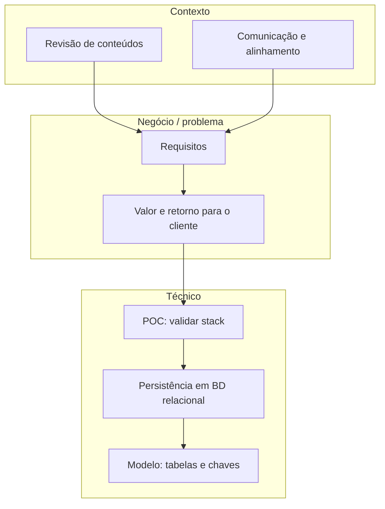
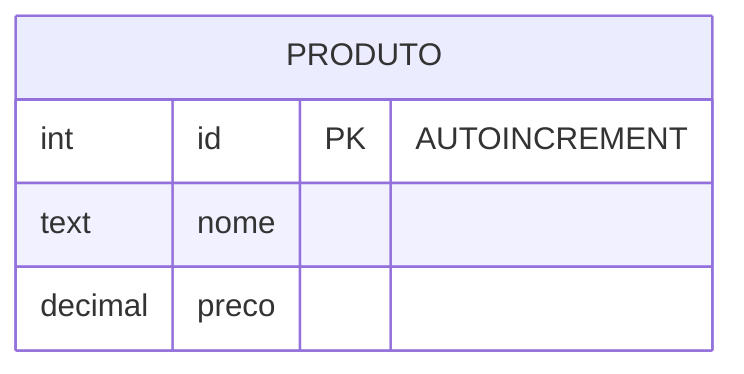

## Visão Geral do Conceito

Esta lição reconstrói o fio condutor da **Aula 11** (transcrição): início de trimestre, revisão do que já viram em Python e bases de dados, um **caso real** de leitura de CSV grande vindo de monitorização de servidores, e a passagem ao **desenho de um projeto** (e-commerce didático) com foco em **requisitos**, **valor entregue**, **persistência**, **prova de conceito** e **primeira tabela** em <mark style="background-color: #242424; padding: 2px 4px; border-radius: 3px; color: inherit;">`SQLite`</mark>.

O código operacional de <mark style="background-color: #242424; padding: 2px 4px; border-radius: 3px; color: inherit;">`read_csv`</mark>, <mark style="background-color: #242424; padding: 2px 4px; border-radius: 3px; color: inherit;">`read_excel`</mark> e carga com <mark style="background-color: #242424; padding: 2px 4px; border-radius: 3px; color: inherit;">`sqlite3`</mark> continua central na lição [[ingestao-csv-excel-pandas-sqlite]]; aqui o enfoque é **porquê** e **enquadramento de projeto**, com ligação direta ao que o professor demonstra na gravação (incluindo uso de ferramenta gráfica para <mark style="background-color: #242424; padding: 2px 4px; border-radius: 3px; color: inherit;">`SQLite`</mark>).

> **Regra:** Em transcrições automáticas aparecem variantes como «Sql Light» ou «scanner light» — trate sempre como <mark style="background-color: #242424; padding: 2px 4px; border-radius: 3px; color: inherit;">`SQLite`</mark> ao escrever documentação ou código.

**Recurso institucional (mencionado em aula):** a faculdade disponibiliza biblioteca digital (ex.: plataforma tipo O’Reilly) com livros e cursos — útil para aprofundar <mark style="background-color: #242424; padding: 2px 4px; border-radius: 3px; color: inherit;">`Python`</mark>, SQL e IA com fonte editorial estável, além de tutoriais na web.

## Modelo Mental



Pense no **e-commerce de exemplo** não como produto final, mas como **vértice didático**: obriga a listar funções (vender, cadastrar cliente, fornecedor, troca) e depois a perguntar **onde isso fica gravado** — daí a persistência e o desenho da primeira tabela.

## Mecânica Central

### 1. Caso real: CSV de monitorização → Python → SQL Server

Na revisão, o professor descreve testes de carga num sistema empresarial (referência a stack <mark style="background-color: #242424; padding: 2px 4px; border-radius: 3px; color: inherit;">`SAP`</mark> / <mark style="background-color: #242424; padding: 2px 4px; border-radius: 3px; color: inherit;">`Db2`</mark>): contadores no <mark style="background-color: #242424; padding: 2px 4px; border-radius: 3px; color: inherit;">`Linux`</mark> gravam métricas em **CSV** ao longo do dia (segundo a segundo, ficheiro grande). O fluxo relatado é:

1. Copiar o CSV do servidor para a máquina local.
2. Ler em **Python** com o mesmo tipo de leitura rápida que viram nos notebooks (em memória, «em questão de um segundo» na narrativa da aula).
3. **Carregar** os dados num servidor <mark style="background-color: #242424; padding: 2px 4px; border-radius: 3px; color: inherit;">`SQL Server`</mark> para montar **gráficos** e análise de CPU, rede e serviços.

Isto concretiza o pipeline genérico da lição de ingestão: ficheiro bruto → ferramenta de análise → base relacional para relatório.

### 2. Comunicação como parte do projeto

A aula usa um episódio administrativo (presença, coordenação) para reforçar que **falhas de alinhamento** entre partes são problema de **projeto e comunicação**, não só «detalhe burocrático». Em engenharia, canais claros (e-mail, reunião, registo de decisão) reduzem retrabalho.

### 3. Requisitos funcionais e não funcionais

- **Funcional:** o que a solução **faz** (cadastro de produto, venda, cadastro de cliente ou fornecedor, troca de produto, etc., no esboço de e-commerce da aula).
- **Não funcional:** **como** ou **sob que restrições** o sistema deve operar (desempenho, segurança, legislação, disponibilidade, usabilidade).

### 4. Valor e retorno

«Retorno» aqui não é financeiro direto: é **o que se entrega** ao cliente ou à empresa e **que problema resolve** (ex.: camada de visualização ou análise de dados confiável sobre vendas).

### 5. Persistência e escolha de base relacional

Aplicações precisam **gravar estado** entre sessões. Para o e-commerce de estudo, a aula fixa **base relacional** (não <mark style="background-color: #242424; padding: 2px 4px; border-radius: 3px; color: inherit;">`NoSQL`</mark> neste momento) e **<mark style="background-color: #242424; padding: 2px 4px; border-radius: 3px; color: inherit;">`SQLite`</mark>** como motor acessível para **prova de conceito** — alinhado ao que já praticaram com <mark style="background-color: #242424; padding: 2px 4px; border-radius: 3px; color: inherit;">`Python`</mark> e <mark style="background-color: #242424; padding: 2px 4px; border-radius: 3px; color: inherit;">`sqlite3`</mark> nos notebooks.

### 6. Primeira tabela: `produto` e chave primária

Na demonstração conceptual, a tabela **produto** surge com identificador numérico:

- não nulo;
- **chave primária** (<mark style="background-color: #242424; padding: 2px 4px; border-radius: 3px; color: inherit;">`PRIMARY KEY`</mark>);
- **autoincremental** (<mark style="background-color: #242424; padding: 2px 4px; border-radius: 3px; color: inherit;">`AUTOINCREMENT`</mark> em <mark style="background-color: #242424; padding: 2px 4px; border-radius: 3px; color: inherit;">`SQLite`</mark>), garantindo valores distintos por linha de forma sequencial automática.



Em implementação com <mark style="background-color: #242424; padding: 2px 4px; border-radius: 3px; color: inherit;">`sqlite3`</mark> em Python, o padrão é o mesmo da lição de ingestão: <mark style="background-color: #242424; padding: 2px 4px; border-radius: 3px; color: inherit;">`CREATE TABLE IF NOT EXISTS`</mark> seguido de <mark style="background-color: #242424; padding: 2px 4px; border-radius: 3px; color: inherit;">`INSERT`</mark> com placeholders.

## Uso Prático

1. Quando receber um **CSV grande** de monitorização ou logs, siga o roteiro: amostra com <mark style="background-color: #242424; padding: 2px 4px; border-radius: 3px; color: inherit;">`head`</mark> / <mark style="background-color: #242424; padding: 2px 4px; border-radius: 3px; color: inherit;">`read_csv`</mark> com cuidado de memória (ver lição de ingestão para <mark style="background-color: #242424; padding: 2px 4px; border-radius: 3px; color: inherit;">`chunksize`</mark> quando necessário).
2. Antes de codificar telas, **liste requisitos** e marque dependências de dados (que entidades precisam de tabela).
3. Para validar <mark style="background-color: #242424; padding: 2px 4px; border-radius: 3px; color: inherit;">`SQLite`</mark> no projeto, crie um ficheiro <mark style="background-color: #242424; padding: 2px 4px; border-radius: 3px; color: inherit;">`.db`</mark>, uma tabela mínima e alguns <mark style="background-color: #242424; padding: 2px 4px; border-radius: 3px; color: inherit;">`INSERT`</mark> de teste — **POC** fechada com critério claro (ex.: «conseguir listar produtos por API ou script»).

## Erros Comuns

- **Confundir requisito funcional com não funcional** — ex.: «rápido» é não funcional; «emitir fatura» é funcional.
- **Começar pela interface** sem modelo de persistência — gera retrabalho quando a equipa de dados descobre que o modelo não suporta o relatório pedido.
- **POC sem critério de sucesso** — vira experimento interminável; defina «passa/falha» e prazo.
- **Ignorar diferença entre motor embebido (<mark style="background-color: #242424; padding: 2px 4px; border-radius: 3px; color: inherit;">`SQLite`</mark>) e servidor** — para o curso, <mark style="background-color: #242424; padding: 2px 4px; border-radius: 3px; color: inherit;">`SQLite`</mark> é excelente para PoC e protótipo; produção com muitos escritores simultâneos pode exigir outro SGBD.

## Visão Geral de Debugging

**Não aplicável** no sentido de depurar código desta lição (é sobretudo conceitual). Para scripts de carga, volte à secção de debugging da lição [[ingestao-csv-excel-pandas-sqlite]].

## Principais Pontos

- Caso real reforça: **CSV + Python + base relacional** é rotina em operações e dados.
- **Comunicação** e registo de decisões fazem parte da qualidade do projeto.
- **Requisitos** funcionais vs não funcionais estruturam escopo e testes.
- **Persistência** e modelo relacional sustentam e-commerce e aplicações semelhantes.
- **POC** valida tecnologia antes do investimento pesado.
- **Chave primária** com **autoincremento** identifica unicamente cada produto na tabela inicial.

## Preparação para Prática

Deve ser capaz de: explicar o caso CSV→Python→SQL em voz própria; classificar requisitos; definir uma POC para validar <mark style="background-color: #242424; padding: 2px 4px; border-radius: 3px; color: inherit;">`SQLite`</mark>; escrever um <mark style="background-color: #242424; padding: 2px 4px; border-radius: 3px; color: inherit;">`CREATE TABLE produto`</mark> mínimo coerente com a aula.

## Laboratório de Prática

### Easy — Classificar requisitos

Classifique cada item como `funcional` ou `nao_funcional` (retorne um dicionário com listas).

```python
from typing import Literal

ReqTipo = Literal["funcional", "nao_funcional"]


def classificar_requisitos() -> dict[str, list[str]]:
    """Classifica exemplos fixos de requisitos de um e-commerce."""
    exemplos = [
        "O sistema deve permitir cadastrar produtos com nome e preço.",
        "O tempo de resposta do checkout deve ser inferior a 3 segundos na mediana.",
        "O administrador deve exportar vendas em CSV.",
        "Os dados pessoais devem respeitar a política de minimização definida pelo cliente.",
    ]
    # TODO: devolver {"funcional": [...], "nao_funcional": [...]}
    return {"funcional": [], "nao_funcional": []}


if __name__ == "__main__":
    print(classificar_requisitos())
```

### Medium — Definir uma POC

Complete a função com **objetivo**, **escopo técnico** e **critério de sucesso** mensurável para testar <mark style="background-color: #242424; padding: 2px 4px; border-radius: 3px; color: inherit;">`SQLite`</mark> + <mark style="background-color: #242424; padding: 2px 4px; border-radius: 3px; color: inherit;">`Python`</mark> num cenário de e-commerce.

```python
def resumo_poc_sqlite() -> str:
    """Devolve um parágrafo (3-5 frases) descrevendo uma prova de conceito."""
    # TODO: mencionar criação de .db, tabela produto mínima e teste de inserção/consulta
    return ""


if __name__ == "__main__":
    print(resumo_poc_sqlite())
```

### Hard — DDL da tabela `produto`

Escreva o SQL de criação da tabela **produto** com <mark style="background-color: #242424; padding: 2px 4px; border-radius: 3px; color: inherit;">`id`</mark> inteiro chave primária autoincremental, <mark style="background-color: #242424; padding: 2px 4px; border-radius: 3px; color: inherit;">`nome`</mark> texto não nulo e <mark style="background-color: #242424; padding: 2px 4px; border-radius: 3px; color: inherit;">`preco`</mark> numérico.

```sql
-- TODO: completar CREATE TABLE produto para SQLite
-- (id INTEGER PRIMARY KEY AUTOINCREMENT, nome TEXT NOT NULL, preco REAL)
SELECT 1 AS placeholder;
```

<!-- CONCEPT_EXTRACTION
concepts:
  - pipeline csv pandas sql server caso real
  - comunicacao e alinhamento em projeto
  - requisitos funcionais vs nao funcionais
  - valor entregue ao cliente
  - persistencia e sqlite em poc
  - chave primaria autoincremento produto
skills:
  - Explicar fluxo de dados de monitorizacao ate relatorio SQL
  - Classificar requisitos de software em funcionais e nao funcionais
  - Definir prova de conceito com criterio de sucesso
  - Esboçar DDL inicial de produto em SQLite
examples:
  - caso-db2-csv-monitorizacao
  - ecommerce-requisitos-esboco
  - create-table-produto-poc
-->

<!-- EXERCISES_JSON
[
  {
    "id": "classificar-requisitos-ecommerce",
    "slug": "classificar-requisitos-ecommerce",
    "difficulty": "easy",
    "title": "Classificar requisitos funcionais e não funcionais",
    "discipline": "projeto-bloco",
    "editorLanguage": "python",
    "tags": ["projeto-bloco", "requisitos", "e-commerce"],
    "summary": "Separar itens de requisitos em listas funcionais e não funcionais."
  },
  {
    "id": "resumo-poc-sqlite-ecommerce",
    "slug": "resumo-poc-sqlite-ecommerce",
    "difficulty": "medium",
    "title": "Definir uma POC SQLite + Python para e-commerce",
    "discipline": "projeto-bloco",
    "editorLanguage": "python",
    "tags": ["projeto-bloco", "poc", "sqlite"],
    "summary": "Escrever parágrafo com objetivo, escopo e critério de sucesso de uma prova de conceito."
  },
  {
    "id": "ddl-produto-sqlite",
    "slug": "ddl-produto-sqlite",
    "difficulty": "hard",
    "title": "CREATE TABLE produto em SQLite",
    "discipline": "projeto-bloco",
    "editorLanguage": "sql",
    "tags": ["projeto-bloco", "sql", "sqlite", "ddl"],
    "summary": "Completar DDL com id PK autoincremental, nome e preço."
  }
]
-->
