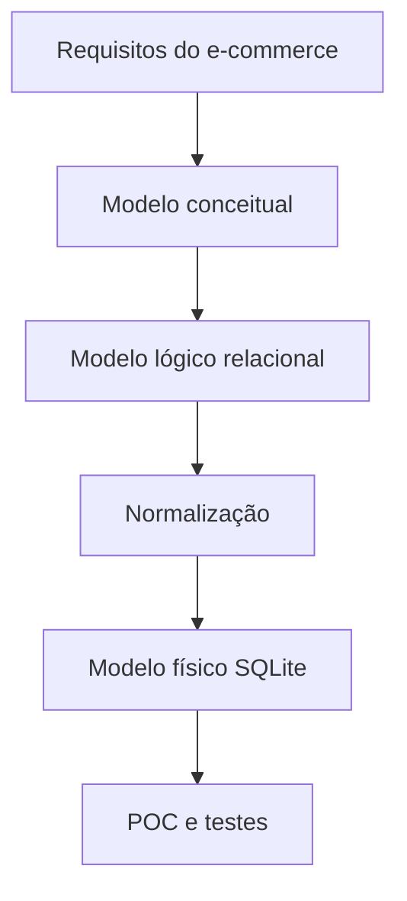

## Visão Geral do Conceito

A aula 12 aprofunda o e-commerce iniciado anteriormente e mostra a passagem entre <mark style="background-color: #242424; padding: 2px 4px; border-radius: 3px; color: inherit;">`modelo conceitual`</mark>, <mark style="background-color: #242424; padding: 2px 4px; border-radius: 3px; color: inherit;">`modelo lógico`</mark> e <mark style="background-color: #242424; padding: 2px 4px; border-radius: 3px; color: inherit;">`modelo físico`</mark>. O foco é decidir o que precisa persistir e como o <mark style="background-color: #242424; padding: 2px 4px; border-radius: 3px; color: inherit;">`SQLite`</mark> pode validar a proposta antes de uma arquitetura maior.

> **Regra:** esta lição foi reconstruída a partir da transcrição da aula e dos materiais disponíveis no repositório; quando a fonte não cobre um detalhe, isso é declarado como lacuna em vez de ser tratado como fato.

## Modelo Mental

Pense em três camadas: o negócio fala em clientes, produtos e pedidos; o modelo lógico organiza relações; o modelo físico escolhe tipos, PKs, FKs e limitações do motor.



## Mecânica Central

- <mark style="background-color: #242424; padding: 2px 4px; border-radius: 3px; color: inherit;">`OLTP`</mark> prioriza operações transacionais consistentes.
- Modelo físico precisa de tipos, PKs e FKs.
- Normalização reduz duplicidade antes da implementação.
- POC testa viabilidade técnica com custo baixo.

## Uso Prático

No e-commerce, `produto` pode depender de `fabricante`; `pedido` depende de `cliente`; `pedido_item` resolve múltiplos produtos em um pedido. Esse desenho evita repetir dados de produto em cada venda.

## Erros Comuns

- Pular direto para SQLite sem entender regra de negócio.
- Tratar POC como produto final.
- Confundir análise de mercado com modelagem de persistência.
- Criar tabela gigante com cliente, produto e pedido misturados.

## Visão Geral de Debugging

Se uma tabela cresce com colunas de assuntos diferentes, volte ao modelo lógico e pergunte quais entidades estão misturadas.

## Principais Pontos

- Modelagem tem camadas.
- SQLite é ótimo para POC didática.
- Normalização protege consistência.
- E-commerce exige separar clientes, pedidos, itens e produtos.


## Preparação para Prática

Revise a aula anterior e desenhe o fluxo cliente → pedido → item → produto antes de escrever SQL.

## Laboratório de Prática
### Easy — Esboçar entidades do e-commerce
Complete o esboço inicial do e-commerce com chaves e relacionamentos.
```sql
CREATE TABLE cliente (
  id INTEGER PRIMARY KEY AUTOINCREMENT,
  nome TEXT NOT NULL
);

CREATE TABLE produto (
  id INTEGER PRIMARY KEY AUTOINCREMENT,
  nome TEXT NOT NULL,
  preco NUMERIC NOT NULL
);

-- TODO: criar tabela pedido com FK para cliente
```
Critérios:
- Usar PK autoincremental.
- Declarar FK quando houver dependência.
- Separar entidades principais.

### Medium — Criar view de apoio
Monte uma view de totais por pedido.
```sql
-- TODO: criar tabelas pedido e pedido_item antes de usar em produção
CREATE VIEW vw_total_pedido AS
SELECT
  pedido_id,
  SUM(quantidade * preco_unitario) AS total
FROM pedido_item
GROUP BY pedido_id;
```
Critérios:
- Usar GROUP BY corretamente.
- Expor só campos necessários.
- Nomear a view de forma clara.

### Hard — Validar carga inicial
Complete a carga inicial para popular dados de teste.
```python
import sqlite3

conn = sqlite3.connect('ecommerce.db')
cur = conn.cursor()

produtos = [('Camiseta', 59.9), ('Mouse', 89.9)]

# TODO: criar tabela produto se nao existir
# TODO: inserir produtos usando placeholders

conn.commit()
conn.close()
```
Critérios:
- Usar placeholders.
- Executar sem erro antes dos TODOs.
- Separar criação e carga.


<!-- CONCEPT_EXTRACTION
concepts:
  - modelagem conceitual
  - modelagem lógica
  - modelagem física
  - SQLite
  - normalização
  - OLTP
  - POC
skills:
  - Separar camadas de modelagem
  - Desenhar modelo físico em SQLite
  - Aplicar normalização em e-commerce
  - Planejar POC
examples:
  - ecommerce-produto-fabricante
  - poc-sqlite-ecommerce
  - oltp-vs-analitico
-->

<!-- EXERCISES_JSON
[
  {
    "id": "modelagem-conceitual-logica-fisica-normalizacao-sqlite-ecommerce-modelar-ecommerce",
    "slug": "modelagem-conceitual-logica-fisica-normalizacao-sqlite-ecommerce-modelar-ecommerce",
    "difficulty": "easy",
    "title": "Esboçar entidades do e-commerce",
    "discipline": "projeto-bloco",
    "editorLanguage": "sql",
    "tags": [
      "sql",
      "sqlite",
      "ecommerce"
    ],
    "summary": "Criar tabelas base de cliente, produto e pedido em SQLite."
  },
  {
    "id": "modelagem-conceitual-logica-fisica-normalizacao-sqlite-ecommerce-criar-view",
    "slug": "modelagem-conceitual-logica-fisica-normalizacao-sqlite-ecommerce-criar-view",
    "difficulty": "medium",
    "title": "Criar view de apoio",
    "discipline": "projeto-bloco",
    "editorLanguage": "sql",
    "tags": [
      "sql",
      "view",
      "relatorio"
    ],
    "summary": "Criar uma view para expor dados calculados sem abrir tabelas base."
  },
  {
    "id": "modelagem-conceitual-logica-fisica-normalizacao-sqlite-ecommerce-validar-carga",
    "slug": "modelagem-conceitual-logica-fisica-normalizacao-sqlite-ecommerce-validar-carga",
    "difficulty": "hard",
    "title": "Validar carga inicial",
    "discipline": "projeto-bloco",
    "editorLanguage": "python",
    "tags": [
      "python",
      "sqlite",
      "carga-dados"
    ],
    "summary": "Preparar script de carga inicial com placeholders e commit."
  }
]
-->

<!-- SOURCE_CONTEXT
canonical_memory: MEMORIES.md
source: downloads/Projeto_de_Bloco_Fundamentos_do_Processamento_de_Dados/Aula_12_-_24042026.md
source_sha256: 1a3cb1a8791be63ecfb3ff1dc025fd42c78b0fe6501684d6de044b2241ffa80f
source: downloads/Projeto_de_Bloco_Fundamentos_do_Processamento_de_Dados/Aula_12_-_24042026.vtt
source_sha256: 7c640ba9d992a1dda260584239542b11decbd002ebffc9c482d296a8e0b0ef9c
notes:
  - Sem documento dedicado no manifest para esta aula; transcrição VTT é a fonte principal.
-->
