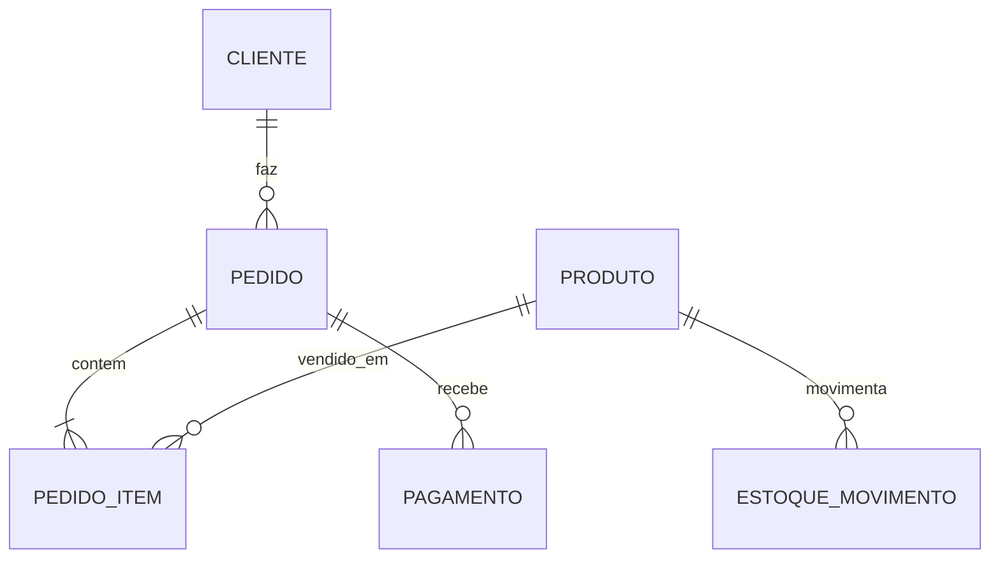

## Visão Geral do Conceito

A aula 13 completa o desenho do e-commerce com <mark style="background-color: #242424; padding: 2px 4px; border-radius: 3px; color: inherit;">`views`</mark> e consultas de visualização. O objetivo é transformar tabelas normalizadas em saídas úteis: totais de pedido, saldo de estoque e dados prontos para relatório ou carga de teste.

> **Regra:** esta lição foi reconstruída a partir da transcrição da aula e dos materiais disponíveis no repositório; quando a fonte não cobre um detalhe, isso é declarado como lacuna em vez de ser tratado como fato.

## Modelo Mental

Tabelas base guardam fatos; views organizam perguntas. Em vez de cada consumidor repetir JOINs, a view oferece uma camada estável de leitura.



## Mecânica Central

- <mark style="background-color: #242424; padding: 2px 4px; border-radius: 3px; color: inherit;">`VIEW`</mark> encapsula consulta reutilizável.
- <mark style="background-color: #242424; padding: 2px 4px; border-radius: 3px; color: inherit;">`JOIN`</mark> conecta tabelas normalizadas.
- <mark style="background-color: #242424; padding: 2px 4px; border-radius: 3px; color: inherit;">`GROUP BY`</mark> calcula totais por pedido/produto.
- <mark style="background-color: #242424; padding: 2px 4px; border-radius: 3px; color: inherit;">`CASE`</mark> diferencia entrada e saída de estoque.
- Carga inicial testa o modelo antes da aplicação completa.

## Uso Prático

Crie `vw_total_pedido` para somar itens por pedido e `vw_saldo_estoque` para consolidar entradas e saídas. Essas views podem alimentar BI ou telas de acompanhamento sem abrir todas as tabelas.

## Erros Comuns

- Criar view como substituta de modelagem correta.
- Expor dados sensíveis em view pública.
- Esquecer GROUP BY em agregações.
- Testar modelo sem carga mínima de dados.

## Visão Geral de Debugging

Quando uma view der total errado, valide em camadas: linhas da tabela base, JOIN, multiplicidade e só então agregação.

## Principais Pontos

- Views são camada de leitura.
- JOIN e GROUP BY transformam fatos em indicadores.
- Estoque precisa distinguir entrada e saída.
- Carga de dados valida hipóteses do modelo.


## Preparação para Prática

Prepare amostras pequenas de clientes, produtos, pedidos e movimentos de estoque para validar cada consulta.

## Laboratório de Prática
### Easy — Esboçar entidades do e-commerce
Complete o esboço inicial do e-commerce com chaves e relacionamentos.
```sql
CREATE TABLE cliente (
  id INTEGER PRIMARY KEY AUTOINCREMENT,
  nome TEXT NOT NULL
);

CREATE TABLE produto (
  id INTEGER PRIMARY KEY AUTOINCREMENT,
  nome TEXT NOT NULL,
  preco NUMERIC NOT NULL
);

-- TODO: criar tabela pedido com FK para cliente
```
Critérios:
- Usar PK autoincremental.
- Declarar FK quando houver dependência.
- Separar entidades principais.

### Medium — Criar view de apoio
Monte uma view de totais por pedido.
```sql
-- TODO: criar tabelas pedido e pedido_item antes de usar em produção
CREATE VIEW vw_total_pedido AS
SELECT
  pedido_id,
  SUM(quantidade * preco_unitario) AS total
FROM pedido_item
GROUP BY pedido_id;
```
Critérios:
- Usar GROUP BY corretamente.
- Expor só campos necessários.
- Nomear a view de forma clara.

### Hard — Validar carga inicial
Complete a carga inicial para popular dados de teste.
```python
import sqlite3

conn = sqlite3.connect('ecommerce.db')
cur = conn.cursor()

produtos = [('Camiseta', 59.9), ('Mouse', 89.9)]

# TODO: criar tabela produto se nao existir
# TODO: inserir produtos usando placeholders

conn.commit()
conn.close()
```
Critérios:
- Usar placeholders.
- Executar sem erro antes dos TODOs.
- Separar criação e carga.


<!-- CONCEPT_EXTRACTION
concepts:
  - views SQL
  - camada de visualização
  - estoque
  - pedido_item
  - GROUP BY
  - JOIN
  - CASE
  - carga de dados
skills:
  - Criar views SQL
  - Calcular totais com GROUP BY
  - Modelar estoque por movimento
  - Preparar carga de teste
examples:
  - vw_total_pedido
  - vw_saldo_estoque
  - carga-inicial-ecommerce
-->

<!-- EXERCISES_JSON
[
  {
    "id": "views-sql-camada-visualizacao-estoque-pedidos-ecommerce-modelar-ecommerce",
    "slug": "views-sql-camada-visualizacao-estoque-pedidos-ecommerce-modelar-ecommerce",
    "difficulty": "easy",
    "title": "Esboçar entidades do e-commerce",
    "discipline": "projeto-bloco",
    "editorLanguage": "sql",
    "tags": [
      "sql",
      "sqlite",
      "ecommerce"
    ],
    "summary": "Criar tabelas base de cliente, produto e pedido em SQLite."
  },
  {
    "id": "views-sql-camada-visualizacao-estoque-pedidos-ecommerce-criar-view",
    "slug": "views-sql-camada-visualizacao-estoque-pedidos-ecommerce-criar-view",
    "difficulty": "medium",
    "title": "Criar view de apoio",
    "discipline": "projeto-bloco",
    "editorLanguage": "sql",
    "tags": [
      "sql",
      "view",
      "relatorio"
    ],
    "summary": "Criar uma view para expor dados calculados sem abrir tabelas base."
  },
  {
    "id": "views-sql-camada-visualizacao-estoque-pedidos-ecommerce-validar-carga",
    "slug": "views-sql-camada-visualizacao-estoque-pedidos-ecommerce-validar-carga",
    "difficulty": "hard",
    "title": "Validar carga inicial",
    "discipline": "projeto-bloco",
    "editorLanguage": "python",
    "tags": [
      "python",
      "sqlite",
      "carga-dados"
    ],
    "summary": "Preparar script de carga inicial com placeholders e commit."
  }
]
-->

<!-- SOURCE_CONTEXT
canonical_memory: MEMORIES.md
source: downloads/Projeto_de_Bloco_Fundamentos_do_Processamento_de_Dados/Aula_13_-_08052026.md
source_sha256: 1a86aa2d8e2b28e06c2a0e49802282cb64c6655ba888c71452cb3a0c36d62c1e
source: downloads/Projeto_de_Bloco_Fundamentos_do_Processamento_de_Dados/Aula_13_-_08052026.vtt
source_sha256: bde7e91a9b63a786822caa4436b988e402c892e71766426b1454893a461e6ff7
notes:
  - Sem documento dedicado no manifest para esta aula; transcrição VTT é a fonte principal.
-->
