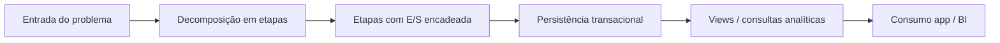
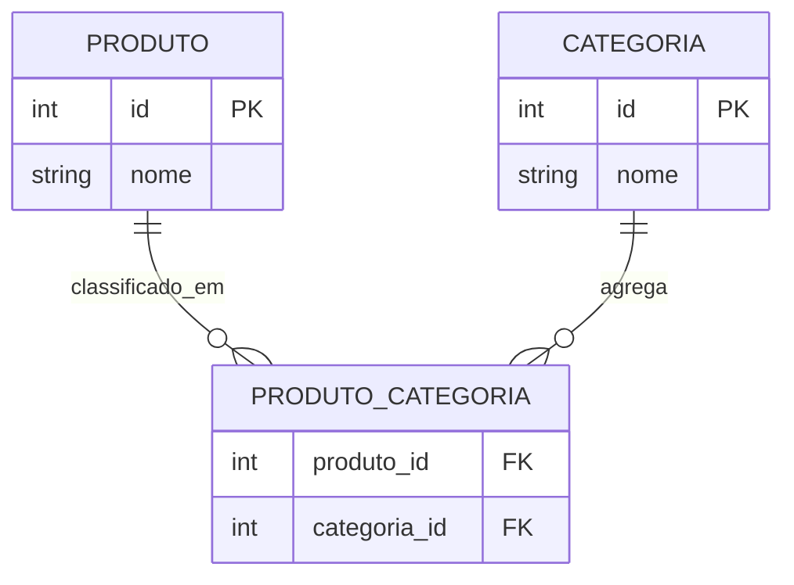

## Visão Geral do Conceito

Esta lição organiza três frentes que aparecem juntas no desenvolvimento de soluções com dados: primeiro, a **lógica de negócio e de fluxo** (entrada, processamento, saída e decomposição em etapas), que é o fio condutor de diagramas e de pipelines; segundo, a **modelagem relacional** com ênfase em armazenamento transacional (pedidos, vendas, estoque) frente a necessidades analíticas (perguntas sobre faturamento e participação); terceiro, a **camada de visualização em SQL** usando <mark style="background-color: #242424; padding: 2px 4px; border-radius: 3px; color: inherit;">`VIEW`</mark>, que expõe ao aplicativo ou ao painel respostas prontas para perguntas do negócio sem duplicar fisicamente os dados nas tabelas base — complementada por um laboratório em Python sobre listas, laços e simulação de fila de atendimento, alinhado ao raciocínio de entrada e comandos visto na aula.

> **Regra:** Se você consegue enunciar a pergunta de negócio (“faturamento por categoria”, “clientes ativos”), provavelmente consegue desenhar um objeto de consulta (view ou serviço) que a responda a partir do armazenamento normalizado.

## Modelo Mental

Pense no banco em duas “camadas” complementares: **armazenamento** (tabelas com linhas persistidas, chaves e relacionamentos) e **entrega de informação** (objetos que encapsulam uma consulta — no caso, views — que leem o armazenamento no momento do `SELECT`). O aplicativo pode chamar a view como se fosse uma tabela “virtula”, mas o motor executa a definição por baixo.

Para relacionamentos muitos-para-muitos, o modelo mental é de **aresta explícita**: em vez de forçar um dos lados a carregar várias FKs impossíveis em uma linha só, cria-se uma tabela de ligação que registra pares permitidos.

No Python, a lista é um **buffer mutável** onde a semântica depende de como você usa índices: `append` empilha ao fim, `insert(0, …)` puxa alguém para a frente, `extend` traz um lote, `pop(0)` atende quem chegou primeiro na disciplina de fila.



## Mecânica Central

**Projeto de dados em camadas.** Do conceito de negócio ao físico: descrever entidades e relacionamentos (conceitual), fixar cardinalidades e chaves (lógico), definir tipos, tamanhos, índices iniciais e objetos (físico). A transação online altera linhas; a analítica agrega, fatia, mede participação — muitas vezes sobre os mesmos fatos, com nomes de métricas diferentes.

**Normalização transacional versus analítica.** A transacional evita redundância update-anômala nas operações do dia a dia; a analítica pode desnormalizar para leitura (em outras disciplinas/etapas), mas aqui o foco foi transacional + views como ponte de leitura.

**1:1, 1:N, N:N.** Em N:N, a tabela de ligação contém FKs para ambos os lados (ex.: `produto` e `categoria` via `produto_categoria`). Isso espelha o padrão “produto–fornecedor” explicado verbalmente: não “pendurar” uma única FK de fornecedor no produto quando há pluralidade bilateral.

**Views.** Um objeto <mark style="background-color: #242424; padding: 2px 4px; border-radius: 3px; color: inherit;">`VIEW`</mark> persiste **a definição** (texto da consulta) e, ao ser referenciado, o otimizador monta o plano como faria com um <mark style="background-color: #242424; padding: 2px 4px; border-radius: 3px; color: inherit;">`SELECT`</mark> equivalente. Há bancos com **views materializadas**, recurso distinto, com armazenamento físico e políticas de refresh — citado na aula como “outra história”.



**Python: fila com lista.** O enunciado trabalhado pressupõe leitura de uma linha inicial, <mark style="background-color: #242424; padding: 2px 4px; border-radius: 3px; color: inherit;">`split`</mark> por separador, laço <mark style="background-color: #242424; padding: 2px 4px; border-radius: 3px; color: inherit;">`while`</mark> até comando sentinela (“fim”) e despacho por ação: <mark style="background-color: #242424; padding: 2px 4px; border-radius: 3px; color: inherit;">`append`</mark>, <mark style="background-color: #242424; padding: 2px 4px; border-radius: 3px; color: inherit;">`insert(0, …)`</mark>, <mark style="background-color: #242424; padding: 2px 4px; border-radius: 3px; color: inherit;">`extend([...])`</mark>, <mark style="background-color: #242424; padding: 2px 4px; border-radius: 3px; color: inherit;">`pop(0)`</mark>. O contador de atendimentos incrementa quando há remoção bem-sucedida da frente.

## Uso Prático

**SQL — view como contrato de negócio.** Exemplo ilustrativo alinhado ao tema “categoria faturamento”: agregar itens de pedidos pagos/enviados, juntar produto e categoria, projetar métricas prontas para um painel.

```sql
CREATE VIEW vw_faturamento_por_categoria AS
SELECT
  c.nome AS categoria,
  SUM(ip.quantidade * ip.preco_unitario) AS faturamento
FROM categoria c
JOIN produto p           ON p.categoria_id = c.id
JOIN item_pedido ip      ON ip.produto_id = p.id
JOIN pedido pd           ON pd.id = ip.pedido_id
WHERE pd.status IN ('pago', 'enviado')
GROUP BY c.nome;
-- Nota: nomes de tabelas/colunas são didáticos; ajuste ao seu schema.
```

A leitura pelo cliente da aplicação vira `SELECT * FROM vw_faturamento_por_categoria;`, concentrando joins e filtros estáveis.

**Python — esqueleto coerente com a aula (comandos e sentinela).** Trecho educativo, não único possível:

```python
fila = input("Pacientes (separados por vírgula): ").split(",")
fila = [nome.strip() for nome in fila if nome.strip()]
atendidos = 0

while True:
    cmd = input("Comando: ").strip()
    if cmd.lower() == "fim":
        break

    partes = cmd.split()
    acao = partes[0].lower()

    if acao == "prioridade" and len(partes) >= 2:
        nome = " ".join(partes[1:])
        fila.insert(0, nome)
    elif acao == "adicionar" and len(partes) >= 2:
        nome = " ".join(partes[1:])
        fila.append(nome)
    elif acao == "grupo" and len(partes) >= 3:
        # Forma simples: grupo N1 N2
        fila.extend(partes[1:])
    elif acao == "chamar":
        if fila:
            paciente = fila.pop(0)
            atendidos += 1
            print("Chamando:", paciente)
    print("Fila:", fila)

print("Sessão encerrada. Atendidos:", atendidos)
```

**Varreduras com `for`.** Para achar o maior valor sem <mark style="background-color: #242424; padding: 2px 4px; border-radius: 3px; color: inherit;">`max()`</mark>, inicialize um candidato (ex.: primeiro elemento numérico) e compare com os demais após converter de <mark style="background-color: #242424; padding: 2px 4px; border-radius: 3px; color: inherit;">`str`</mark> para <mark style="background-color: #242424; padding: 2px 4px; border-radius: 3px; color: inherit;">`int`</mark>. Para pares, utilize <mark style="background-color: #242424; padding: 2px 4px; border-radius: 3px; color: inherit;">`int(x) % 2 == 0`</mark> com acumulador.

## Erros Comuns

- **N:N sem tabela de ligação:** repetir linhas de produto ou cramular FKs que não representam o domínio; sintoma: duplicidade e relatórios inflados.
- **Confundir view com tabela física:** esperar ocupação de espaço como linhas próprias; em views comuns, o custo aparece no plano de execução na hora da leitura.
- **`pop()` sem fila:** usar <mark style="background-color: #242424; padding: 2px 4px; border-radius: 3px; color: inherit;">`pop(0)`</mark> com lista vazia gera <mark style="background-color: #242424; padding: 2px 4px; border-radius: 3px; color: inherit;">`IndexError`</mark>; sempre checar `if fila:`.
- **`split` sem limpeza:** esquecer <mark style="background-color: #242424; padding: 2px 4px; border-radius: 3px; color: inherit;">`strip()`</mark> deixa nomes com espaços fantasmas e quebra a igualdade de comandos.
- **Comparar números ainda como string:** `"10" < "2"` por ordem lexicográfica; converta antes de comparar matematicamente.

## Visão Geral de Debugging

- **View lenta ou pesada:** inspecione o plano (<mark style="background-color: #242424; padding: 2px 4px; border-radius: 3px; color: inherit;">`EXPLAIN`</mark> no seu SGBD), confirme chaves estrangeiras indexadas e filtros seletivos; às vezes a view esconde um join explosivo.
- **Resultado divergente do esperado:** valide status e predicates (ex.: `'pago'`, `'enviado'`) e duplicidades provenientes de joins 1:N mal restritos.
- **Filas incoerentes:** imprima a lista após cada comando e verifique a semântica do índice 0; teste prioridade seguida de chamada.
- **Conversões numéricas:** capture <mark style="background-color: #242424; padding: 2px 4px; border-radius: 3px; color: inherit;">`ValueError`</mark> ao converter tokens não numéricos.

## Principais Pontos

- Transacional versus analítico orienta não só tabelas, mas o tipo de pergunta que você prepara para o negócio.
- N:N pede tabela de ligação e FKs dos dois lados — padrão recorrente (produto/categoria, produto/fornecedor).
- View é contrato de leitura com metadados da consulta; dados vivem nas tabelas base.
- Quebre problemas grandes em etapas com artefatos entre passos — o mesmo raciocínio de pipelines.
- Em Python, fila com lista exige disciplina de índices: frente no `0`, prioridade com `insert(0)`, atendimento com `pop(0)`.

## Preparação para Prática

Você deve ser capaz de: (1) explicar uma arquitetura mínima de e-commerce com núcleo transacional e views de leitura; (2) desenhar N:N com entidade associativa; (3) implementar o simulador de fila com os métodos exigidos; (4) percorrer listas numericamente sem `max()` e contar pares com `for`.

## Laboratório de Prática

### Easy — Contagem de pares em lista numérica

**Enunciado.** Receba uma linha com inteiros separados por espaço, construa a lista e conte quantos são pares, sem usar compreensões obrigatórias — apenas um <mark style="background-color: #242424; padding: 2px 4px; border-radius: 3px; color: inherit;">`for`</mark> e um contador.

```python
entrada = input("Números separados por espaço: ")
numeros = entrada.split()
pares = 0

# TODO: converter cada token para int com segurança e somar 1 ao contador quando par

print("Quantidade de pares:", pares)
```

### Medium — Simulador de fila da clínica (comandos)

**Enunciado.** Implemente os comandos `adicionar`, `prioridade`, `grupo` (dois nomes após o comando), `chamar` e sentinela `fim`, exibindo a fila após cada operação e o total atendido.

```python
fila = [n.strip() for n in input("Fila inicial (vírgula): ").split(",") if n.strip()]
atendidos = 0

while True:
    linha = input("> ").strip()
    if linha.lower() == "fim":
        break

    partes = linha.split()
    cmd = partes[0].lower()

    # TODO: tratar prioridade (insert no início), adicionar (append),
    # grupo (extend com dois nomes), chamar (pop na frente se possível)
    # e atualizar atendidos.

    print("Estado:", fila)

print("Atendidos na sessão:", atendidos)
```

### Hard — View analítica de participação

**Enunciado.** Dado o núcleo transacional de pedidos, crie uma view que, **a partir das mesmas tabelas base** já usadas para faturamento, calcule o **percentual de participação** de cada categoria no faturamento total (evite divisão por zero no caso de total 0).

```sql
-- TODO: escrever CREATE VIEW vw_participacao_categoria AS ... 
-- Dicas: use CTE para total geral e junte com agregação por categoria;
-- arredonde para 4 casas se desejar (função depende do SGBD).

SELECT 1; -- placeholder: substituir pela view completa acima.
```

<details>
<summary>Notas de implementação (opcional)</summary>

Em PostgreSQL, você pode usar `ROUND(100.0 * fat / NULLIF(total,0), 2)`. Em SQLite, funções análogas existem, mas nomes podem diferir; adapte ao motor do laboratório.

</details>

<!-- CONCEPT_EXTRACTION
concepts:
  - modelo conceitual/lógico/físico
  - normalização transacional vs analítica
  - cardinalidade 1:1, 1:N, N:N
  - tabela de ligação
  - VIEW em SQL
  - split, while, for
  - append, insert, extend, pop
skills:
  - Decompor problemas em etapas com E/S encadeada
  - Modelar N:N com entidade associativa e FKs
  - Expor métricas de negócio via views
  - Simular filas com operações de lista e laços
  - Percorrer listas e acumular contagens/máximos sem builtins proibidas
examples:
  - vw-faturamento-e-participacao
  - fila-clinica-com-prioridade
  - contagem-de-pares-em-lista
-->

<!-- EXERCISES_JSON
[
  {
    "id": "contar-pares-lista",
    "slug": "contar-pares-lista",
    "difficulty": "easy",
    "title": "Contar números pares em lista",
    "discipline": "projeto-bloco-fundamentos-processamento-dados",
    "editorLanguage": "python",
    "tags": ["python", "for", "listas", "arith"],
    "summary": "Converter tokens, iterar com for e acumular quantos números são pares."
  },
  {
    "id": "fila-clinica-prioridade",
    "slug": "fila-clinica-prioridade",
    "difficulty": "medium",
    "title": "Fila de atendimento com prioridade",
    "discipline": "projeto-bloco-fundamentos-processamento-dados",
    "editorLanguage": "python",
    "tags": ["python", "while", "listas", "filas"],
    "summary": "Controlar fila com append/insert/extend/pop e contagem de atendidos."
  },
  {
    "id": "view-participacao-categoria",
    "slug": "view-participacao-categoria",
    "difficulty": "hard",
    "title": "View de participação por categoria",
    "discipline": "projeto-bloco-fundamentos-processamento-dados",
    "editorLanguage": "sql",
    "tags": ["sql", "view", "cte", "agregacao"],
    "summary": "Criar view com percentual de cada categoria sobre o faturamento total."
  }
]
-->

```LESSONS_JSON_HINT
{
  "discipline": "projeto-bloco-fundamentos-processamento-dados",
  "slug": "aula-14-modelagem-views-e-fila-em-lista",
  "title": "Modelagem relacional, camada de visualização em SQL e listas em Python",
  "order": 14,
  "file": "content/projeto-bloco-fundamentos-processamento-dados/aula-14-modelagem-views-e-fila-em-lista.md"
}
```
