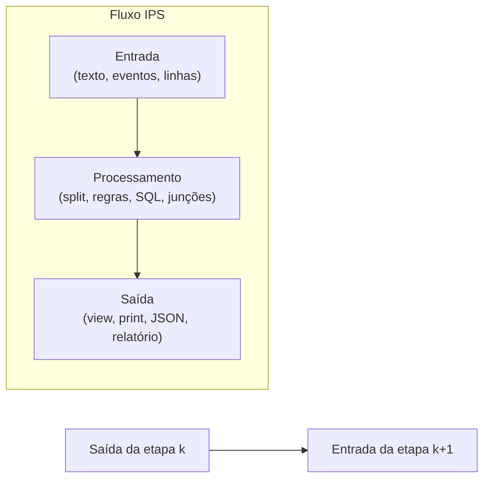
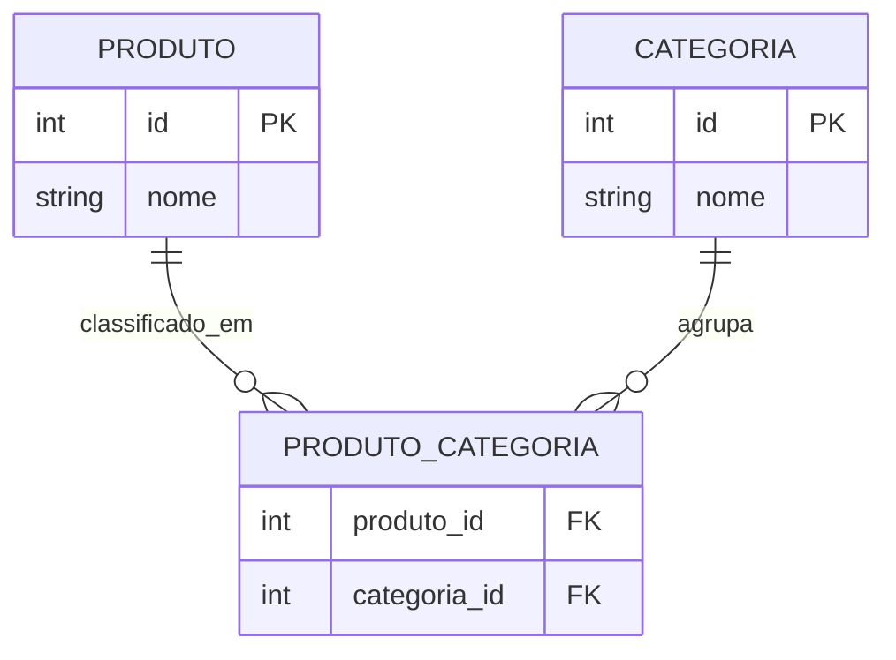

## Visão Geral do Conceito

Esta lição organiza três frentes que aparecem juntas em projetos de dados e automação: primeiro, uma forma sistemática de pensar fluxos como <mark style="background-color: #242424; padding: 2px 4px; border-radius: 3px; color: inherit;">`entrada`</mark>, <mark style="background-color: #242424; padding: 2px 4px; border-radius: 3px; color: inherit;">`processamento`</mark> e <mark style="background-color: #242424; padding: 2px 4px; border-radius: 3px; color: inherit;">`saída`</mark>; segundo, decisões de modelagem relacional para um domínio transacional (por exemplo, e‑commerce) e uma camada de leitura com <mark style="background-color: #242424; padding: 2px 4px; border-radius: 3px; color: inherit;">`VIEW`</mark>; terceiro, manipulação de coleções em Python para implementar regras de negócio simples (fila de atendimento, busca do maior valor sem <mark style="background-color: #242424; padding: 2px 4px; border-radius: 3px; color: inherit;">`max()`</mark>, contagem com laços).

> **Regra:** Toda solução é uma resposta a perguntas do negócio; estruturas de dados e consultas existem para responder essas perguntas de forma correta, auditável e evolutiva.

## Modelo Mental

Imagine uma linha de montagem simbólica: cada etapa recebe um artefato, transforma e entrega outro para a próxima. Esse encadeamento é o mesmo princípio citado em pipelines de dados e operações com listas em Python: você parte de texto ou registros crus, normaliza em estruturas (lista, tabelas relacionadas, consulta nomeada), aplica regras e expõe um resultado consumível por humanos ou por outra aplicação.

No banco relacional, pense em dois “modos” complementares: armazenamento normalizado para transações do dia a dia (cadastro, pedidos, estoque) versus necessidades analíticas (faturamento por categoria, participação percentual, clientes ativos). As <mark style="background-color: #242424; padding: 2px 4px; border-radius: 3px; color: inherit;">`VIEW`</mark> funcionam como “perguntas salvas”: encapsulam um <mark style="background-color: #242424; padding: 2px 4px; border-radius: 3px; color: inherit;">`SELECT`</mark> com junções e filtros para que consumidores leiam uma superfície estável, sem repetir SQL complexo na aplicação — sempre lembrando que os dados continuam nas tabelas base.

Em Python, uma lista ordenada modela naturalmente uma fila quando você trata o índice <mark style="background-color: #242424; padding: 2px 4px; border-radius: 3px; color: inherit;">`0`</mark> como frente: prioridades entram com <mark style="background-color: #242424; padding: 2px 4px; border-radius: 3px; color: inherit;">`insert(0, …)`</mark>, chegadas normais com <mark style="background-color: #242424; padding: 2px 4px; border-radius: 3px; color: inherit;">`append(…)`</mark>, lotes com <mark style="background-color: #242424; padding: 2px 4px; border-radius: 3px; color: inherit;">`extend([…])`</mark> e atendimento com <mark style="background-color: #242424; padding: 2px 4px; border-radius: 3px; color: inherit;">`pop(0)`</mark>.





## Mecânica Central

### IPS e decomposição

Fluxos reais são grandes demais para um único bloco monolítico. A técnica é fatiar em etapas com contratos claros: a saída padronizada de uma etapa vira entrada da seguinte. Em ambientes de dados modernos isso aparece como artefatos versionados entre estágios (similar à ideia de estágios em pipelines).

### Cardinalidades e normalização transacional

- <mark style="background-color: #242424; padding: 2px 4px; border-radius: 3px; color: inherit;">`1:1`</mark>: entidades acopladas quase sempre juntas (ex.: cliente e ficha única), frequentemente modelável em uma tabela ou duas com FK opcional.
- <mark style="background-color: #242424; padding: 2px 4px; border-radius: 3px; color: inherit;">`1:N`</mark>: um pai, vários filhos dependentes (ex.: pedido e itens do pedido).
- <mark style="background-color: #242424; padding: 2px 4px; border-radius: 3px; color: inherit;">`N:N`</mark>: ambos os lados podem multiplicar-se mutuamente (produto em várias categorias e categoria com vários produtos). Sem tabela de ligação, você força repetição de linhas ou perde combinações válidas.

A transação cotidiana exige integridade referencial via <mark style="background-color: #242424; padding: 2px 4px; border-radius: 3px; color: inherit;">`PRIMARY KEY`</mark> e <mark style="background-color: #242424; padding: 2px 4px; border-radius: 3px; color: inherit;">`FOREIGN KEY`</mark>.

### Views como camada de leitura

Uma <mark style="background-color: #242424; padding: 2px 4px; border-radius: 3px; color: inherit;">`VIEW`</mark> clássica guarda a definição (<mark style="background-color: #242424; padding: 2px 4px; border-radius: 3px; color: inherit;">`metadata`</mark>) do <mark style="background-color: #242424; padding: 2px 4px; border-radius: 3px; color: inherit;">`SELECT`</mark>; em tempo de consulta o otimizador elabora planos semelhantes aos de consultar as tabelas diretamente. Benefícios típicos: superfície de dados menor para aplicações, encapsulamento de joins/filtros de negócio e políticas de exposição. Custos e ganhos de performance dependem de volume, índices, particionamento e padrão de acesso — **sempre** medições no ambiente-alvo.

### Lista como fila e parsing de comandos

1. Leia uma linha inicial com nomes separados por vírgula e converta com <mark style="background-color: #242424; padding: 2px 4px; border-radius: 3px; color: inherit;">`split(',')`</mark> e saneamento de espaços.
2. Loop <mark style="background-color: #242424; padding: 2px 4px; border-radius: 3px; color: inherit;">`while True:`</mark> lê comandos até <mark style="background-color: #242424; padding: 2px 4px; border-radius: 3px; color: inherit;">`fim`</mark>; use <mark style="background-color: #242424; padding: 2px 4px; border-radius: 3px; color: inherit;">`break`</mark> para sair.
3. Para cada comando, faça <mark style="background-color: #242424; padding: 2px 4px; border-radius: 3px; color: inherit;">`split()`</mark> no espaço: primeira parte é ação (<mark style="background-color: #242424; padding: 2px 4px; border-radius: 3px; color: inherit;">`upper()`</mark> para tolerar caixa), restante reconstrói nomes com espaços se necessário.
4. Mapeamento direto do enunciado da aula: <mark style="background-color: #242424; padding: 2px 4px; border-radius: 3px; color: inherit;">`ADICIONAR nome`</mark> → <mark style="background-color: #242424; padding: 2px 4px; border-radius: 3px; color: inherit;">`append`</mark>; <mark style="background-color: #242424; padding: 2px 4px; border-radius: 3px; color: inherit;">`PRIORIDADE nome`</mark> → <mark style="background-color: #242424; padding: 2px 4px; border-radius: 3px; color: inherit;">`insert(0, nome)`</mark>; <mark style="background-color: #242424; padding: 2px 4px; border-radius: 3px; color: inherit;">`GRUPO n1 n2 …`</mark> → <mark style="background-color: #242424; padding: 2px 4px; border-radius: 3px; color: inherit;">`extend([...])`</mark>; <mark style="background-color: #242424; padding: 2px 4px; border-radius: 3px; color: inherit;">`CHAMAR`</mark> → <mark style="background-color: #242424; padding: 2px 4px; border-radius: 3px; color: inherit;">`pop(0)`</mark> se fila não vazia e incremento de contador de atendidos.

Para maior elemento sem <mark style="background-color: #242424; padding: 2px 4px; border-radius: 3px; color: inherit;">`max()`</mark>, inicialize candidato com o primeiro valor convertido e percorra comparando; para pares, use <mark style="background-color: #242424; padding: 2px 4px; border-radius: 3px; color: inherit;">`int(item) % 2 == 0`</mark>.

## Uso Prático

### Sketch SQL para perguntas de negócio via view

```sql
CREATE VIEW vw_categoria_faturamento AS
SELECT
  c.nome AS categoria,
  SUM(i.quantidade * i.valor_unitario) AS faturamento
FROM pedido p
JOIN item_pedido i ON i.pedido_id = p.id
JOIN produto pr ON pr.id = i.produto_id
JOIN produto_categoria pc ON pc.produto_id = pr.id
JOIN categoria c ON c.id = pc.categoria_id
WHERE p.status IN ('pago', 'enviado')
GROUP BY c.nome;
```

### Esqueleto Python para fila de prioridade

```python
import sys


def normalizar_partes(partes: list[str]) -> tuple[str, str]:
    acao = partes[0].upper()
    nome = " ".join(partes[1:]).strip()
    return acao, nome


def main() -> None:
    linha_inicial = input().strip()
    fila = [p.strip() for p in linha_inicial.split(",") if p.strip()]
    atendidos = 0

    print("Estado inicial:", fila)

    while True:
        cmd = input().strip()
        if cmd.lower() == "fim":
            break

        partes = cmd.split()
        if not partes:
            continue

        acao, nome = normalizar_partes(partes)

        if acao == "PRIORIDADE" and nome:
            fila.insert(0, nome)
        elif acao == "ADICIONAR" and nome:
            fila.append(nome)
        elif acao == "GRUPO" and len(partes) > 1:
            nomes_grupo = [p.strip() for p in partes[1:] if p.strip()]
            fila.extend(nomes_grupo)
        elif acao == "CHAMAR":
            if fila:
                paciente = fila.pop(0)
                atendidos += 1
                print(f"Chamando: {paciente}")
            else:
                print("Fila vazia; nada a chamar.")
        else:
            print("Comando não reconhecido ou incompleto.")

        print("Fila atual:", fila)

    print(f"Sessão encerrada. Total atendidos: {atendidos}")


if __name__ == "__main__":
    main()
```

<details>
<summary>Compatibilidade de tipo (<mark style="background-color: #242424; padding: 2px 4px; border-radius: 3px; color: inherit;">`list[str]`</mark>)</summary>

Em Python &lt; 3.9 substitua anotações por <mark style="background-color: #242424; padding: 2px 4px; border-radius: 3px; color: inherit;">`from typing import List`</mark> e use <mark style="background-color: #242424; padding: 2px 4px; border-radius: 3px; color: inherit;">`List[str]`</mark>.
</details>

## Erros Comuns

- **Confundir <mark style="background-color: #242424; padding: 2px 4px; border-radius: 3px; color: inherit;">`append`</mark> com prioridade**: usar <mark style="background-color: #242424; padding: 2px 4px; border-radius: 3px; color: inherit;">`append`</mark> coloca o caso urgente no fim; sintoma: ordem de chamadas invertida em relação ao enunciado. Correção: <mark style="background-color: #242424; padding: 2px 4px; border-radius: 3px; color: inherit;">`insert(0, nome)`</mark>.

- **N:N sem ponte**: repetir linhas de produto para cada fornecedor ou armazenar vários IDs em uma coluna “lista”. Sintoma: atualizações inconsistentes e quebras de integridade. Correção: tabela de ligação com FKs duplas.

- **Supor que view armazena cópia física** (no caso não materializado): sintoma surpresa ao ver espaço em disco estável após “criar view gigante”. Correção mental: consultar plano de execução; dados permanecem nas bases.

- **Medir performance por opinião**: afirmar que views são “sempre mais rápidas”. Correção: comparar planos, I/O e caches no cenário real; views mal escritas sobre tabelas enormes sem índice adequado podem custar caro.

- **`pop()` sem verificar fila vazia**: em Python, <mark style="background-color: #242424; padding: 2px 4px; border-radius: 3px; color: inherit;">`IndexError`</mark> ao chamar em lista vazia.

- **Parsing ingênuo com nomes compostos**: <mark style="background-color: #242424; padding: 2px 4px; border-radius: 3px; color: inherit;">`split()`</mark> quebra “Ana Paula”. Correção: separar ação do restante e juntar com <mark style="background-color: #242424; padding: 2px 4px; border-radius: 3px; color: inherit;">`" ".join(partes[1:])`</mark>.

## Visão Geral de Debugging

1. **Reconstitua a fila mentalmente** após cada comando e confronte com o `print` intermediário.
2. **Isolamento**: teste cada ramo (`PRIORIDADE`, `GRUPO`, `CHAMAR`) com entradas mínimas de uma linha.
3. **SQL**: use `EXPLAIN` (nome varia por SGBD) nas consultas por trás das views para checar junções e filtros.
4. **Invariantes**: após `CHAMAR`, tamanho da lista deve diminuir em um se havia paciente; contador de atendidos só incrementa em remoção bem-sucedida.

## Principais Pontos

- Todo sistema pode ser lido como cadeias de entrada, processamento e saída conectadas.
- Modelagem transacional usa cardinalidades corretas; N:N exige tabela de ligação com FKs.
- Views expõem perguntas de negócio sem duplicar fisicamente os dados (salvo variantes materializadas, não foco aqui).
- Em Python, fila na lista usa frente no índice 0 com `insert`, `append`, `extend`, `pop(0)`.
- Performance e segurança de exposição de dados são decisões de arquitetura; validação exige evidência.

## Preparação para Prática

Você deve ser capaz de desenhar um mini ER com N:N, escrever o CREATE VIEW de um indicador simples, implementar o interpretador de comandos da fila sem usar estruturas proibidas pelo enunciado e percorrer listas numéricas com laços explícitos.

## Laboratório de Prática

### Easy — Contador de pares com validação parcial

Implemente leitura de números separados por espaço, conversão segura e contagem de pares usando `%`. Ignore tokens não numéricos sem derrubar o programa.

```python
def contar_pares(texto: str) -> int:
    tokens = texto.strip().split()
    pares = 0
    for tok in tokens:
        try:
            n = int(tok)
        except ValueError:
            # TODO: ignorar token inválido sem interromper o fluxo
            continue
        # TODO: incrementar pares quando n for par
    return pares


if __name__ == "__main__":
    linha = input()
    print(contar_pares(linha))
```

### Medium — Fila de triagem com telemetria

Estenda a fila: para cada comando válido, registre em uma lista de auditoria o estado anterior e o novo estado como tuplas `(acao, fila_antes, fila_depois)`. Mantenha contagem de atendidos.

```python
def simular_fila() -> None:
    fila = [p.strip() for p in input().strip().split(",") if p.strip()]
    atendidos = 0
    auditoria = []

    while True:
        cmd = input().strip()
        if cmd.lower() == "fim":
            break
        partes = cmd.split()
        if not partes:
            continue
        acao = partes[0].upper()
        antes = list(fila)

        if acao == "PRIORIDADE":
            nome = " ".join(partes[1:]).strip()
            # TODO: inserir na frente se nome não vazio
        elif acao == "ADICIONAR":
            nome = " ".join(partes[1:]).strip()
            # TODO: append se nome não vazio
        elif acao == "GRUPO":
            # TODO: extend com todos os nomes restantes
            pass
        elif acao == "CHAMAR":
            # TODO: pop(0) com guarda de fila vazia e incrementar atendidos
            pass
        else:
            continue

        depois = list(fila)
        auditoria.append((acao, antes, depois))

    # TODO: imprimir relatório final: fila, atendidos, e auditoria linha a linha


if __name__ == "__main__":
    simular_fila()
```

### Hard — View versus consulta ad hoc (ensaio em SQL)

Dado um esquema simplificado de e‑commerce (`pedido`, `item_pedido`, `produto`, `produto_categoria`, `categoria`), crie uma view `vw_participacao_categoria` que devolve `categoria`, `faturamento_categoria`, `faturamento_total`, `participacao_percentual`. Em seguida, escreva uma segunda consulta equivalente sem view para comparar legibilidade.

```sql
-- Esquema fictício mínimo para o exercício (assume-se já criado)
-- pedido(id, status), item_pedido(pedido_id, produto_id, quantidade, valor_unitario)
-- produto(id), categoria(id, nome), produto_categoria(produto_id, categoria_id)

-- TODO: criar VIEW vw_participacao_categoria com colunas:
-- categoria, faturamento_categoria, faturamento_total, participacao_percentual
-- Dicas:
-- 1) filtre status válidos de pedido
-- 2) agregue por categoria
-- 3) cruze com total geral via subconsulta ou janela

CREATE VIEW vw_participacao_categoria AS
SELECT
  -- TODO: preencher SELECT completo
  1 AS placeholder
WHERE 1 = 0;

-- TODO: SELECT equivalente direto (sem view) que produza as mesmas colunas
```

<!-- CONCEPT_EXTRACTION
concepts:
  - entrada processamento saída (IPS)
  - pipeline por etapas com artefatos encadeados
  - modelagem transacional versus necessidades analíticas
  - cardinalidades 1:1 1:N N:N
  - tabela de ligação produto_categoria
  - view como SELECT nomeado e metadados
  - trade-offs view no SGBD versus consultas na aplicação
  - métodos de lista append insert extend pop
  - while True com break
  - parsing com split e reconstrução de nomes
skills:
  - Decompor problemas grandes em etapas IPS encadeadas
  - Modelar N:N com tabela intermediária e FKs
  - Explicar onde dados físicos residem versus definições de view
  - Implementar fila prioritária com operações de lista idiomáticas
  - Percorrer coleções numéricas sem max builtin quando exigido
examples:
  - vw-categoria-faturamento-sketch
  - fila-prioridade-python
  - contagem-pares-validacao
-->

<!-- EXERCISES_JSON
[
  {
    "id": "contar-pares-validacao",
    "slug": "contar-pares-validacao",
    "difficulty": "easy",
    "title": "Contar números pares ignorando tokens inválidos",
    "discipline": "projeto-bloco-fundamentos-processamento-dados",
    "editorLanguage": "python",
    "tags": ["python", "listas", "loop", "validacao"],
    "summary": "Processar entrada separada por espaços, converter com segurança e contar pares usando resto da divisão."
  },
  {
    "id": "fila-triagem-auditoria",
    "slug": "fila-triagem-auditoria",
    "difficulty": "medium",
    "title": "Fila de triagem com trilha de auditoria",
    "discipline": "projeto-bloco-fundamentos-processamento-dados",
    "editorLanguage": "python",
    "tags": ["python", "filas", "parseamento", "estado"],
    "summary": "Interpretar comandos PRIORIDADE/ADICIONAR/GRUPO/CHAMAR registrando estados antes e depois."
  },
  {
    "id": "view-participacao-categoria",
    "slug": "view-participacao-categoria",
    "difficulty": "hard",
    "title": "View de participação percentual por categoria",
    "discipline": "projeto-bloco-fundamentos-processamento-dados",
    "editorLanguage": "sql",
    "tags": ["sql", "view", "agregacao", "janela"],
    "summary": "Construir view analítica de faturamento por categoria com percentual sobre o total e comparar com SELECT equivalente."
  }
]
-->

LESSONS_JSON_HINT
```json
{
  "discipline": "projeto-bloco-fundamentos-processamento-dados",
  "slug": "logica-modelagem-views-e-filas-python",
  "title": "Lógica de soluções, modelagem transacional, views analíticas e filas com listas em Python",
  "order": 14,
  "file": "projeto-bloco-fundamentos-processamento-dados/logica-modelagem-views-e-filas-python.md"
}
```
