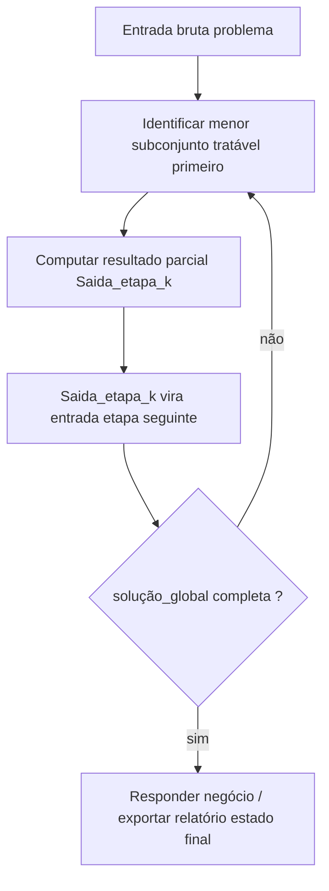
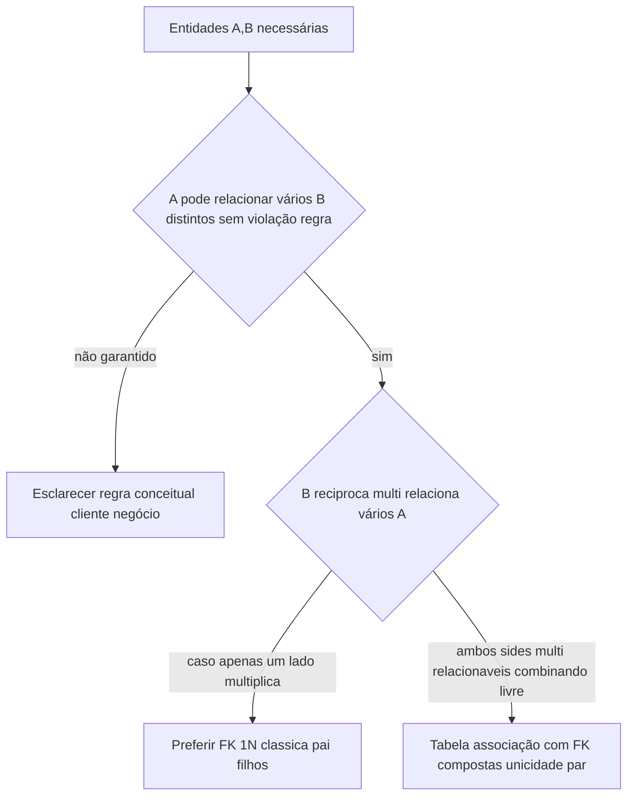
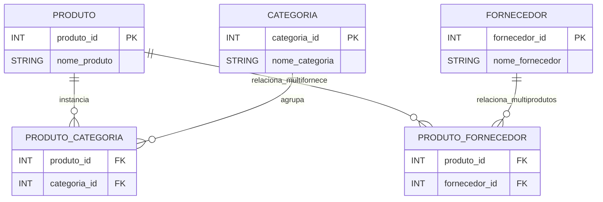
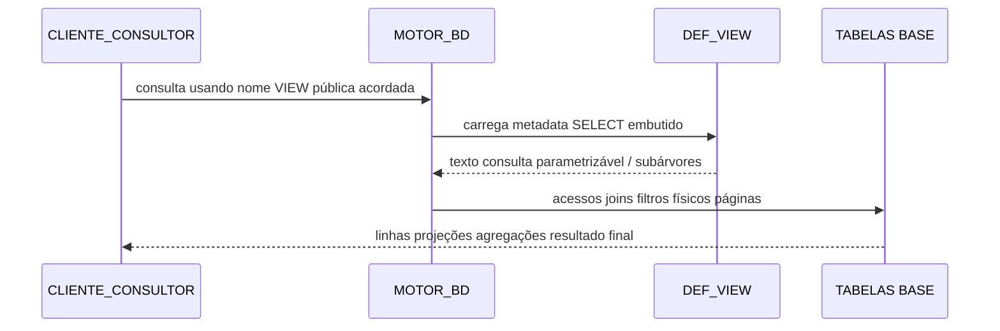
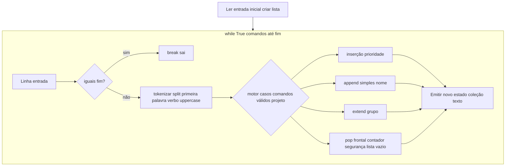

## Visão Geral do Conceito

O fio condutor técnico desta sessão não é apenas “syntax highlight”: é reorganizar dois planos paralelos até convergirem numa única forma de trabalho de estudante analytics developer.

No plano dados relacional você separa o que atualiza continuamente estado operação negócio (<mark style="background-color: #242424; padding: 2px 4px; border-radius: 3px; color: inherit;">transacional</mark>) das perguntas agregativas relatório (<mark style="background-color: #242424; padding: 2px 4px; border-radius: 3px; color: inherit;">analíticas</mark>) usando os mesmos fatos relacionados mediante junções conscientes filtros statuses tempo.

No plano raciocínio algorítmico repetem-se sempre três estações ligadas:<mark style="background-color: #242424; padding: 2px 4px; border-radius: 3px; color: inherit;">entrada textual ou linha arquivo</mark> → processamento comandos predicados métodos coleção joins SQL → estado impresso relatório coleção modificada arquivo escrita.

Discussão sala conectado evento presencial relatado oral apenas reforço motivacional alto nível: profissionais sénior projetam comportamento usando diagramas porque caminho dados permanece comando lógico ainda tecnologia volumosa.

> **Regra crítica aprendizado:** filtros exemplo status pedidos relatório categoria sempre alinhar seeds reais projeto scripts docente entregar; palavras “pagos/enviados” citadas apenas ilustrativo transcrição.

---

## Modelo Mental

Imagina cópias três painéis encostados físico sala:

Painel físico registra linhas tabelas com chaves e constraints garantindo unicidade relacionamentos integridade referencial.

Painel relatório opcional hospeda definições <mark style="background-color: #242424; padding: 2px 4px; border-radius: 3px; color: inherit;">`CREATE VIEW nome AS SELECT ... `</mark> como contratos consulta repetíveis aplicações BI servidor Python ORM relatando sem recodificar sempre expressão SQL completa se arquiteto centralizar servidor.

Painel código micro processa comandos até palavra <mark style="background-color: #242424; padding: 2px 4px; border-radius: 3px; color: inherit;">`fim `</mark> alterando coleção estudante—espelho local micro-pipeline porque cada comando consome estado atual produzindo novo imprimível repetindo.

Analogia rápido cozinhar: ingredientes físicos armazém ≈ dados tabelas; receita combinando ingredientes filtragem ≈ VIEW ou serviço aplicação; comandos estudante atualizando fila atendimento ≈ micro automação até parar intentionally.

Separa dois confusões recorrent curso início:<mark style="background-color: #242424; padding: 2px 4px; border-radius: 3px; color: inherit;">normalização projeto OLTP exemplo e-commerce atual</mark> não substitui sozinha arquitetura futura modelo dimensional avançado data warehouse apenas introduz dicotomia mental transacional analytic sem impor já star schema físico segunda fase projeto.

---

## Mecânica Central

Fragmentação problema macro complexo usando micro-etapas com saídas encadeadas (artefatos sucessivos apenas analogia infra palestra) aparece porque simplifica auditoria causal depuração regressão projeto longo mesmo pipeline dados corporativo apenas referenciado alto nível aula gravada.

Fluxo alto nível repetível quando divide raciocínio:



### Cardinalidades decidindo tabela ponte quando N aparece dois lados

Fluxo decisão simplificado:



Modelo ER sintético apenas ilustrativo padrões explicados voz (produto,categoria exemplo explícito; produto-fornecedor analogamente):



Interpretação projetual: unicidade combinacional habitualmente garantida usando chave surrogate substituta ou índices únicos par dependendo adoção projeto curso oficial.

### VIEW armazena definição, tabela armazena linhas físicas habitualmente separado objeto

Ao consumidor executar `<mark style="background-color: #242424; padding: 2px 4px; border-radius: 3px; color: inherit;">`SELECT * FROM vw_exemplo``

motor consulta expansão texto definição gera execuções físicas páginas registros dados base relacionadas filtros projeto.



Compara textual arquitetura alternativa apenas aplicações microserviços empacotarem mesmas perguntas fora servidor—trade-off segurança reaproveitamento acoplamento time operação volume consultas latência SLA caching externo—fora alcance decidir unicamente estudante isolando frase mágica “sempre view melhor sempre app melhor”; depende projeto real.

Discussão sala inclui segurança mínimo projeções view reduzindo leituras colunas inteiras inadvertidas relatório apenas necessita.

### Lista Python comandos entrada processamento ciclo sentinel

Demonstração sala combina inicial split separadores nomes comando loop infinito `while True` testando igualdade string terminador minúscula `break` comandos seguintes fazem segundo split espaço detectando verbal case-insensitivity `upper` decisão método lista:

| Comando exemplo semântico aula demonstrada correlacionável | Operação método lista primário |
| --- | --- |
| PRIOR `<mark style="background-color: #242424; padding: 2px 4px; border-radius: 3px; color: inherit;">prioridade nome` (`insert`(0,valor)|
| ADD append final |
| grupo múltiplos nominais seguidos | extend elementos ordem entrada tokens restantes cenário simples |
| chamada atendimento | pop índice zero somente quando comprimento maior zero acumula contagem atendidos |

Flux comando micro:



Nota eficiência: pop posição inicial lista grande Python custoso linear porque desloca elementos—aceitável treino curtas filas problema acadêmico; altíssimos volumes filas assíncronas habitualmente migram deque (`collections`) fora obrigação exemplo curso inicial.

---

## Uso Prático

### Molde SELECT agregando faturamento categoria apenas pedidos já filtrados

Valores placeholders status substituídos seed real projeto:

```sql
SELECT
    categoria.nome,
    SUM(item.quantidade * item.preco_unitario) AS faturamento_reportado
FROM pedido AS p
JOIN item_pedido AS item ON item.pedido_id = p.pedido_id
JOIN produto AS prod ON prod.id = item.produto_id
JOIN categoria AS categoria ON categoria.id = prod.categoria_id
WHERE p.status_pedido IN (/* valores reais projeto */)
GROUP BY categoria.nome;
```

Transformação futura habitual transformar esse bloco `CREATE VIEW vw_fat_categoria AS ...` segundo decisão arquitetônica explícita time.

### Exemplo integral Python comandos até fim usando política prioridade grupo simples chamada segurança

```python
inicial_txt = input("Pacientes inicial (separe por vírgula): ").strip()
fila = [p.strip() for p in inicial_txt.split(",") if p.strip()]

print("Estado inicial:", fila)

atendidos = 0

while True:
    comando = input("Próximo comando (fim encerra): ").strip()
    if comando.lower() == "fim":
        break

    tokens = comando.split()
    if not tokens:
        continue

    verbo = tokens[0].upper()

    if verbo == "PRIORIDADE" and len(tokens) >= 2:
        nome = " ".join(tokens[1:])
        fila.insert(0, nome)
    elif verbo == "ADICIONAR" and len(tokens) >= 2:
        nome = " ".join(tokens[1:])
        fila.append(nome)
    elif verbo == "GRUPO" and len(tokens) >= 2:
        nomes_simples_tokens = tokens[1:]
        fila.extend(nomes_simples_tokens)
    elif verbo == "CHAMAR":
        if len(fila) > 0:
            removido = fila.pop(0)
            atendidos += 1
            print("Paciente chamado:", removido)
        else:
            print("Fila já vazia; nenhum chamado aplicado.")

    print("Estado atual da fila:", fila)

print("Pacientes efetivamente atendidos pela rotina atual:", atendidos)
```

Limitações modelagem rápido: nomes compostos internos usando espaços com split padrão exigiriam aspas formato custom parser—lacuna apenas se enunciário futuro obrigar—nota rápido boas práticas parsing robusto estudante nível seguinte pipeline.

---

## Erros Comuns

**Ambiguar append extend:** append coloca único objeto final; extend incorpora elementos iterável individualmente—confundir cria inadvertidamente sublista dentro lista.

**N:N apenas via colunas repetidas produto lado único quando relação verdade multifornece multicategoria variável cardinalidade indefinido—gera inconsistência schema evita ponte.**

**Assume view duplica física integral linhas igual tabela física segunda persistência garantida sempre—mistura conceitos sem consultar features materialização específicas SGBD.**

**Loops consumindo pop zero sem sentinel comprimento causa IndexError coleção já esgotada.**

**JOIN amplo multiplicando cardinalidade inadvertido porque ignora filtros obrigatórios status ou duplicidades linhas—itens relatório inflate—sempre primeiro desenhar caminho FK mental ER.**

---

## Visão Geral de Debugging

Checklist regressão rápida três perguntas cruz projeto duplo dados código:

Lista estado imediatamente antes depois comando textual confirma intenções split tokens corretamente tokenização.

Lista SQL multiplicadora linhas: desenhar setas FK passo caminho físico garantindo apenas junções verdade cardinalidade relatório esperada.

Índices negativos erro pop insert fora alcance porque confundiu política tratamento primeiro último coleção estudante iniciante.

<details>
<summary>Diagnóstico típico resultados relatório valores zero soma sempre</summary>
Verifique JOIN caminho incompleto faltante chave relacionamento pedido-itens erroneamente direção invertida filtros remover tudo exemplo status impossível combina dados seed.

</details>

---

## Principais Pontos

- Transacional atualiza ciclo vida negócio; analíticos agrega compara períodos agrupamentos categoria apenas linhas válidas política combinada projeto.
- N para N dois lados multiplicativo simultâneo habitualmente associação separada dois FK preservando combos permitidos projeto.
- View declara seleção parametrizável reexecutável sem armazenar linhas segunda cópia por padrão geral relatório apenas metadados definições.
- Comand texto split verbo cargas método lista escolha reflete política fila relatório sala.
- Problema grande fragmentar etapa encadeável acelera clareza rastreável depuração—even analogia infra AWS pipeline mencionado orador apenas paralelo mentalização.

---

## Preparação para Prática

Você estará apto traduzir regra cardinalidade problema negócio tabela associative; projetar perguntas faturamentos categorias combinando filtros conscientes antes encapuslar opcional VIEW; implementar comandos modificadores coleção usando guard clauses evitando erro remoções vazio; repetir maior elemento sem builtins agregações pedagógicas; contar elementos pares operador modulus iterando coleção já convertidos inteiros.

---

## Laboratório de Prática

### Easy — Fila clínica digital até `ACABOU` maiúsculo ou minúsculo (Python)

Regras problema:

Primeira entrada linha inicial nomes vírgulas (ex.: Ana,Bia,Carl).

Linhas seguintes comandos até token isolado igual `ACABOU` ignore whitespace extremos insensitive case.

Interpretação:

PREFIXO comando deve comparar usando upper verbo primeira token.

PRIOR nomecomposto usando join tokens seguintes porque nome pode dois tokens se segunda palavra continua comando—implementação mínimo permitir nome único token restante apenas # TODO estudante caso duas palavras simples dois tokens sucessivos se quiser opcional nível iniciante apenas um token suficientes.

ADD nome faz append nome token restante texto join.

GRP seguido múltiplos tokens faz extend ordem entrada.

NEXT remove primeiro apenas se lista não vacuo incrementa inteiro `_atendimentos_sessao`; se vacuo imprime `SEM_FILA` apenas.

Após comando aplicável com sucesso imprimir `FILA=` concat join vírgulas.

Boilerplate abaixo roda inteiro mesmo sem completar estudante TODO apenas imprime sentinel teste final estatísticas zero modificação—implementação default segura usando operação neutra.

```python
def ler_inicial(txt: str):
    # TODO: separar vírgulas hífen espaços externos conformes enunciário curso granular
    return []


def aplicar_linha_cmd(fila, linha_cmd: str):
    # TODO comandos PRIOR ADD GRP NEXT lógicas completas sala
    return fila


def main():
    fila = ler_inicial(input())
    atendidas = 0
    linha_estado_placeholder = ",".join(fila)
    print("FILA=" + linha_estado_placeholder)
    while True:
        entrada_cmd = input().strip()
        if entrada_cmd.casefold() == "acabou":
            break
        fila = aplicar_linha_cmd(fila, entrada_cmd)
        print("FILA=" + ",".join(fila))
    print(f"ATENDIMENTOS_EFETIVOS={atendidas}")


if __name__ == "__main__":
    main()
```

### Medium — maior inteiro entrada espaço SEM usar max nem sorted builtins (Python)

Entrada valores inteiros simples formato único dígitos texto separados espaço garantido válido cenário projeto reduz erro conversão inicial.

Construa lista usando laço placeholders convertendo real—boilerplate fornece inicial lista zeros comprimento igual tokens para garantir maior índice zero seguro sempre evitando exceção até implementação real.

```python
def ints_from_tokens(tokens):
    out = []
    for _tok in tokens:
        out.append(0)  # TODO substituir int(_tok)
    return out


def main():
    partes = input().strip().split()
    if not partes:
        print("SEM_DADOS")
        return

    valores = ints_from_tokens(partes)
    idx_maior = 0
    maior_corrente = valores[0]

    # TODO atualizar maior_corrente idx_maior percorrendo demais elementos sem max/min/sorted

    print(f"MaiorValor={maior_corrente}")
    print(f"IndicePrimeiraOcorrenciaMaior={idx_maior}")


if __name__ == "__main__":
    main()
```

Porque zeros placeholder após split não vazio índices sempre válidos evitando exceção inicial—estudante completando conversão atualiza valores reais.

### Hard — Projecionar transações apenas campos públicos últimos X dias (`SQL`)

Tabela exemplo `finance.movimento` colunas fictícias: `mov_id_pk` `valor` `instante_evt` campo sensível irrelevante relatório público denominado apenas `HASH_INTERNO_SENSIVEL` você **deve omitir sempre projeções**.

Complete predicado temporal TODO substituindo placeholder constant `TRUE`:

```sql
SELECT
    m.mov_id_pk,
    m.valor,
    m.instante_evt
FROM finance.movimento AS m
WHERE TRUE
/* TODO predicado usando instante_evt comparando TIMESTAMP CURRENT_TIMESTAMP intervalo últimos N dias parametrizável comentário explicativo aluno exemplo 38 dias porque seed hipotético */
;
```

Ao final estudante justifica porque definir objeto futuro VIEW restringindo esse SELECT reduz probabilidade relatório público ler colunas sensíveis apenas existentes tabela física mas não projetadas objeto declarativo relatório público institucional.

---

<!-- CONCEPT_EXTRACTION
concepts:
  - fluxo entrada processamento saida cascata artefatos
  - projeto_ecommerce_mini transacional analytic separacao mental
  - cardinalidades_1_para_1_1_para_N_N_para_N decisao ponte associativa
  - view declaracao_consulta reexecutavel
  - seguranca projetiva minima relatórios públicos vs tabela física ampla colunas irrelevantes ou sensíveis
  - while_true_sentinel break split upper escolhas append insert extend pop0
skills:
  - Modelar relacionamento N para N com tabela ligação e constraints integridade projetáveis
  - Traduzir pergunta faturamento categoria relatório filtrando status real seed antes agregar
  - Implementar comandos texto mutando coleção usando guard antes remoções início fila texto
  - Iterar coleção atualizando acumulador máximo elemento sem builtins agregadora quando proibidas
examples:
  - exemplo_select_agregativo_categoria_filtro_placeholder_status
  - python_fila_comandos_prior_add_grp_next
-->

<!-- EXERCISES_JSON
[
  {
    "id": "easy-fila-comandos-atendimento-acabou",
    "slug": "easy-fila-comandos-atendimento-acabou",
    "difficulty": "easy",
    "title": "Fila comandos até sentinela ACABOU",
    "discipline": "projeto-de-bloco-fundamentos-do-processamento-de-dados",
    "editorLanguage": "python",
    "tags": ["python","lista","while","split","prioridade-append-extend-pop"],
    "summary": "Completar parsing inicial e comandos PRIOR ADD GRP NEXT com impressões obrigatórias garantindo comportamento definido estudante até terminar ciclo sentinel."
  },
  {
    "id": "medium-maior-inteiro-sem-max-sorted-inicial-placeholder",
    "slug": "medium-maior-inteiro-sem-max-sorted-inicial-placeholder",
    "difficulty": "medium",
    "title": "Maior número texto sem builtins agregadora",
    "discipline": "projeto-de-bloco-fundamentos-do-processamento-de-dados",
    "editorLanguage": "python",
    "tags": ["python","loop","comparacao","proibicao_max_sorted"],
    "summary": "Converter tokens inteiros real via TODO e achar primeira ocorrência máximo apenas laços comparativos."
  },
  {
    "id": "hard-sql-projecao-temporal-privacidade-sem-campo-sensivel",
    "slug": "hard-sql-projecao-temporal-privacidade-sem-campo-sensivel",
    "difficulty": "hard",
    "title": "SELECT relatório público sem coluna HASH sensível predicado dias",
    "discipline": "projeto-de-bloco-fundamentos-do-processamento-de-dados",
    "editorLanguage": "sql",
    "tags": ["sql","view","filtro temporal","privacidade projeções"],
    "summary": "Substituir WHERE TRUE usando instante_evt limitando período recente sem projetar coluna interna hash sensível apenas existente física tabela."
  }
]
-->

LESSONS_JSON_HINT
{
  "discipline": "projeto-de-bloco-fundamentos-do-processamento-de-dados",
  "slug": "modelagem-visoes-relacionamentos-listas-python",
  "title": "Modelagem relacional transacional versus analítica, views de negócio e fluxos em listas com Python",
  "order": 14,
  "file": "content/projeto-de-bloco-fundamentos-do-processamento-de-dados/modelagem-visoes-relacionamentos-listas-python.md"
}
