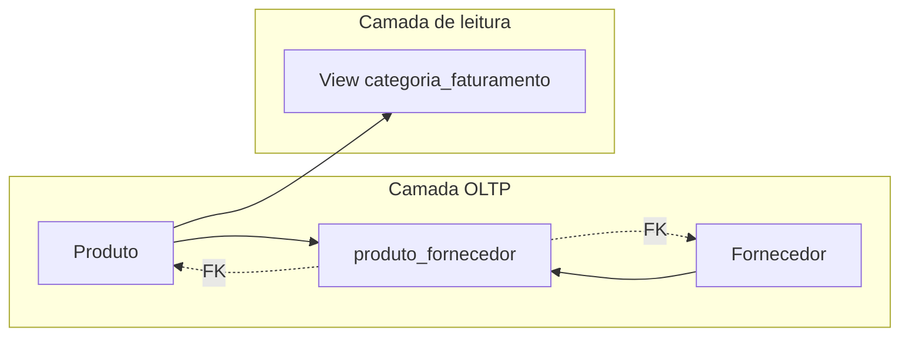

## Visão Geral do Conceito

Esta sessão fecha o arco do **projeto de e-commerce** enquanto abre a ponte para **Python aplicado**: primeiro, consolida ideias de **modelagem transacional** (pedidos, estoque, vendas) versus **visão analítica** (perguntas de negócio agregadas); em seguida, detalha **relacionamentos N:N** com **tabela de ligação**; revisa **views** como camada de leitura não materializada; e termina com um **exercício guiado** de fila de atendimento usando `list`, `append`, `insert`, `extend` e `pop`.

> **Regra:** esta lição foi reconstruída a partir da transcrição da aula (15/05/2026) e do ficheiro auxiliar `Aula_14_-_15052026.md` na pasta de download; lacunas na fonte são indicadas explicitamente.

## Modelo Mental

- **OLTP (transacional):** registos que representam eventos do dia a dia (compra, pagamento, movimento de stock).
- **Analítico:** perguntas sobre histórico e agregados (vendas por categoria, comportamento de clientes) — na aula ficou como direção futura, não totalmente modelada no exemplo.
- **N:N:** duas entidades com cardinalidade muitos-para-muitos exigem **terceira tabela** com chaves para ambas.
- **View:** objeto de catálogo que armazena **definição** de `SELECT`; dados continuam nas tabelas base.
- **Fila simulada:** estrutura linear (lista) com regras de entrada no fim, no início (prioridade) e remoção controlada.



## Mecânica Central

### Normalização transacional vs analítica

A **transacional** organiza dados para integridade e operações concorrentes. A **analítica** privilegia leituras e agregações para indicadores — pode evoluir para outro desenho físico; na turma o foco permaneceu no núcleo transacional do e-commerce.

### N:N e tabela de ligação

Quando um **produto** pode ter **vários fornecedores** e um **fornecedor** atende **vários produtos**, não se duplica linha de produto com colunas de fornecedor. Cria-se, por exemplo, `produto_fornecedor(produto_id, fornecedor_id)` com **FKs** para `produto` e `fornecedor`. O mesmo padrão aparece em **produto_categoria** (produto em várias categorias e categoria com vários produtos).

### Views e camada de aplicação

A **view** `categoria_faturamento` (exemplo da aula) junta itens, pedidos, produtos e categorias com filtros de estado (`pago`, `enviado`, etc.) e devolve resultado já interpretável. A aula deixa claro que **outros projetos** podem mover essas consultas para a **aplicação** — decisão de arquitetura, não “certo ou errado” universal.

### Fila em Python

Fluxo típico do exercício discutido:

1. **Entrada inicial:** `input()` com nomes separados por vírgula → `split(",")` para obter lista de pacientes.
2. **Loop:** `while True:` lendo comandos até `fim` → `break`.
3. **Parsing:** separar verbo (`prioridade`, `adicionar`, `grupo`, `chamar`) e argumentos com `split()`.
4. **Mutação da lista:** `append` no fim; `insert(0, nome)` para prioridade; `extend([...])` para grupo; `pop(0)` ou equivalente para atender o primeiro da fila (conforme enunciado usado na sala).

## Uso Prático

### Esboço de ligação N:N

```text
produto (id, ...)
fornecedor (id, ...)
produto_fornecedor (produto_id FK, fornecedor_id FK)
-- chave composta ou surrogate conforme padrão do projeto
```

### Esqueleto de simulação de comandos

```python
fila = input("Pacientes iniciais (vírgula): ").split(",")
fila = [p.strip() for p in fila if p.strip()]
atendidos = 0

while True:
    cmd = input("Comando: ").strip()
    if cmd.lower() == "fim":
        break
    partes = cmd.split()
    acao = partes[0].upper()
    # prioridade NOME -> insert(0, nome)
    # adicionar NOME -> append
    # grupo N1 N2 ... -> extend no fim
    # chamar -> pop(0); atendidos += 1
    print("Fila:", fila)

print("Sessão encerrada. Atendidos:", atendidos)
```

> **Lacuna:** o vídeo mostra depuração ao vivo; se o teu enunciado institucional tiver regras diferentes (por exemplo outro índice no `pop`), segue o documento oficial da disciplina.

## Erros Comuns

- Confundir **view materializada** (não abordada como solução nesta aula) com **view** padrão.
- Modelar N:N com colunas repetidas em uma só tabela.
- Usar `for` quando o término depende de **entrada desconhecida** — preferir `while` com condição explícita.
- Esquecer de normalizar espaços após `split(",")`.

## Visão Geral de Debugging

Para filas: imprimir estado após cada comando antes de otimizar. Para N:N: desenhar setas das FKs e verificar se cada par `(produto_id, fornecedor_id)` é único na tabela de ligação.

## Principais Pontos

- Transacional versus analítico são **papéis diferentes** dos dados; o projeto da turma focou no transacional.
- **N:N ⇒ tabela de ligação** com duas FKs (padrão reutilizável).
- **Views** encapsulam `SELECT` no SGBD; a alternativa é camada de serviço na aplicação.
- **Listas** em Python implementam a fila do laboratório com operações explícitas.

## Preparação para Prática

Tenha à mão o teu esquema do e-commerce (aulas 12–13) para relacionar nomes de tabelas e views com o que o professor demonstrou no diagrama.

### Checklist de domínio

- [ ] Explicar em uma frase quando uma tabela de ligação é obrigatória.
- [ ] Diferenciar dados armazenados em tabela base vs resultado de view.
- [ ] Escolher `append` vs `insert(0, ...)` conforme a semântica de fila.
- [ ] Justificar `while` + `break` para leitura até comando de saída.

## Laboratório de Prática

### Easy — Identificar cardinalidade

Classifique cada par como `1:1`, `1:N` ou `N:N` (resposta em comentários no código).

```python
pares = [
    ("pedido", "cliente"),
    ("produto", "fornecedor"),
    ("pedido", "item_pedido"),
]
# TODO: imprimir uma linha por par com a cardinalidade típica do e-commerce da turma
for esquerda, direita in pares:
    print(esquerda, direita, "=>", "TODO")
```

### Medium — Comandos de fila

Complete o manipulador para os verbos `PRIORIDADE nome`, `ADICIONAR nome`, `GRUPO nome1 nome2 ...` (após o verbo) e `CHAMAR` (remove o primeiro e incrementa atendidos). Use apenas listas built-in.

```python
def aplicar_comando(fila: list[str], atendidos: int, linha: str) -> tuple[list[str], int]:
    """TODO: interpretar linha e devolver (nova_fila, novo_contador_atendidos)."""
    return fila, atendidos


if __name__ == "__main__":
    f: list[str] = ["Ana", "Beto"]
    a = 0
    f, a = aplicar_comando(f, a, "PRIORIDADE Carla")
    print(f, a)
```

### Hard — Justificar views vs app

Escreva 6–10 linhas comparando **duas** arquiteturas: (A) views no PostgreSQL/SQLite servidas ao BI; (B) repositório em Python com SQL embutido. Inclua um critério de decisão (equipa, deploy, testes).

```markdown
<!-- TODO: texto aqui -->
```

<!-- CONCEPT_EXTRACTION
concepts:
  - normalizacao transacional OLTP
  - visao analitica agregada
  - relacionamento N para N
  - tabela de ligacao produto_fornecedor
  - produto_categoria
  - view definicao select nao materializada
  - camada de visualizacao vs camada de aplicacao
  - fila prioridade lista insert append extend pop
  - while true break parse comando
skills:
  - Reconhecer quando N:N exige terceira tabela
  - Explicar trade-off views no BD vs consultas na app
  - Implementar fila com comandos de texto em Python
examples:
  - ecommerce_produto_categoria_nn
  - view_categoria_faturamento
  - fila_atendimento_prioridade_python
-->

<!-- EXERCISES_JSON
[
  {
    "id": "cardinalidade-ecommerce-pedido-produto",
    "slug": "cardinalidade-ecommerce-pedido-produto",
    "difficulty": "easy",
    "title": "Classificar cardinalidades típicas do e-commerce",
    "discipline": "projeto-bloco",
    "editorLanguage": "python",
    "tags": ["projeto-bloco", "modelagem", "cardinalidade"],
    "summary": "Identificar 1:1, 1:N e N:N em pares de entidades do projeto."
  },
  {
    "id": "fila-comandos-prioridade-python",
    "slug": "fila-comandos-prioridade-python",
    "difficulty": "medium",
    "title": "Fila de atendimento com prioridade e grupo",
    "discipline": "projeto-bloco",
    "editorLanguage": "python",
    "tags": ["projeto-bloco", "listas", "fila"],
    "summary": "Manipular lista com PRIORIDADE, ADICIONAR, GRUPO e CHAMAR."
  },
  {
    "id": "views-vs-app-criterios",
    "slug": "views-vs-app-criterios",
    "difficulty": "hard",
    "title": "Views no banco versus consultas na aplicação",
    "discipline": "projeto-bloco",
    "editorLanguage": "markdown",
    "tags": ["projeto-bloco", "arquitetura", "views"],
    "summary": "Texto curto com trade-offs e critério de decisão."
  }
]
-->
