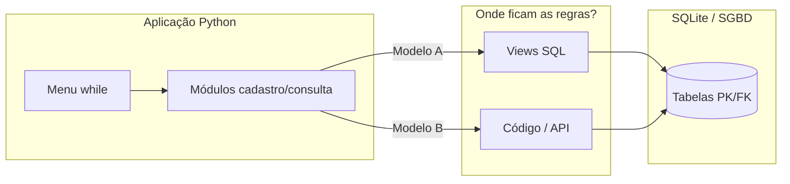
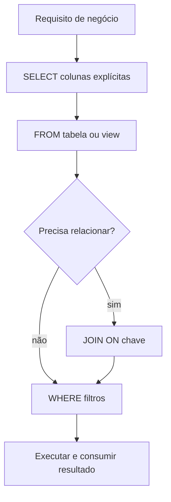
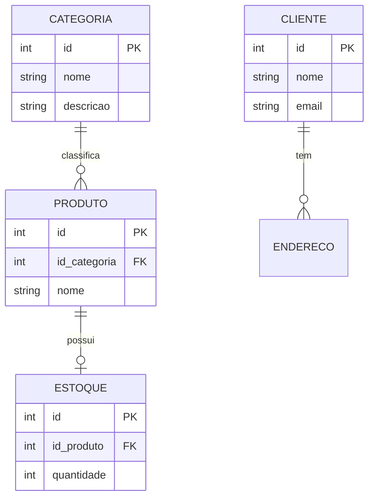
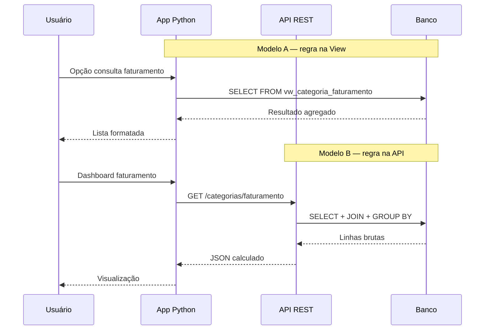

## Visão Geral do Conceito

O projeto e-commerce desenvolvido ao longo da disciplina não é apenas um menu em Python: é um **sistema integrado** em que a aplicação consome um banco relacional (neste caso, <mark style="background-color: #242424; padding: 2px 4px; border-radius: 3px; color: inherit;">`SQLite`</mark>) para persistir cadastros e consultas analíticas. A aula 16 consolida três ideias centrais que aparecem diariamente em ADS:

1. **Acesso a dados** — estrutura <mark style="background-color: #242424; padding: 2px 4px; border-radius: 3px; color: inherit;">`SELECT`</mark> → <mark style="background-color: #242424; padding: 2px 4px; border-radius: 3px; color: inherit;">`FROM`</mark> → <mark style="background-color: #242424; padding: 2px 4px; border-radius: 3px; color: inherit;">`JOIN`</mark> → <mark style="background-color: #242424; padding: 2px 4px; border-radius: 3px; color: inherit;">`WHERE`</mark>, comandos de mutação seguros e relacionamentos por chaves.
2. **Integração Python ↔ banco** — conexão, <mark style="background-color: #242424; padding: 2px 4px; border-radius: 3px; color: inherit;">`cursor`</mark>, placeholders, <mark style="background-color: #242424; padding: 2px 4px; border-radius: 3px; color: inherit;">`commit()`</mark> e modularização por arquivos.
3. **Arquitetura de regras de negócio** — decidir se filtros, agregações e relatórios ficam em **Views no banco**, no **código da aplicação** ou em **APIs/microserviços**.

> **Regra:** Toda consulta ou operação de escrita deve nascer de uma **pergunta de negócio** ("listar categorias", "faturamento por categoria", "excluir categoria 12") — não de sintaxe solta no editor.

---

## Modelo Mental

Imagine três camadas empilhadas:

| Camada | Papel no e-commerce | Exemplo concreto |
|--------|---------------------|------------------|
| **Apresentação** | Menu Python, `input()`, `print()` | Opção 1 lista categorias |
| **Lógica / visualização** | Regras de negócio e relatórios | View `vw_categoria_faturamento` ou código Python com JOINs |
| **Armazenamento** | Tabelas normalizadas com PK/FK | `categoria`, `produto`, `cliente`, `estoque` |

A aplicação Python **não "sabe" SQL por magia**: ela envia instruções ao motor do banco; o banco devolve tuplas; um <mark style="background-color: #242424; padding: 2px 4px; border-radius: 3px; color: inherit;">`for`</mark> transforma essas tuplas em saída legível.

Quanto às regras de negócio, pense em **dois modelos**:

- **Modelo A (legado / didático do projeto):** o banco responde perguntas complexas via **Views**; Python só executa `SELECT * FROM vw_...` e exibe.
- **Modelo B (comum em sistemas modernos):** o banco **só armazena**; APIs ou serviços em Python montam JOINs, filtros e agregações no código.

Nenhum modelo é "errado" universalmente — a escolha é **decisão de arquitetura**, não preferência pessoal do desenvolvedor.



---

## Mecânica Central

### Estrutura de uma consulta SQL

Toda consulta orientada a negócio combina quatro blocos lógicos:

| Cláusula | Função | Pergunta que responde |
|----------|--------|------------------------|
| <mark style="background-color: #242424; padding: 2px 4px; border-radius: 3px; color: inherit;">`SELECT`</mark> | Projeção | *O que* quero ver? |
| <mark style="background-color: #242424; padding: 2px 4px; border-radius: 3px; color: inherit;">`FROM`</mark> | Origem | *De onde* vêm os dados? |
| <mark style="background-color: #242424; padding: 2px 4px; border-radius: 3px; color: inherit;">`JOIN`</mark> | Relacionamento | *Como* tabelas se conectam? |
| <mark style="background-color: #242424; padding: 2px 4px; border-radius: 3px; color: inherit;">`WHERE`</mark> | Filtro | *Quais* linhas entram no resultado? |



**ANSI SQL** é o padrão comum entre SGBDs. Dialectos estendem o padrão:

- **T-SQL** (Microsoft SQL Server) — funções e sintaxe proprietárias.
- **PL/SQL** (Oracle) — idem; terminador de instrução pode ser `/` em alguns clientes.
- **SQLite** (projeto) — aceita `;` como fim de instrução na maioria dos IDEs.

> **Regra:** Use <mark style="background-color: #242424; padding: 2px 4px; border-radius: 3px; color: inherit;">`;`</mark> ao final de cada instrução SQL quando houver múltiplos comandos no mesmo script — evita que o IDE execute apenas a linha do cursor ou interprete dois `SELECT` adjacentes como sintaxe inválida.

### Relacionamentos: PK e FK

Cada tabela filha referencia a pai por **chave estrangeira** (<mark style="background-color: #242424; padding: 2px 4px; border-radius: 3px; color: inherit;">`FOREIGN KEY`</mark>):

- Em `estoque`, `id_produto` é FK → `produto.id` (PK).
- O SGBD **impede** (ou deveria impedir) estoque de produto inexistente: primeiro cadastre o produto, depois o estoque.



Relacionamentos **N:N** exigem tabela de ligação (ex.: produto ↔ categoria quando um produto pertence a várias categorias).

### CRUD no Python com sqlite3

Fluxo repetido em todos os módulos de cadastro (`categorias`, `clientes`, etc.):

1. **Listar** — `SELECT` colunas explícitas → `cursor.fetchall()` → loop `for`.
2. **Inserir** — `INSERT` com `?` placeholders → `execute(sql, tupla)` → `commit()`.
3. **Atualizar** — localizar por `id` → `UPDATE ... WHERE id = ?` → `commit()`.
4. **Excluir** — `DELETE FROM ... WHERE id = ?` → `commit()`.

```python
import sqlite3

def listar_categorias(conexao):
    cursor = conexao.cursor()
    cursor.execute(
        "SELECT id_categoria, nome, descricao FROM categoria"
    )
    dados = cursor.fetchall()
    if not dados:
        print("Nenhuma categoria cadastrada.")
        return
    for linha in dados:
        print(linha)

def inserir_categoria(conexao, nome, descricao):
    cursor = conexao.cursor()
    cursor.execute(
        "INSERT INTO categoria (nome, descricao) VALUES (?, ?)",
        (nome, descricao),
    )
    conexao.commit()
```

O <mark style="background-color: #242424; padding: 2px 4px; border-radius: 3px; color: inherit;">`commit()`</mark> **persiste** a transação no arquivo físico do SQLite. Sem commit, alterações ficam apenas na sessão e se perdem ao fechar a conexão.

### Modularização do projeto

O menu principal importa módulos separados — padrão de **separação por responsabilidade**:

```python
import os
import sqlite3
from cadastros import categorias, clientes, produtos
from consultas import gerais

def limpar_tela():
    os.system("cls" if os.name == "nt" else "clear")
```

Cada arquivo replica a mesma estrutura CRUD alterando nomes de tabela e colunas — **reutilização por template**, não por abstração prematura (adequado ao estágio de aprendizagem do projeto).

### Views como camada de visualização

No projeto, consultas analíticas (categorias por faturamento, clientes ativos, ticket médio) foram implementadas como **Views** no banco. O módulo `consultas.py` apenas executa:

```python
cursor.execute("SELECT id, nome, total_faturamento FROM vw_categoria_faturamento")
```

A agregação (`GROUP BY`), JOINs e filtros de negócio **já estão dentro da View** — a aplicação permanece "burra" em relação à regra, mas "inteligente" em relação à navegação.

### Onde colocar regras de negócio?

| Critério | Regras no banco (Views, procedures) | Regras na aplicação / API |
|----------|-------------------------------------|---------------------------|
| Sistemas legados | Comum | Menos comum |
| Microserviços modernos | Armazenamento apenas | Comum |
| Escalabilidade horizontal | Limitada no DB | Serviços independentes |
| Quem mantém | DBA + dev backend | Time de aplicação |
| Exemplo no projeto | `vw_cliente_pendente` | Transferir JOINs para Python ou API REST |



### Ambientes: desenvolvimento, homologação, produção

Mesmo em projetos acadêmicos, vale internalizar o ciclo profissional:

1. **Desenvolvimento** — máquina local, SQLite ou instância de teste.
2. **Homologação** — espelho controlado para QA e validação de negócio.
3. **Produção** — dados reais, deploy automatizado (CI/CD, DevOps).

Scripts SQL de criação do esquema permitem **reproduzir** o banco em qualquer ambiente — alinhado à portabilidade ANSI mencionada na aula (exportar modelo para PostgreSQL, SQL Server, etc.).

### List comprehension, zip e enumerate

Exercício de liquidação: gerar etiquetas promocionais a partir de listas paralelas de nomes e preços.

- <mark style="background-color: #242424; padding: 2px 4px; border-radius: 3px; color: inherit;">`split(',')`</mark> — converte string de entrada em listas.
- <mark style="background-color: #242424; padding: 2px 4px; border-radius: 3px; color: inherit;">`zip(nomes, precos)`</mark> — combina elementos de mesmo índice.
- <mark style="background-color: #242424; padding: 2px 4px; border-radius: 3px; color: inherit;">`enumerate()`</mark> — fornece índice + valor (útil para numerar etiquetas a partir de 1).
- **List comprehension** — compacta o loop de montagem em uma expressão.

```python
nomes = ["notebook", "mouse", "teclado"]
precos = [3200.0, 89.0, 450.0]
desconto = 0.10

etiquetas = [
    f"{i+1:02d} | {nome} | R$ {preco:.2f} -> R$ {preco * (1 - desconto):.2f}"
    for i, (nome, preco) in enumerate(zip(nomes, precos))
]
```

Equivalente imperativo com <mark style="background-color: #242424; padding: 2px 4px; border-radius: 3px; color: inherit;">`for`</mark> — mesma lógica, mais linhas; comprehension é idiomática quando a transformação é simples e legível.

---

## Uso Prático

### Estrutura de pastas do e-commerce

```
ecommerce/
├── menu.py              # loop principal, imports, conexão
├── database/
│   └── conexao.py       # sqlite3.connect + cursor
├── cadastros/
│   ├── categorias.py
│   ├── clientes.py
│   └── produtos.py
├── consultas/
│   └── gerais.py        # SELECT em Views
└── scripts/
    └── schema.sql       # DDL reproduzível
```

### Menu com while e break

```python
opcao = ""
while opcao != "0":
    print("\n--- MENU E-COMMERCE ---")
    print("1. Categorias")
    print("9. Consultas gerais")
    print("0. Sair")
    opcao = input("Escolha: ")

    if opcao == "0":
        limpar_tela()
        print("Sistema encerrado.")
        break
    elif opcao == "1":
        categorias.gerenciar(conexao)
```

O <mark style="background-color: #242424; padding: 2px 4px; border-radius: 3px; color: inherit;">`break`</mark> encerra o <mark style="background-color: #242424; padding: 2px 4px; border-radius: 3px; color: inherit;">`while`</mark> imediatamente — padrão idêntico ao da calculadora e demais exemplos da disciplina.

### Consulta segura versus SELECT *

```sql
-- Preferido em produção
SELECT id_categoria, nome, descricao
FROM categoria;

-- Evitar em código de aplicação
SELECT * FROM categoria;
```

Colunas explícitas documentam dependências, reduzem tráfego e **falham de forma localizada** se um campo for renomeado — em vez de quebrar silenciosamente por coluna extra.

### UPDATE e DELETE sempre filtrados

```sql
UPDATE categoria
SET nome = 'Eletrônicos', descricao = 'Produtos eletrônicos'
WHERE id_categoria = 12;

DELETE FROM categoria
WHERE id_categoria = 12;
```

Sem <mark style="background-color: #242424; padding: 2px 4px; border-radius: 3px; color: inherit;">`WHERE`</mark>, o comando atinge **todas** as linhas — erro clássico em homologação que só aparece em produção.

### Consumir View no Python

```python
def categorias_faturamento(conexao):
    cursor = conexao.cursor()
    cursor.execute(
        """
        SELECT categoria, total_vendas, participacao_pct
        FROM vw_categoria_faturamento
        ORDER BY total_vendas DESC
        """
    )
    for cat, total, pct in cursor.fetchall():
        print(f"{cat}: R$ {total:.2f} ({pct:.1f}%)")
```

A regra "participação percentual" vive na View; Python só formata saída.

---

## Erros Comuns

**Erro de sintaxe `near SELECT` / `near FROM` com SQL aparentemente correto**

- **Causa:** duas instruções sem `;` entre elas, ou IDE executando só a linha selecionada.
- **Correção:** termine cada comando com `;` e selecione explicitamente o bloco a executar.

**Esquecer `commit()` após INSERT/UPDATE/DELETE**

- **Sintoma:** operação "funciona" na sessão, mas desaparece ao reiniciar.
- **Correção:** chame <mark style="background-color: #242424; padding: 2px 4px; border-radius: 3px; color: inherit;">`conexao.commit()`</mark> após mutações.

**Usar `SELECT *` em módulos de listagem**

- **Sintoma:** tela traz colunas irrelevantes; quebra quando esquema evolui.
- **Correção:** liste apenas colunas usadas na interface.

**Violar FK ao cadastrar estoque antes do produto**

- **Sintoma:** erro de integridade referencial ou dado órfão (sem constraint).
- **Correção:** respeite ordem de cadastro pai → filho.

**Confundir placeholder `?` com f-string na SQL**

- **Sintoma:** risco de SQL injection e erro de tipo.
- **Correção:** use `execute(sql, (valor1, valor2))` — nunca interpole entrada do usuário direto na string SQL.

**List comprehension ilegível**

- **Sintoma:** expressão de uma linha com cinco operadores aninhados.
- **Correção:** se a depuração falhar repetidamente, volte ao `for` explícito; comprehension exige clareza.

---

## Visão Geral de Debugging

### SQL no IDE

1. Isole **uma instrução** por execução.
2. Confirme terminador (`;`) e seleção de texto.
3. Leia a mensagem: `near X` indica token anterior problemático.
4. Valide nomes de tabela/coluna contra o esquema — typos geram `no such column`.

### Python com depurador

1. Coloque **breakpoint** após parsing de entrada (`split`, conversão para `float`).
2. Avance linha a linha e inspecione variáveis (`nomes`, `precos`, `etiquetas`).
3. Compare fluxo **imperativo** versus **comprehension** com mesmos inputs.
4. Em CRUD, depure **antes e depois** do `commit()` consultando o banco no cliente SQL.

<details>
<summary>Ver checklist rápido de depuração CRUD</summary>

- A conexão foi aberta no caminho correto do arquivo `.db`?
- O SQL usa placeholders na mesma ordem da tupla?
- `fetchall()` retorna vazio — problema no SELECT ou tabela vazia?
- Após INSERT, um SELECT manual confirma a linha?
- UPDATE/DELETE usam o `id` correto vindo do `input()`?

</details>

---

## Principais Pontos

- Consultas SQL refletem **perguntas de negócio**; estrutura base: SELECT → FROM → JOIN → WHERE.
- **PK/FK** garantem integridade entre tabelas do e-commerce normalizado.
- Python integra via <mark style="background-color: #242424; padding: 2px 4px; border-radius: 3px; color: inherit;">`sqlite3`</mark>: connect, cursor, execute, fetch, **commit** em mutações.
- Modularização (`import` por cadastro/consulta) evita arquivo monolítico e facilita manutenção.
- **Views** concentram regras analíticas no banco; APIs modernas tendem a trazer essas regras para serviços.
- Nunca use `SELECT *` nem DML sem `WHERE` em código real.
- **`;`**, seleção de bloco no IDE e dialecto correto evitam erros de sintaxe "fantasma".
- <mark style="background-color: #242424; padding: 2px 4px; border-radius: 3px; color: inherit;">`zip`</mark>, <mark style="background-color: #242424; padding: 2px 4px; border-radius: 3px; color: inherit;">`enumerate`</mark> e list comprehension resolvem transformações paralelas de listas (etiquetas, relatórios).
- Depuração linha a linha é habilidade central — equivalente ao trace de queries no DBA.

---

## Preparação para Prática

Ao concluir esta lição, você deve conseguir:

1. Escrever um `SELECT` com colunas explícitas e filtro `WHERE` para um requisito dado.
2. Implementar listagem e inserção em Python com placeholders e `commit()`.
3. Explicar por que a View `vw_categoria_faturamento` encapsula regra de negócio.
4. Argumentar trade-offs entre regras no banco versus na API.
5. Montar etiquetas promocionais com `zip`/`enumerate` ou list comprehension.
6. Diagnosticar erro de sintaxe SQL causado por múltiplos comandos mal terminados.

---

## Laboratório de Prática

### Easy — Colunas explícitas no cadastro

Complete a consulta de listagem de clientes ativos. O sistema de e-commerce deve exibir apenas `id`, `nome` e `email` de clientes com status ativo.

```python
import sqlite3

def listar_clientes_ativos(conexao: sqlite3.Connection) -> None:
    cursor = conexao.cursor()
    sql = """
    -- TODO: completar SELECT com colunas id, nome, email
    -- TODO: completar FROM clientes
    -- TODO: adicionar WHERE status = 'ativo'
    """
    cursor.execute(sql)
    dados = cursor.fetchall()

    if not dados:
        print("Nenhum cliente ativo.")
        return

    for cliente_id, nome, email in dados:
        print(f"{cliente_id} | {nome} | {email}")

if __name__ == "__main__":
    conexao = sqlite3.connect(":memory:")
    conexao.execute(
        "CREATE TABLE clientes (id INTEGER, nome TEXT, email TEXT, status TEXT)"
    )
    conexao.executemany(
        "INSERT INTO clientes VALUES (?, ?, ?, ?)",
        [
            (1, "Ana", "ana@loja.com", "ativo"),
            (2, "Bruno", "bruno@loja.com", "inativo"),
            (3, "Carla", "carla@loja.com", "ativo"),
        ],
    )
    listar_clientes_ativos(conexao)
    conexao.close()
```

---

### Medium — Inserir categoria com commit

Implemente o cadastro de categoria recebendo nome e descrição do operador do e-commerce. Use placeholders e confirme a gravação.

```python
import sqlite3

def cadastrar_categoria(conexao: sqlite3.Connection, nome: str, descricao: str) -> None:
    cursor = conexao.cursor()
    # TODO: montar SQL INSERT INTO categoria (nome, descricao) VALUES (?, ?)
    # TODO: executar com cursor.execute passando tupla (nome, descricao)
    # TODO: chamar conexao.commit()
    print(f"Categoria '{nome}' cadastrada com sucesso.")

def contar_categorias(conexao: sqlite3.Connection) -> int:
    cursor = conexao.cursor()
    cursor.execute("SELECT COUNT(*) FROM categoria")
    return cursor.fetchone()[0]

if __name__ == "__main__":
    conexao = sqlite3.connect(":memory:")
    conexao.execute(
        "CREATE TABLE categoria (id INTEGER PRIMARY KEY AUTOINCREMENT, nome TEXT, descricao TEXT)"
    )
    cadastrar_categoria(conexao, "Acessórios", "Periféricos e cabos")
    total = contar_categorias(conexao)
    print(f"Total de categorias: {total}")  # Esperado: 1 após implementar
    conexao.close()
```

---

### Hard — Etiquetas promocionais com list comprehension

A loja de eletrônicos gera etiquetas com 10% de desconto. Entrada: strings separadas por vírgula. Saída: lista formatada e resumo com preço mínimo/máximo **promocional**.

```python
def parse_lista(texto: str) -> list[str]:
    return [item.strip() for item in texto.split(",") if item.strip()]

def parse_precos(texto: str) -> list[float]:
    return [float(p.strip()) for p in texto.split(",") if p.strip()]

def gerar_etiquetas(nomes: list[str], precos: list[float], desconto: float = 0.10) -> list[str]:
    # TODO: usar list comprehension com enumerate e zip
    # Formato: "01 | notebook | R$ 3200.00 -> R$ 2880.00"
    # Dica: indice i com f"{i+1:02d}", preco promo = preco * (1 - desconto)
    return []

def resumo_promocional(precos: list[float], desconto: float = 0.10) -> tuple[float, float]:
    promocionais = [p * (1 - desconto) for p in precos]
    if not promocionais:
        return 0.0, 0.0
    return min(promocionais), max(promocionais)

if __name__ == "__main__":
    entrada_nomes = "notebook, mouse, teclado"
    entrada_precos = "3200, 89, 450"

    nomes = parse_lista(entrada_nomes)
    precos = parse_precos(entrada_precos)

    etiquetas = gerar_etiquetas(nomes, precos)
    for linha in etiquetas:
        print(linha)

    menor, maior = resumo_promocional(precos)
    print(f"Menor preço promocional: R$ {menor:.2f}")
    print(f"Maior preço promocional: R$ {maior:.2f}")
```

---

<!-- CONCEPT_EXTRACTION
concepts:
  - SELECT FROM JOIN WHERE
  - sqlite3 cursor commit
  - CRUD Python
  - chave primária e estrangeira
  - Views SQL
  - regras de negócio banco vs aplicação
  - ambientes dev homolog prod
  - list comprehension
  - zip enumerate
  - debug passo a passo
skills:
  - Escrever consultas SQL com colunas explícitas e filtros WHERE
  - Implementar operações CRUD em Python com placeholders e commit
  - Explicar relacionamentos PK/FK em modelos normalizados
  - Consumir Views como camada de visualização de dados
  - Comparar arquiteturas com regras no banco versus em APIs
  - Depurar código Python inspecionando variáveis linha a linha
  - Gerar listas transformadas com list comprehension zip e enumerate
examples:
  - crud-categorias-sqlite
  - consulta-view-faturamento
  - menu-modular-ecommerce
  - etiquetas-promocionais-compression
  - delete-update-com-where
-->

<!-- EXERCISES_JSON
[
  {
    "id": "select-clientes-ativos-colunas",
    "slug": "select-clientes-ativos-colunas",
    "difficulty": "easy",
    "title": "Listar clientes ativos com colunas explícitas",
    "discipline": "projeto-bloco-fundamentos-processamento-dados",
    "editorLanguage": "python",
    "tags": ["sql", "select", "where", "sqlite"],
    "summary": "Completar SELECT/FROM/WHERE para listar id, nome e email de clientes ativos."
  },
  {
    "id": "insert-categoria-commit",
    "slug": "insert-categoria-commit",
    "difficulty": "medium",
    "title": "Cadastrar categoria com INSERT e commit",
    "discipline": "projeto-bloco-fundamentos-processamento-dados",
    "editorLanguage": "python",
    "tags": ["python", "sqlite3", "insert", "commit", "crud"],
    "summary": "Implementar INSERT com placeholders e commit para persistir categoria no e-commerce."
  },
  {
    "id": "etiquetas-list-comprehension",
    "slug": "etiquetas-list-comprehension",
    "difficulty": "hard",
    "title": "Etiquetas promocionais com list comprehension",
    "discipline": "projeto-bloco-fundamentos-processamento-dados",
    "editorLanguage": "python",
    "tags": ["python", "list-comprehension", "zip", "enumerate", "formatacao"],
    "summary": "Gerar etiquetas de liquidação com desconto usando enumerate, zip e list comprehension."
  }
]
-->

```json
LESSONS_JSON_HINT
{
  "discipline": "projeto-bloco-fundamentos-processamento-dados",
  "slug": "integracao-python-sql-crud-regras-negocio",
  "title": "Integração Python e SQL no E-commerce: CRUD, Views e Regras de Negócio",
  "order": 16,
  "file": "integracao-python-sql-crud-regras-negocio.md"
}
```
