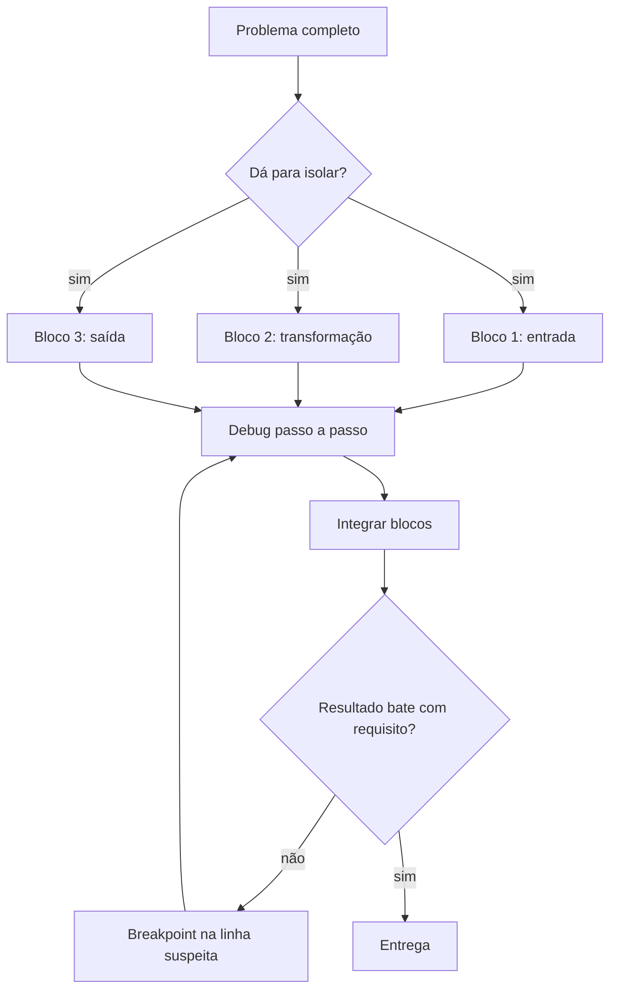
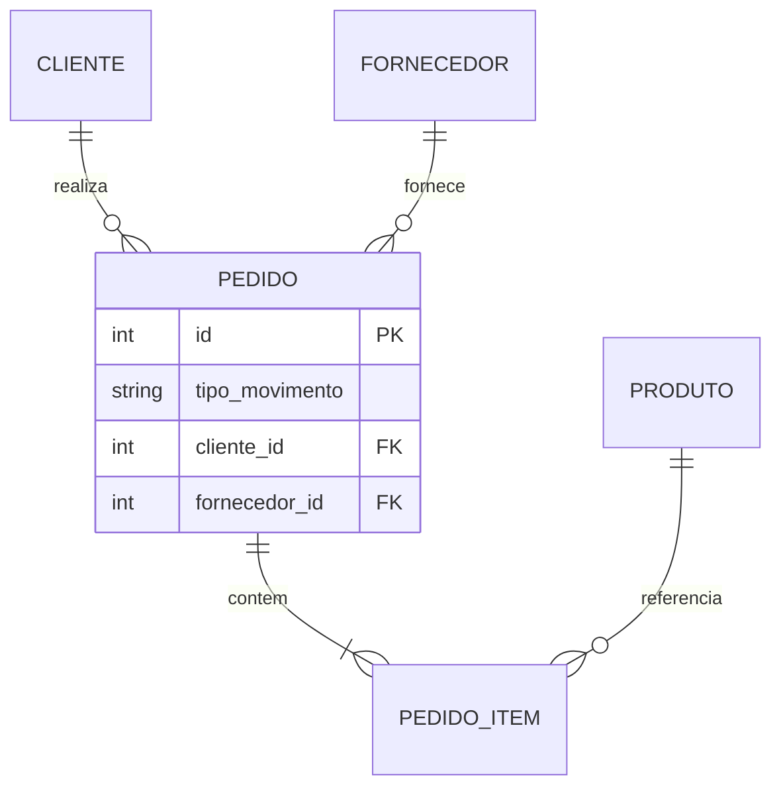
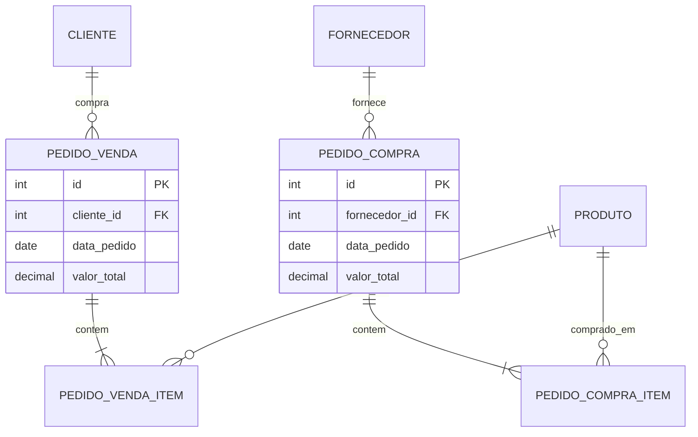
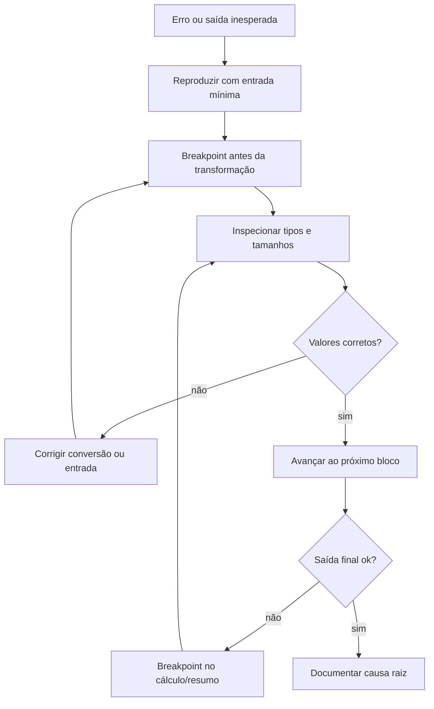

## Visão Geral do Conceito

Esta lição integra duas competências centrais para quem desenvolve sistemas de dados: **depurar código Python com rigor** e **decidir como normalizar o armazenamento relacional** quando o projeto evolui.

No exercício da loja **Volta Max** (liquidação com 10% de desconto), o objetivo não é apenas imprimir etiquetas promocionais. O foco pedagógico é usar o **debugger** para acompanhar cada transformação — entrada de textos, <mark style="background-color: #242424; padding: 2px 4px; border-radius: 3px; color: inherit;">`split()`</mark>, conversão para <mark style="background-color: #242424; padding: 2px 4px; border-radius: 3px; color: inherit;">`float`</mark>, montagem de listas paralelas e cálculo de economia total.

Na segunda metade, o projeto **e-commerce em Python + SQL** ilustra um cenário real de engenharia: ao implementar gestão de pedidos, a equipe percebeu que o modelo inicial (uma tabela genérica de pedidos com flags de entrada/saída) gerava complexidade desnecessária. A refatoração para **pedido de compra** e **pedido de venda** separados trouxe clareza — e também **custo**: views quebradas, consultas a reescrever e código a adaptar.

> **Regra:** Depuração e modelagem de dados não são etapas opcionais. São ferramentas de **solução de problemas**, independentemente da tecnologia ou ferramenta de IA disponível.

---

## Modelo Mental

### Debug: executar o programa aos olhos do interpretador

Imagine o interpretador Python como um operador que segue instruções **uma linha por vez**. Sem debugger, você só vê o resultado final — e fica na dúvida: "será que deu certo?". Com debugger, você **pausa** a execução, inspeciona variáveis e avança sob controle.

Analogia útil: manutenção de um sistema legado grande. Você não lê dez mil linhas de uma vez; isola um bloco (entrada → transformação → saída), coloca breakpoints e observa o que muda a cada passo — exatamente o que analistas fazem em produção quando investigam incidentes.

### Decomposição: problemas grandes viram blocos pequenos

A mesma lógica aparece na **arquitetura de microserviços**: cada serviço resolve uma responsabilidade (cadastrar produto, registrar fornecedor, processar venda). No código da aula, o exercício Volta Max foi dividido em blocos:

1. Ler nomes e preços.
2. Montar listas alinhadas por índice.
3. Gerar etiquetas promocionais.
4. Encontrar produto mais barato e mais caro.
5. Calcular economia total.

Cada bloco pode ser depurado isoladamente antes de integrar o fluxo completo.

### Normalização: organizar dados para refletir o negócio

Normalizar não é "fazer certo vs. errado". São **decisões de modelagem** com trade-offs:

| Modelo | Ideia central | Vantagem típica | Custo típico |
|--------|---------------|-----------------|--------------|
| **Tabela única** | Um registro de pedido com tipo (entrada/saída) e ID de cliente ou fornecedor | Menos JOINs em relatórios mistos | Regras condicionais no código e no SQL |
| **Tabelas separadas** | `pedido_compra` + itens / `pedido_venda` + itens | CRUD e código mais legíveis | JOIN extra ao cruzar compras e vendas |

Ambos podem estar corretos em produção; a escolha depende de requisitos, equipe e padrões do projeto.



---

## Mecânica Central

### 1. Entrada paralela: duas listas, um índice implícito

O exercício Volta Max recebe nomes e preços como textos separados por vírgula. Após <mark style="background-color: #242424; padding: 2px 4px; border-radius: 3px; color: inherit;">`split()`</mark>, existem duas listas independentes com **índices alinhados**: posição `0` em nomes corresponde à posição `0` em preços.

```python
entrada_nomes = input("Produtos (separados por vírgula): ")
entrada_precos = input("Preços (separados por vírgula): ")

nomes = [n.strip() for n in entrada_nomes.split(",")]
precos_texto = [p.strip() for p in entrada_precos.split(",")]
precos = [float(p) for p in precos_texto]
```

No debugger, após a conversão, observe: `precos_texto[0]` é <mark style="background-color: #242424; padding: 2px 4px; border-radius: 3px; color: inherit;">`str`</mark>; `precos[0]` é <mark style="background-color: #242424; padding: 2px 4px; border-radius: 3px; color: inherit;">`float`</mark>. Erros de cálculo promocional quase sempre nascem **antes** do loop, na conversão de tipo.

### 2. Gerar etiquetas: três abordagens equivalentes

**Abordagem A — `for` com `zip` e acumulador:**

```python
DESCONTO = 0.10
etiquetas = []

for nome, preco in zip(nomes, precos):
    preco_promo = preco * (1 - DESCONTO)
    linha = f"{nome} | Original: R$ {preco:.2f} | Promo: R$ {preco_promo:.2f}"
    etiquetas.append(linha)
```

**Abordagem B — `for` com `enumerate` (numeração a partir de 1):**

```python
etiquetas = []
for i, (nome, preco) in enumerate(zip(nomes, precos), start=1):
    preco_promo = preco * (1 - DESCONTO)
    item = f"{i:02d}"  # zero à esquerda: 01, 02, ..., 10
    linha = f"Item {item} | {nome} | R$ {preco_promo:.2f}"
    etiquetas.append(linha)
```

**Abordagem C — list comprehension (condensa o loop):**

```python
etiquetas = [
    f"Item {i:02d} | {nome} | R$ {preco * (1 - DESCONTO):.2f}"
    for i, (nome, preco) in enumerate(zip(nomes, precos), start=1)
]
```

> **Regra pedagógica da aula:** construa primeiro o `for` explícito, depois otimize para comprehension se a legibilidade permitir. A comprehension **não elimina** o loop — apenas o compacta em uma expressão.

### 3. Mínimo, máximo e recuperação do nome correspondente

```python
preco_min = min(precos)
preco_max = max(precos)

indice_mais_barato = precos.index(preco_min)
indice_mais_caro = precos.index(preco_max)

produto_mais_barato = nomes[indice_mais_barato]
produto_mais_caro = nomes[indice_mais_caro]

economia_total = sum(p * DESCONTO for p in precos)
```

Alternativa sem <mark style="background-color: #242424; padding: 2px 4px; border-radius: 3px; color: inherit;">`min()`</mark>/<mark style="background-color: #242424; padding: 2px 4px; border-radius: 3px; color: inherit;">`max()`</mark>: percorrer a lista comparando valores — útil quando o exercício proíbe funções built-in ou quando você precisa da lógica explícita para depuração.

### 4. Normalização no projeto e-commerce

O modelo **anterior** concentrava entradas e saídas:



O modelo **refatorado** separa fluxos de negócio:



**Impacto da mudança estrutural:**

- Consultas e **views** que apontavam para `pedido` antigo quebraram e precisaram ser recriadas.
- Código Python de gestão de pedidos foi reescrito — mas módulos similares (compras vs. vendas) puderam ser clonados e adaptados (<mark style="background-color: #242424; padding: 2px 4px; border-radius: 3px; color: inherit;">`Ctrl+C`</mark> / <mark style="background-color: #242424; padding: 2px 4px; border-radius: 3px; color: inherit;">`Ctrl+V`</mark> trocando fornecedor por cliente).
- **Backup** dos ambientes (dev, homologação, produção) antes da alteração preservou o modelo anterior para consulta.

### 5. Transações: `COMMIT` e `ROLLBACK`

Ao cadastrar fornecedores ou pedidos via cursor SQL em Python:

- <mark style="background-color: #242424; padding: 2px 4px; border-radius: 3px; color: inherit;">`commit()`</mark> persiste as alterações.
- <mark style="background-color: #242424; padding: 2px 4px; border-radius: 3px; color: inherit;">`rollback()`</mark> desfaz a transação e libera locks.
- Sem commit, dados ficam apenas na sessão — e podem bloquear tabelas.

---

## Uso Prático

### Cenário 1: depurar etiquetas da Volta Max

Fluxo típico no debugger (Mundo, VS Code ou PyCharm):

1. Breakpoint após leitura das entradas.
2. Avançar linha a linha após `split()` — confirmar listas com mesmo tamanho.
3. Breakpoint dentro do loop — verificar `preco_promo` item a item.
4. Breakpoint antes do resumo — conferir `preco_min`, índices e `economia_total`.

Saída esperada (exemplo):

```
Item 01 | Notebook | R$ 2880.00
Item 02 | Mouse | R$ 80.10
...
Produto mais barato: Mouse (R$ 89.00)
Produto mais caro: Notebook (R$ 3200.00)
Total economizado: R$ 478.89
```

### Cenário 2: gestão de pedidos no e-commerce

Menu implementado na aula:

| Opção | Ação |
|-------|------|
| Listar pedidos de compra | Resumo + detalhe por ID |
| Listar pedidos de venda | Mesma estrutura, tabela de venda |
| Cadastrar pedido de compra | Cabeçalho + loop de itens |
| Cadastrar pedido de venda | Réplica adaptada para cliente |
| Excluir pedidos | `DELETE` + `commit()` |

Padrão de cadastro de compra (simplificado):

```python
def cadastrar_pedido_compra(cursor, conexao):
    # 1. Listar fornecedores disponíveis
    cursor.execute("SELECT id, nome FROM fornecedores")
    for row in cursor.fetchall():
        print(row)

    fornecedor_id = int(input("ID do fornecedor: "))
    data_pedido = input("Data (texto livre na demo): ")
    valor_frete = float(input("Frete: "))
    valor_desconto = float(input("Desconto: "))

    cursor.execute(
        """
        INSERT INTO pedido_compra
            (fornecedor_id, data_pedido, valor_frete, valor_desconto, valor_total)
        VALUES (?, ?, ?, ?, ?)
        """,
        (fornecedor_id, data_pedido, valor_frete, valor_desconto, 0),
    )
    pedido_id = cursor.lastrowid

    while True:
        produto_id = input("ID produto (0 para encerrar): ")
        if produto_id == "0":
            break
        quantidade = int(input("Quantidade: "))
        valor_unitario = float(input("Valor unitário: "))
        subtotal = quantidade * valor_unitario
        cursor.execute(
            """
            INSERT INTO pedido_compra_item
                (pedido_id, produto_id, quantidade, valor_unitario, subtotal)
            VALUES (?, ?, ?, ?, ?)
            """,
            (pedido_id, int(produto_id), quantidade, valor_unitario, subtotal),
        )

    conexao.commit()
    print(f"Pedido de compra {pedido_id} registrado.")
```

### Cenário 3: replicar módulo com segurança

Ao criar `cadastro_fornecedores` a partir de `cadastro_fabricantes`:

1. Copiar arquivo e renomear referências (`fabricante` → `fornecedor`).
2. Ajustar SQL (`INSERT`, `SELECT`, `UPDATE`, `DELETE`).
3. Testar listagem → cadastro → atualização → exclusão.
4. Só então integrar ao menu principal via <mark style="background-color: #242424; padding: 2px 4px; border-radius: 3px; color: inherit;">`import`</mark>.

Esse padrão acelera desenvolvimento, mas exige atenção: strings e nomes de tabela incorretos geram bugs silenciosos até o primeiro teste.

---

## Erros Comuns

**Esquecer que `input()` retorna string.** Preços concatenados em vez de somados (`"100" + "50"` → `"10050"`) ou comparações lexicográficas erradas. Correção: <mark style="background-color: #242424; padding: 2px 4px; border-radius: 3px; color: inherit;">`float()`</mark> antes de operar.

**Listas com tamanhos diferentes após `split()`.** Um nome a mais ou vírgula extra desalinha índices no <mark style="background-color: #242424; padding: 2px 4px; border-radius: 3px; color: inherit;">`zip()`</mark>. Valide `len(nomes) == len(precos)` antes do loop.

**Confundir índice com numeração de etiqueta.** <mark style="background-color: #242424; padding: 2px 4px; border-radius: 3px; color: inherit;">`enumerate(..., start=1)`</mark> numera a partir de 1; índice de lista continua base 0 para acessar `nomes[i]`.

**Usar `min()`/`max()` e assumir nome sem buscar índice.** O valor mínimo não traz o nome automaticamente — use <mark style="background-color: #242424; padding: 2px 4px; border-radius: 3px; color: inherit;">`precos.index(preco_min)`</mark> e então `nomes[indice]`.

**DELETE de pedido sem apagar itens (bug real do projeto).** Excluir só o cabeçalho deixa registros órfãos em `pedido_compra_item`. Solução: excluir itens primeiro ou usar `ON DELETE CASCADE` na FK.

**Alterar schema sem backup.** Views, relatórios e código quebram em cascata. Sempre snapshot/backup antes de normalização estrutural.

**Esquecer `commit()` após DML.** Dados aparentemente "sumidos" na próxima consulta — na verdade nunca foram persistidos.

**Confiar em IA com dados de produção.** Regras de negócio específicas e dados corporativos não devem ir para ferramentas externas; depuração manual continua indispensável em incidentes reais.

---

## Visão Geral de Debugging

### Python: roteiro sistemático



**Checklist rápido:**

1. A exceção ocorre em qual linha? Leia a mensagem completa (`ValueError`, `IndexError`, etc.).
2. Quais variáveis existiam no breakpoint anterior?
3. O tipo é o esperado? (`type(variavel)`)
4. Listas têm o mesmo comprimento?
5. O loop executou quantas vezes? (watch de contador)

### Banco de dados: quando a refatoração "quebra tudo"

1. Identifique **objetos dependentes**: views, procedures, scripts Python com SQL embutido.
2. Execute consultas antigas — anote erros de coluna/tabela inexistente.
3. Priorize recriar views de negócio críticas antes de features novas.
4. Teste transacional: insert de pedido + itens + listagem + delete completo.

<details>
<summary>Ver exemplo de diagnóstico: delete incompleto</summary>

Sintoma: pedido some da listagem principal, mas soma de itens órfãos infla relatórios.

Diagnóstico:
```sql
SELECT COUNT(*) FROM pedido_compra_item pci
LEFT JOIN pedido_compra pc ON pc.id = pci.pedido_id
WHERE pc.id IS NULL;
```

Correção típica:
```sql
DELETE FROM pedido_compra_item WHERE pedido_id = ?;
DELETE FROM pedido_compra WHERE id = ?;
-- ou transação com ambos + commit
```

</details>

---

## Principais Pontos

- Debug passo a passo elimina incerteza ("será que funcionou?") e acelera entendimento de código legado.
- Problemas grandes devem ser divididos em blocos testáveis — mesma filosofia de microserviços e de funções/módulos Python.
- Listas paralelas se conectam por **índice**; <mark style="background-color: #242424; padding: 2px 4px; border-radius: 3px; color: inherit;">`zip()`</mark> e <mark style="background-color: #242424; padding: 2px 4px; border-radius: 3px; color: inherit;">`enumerate()`</mark> tornam essa relação explícita.
- List comprehension é açúcar sintático sobre um `for`; construa o loop explícito antes de compactar.
- Normalização envolve trade-offs: clareza estrutural vs. custo de JOINs analíticos.
- Mudança de schema tem **custo em tempo**: views, consultas, testes e código dependente.
- Sempre faça **backup** antes de refatoração estrutural.
- `commit()` persiste; `rollback()` desfaz — transações incompletas bloqueiam e enganam testes.
- Mercado valoriza **solucionadores de problemas**, não apenas sintaxe de ferramentas.

---

## Preparação para Prática

Ao concluir esta lição, você deve conseguir:

- Executar um script Python no debugger, avançando linha a linha e interpretando variáveis intermediárias.
- Implementar geração de etiquetas promocionais com `for`/`zip` ou list comprehension, incluindo formatação numérica.
- Calcular produto mais barato/carro e economia total usando índices ou loops explícitos.
- Desenhar mentalmente (ou em diagrama) a diferença entre modelo de pedido único e pedidos separados.
- Explicar por que excluir um pedido sem excluir itens é um bug de integridade referencial.
- Descrever o fluxo básico de cadastro de pedido com cabeçalho + itens + `commit()`.

---

## Laboratório de Prática

### Easy — Validar entrada de preços antes do processamento

Um script de liquidação recebe preços como texto separado por vírgula. Complete a validação para garantir que todos os tokens são numéricos antes de converter para <mark style="background-color: #242424; padding: 2px 4px; border-radius: 3px; color: inherit;">`float`</mark>.

```python
def validar_precos(entrada: str) -> list[float]:
    tokens = [t.strip() for t in entrada.split(",") if t.strip()]
    precos = []
    for token in tokens:
        # TODO: verificar se token é numérico (use isnumeric ou try/except)
        # TODO: converter para float e adicionar à lista precos
        pass
    return precos


entrada = "3200, 89.90, abc, 150"
resultado = validar_precos(entrada)
print(resultado)  # esperado: apenas valores válidos ou lista vazia conforme sua regra
```

---

### Medium — Montar etiquetas promocionais com enumerate

Complete a função que gera etiquetas numeradas (01, 02, …) aplicando desconto de 10%.

```python
DESCONTO = 0.10

def gerar_etiquetas(nomes: list[str], precos: list[float]) -> list[str]:
    etiquetas = []
    # TODO: validar que len(nomes) == len(precos)
    # TODO: usar enumerate(zip(nomes, precos), start=1) para montar cada linha
    # Formato: "Item 01 | Notebook | Original: R$ 3200.00 | Promo: R$ 2880.00"
    return etiquetas


nomes = ["Notebook", "Mouse", "Teclado"]
precos = [3200.0, 89.90, 450.0]
for linha in gerar_etiquetas(nomes, precos):
    print(linha)
```

---

### Hard — Exclusão transacional de pedido e itens

Simule a correção do bug da aula: ao excluir um pedido de compra, remova primeiro os itens e só então o cabeçalho. Use lista em memória como "banco".

```python
pedidos_compra = {1: {"fornecedor_id": 2, "valor_total": 200.0}}
itens_compra = [
    {"pedido_id": 1, "produto_id": 3, "quantidade": 10, "subtotal": 200.0},
    {"pedido_id": 2, "produto_id": 5, "quantidade": 1, "subtotal": 50.0},
]


def excluir_pedido_compra(pedido_id: int) -> bool:
    if pedido_id not in pedidos_compra:
        return False

    global itens_compra
    # TODO: filtrar itens_compra removendo todos com pedido_id informado
    # TODO: remover pedido_id de pedidos_compra
    # TODO: retornar True se exclusão completa ocorreu
    return False


ok = excluir_pedido_compra(1)
print("Sucesso:", ok)
print("Pedidos restantes:", pedidos_compra)
print("Itens restantes:", itens_compra)
# Esperado: pedido 1 e seu item removidos; pedido/item 2 intactos
```

---

<!-- CONCEPT_EXTRACTION
concepts:
  - debug passo a passo
  - zip e enumerate
  - list comprehension
  - formatação f-string
  - min max e index
  - decomposição de problemas
  - normalização relacional
  - pedido compra vs pedido venda
  - integridade referencial
  - commit e rollback
  - custo de refatoração
skills:
  - Depurar scripts Python com breakpoints e inspeção de variáveis
  - Combinar listas paralelas com zip e enumerate
  - Gerar etiquetas promocionais com formatação numérica
  - Calcular agregados e localizar produtos por índice
  - Comparar modelos de normalização e identificar trade-offs
  - Implementar exclusão transacional de cabeçalho e itens
  - Reconhecer impacto de mudanças de schema em views e código
examples:
  - volta-max-etiquetas-promocionais
  - debugger-listas-precos-float
  - normalizacao-pedido-unico-vs-separado
  - gestao-pedidos-crud-ecommerce
  - delete-pedido-com-itens-orfaos
-->

<!-- EXERCISES_JSON
[
  {
    "id": "validar-entrada-precos-liquidação",
    "slug": "validar-entrada-precos-liquidacao",
    "difficulty": "easy",
    "title": "Validar entrada de preços",
    "discipline": "projeto-bloco-fundamentos-processamento-dados",
    "editorLanguage": "python",
    "tags": ["python", "validacao", "debug", "entrada-dados"],
    "summary": "Validar tokens numéricos antes de converter preços de liquidação para float."
  },
  {
    "id": "gerar-etiquetas-enumerate-desconto",
    "slug": "gerar-etiquetas-enumerate-desconto",
    "difficulty": "medium",
    "title": "Etiquetas promocionais com enumerate",
    "discipline": "projeto-bloco-fundamentos-processamento-dados",
    "editorLanguage": "python",
    "tags": ["python", "zip", "enumerate", "list-comprehension", "formatacao"],
    "summary": "Montar etiquetas numeradas aplicando desconto de 10% sobre lista de preços."
  },
  {
    "id": "exclusao-transacional-pedido-itens",
    "slug": "exclusao-transacional-pedido-itens",
    "difficulty": "hard",
    "title": "Exclusão transacional de pedido e itens",
    "discipline": "projeto-bloco-fundamentos-processamento-dados",
    "editorLanguage": "python",
    "tags": ["python", "integridade-referencial", "transacao", "refatoracao"],
    "summary": "Corrigir bug de delete removendo itens antes do cabeçalho do pedido de compra."
  }
]
-->

```json
LESSONS_JSON_HINT
{
  "discipline": "projeto-bloco-fundamentos-processamento-dados",
  "slug": "debug-python-normalizacao-ecommerce",
  "title": "Debug em Python e normalização de dados no e-commerce",
  "order": 17,
  "file": "debug-python-normalizacao-ecommerce.md"
}
```
