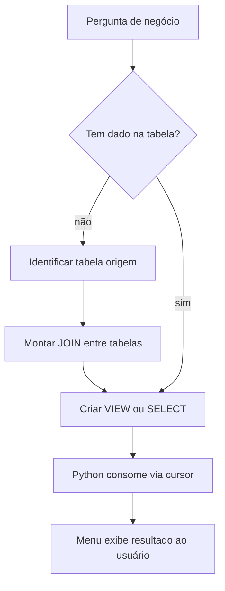
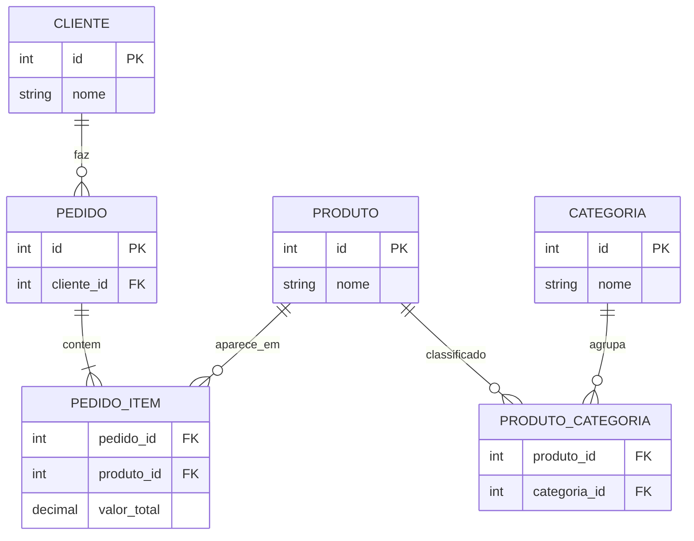
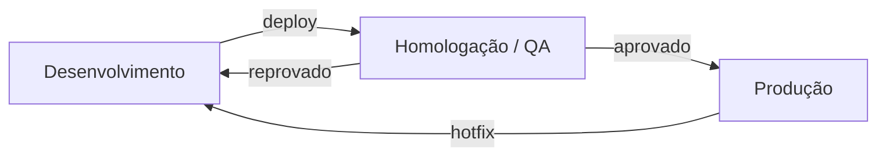

## Visão Geral do Conceito

Um sistema de e-commerce real precisa responder a dois tipos de demanda ao mesmo tempo: **registrar transações** (pedidos, estoque, pagamentos) e **entregar respostas analíticas** (faturamento por categoria, clientes com maior volume). A aula 15 consolida como esses dois mundos se organizam no banco relacional e como o código Python se estrutura para operar sobre eles.

No lado SQL, você revisita modelagem transacional (1:1, 1:N, N:N), chaves primárias e estrangeiras, consultas com <mark style="background-color: #242424; padding: 2px 4px; border-radius: 3px; color: inherit;">`JOIN`</mark> e <mark style="background-color: #242424; padding: 2px 4px; border-radius: 3px; color: inherit;">`VIEW`</mark>s. No lado Python, você monta um projeto modular: menu principal, arquivos separados por domínio (categorias, clientes), funções com <mark style="background-color: #242424; padding: 2px 4px; border-radius: 3px; color: inherit;">`def`</mark>, importação de bibliotecas (<mark style="background-color: #242424; padding: 2px 4px; border-radius: 3px; color: inherit;">`os`</mark>, <mark style="background-color: #242424; padding: 2px 4px; border-radius: 3px; color: inherit;">`sqlite3`</mark>) e operações CRUD conectadas ao mesmo banco SQLite.

> **Regra:** Toda consulta analítica começa com uma pergunta de negócio. Só depois você mapeia em quais tabelas estão os dados e quais JOINs são necessários.

---

## Modelo Mental

Pense no projeto em **três camadas empilhadas**:

1. **Armazenamento estruturado** — tabelas normalizadas no SQLite (`cliente`, `pedido`, `pedido_item`, `produto`, `categoria`, `produto_categoria`).
2. **Camada de visualização** — VIEWs SQL que já respondem perguntas prontas (`vw_categoria_faturamento`).
3. **Aplicação Python** — menus e módulos CRUD que leem/escrevem nas tabelas via <mark style="background-color: #242424; padding: 2px 4px; border-radius: 3px; color: inherit;">`cursor.execute()`</mark>.

Paralelamente, pense nos **ambientes de execução** como cópias independentes do mesmo sistema:

- **Desenvolvimento (Dev):** você quebra, recria, testa scripts DDL e INSERT sem medo.
- **Homologação (Homolog/QA):** alguém valida se o que você fez está correto antes de liberar.
- **Produção (Prod):** usuários reais consomem; erro aqui tem impacto direto.



No Python, o menu principal funciona como **central de tráfego**: abre a conexão uma vez, recebe a opção do usuário e delega para o arquivo correto (`cadastro_categorias.py`, `cadastro_clientes.py`).

---

## Mecânica Central

### Transacional, relacional e estruturado

O banco do e-commerce é **transacional** porque registra operações de negócio com integridade (compra, item, estoque). É **relacional** porque entidades se conectam por chaves. É **estruturado** porque cada coluna tem tipo e significado definidos no DDL.

Dados **não estruturados** (imagens, vídeos, JSON bruto de redes sociais) não seguem esse esquema fixo. Eles coexistem no ecossistema de dados moderno, mas o SQLite do projeto trabalha no modelo estruturado.

### Relacionamentos e a tabela de ligação

| Cardinalidade | Como modelar | Exemplo no e-commerce |
|---------------|--------------|------------------------|
| 1:1 | FK opcional ou mesma PK | Cliente ↔ endereço principal (depende do desenho) |
| 1:N | FK na tabela "N" | Cliente → pedidos |
| N:N | **Tabela de ligação** | Produto ↔ categoria via `produto_categoria` |

> **Regra:** Em N:N, a tabela intermediária guarda pares `(produto_id, categoria_id)` — nunca tente "empurrar" múltiplos valores numa única coluna.



### Chave primária e estrangeira

- **Chave primária (<mark style="background-color: #242424; padding: 2px 4px; border-radius: 3px; color: inherit;">`PRIMARY KEY`</mark>):** identifica unicamente cada linha da tabela.
- **Chave estrangeira (<mark style="background-color: #242424; padding: 2px 4px; border-radius: 3px; color: inherit;">`FOREIGN KEY`</mark>):** aponta para a PK de outra tabela, validando que o relacionamento é legítimo.

Sem esse par de chaves, o SGBD não garante integridade referencial.

### Transacional vs analítico

No **modelo transacional**, você normaliza para evitar redundância e manter integridade — mesmo que isso exija JOINs na aplicação.

No **modelo analítico**, você **reduz JOINs** propositalmente, agrupando colunas repetidas numa "tabelona" para acelerar relatórios. Cada JOIN consome CPU e I/O: o banco precisa cruzar tabelas, validar chaves e montar o resultado.

A pergunta "qual o faturamento por categoria?" ilustra o caminho transacional:

1. `pedido_item` tem `valor_total` e `produto_id`.
2. `produto_categoria` liga produto à categoria.
3. `categoria` traz o nome legível.
4. Um `JOIN` + `SUM()` agrega o faturamento.

```sql
SELECT
    c.nome AS categoria,
    SUM(pi.valor_total) AS faturamento
FROM pedido_item pi
JOIN produto_categoria pc ON pc.produto_id = pi.produto_id
JOIN categoria c ON c.id = pc.categoria_id
GROUP BY c.nome
ORDER BY faturamento DESC;
```

### VIEW: camada de visualização

Uma <mark style="background-color: #242424; padding: 2px 4px; border-radius: 3px; color: inherit;">`VIEW`</mark> armazena apenas a **definição** do SELECT, não os dados. Toda consulta à view reexecuta a lógica sobre as tabelas base.

Vantagens:

- Nome semântico (`vw_categoria_faturamento` responde "o quê" antes de "como").
- Reutilização por Python, BI ou outras ferramentas.
- Encapsula JOINs complexos do restante do sistema.

```sql
CREATE VIEW vw_categoria_faturamento AS
SELECT
    c.nome AS categoria,
    SUM(pi.valor_total) AS faturamento
FROM pedido_item pi
JOIN produto_categoria pc ON pc.produto_id = pi.produto_id
JOIN categoria c ON c.id = pc.categoria_id
GROUP BY c.nome;
```

Depois, a aplicação consulta de forma simples:

```sql
SELECT * FROM vw_categoria_faturamento;
```

### Scripts como infraestrutura do banco

O projeto separa a criação do ambiente em scripts SQL reexecutáveis:

1. **DDL** — `CREATE TABLE`, constraints, FKs.
2. **Carga inicial** — `INSERT` com dados fictícios para teste.
3. **Camada de visualização** — `CREATE VIEW`.

Essa abordagem espelha o conceito de **infraestrutura como código**: executar os scripts recria o banco inteiro em outra máquina ou ambiente (Dev, Homolog) sem cliques manuais.

### Ambientes: Dev → Homolog → Produção



| Ambiente | Propósito | Quem mexe | Risco |
|----------|-----------|-----------|-------|
| Dev | Codar, quebrar, recriar schema | Desenvolvedor | Baixo |
| Homolog | Testes funcionais e regressão | QA / time | Médio |
| Produção | Usuários finais | Deploy controlado | Alto |

Mesmo num projeto acadêmico local, você pode simular: `database/dev/ecommerce.db` vs `database/prod/ecommerce.db`.

### Estrutura modular do Python

Organização típica do projeto apresentado na aula:

```
projeto_ecommerce/
├── scripts/
│   ├── 01_create_tables.sql
│   ├── 02_insert_dados.sql
│   └── 03_create_views.sql
├── database/
│   └── ecommerce.db
├── menu_sistema.py
├── cadastro_categorias.py
└── cadastro_clientes.py
```

**Menu principal (`menu_sistema.py`):**

- Loop <mark style="background-color: #242424; padding: 2px 4px; border-radius: 3px; color: inherit;">`while True`</mark> com <mark style="background-color: #242424; padding: 2px 4px; border-radius: 3px; color: inherit;">`input()`</mark>.
- Abre conexão SQLite e cria <mark style="background-color: #242424; padding: 2px 4px; border-radius: 3px; color: inherit;">`cursor`</mark>.
- Delega cada opção para módulo externo.

**Módulo de domínio (`cadastro_categorias.py`):**

- Define <mark style="background-color: #242424; padding: 2px 4px; border-radius: 3px; color: inherit;">`main(con, cursor)`</mark> como ponto de entrada.
- Implementa sub-menu CRUD: listar, inserir, atualizar, excluir.

**Função utilitária `clean()`:**

```python
import os

def clean():
    os.system("cls" if os.name == "nt" else "clear")
```

- <mark style="background-color: #242424; padding: 2px 4px; border-radius: 3px; color: inherit;">`import os`</mark> traz funções do sistema operacional.
- <mark style="background-color: #242424; padding: 2px 4px; border-radius: 3px; color: inherit;">`os.name == "nt"`</mark> detecta Windows; Linux/macOS usam `clear`.

**Conexão SQLite no menu:**

```python
import sqlite3

con = sqlite3.connect("database/ecommerce.db")
cursor = con.cursor()
```

Ao chamar o módulo de categorias, o menu repassa `con` e `cursor` — todos os CRUDs compartilham a mesma conexão.

---

## Uso Prático

### Montando a consulta de faturamento (raciocínio passo a passo)

Pergunta: *"Quanto faturamos por categoria?"*

1. Valor monetário está em `pedido_item.valor_total`.
2. Categoria não está em `pedido_item` — precisa cruzar via `produto_id`.
3. Tabela ponte: `produto_categoria`.
4. Nome legível: `categoria.nome`.

```sql
-- Passo 1: inspecionar origem do valor
SELECT pedido_id, produto_id, quantidade, valor_total
FROM pedido_item
LIMIT 5;

-- Passo 2: cruzar com categoria
SELECT c.nome, pi.valor_total
FROM pedido_item pi
JOIN produto_categoria pc ON pc.produto_id = pi.produto_id
JOIN categoria c ON c.id = pc.categoria_id;
```

### CRUD de categorias via Python

Listagem:

```python
def listar_categorias(cursor):
    cursor.execute("SELECT id, nome, descricao FROM categoria ORDER BY nome")
    rows = cursor.fetchall()
    for row in rows:
        print(f"{row[0]} | {row[1]} | {row[2]}")
```

Inserção:

```python
def inserir_categoria(cursor, con, nome, descricao):
    cursor.execute(
        "INSERT INTO categoria (nome, descricao) VALUES (?, ?)",
        (nome, descricao),
    )
    con.commit()
```

O padrão se repete para UPDATE e DELETE — sempre <mark style="background-color: #242424; padding: 2px 4px; border-radius: 3px; color: inherit;">`cursor.execute()`</mark> + <mark style="background-color: #242424; padding: 2px 4px; border-radius: 3px; color: inherit;">`con.commit()`</mark> em operações de escrita.

### Executando o menu

No terminal, dentro da pasta do projeto:

```bash
python menu_sistema.py
```

Fluxo do usuário:

1. Menu principal exibe opções 1–8 + 0 (sair).
2. Opção 1 → limpa tela → chama `cadastro_categorias.main(con, cursor)`.
3. Sub-menu CRUD opera sobre a tabela `categoria`.
4. Opção 0 → `break` encerra o loop.

### Recriando o banco em outro ambiente

```bash
sqlite3 database/ecommerce.db < scripts/01_create_tables.sql
sqlite3 database/ecommerce.db < scripts/02_insert_dados.sql
sqlite3 database/ecommerce.db < scripts/03_create_views.sql
```

Isso garante que colegas de equipe ou o ambiente de homologação partam do **mesmo schema e mesma carga de teste**.

---

## Erros Comuns

**Consultar `categoria` esperando valores de faturamento.** A tabela de dimensão guarda metadados (`nome`, `descricao`), não vendas. O valor está em `pedido_item` e exige JOIN.

**Esquecer a tabela de ligação em N:N.** Tentar JOIN direto `produto` ↔ `categoria` sem `produto_categoria` produz resultado errado ou cartesiano.

**Não dar `commit()` após INSERT/UPDATE/DELETE.** Sem commit, a transação pode ser revertida ao fechar a conexão e o dado "some".

**Abrir uma conexão SQLite por módulo.** Funciona em demo, mas dificulta controle de transação e pode gerar lock no arquivo `.db`. Centralize no menu.

**Copiar código de produção direto para Dev sem versionar scripts.** Quando o schema diverge, o Python quebra com "no such column". Scripts SQL versionados evitam drift.

**Assumir que VIEW guarda snapshot.** VIEW sempre reflete o estado atual das tabelas base; se alguém deleta um `pedido_item`, o faturamento na view muda imediatamente.

**Usar `os.system("cls")` em IDE com console integrado.** Alguns consoles de IDE não limpam como terminal nativo — comportamento esperado, não bug do Python.

---

## Visão Geral de Debugging

Quando uma consulta ou CRUD falha, siga esta ordem:

1. **Reproduza no SQLite CLI ou DB Browser** — execute o SQL isolado antes de culpar o Python.
2. **Verifique schema** — `\tables` ou `SELECT name FROM sqlite_master WHERE type='table'`.
3. **Confirme FKs** — INSERT rejeitado geralmente indica FK inválida ou NOT NULL violado.
4. **Inspecione parâmetros** — placeholders `?` na ordem errada causam dados trocados silenciosamente.
5. **Trace o caminho do menu** — a opção escolhida realmente chama o módulo certo? Há `clean()` limpando output útil?
6. **Compare ambientes** — o `.db` de Dev tem as mesmas views que o script `03_create_views.sql`?

<details>
<summary>Ver checklist rápido para erro "no such table"</summary>

1. O arquivo `.db` apontado em `sqlite3.connect()` existe?
2. Os scripts DDL foram executados neste arquivo específico?
3. O caminho relativo está correto conforme a pasta de onde você roda `python menu_sistema.py`?

</details>

---

## Principais Pontos

- Banco transacional normaliza e usa JOINs; modelo analítico sacrifica normalização para reduzir JOINs e acelerar relatórios.
- Relacionamento N:N **sempre** passa por tabela de ligação.
- PK identifica a linha; FK valida o relacionamento entre tabelas.
- VIEW encapsula consulta complexa com nome de negócio — não armazena dados, só a definição.
- Ambientes Dev / Homolog / Prod organizam risco e ciclo de qualidade.
- Scripts SQL reexecutáveis recriam schema, carga e views — padrão próximo a infraestrutura como código.
- Python modular: menu concentra conexão; cada domínio tem arquivo com `main(con, cursor)`.
- `def`, `import os`, `import sqlite3` e CRUD formam a base do sistema console do e-commerce.

---

## Preparação para Prática

Antes do Laboratório, você deve conseguir:

- Desenhar um `erDiagram` com PK/FK para cliente, pedido, item e categoria.
- Escrever um SELECT com JOIN que agrega faturamento por categoria.
- Explicar por que a VIEW `vw_categoria_faturamento` simplifica o consumo pelo Python.
- Descrever o fluxo Dev → Homolog → Prod e quando o ciclo volta para Dev.
- Estruturar um menu `while True` que importa e chama `main()` de outro arquivo passando `con` e `cursor`.
- Implementar listagem e inserção SQLite com `fetchall()` e `commit()`.

---

## Laboratório de Prática

### Easy — Listar categorias do banco

Complete a função que executa o SELECT e exibe cada linha. O código deve rodar sem erro mesmo com a função incompleta (retorno placeholder).

```python
import sqlite3

def listar_categorias(db_path: str) -> list[tuple]:
    con = sqlite3.connect(db_path)
    cursor = con.cursor()
    # TODO: executar SELECT id, nome, descricao FROM categoria ORDER BY nome
    # TODO: armazenar resultado em variável rows com fetchall()
    rows = []
    con.close()
    return rows

if __name__ == "__main__":
    categorias = listar_categorias("database/ecommerce.db")
    for cat in categorias:
        print(cat)
```

---

### Medium — Montar consulta de faturamento por categoria

Complete a query que cruza `pedido_item`, `produto_categoria` e `categoria`, retornando nome da categoria e soma de `valor_total`.

```sql
-- TODO: completar JOINs e GROUP BY
SELECT
    c.nome AS categoria,
    SUM(pi.valor_total) AS faturamento
FROM pedido_item pi
-- TODO: JOIN produto_categoria pc ON ...
-- TODO: JOIN categoria c ON ...
GROUP BY c.nome
ORDER BY faturamento DESC;
```

---

### Hard — Função de inserção com validação e commit

Implemente a inserção segura: rejeite nome vazio, execute INSERT parametrizado e confirme a transação. Simule o fluxo de cadastro do módulo de categorias.

```python
import sqlite3

def inserir_categoria(db_path: str, nome: str, descricao: str) -> bool:
    if not nome or not nome.strip():
        print("Erro: nome da categoria é obrigatório.")
        return False

    con = sqlite3.connect(db_path)
    cursor = con.cursor()
    try:
        # TODO: executar INSERT INTO categoria (nome, descricao) VALUES (?, ?)
        # TODO: chamar con.commit() após sucesso
        return True
    except sqlite3.Error as exc:
        print(f"Erro SQL: {exc}")
        con.rollback()
        return False
    finally:
        con.close()

if __name__ == "__main__":
    ok = inserir_categoria("database/ecommerce.db", "", "desc inválida")
    print("ok:", ok)  # deve ser False
    ok = inserir_categoria("database/ecommerce.db", "Periféricos", "Teclados e mouses")
    print("ok:", ok)  # deve ser True após implementar
```

---

<!-- CONCEPT_EXTRACTION
concepts:
  - banco transacional vs analítico
  - dados estruturados vs não estruturados
  - chave primária
  - chave estrangeira
  - relacionamento N para N
  - JOIN
  - VIEW
  - ambientes dev homologação produção
  - scripts SQL como infraestrutura
  - estrutura modular Python
  - def e main()
  - import os
  - import sqlite3
  - CRUD
skills:
  - Diferenciar modelagem transacional e analítica
  - Desenhar relacionamentos com tabela de ligação N:N
  - Montar consultas SQL com JOIN e agregação
  - Criar VIEWs semânticas para perguntas de negócio
  - Descrever ciclo Dev → Homolog → Produção
  - Organizar projeto Python em múltiplos módulos
  - Centralizar conexão SQLite e repassar cursor
  - Implementar operações CRUD com commit e rollback
examples:
  - erDiagram-ecommerce-pedido-categoria
  - select-faturamento-por-categoria-com-join
  - view-vw-categoria-faturamento
  - menu-while-com-delegacao-modular
  - funcao-clean-com-os-system
  - crud-categoria-sqlite-python
-->

<!-- EXERCISES_JSON
[
  {
    "id": "listar-categorias-sqlite",
    "slug": "listar-categorias-sqlite",
    "difficulty": "easy",
    "title": "Listar categorias do banco",
    "discipline": "projeto-bloco-fundamentos-processamento-dados",
    "editorLanguage": "python",
    "tags": ["python", "sqlite3", "select", "crud"],
    "summary": "Completar SELECT e fetchall para listar categorias ordenadas por nome."
  },
  {
    "id": "join-faturamento-categoria",
    "slug": "join-faturamento-categoria",
    "difficulty": "medium",
    "title": "Faturamento por categoria com JOIN",
    "discipline": "projeto-bloco-fundamentos-processamento-dados",
    "editorLanguage": "sql",
    "tags": ["sql", "join", "group-by", "agregacao"],
    "summary": "Completar JOINs e GROUP BY para calcular faturamento total por categoria."
  },
  {
    "id": "inserir-categoria-validacao-commit",
    "slug": "inserir-categoria-validacao-commit",
    "difficulty": "hard",
    "title": "Inserir categoria com validação e commit",
    "discipline": "projeto-bloco-fundamentos-processamento-dados",
    "editorLanguage": "python",
    "tags": ["python", "sqlite3", "insert", "validacao", "transacao"],
    "summary": "Implementar INSERT parametrizado com validação de nome, commit e rollback."
  }
]
-->
