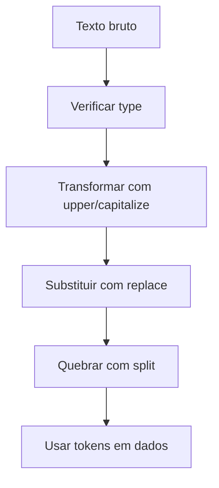

## Visão Geral do Conceito

A primeira aula situa a disciplina como continuação da introdução à programação em Python. O professor apresenta que o curso aprofundará coleções, manipulação de arquivos, tratamento de erros e bibliotecas, mas começa revisando strings como base para processar texto.

> **Ideia central:** strings são a porta de entrada para muitos dados reais, porque arquivos, entradas, logs e documentos chegam como texto antes de virarem análise.

**Não coberto no material:** a aula menciona arquivos, JSON, erros e bibliotecas como conteúdos futuros, mas ainda não ensina essas APIs nesta sessão.

## Modelo Mental

Pense em uma string como uma cadeia ordenada de caracteres. Em processamento de dados, você transforma essa cadeia: verifica tipo, troca trechos, quebra em partes e monta mensagens de saída.



## Mecânica Central

A aula revisa declaração de strings, concatenação com <mark style="background-color: #242424; padding: 2px 4px; border-radius: 3px; color: inherit;">`+`</mark>, repetição com <mark style="background-color: #242424; padding: 2px 4px; border-radius: 3px; color: inherit;">`*`</mark>, verificação com <mark style="background-color: #242424; padding: 2px 4px; border-radius: 3px; color: inherit;">`type()`</mark> e medição com <mark style="background-color: #242424; padding: 2px 4px; border-radius: 3px; color: inherit;">`len()`</mark>.

```python
nome = "Python"
area = "dados"
mensagem = nome + " para " + area
repetida = nome * 3

print(mensagem)
print(repetida)
print(type(nome))
print(len(mensagem))
```

Métodos citados: <mark style="background-color: #242424; padding: 2px 4px; border-radius: 3px; color: inherit;">`upper()`</mark>, <mark style="background-color: #242424; padding: 2px 4px; border-radius: 3px; color: inherit;">`capitalize()`</mark>, <mark style="background-color: #242424; padding: 2px 4px; border-radius: 3px; color: inherit;">`replace()`</mark> e <mark style="background-color: #242424; padding: 2px 4px; border-radius: 3px; color: inherit;">`split()`</mark>.

## Uso Prático

```python
linha = "  Copom;Inflacao;Juros  "
linha = linha.replace(";", " ").capitalize()
partes = linha.split()

print(partes)
print(f"Quantidade de partes: {len(partes)}")
```

Esse exemplo segue a direção da aula: transformar uma linha textual em partes manipuláveis.

## Erros Comuns

- Concatenar string com número sem converter gera <mark style="background-color: #242424; padding: 2px 4px; border-radius: 3px; color: inherit;">`TypeError`</mark>; use f-string quando houver variáveis.
- Achar que <mark style="background-color: #242424; padding: 2px 4px; border-radius: 3px; color: inherit;">`capitalize()`</mark> altera cada palavra; a aula corrige que ele atua no primeiro caractere da string.
- Esquecer que <mark style="background-color: #242424; padding: 2px 4px; border-radius: 3px; color: inherit;">`split()`</mark> retorna lista, não string.

## Visão Geral de Debugging

1. Verifique o tipo com <mark style="background-color: #242424; padding: 2px 4px; border-radius: 3px; color: inherit;">`type(valor)`</mark>.
2. Imprima antes e depois de cada transformação.
3. Use <mark style="background-color: #242424; padding: 2px 4px; border-radius: 3px; color: inherit;">`len()`</mark> para conferir tamanho.
4. Se a saída virou lista, revise onde <mark style="background-color: #242424; padding: 2px 4px; border-radius: 3px; color: inherit;">`split()`</mark> foi chamado.

## Principais Pontos

- Strings são cadeias de caracteres.
- A disciplina aprofunda Python para dados, arquivos, erros e bibliotecas.
- Métodos de string preparam texto para processamento.
- F-strings tornam mensagens com variáveis mais legíveis.

## Preparação para Prática

Pratique criar strings, transformar conteúdo, substituir trechos, quebrar texto em partes e montar mensagens formatadas.

## Laboratório de Prática

### Easy — Normalizar uma linha de log

Transforme uma linha textual simples em partes analisáveis.

```python
linha = "  ERRO;Pipeline;Arquivo ausente  "

# TODO: substituir ponto e virgula por espaco
# TODO: transformar a linha para caixa baixa
# TODO: quebrar a linha em partes
partes = []

print(partes)
```

Critérios:

- usar replace

- usar lower

- usar split


### Medium — Mensagem de status com f-string

Monte uma mensagem de status usando variáveis.

```python
arquivo = "dados.txt"
linhas = 128
status = "processado"

# TODO: montar mensagem com f-string
mensagem = ""

print(mensagem)
```

Critérios:

- usar f-string

- incluir as três variáveis


### Hard — Preparar texto para tokenização simples

Normalize pontuação e gere tokens.

```python
texto = "Copom, inflacao e juros. Copom acompanha o cenario."

# TODO: caixa baixa
# TODO: remover virgula e ponto
# TODO: gerar tokens com split
tokens = []

print(tokens)
```

Critérios:

- normalizar caixa

- remover pontuação citada

- retornar lista de tokens


<!-- CONCEPT_EXTRACTION
concepts:
  - strings
  - concatenação
  - repetição de strings
  - métodos de string
  - split
  - replace
  - len
  - type
  - f-strings
skills:
  - Verificar tipos com type
  - Transformar strings com métodos básicos
  - Quebrar texto em partes com split
  - Compor mensagens com f-strings
examples:
  - revisao-strings-metodos-basicos
  - f-string-mensagem-status
  - split-tokenizacao-inicial
-->

<!-- EXERCISES_JSON
[
  {
    "id": "strings-normalizar-uma-linha-de-log",
    "slug": "strings-normalizar-uma-linha-de-log",
    "difficulty": "easy",
    "title": "Normalizar uma linha de log",
    "discipline": "python-processamento-dados",
    "editorLanguage": "python",
    "tags": [
      "python",
      "strings",
      "normalizacao"
    ],
    "summary": "Transforme uma linha textual simples em partes analisáveis."
  },
  {
    "id": "strings-mensagem-de-status-com-f-string",
    "slug": "strings-mensagem-de-status-com-f-string",
    "difficulty": "medium",
    "title": "Mensagem de status com f-string",
    "discipline": "python-processamento-dados",
    "editorLanguage": "python",
    "tags": [
      "python",
      "strings",
      "normalizacao"
    ],
    "summary": "Monte uma mensagem de status usando variáveis."
  },
  {
    "id": "strings-preparar-texto-para-tokenizacao-simples",
    "slug": "strings-preparar-texto-para-tokenizacao-simples",
    "difficulty": "hard",
    "title": "Preparar texto para tokenização simples",
    "discipline": "python-processamento-dados",
    "editorLanguage": "python",
    "tags": [
      "python",
      "strings",
      "normalizacao"
    ],
    "summary": "Normalize pontuação e gere tokens."
  }
]
-->

<!-- LESSON_METADATA
suggested_lesson_entry:
  discipline: python-processamento-dados
  slug: strings-plano-disciplina-processamento-dados
  title: "Primeiros passos em Python para processamento de dados: strings e plano da disciplina"
  order: 1
  file: python-processamento-dados/aula-01-strings-plano-disciplina-processamento-dados.md
-->

<!-- SOURCE_CONTEXT
source_transcript_vtt: downloads/Python_para_Processamento_de_Dados/Aula_01_-_20042026.vtt
source_transcript_vtt_sha256: 2c3d52bff6a14744532ef73d5cf979eebc98b99db967808983b9cb3dfe8dcc6b
source_transcript_wrapper: downloads/Python_para_Processamento_de_Dados/Aula_01_-_20042026.md
source_transcript_wrapper_sha256: 16513d4972cad343be5bc212ffc66f272c5a2eef0d5ecaf3e52c76863813a4ef
notes:
  - O wrapper Markdown contém apenas metadados; o VTT foi usado como fonte primária.
  - Contexto auxiliar limitado ao wrapper claramente correspondente à mesma sessão.
-->
