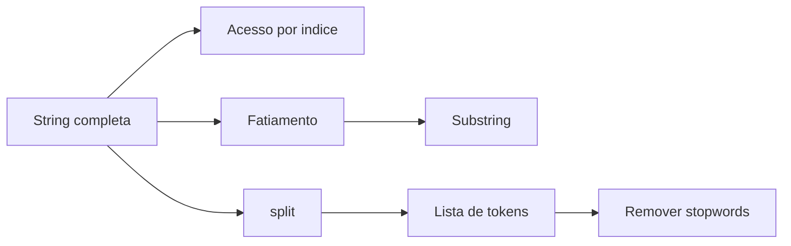

## Visão Geral do Conceito

A segunda aula aprofunda strings como sequências. A transcrição explica que uma string pode ser entendida como lista de caracteres, aceita indexação, slicing e depois pode ser tokenizada para iniciar o pré-processamento em linguagem natural.

> **Ideia central:** se texto é sequência, você pode acessar partes; se texto vira lista de tokens, você pode filtrar palavras e preparar análise.

**Não coberto no material:** a aula cita modelos de linguagem e tokens, mas não implementa modelos nem embeddings.

## Modelo Mental

Uma string funciona como uma régua de caracteres. O índice positivo anda da esquerda para a direita; o negativo anda do final para o começo; o slicing recorta faixas.



## Mecânica Central

```python
texto = "Alo Python"
print(texto[0])
print(texto[-1])
print(texto[4:])
print(texto[::-1])
```

O slicing usa <mark style="background-color: #242424; padding: 2px 4px; border-radius: 3px; color: inherit;">`inicio:fim:passo`</mark>. Para tokenização simples, a aula usa <mark style="background-color: #242424; padding: 2px 4px; border-radius: 3px; color: inherit;">`split()`</mark>.

```python
texto = "copom avalia inflacao e juros"
tokens = texto.split()
print(tokens)
```

## Uso Prático

```python
texto = "Copom avalia inflação e juros."
stopwords = ["e", "a", "o", "de", "do", "da"]

texto_normalizado = texto.lower().replace(".", "")
tokens = texto_normalizado.split()
sem_stopwords = []

for token in tokens:
    if token not in stopwords:
        sem_stopwords.append(token)

texto_final = " ".join(sem_stopwords)
print(sem_stopwords)
print(texto_final)
```

## Erros Comuns

- Acessar índice fora da string gera <mark style="background-color: #242424; padding: 2px 4px; border-radius: 3px; color: inherit;">`IndexError`</mark>.
- No slice, o índice final não é incluído.
- Tokenizar sem remover pontuação cria tokens diferentes, como <mark style="background-color: #242424; padding: 2px 4px; border-radius: 3px; color: inherit;">`juros.`</mark> e <mark style="background-color: #242424; padding: 2px 4px; border-radius: 3px; color: inherit;">`juros`</mark>.

## Visão Geral de Debugging

1. Imprima a string original e a normalizada.
2. Mostre a lista retornada por <mark style="background-color: #242424; padding: 2px 4px; border-radius: 3px; color: inherit;">`split()`</mark>.
3. Compare <mark style="background-color: #242424; padding: 2px 4px; border-radius: 3px; color: inherit;">`len(tokens)`</mark> antes e depois das stopwords.
4. Teste índices em strings pequenas antes de textos longos.

## Principais Pontos

- Índices começam em zero.
- Índices negativos acessam do fim para o começo.
- Slicing extrai partes e pode inverter strings.
- Tokenização simples pode ser feita com split.
- Stopwords podem reduzir ruído para certas análises.

## Preparação para Prática

Pratique acessar caracteres, fatiar substrings, inverter strings, tokenizar texto e filtrar tokens com stopwords.

## Laboratório de Prática

### Easy — Acessar caracteres de um código

Extraia partes de uma string usando índices.

```python
codigo = "AB-2026-XYZ"

primeiro = ""  # TODO
ultimo = ""    # TODO
prefixo = ""   # TODO

print(primeiro, ultimo, prefixo)
```

Critérios:

- usar índice positivo

- usar índice negativo

- usar slicing


### Medium — Remover stopwords simples

Filtre palavras de ligação de um texto tokenizado.

```python
texto = "copom avalia inflacao e juros no brasil"
stopwords = ["e", "no", "a", "o"]

# TODO: quebrar texto em tokens
# TODO: criar lista sem stopwords
filtrados = []

print(filtrados)
```

Critérios:

- usar split

- usar for e if

- não alterar stopwords


### Hard — Preparar texto e reconstruir string

Execute normalização, filtragem e reconstrução com join.

```python
texto = "Copom, juros e inflacao."
stopwords = ["e"]

# TODO: normalizar caixa
# TODO: remover virgula e ponto
# TODO: tokenizar, filtrar e juntar
resultado = ""

print(resultado)
```

Critérios:

- usar lower e replace

- usar split

- usar join


<!-- CONCEPT_EXTRACTION
concepts:
  - indexação
  - índices negativos
  - slicing
  - strings como sequência
  - tokenização
  - stopwords
  - normalização de texto
  - split
  - join
skills:
  - Acessar caracteres por índice
  - Fatiar strings com início fim e passo
  - Tokenizar texto com split
  - Remover stopwords com laço e condicional
  - Reconstruir texto com join
examples:
  - string-indices-positivos-negativos
  - slicing-inversao-string
  - tokenizacao-stopwords-copom
-->

<!-- EXERCISES_JSON
[
  {
    "id": "indexacao-acessar-caracteres-de-um-codigo",
    "slug": "indexacao-acessar-caracteres-de-um-codigo",
    "difficulty": "easy",
    "title": "Acessar caracteres de um código",
    "discipline": "python-processamento-dados",
    "editorLanguage": "python",
    "tags": [
      "python",
      "strings",
      "tokens"
    ],
    "summary": "Extraia partes de uma string usando índices."
  },
  {
    "id": "indexacao-remover-stopwords-simples",
    "slug": "indexacao-remover-stopwords-simples",
    "difficulty": "medium",
    "title": "Remover stopwords simples",
    "discipline": "python-processamento-dados",
    "editorLanguage": "python",
    "tags": [
      "python",
      "strings",
      "tokens"
    ],
    "summary": "Filtre palavras de ligação de um texto tokenizado."
  },
  {
    "id": "indexacao-preparar-texto-e-reconstruir-string",
    "slug": "indexacao-preparar-texto-e-reconstruir-string",
    "difficulty": "hard",
    "title": "Preparar texto e reconstruir string",
    "discipline": "python-processamento-dados",
    "editorLanguage": "python",
    "tags": [
      "python",
      "strings",
      "tokens"
    ],
    "summary": "Execute normalização, filtragem e reconstrução com join."
  }
]
-->

<!-- LESSON_METADATA
suggested_lesson_entry:
  discipline: python-processamento-dados
  slug: indexacao-fatiamento-tokenizacao-textos
  title: "Indexação, fatiamento e tokenização inicial de textos"
  order: 2
  file: python-processamento-dados/aula-02-indexacao-fatiamento-tokenizacao-textos.md
-->

<!-- SOURCE_CONTEXT
source_transcript_vtt: downloads/Python_para_Processamento_de_Dados/Aula_02_-_22042026.vtt
source_transcript_vtt_sha256: 1928d8a3cb64aae869920492a91e907f85ac2dbc1ef7f4edca4b833af81e4a87
source_transcript_wrapper: downloads/Python_para_Processamento_de_Dados/Aula_02_-_22042026.md
source_transcript_wrapper_sha256: 6d93cc4f6fe53a905e3dd40846d9855453b8fba50d67c8f7d1581c89c53a62c0
notes:
  - O wrapper Markdown contém apenas metadados; o VTT foi usado como fonte primária.
  - Contexto auxiliar limitado ao wrapper claramente correspondente à mesma sessão.
-->
