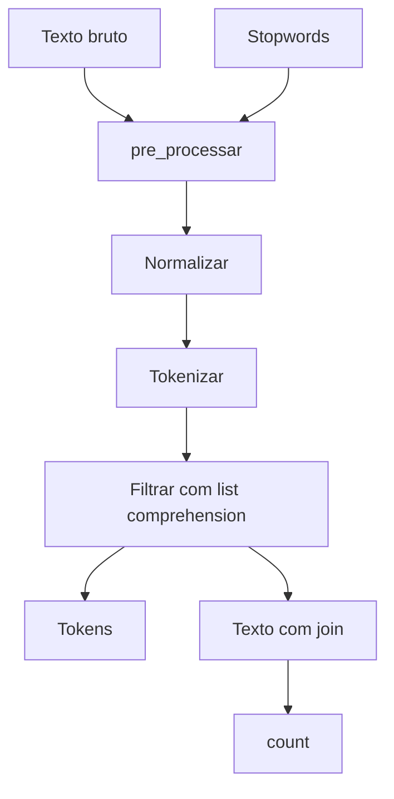

## Visão Geral do Conceito

A terceira aula transforma as etapas anteriores em uma função reutilizável. O texto da ata do Copom serve de base para normalizar, tokenizar, remover stopwords, reconstruir texto com join e contar ocorrências com count.

> **Ideia central:** funções tornam um fluxo de limpeza textual repetível, testável e mais fácil de aplicar em vários textos.

**Não coberto no material:** a aula cita embeddings e vetores semânticos como contexto de PLN, mas a implementação fica no pré-processamento textual simples.

## Modelo Mental

Uma função de pré-processamento é uma esteira: recebe texto e stopwords, aplica transformações e devolve tokens e texto processado.



## Mecânica Central

```python
def pre_processar(texto, stopwords):
    texto = texto.lower().replace(".", "")
    tokens = texto.split()
    tokens = [token for token in tokens if token not in stopwords]
    texto_processado = " ".join(tokens)
    return tokens, texto_processado
```

A função tem parâmetros, usa <mark style="background-color: #242424; padding: 2px 4px; border-radius: 3px; color: inherit;">`list comprehension`</mark> e retorna dois valores. Para uma palavra isolada, <mark style="background-color: #242424; padding: 2px 4px; border-radius: 3px; color: inherit;">`count()`</mark> simplifica a contagem.

## Uso Prático

```python
stopwords = ["e", "a", "o", "de", "do", "da", "em"]
ata = "Copom avalia inflacao e Copom acompanha juros."

tokens, texto_processado = pre_processar(ata, stopwords)
print(tokens)
print(texto_processado)
print(texto_processado.count("copom"))
```

## Erros Comuns

- Esquecer os dois-pontos no <mark style="background-color: #242424; padding: 2px 4px; border-radius: 3px; color: inherit;">`def`</mark>, erro observado na aula.
- Misturar lista de tokens com texto reconstruído.
- Contar sem normalizar caixa: Python diferencia <mark style="background-color: #242424; padding: 2px 4px; border-radius: 3px; color: inherit;">`Copom`</mark> de <mark style="background-color: #242424; padding: 2px 4px; border-radius: 3px; color: inherit;">`copom`</mark>.

## Visão Geral de Debugging

1. Teste a função com texto pequeno.
2. Imprima tokens antes e depois da filtragem.
3. Confirme que o retorno tem dois valores.
4. Compare uma contagem manual com <mark style="background-color: #242424; padding: 2px 4px; border-radius: 3px; color: inherit;">`count()`</mark>.

## Principais Pontos

- Funções tornam o pré-processamento reutilizável.
- Parâmetros permitem trocar texto e stopwords.
- List comprehension filtra listas de forma compacta.
- join reconstrói texto a partir de tokens.
- count mede ocorrências em strings.

## Preparação para Prática

Pratique escrever funções pequenas que recebam texto, retornem tokens e texto processado, e contem ocorrências de termos.

## Laboratório de Prática

### Easy — Função de normalização

Complete uma função que normaliza caixa e remove ponto.

```python
def normalizar_texto(texto):
    # TODO: converter para caixa baixa
    # TODO: remover ponto final
    return texto

print(normalizar_texto("Copom acompanha juros."))
```

Critérios:

- definir função

- usar lower

- usar replace


### Medium — Função com stopwords

Use list comprehension para remover stopwords.

```python
def remover_stopwords(texto, stopwords):
    tokens = texto.lower().split()
    # TODO: criar tokens_filtrados
    tokens_filtrados = []
    return tokens_filtrados

print(remover_stopwords("copom e juros no brasil", ["e", "no"]))
```

Critérios:

- usar split

- usar list comprehension

- retornar lista


### Hard — Retornar tokens e contagem

Retorne tokens, texto processado e ocorrência de uma palavra.

```python
def analisar_ocorrencia(texto, stopwords, palavra):
    texto = texto.lower().replace(".", "")
    tokens = [token for token in texto.split() if token not in stopwords]
    texto_processado = " ".join(tokens)
    # TODO: contar ocorrencias
    ocorrencias = 0
    return tokens, texto_processado, ocorrencias

print(analisar_ocorrencia("Copom avalia juros. Copom publica ata.", ["a", "o", "e"], "copom"))
```

Critérios:

- usar join

- usar count

- retornar três valores


<!-- CONCEPT_EXTRACTION
concepts:
  - funções
  - parâmetros
  - retorno múltiplo
  - list comprehension
  - stopwords
  - join
  - count
  - normalização
  - testes simples
skills:
  - Encapsular etapas de limpeza em função
  - Filtrar tokens com list comprehension
  - Retornar lista e string processada
  - Contar ocorrências com count
examples:
  - pre-processar-copom-funcao
  - list-comprehension-stopwords
  - count-ocorrencia-palavra
-->

<!-- EXERCISES_JSON
[
  {
    "id": "funcoes-funcao-de-normalizacao",
    "slug": "funcoes-funcao-de-normalizacao",
    "difficulty": "easy",
    "title": "Função de normalização",
    "discipline": "python-processamento-dados",
    "editorLanguage": "python",
    "tags": [
      "python",
      "funcoes",
      "tokens"
    ],
    "summary": "Complete uma função que normaliza caixa e remove ponto."
  },
  {
    "id": "funcoes-funcao-com-stopwords",
    "slug": "funcoes-funcao-com-stopwords",
    "difficulty": "medium",
    "title": "Função com stopwords",
    "discipline": "python-processamento-dados",
    "editorLanguage": "python",
    "tags": [
      "python",
      "funcoes",
      "tokens"
    ],
    "summary": "Use list comprehension para remover stopwords."
  },
  {
    "id": "funcoes-retornar-tokens-e-contagem",
    "slug": "funcoes-retornar-tokens-e-contagem",
    "difficulty": "hard",
    "title": "Retornar tokens e contagem",
    "discipline": "python-processamento-dados",
    "editorLanguage": "python",
    "tags": [
      "python",
      "funcoes",
      "tokens"
    ],
    "summary": "Retorne tokens, texto processado e ocorrência de uma palavra."
  }
]
-->

<!-- LESSON_METADATA
suggested_lesson_entry:
  discipline: python-processamento-dados
  slug: funcoes-pre-processamento-list-comprehension-contagem
  title: "Funções de pré-processamento, list comprehension e contagem de ocorrências"
  order: 3
  file: python-processamento-dados/aula-03-funcoes-pre-processamento-list-comprehension-contagem.md
-->

<!-- SOURCE_CONTEXT
source_transcript_vtt: downloads/Python_para_Processamento_de_Dados/Aula_03_-_23042026.vtt
source_transcript_vtt_sha256: c57c49e0fe9033fec6a943d912e5f84949539af678ac31640b24f894d9c616f4
source_transcript_wrapper: downloads/Python_para_Processamento_de_Dados/Aula_03_-_23042026.md
source_transcript_wrapper_sha256: e0d8eb0dcca2093fbf3b628188273d4df6934e9c8cddcc3e10c4a2f6ba46bff1
notes:
  - O wrapper Markdown contém apenas metadados; o VTT foi usado como fonte primária.
  - Contexto auxiliar limitado ao wrapper claramente correspondente à mesma sessão.
-->
