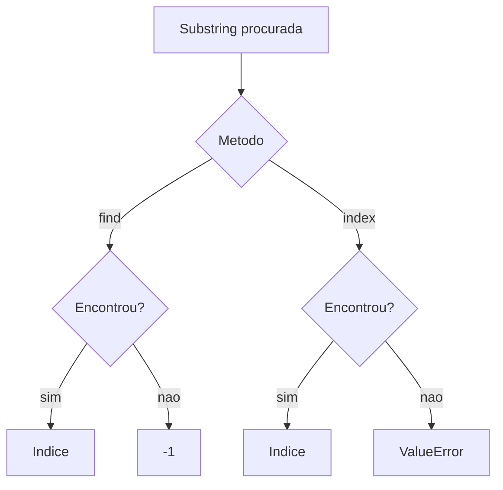

## Visão Geral do Conceito

A quarta aula fecha a revisão de strings com busca de substrings, alinhamento visual e validações de conteúdo. O professor compara find e index, mostra center/ljust/rjust e usa isalpha, isdigit e isnumeric para validar tokens.

> **Ideia central:** em dados incertos, o método escolhido deve combinar resultado útil com comportamento seguro em caso de ausência ou ruído.

**Não coberto no material:** a aula começa a aplicar as validações na função de pré-processamento, mas a versão final fica para continuação.

## Modelo Mental

Buscar em string é procurar uma ocorrência em uma linha de texto. Algumas ferramentas retornam um marcador de ausência; outras disparam erro e exigem tratamento.



## Mecânica Central

```python
texto = "copom avalia inflacao e juros"
print(texto.find("copom"))
print(texto.find("petroleo"))
print(texto.index("copom"))
# texto.index("petroleo")  # ValueError
```

Para a última ocorrência, use <mark style="background-color: #242424; padding: 2px 4px; border-radius: 3px; color: inherit;">`rfind()`</mark> ou <mark style="background-color: #242424; padding: 2px 4px; border-radius: 3px; color: inherit;">`rindex()`</mark>. Para apresentação: <mark style="background-color: #242424; padding: 2px 4px; border-radius: 3px; color: inherit;">`center()`</mark>, <mark style="background-color: #242424; padding: 2px 4px; border-radius: 3px; color: inherit;">`ljust()`</mark> e <mark style="background-color: #242424; padding: 2px 4px; border-radius: 3px; color: inherit;">`rjust()`</mark>.

## Uso Prático

```python
def token_valido(token):
    if token == "":
        return False
    if token.find("class=") != -1:
        return False
    if token.isnumeric():
        return False
    return True

candidatos = ["copom", "class=\"x\"", "2025", "juros"]
validos = [token for token in candidatos if token_valido(token)]
print(validos)
```

## Erros Comuns

- Usar <mark style="background-color: #242424; padding: 2px 4px; border-radius: 3px; color: inherit;">`index()`</mark> sem tratamento em dados incertos pode quebrar o programa.
- Achar que <mark style="background-color: #242424; padding: 2px 4px; border-radius: 3px; color: inherit;">`isalpha()`</mark> aceita espaços; <mark style="background-color: #242424; padding: 2px 4px; border-radius: 3px; color: inherit;">`"alo mundo".isalpha()`</mark> é falso.
- Confundir busca reversa com inversão da string.

## Visão Geral de Debugging

1. Use <mark style="background-color: #242424; padding: 2px 4px; border-radius: 3px; color: inherit;">`find()`</mark> para investigar antes de trocar para <mark style="background-color: #242424; padding: 2px 4px; border-radius: 3px; color: inherit;">`index()`</mark>.
2. Imprima tokens com <mark style="background-color: #242424; padding: 2px 4px; border-radius: 3px; color: inherit;">`repr()`</mark> se houver espaços invisíveis.
3. Teste string vazia explicitamente.

## Principais Pontos

- find retorna índice ou -1.
- index retorna índice ou lança ValueError.
- rfind e rindex localizam a última ocorrência.
- Alinhamento melhora apresentação textual.
- isalpha, isdigit e isnumeric ajudam a filtrar tokens.

## Preparação para Prática

Pratique buscar substrings com segurança, alinhar termos no terminal e construir predicados de validação para tokens.

## Laboratório de Prática

### Easy — Busca segura

Use find para detectar palavra sem interromper o programa.

```python
texto = "copom avalia inflacao"
palavra = "juros"

# TODO: usar find
posicao = -1

if posicao == -1:
    print("nao encontrado")
else:
    print(f"encontrado em {posicao}")
```

Critérios:

- usar find

- testar -1


### Medium — Apresentar tabela simples

Alinhe termos textuais em largura fixa.

```python
linhas = ["copom", "juros", "inflacao"]

for termo in linhas:
    # TODO: imprimir termo alinhado a esquerda em largura 12
    print(termo)
```

Critérios:

- usar ljust ou f-string

- manter uma linha por termo


### Hard — Filtrar tokens inválidos

Remova tokens vazios, numéricos e com marcação.

```python
tokens = ["copom", "2025", "class=\"texto\"", "", "juros"]

validos = []
for token in tokens:
    # TODO: ignorar string vazia
    # TODO: ignorar tokens com class=
    # TODO: ignorar tokens numericos
    validos.append(token)

print(validos)
```

Critérios:

- validar vazio

- usar find

- usar isnumeric


<!-- CONCEPT_EXTRACTION
concepts:
  - find
  - index
  - rfind
  - rindex
  - ValueError
  - center
  - ljust
  - rjust
  - isalpha
  - isdigit
  - isnumeric
  - startswith
  - endswith
skills:
  - Buscar substrings com retorno seguro
  - Evitar crash causado por index sem tratamento
  - Alinhar strings para apresentação
  - Filtrar tokens por regras de validação
examples:
  - find-index-copom
  - center-ljust-rjust-tigre
  - filtro-token-valido
-->

<!-- EXERCISES_JSON
[
  {
    "id": "busca-busca-segura",
    "slug": "busca-busca-segura",
    "difficulty": "easy",
    "title": "Busca segura",
    "discipline": "python-processamento-dados",
    "editorLanguage": "python",
    "tags": [
      "python",
      "strings",
      "validacao"
    ],
    "summary": "Use find para detectar palavra sem interromper o programa."
  },
  {
    "id": "busca-apresentar-tabela-simples",
    "slug": "busca-apresentar-tabela-simples",
    "difficulty": "medium",
    "title": "Apresentar tabela simples",
    "discipline": "python-processamento-dados",
    "editorLanguage": "python",
    "tags": [
      "python",
      "strings",
      "validacao"
    ],
    "summary": "Alinhe termos textuais em largura fixa."
  },
  {
    "id": "busca-filtrar-tokens-invalidos",
    "slug": "busca-filtrar-tokens-invalidos",
    "difficulty": "hard",
    "title": "Filtrar tokens inválidos",
    "discipline": "python-processamento-dados",
    "editorLanguage": "python",
    "tags": [
      "python",
      "strings",
      "validacao"
    ],
    "summary": "Remova tokens vazios, numéricos e com marcação."
  }
]
-->

<!-- LESSON_METADATA
suggested_lesson_entry:
  discipline: python-processamento-dados
  slug: busca-alinhamento-validacao-strings
  title: "Busca, alinhamento e validação de strings em pré-processamento"
  order: 4
  file: python-processamento-dados/aula-04-busca-alinhamento-validacao-strings.md
-->

<!-- SOURCE_CONTEXT
source_transcript_vtt: downloads/Python_para_Processamento_de_Dados/Aula_04_-_25042026.vtt
source_transcript_vtt_sha256: c0b071c1eacecfcddd63b4303e9d6c326f1659d0ad3e6ff3d5e1c8762201f873
source_transcript_wrapper: downloads/Python_para_Processamento_de_Dados/Aula_04_-_25042026.md
source_transcript_wrapper_sha256: 74fa799dcfded2503f2b1a724c93ee81e8751b3337d8de41dec03d8da7b9e16e
notes:
  - O wrapper Markdown contém apenas metadados; o VTT foi usado como fonte primária.
  - Contexto auxiliar limitado ao wrapper claramente correspondente à mesma sessão.
-->
