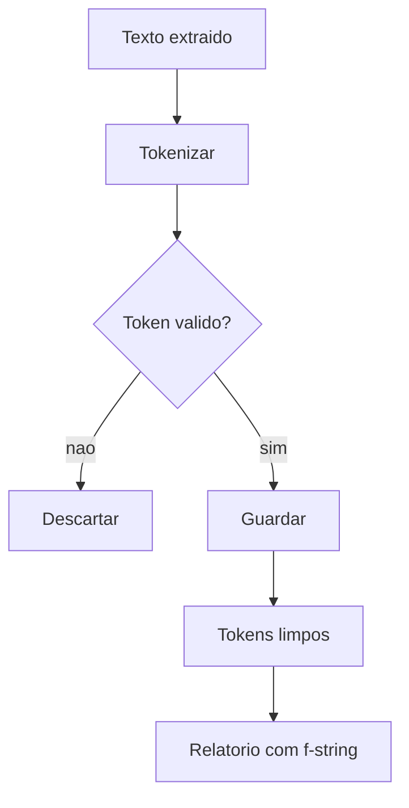

## Visão Geral do Conceito

A quinta aula continua a melhoria da função de pré-processamento. Ao aplicar a função a texto extraído do Banco Central, aparecem tokens estranhos, o que motiva validações adicionais. Depois, a aula compara formas de formatar strings e introduz coleções.

> **Ideia central:** pré-processamento real melhora por inspeção: observar ruídos, criar uma regra pequena, testar e repetir.

**Não coberto no material:** a aula contém uma discussão ampla sobre mercado e IA; esta lição usa apenas o conteúdo técnico de strings, limpeza e coleções.

## Modelo Mental

A primeira versão da limpeza serve para texto controlado; a segunda versão precisa lidar com ruídos como marcação, números e pontuação grudada.



## Mecânica Central

```python
def token_valido(token):
    if token.find("class=") != -1:
        return False
    if token.isnumeric():
        return False
    return True
```

A aula também compara composição clássica, <mark style="background-color: #242424; padding: 2px 4px; border-radius: 3px; color: inherit;">`format()`</mark> e f-string.

```python
idade = 34
linguagem = "Python"
print("Idade: {}".format(idade))
print(f"{linguagem} processa dados")
```

Coleções aparecem como variáveis que armazenam múltiplos valores: listas mutáveis, tuplas imutáveis e dicionários chave-valor.

## Uso Prático

```python
def limpar_tokens(tokens):
    limpos = []
    for token in tokens:
        if token == "":
            continue
        if token.find("class=") != -1:
            continue
        if token.isnumeric():
            continue
        limpos.append(token)
    return limpos

brutos = ["copom", "class=\"texto\"", "2025", "juros", ""]
limpos = limpar_tokens(brutos)
print(f"Tokens validos: {len(limpos)}")
print(limpos)
```

## Erros Comuns

- Tentar resolver todos os ruídos sem inspecionar tokens reais.
- Usar <mark style="background-color: #242424; padding: 2px 4px; border-radius: 3px; color: inherit;">`index()`</mark> onde <mark style="background-color: #242424; padding: 2px 4px; border-radius: 3px; color: inherit;">`find()`</mark> é mais seguro.
- Confundir formatar string com apenas concatenar strings.

## Visão Geral de Debugging

1. Mostre os primeiros tokens problemáticos.
2. Crie uma regra para um problema por vez.
3. Compare lista antes/depois.
4. Use f-string para imprimir quantidades e facilitar inspeção.

## Principais Pontos

- Dados textuais reais podem trazer HTML, números e pontuação grudada.
- Regras de validação devem ser testadas em tokens observados.
- F-strings são diretas para compor mensagens.
- Coleções guardam múltiplos valores.
- Listas são mutáveis; tuplas são imutáveis.

## Preparação para Prática

Pratique criar filtros incrementais para tokens, relatar resultados com f-strings e explicar a diferença inicial entre listas, tuplas e dicionários.

## Laboratório de Prática

### Easy — Reportar quantidade com f-string

Crie uma mensagem de relatório usando uma lista de tokens.

```python
tokens = ["copom", "juros", "inflacao"]

# TODO: criar mensagem com f-string informando a quantidade
mensagem = ""
print(mensagem)
```

Critérios:

- usar f-string

- usar len


### Medium — Limpar tokens numéricos

Remova tokens formados apenas por números.

```python
tokens = ["copom", "2025", "juros", "123", "inflacao"]

limpos = []
for token in tokens:
    # TODO: adicionar somente tokens nao numericos
    pass

print(limpos)
```

Critérios:

- usar isnumeric

- preservar ordem


### Hard — Filtragem incremental de tokens ruidosos

Combine regras para remover marcação, números e pontuação residual.

```python
tokens = ["copom", "class=\"x\"", "cenario,", "2025", "juros"]

limpos = []
for token in tokens:
    # TODO: ignorar class=
    # TODO: ignorar numericos
    # TODO: remover virgula final
    pass

print(f"Tokens finais: {limpos}")
```

Critérios:

- usar find

- usar isnumeric

- usar replace


<!-- CONCEPT_EXTRACTION
concepts:
  - pré-processamento robusto
  - tokens inválidos
  - find
  - isnumeric
  - formatação de strings
  - format
  - f-strings
  - coleções
  - listas
  - tuplas
  - mutabilidade
skills:
  - Criar regras incrementais de limpeza
  - Descartar tokens inválidos
  - Compor mensagens com f-strings
  - Diferenciar listas e tuplas por mutabilidade
examples:
  - token-valido-class-numerico
  - formatacao-fstring-relatorio
  - introducao-colecoes-lista-tupla-dicionario
-->

<!-- EXERCISES_JSON
[
  {
    "id": "limpeza-reportar-quantidade-com-f-string",
    "slug": "limpeza-reportar-quantidade-com-f-string",
    "difficulty": "easy",
    "title": "Reportar quantidade com f-string",
    "discipline": "python-processamento-dados",
    "editorLanguage": "python",
    "tags": [
      "python",
      "tokens",
      "colecoes"
    ],
    "summary": "Crie uma mensagem de relatório usando uma lista de tokens."
  },
  {
    "id": "limpeza-limpar-tokens-numericos",
    "slug": "limpeza-limpar-tokens-numericos",
    "difficulty": "medium",
    "title": "Limpar tokens numéricos",
    "discipline": "python-processamento-dados",
    "editorLanguage": "python",
    "tags": [
      "python",
      "tokens",
      "colecoes"
    ],
    "summary": "Remova tokens formados apenas por números."
  },
  {
    "id": "limpeza-filtragem-incremental-de-tokens-ruidosos",
    "slug": "limpeza-filtragem-incremental-de-tokens-ruidosos",
    "difficulty": "hard",
    "title": "Filtragem incremental de tokens ruidosos",
    "discipline": "python-processamento-dados",
    "editorLanguage": "python",
    "tags": [
      "python",
      "tokens",
      "colecoes"
    ],
    "summary": "Combine regras para remover marcação, números e pontuação residual."
  }
]
-->

<!-- LESSON_METADATA
suggested_lesson_entry:
  discipline: python-processamento-dados
  slug: limpeza-tokens-formatacao-strings-colecoes
  title: "Limpeza robusta de tokens, formatação de strings e introdução a coleções"
  order: 5
  file: python-processamento-dados/aula-05-limpeza-tokens-formatacao-strings-colecoes.md
-->

<!-- SOURCE_CONTEXT
source_transcript_vtt: downloads/Python_para_Processamento_de_Dados/Aula_05_-_27042026.vtt
source_transcript_vtt_sha256: f7c2abed189bff78c0aa4c704b9f8180d11f86bfc6ff55a1c1616e28ace96c65
source_transcript_wrapper: downloads/Python_para_Processamento_de_Dados/Aula_05_-_27042026.md
source_transcript_wrapper_sha256: 4bd4677d082decaff7f7e8f6d7337f4fd0f387c9d140614c8e2c491033b87dc8
notes:
  - O wrapper Markdown contém apenas metadados; o VTT foi usado como fonte primária.
  - Contexto auxiliar limitado ao wrapper claramente correspondente à mesma sessão.
-->
