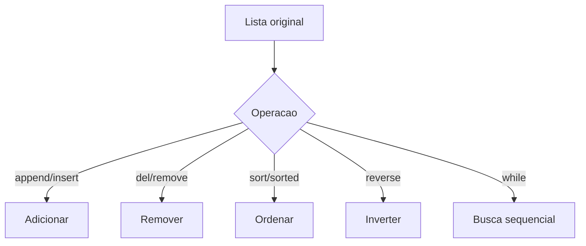

## Visão Geral do Conceito

A sexta aula aprofunda listas, uma coleção mutável muito usada em Python. A transcrição trabalha com frutas e números para mostrar adição, remoção, filtragem, ordenação, inversão e busca sequencial.

> **Ideia central:** listas são sequências mutáveis: você pode crescer, reduzir, reorganizar e pesquisar valores durante o processamento.

**Não coberto no material:** a aula discute várias alternativas de remoção; a lição prioriza as formas demonstradas explicitamente.

## Modelo Mental

Uma lista tem posições e valores. Operações podem mudar a própria lista ou produzir uma nova lista; distinguir isso evita efeitos colaterais.



## Mecânica Central

```python
frutas = ["maca", "banana", "laranja"]
frutas.append("uva")
frutas.insert(1, "jabuticaba")
del frutas[0]
frutas.remove("banana")
print(frutas)
```

Para remover todas as ocorrências, a aula aponta soluções programáticas, incluindo <mark style="background-color: #242424; padding: 2px 4px; border-radius: 3px; color: inherit;">`list comprehension`</mark>.

```python
frutas = [fruta for fruta in frutas if fruta != "morango"]
```

Ordenação: <mark style="background-color: #242424; padding: 2px 4px; border-radius: 3px; color: inherit;">`sort()`</mark> altera a lista; <mark style="background-color: #242424; padding: 2px 4px; border-radius: 3px; color: inherit;">`sorted()`</mark> retorna nova lista; <mark style="background-color: #242424; padding: 2px 4px; border-radius: 3px; color: inherit;">`reverse()`</mark> só inverte a ordem atual.

## Uso Prático

```python
lista = [17, 8, 10, -3, 39, 0, -24]
ocorrencia = 0
indice = 0
achou = False

while indice < len(lista) and not achou:
    if lista[indice] == ocorrencia:
        achou = True
    else:
        indice += 1

if achou:
    print(f"{ocorrencia} encontrada na posicao {indice}")
else:
    print("nao encontrada")
```

## Erros Comuns

- Usar <mark style="background-color: #242424; padding: 2px 4px; border-radius: 3px; color: inherit;">`remove()`</mark> esperando apagar todas as ocorrências; ele remove a primeira.
- Chamar <mark style="background-color: #242424; padding: 2px 4px; border-radius: 3px; color: inherit;">`sorted(lista)`</mark> sem guardar o retorno.
- Achar que <mark style="background-color: #242424; padding: 2px 4px; border-radius: 3px; color: inherit;">`reverse()`</mark> ordena; ele apenas inverte.

## Visão Geral de Debugging

1. Imprima a lista antes e depois da operação.
2. Verifique <mark style="background-color: #242424; padding: 2px 4px; border-radius: 3px; color: inherit;">`len(lista)`</mark> após remoções.
3. Em busca sequencial, confirme se o índice incrementa.
4. Ao filtrar, prefira criar nova lista para evitar pular elementos.

## Principais Pontos

- Listas são mutáveis e ordenadas por posição.
- append adiciona no final; insert adiciona por índice.
- del remove por índice; remove remove por valor.
- sorted cria nova lista; sort altera a original.
- Busca sequencial percorre elemento por elemento.

## Preparação para Prática

Pratique adicionar, remover, filtrar, ordenar e procurar valores em listas pequenas antes de usar listas de dados maiores.

## Laboratório de Prática

### Easy — Adicionar frutas

Adicione elementos no fim e em posição específica.

```python
frutas = ["maca", "banana"]

# TODO: adicionar "laranja" no final
# TODO: inserir "uva" na posicao 1

print(frutas)
```

Critérios:

- usar append

- usar insert


### Medium — Remover status indesejado

Crie uma nova lista sem status de erro.

```python
status = ["ok", "erro", "ok", "erro", "pendente"]

# TODO: criar nova lista sem "erro"
sem_erro = []

print(sem_erro)
```

Critérios:

- usar list comprehension

- remover todas as ocorrências


### Hard — Busca sequencial de evento

Implemente uma busca sequencial com while.

```python
eventos = [101, 205, 300, 404, 500]
procurado = 404
indice = 0
achou = False

# TODO: percorrer eventos com while ate achar ou acabar

if achou:
    print(f"Evento encontrado na posicao {indice}")
else:
    print("Evento nao encontrado")
```

Critérios:

- controlar índice

- parar ao encontrar

- tratar não encontrado


<!-- CONCEPT_EXTRACTION
concepts:
  - listas
  - mutabilidade
  - append
  - insert
  - del
  - remove
  - list comprehension
  - sort
  - sorted
  - reverse
  - busca sequencial
  - operador in
skills:
  - Adicionar elementos em listas
  - Remover valores por índice e ocorrência
  - Filtrar listas criando nova coleção
  - Ordenar preservando ou alterando original
  - Implementar busca sequencial
examples:
  - lista-frutas-append-insert-remove
  - list-comprehension-remover-morango
  - busca-sequencial-numeros
-->

<!-- EXERCISES_JSON
[
  {
    "id": "listas-adicionar-frutas",
    "slug": "listas-adicionar-frutas",
    "difficulty": "easy",
    "title": "Adicionar frutas",
    "discipline": "python-processamento-dados",
    "editorLanguage": "python",
    "tags": [
      "python",
      "listas",
      "busca"
    ],
    "summary": "Adicione elementos no fim e em posição específica."
  },
  {
    "id": "listas-remover-status-indesejado",
    "slug": "listas-remover-status-indesejado",
    "difficulty": "medium",
    "title": "Remover status indesejado",
    "discipline": "python-processamento-dados",
    "editorLanguage": "python",
    "tags": [
      "python",
      "listas",
      "busca"
    ],
    "summary": "Crie uma nova lista sem status de erro."
  },
  {
    "id": "listas-busca-sequencial-de-evento",
    "slug": "listas-busca-sequencial-de-evento",
    "difficulty": "hard",
    "title": "Busca sequencial de evento",
    "discipline": "python-processamento-dados",
    "editorLanguage": "python",
    "tags": [
      "python",
      "listas",
      "busca"
    ],
    "summary": "Implemente uma busca sequencial com while."
  }
]
-->

<!-- LESSON_METADATA
suggested_lesson_entry:
  discipline: python-processamento-dados
  slug: listas-mutaveis-insercao-remocao-ordenacao-busca
  title: "Listas mutáveis: inserção, remoção, ordenação e busca sequencial"
  order: 6
  file: python-processamento-dados/aula-06-listas-mutaveis-insercao-remocao-ordenacao-busca.md
-->

<!-- SOURCE_CONTEXT
source_transcript_vtt: downloads/Python_para_Processamento_de_Dados/Aula_06_-_29042026.vtt
source_transcript_vtt_sha256: 3b9932cded2271d8a3082da11b8fecfffe1f40e8a0091fefc824da59f9c36205
source_transcript_wrapper: downloads/Python_para_Processamento_de_Dados/Aula_06_-_29042026.md
source_transcript_wrapper_sha256: 7f91787dc2c4cb35143bc881744ebe525bdff7c0fda024bd6f07fa41d0cff892
notes:
  - O wrapper Markdown contém apenas metadados; o VTT foi usado como fonte primária.
  - Contexto auxiliar limitado ao wrapper claramente correspondente à mesma sessão.
-->
